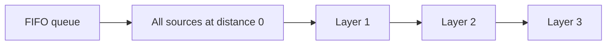

# Breadth-First Search

## At a Glance

Breadth-first search (BFS) explores states in increasing number of edges from a source.
That layer order makes it the default for shortest paths in unweighted graphs and for
simulations that spread one step per unit of time.

| Signal in the prompt | BFS interpretation |
|---|---|
| Minimum moves in an unweighted graph | First arrival is a shortest path |
| Spread, infection, fire, or simultaneous growth | Multi-source BFS |
| Nodes grouped by distance or level | Process one queue layer at a time |
| Grid movement with uniform step cost | Cells are graph vertices |

**Core invariant:** when a state leaves the queue, its recorded distance is the minimum
number of unweighted edges from the nearest source.

For `V` vertices and `E` edges, BFS takes O(V + E) time and O(V) extra space. A grid with
`rows * columns` cells takes O(rows * columns) time and space.

## Interview Method

1. **Clarify the state graph.** Define one state, its legal neighbors, all starting
   states, and whether every move has equal cost.
2. **State the direct approach.** Enumerating all paths repeats states exponentially;
   BFS avoids that by retaining only the earliest visit.
3. **Check the weight condition.** Uniform edge costs fit BFS. Different nonnegative
   costs require Dijkstra's algorithm instead.
4. **Define queue and visited invariants.** The queue contains discovered but unprocessed
   states. Mark a state when it is enqueued, not when it is later dequeued.
5. **Dry-run complete layers.** For time-based problems, seed all simultaneous sources
   before minute zero and process the current queue size as one layer.
6. **Implement neighbor generation separately.** Check bounds, validity, and visited
   state before enqueueing.
7. **Test unreachable and already-complete inputs.** These reveal incorrect time and
   termination handling.
8. **State complexity over states and transitions.** Count each state and edge at most
   once rather than describing the queue operations alone.

## How It Works

The queue is first-in, first-out. Every state at distance `d` is enqueued before any
state at distance `d + 1` can be processed. Therefore, the first discovery of a state is
through a shortest unweighted path.



With multiple sources, enqueue every source with distance zero. This is equivalent to
adding a virtual super-source with a zero-cost edge to each real source. Each state then
receives its distance from the nearest source.

## Reusable C++ Template

This template returns shortest distances from one source in an adjacency-list graph.
Unreachable vertices remain `-1`.

```cpp
#include <queue>
#include <vector>

std::vector<int> bfsDistances(
    const std::vector<std::vector<int>>& graph,
    int source
) {
    std::vector<int> distance(graph.size(), -1);
    if (source < 0 || source >= static_cast<int>(graph.size())) return distance;

    std::queue<int> pending;
    pending.push(source);
    distance[source] = 0;

    while (!pending.empty()) {
        int node = pending.front();
        pending.pop();

        for (int neighbor : graph[node]) {
            if (distance[neighbor] != -1) continue;
            distance[neighbor] = distance[node] + 1;
            pending.push(neighbor);
        }
    }

    return distance;
}
```

Using `distance != -1` as the visited check keeps discovery state and shortest distance
in one array.

## Worked Problems

### Rotting Oranges

**Problem:** Each minute, every rotten orange rots its four-directionally adjacent fresh
oranges. Return the minutes until none are fresh, or `-1` when some can never be reached.

**Recognition:** This is simultaneous unit-time spread on a grid. A separate BFS from
each rotten orange repeats work; one multi-source BFS models all spread fronts together.

**Invariant:** before a layer starts, the queue contains exactly the rotten cells that
can spread at the current minute. A fresh cell is changed to rotten when enqueued, so it
can enter the queue only once.

```cpp
#include <queue>
#include <utility>
#include <vector>

int orangesRotting(std::vector<std::vector<int>>& grid) {
    if (grid.empty() || grid.front().empty()) return 0;

    const int rows = static_cast<int>(grid.size());
    const int columns = static_cast<int>(grid.front().size());
    const int directions[4][2] = {{1, 0}, {-1, 0}, {0, 1}, {0, -1}};
    std::queue<std::pair<int, int>> pending;
    int fresh = 0;

    for (int row = 0; row < rows; ++row) {
        for (int column = 0; column < columns; ++column) {
            if (grid[row][column] == 2) pending.push({row, column});
            if (grid[row][column] == 1) ++fresh;
        }
    }

    int minutes = 0;
    while (!pending.empty() && fresh > 0) {
        int layerSize = static_cast<int>(pending.size());
        bool rottedAny = false;

        while (layerSize-- > 0) {
            auto [row, column] = pending.front();
            pending.pop();

            for (const auto& direction : directions) {
                int nextRow = row + direction[0];
                int nextColumn = column + direction[1];
                if (nextRow < 0 || nextRow >= rows ||
                    nextColumn < 0 || nextColumn >= columns ||
                    grid[nextRow][nextColumn] != 1) {
                    continue;
                }

                grid[nextRow][nextColumn] = 2;
                --fresh;
                rottedAny = true;
                pending.push({nextRow, nextColumn});
            }
        }

        if (rottedAny) ++minutes;
    }

    return fresh == 0 ? minutes : -1;
}
```

**Why it is correct:** all initially rotten oranges begin in layer zero. Inductively,
processing layer `m` enqueues every fresh orange one edge away and no other cell, so those
cells become rotten at minute `m + 1`. Marking on enqueue prevents duplicate work. If
fresh oranges remain after the queue empties, no path from any source reaches them.

**Complexity:** O(rows * columns) time and O(rows * columns) queue space in the worst
case.

**Edge cases:** no fresh oranges returns `0`; fresh oranges with no source return `-1`;
an isolated fresh region remains unreachable; an empty grid returns `0` defensively.

## Failure Modes

- Mark visited on dequeue, allowing the same state to be enqueued by several parents.
- Start one BFS per source instead of placing all sources in layer zero.
- Increment time for a queue layer that does not change any fresh cell.
- Use BFS when edge costs differ, invalidating the first-arrival shortest-path argument.
- Forget that a grid is empty before reading `grid.front()`.
- Mutate shared state too late and process a cell more than once.

## Recall Drill

1. Why does first discovery give a shortest path only for equal edge costs?
2. When should a vertex be marked visited?
3. How does multi-source BFS differ from running BFS repeatedly?
4. What does one queue layer represent in a spread simulation?
5. Which input makes Rotting Oranges return `-1`?

## Related Topics

- [Disjoint Set Union](DSU.md) answers connectivity questions when edges are added, but
  it does not recover shortest paths.
- [Heaps](Heap.md) replace the FIFO queue when the next state must be chosen by smallest
  accumulated cost rather than by insertion order.
