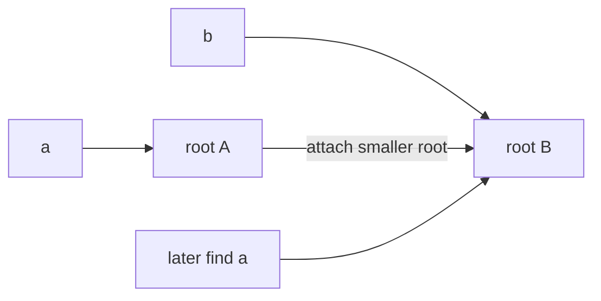

# Disjoint Set Union

## At a Glance

Disjoint Set Union (DSU), also called Union-Find, maintains a partition of elements into
connected components while connections are added.

| Signal in the prompt | DSU operation |
|---|---|
| Are two items connected? | Compare representatives with `find` |
| Merge groups over time | `unite` their representatives |
| Adding an edge creates a cycle | Endpoints already share a representative |
| Minimum spanning tree with sorted edges | Kruskal plus successful unions |

**Core invariant:** two elements are in the same component if and only if `find` returns
the same representative for both.

With path compression and union by size or rank, a sequence of operations takes
O(alpha(n)) amortized time per operation, effectively constant for practical inputs.
Storage is O(n).

## Interview Method

1. **Clarify update direction.** DSU handles edge additions well, but arbitrary edge
   deletion requires a different or offline technique.
2. **State the traversal baseline.** DFS or BFS can answer one connectivity query, but
   repeating traversal after many unions is wasteful.
3. **Identify component identity.** If the problem needs only whether items belong to the
   same group, full paths are unnecessary.
4. **Define the representative invariant.** Every parent chain ends at a root whose
   parent is itself.
5. **Choose both optimizations.** Path compression flattens searches; union by size keeps
   trees shallow before compression.
6. **Use the return value of union.** `false` means the edge was redundant and often
   signals a cycle.
7. **Test duplicate and self edges.** They should not change component count or size.
8. **Separate DSU cost from surrounding work.** Kruskal is dominated by sorting, not by
   Union-Find operations.

## How It Works

Initially, each element is a one-node tree and its own representative. `unite(a, b)`
finds both roots and attaches the smaller tree beneath the larger. `find(x)` recursively
rewrites every visited parent to point directly to the root.



Path compression changes the tree shape but not component membership. Union by size
changes which valid representative is selected but not which elements are grouped.

## Reusable C++ Template

```cpp
#include <numeric>
#include <utility>
#include <vector>

class DisjointSet {
public:
    explicit DisjointSet(int count)
        : parent_(count), size_(count, 1), components_(count) {
        std::iota(parent_.begin(), parent_.end(), 0);
    }

    int find(int node) {
        if (parent_[node] != node) parent_[node] = find(parent_[node]);
        return parent_[node];
    }

    bool unite(int a, int b) {
        a = find(a);
        b = find(b);
        if (a == b) return false;

        if (size_[a] < size_[b]) std::swap(a, b);
        parent_[b] = a;
        size_[a] += size_[b];
        --components_;
        return true;
    }

    bool connected(int a, int b) {
        return find(a) == find(b);
    }

    int components() const {
        return components_;
    }

private:
    std::vector<int> parent_;
    std::vector<int> size_;
    int components_;
};
```

Only roots have authoritative `size_` values. Reading the size of a non-root without
first finding its representative is a common source of bugs.

## Worked Problems

### Minimum Cost to Connect All Points

**Problem:** Connect all points with minimum total Manhattan edge cost.

**Recognition:** All pairs define a weighted undirected graph, and the desired connected
subgraph with minimum total weight is a minimum spanning tree. Kruskal's algorithm sorts
edges and uses DSU to reject cycle-forming edges.

**Invariant:** after processing an edge prefix, the selected edges form a minimum-weight
forest that can be extended to a minimum spanning tree. A successful union connects two
different trees; a failed union would create a cycle.

```cpp
#include <algorithm>
#include <cstdlib>
#include <numeric>
#include <utility>
#include <vector>

class DisjointSet {
public:
    explicit DisjointSet(int count) : parent_(count), size_(count, 1) {
        std::iota(parent_.begin(), parent_.end(), 0);
    }

    int find(int node) {
        if (parent_[node] != node) parent_[node] = find(parent_[node]);
        return parent_[node];
    }

    bool unite(int a, int b) {
        a = find(a);
        b = find(b);
        if (a == b) return false;
        if (size_[a] < size_[b]) std::swap(a, b);
        parent_[b] = a;
        size_[a] += size_[b];
        return true;
    }

private:
    std::vector<int> parent_;
    std::vector<int> size_;
};

struct Edge {
    int from;
    int to;
    int cost;
};

long long minCostConnectPoints(const std::vector<std::vector<int>>& points) {
    const int count = static_cast<int>(points.size());
    if (count <= 1) return 0;

    std::vector<Edge> edges;
    for (int from = 0; from < count; ++from) {
        for (int to = from + 1; to < count; ++to) {
            int cost = std::abs(points[from][0] - points[to][0]) +
                       std::abs(points[from][1] - points[to][1]);
            edges.push_back({from, to, cost});
        }
    }

    std::sort(edges.begin(), edges.end(), [](const Edge& a, const Edge& b) {
        return a.cost < b.cost;
    });

    DisjointSet sets(count);
    long long total = 0;
    int selected = 0;

    for (const Edge& edge : edges) {
        if (!sets.unite(edge.from, edge.to)) continue;
        total += edge.cost;
        if (++selected == count - 1) break;
    }

    return total;
}
```

**Why it is correct:** by the cut property, the cheapest edge connecting two current
components is safe for some minimum spanning tree. Processing edges in sorted order and
accepting only cross-component edges applies that safe choice repeatedly. After `n - 1`
successful unions, the forest is connected and therefore is a minimum spanning tree.

**Complexity:** generating O(n^2) edges uses O(n^2) space. Sorting costs
O(n^2 log(n^2)), which simplifies to O(n^2 log n). DSU work is lower order.

**Edge cases:** zero or one point, duplicate coordinates with zero-cost edges, negative
coordinates, and stopping immediately after `n - 1` accepted edges.

## Failure Modes

- Generate both `(u, v)` and `(v, u)` for an undirected graph and double edge storage.
- Attach arbitrary roots without size or rank and create unnecessarily tall trees.
- Update component metadata on a node that is no longer a root.
- Forget that a failed union is the cycle signal.
- Use DSU when shortest paths or actual route reconstruction is required.
- Keep scanning all edges after the spanning tree already has `n - 1` edges.

## Recall Drill

1. What exact condition means two elements are connected?
2. How do path compression and union by size solve different parts of tree height?
3. Why does `unite` returning `false` identify a cycle edge?
4. Why is Kruskal dominated by sorting rather than DSU operations?
5. Which update type does ordinary online DSU not support well?

## Related Topics

- [Breadth-First Search](BFS.md) recovers traversal distances and paths, while DSU keeps
  only component membership.
