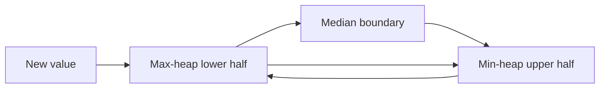

# Heaps

## At a Glance

A heap maintains one extreme value while supporting incremental updates. A max-heap
exposes the largest item; a min-heap exposes the smallest.

| Signal in the prompt | Heap shape |
|---|---|
| K largest items | Min-heap capped at size k |
| K smallest items | Max-heap capped at size k |
| Repeatedly take the next smallest or largest | Heap of current candidates |
| Running median | Max-heap for lower half, min-heap for upper half |
| Merge sorted streams | Min-heap containing one head per stream |

**Core invariant:** the heap root is the only globally ordered element; do not assume the
remaining array representation is sorted.

| Operation | Time |
|---|---:|
| Read root | O(1) |
| Insert | O(log n) |
| Remove root | O(log n) |
| Build from n values | O(n) |

## Interview Method

1. **Clarify which extreme matters.** Ask whether the output needs all values sorted or
   only the next minimum, maximum, or kth boundary.
2. **State the sorting baseline.** Sorting often costs O(n log n) and stores more order
   than the problem needs.
3. **Choose the opposite root for bounded top-k.** Keep the k largest values in a
   min-heap so the weakest retained candidate is easy to evict.
4. **Define heap membership.** Say exactly which values belong in each heap and what the
   root represents.
5. **State balance invariants before coding.** For a median, heap sizes differ by at most
   one and every lower-half value is at most every upper-half value.
6. **Insert, repair order, then rebalance.** Keeping these as distinct steps prevents
   subtle size and ordering errors.
7. **Test duplicates, negatives, and small k.** Include `k = 0`, one value, and even and
   odd stream lengths.
8. **State complexity using heap size.** A bounded heap gives O(n log k), not O(n log n).

## How It Works

A binary heap is a complete binary tree stored in an array. For zero-based index `i`, its
children are `2i + 1` and `2i + 2`. In a min-heap, every parent is no larger than its
children. That local property is sufficient to make index zero the global minimum.

For a running median, split values around the middle:



The max-heap root is the largest lower-half value. The min-heap root is the smallest
upper-half value. Those two roots are exactly the values needed to answer the median.

## Reusable C++ Template

The original notebook did not contain a separate top-k template. Use the heap-membership
and root-selection rules above when adapting its preserved two-heap snippet.

## Worked Problems

### Find the median from a data stream

**Problem:** Support `addNum(value)` and return the median of all values seen so far.

**Recognition:** Re-sorting after every insertion costs O(n log n) per update. The answer
depends only on the middle boundary, which two heaps maintain incrementally.

**Invariants:**

1. `lower.size()` equals `upper.size()` or exceeds it by one.
2. Every value in `lower` is less than or equal to every value in `upper`.

The original notebook snippet is preserved verbatim. Its method name suggests the
binary-search solution for two sorted arrays, but the body instead streams both arrays
through two heaps.

```cpp legacy
class Solution {
public:
    double findMedianSortedArrays(vector<int>& nums1, vector<int>& nums2) {
        // Keep a min heap here and find the max value 
        priority_queue<int> leftMaxHeap;
        
        // Keep a max heap here and find the min value 
        priority_queue<int, vector<int>, greater<int>> rightMinHeap;
        
        for(int i = 0; i < nums1.size(); i++) {
            // Add it to the min heap 
            int num = nums1[i];
            leftMaxHeap.push(num);
            
            // Now push the top of leftMax to rightMin 
            rightMinHeap.push(leftMaxHeap.top());
            leftMaxHeap.pop();
            
            // Check bal;ance
            if (leftMaxHeap.size() < rightMinHeap.size()) {
                leftMaxHeap.push(rightMinHeap.top());
                rightMinHeap.pop();
            }
        }
        
        for(int i = 0; i < nums2.size(); i++) {
            // Add it to the min heap 
            int num = nums2[i];
            leftMaxHeap.push(num);
            
            // Now push the top of leftMax to rightMin 
            rightMinHeap.push(leftMaxHeap.top());
            leftMaxHeap.pop();
            
            // Check bal;ance
            if (leftMaxHeap.size() < rightMinHeap.size()) {
                leftMaxHeap.push(rightMinHeap.top());
                rightMinHeap.pop();
            }
        }
        
        // Find medion 
        if (leftMaxHeap.size() > rightMinHeap.size())
            return leftMaxHeap.top();
        else 
            return double(leftMaxHeap.top() + rightMinHeap.top())/2;
    }
};
```

**Why it is correct:** every insertion first enters `lower`. Moving its maximum to
`upper` restores the ordering invariant because the transferred value becomes an
upper-half candidate. If `upper` becomes larger, moving its minimum back to `lower`
restores the size invariant. The one or two roots therefore delimit the middle.

**Dry run:** inserting `5, 2, 10, 4` produces medians `5, 3.5, 5, 4.5`.

**Complexity:** each insertion is O(log n), median lookup is O(1), and total storage is
O(n). The preserved average adds the integer roots before conversion and can overflow;
the safer interview implementation converts each root first.

**Edge cases:** one value, duplicate values, all negative values, alternating extremes,
and an empty stream when the interface permits a query before insertion.

## Failure Modes

- Use a max-heap for the k largest values and lose O(1) access to the eviction boundary.
- Assume iteration over a priority queue yields sorted order.
- Rebalance sizes without first restoring the lower-versus-upper ordering invariant.
- Let the upper heap exceed the lower heap and read the wrong odd-length median.
- Add two integer roots before converting to `double`, causing overflow.
- Call `top()` on an empty heap.

## Recall Drill

1. Why does a min-heap retain the k largest values?
2. Which two invariants make the running median correct?
3. Why is heap construction O(n), even though n separate insertions are O(n log n)?
4. When should a FIFO queue be used instead of a heap?
5. What does the root represent in a k-largest bounded heap?

## Related Topics

- [Breadth-First Search](BFS.md) uses a FIFO queue when all transitions have equal cost.
- [Segment Trees](SegmentTree.md) support repeated range queries and point updates when
  retaining only one global extreme is insufficient.
