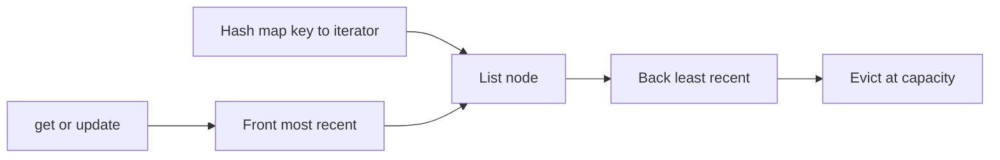

# LRU Cache

## At a Glance

A Least Recently Used (LRU) cache evicts the key whose most recent access is oldest when
capacity is full.

| Requirement | Data structure |
|---|---|
| Find a key in average O(1) | Hash map |
| Move an accessed key in O(1) | Doubly linked list |
| Identify the least recent key in O(1) | List back |
| Identify the most recent key | List front |

**Core invariant:** every key in the map points to exactly one node in the list; the list
front is most recent and the list back is least recent.

`get` and `put` are O(1) average time. A cache of capacity `C` uses O(C) space.

## Interview Method

1. **Clarify observable behavior.** Ask whether `get` updates recency, whether updating
   an existing key counts as use, and what capacity zero means.
2. **State the direct approach.** A map finds values quickly but cannot identify the
   oldest access. A list orders accesses but needs O(n) to find a key.
3. **Combine structures by responsibility.** The map supplies identity; the list
   supplies recency order.
4. **Define one synchronization invariant.** Every mutation must update both structures
   or deliberately leave both unchanged.
5. **Choose stable handles.** Store list iterators in the map so an arbitrary node can be
   moved without searching.
6. **Implement touch before eviction.** Moving an existing node to the front should not
   allocate a replacement node.
7. **Test recency, not only values.** Use operations where a successful `get` changes
   which key is evicted next.
8. **State average-case hashing explicitly.** O(1) assumes ordinary hash-table behavior.

## How It Works

The doubly linked list is the recency timeline. Access moves an existing node to the
front. Insertion creates a front node. Eviction removes the back node and its map entry.



`std::list::splice` moves a node between positions without copying it and without
invalidating iterators to that node. This is the operation that joins map lookup with
constant-time recency maintenance.

## Reusable C++ Template

This focused helper shows the stable-iterator recency pattern. The list owns nodes; the
map only indexes them.

```cpp
#include <list>
#include <unordered_map>

class RecencyIndex {
public:
    void touch(int key) {
        auto found = positions_.find(key);
        if (found != positions_.end()) {
            order_.splice(order_.begin(), order_, found->second);
            return;
        }

        order_.push_front(key);
        positions_[key] = order_.begin();
    }

    void eraseLeastRecent() {
        if (order_.empty()) return;
        positions_.erase(order_.back());
        order_.pop_back();
    }

private:
    std::list<int> order_;
    std::unordered_map<int, std::list<int>::iterator> positions_;
};
```

Erasing the map entry before popping the list node avoids leaving an iterator that points
to destroyed storage.

## Worked Problems

### Design an LRU cache

**Problem:** Implement `get(key)` and `put(key, value)` with average O(1) time. Evict the
least recently used key when a new key exceeds capacity.

**Recognition:** This is simultaneous key lookup and mutable ordering. Neither a hash map
nor a list alone satisfies both requirements.

**Invariant:** `entries_[key]` points to the unique list pair for `key`; list order from
front to back is newest to oldest; list size never exceeds capacity.

```cpp
#include <cstddef>
#include <list>
#include <unordered_map>
#include <utility>

class LRUCache {
public:
    explicit LRUCache(std::size_t capacity) : capacity_(capacity) {}

    int get(int key) {
        auto found = entries_.find(key);
        if (found == entries_.end()) return -1;

        items_.splice(items_.begin(), items_, found->second);
        return found->second->second;
    }

    void put(int key, int value) {
        auto found = entries_.find(key);
        if (found != entries_.end()) {
            found->second->second = value;
            items_.splice(items_.begin(), items_, found->second);
            return;
        }

        if (capacity_ == 0) return;
        if (items_.size() == capacity_) {
            entries_.erase(items_.back().first);
            items_.pop_back();
        }

        items_.emplace_front(key, value);
        entries_[key] = items_.begin();
    }

private:
    using Iterator = std::list<std::pair<int, int>>::iterator;

    std::size_t capacity_;
    std::list<std::pair<int, int>> items_;
    std::unordered_map<int, Iterator> entries_;
};
```

**Dry run with capacity two:**

1. `put(1, 10)` gives order `[1]`.
2. `put(2, 20)` gives `[2, 1]`.
3. `get(1)` returns `10` and gives `[1, 2]`.
4. `put(3, 30)` evicts `2` and gives `[3, 1]`.

**Why it is correct:** every successful read and update splices the corresponding node
to the front, so the front is newest. New keys also enter at the front. If full, removing
the back removes exactly the oldest key. Every insertion and removal updates the map and
list together, preserving one-to-one correspondence.

**Complexity:** hash lookup is O(1) average, and list splice, front insertion, and back
removal are O(1). Storage is O(capacity).

**Edge cases:** capacity zero, capacity one, updating an existing key while full, reading
a missing key, and repeated reads that reorder eviction priority.

## Failure Modes

- Update the list but not the map, leaving a stale iterator or duplicate key.
- Allocate a new node for every hit instead of moving the existing node.
- Evict before checking whether `put` updates an existing key.
- Remove the list node before reading its key to erase the map entry.
- Forget that `get` changes recency even though it does not change the value.
- Use raw `new` nodes without deleting evicted nodes and leak memory.
- Treat O(1) hash-table operations as a worst-case guarantee.

## Recall Drill

1. What responsibility belongs to the map, and what belongs to the list?
2. Why must the list be doubly linked for arbitrary O(1) movement?
3. Does `std::list::splice` invalidate the stored iterator?
4. Which key is evicted after `put(1)`, `put(2)`, `get(1)`, `put(3)` at capacity two?
5. Why should capacity zero be handled before inserting a node?

## Related Topics

- [Linked Lists](LinkedLists.md) explains the pointer and reachability invariants behind
  constant-time list updates.
