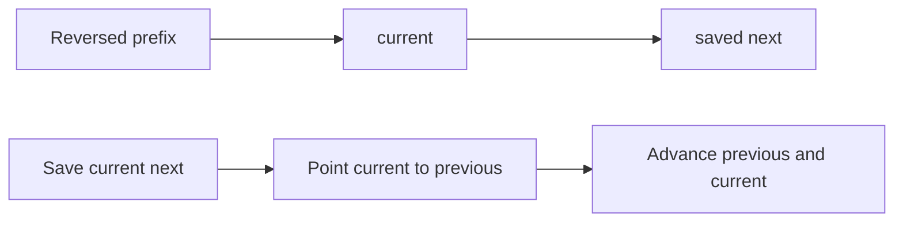

# Linked Lists

## At a Glance

A linked list stores values in nodes connected by pointers. It trades constant-time
insertion after a known node for the random access that arrays provide.

| Signal in the prompt | Likely technique |
|---|---|
| Reverse, reorder, or splice nodes | Track `previous`, `current`, and saved `next` |
| Cycle, loop, or repeated node | Slow and fast pointers |
| Middle or kth node from the end | Pointers moving at different speeds or offsets |
| Merge sorted lists | Advance the pointer with the smaller value |

**Core invariant:** before changing a link, keep a pointer to every part of the list that
must remain reachable.

| Operation | Time | Extra space |
|---|---:|---:|
| Access by index | O(n) | O(1) |
| Insert after a known node | O(1) | O(1) |
| Reverse iteratively | O(n) | O(1) |
| Detect a cycle with Floyd's algorithm | O(n) | O(1) |

## Interview Method

1. **Clarify ownership and mutation.** Ask whether links may be changed, whether nodes
   can repeat, and what should happen for an empty list.
2. **State the direct approach.** Copying values or storing visited node addresses is
   often easy, but may cost O(n) extra space or violate a node-reuse requirement.
3. **Look for pointer structure.** A request involving position, cycles, or reversal is
   usually asking for two pointers or a small fixed set of moving pointers.
4. **Name the invariant.** Examples are "the reversed prefix ends at `previous`" and
   "`fast` has travelled twice as many edges as `slow`."
5. **Dry-run node identities, not only values.** Draw arrows and include a one-node list.
   Equal values do not mean two pointers refer to the same node.
6. **Implement one pointer update at a time.** Save a link before overwriting it.
7. **Test boundary shapes.** Use empty, one-node, two-node, acyclic, and cyclic lists.
8. **State complexity in traversed nodes.** Most pointer scans are O(n) time and O(1)
   auxiliary space.

## How It Works

### Reversing a list

Split the list conceptually into a reversed prefix and an untouched suffix. At the start
of each iteration, `previous` is the head of the reversed prefix and `current` is the
head of the untouched suffix. Saving `current->next` before rewiring preserves access to
the suffix.



### Slow and fast pointers

Moving one pointer by one edge and another by two edges compares positions without an
index. In an acyclic list, `fast` reaches the end. In a cyclic list, both pointers
eventually enter the cycle, where `fast` gains one cycle position on `slow` per round and
must meet it.

## Reusable C++ Template

The original reverse-list snippet is preserved verbatim:

```cpp legacy
/**
 * Definition for singly-linked list.
 * struct ListNode {
 *     int val;
 *     ListNode *next;
 *     ListNode() : val(0), next(nullptr) {}
 *     ListNode(int x) : val(x), next(nullptr) {}
 *     ListNode(int x, ListNode *next) : val(x), next(next) {}
 * };
 */
class Solution {
public:
    ListNode* reverseList(ListNode* head) {
        // Maintain three pointers, prev, curr and next 
        ListNode *prev = nullptr, *curr = head, *next;

        while(curr != nullptr) {
            // Store next pointer temporraily 
            next = curr -> next;

            // Update next to store previous 
            curr -> next = prev;

            // Copy newly prepared curr to prev 
            prev = curr;

            // Update curr with next value
            curr = next;
        }
        return prev;

    }
};
```

The loop invariant is precise: all nodes before `current` have been reversed and are
reachable from `previous`; all remaining nodes are reachable from `current`.

## Worked Problems

### Detect a linked-list cycle

**Problem:** Return whether following `next` pointers eventually revisits a node.

**Recognition and constraints:** A visited-address set solves the problem in O(n) time
and O(n) space. The request for constant extra space points to Floyd's slow-and-fast
pointer algorithm.

**Invariant:** after `k` iterations, `slow` has moved `k` edges and `fast` has moved `2k`
edges, unless `fast` has already reached the end.

**Why it is correct:** if the list is acyclic, `fast` reaches `nullptr`, proving there is
no repeated node. If a cycle exists, both pointers eventually enter it. Measured modulo
the cycle length, `fast` gains one position on `slow` each iteration, so their relative
distance must become zero.

The original hashing and Floyd snippets are preserved verbatim:

```cpp legacy
/**
 * Definition for singly-linked list.
 * struct ListNode {
 *     int val;
 *     ListNode *next;
 *     ListNode(int x) : val(x), next(NULL) {}
 * };
 */
class Solution {
public:
    bool hasCycle(ListNode *head) {
        unordered_set<ListNode*> st;
        while(head != nullptr) {
            if (st.find(head) != st.end())
                return true;
            st.insert(head);
            head = head -> next;
        }
        return false;
    }
};
```

```cpp legacy
/**
 * Definition for singly-linked list.
 * struct ListNode {
 *     int val;
 *     ListNode *next;
 *     ListNode(int x) : val(x), next(NULL) {}
 * };
 */
class Solution {
public:
    bool hasCycle(ListNode *head) {

        ListNode *slow_pointer = head, *fast_pointer = head;

        while(slow_pointer != nullptr && fast_pointer != nullptr && fast_pointer-> next != nullptr) {
            slow_pointer = slow_pointer->next;
            fast_pointer = fast_pointer->next->next;

            if (slow_pointer == fast_pointer)
                return true;
        }
        return false;
    }
};
```

**Dry run:** for `A -> B -> C -> D -> B`, the pointer pairs after each move are `(B, C)`,
`(C, B)`, and `(D, D)`. The third pair proves a cycle.

**Complexity:** O(n) time and O(1) extra space.

**Edge cases:**

- Empty list: the loop never runs, so the answer is `false`.
- One node pointing to `nullptr`: `fast->next` stops the loop safely.
- One node pointing to itself: both pointers move to that node and compare equal.
- Repeated values without repeated nodes: pointer identity avoids a false positive.

### Additional original middle-node snippets

```cpp legacy
/**
 * Definition for singly-linked list.
 * struct ListNode {
 *     int val;
 *     ListNode *next;
 *     ListNode() : val(0), next(nullptr) {}
 *     ListNode(int x) : val(x), next(nullptr) {}
 *     ListNode(int x, ListNode *next) : val(x), next(next) {}
 * };
 */
class Solution {
public:
    ListNode* middleNode(ListNode* head) {
        int node_count = 0;
        ListNode *temp_head = head;

        while(temp_head != nullptr) {
            temp_head = temp_head->next;
            node_count++;
        }
        
        int middle = node_count / 2;
        while(middle--) {
            head = head ->next;
        }
        
        return head;
    }
};
```

```cpp legacy
/**
 * Definition for singly-linked list.
 * struct ListNode {
 *     int val;
 *     ListNode *next;
 *     ListNode() : val(0), next(nullptr) {}
 *     ListNode(int x) : val(x), next(nullptr) {}
 *     ListNode(int x, ListNode *next) : val(x), next(next) {}
 * };
 */
class Solution {
public:
    ListNode* middleNode(ListNode* head) {
        ListNode *slow_pointer = head, *fast_pointer = head;

        while(slow_pointer != nullptr && fast_pointer != nullptr && fast_pointer -> next != nullptr) {
            slow_pointer = slow_pointer -> next;
            fast_pointer = fast_pointer -> next -> next;
        }

        return slow_pointer;
    }
};
```

## Failure Modes

- Overwrite `current->next` before saving it and the untouched suffix is lost.
- Check `fast->next` without first checking `fast` and dereference `nullptr`.
- Compare node values instead of node addresses when detecting a cycle.
- Return the original `head` after reversal instead of the new head in `previous`.
- Use recursion without accounting for O(n) call-stack space on a long list.
- Move a pointer twice in one expression when an intermediate pointer may be null.

## Recall Drill

1. What must be saved before reversing `current->next`?
2. Why must slow and fast pointers meet inside a finite cycle?
3. Which loop condition makes `fast = fast->next->next` safe?
4. How would you find the middle node, and which middle is returned for even length?
5. When is an O(n)-space visited set still preferable to Floyd's algorithm?

## Related Topics

- [LRU Cache](LRUCache.md) combines a linked list with a hash map to support O(1)
  recency updates and eviction.
