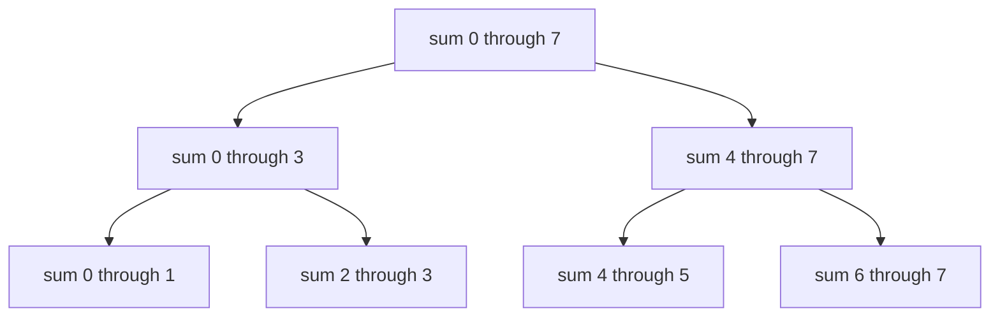

# Segment Trees

## At a Glance

A segment tree stores an aggregate for nested array ranges. It supports repeated range
queries and point updates without recomputing an entire range.

| Signal in the prompt | Segment-tree fit |
|---|---|
| Many range queries plus updates | Strong fit |
| Associative combine operation | Sum, min, max, gcd, bitwise OR |
| Static range sums only | Prefix sums are simpler |
| Only whole-array minimum or maximum | A heap may be simpler |

**Core invariant:** each internal node stores the combination of exactly the range
represented by its two children.

| Operation | Time | Extra space |
|---|---:|---:|
| Build | O(n) | O(n) |
| Point update | O(log n) | O(1) iterative |
| Range query | O(log n) | O(1) iterative |

## Interview Method

1. **Clarify query and update shapes.** Distinguish static queries, point updates, and
   range updates; lazy propagation is needed only for the last case.
2. **State the simpler baselines.** Prefix sums answer static sums in O(1), while direct
   scans answer each query in O(n).
3. **Check associativity and identity.** The combine operation must be safely regrouped,
   and disjoint ranges need an identity such as zero for sum.
4. **Define node meaning.** Write down whether intervals are inclusive or half-open and
   keep that convention everywhere.
5. **Trace one query decomposition.** Show how a requested interval becomes O(log n)
   disjoint tree segments.
6. **Update the leaf before ancestors.** Recompute every parent on the path to the root.
7. **Test one-element and full ranges.** Boundary mistakes appear immediately there.
8. **State build, query, update, and storage costs separately.** Do not call every
   operation O(log n).

## How It Works

Leaves store individual array values. Every parent stores the combination of its child
ranges. A query takes only nodes whose ranges fit inside the requested interval.



In a recursive tree, a query range and node range are either disjoint, fully covered, or
partially overlapping. The iterative layout expresses the same decomposition by moving
two boundary indices upward and selecting boundary nodes when needed.

## Reusable C++ Template

This iterative tree stores sums. Public queries use inclusive bounds.

```cpp
#include <stdexcept>
#include <vector>

class SegmentTree {
public:
    explicit SegmentTree(const std::vector<int>& values)
        : size_(static_cast<int>(values.size())), tree_(2 * values.size(), 0) {
        for (int index = 0; index < size_; ++index) {
            tree_[size_ + index] = values[index];
        }
        for (int index = size_ - 1; index > 0; --index) {
            tree_[index] = tree_[2 * index] + tree_[2 * index + 1];
        }
    }

    void update(int index, int value) {
        if (index < 0 || index >= size_) throw std::out_of_range("update index");
        int position = index + size_;
        tree_[position] = value;
        while (position > 1) {
            position /= 2;
            tree_[position] = tree_[2 * position] + tree_[2 * position + 1];
        }
    }

    long long query(int left, int right) const {
        if (left < 0 || right < left || right >= size_) {
            throw std::out_of_range("query range");
        }

        left += size_;
        right += size_ + 1;
        long long total = 0;

        while (left < right) {
            if (left % 2 == 1) total += tree_[left++];
            if (right % 2 == 1) total += tree_[--right];
            left /= 2;
            right /= 2;
        }

        return total;
    }

private:
    int size_;
    std::vector<long long> tree_;
};
```

The half-open internal interval `[left, right)` avoids double-counting when both
boundaries climb toward their lowest common ancestor.

## Worked Problems

### Range Sum Query Mutable

**Problem:** Build an array wrapper that supports replacing one value and returning the
sum from index `left` through `right`, inclusive.

**Recognition:** Prefix sums make queries O(1) but each update O(n). Repeated use of both
operations calls for a hierarchy of partial sums.

**Invariant:** `tree_[p]` equals the sum of every leaf in the range represented by node
`p`. Updating one leaf and recomputing its ancestors restores that invariant globally.

```cpp
#include <stdexcept>
#include <vector>

class NumArray {
public:
    explicit NumArray(const std::vector<int>& values)
        : size_(static_cast<int>(values.size())), tree_(2 * values.size(), 0) {
        for (int index = 0; index < size_; ++index) {
            tree_[size_ + index] = values[index];
        }
        for (int index = size_ - 1; index > 0; --index) {
            tree_[index] = tree_[2 * index] + tree_[2 * index + 1];
        }
    }

    void update(int index, int value) {
        if (index < 0 || index >= size_) throw std::out_of_range("update index");
        int position = index + size_;
        tree_[position] = value;

        for (position /= 2; position > 0; position /= 2) {
            tree_[position] = tree_[2 * position] + tree_[2 * position + 1];
        }
    }

    long long sumRange(int left, int right) const {
        if (left < 0 || right < left || right >= size_) {
            throw std::out_of_range("sum range");
        }

        long long total = 0;
        for (left += size_, right += size_ + 1; left < right;
             left /= 2, right /= 2) {
            if (left % 2 == 1) total += tree_[left++];
            if (right % 2 == 1) total += tree_[--right];
        }
        return total;
    }

private:
    int size_;
    std::vector<long long> tree_;
};
```

**Dry run:** for `[1, 3, 5]`, `sumRange(0, 2)` is `9`. After `update(1, 2)`, the changed
leaf and its ancestors are recomputed, so `sumRange(0, 2)` is `8`.

**Why it is correct:** build establishes the invariant bottom-up. An update changes one
leaf and every node whose range contains it, exactly the ancestor path. During a query,
selected nodes are disjoint and together cover the requested range, so summing them
returns precisely the range sum.

**Complexity:** O(n) build, O(log n) update, O(log n) query, and O(n) storage.

**Edge cases:** a one-element array, full-range queries, repeated updates to one index,
negative values, and invalid or empty ranges. This interface rejects operations on an
empty tree.

## Failure Modes

- Mix inclusive and half-open ranges between the public API and internal traversal.
- Recompute only the leaf and leave ancestor aggregates stale.
- Use `int` for sums when accumulated values can exceed 32-bit range.
- Apply a segment tree to static prefix sums and add unnecessary complexity.
- Return zero for invalid ranges without deciding whether that hides a caller bug.
- Allocate `4 * n` for an iterative `2 * n` layout, or only `2 * n` for a recursive
  layout whose indexing requires more room.

## Recall Drill

1. Which property must the combine operation have?
2. What identity value represents a disjoint range for sum, min, and gcd?
3. Why does a point update touch only O(log n) nodes?
4. When are prefix sums better than a segment tree?
5. What extra technique is needed for range updates?

## Related Topics

- [Heaps](Heap.md) retain one global extreme, while segment trees retain aggregates for
  many nested ranges.
- [Ternary Search](TernarySearch.md) searches an optimization domain rather than storing
  mutable range aggregates.
