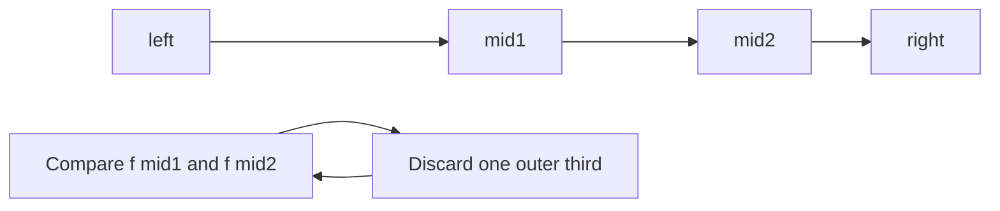

# Ternary Search

## At a Glance

Ternary search narrows a domain when an objective is unimodal: it decreases then
increases for minimization, or increases then decreases for maximization.

| Signal in the prompt | Check before using ternary search |
|---|---|
| Minimize a convex one-variable cost | Domain and precision are bounded |
| Maximize a concave one-variable score | There is one peak, possibly a plateau |
| Integer unimodal objective | Finish with a direct scan of the small interval |
| Monotone true/false condition | Prefer binary search on the predicate |

**Core invariant:** after comparing two interior points, at least one outer third cannot
contain a better answer and can be discarded.

For a continuous search using `I` iterations, evaluation cost `F`, time is O(I * F) and
extra space is O(1). Discrete search is O(F * log range) plus a constant-size final scan.

## Interview Method

1. **Prove the shape before choosing the algorithm.** Ternary search is invalid for an
   arbitrary function with several local optima.
2. **State the brute-force baseline.** Evaluating every integer point may cost O(range *
   F); continuous domains cannot be enumerated exactly.
3. **Choose min or max comparisons explicitly.** For minimization, if `f(mid1) <=
   f(mid2)`, discard the right third.
4. **Define interval semantics.** Use closed integer bounds for discrete search and a
   shrinking real interval for continuous search.
5. **Avoid precision folklore.** Use a fixed iteration count for floating-point search
   or justify an epsilon from the required output tolerance.
6. **Finish discrete search directly.** Rounding can skip the optimum when the interval
   is tiny, so scan the remaining candidates.
7. **Test boundaries and plateaus.** Include an optimum at each endpoint and several
   equally optimal points.
8. **State evaluation cost.** If one objective call scans n inputs, the algorithm is not
   merely O(log range).

## How It Works

Choose two points that split the current interval into thirds. For a unimodal minimum,
the larger objective value identifies an outer region that cannot contain the optimum.



If `f(mid1) <= f(mid2)`, the function has stopped improving by `mid2`, so no point to the
right of `mid2` can beat the best point in the retained left portion. The symmetric
argument discards the left third when `f(mid1) > f(mid2)`.

Ternary search is **not** a general solution to "Find Subarray With Bitwise OR Closest to
K" (LeetCode 3171). Subarray OR behavior does not provide a single unimodal objective
over arbitrary boundaries.

## Reusable C++ Template

The discrete template leaves at most four candidates and scans them. The continuous
template uses 200 rounds, enough to shrink ordinary double-precision ranges far below
typical interview tolerances.

```cpp
#include <algorithm>
#include <limits>

template <typename Function>
long long discreteTernaryMinimum(long long left, long long right, Function objective) {
    while (right - left > 3) {
        long long third = (right - left) / 3;
        long long mid1 = left + third;
        long long mid2 = right - third;

        if (objective(mid1) <= objective(mid2)) {
            right = mid2 - 1;
        } else {
            left = mid1 + 1;
        }
    }

    long long answer = std::numeric_limits<long long>::max();
    for (long long point = left; point <= right; ++point) {
        answer = std::min(answer, objective(point));
    }
    return answer;
}

template <typename Function>
double continuousTernaryArgmin(double left, double right, Function objective) {
    for (int iteration = 0; iteration < 200; ++iteration) {
        double mid1 = left + (right - left) / 3.0;
        double mid2 = right - (right - left) / 3.0;

        if (objective(mid1) <= objective(mid2)) {
            right = mid2;
        } else {
            left = mid1;
        }
    }
    return (left + right) / 2.0;
}
```

For maximization, reverse the comparison or minimize the negated objective. Keep the
objective pure so repeated evaluations at nearby points do not mutate shared state.

## Worked Problems

### Best meeting point constrained to the x-axis

**Problem:** Given planar points, choose a real x-coordinate on the x-axis minimizing the
sum of Euclidean distances to all points.

**Recognition:** Each distance `sqrt((x - px)^2 + py^2)` is convex in `x`; a sum of
convex functions is convex. The objective therefore has one minimum region and satisfies
the ternary-search precondition.

**Bounds:** an optimum lies between the smallest and largest input x-coordinate. Outside
that interval, moving toward all points cannot increase any horizontal distance.

```cpp
#include <algorithm>
#include <cmath>
#include <limits>
#include <utility>
#include <vector>

std::pair<double, double> bestXAxisMeetingPoint(
    const std::vector<std::pair<double, double>>& points
) {
    if (points.empty()) return {0.0, 0.0};

    double left = std::numeric_limits<double>::infinity();
    double right = -std::numeric_limits<double>::infinity();
    for (const auto& [x, y] : points) {
        (void)y;
        left = std::min(left, x);
        right = std::max(right, x);
    }

    auto cost = [&points](double x) {
        double total = 0.0;
        for (const auto& [pointX, pointY] : points) {
            total += std::hypot(x - pointX, pointY);
        }
        return total;
    };

    for (int iteration = 0; iteration < 200; ++iteration) {
        double mid1 = left + (right - left) / 3.0;
        double mid2 = right - (right - left) / 3.0;
        if (cost(mid1) <= cost(mid2)) {
            right = mid2;
        } else {
            left = mid1;
        }
    }

    double position = (left + right) / 2.0;
    return {position, cost(position)};
}
```

**Why it is correct:** convexity guarantees that objective values do not improve again
after passing the minimum region. Each comparison discards only points on the side that
cannot contain a better value, preserving at least one optimum. Repeated shrinking makes
the returned midpoint arbitrarily close within floating-point precision.

**Complexity:** each objective evaluation scans n points. Two evaluations for 200 rounds
plus one final evaluation take O(200n), conventionally written O(n) for fixed precision,
and O(1) auxiliary space beyond the input.

**Edge cases:** no points, one point, all points sharing an x-coordinate, symmetric
points with an obvious center, and points on the x-axis that create a flat optimum
interval.

## Failure Modes

- Apply ternary search without proving unimodality or convexity.
- Reverse the minimization comparison and discard the side containing the optimum.
- Stop an integer search without scanning the final small interval.
- Increment the wrong loop variable in the final scan.
- Hide an O(n) objective evaluation and claim total O(log range).
- Use floating-point equality as the termination condition.
- Prefer ternary search over a clearer binary search when a monotone predicate exists.

## Recall Drill

1. What function shape is required for a ternary-search minimum?
2. Which third is discarded when `f(mid1) <= f(mid2)` during minimization?
3. Why should a discrete implementation scan the final few points?
4. How do fixed iterations translate to precision?
5. Why does a monotone predicate usually call for binary search instead?

## Related Topics

- [Segment Trees](SegmentTree.md) answer mutable range queries; ternary search instead
  reduces an optimization domain using objective shape.
