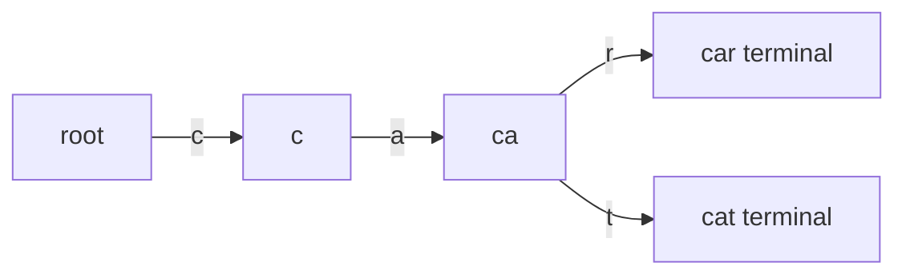

# Tries

## At a Glance

A trie stores strings by shared prefixes. Each edge represents a character, and each
node represents the prefix formed by the path from the root.

| Signal in the prompt | Trie advantage |
|---|---|
| Prefix lookup or autocomplete | Follow only the requested prefix |
| Many dictionary queries | Reuse shared prefixes across words |
| Find the shortest or longest stored prefix | Check terminal markers during traversal |
| Lexicographic generation | Visit child edges in character order |

**Core invariant:** after consuming `i` characters, the current node represents exactly
the prefix `word[0..i]`.

Insert, exact lookup, and prefix lookup each take O(L) time for a string of length `L`.
Memory is O(total created nodes * alphabet size) for fixed child arrays.

## Interview Method

1. **Clarify the alphabet and normalization.** Fixed lowercase English letters support
   a 26-entry array; Unicode or sparse alphabets may need a map.
2. **State the direct approach.** Comparing a query against every dictionary word costs
   repeated prefix work.
3. **Look for shared-prefix reuse.** A trie pays construction cost once and answers many
   prefix queries by path length.
4. **Define node meaning.** Separate "this prefix exists" from "a complete word ends
   here" with a terminal flag.
5. **Choose the stopping rule.** Shortest-prefix problems stop at the first terminal
   node; exact lookup must consume the whole query and end at a terminal node.
6. **Implement ownership deliberately.** Smart pointers avoid leaking dynamically
   allocated child nodes.
7. **Test prefix-versus-word distinctions.** Insert `apple`, then query `app` as both an
   exact word and a prefix.
8. **State complexity in characters, not only words.** Construction is proportional to
   total dictionary characters.

## How It Works

The root represents the empty prefix. Following edge `c` appends `c` to the represented
prefix. Several words share nodes until their characters diverge.



A terminal marker is essential. Without it, a trie containing `apple` could not
distinguish whether `app` was inserted as a complete word or appears only as a prefix.

## Reusable C++ Template

This implementation accepts lowercase `a` through `z` and throws for other characters.
`std::unique_ptr` gives every node one clear owner and recursively frees the trie.

```cpp
#include <array>
#include <memory>
#include <stdexcept>
#include <string>

class Trie {
public:
    void insert(const std::string& word) {
        Node* node = &root_;
        for (char character : word) {
            std::size_t index = toIndex(character);
            if (!node->children[index]) {
                node->children[index] = std::make_unique<Node>();
            }
            node = node->children[index].get();
        }
        node->terminal = true;
    }

    bool contains(const std::string& word) const {
        const Node* node = walk(word);
        return node != nullptr && node->terminal;
    }

    bool startsWith(const std::string& prefix) const {
        return walk(prefix) != nullptr;
    }

private:
    struct Node {
        std::array<std::unique_ptr<Node>, 26> children{};
        bool terminal = false;
    };

    static std::size_t toIndex(char character) {
        if (character < 'a' || character > 'z') {
            throw std::invalid_argument("trie accepts lowercase letters only");
        }
        return static_cast<std::size_t>(character - 'a');
    }

    const Node* walk(const std::string& text) const {
        const Node* node = &root_;
        for (char character : text) {
            std::size_t index = toIndex(character);
            if (!node->children[index]) return nullptr;
            node = node->children[index].get();
        }
        return node;
    }

    Node root_;
};
```

An empty prefix always exists at the root. An empty word exists only after `insert("")`
sets the root's terminal flag.

## Worked Problems

### Replace Words

**Problem:** Given dictionary roots and a sentence, replace each word with its shortest
dictionary root when one exists.

**Recognition:** Every sentence word asks for a prefix lookup against the same
dictionary. Checking every root repeatedly wastes shared work.

**Invariant:** while scanning a word, the current trie node represents exactly the
characters consumed. The first terminal node is the shortest matching root because
depth increases one character at a time.

```cpp
#include <array>
#include <memory>
#include <sstream>
#include <string>
#include <vector>

class RootDictionary {
public:
    void insert(const std::string& root) {
        Node* node = &root_;
        for (char character : root) {
            std::size_t index = static_cast<std::size_t>(character - 'a');
            if (!node->children[index]) {
                node->children[index] = std::make_unique<Node>();
            }
            node = node->children[index].get();
        }
        node->terminal = true;
    }

    std::string shortestRoot(const std::string& word) const {
        const Node* node = &root_;
        std::string prefix;

        for (char character : word) {
            std::size_t index = static_cast<std::size_t>(character - 'a');
            if (!node->children[index]) return word;
            prefix.push_back(character);
            node = node->children[index].get();
            if (node->terminal) return prefix;
        }

        return word;
    }

private:
    struct Node {
        std::array<std::unique_ptr<Node>, 26> children{};
        bool terminal = false;
    };

    Node root_;
};

std::string replaceWords(
    const std::vector<std::string>& dictionary,
    const std::string& sentence
) {
    RootDictionary roots;
    for (const std::string& root : dictionary) roots.insert(root);

    std::istringstream input(sentence);
    std::ostringstream output;
    std::string word;
    bool first = true;

    while (input >> word) {
        if (!first) output << ' ';
        output << roots.shortestRoot(word);
        first = false;
    }

    return output.str();
}
```

**Why it is correct:** traversal follows exactly the word's prefixes in increasing
length. Returning at the first terminal node selects the shortest stored root. A missing
edge proves no longer prefix can exist, so returning the original word is correct.

**Complexity:** building takes O(D), where `D` is total dictionary characters. Replacing
takes O(S), where `S` is total sentence-word characters, with O(D) trie nodes.

**Edge cases:** empty dictionary, duplicate roots, a word equal to a root, no matching
root, and roots where one is a prefix of another.

## Failure Modes

- Treat every traversable prefix as a complete word and omit the terminal flag.
- Continue after the first terminal node in a shortest-root problem.
- Index `character - 'a'` without defining or validating the alphabet.
- Allocate raw child pointers without a destruction strategy.
- Claim O(1) lookup because the alphabet is fixed; traversal still depends on length.
- Use a 26-entry array for a large sparse alphabet and waste substantial memory.

## Recall Drill

1. What does a trie node represent?
2. Why is a terminal flag separate from child existence?
3. When is an array of children preferable to a hash map?
4. Why does the first terminal node yield the shortest root?
5. What is the true construction cost for a dictionary of variable-length words?

## Related Topics

- [Breadth-First Search](BFS.md) can traverse trie nodes by depth when generating
  suggestions in increasing prefix length.
