# 🚀 Caching

> **Core Concept**: Caching keeps frequently accessed data in fast memory to avoid slow database queries. It's essential for scalable systems but introduces complexity around staleness and invalidation.

## 📋 Table of Contents
- [Overview](#overview)
- [Where to Cache](#where-to-cache)
- [Cache Architectures](#cache-architectures)
- [Cache Eviction Policies](#cache-eviction-policies)
- [Common Caching Problems](#common-caching-problems)
- [Caching in System Design Interviews](#caching-in-system-design-interviews)
- [Conclusion](#conclusion)

---

## 🎯 Overview

### The Performance Problem

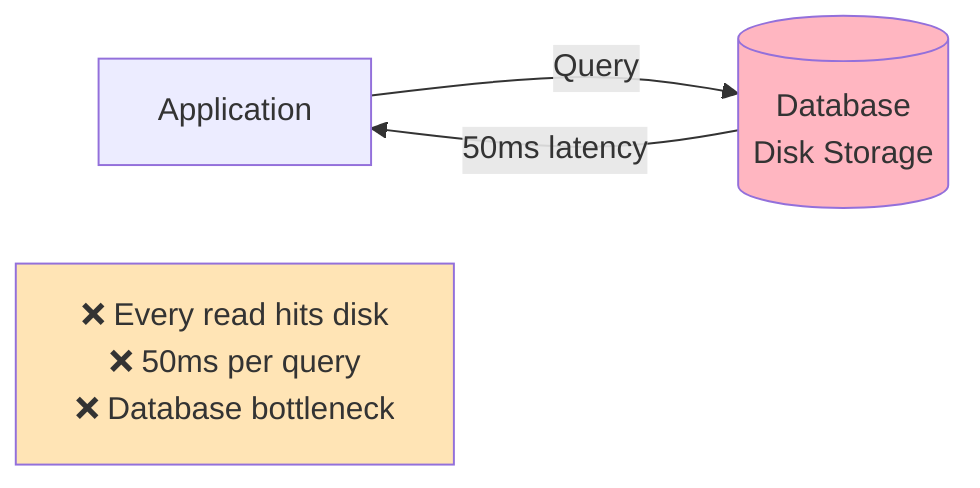
```mermaid
graph LR
    APP[Application]
    DB[(Database<br/>Disk Storage)]
    
    APP -->|Query| DB
    DB -->|50ms latency| APP
    
    NOTE[❌ Every read hits disk<br/>❌ 50ms per query<br/>❌ Database bottleneck]
    
    style DB fill:#FFB6C1
    style NOTE fill:#FFE4B5
```

**Without Cache**: Reading from PostgreSQL takes ~50ms (disk access cost)

### The Caching Solution

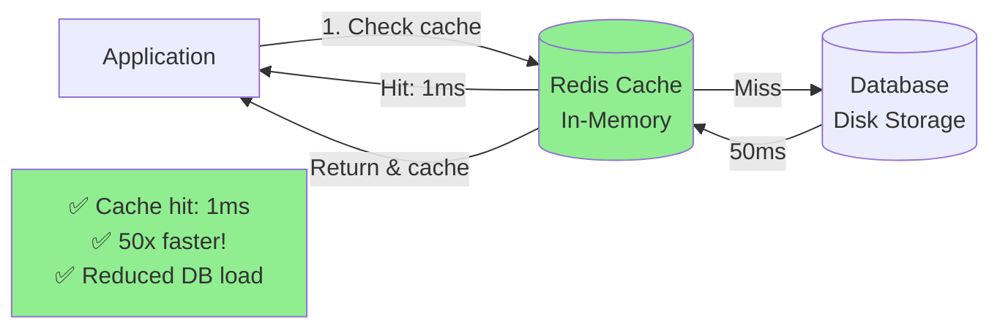
```mermaid
graph LR
    APP[Application]
    CACHE[(Redis Cache<br/>In-Memory)]
    DB[(Database<br/>Disk Storage)]
    
    APP -->|1. Check cache| CACHE
    CACHE -->|Hit: 1ms| APP
    CACHE -->|Miss| DB
    DB -->|50ms| CACHE
    CACHE -->|Return & cache| APP
    
    NOTE[✅ Cache hit: 1ms<br/>✅ 50x faster!<br/>✅ Reduced DB load]
    
    style CACHE fill:#90EE90
    style NOTE fill:#90EE90
```

**With Cache**: Reading from Redis takes ~1ms (memory access) - **50x improvement!**

### Key Benefits

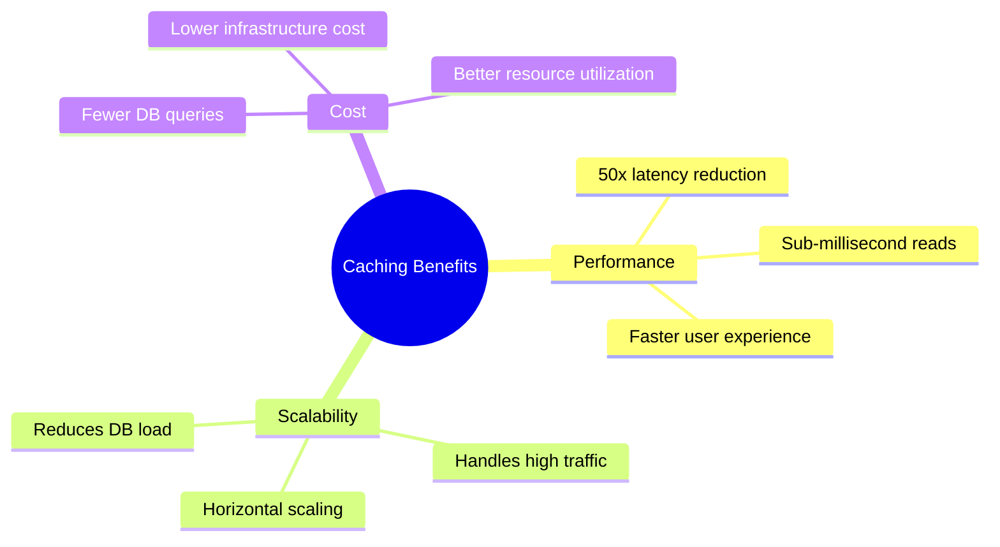
```mermaid
mindmap
    root((Caching Benefits))
        Performance
            50x latency reduction
            Sub-millisecond reads
            Faster user experience
        Scalability
            Reduces DB load
            Handles high traffic
            Horizontal scaling
        Cost
            Fewer DB queries
            Lower infrastructure cost
            Better resource utilization
```

---

## 📍 Where to Cache

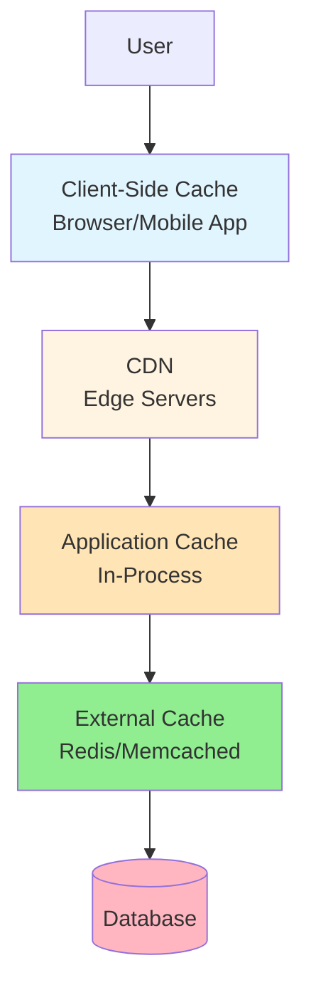
```mermaid
graph TB
    USER[User]
    
    USER --> L1[Client-Side Cache<br/>Browser/Mobile App]
    L1 --> L2[CDN<br/>Edge Servers]
    L2 --> L3[Application Cache<br/>In-Process]
    L3 --> L4[External Cache<br/>Redis/Memcached]
    L4 --> L5[(Database)]
    
    style L1 fill:#e1f5ff
    style L2 fill:#fff4e1
    style L3 fill:#FFE4B5
    style L4 fill:#90EE90
    style L5 fill:#FFB6C1
```

---

### 1️⃣ External Caching (Most Common)

> **Default Interview Answer**: Standalone cache service like Redis or Memcached

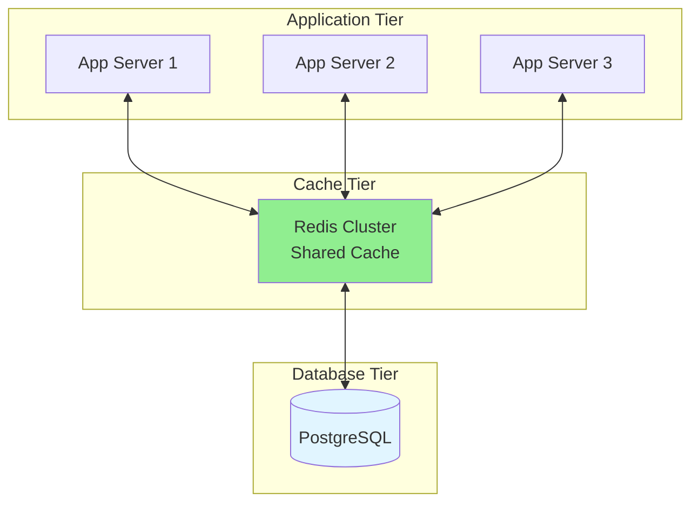
```mermaid
graph TB
    subgraph "Application Tier"
        APP1[App Server 1]
        APP2[App Server 2]
        APP3[App Server 3]
    end
    
    subgraph "Cache Tier"
        REDIS[Redis Cluster<br/>Shared Cache]
    end
    
    subgraph "Database Tier"
        DB[(PostgreSQL)]
    end
    
    APP1 <--> REDIS
    APP2 <--> REDIS
    APP3 <--> REDIS
    REDIS <--> DB
    
    style REDIS fill:#90EE90
    style DB fill:#e1f5ff
```

#### Characteristics

✅ **Pros**:
- Shared across all application servers
- Scales independently
- Supports eviction policies (LRU, LFU)
- Controlled memory footprint
- Network-accessible

❌ **Cons**:
- Network latency overhead (~1ms)
- Additional infrastructure to manage
- Single point of failure (needs redundancy)

**Technologies**: Redis, Memcached

> **💡 Interview Tip**: External caching with Redis is the default answer in system design interviews. Start here!

---

### 2️⃣ CDN (Content Delivery Network)

> **Geographic Distribution**: Cache content close to users worldwide

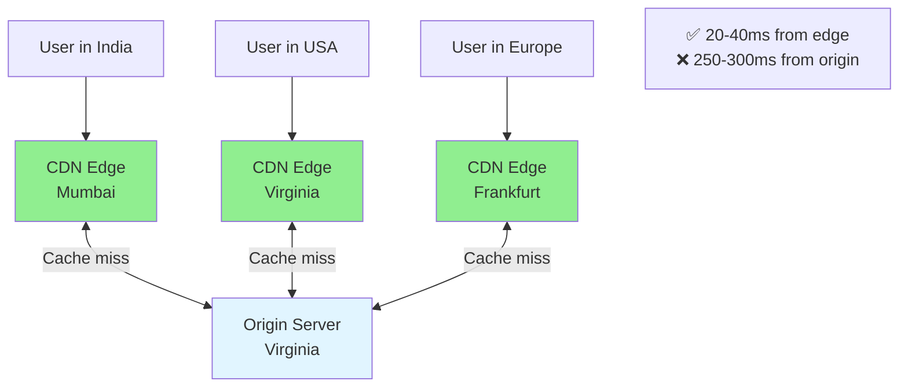
```mermaid
graph TB
    USER1[User in India]
    USER2[User in USA]
    USER3[User in Europe]
    
    USER1 --> EDGE1[CDN Edge<br/>Mumbai]
    USER2 --> EDGE2[CDN Edge<br/>Virginia]
    USER3 --> EDGE3[CDN Edge<br/>Frankfurt]
    
    EDGE1 <-->|Cache miss| ORIGIN[Origin Server<br/>Virginia]
    EDGE2 <-->|Cache miss| ORIGIN
    EDGE3 <-->|Cache miss| ORIGIN
    
    NOTE[✅ 20-40ms from edge<br/>❌ 250-300ms from origin]
    
    style EDGE1 fill:#90EE90
    style EDGE2 fill:#90EE90
    style EDGE3 fill:#90EE90
    style ORIGIN fill:#e1f5ff
```

#### How CDN Works

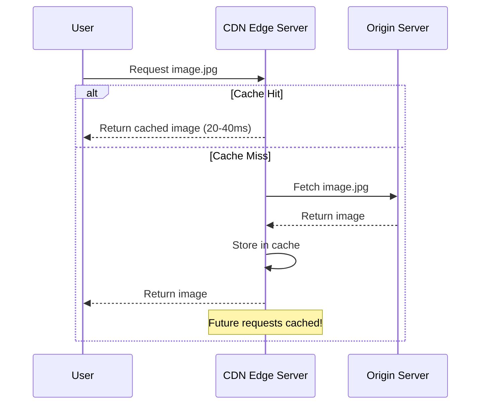
```mermaid
sequenceDiagram
    participant User
    participant CDN as CDN Edge Server
    participant Origin as Origin Server
    
    User->>CDN: Request image.jpg
    alt Cache Hit
        CDN-->>User: Return cached image (20-40ms)
    else Cache Miss
        CDN->>Origin: Fetch image.jpg
        Origin-->>CDN: Return image
        CDN->>CDN: Store in cache
        CDN-->>User: Return image
        Note over CDN: Future requests cached!
    end
```

#### What to Cache on CDN

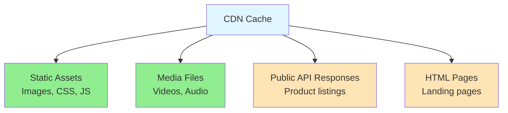
```mermaid
graph TB
    CDN[CDN Cache]
    
    CDN --> STATIC[Static Assets<br/>Images, CSS, JS]
    CDN --> MEDIA[Media Files<br/>Videos, Audio]
    CDN --> API[Public API Responses<br/>Product listings]
    CDN --> HTML[HTML Pages<br/>Landing pages]
    
    style CDN fill:#e1f5ff
    style STATIC fill:#90EE90
    style MEDIA fill:#90EE90
    style API fill:#FFE4B5
    style HTML fill:#FFE4B5
```

✅ **Best For**:
- Static media (images, videos, CSS, JavaScript)
- Public API responses
- HTML pages for public content
- Global user base

**Technologies**: Cloudflare, Fastly, Akamai, AWS CloudFront

> **💡 Interview Tip**: Introduce CDN when your system serves static media at scale or has global users.

---

### 3️⃣ Client-Side Caching

> **Edge of Network**: Cache data on user's device

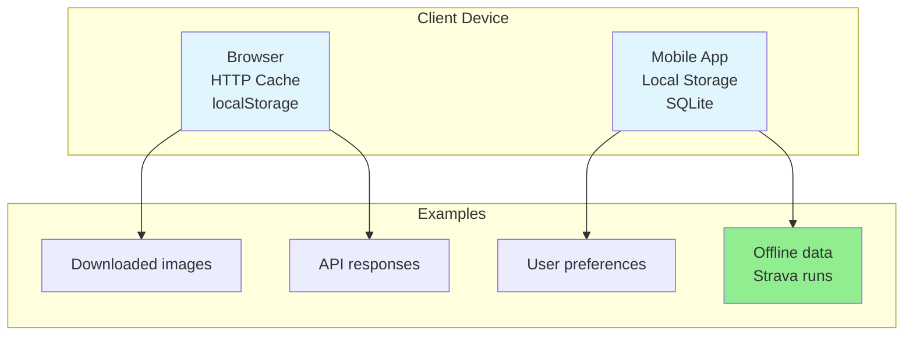
```mermaid
graph TB
    subgraph "Client Device"
        BROWSER[Browser<br/>HTTP Cache<br/>localStorage]
        MOBILE[Mobile App<br/>Local Storage<br/>SQLite]
    end
    
    subgraph "Examples"
        EX1[Downloaded images]
        EX2[API responses]
        EX3[User preferences]
        EX4[Offline data<br/>Strava runs]
    end
    
    BROWSER --> EX1
    BROWSER --> EX2
    MOBILE --> EX3
    MOBILE --> EX4
    
    style BROWSER fill:#e1f5ff
    style MOBILE fill:#e1f5ff
    style EX4 fill:#90EE90
```

#### HTTP Caching Headers

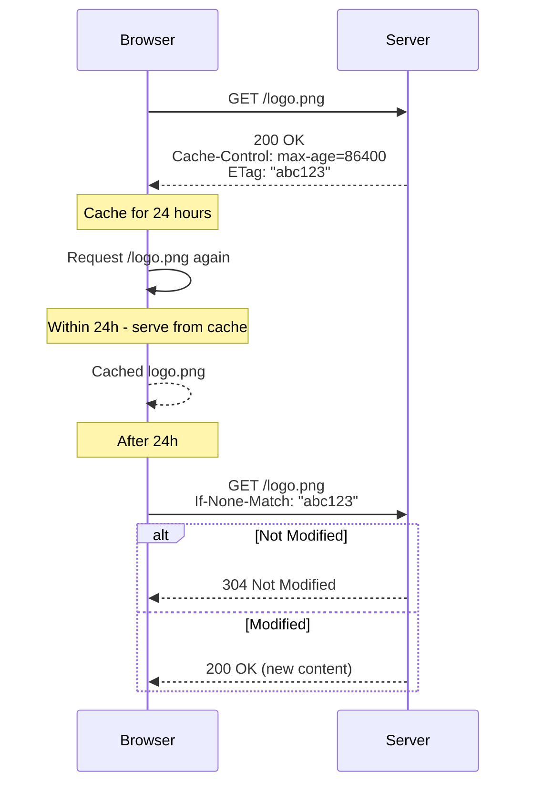
```mermaid
sequenceDiagram
    participant Browser
    participant Server
    
    Browser->>Server: GET /logo.png
    Server-->>Browser: 200 OK<br/>Cache-Control: max-age=86400<br/>ETag: "abc123"
    Note over Browser: Cache for 24 hours
    
    Browser->>Browser: Request /logo.png again
    Note over Browser: Within 24h - serve from cache
    Browser-->>Browser: Cached logo.png
    
    Note over Browser: After 24h
    Browser->>Server: GET /logo.png<br/>If-None-Match: "abc123"
    alt Not Modified
        Server-->>Browser: 304 Not Modified
    else Modified
        Server-->>Browser: 200 OK (new content)
    end
```

✅ **Pros**:
- Zero network latency
- Reduced server load
- Works offline

❌ **Cons**:
- Limited control from backend
- Difficult cache invalidation
- Data can go stale
- Storage limitations

**Use Cases**:
- Browser caching (images, scripts)
- Mobile app offline mode
- User preferences/settings
- Frequently accessed static content

---

### 4️⃣ In-Process Caching

> **Application Memory**: Cache inside the application process

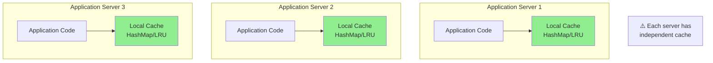
```mermaid
graph TB
    subgraph "Application Server 1"
        APP1[Application Code]
        LOCAL1[Local Cache<br/>HashMap/LRU]
        APP1 --> LOCAL1
    end
    
    subgraph "Application Server 2"
        APP2[Application Code]
        LOCAL2[Local Cache<br/>HashMap/LRU]
        APP2 --> LOCAL2
    end
    
    subgraph "Application Server 3"
        APP3[Application Code]
        LOCAL3[Local Cache<br/>HashMap/LRU]
        APP3 --> LOCAL3
    end
    
    NOTE[⚠️ Each server has<br/>independent cache]
    
    style LOCAL1 fill:#90EE90
    style LOCAL2 fill:#90EE90
    style LOCAL3 fill:#90EE90
```

#### Performance Comparison

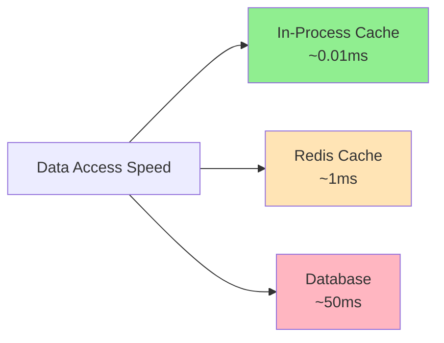
```mermaid
graph LR
    ACCESS[Data Access Speed]
    
    ACCESS --> IP[In-Process Cache<br/>~0.01ms]
    ACCESS --> REDIS[Redis Cache<br/>~1ms]
    ACCESS --> DB[Database<br/>~50ms]
    
    style IP fill:#90EE90
    style REDIS fill:#FFE4B5
    style DB fill:#FFB6C1
```

✅ **Best For**:
- Configuration values
- Feature flags
- Small reference datasets
- Hot keys (frequently accessed)
- Rate limiting counters
- Precomputed values

❌ **Limitations**:
- Not shared across servers
- Inconsistency between instances
- Limited memory per process
- Cache invalidation complexity

> **💡 Interview Tip**: Mention in-process caching only as an optimization layer AFTER introducing external cache.

---

## 🏗️ Cache Architectures

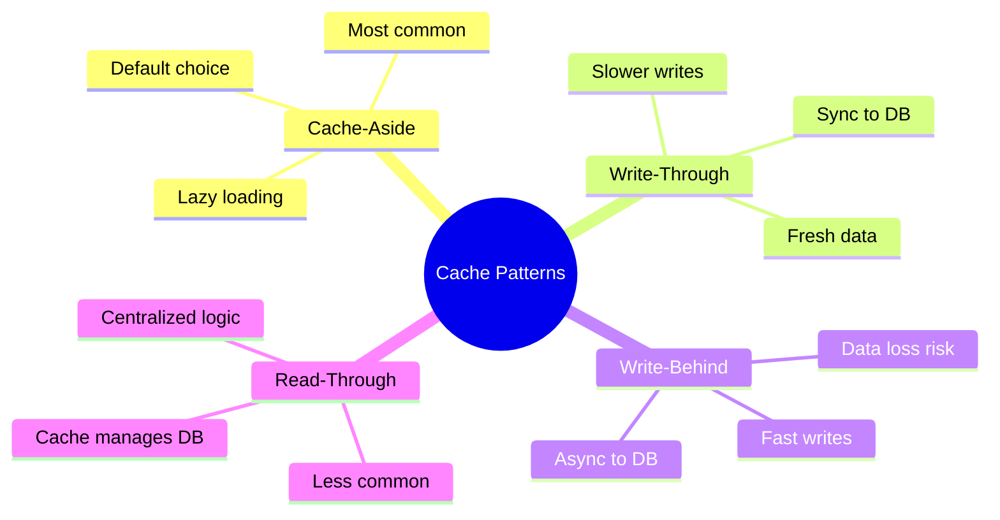
```mermaid
mindmap
    root((Cache Patterns))
        Cache-Aside
            Most common
            Lazy loading
            Default choice
        Write-Through
            Sync to DB
            Slower writes
            Fresh data
        Write-Behind
            Async to DB
            Fast writes
            Data loss risk
        Read-Through
            Cache manages DB
            Centralized logic
            Less common
```

---

### 1️⃣ Cache-Aside (Lazy Loading)

> **Most Common Pattern**: Application manages both cache and database

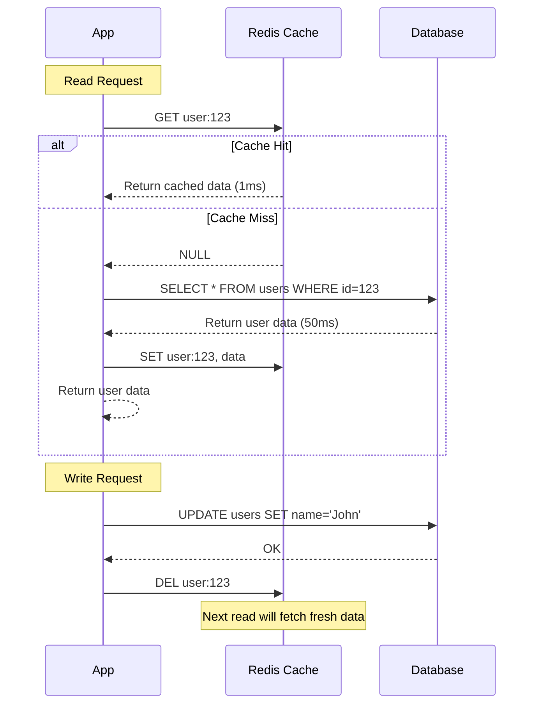
```mermaid
sequenceDiagram
    participant App
    participant Cache as Redis Cache
    participant DB as Database
    
    Note over App: Read Request
    App->>Cache: GET user:123
    
    alt Cache Hit
        Cache-->>App: Return cached data (1ms)
    else Cache Miss
        Cache-->>App: NULL
        App->>DB: SELECT * FROM users WHERE id=123
        DB-->>App: Return user data (50ms)
        App->>Cache: SET user:123, data
        App-->>App: Return user data
    end
    
    Note over App: Write Request
    App->>DB: UPDATE users SET name='John'
    DB-->>App: OK
    App->>Cache: DEL user:123
    Note over Cache: Next read will fetch fresh data
```

#### Implementation Flow

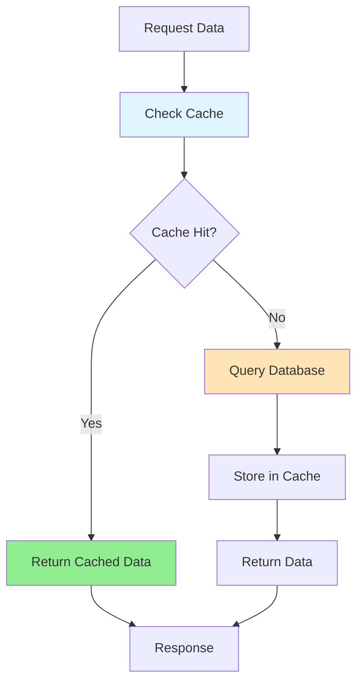
```mermaid
flowchart TB
    START[Request Data]
    
    START --> CHECK[Check Cache]
    CHECK --> HIT{Cache Hit?}
    
    HIT -->|Yes| RETURN1[Return Cached Data]
    HIT -->|No| QUERY[Query Database]
    
    QUERY --> STORE[Store in Cache]
    STORE --> RETURN2[Return Data]
    
    RETURN1 --> END[Response]
    RETURN2 --> END
    
    style CHECK fill:#e1f5ff
    style RETURN1 fill:#90EE90
    style QUERY fill:#FFE4B5
```

✅ **Pros**:
- Simple to implement
- Cache only what's needed
- Lean cache memory usage
- Application has full control

❌ **Cons**:
- Cache miss adds latency
- Potential for stale data
- Thundering herd on popular keys

**When to Use**: Default choice for most caching scenarios

> **💡 Interview Tip**: If you only remember ONE caching pattern, make it cache-aside!

---

### 2️⃣ Write-Through Caching

> **Synchronous Writes**: Cache writes to database before acknowledging

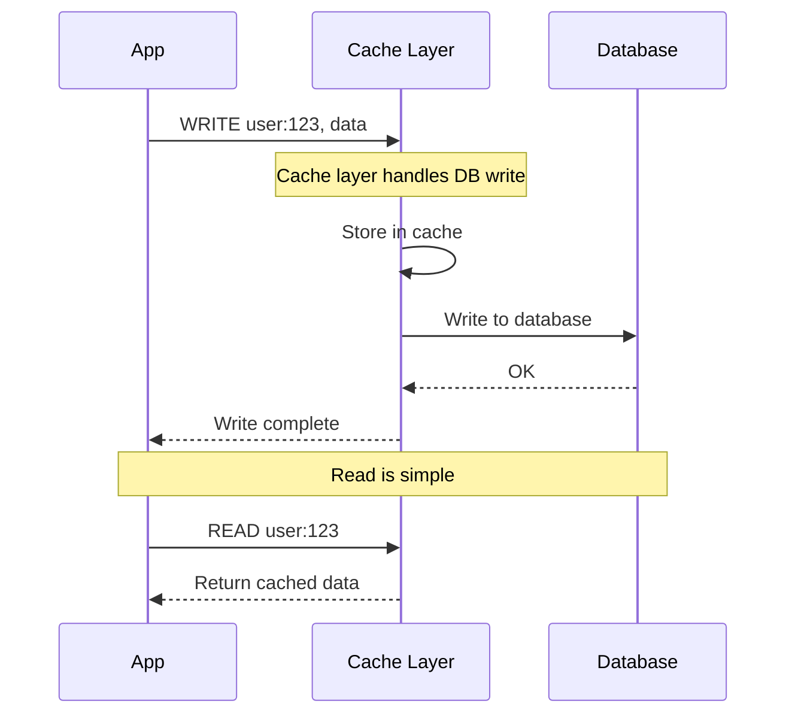
```mermaid
sequenceDiagram
    participant App
    participant Cache as Cache Layer
    participant DB as Database
    
    App->>Cache: WRITE user:123, data
    Note over Cache: Cache layer handles DB write
    Cache->>Cache: Store in cache
    Cache->>DB: Write to database
    DB-->>Cache: OK
    Cache-->>App: Write complete
    
    Note over App,DB: Read is simple
    App->>Cache: READ user:123
    Cache-->>App: Return cached data
```

#### Write-Through vs Cache-Aside

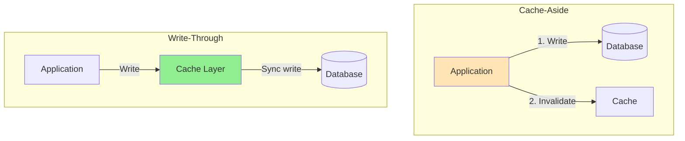
```mermaid
graph TB
    subgraph "Cache-Aside"
        CA_APP[Application]
        CA_CACHE[Cache]
        CA_DB[(Database)]
        
        CA_APP -->|1. Write| CA_DB
        CA_APP -->|2. Invalidate| CA_CACHE
    end
    
    subgraph "Write-Through"
        WT_APP[Application]
        WT_CACHE[Cache Layer]
        WT_DB[(Database)]
        
        WT_APP -->|Write| WT_CACHE
        WT_CACHE -->|Sync write| WT_DB
    end
    
    style CA_APP fill:#FFE4B5
    style WT_CACHE fill:#90EE90
```

✅ **Pros**:
- Cache always has fresh data
- Simpler consistency model
- No stale reads

❌ **Cons**:
- Slower writes (waits for DB)
- Can pollute cache with unread data
- Still has dual-write consistency issues
- Requires specialized infrastructure

**When to Use**: Reads must always return fresh data, can tolerate slower writes

---

### 3️⃣ Write-Behind (Write-Back) Caching

> **Asynchronous Writes**: Cache writes to database in background

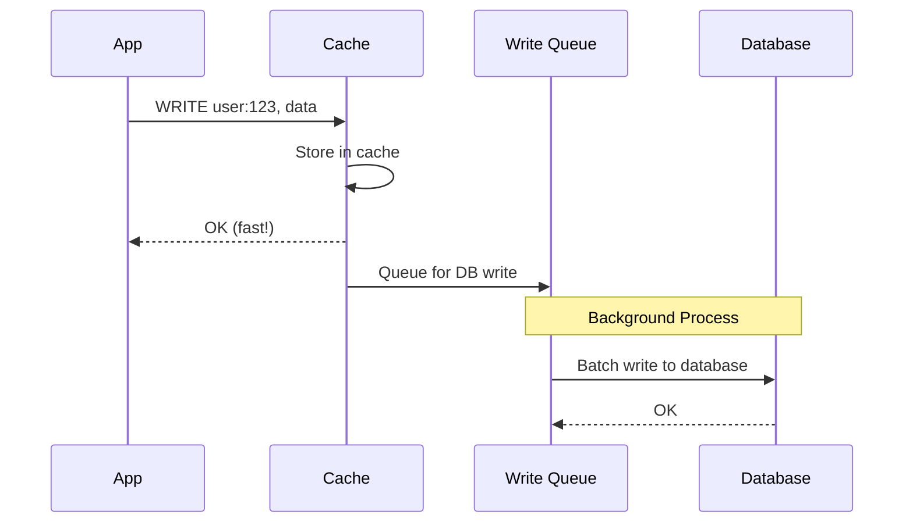
```mermaid
sequenceDiagram
    participant App
    participant Cache
    participant Queue as Write Queue
    participant DB as Database
    
    App->>Cache: WRITE user:123, data
    Cache->>Cache: Store in cache
    Cache-->>App: OK (fast!)
    Cache->>Queue: Queue for DB write
    
    Note over Queue,DB: Background Process
    Queue->>DB: Batch write to database
    DB-->>Queue: OK
```

#### Architecture

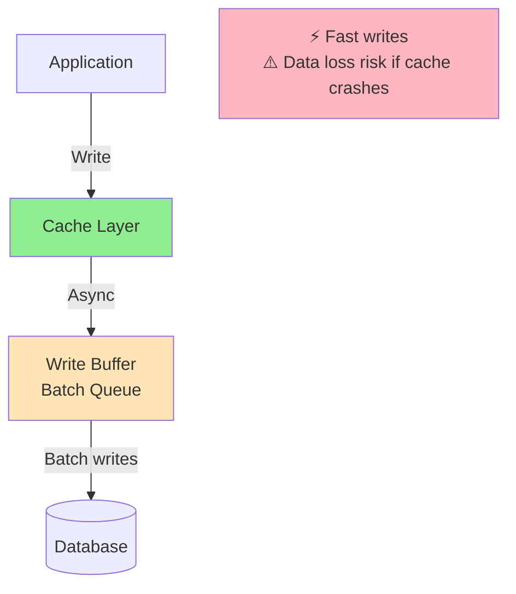
```mermaid
graph TB
    APP[Application]
    CACHE[Cache Layer]
    BUFFER[Write Buffer<br/>Batch Queue]
    DB[(Database)]
    
    APP -->|Write| CACHE
    CACHE -->|Async| BUFFER
    BUFFER -->|Batch writes| DB
    
    NOTE[⚡ Fast writes<br/>⚠️ Data loss risk if cache crashes]
    
    style CACHE fill:#90EE90
    style BUFFER fill:#FFE4B5
    style NOTE fill:#FFB6C1
```

✅ **Pros**:
- Very fast writes
- Reduced database write load
- Can batch multiple writes
- High write throughput

❌ **Cons**:
- **Data loss risk** if cache crashes
- Eventual consistency
- Complex error handling
- Not suitable for critical data

**When to Use**: 
- High write throughput needed
- Eventual consistency acceptable
- Analytics and metrics pipelines
- Log aggregation systems

---

### 4️⃣ Read-Through Caching

> **Cache as Proxy**: Cache manages database reads

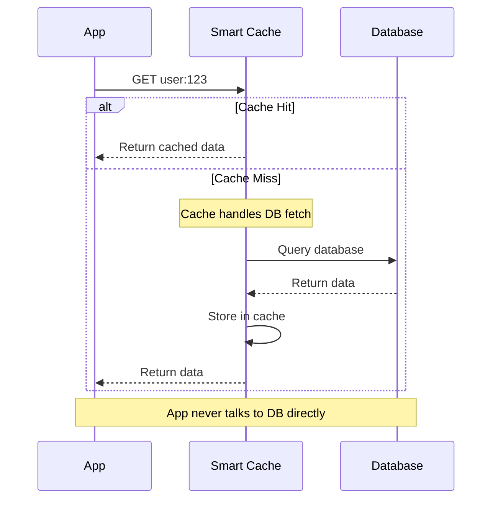
```mermaid
sequenceDiagram
    participant App
    participant Cache as Smart Cache
    participant DB as Database
    
    App->>Cache: GET user:123
    
    alt Cache Hit
        Cache-->>App: Return cached data
    else Cache Miss
        Note over Cache: Cache handles DB fetch
        Cache->>DB: Query database
        DB-->>Cache: Return data
        Cache->>Cache: Store in cache
        Cache-->>App: Return data
    end
    
    Note over App,DB: App never talks to DB directly
```

#### Comparison with Cache-Aside

```mermaid
graph TB
    subgraph "Cache-Aside"
        CA_APP[Application<br/>Manages cache & DB]
        CA_CACHE[Dumb Cache]
        CA_DB[(Database)]
        
        CA_APP <--> CA_CACHE
        CA_APP <--> CA_DB
    end
    
    subgraph "Read-Through"
        RT_APP[Application<br/>Only knows cache]
        RT_CACHE[Smart Cache<br/>Manages DB]
        RT_DB[(Database)]
        
        RT_APP <--> RT_CACHE
        RT_CACHE <--> RT_DB
    end
    
    style CA_APP fill:#FFE4B5
    style RT_CACHE fill:#90EE90
```

✅ **Pros**:
- Centralized caching logic
- Application code simpler
- Works well with write-through

❌ **Cons**:
- Requires specialized cache service
- Less common in practice
- Less control for application

**Examples**:
- CDN (read-through for static content)
- Some caching libraries
- Specialized cache proxies

> **💡 Interview Tip**: Read-through is less common than cache-aside for application-level caching. Mention for CDNs only.

---

## 🔄 Cache Eviction Policies

```mermaid
graph TB
    FULL[Cache Memory Full]
    
    FULL --> Q{Which Entry<br/>to Evict?}
    
    Q --> LRU[LRU<br/>Least Recently Used]
    Q --> LFU[LFU<br/>Least Frequently Used]
    Q --> FIFO[FIFO<br/>First In First Out]
    Q --> TTL[TTL<br/>Time To Live]
    
    LRU --> LRU_DESC[Evict oldest access<br/>✅ Default choice]
    LFU --> LFU_DESC[Evict lowest frequency<br/>✅ For trending content]
    FIFO --> FIFO_DESC[Evict oldest insert<br/>❌ Rarely used]
    TTL --> TTL_DESC[Evict expired entries<br/>✅ Combined with others]
    
    style FULL fill:#e1f5ff
    style LRU fill:#90EE90
    style LFU fill:#FFE4B5
    style FIFO fill:#FFB6C1
    style TTL fill:#90EE90
```

---

### 1️⃣ LRU (Least Recently Used)

> **Most Common**: Evict items not accessed for longest time

```mermaid
graph LR
    subgraph "LRU Cache State"
        HEAD[Most Recent]
        N1[user:5<br/>accessed 1s ago]
        N2[user:3<br/>accessed 5s ago]
        N3[user:7<br/>accessed 10s ago]
        TAIL[Least Recent<br/>user:1<br/>accessed 30s ago]
        
        HEAD --> N1 --> N2 --> N3 --> TAIL
    end
    
    NEW[New access:<br/>user:3]
    NEW --> MOVE[Move to front]
    
    EVICT[Cache full?<br/>Evict from tail]
    TAIL -.->|Evicted| EVICT
    
    style HEAD fill:#90EE90
    style TAIL fill:#FFB6C1
    style NEW fill:#e1f5ff
```

**Implementation**: Linked list + hash map for O(1) access and eviction

✅ **Best For**:
- General-purpose caching
- Temporal locality (recent data used again)
- Most workloads

**Example**: Redis default eviction policy

---

### 2️⃣ LFU (Least Frequently Used)

> **Frequency-Based**: Evict items with lowest access count

```mermaid
graph TB
    subgraph "LFU Cache State"
        K1[user:1<br/>accessed 100 times]
        K2[user:2<br/>accessed 50 times]
        K3[user:3<br/>accessed 10 times]
        K4[user:4<br/>accessed 2 times]
    end
    
    FULL[Cache Full]
    FULL -->|Evict lowest| K4
    
    NOTE[✅ Trending content stays<br/>❌ New items easily evicted]
    
    style K1 fill:#90EE90
    style K2 fill:#90EE90
    style K3 fill:#FFE4B5
    style K4 fill:#FFB6C1
```

✅ **Best For**:
- Trending content (videos, posts)
- Long-term popularity patterns
- Top playlists, popular products

❌ **Drawback**: New items hard to cache (low frequency initially)

---

### 3️⃣ FIFO (First In First Out)

> **Queue-Based**: Evict oldest insertion

```mermaid
graph LR
    QUEUE[Cache Queue]
    
    OLDEST[user:1<br/>Inserted first] --> MID[user:2] --> NEWEST[user:3<br/>Inserted last]
    
    EVICT[Full?<br/>Evict oldest]
    OLDEST -.->|Out| EVICT
    
    style OLDEST fill:#FFB6C1
    style NEWEST fill:#90EE90
```

❌ **Rarely Used**: Ignores usage patterns, may evict hot items

**Example**: Simple queue for non-critical caching

---

### 4️⃣ TTL (Time To Live)

> **Time-Based**: Expire entries after specified duration

```mermaid
sequenceDiagram
    participant App
    participant Cache
    
    App->>Cache: SET user:123, data, TTL=300s
    Note over Cache: Cached with 5min TTL
    
    Note over Cache: Time passes...
    
    Note over Cache: After 5 minutes
    Cache->>Cache: Auto-delete user:123
    
    App->>Cache: GET user:123
    Cache-->>App: NULL (expired)
```

#### TTL Strategy

```mermaid
graph TB
    DATA[Data Type]
    
    DATA --> STATIC[Static Content]
    DATA --> DYNAMIC[Dynamic Content]
    DATA --> SESSION[Session Data]
    
    STATIC --> TTL1[TTL: 1 day]
    DYNAMIC --> TTL2[TTL: 5-60 minutes]
    SESSION --> TTL3[TTL: 30 minutes]
    
    style STATIC fill:#90EE90
    style DYNAMIC fill:#FFE4B5
    style SESSION fill:#e1f5ff
```

✅ **Best For**:
- Ensuring data freshness
- Session tokens
- API responses
- Temporary data

**Often Combined**: TTL + LRU (expire old data, evict least recent when full)

---

## ⚠️ Common Caching Problems

```mermaid
mindmap
    root((Cache Problems))
        Cache Stampede
            Popular key expires
            Thousands of DB queries
            Request coalescing
        Cache Consistency
            Stale data
            Invalidation strategy
            Eventual consistency
        Hot Keys
            Single key overloaded
            Replicate hot keys
            Local cache layer
```

---

### 1️⃣ Cache Stampede (Thundering Herd)

> **Problem**: Popular cache entry expires, causing DB overload

```mermaid
sequenceDiagram
    participant Users as 1000 Users
    participant Cache
    participant DB as Database
    
    Note over Cache: Popular key expires at 12:01:00
    
    Users->>Cache: GET feed:homepage (x1000)
    Cache-->>Users: NULL (expired)
    
    Note over Users,DB: All users hit DB simultaneously!
    Users->>DB: Query homepage feed (x1000)
    Note over DB: 💥 Database overload!
    DB-->>Users: Slow/timeout responses
```

#### Without Protection

```mermaid
graph TB
    EXPIRE[Cache Entry Expires]
    
    EXPIRE --> REQ1[Request 1 → DB]
    EXPIRE --> REQ2[Request 2 → DB]
    EXPIRE --> REQ3[Request 3 → DB]
    EXPIRE --> REQN[Request N → DB]
    
    DB[(Database<br/>💥 Overloaded)]
    
    REQ1 --> DB
    REQ2 --> DB
    REQ3 --> DB
    REQN --> DB
    
    style DB fill:#FFB6C1
```

#### Solution 1: Request Coalescing (Single Flight)

```mermaid
sequenceDiagram
    participant R1 as Request 1
    participant R2 as Request 2-1000
    participant Lock as Single Flight Lock
    participant Cache
    participant DB
    
    R1->>Lock: Acquire lock
    Lock-->>R1: Granted
    R1->>DB: Query database
    
    R2->>Lock: Try acquire lock
    Lock-->>R2: Wait...
    
    DB-->>R1: Return data
    R1->>Cache: SET feed:homepage
    R1->>Lock: Release lock
    R1-->>R1: Return data
    
    Lock-->>R2: Proceed
    R2->>Cache: GET feed:homepage
    Cache-->>R2: Return cached data ✅
```

#### Solution 2: Probabilistic Early Expiration

```mermaid
graph TB
    CHECK[Check Cache]
    
    CHECK --> TTL{TTL Remaining?}
    
    TTL -->|> 10%| RETURN[Return Cached]
    TTL -->|< 10%| PROB{Random < 0.5?}
    
    PROB -->|Yes| REFRESH[Refresh Cache<br/>Proactively]
    PROB -->|No| RETURN
    
    REFRESH --> RETURN
    
    style CHECK fill:#e1f5ff
    style REFRESH fill:#90EE90
```

**Solutions**:
1. ✅ **Request Coalescing**: Only one request rebuilds cache, others wait
2. ✅ **Cache Warming**: Refresh popular keys before expiration
3. ✅ **Probabilistic Early Expiration**: Randomly refresh before TTL expires
4. ✅ **Long TTL with manual invalidation**: Invalidate on writes, not time

---

### 2️⃣ Cache Consistency

> **Problem**: Cache and database show different values

```mermaid
sequenceDiagram
    participant User
    participant App
    participant Cache
    participant DB
    
    Note over User,DB: User updates profile picture
    
    User->>App: Update profile
    App->>DB: UPDATE users SET photo='new.jpg'
    DB-->>App: OK
    
    Note over Cache: ⚠️ Cache still has old value!
    
    User->>App: View profile
    App->>Cache: GET user:123
    Cache-->>App: photo='old.jpg' (stale!)
    App-->>User: Show OLD photo ❌
```

#### Consistency Problem Timeline

```mermaid
graph LR
    T0[T0: Cache has<br/>photo='old.jpg']
    T1[T1: DB updated to<br/>photo='new.jpg']
    T2[T2: Cache still<br/>photo='old.jpg'<br/>INCONSISTENT!]
    T3[T3: Cache invalidated<br/>or expired]
    T4[T4: Consistency<br/>restored]
    
    T0 --> T1 --> T2 --> T3 --> T4
    
    style T2 fill:#FFB6C1
    style T4 fill:#90EE90
```

#### Solution Strategies

```mermaid
flowchart TB
    START[Write Operation]
    
    START --> S1[Update Database]
    S1 --> S2{Consistency<br/>Strategy?}
    
    S2 -->|Invalidate| INV[Delete Cache Entry<br/>Next read fetches fresh]
    S2 -->|Update| UPD[Update Cache<br/>Keep in sync]
    S2 -->|TTL| TTL[Short TTL<br/>Accept staleness]
    S2 -->|Accept| ACC[Eventual Consistency<br/>Tolerate delay]
    
    style INV fill:#90EE90
    style UPD fill:#FFE4B5
    style TTL fill:#FFE4B5
    style ACC fill:#FFE4B5
```

**Solutions**:

1. **Cache Invalidation on Writes** (Most Common):
```python
# Update flow
db.update(user_id, new_data)
cache.delete(f"user:{user_id}")  # Force refresh on next read
```

2. **Short TTL for Stale Tolerance**:
```python
cache.set(f"user:{user_id}", data, ttl=60)  # Max 60s staleness
```

3. **Accept Eventual Consistency**:
- Feeds, metrics, analytics can tolerate slight staleness
- Trade-off: Better performance for acceptable consistency

---

### 3️⃣ Hot Keys

> **Problem**: Single cache key receives massive traffic

```mermaid
graph TB
    subgraph "Problem: Single Hot Key"
        USERS[Millions of Users]
        KEY[user:taylorswift<br/>🔥 HOT KEY]
        SHARD[Single Redis Shard<br/>💥 Overloaded]
        
        USERS -->|All requests| KEY
        KEY --> SHARD
    end
    
    NOTE[⚠️ One key bottlenecks<br/>entire Redis node]
    
    style KEY fill:#FFB6C1
    style SHARD fill:#FFB6C1
```

#### Example: Viral Content

```
Taylor Swift posts on Twitter
→ user:taylorswift key receives 1M requests/second
→ Single Redis shard can't handle load
→ High latency, dropped requests
```

#### Solution 1: Replicate Hot Keys

```mermaid
graph TB
    LB[Load Balancer]
    
    HOT1[user:taylorswift:1<br/>Replica 1]
    HOT2[user:taylorswift:2<br/>Replica 2]
    HOT3[user:taylorswift:3<br/>Replica 3]
    
    LB --> HOT1
    LB --> HOT2
    LB --> HOT3
    
    NOTE[✅ Distribute load<br/>across replicas]
    
    style LB fill:#e1f5ff
    style HOT1 fill:#90EE90
    style HOT2 fill:#90EE90
    style HOT3 fill:#90EE90
```

#### Solution 2: Local In-Process Cache

```mermaid
graph TB
    subgraph "Application Servers"
        APP1[App Server 1<br/>Local cache: hot keys]
        APP2[App Server 2<br/>Local cache: hot keys]
        APP3[App Server 3<br/>Local cache: hot keys]
    end
    
    REDIS[Redis<br/>Reduced load]
    
    APP1 -.->|Rare refresh| REDIS
    APP2 -.->|Rare refresh| REDIS
    APP3 -.->|Rare refresh| REDIS
    
    style APP1 fill:#90EE90
    style APP2 fill:#90EE90
    style APP3 fill:#90EE90
```

**Solutions**:
1. ✅ **Replicate Hot Keys**: Store same value on multiple cache nodes
2. ✅ **Local In-Process Cache**: Keep extremely hot values in application memory
3. ✅ **Rate Limiting**: Throttle abusive traffic patterns
4. ✅ **CDN Layer**: Move hot static content to CDN

---

## 🏭 Production Caching Tricks

### Multi-Tier Caching (L1 + L2)

Netflix, Lyft, and Uber run two cache layers to get near-zero latency for their hottest keys:

```mermaid
graph LR
    REQUEST[Request]

    REQUEST --> L1[L1: In-Process Cache<br/>~10K entries, 0.01ms<br/>Caffeine / Guava]
    L1 -->|L1 miss| L2[L2: Redis Cluster<br/>Millions of entries, 1ms]
    L2 -->|L2 miss| DB[(Database<br/>50ms)]

    NOTE[99% hit L1 or L2<br/>DB sees <1% of traffic]

    style L1 fill:#90EE90
    style L2 fill:#FFE4B5
    style DB fill:#FFB6C1
```

```python
class TwoTierCache:
    def __init__(self):
        self.l1 = TTLCache(maxsize=10_000, ttl=30)    # 30s in-process
        self.l2 = redis.Redis()                         # External Redis

    def get(self, key):
        # L1 hit — near zero latency
        if key in self.l1:
            return self.l1[key]

        # L2 hit — ~1ms
        val = self.l2.get(key)
        if val:
            self.l1[key] = val    # Populate L1
            return val

        # DB hit — ~50ms
        val = db.fetch(key)
        self.l2.setex(key, 600, val)   # 10min in Redis
        self.l1[key] = val             # 30s in-process
        return val
```

**Netflix** uses this exact pattern with EVCache (Memcached) as L2. Their L1 cache (in each JVM) absorbs 90%+ of read traffic.

---

### TTL Jitter — Prevent Cache Avalanche

Never set all keys to the same TTL. When a deployment happens or a batch expires together, every key expires simultaneously → database thundering herd.

```python
import random

BASE_TTL = 600  # 10 minutes

def set_with_jitter(redis, key, value, base_ttl=BASE_TTL):
    # Add ±10% random jitter
    jitter = random.randint(0, base_ttl // 10)
    ttl = base_ttl + jitter
    redis.setex(key, ttl, value)

# Result: keys expire between 600-660 seconds
# → staggered cache misses → DB load is spread out
```

**Production rule**: Always add 10-20% random jitter to TTLs for any large batch of cached objects.

---

### Cache Penetration — Negative Caching

**Problem**: Users query for non-existent IDs (e.g., deleted users, invalid product IDs). Every request misses the cache and hits the DB.

```mermaid
sequenceDiagram
    participant Attacker
    participant Cache
    participant DB

    loop 10,000 times
        Attacker->>Cache: GET user:999999 (doesn't exist)
        Cache-->>Attacker: NULL (miss)
        Attacker->>DB: SELECT * FROM users WHERE id=999999
        DB-->>Attacker: Empty result — but DB was hit!
    end

    Note over DB: 💥 DB overloaded by "phantom" queries
```

**Solution: Cache the negative result**:

```python
NEGATIVE_SENTINEL = "__NOT_FOUND__"
NEGATIVE_TTL = 60  # 1 minute

def get_user(user_id):
    cached = redis.get(f"user:{user_id}")

    if cached == NEGATIVE_SENTINEL:
        return None  # Known miss — don't hit DB

    if cached is not None:
        return deserialize(cached)

    # DB query
    user = db.get_user(user_id)

    if user is None:
        # Cache the negative result with SHORT TTL
        redis.setex(f"user:{user_id}", NEGATIVE_TTL, NEGATIVE_SENTINEL)
        return None

    redis.setex(f"user:{user_id}", 600, serialize(user))
    return user
```

**Bloom filter alternative**: Facebook uses Bloom filters to cheaply answer "does this key definitely NOT exist?" without DB queries. False positive rate ~1% is acceptable.

---

### Cache Warming — Prevent Cold Start

After a deployment or Redis restart, you have an empty cache. First minutes see 100% miss rate:

```mermaid
graph TB
    COLD[Cold Cache After Deploy]

    COLD --> S1[Strategy 1: Lazy Warming<br/>Cache fills naturally as users request data<br/>⚠️ Slow — first users get DB latency]

    COLD --> S2[Strategy 2: Proactive Warming<br/>Background job pre-populates hot keys before traffic hits<br/>✅ Fast — no cold start penalty]

    COLD --> S3[Strategy 3: Snapshot Restore<br/>Restore Redis RDB snapshot from before deploy<br/>✅ Instant — if compatible with new code]

    style S1 fill:#FFE4B5
    style S2 fill:#90EE90
    style S3 fill:#90EE90
```

```python
# Proactive warming — run before deploying new instances
def warm_cache():
    # Get top 10,000 most-accessed user IDs from analytics
    hot_user_ids = analytics.get_top_users(limit=10_000)

    for user_id in hot_user_ids:
        user = db.get_user(user_id)
        redis.setex(f"user:{user_id}", 600, serialize(user))
        time.sleep(0.001)  # Throttle to not overwhelm DB
```

**Twitter** warms timeline caches for active users on deploys. **Instagram** pre-warms feed caches for returning users.

---

### Cache Key Design

Good key design prevents collisions, enables monitoring, and supports versioning:

```python
# ❌ Bad: Collisions, no namespace, no versioning
redis.set("user_123", data)
redis.set("123", data)  # Collides with user 123?

# ✅ Good: Namespaced, versioned, clear
KEY_VERSION = "v2"

def cache_key(entity_type, entity_id, field=None):
    parts = [KEY_VERSION, entity_type, str(entity_id)]
    if field:
        parts.append(field)
    return ":".join(parts)

# Examples:
# "v2:user:123"
# "v2:user:123:profile"
# "v2:feed:456:home"
# "v2:product:789:inventory"
```

**Version prefix trick**: When you change your data schema, increment `KEY_VERSION`. All old keys become unreachable (and eventually evicted by LRU) without needing explicit invalidation.

---

### Redis Data Structures for Common Patterns

Redis isn't just key-value. Using the right data structure is 10-100x more memory efficient:

```python
# ❌ Storing full JSON objects for a leaderboard
redis.set("score:user:1", json.dumps({"user_id": 1, "score": 9500}))
redis.set("score:user:2", json.dumps({"user_id": 2, "score": 8200}))
# Getting top 10 requires reading all keys + sorting in app

# ✅ Redis sorted set for leaderboard
redis.zadd("leaderboard:global", {
    "user:1": 9500,
    "user:2": 8200,
    "user:3": 7100,
})
# Get top 10 in O(log N + K): already sorted!
redis.zrevrange("leaderboard:global", 0, 9, withscores=True)

# ✅ Redis hash for user profile (vs JSON string)
redis.hset("user:123", mapping={
    "name": "Alice",
    "email": "alice@example.com",
    "premium": "1",
})
# Update just one field without fetching full object
redis.hset("user:123", "premium", "0")

# ✅ Redis set for "who follows who"
redis.sadd("followers:user:123", "user:456", "user:789")
redis.sismember("followers:user:123", "user:456")  # O(1) check
```

---

### Production Monitoring Metrics

Your cache is healthy only if you're watching these:

| Metric | Target | Action if Violated |
|--------|--------|--------------------|
| **Hit Rate** | > 90% | Add more cache, fix key design |
| **Eviction Rate** | < 5%/min | Increase Redis memory |
| **P99 Latency** | < 5ms | Check network, cluster health |
| **Memory Usage** | < 80% | Scale Redis or reduce TTLs |
| **Connected Clients** | < 80% of `maxclients` | Tune connection pools |

```bash
# Redis stats in production
redis-cli info stats | grep -E "keyspace_hits|keyspace_misses|evicted_keys"

# Hit rate calculation
hit_rate = hits / (hits + misses) * 100
# Target: > 90%

# Redis INFO memory
redis-cli info memory | grep -E "used_memory_human|mem_fragmentation_ratio"
```

---

## 🌍 Real-World Company Examples

```mermaid
graph TB
    subgraph "Netflix — EVCache"
        N1[Multi-tier: JVM L1 + Memcached L2]
        N2[~2 trillion cache hits/day]
        N3[Saved ~99% of metadata DB calls]
    end

    subgraph "Twitter — Twemcache"
        T1[Timeline cache: precomputed fan-out]
        T2[Hot keys replicated across shards]
        T3[Redis for rate limiting, Lua scripts]
    end

    subgraph "Facebook — Memcached + TAO"
        F1[TAO: Read-through cache for social graph]
        F2[Cache invalidation via McSqueal (MySQL binlog)]
        F3[Thundering herd protection: lease tokens]
    end

    subgraph "Discord — Redis"
        D1[Users online status: Redis sets]
        D2[Guild member lists: Redis sorted sets]
        D3[Moved hot guilds to separate Redis shards]
    end

    style N1 fill:#e1f5ff
    style T1 fill:#FFE4B5
    style F1 fill:#90EE90
    style D1 fill:#FFB6C1
```

### Facebook's Lease Token (Thundering Herd Solution)

Facebook published this pattern to handle cache stampedes at scale:

```
1. Client 1 misses cache for key K
2. Cache returns a LEASE TOKEN (unique ID) to Client 1
   "You have permission to fetch from DB"
3. Clients 2, 3, 4 also miss key K
4. Cache tells Clients 2-N: "WAIT — a lease is outstanding"
5. Client 1 fetches from DB, writes to cache
6. Clients 2-N retry and get the cached value
```

This prevents thousands of simultaneous DB queries for one expired key — exactly what `singleflight` in Go and Java's Guava `LoadingCache` implement.

---

## 🎤 Caching in System Design Interviews

### When to Bring Up Caching

```mermaid
flowchart TB
    START[System Design]
    
    START --> CHECK{Caching<br/>Needed?}
    
    CHECK -->|Read-heavy<br/>10M+ reads/day| YES1[✅ Bring up caching]
    CHECK -->|Expensive queries<br/>200ms+ per query| YES2[✅ Bring up caching]
    CHECK -->|High DB CPU<br/>80%+ utilization| YES3[✅ Bring up caching]
    CHECK -->|Latency requirements<br/>Sub-10ms needed| YES4[✅ Bring up caching]
    
    CHECK -->|Low traffic<br/>Simple queries| NO[❌ Not needed yet]
    
    style YES1 fill:#90EE90
    style YES2 fill:#90EE90
    style YES3 fill:#90EE90
    style YES4 fill:#90EE90
    style NO fill:#FFB6C1
```

### Interview Framework

```mermaid
graph TB
    STEP1[1. Identify Bottleneck]
    STEP2[2. Decide What to Cache]
    STEP3[3. Choose Architecture]
    STEP4[4. Set Eviction Policy]
    STEP5[5. Address Downsides]
    
    STEP1 --> STEP2 --> STEP3 --> STEP4 --> STEP5
    
    STEP1 --> D1[Database load?<br/>Query latency?<br/>Expensive computation?]
    STEP2 --> D2[Frequently read?<br/>Rarely changes?<br/>Expensive to fetch?]
    STEP3 --> D3[Cache-aside<br/>Write-through?<br/>CDN for media?]
    STEP4 --> D4[LRU + TTL<br/>How long to cache?]
    STEP5 --> D5[Cache failures?<br/>Invalidation strategy?<br/>Hot keys?]
    
    style STEP1 fill:#e1f5ff
    style STEP2 fill:#e1f5ff
    style STEP3 fill:#90EE90
    style STEP4 fill:#FFE4B5
    style STEP5 fill:#FFB6C1
```

### Example Interview Script

**1. Identify Bottleneck**:
> "We're serving 10M daily active users, each making 20 requests per day. That's 200M reads hitting the database. Even with indexes, we're looking at 20-50ms per query. A cache drops that to under 2ms and takes most load off the database."

**2. Decide What to Cache**:
> "We'll cache user profiles since they're read on every page load but only updated when users edit settings. We'll also cache the trending posts feed since it's computed from expensive aggregations but only needs to refresh every minute."

**3. Choose Architecture**:
> "I'll use cache-aside with Redis. On a read, we check Redis first. If it's there, return it. If not, query the database, store in Redis with a TTL, and return it."

**4. Set Eviction Policy**:
> "We'll use LRU eviction with a 10-minute TTL on user profiles. That keeps the cache from growing unbounded while ensuring profiles don't get too stale."

**5. Address Downsides**:
> "When a user updates their profile, we'll delete the cache entry so the next read fetches fresh data. If Redis is unavailable, requests fall back to the database with circuit breakers to prevent overload."

---

## 🎓 Key Takeaways

```mermaid
mindmap
    root((Caching Essentials))
        Why Cache
            50x latency improvement
            Reduce DB load
            Handle high traffic
        Where to Cache
            External Redis default
            CDN for static media
            In-process for hot keys
        How to Cache
            Cache-aside default
            Invalidate on writes
            LRU + TTL eviction
        Problems
            Cache stampede
            Stale data
            Hot keys
```

### Decision Matrix

| Scenario | Cache Type | Pattern | TTL |
|----------|------------|---------|-----|
| User profiles | External (Redis) | Cache-aside | 10 min |
| Static images | CDN | Read-through | 24 hours |
| Trending feed | External (Redis) | Cache-aside | 1 min |
| Config values | In-process | N/A | 5 min |
| Session data | External (Redis) | Cache-aside | 30 min |
| Analytics data | External (Redis) | Write-behind | N/A |

### Quick Reference

```mermaid
graph TB
    Q[Need Caching?]
    
    Q --> Q1{Type of data?}
    
    Q1 -->|User data<br/>API responses| EXT[External Cache<br/>Redis + Cache-Aside<br/>LRU + TTL]
    
    Q1 -->|Images<br/>Videos<br/>Static files| CDN_C[CDN<br/>Cloudflare/Fastly<br/>Long TTL]
    
    Q1 -->|Config<br/>Feature flags| PROC[In-Process<br/>Local HashMap<br/>Short TTL]
    
    style EXT fill:#90EE90
    style CDN_C fill:#90EE90
    style PROC fill:#90EE90
```

---

## 📝 Conclusion

### Core Trade-off

```mermaid
graph LR
    CACHE[Caching]
    
    CACHE --> PROS[✅ Benefits]
    CACHE --> CONS[❌ Trade-offs]
    
    PROS --> P1[50x faster reads]
    PROS --> P2[Reduced DB load]
    PROS --> P3[Better scalability]
    
    CONS --> C1[Stale data]
    CONS --> C2[Cache invalidation]
    CONS --> C3[Additional complexity]
    
    style PROS fill:#90EE90
    style CONS fill:#FFB6C1
```

### Remember

> **Caching is what you do when reading from the database is too slow or too expensive.**

**Interview Strategy**:
1. ✅ Establish bottleneck FIRST (don't jump to caching)
2. ✅ Default to Redis with cache-aside
3. ✅ Explain cache keys (e.g., `user:123:profile`)
4. ✅ Choose eviction policy (LRU + TTL)
5. ✅ Address cache failures and invalidation
6. ✅ Mention CDN for static media
7. ❌ Don't cache everything - be selective!

**Most Important**:
- Cache-aside is the default pattern
- LRU + TTL is the default eviction
- Redis is the default cache
- Always address invalidation strategy

---

## 📚 Related Concepts

- [Database Indexing](./DataIndexing.md) - Optimize database queries
- [Data Modeling](./DataModelling.md) - Design efficient schemas
- [Redis Deep Dive](./Redis.md) - In-memory cache internals
- [Load Balancing](./LoadBalancing.md) - Distribute cache traffic
- [System Design Patterns](./Patterns.md) - Scaling strategies

---

**Last Updated**: December 2024
**Source**: [HelloInterview - Caching](https://www.hellointerview.com/learn/system-design/core-concepts/caching)

> **💡 Final Tip**: Don't cache everything. Show you understand when caching is worth the complexity and when a well-indexed database is enough.
