# ⭕ Consistent Hashing

> **Core Concept**: Consistent hashing is an algorithm that minimizes data redistribution when adding or removing servers in a distributed system. It arranges data and servers in a circular space (hash ring) to ensure only a small fraction of data needs to move when the cluster changes.

## 📋 Table of Contents
- [Overview](#overview)
- [The Problem with Simple Hashing](#the-problem-with-simple-hashing)
- [How Consistent Hashing Works](#how-consistent-hashing-works)
- [Virtual Nodes](#virtual-nodes)
- [Real-World Applications](#real-world-applications)
- [Interview Strategy](#interview-strategy)
- [Conclusion](#conclusion)

---

## 🎯 Overview

### The Challenge

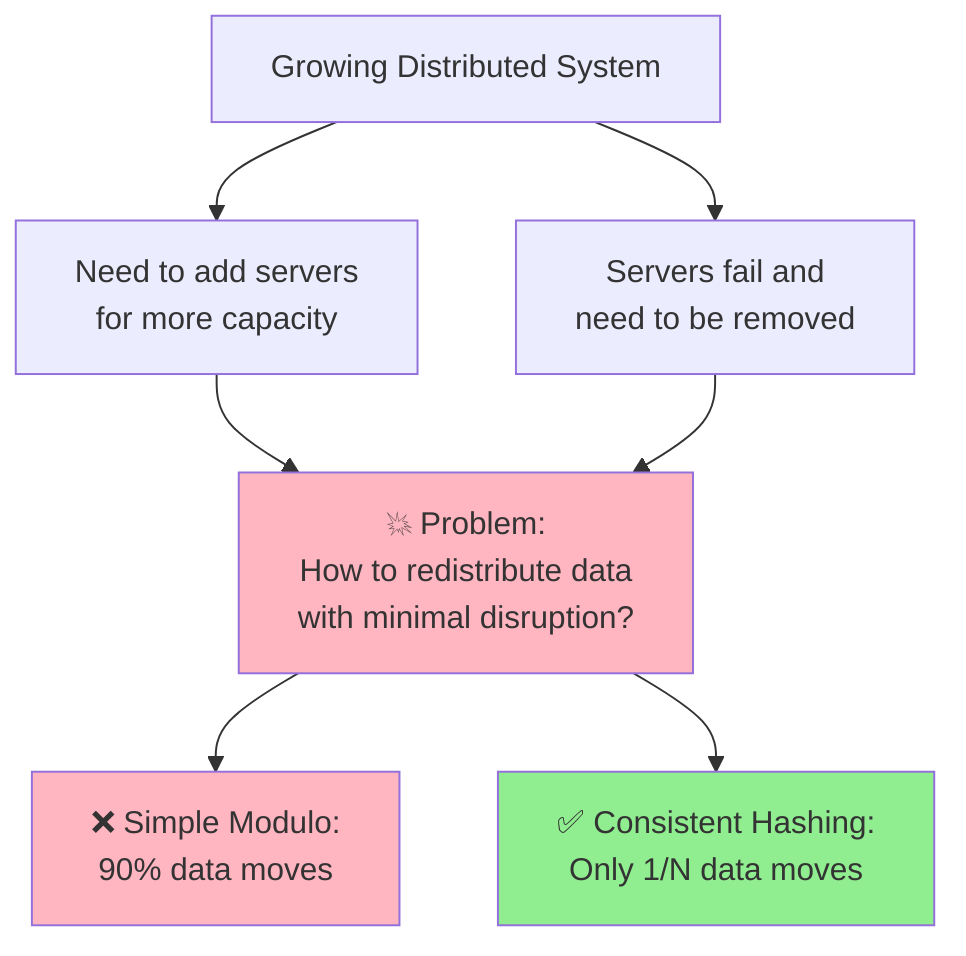

### Evolution of Data Distribution

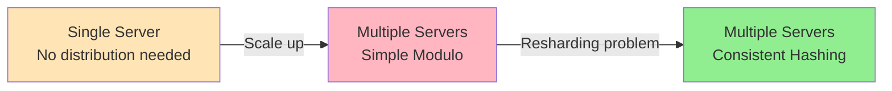

---

## ❌ The Problem with Simple Hashing

### Scenario: Ticketing System (TicketMaster)

#### Phase 1: Single Database

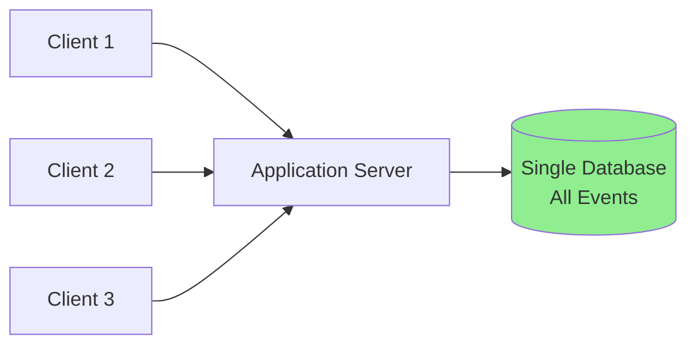

**Works great initially!** ✅

#### Phase 2: Need to Scale (Sharding)

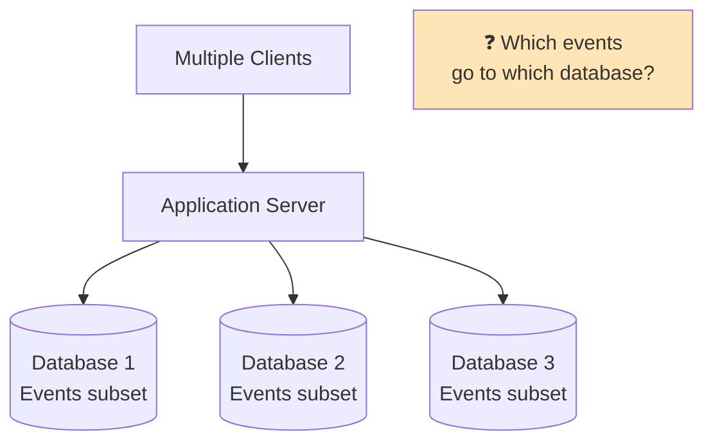

---

### Simple Modulo Hashing

> **Approach**: Hash the event ID, then modulo by number of databases

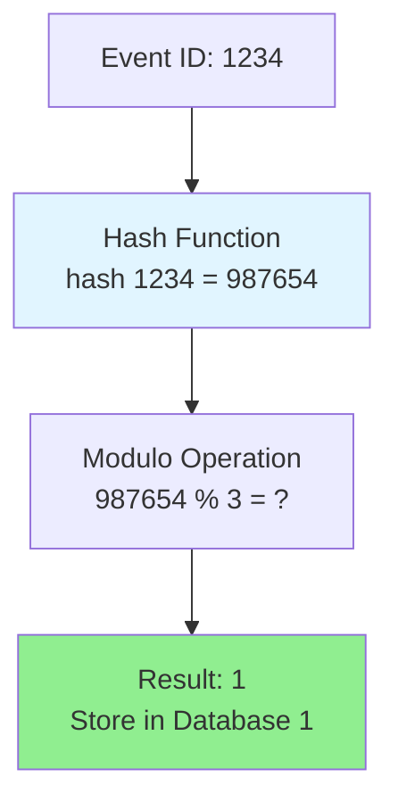

**Formula**: `database_id = hash(event_id) % number_of_databases`

#### Example Distribution with 3 Databases

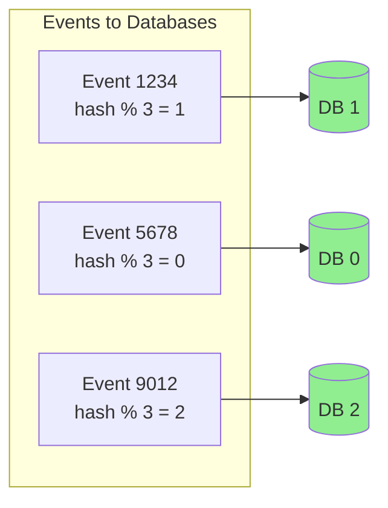

```
Event #1234 → hash(1234) % 3 = 1 → Database 1
Event #5678 → hash(5678) % 3 = 0 → Database 0
Event #9012 → hash(9012) % 3 = 2 → Database 2
```

---

### Problem 1: Adding a Server

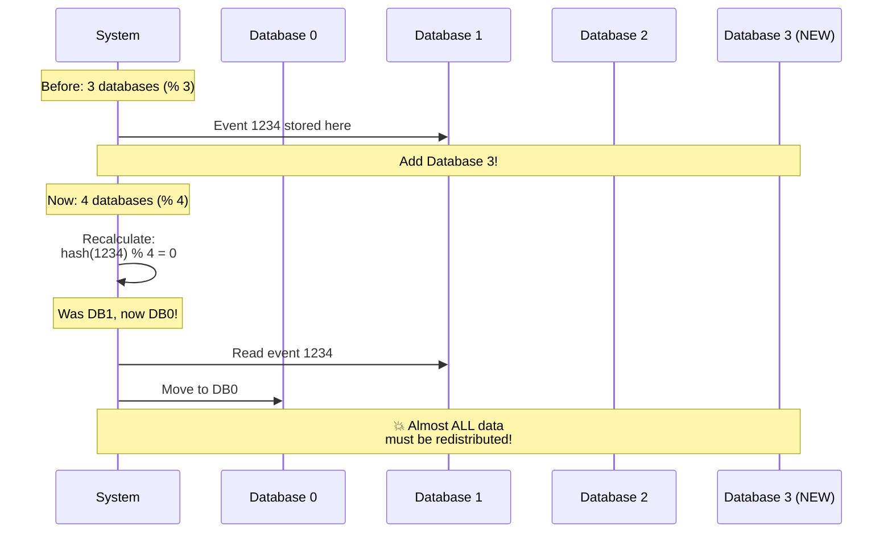

#### Data Movement Visualization

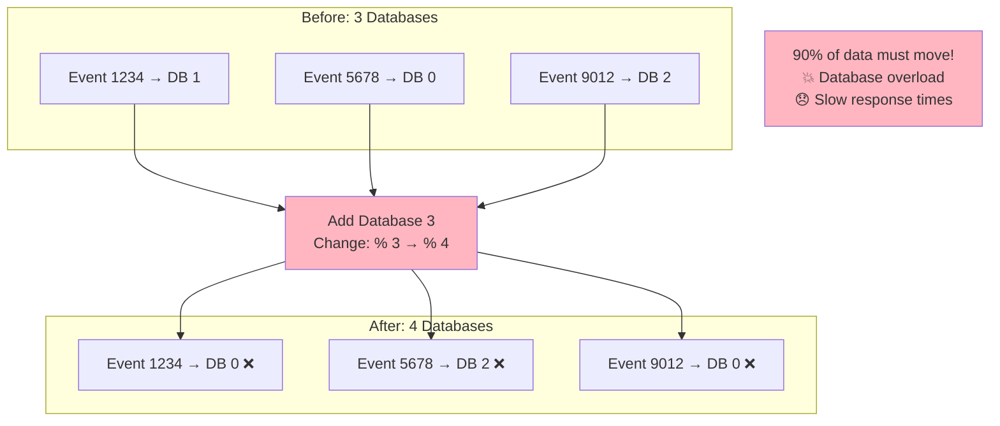

---

### Problem 2: Removing a Server

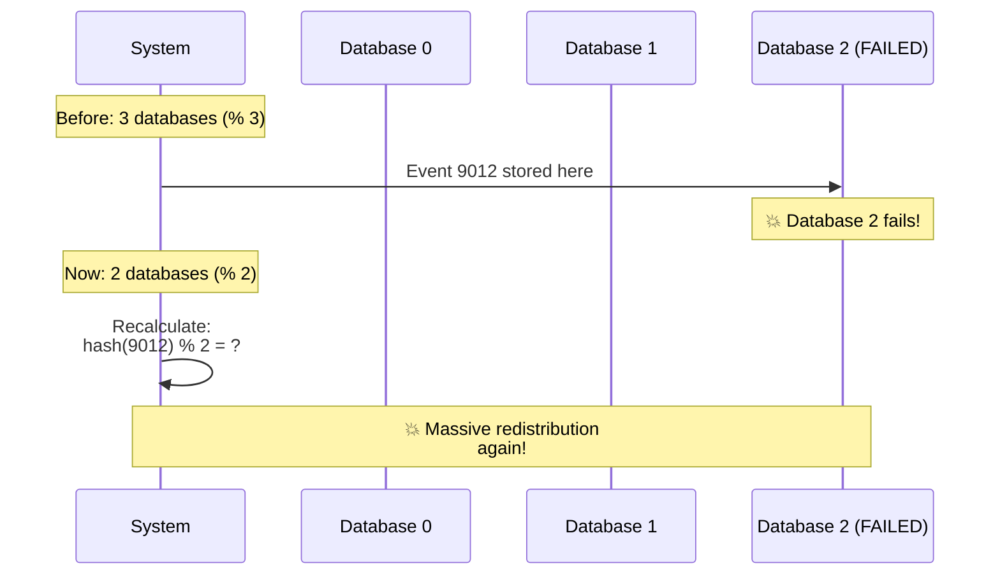

#### The Redistribution Cascade

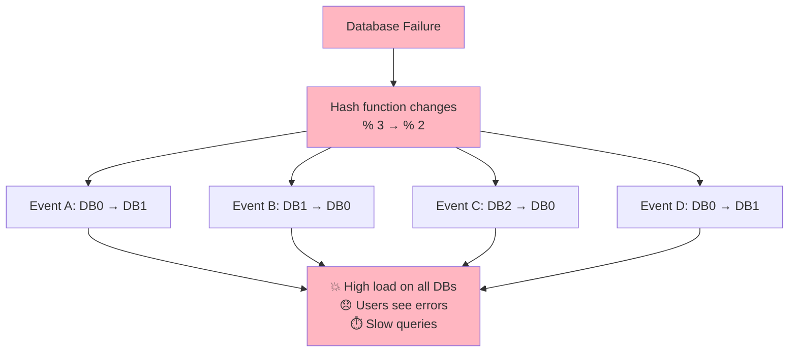

---

## ✅ How Consistent Hashing Works

### The Hash Ring Concept

> **Key Insight**: Arrange both data and servers in a circular space

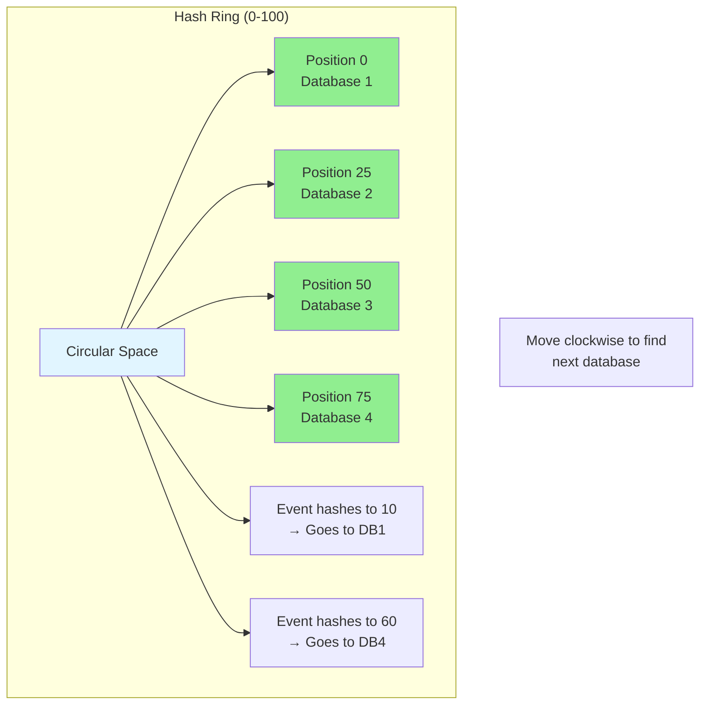

### Hash Ring Visualization

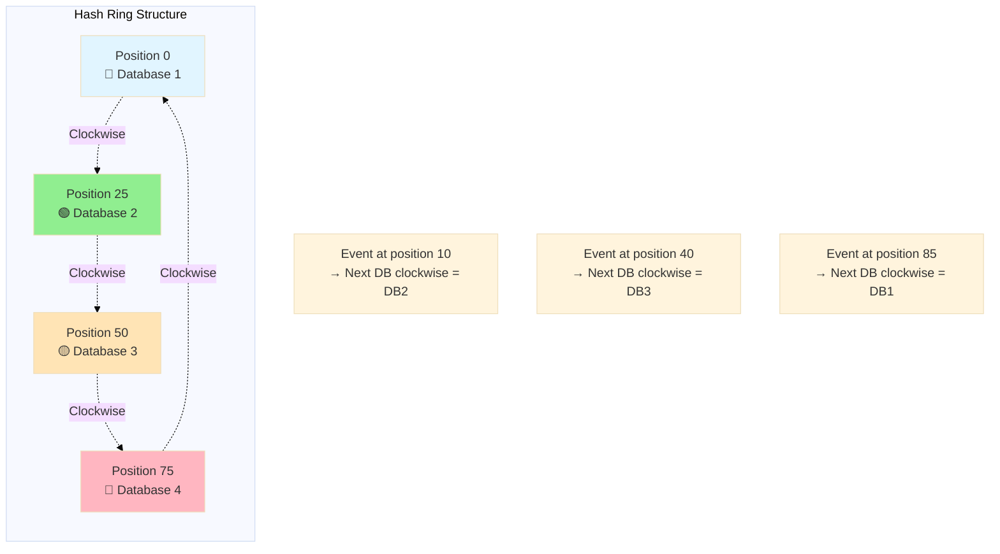

### How Assignment Works

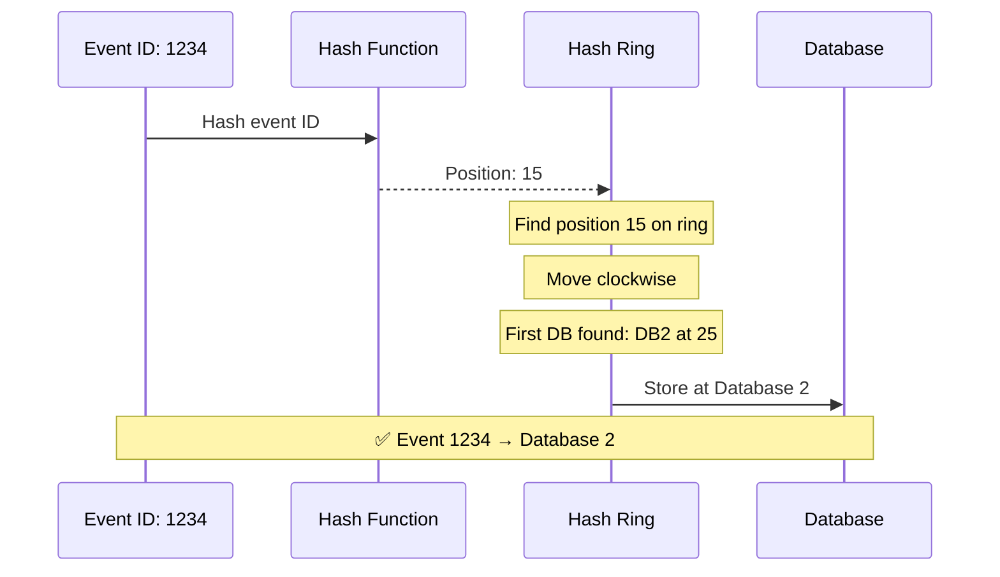

**Algorithm**:
1. Hash the event ID to get a position on the ring (0-100)
2. Find that position on the ring
3. Move clockwise until you hit a database
4. Store the event in that database

---

### Adding a Server (Consistent Hashing)

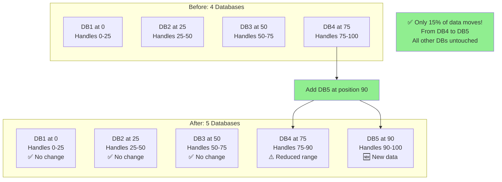

#### Impact Analysis

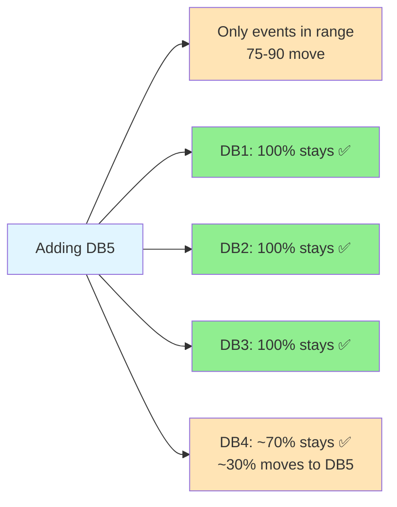

**Result**: Only ~15% of total data needs to move!

---

### Removing a Server (Consistent Hashing)

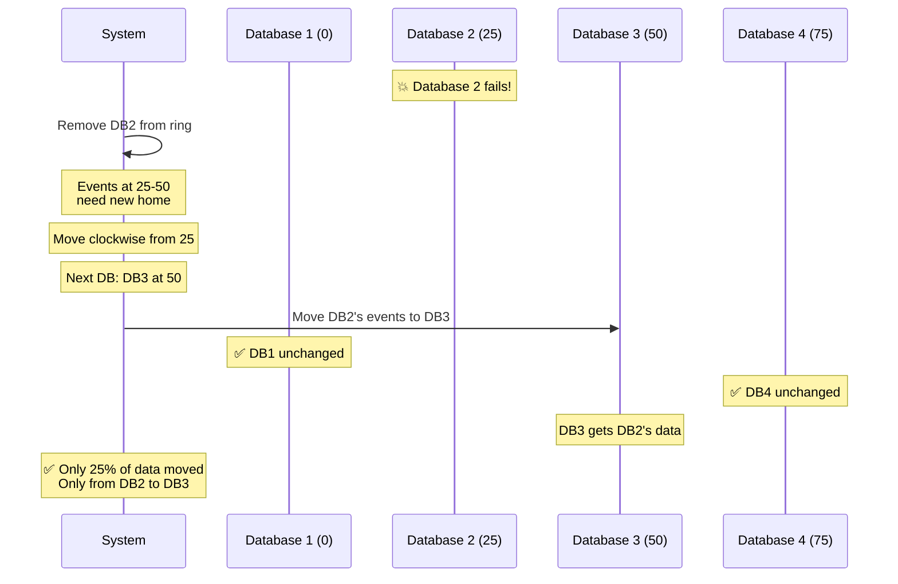

#### Removal Impact

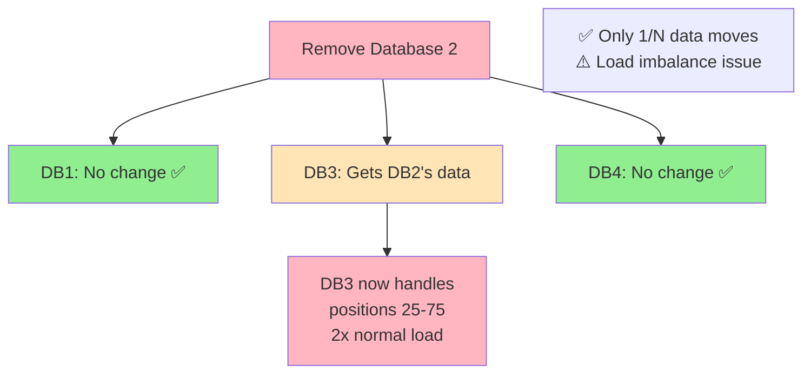

---

## 🔀 Virtual Nodes

> **Problem**: When removing a server, all its load goes to one neighbor, creating imbalance

### The Load Imbalance Problem

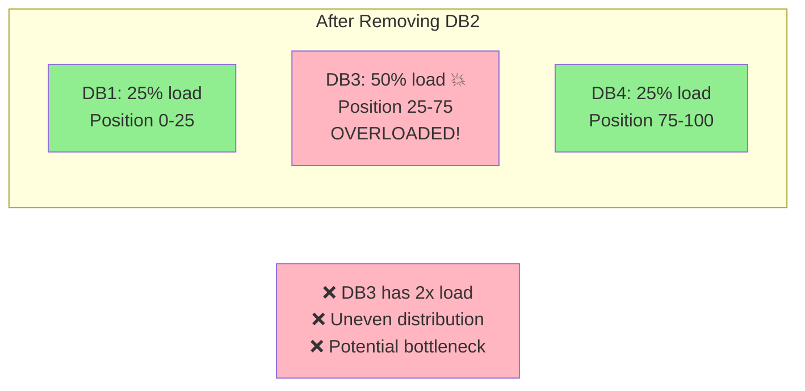

---

### Solution: Virtual Nodes

> **Concept**: Place each database at multiple positions on the ring

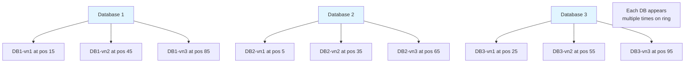

### How Virtual Nodes Work

**Instead of**:
```
DB1 → hash("DB1") = position 0
```

**Use**:
```
DB1-vn1 → hash("DB1-vn1") = position 15
DB1-vn2 → hash("DB1-vn2") = position 45
DB1-vn3 → hash("DB1-vn3") = position 85
```

### Hash Ring with Virtual Nodes

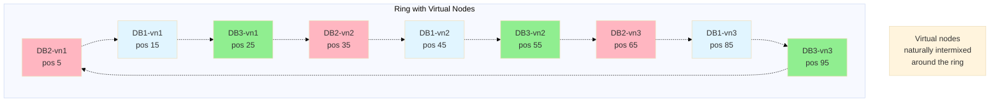

---

### Removing Server with Virtual Nodes

```mermaid
sequenceDiagram
    participant Ring as Hash Ring
    participant DB1
    participant DB2
    participant DB3
    
    Note over Ring: DB2 has virtual nodes at:<br/>5, 35, 65
    
    Note over DB2: 💥 Database 2 fails!
    
    Ring->>Ring: Remove DB2-vn1 (pos 5)
    Note over Ring: Events 5-15 → DB1
    
    Ring->>Ring: Remove DB2-vn2 (pos 35)
    Note over Ring: Events 35-45 → DB1
    
    Ring->>Ring: Remove DB2-vn3 (pos 65)
    Note over Ring: Events 65-85 → DB1
    
    Note over DB1: Gets ~33% of DB2's load
    Note over DB3: Gets ~33% of DB2's load
    Note over Ring: Other DBs get rest
    
    Note over Ring: ✅ Load distributed evenly!
```

### Load Distribution Comparison

```mermaid
graph TB
    subgraph "Without Virtual Nodes"
        W1[DB1: 25%]
        W3[DB3: 50% 💥]
        W4[DB4: 25%]
    end
    
    subgraph "With Virtual Nodes"
        V1[DB1: 33%]
        V3[DB3: 33%]
        V4[DB4: 34%]
    end
    
    NOTE1[❌ Imbalanced<br/>One DB overloaded]
    NOTE2[✅ Balanced<br/>Even distribution]
    
    W3 --> NOTE1
    V3 --> NOTE2
    
    style W3 fill:#FFB6C1
    style NOTE1 fill:#FFB6C1
    style V1 fill:#90EE90
    style V3 fill:#90EE90
    style V4 fill:#90EE90
    style NOTE2 fill:#90EE90
```

### Benefits of Virtual Nodes

```mermaid
mindmap
    root((Virtual Nodes))
        Even Distribution
            Load spread across all servers
            No single overloaded server
            Better resource utilization
        Flexibility
            Different servers different VNs
            More VNs = more balanced
            Typical: 100-200 per server
        Graceful Degradation
            Server failure distributed
            Multiple servers share load
            No single point of stress
```

**Typical Configuration**: 100-200 virtual nodes per physical server

---

## 🌍 Real-World Applications

```mermaid
graph TB
    CH[Consistent Hashing]
    
    CH --> DB[Distributed Databases]
    CH --> CACHE[Distributed Caches]
    CH --> CDN[Content Delivery]
    CH --> BROKER[Message Brokers]
    
    DB --> DB1[Apache Cassandra<br/>Data partitioning]
    DB --> DB2[Amazon DynamoDB<br/>Auto-scaling]
    
    CACHE --> C1[Redis Cluster<br/>Key distribution]
    CACHE --> C2[Memcached<br/>Cache sharding]
    
    CDN --> CDN1[Edge Server Selection<br/>Content routing]
    
    BROKER --> B1[Kafka<br/>Partition assignment]
    
    style CH fill:#e1f5ff
    style DB1 fill:#90EE90
    style DB2 fill:#90EE90
    style C1 fill:#90EE90
    style C2 fill:#90EE90
    style CDN1 fill:#90EE90
    style B1 fill:#90EE90
```

### Example: Apache Cassandra

```mermaid
graph TB
    CLIENT[Client Request]
    
    CLIENT --> HASH[Hash partition key]
    HASH --> RING[Consistent Hash Ring]
    
    RING --> N1[Node 1<br/>Token range:<br/>0 - 25]
    RING --> N2[Node 2<br/>Token range:<br/>25 - 50]
    RING --> N3[Node 3<br/>Token range:<br/>50 - 75]
    RING --> N4[Node 4<br/>Token range:<br/>75 - 100]
    
    HASH -.->|Hash = 60| N3
    
    NOTE[Data automatically<br/>rebalanced on node<br/>addition/removal]
    
    style RING fill:#e1f5ff
    style N3 fill:#90EE90
```

### Example: Amazon DynamoDB

```mermaid
sequenceDiagram
    participant App as Application
    participant DDB as DynamoDB
    participant P1 as Partition 1
    participant P2 as Partition 2
    participant P3 as Partition 3
    
    App->>DDB: PUT item (partition_key="user123")
    DDB->>DDB: Hash partition key
    Note over DDB: Uses consistent hashing
    DDB->>P2: Route to partition
    P2-->>DDB: Success
    DDB-->>App: Item stored
    
    Note over DDB,P3: Auto-scales partitions<br/>using consistent hashing
```

---

## 🏭 Production Implementation Details

### Cassandra: 256 Virtual Nodes

Cassandra uses Murmur3 hash and by default assigns **256 virtual nodes (vnodes)** per physical node. This number is configurable in `cassandra.yaml`:

```yaml
# cassandra.yaml
num_tokens: 256   # Virtual nodes per physical node
partitioner: org.apache.cassandra.dht.Murmur3Partitioner
```

**Why 256?** At 256 vnodes, adding or removing a node redistributes ~1/N of data across ~N neighbors, rather than dumping everything onto one neighbor.

```mermaid
graph TB
    subgraph "3-Node Cassandra Cluster"
        N1[Node 1<br/>256 tokens spread<br/>around the ring]
        N2[Node 2<br/>256 tokens spread<br/>around the ring]
        N3[Node 3<br/>256 tokens spread<br/>around the ring]
    end

    subgraph "Adding Node 4"
        N4[Node 4<br/>New 256 tokens<br/>steal ~1/4 from each existing node]
    end

    NOTE[Each of N1, N2, N3 gives<br/>~64 tokens to N4<br/>Total moved: ~25% of data]

    style N4 fill:#90EE90
    style NOTE fill:#e1f5ff
```

### DynamoDB: Automatic Partition Splits

DynamoDB uses consistent hashing internally but abstracts it away. Partitions split automatically when:
- **Size exceeds 10GB** per partition
- **Throughput exceeds ~3,000 RCU or 1,000 WCU** per partition

```mermaid
sequenceDiagram
    participant App
    participant DDB as DynamoDB
    participant P1 as Partition 1 (0-50)
    participant P1A as Partition 1A (0-25)
    participant P1B as Partition 1B (25-50)

    App->>DDB: Heavy writes to partition 1
    Note over P1: Approaches 10GB / 3000 RCU
    DDB->>DDB: Trigger partition split
    P1->>P1A: Keys 0-25 → Partition 1A
    P1->>P1B: Keys 25-50 → Partition 1B
    App->>DDB: Traffic now spread across 1A and 1B
    Note over App,P1B: ✅ Transparent to application
```

**Hot partition problem**: If your partition key has low cardinality (e.g., `status = 'pending'`), all writes go to one partition regardless of consistent hashing. This is the DynamoDB hot key anti-pattern.

### Nginx Consistent Hashing for Upstream Proxies

Nginx and HAProxy use consistent hashing to route requests to the same backend (sticky routing without sessions):

```nginx
upstream backend {
    consistent_hash $request_uri;   # Route based on URL path
    server backend1:8080;
    server backend2:8080;
    server backend3:8080;
}
```

**Use case**: CDN origin routing — same content URL always goes to the same origin server, improving cache efficiency.

### Ketama Algorithm (Memcached Standard)

Libmemcached and most Memcached clients use the Ketama algorithm, which is consistent hashing with a specific MD5-based implementation:

```python
import hashlib
import bisect

class KetamaRing:
    def __init__(self, nodes, replicas=150):
        self.ring = {}
        self.sorted_keys = []

        for node in nodes:
            for i in range(replicas):
                key = self._hash(f"{node}-{i}")
                self.ring[key] = node
                self.sorted_keys.append(key)

        self.sorted_keys.sort()

    def _hash(self, key):
        return int(hashlib.md5(key.encode()).hexdigest()[:8], 16)

    def get_node(self, key):
        if not self.ring:
            return None
        hash_val = self._hash(key)
        idx = bisect.bisect(self.sorted_keys, hash_val) % len(self.sorted_keys)
        return self.ring[self.sorted_keys[idx]]
```

**150 replicas** is the Ketama default — balances distribution quality vs memory overhead.

### Load Balancer Consistent Hashing (Session Affinity)

AWS ALB, GCP Load Balancer, and Nginx all support consistent hashing for session affinity:

```
Without consistent hashing:
- User's requests go to random backend
- Each backend has its own in-memory session
- Session data lost on next request

With consistent hashing:
- hash(user_ip or session_cookie) → always same backend
- Session stays consistent
- Backend crash → only that backend's users affected
```

---

## 🎤 Interview Strategy

### When to Discuss Consistent Hashing

```mermaid
flowchart TB
    START[System Design Interview]
    
    START --> Q1{Designing<br/>distributed system<br/>from scratch?}
    
    Q1 -->|Yes| DEEP[Deep Dive Required]
    Q1 -->|No| Q2{Using existing<br/>distributed DB?}
    
    Q2 -->|Yes| MENTION[Brief Mention]
    Q2 -->|No| SKIP[Not Needed]
    
    DEEP --> D1[Explain algorithm]
    DEEP --> D2[Discuss virtual nodes]
    DEEP --> D3[Handle edge cases]
    
    MENTION --> M1[DynamoDB/Cassandra<br/>uses consistent hashing]
    
    style DEEP fill:#FFE4B5
    style MENTION fill:#90EE90
    style SKIP fill:#e1f5ff
```

### Interview Scenarios

**Requires Deep Dive**:
- 🔴 Design a distributed database
- 🔴 Design a distributed cache
- 🔴 Design a distributed message broker
- 🔴 Infrastructure-focused interviews

**Brief Mention Sufficient**:
- 🟢 Using DynamoDB/Cassandra
- 🟢 Using Redis Cluster
- 🟢 Standard system design questions

---

### What to Explain in Interviews

```mermaid
mindmap
    root((Consistent Hashing Interview))
        The Problem
            Simple modulo fails
            90% data movement
            Cascading redistribution
        The Solution
            Hash ring concept
            Clockwise traversal
            Minimal data movement
        Virtual Nodes
            Load balancing
            Even distribution
            100-200 per server
        Trade-offs
            Complexity vs simplicity
            Memory overhead
            Rebalancing strategy
```

### Example Interview Script

**1. Identify the Problem**:
> "When we add or remove servers with simple modulo hashing, we have to redistribute almost all the data. For example, going from 3 to 4 servers changes the hash function from `% 3` to `% 4`, which remaps most keys."

**2. Introduce Consistent Hashing**:
> "Consistent hashing solves this by using a hash ring. We hash both the data keys and server IDs onto a circular space from 0 to 2^32. To find which server stores a key, we locate the key on the ring and move clockwise to the first server."

**3. Explain the Benefit**:
> "When we add a server, only the keys between the new server and its predecessor need to move - that's just 1/N of the data. When we remove a server, only its keys move to the next server clockwise."

**4. Address Virtual Nodes**:
> "To prevent load imbalance, we use virtual nodes. Each physical server is mapped to multiple positions on the ring - typically 100-200 positions. This ensures that when a server fails, its load gets distributed evenly across all remaining servers instead of overwhelming a single neighbor."

**5. Real-World Application**:
> "Systems like Cassandra and DynamoDB use consistent hashing internally to handle data distribution and rebalancing automatically."

---

## 📊 Comparison Summary

### Simple Modulo vs Consistent Hashing

```mermaid
graph TB
    subgraph "Simple Modulo Hashing"
        SM[hash key % N]
        SM --> SM1[❌ 90% data moves on resize]
        SM --> SM2[❌ All servers affected]
        SM --> SM3[✅ Simple to implement]
        SM --> SM4[✅ Even distribution]
    end
    
    subgraph "Consistent Hashing"
        CH[Hash Ring + Virtual Nodes]
        CH --> CH1[✅ Only 1/N data moves]
        CH --> CH2[✅ Minimal servers affected]
        CH --> CH3[❌ More complex]
        CH --> CH4[✅ Even distribution]
    end
    
    style SM fill:#FFB6C1
    style CH fill:#90EE90
```

### Performance Metrics

| Metric | Simple Modulo | Consistent Hashing | Winner |
|--------|---------------|-------------------|--------|
| **Data Movement (Add)** | 90% | 1/N (e.g., 10%) | ✅ CH |
| **Data Movement (Remove)** | 90% | 1/N (e.g., 10%) | ✅ CH |
| **Load Balance** | Even | Even (with VNs) | ✅ Tie |
| **Implementation** | Very Simple | Moderate | ⚠️ Modulo |
| **Query Routing** | O(1) | O(log N) or O(1) | ✅ Tie |
| **Memory Overhead** | Minimal | Higher (VN tracking) | ⚠️ Modulo |

---

## 🎓 Key Takeaways

```mermaid
mindmap
    root((Consistent Hashing))
        Core Concept
            Hash ring 0 to 2^32
            Clockwise traversal
            Minimal redistribution
        Key Benefits
            Only 1/N data moves
            Predictable behavior
            Scalable architecture
        Virtual Nodes
            Load balancing
            100-200 per server
            Even distribution
        Use Cases
            Distributed databases
            Distributed caches
            CDNs and load balancers
        Interview Tips
            Explain the problem first
            Draw the ring
            Mention virtual nodes
            Know when to go deep
```

### Algorithm Summary

```mermaid
flowchart TB
    START[Data Key]
    
    START --> HASH[Hash the Key]
    HASH --> POS[Get Position on Ring<br/>0 to 2^32-1]
    POS --> FIND[Find Position on Ring]
    FIND --> CLOCKWISE[Move Clockwise]
    CLOCKWISE --> SERVER[First Server Found]
    SERVER --> STORE[Store/Retrieve Data]
    
    style START fill:#e1f5ff
    style HASH fill:#FFE4B5
    style SERVER fill:#90EE90
    style STORE fill:#90EE90
```

### Quick Reference

**When Node Added**:
- ✅ Only keys between new node and predecessor move
- ✅ All other nodes unchanged
- ✅ ~1/N data movement

**When Node Removed**:
- ✅ Only that node's keys move
- ✅ Keys move to next node clockwise
- ✅ ~1/N data movement
- ⚠️ Use virtual nodes to prevent imbalance

**Virtual Nodes**:
- Each physical server = 100-200 virtual nodes
- Prevents load imbalance
- Better fault tolerance
- More even distribution

---

## 📝 Conclusion

### The Elegant Solution

```mermaid
graph LR
    PROBLEM[Distributed System<br/>Scaling Problem]
    
    PROBLEM --> SIMPLE[Simple Solution:<br/>Modulo Hashing]
    PROBLEM --> ELEGANT[Elegant Solution:<br/>Consistent Hashing]
    
    SIMPLE --> SIMPLE_ISSUE[90% data moves<br/>System overload]
    ELEGANT --> ELEGANT_WIN[1/N data moves<br/>Minimal disruption]
    
    style PROBLEM fill:#e1f5ff
    style SIMPLE fill:#FFB6C1
    style ELEGANT fill:#90EE90
    style SIMPLE_ISSUE fill:#FFB6C1
    style ELEGANT_WIN fill:#90EE90
```

### Core Principles

> **The Beauty of Consistent Hashing**: Arrange everything in a circle and walk clockwise.

**Three Key Ideas**:
1. 🔵 **Hash Ring**: Circular space where both data and servers live
2. 🔄 **Clockwise Rule**: Always move clockwise to find the next server
3. 🔀 **Virtual Nodes**: Place each server at multiple positions for balance

**The Impact**:
- 90% data movement → 10% data movement
- System-wide disruption → Localized changes
- Complex resharding → Simple addition/removal

### Remember for Interviews

✅ **Do**:
- Explain the problem first (simple modulo issues)
- Draw the hash ring visually
- Mention virtual nodes for load balancing
- Connect to real systems (Cassandra, DynamoDB)

❌ **Don't**:
- Jump straight to implementation
- Over-complicate for standard questions
- Forget to mention when NOT to discuss it
- Implement from scratch unless asked

### Final Thoughts

```mermaid
graph TB
    QUESTION[Is Consistent Hashing Needed?]
    
    QUESTION --> INFRA{Infrastructure<br/>focused interview?}
    
    INFRA -->|Yes| DEEP[Explain in detail:<br/>- Hash ring<br/>- Virtual nodes<br/>- Rebalancing]
    
    INFRA -->|No| BRIEF{Using distributed<br/>database?}
    
    BRIEF -->|Yes| MENTION[Brief mention:<br/>Cassandra/DynamoDB<br/>uses it internally]
    
    BRIEF -->|No| SKIP[Skip entirely]
    
    style DEEP fill:#FFE4B5
    style MENTION fill:#90EE90
    style SKIP fill:#e1f5ff
```

> **Interview Wisdom**: Most interviews just need you to know that DynamoDB and Cassandra handle this for you. Save the deep dive for infrastructure-focused roles!

---

## 📚 Related Concepts

- [Sharding](./Sharding.md) - Horizontal partitioning strategies
- [Load Balancing](./LoadBalancing.md) - Distributing requests
- [Caching](./Caching.md) - Distributed cache patterns
- [Replication](./Replication.md) - Data redundancy strategies
- [CAP Theorem](./CAPTheorem.md) - Distributed system trade-offs

---

**Last Updated**: December 2024
**Source**: [HelloInterview - Consistent Hashing](https://www.hellointerview.com/learn/system-design/core-concepts/consistent-hashing)

> **💡 Final Tip**: Consistent hashing is elegant and powerful, but in most system design interviews, you just need to know it exists and when it's used. Focus on solving the problem, not memorizing the algorithm!
