# System Design Core Concepts

> **Fundamental principles and techniques for system design interviews**  
> *Technology-agnostic building blocks that show up across nearly every design problem*

---

## Table of Contents

1. [Introduction](#introduction)
2. [Networking Essentials](#networking-essentials)
3. [API Design](#api-design)
4. [Data Modeling](#data-modeling)
5. [Database Indexing](#database-indexing)
6. [Caching](#caching)
7. [Sharding](#sharding)
8. [Consistent Hashing](#consistent-hashing)
9. [CAP Theorem](#cap-theorem)
10. [Numbers to Know](#numbers-to-know)

---

## Introduction

Core concepts are the fundamental principles and techniques that form the foundation of every system design interview. Unlike specific technologies (Redis, Kafka) or problem-specific patterns, these are **technology-agnostic building blocks** that show up across nearly every design problem you'll encounter.

Think of core concepts as the **vocabulary and grammar of system design**. Before you can discuss how to scale Instagram or design a ride-sharing service, you need to understand what caching is, when to shard a database, and how networks actually work. Interviewers assume you know these and will probe your understanding when you propose using them.

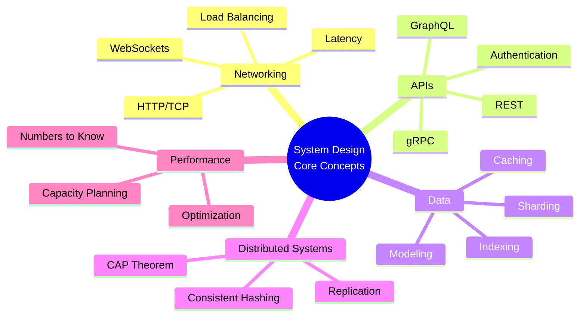
```mermaid
mindmap
  root((System Design<br/>Core Concepts))
    Networking
      HTTP/TCP
      WebSockets
      Load Balancing
      Latency
    APIs
      REST
      GraphQL
      gRPC
      Authentication
    Data
      Modeling
      Indexing
      Caching
      Sharding
    Distributed Systems
      Consistent Hashing
      CAP Theorem
      Replication
    Performance
      Numbers to Know
      Capacity Planning
      Optimization
```

---

## 🧒 Layman's Explanation

System design is the art of **planning the city before you build it**. Anyone can throw up a single house using whatever materials are at hand and call it done. But when you need to house millions of people, the rules change completely. You need roads (networks) so people can move around, water and sewage systems (databases) to keep the place running, neighborhoods (sharding) so the load is spread out, zoning laws (load balancing) so traffic doesn't pile up in one spot, and emergency services (failover) for when things inevitably break. System design is figuring out all of this on paper before the first brick is laid.

Or think of it like **scaling a restaurant**. When you're cooking for 5 friends, you do everything yourself: shop, prep, cook, serve, wash dishes. It's fine. But to serve 5,000 customers a night, you need a kitchen brigade with dedicated stations (services), a host stand managing the door (load balancer), a reservation system so you remember who's coming (cache), and walk-in fridges with bulk storage (storage tiers). The food on the plate might be the same, but the entire operation behind it is unrecognizable.

Same with an **airport vs a single-runway field**. Both let planes land. But one handles two Cessnas a week and the other juggles 1,500 jumbo jets a day with air traffic control, terminals, baggage systems, and customs. Same goal, wildly different infrastructure. Traffic dictates architecture.

Each core concept is one tool in the city planner's belt:

- **Caching** = keep popular items at hand (like a chef keeping salt and pepper on the counter)
- **Sharding** = split the workload across teams (one chef does appetizers, another does desserts)
- **Indexing** = the index at the back of a textbook (skip flipping through every page)
- **Networking** = the postal system (how messages travel between buildings)
- **Locking** = the restroom occupied sign (one person inside at a time, please)
- **Data modelling** = how you label your filing cabinet drawers (so future-you can actually find things)

### When the analogy breaks down

Real systems aren't restaurants or cities; they have to handle **all** of these concerns simultaneously, in real time, while users are actively using them. Every decision is a constant trade-off between **consistency** (is the data correct?), **latency** (is it fast?), and **cost** (can we afford it?). You almost never get all three. The job of a system designer is choosing which trade-offs to make, knowing why, and explaining them clearly.

---

## Networking Essentials

> 📖 **Detailed content moved to:** [Networking.md](./Networking.md)

Networking is one of those topics where you can go incredibly deep, but for system design interviews you need to know the **practical bits** that come up when you're designing distributed systems.

### Quick Overview

**Key Topics Covered:**
- Communication Protocols (HTTP/TCP, WebSockets, SSE, gRPC)
- Real-time Communication patterns
- Load Balancing (Layer 4 vs Layer 7)
- Geography and Latency considerations
- Network layers and protocols

**Most Important Concepts:**
- Default to HTTP/TCP for 90% of use cases
- WebSockets for bidirectional real-time (chat, gaming)
- SSE for one-way server push (notifications, live scores)
- Layer 7 load balancers for HTTP, Layer 4 for WebSockets
- Geography matters: NY→London = 80ms minimum latency

**When to Dive Deeper:**
- Designing real-time systems (chat, collaboration)
- Handling global user bases with low latency requirements
- Choosing between different communication protocols
- Understanding load balancer selection
- Optimizing for network performance

👉 **[Read the full Networking Essentials guide](./Networking.md)** for detailed explanations, diagrams, and examples.

---

## API Design

In almost every system design interview, you'll need to sketch out the APIs that clients use to interact with your system. The good news is that most interviewers don't care about perfect API design. They want to see that you can **create reasonable endpoints and move on** to the harder architectural problems.

### API Styles Comparison

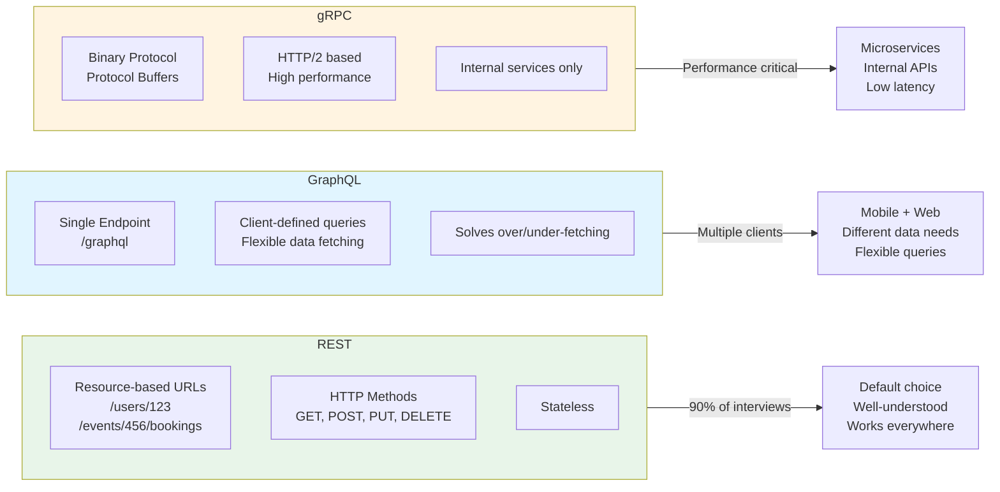
```mermaid
graph LR
    subgraph "REST"
        R1[Resource-based URLs<br/>/users/123<br/>/events/456/bookings]
        R2[HTTP Methods<br/>GET, POST, PUT, DELETE]
        R3[Stateless]
    end
    
    subgraph "GraphQL"
        G1[Single Endpoint<br/>/graphql]
        G2[Client-defined queries<br/>Flexible data fetching]
        G3[Solves over/under-fetching]
    end
    
    subgraph "gRPC"
        GP1[Binary Protocol<br/>Protocol Buffers]
        GP2[HTTP/2 based<br/>High performance]
        GP3[Internal services only]
    end
    
    REST -->|90% of interviews| USE1[Default choice<br/>Well-understood<br/>Works everywhere]
    GraphQL -->|Multiple clients| USE2[Mobile + Web<br/>Different data needs<br/>Flexible queries]
    gRPC -->|Performance critical| USE3[Microservices<br/>Internal APIs<br/>Low latency]
    
    style REST fill:#e8f5e9
    style GraphQL fill:#e1f5ff
    style gRPC fill:#fff4e1
```

### When to Use Each

**REST (Default)**
- 90% of system design interviews
- Well-understood, works everywhere
- Maps resources to URLs with HTTP methods

**GraphQL**
- Multiple client types with different data needs (mobile app vs web dashboard)
- Interviewer mentions over-fetching and under-fetching
- Clients need to request exactly the fields they need

**gRPC**
- Internal service-to-service communication
- Performance is critical
- Not for public-facing APIs (limited browser support)

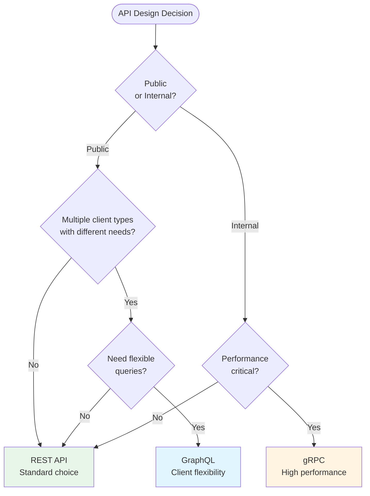
```mermaid
graph TB
    Start([API Design Decision])
    
    Start --> Q1{Public<br/>or Internal?}
    
    Q1 -->|Public| Q2{Multiple client types<br/>with different needs?}
    Q1 -->|Internal| Q3{Performance<br/>critical?}
    
    Q2 -->|No| REST[REST API<br/>Standard choice]
    Q2 -->|Yes| Q4{Need flexible<br/>queries?}
    
    Q4 -->|Yes| GraphQL[GraphQL<br/>Client flexibility]
    Q4 -->|No| REST
    
    Q3 -->|Yes| gRPC[gRPC<br/>High performance]
    Q3 -->|No| REST
    
    style REST fill:#e8f5e9
    style GraphQL fill:#e1f5ff
    style gRPC fill:#fff4e1
```

### Important API Concepts

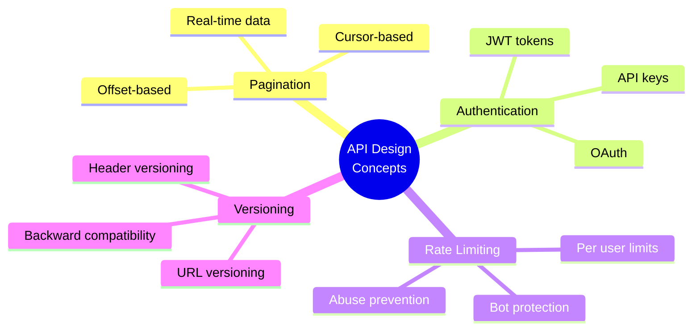
```mermaid
mindmap
  root((API Design<br/>Concepts))
    Pagination
      Offset-based
      Cursor-based
      Real-time data
    Authentication
      JWT tokens
      API keys
      OAuth
    Rate Limiting
      Per user limits
      Bot protection
      Abuse prevention
    Versioning
      URL versioning
      Header versioning
      Backward compatibility
```

> ⚠️ **Common Mistake**: Spending too much time designing APIs in interviews. You should be able to sketch out 4-5 key endpoints in a couple minutes and move on.

---

## Data Modeling

Data modeling is one of those things that sounds simple but has **massive downstream effects** on your system. The decisions you make about what data to store and how to structure it directly affect performance, scalability, and how painful it is to build and maintain your system.

### Relational vs NoSQL

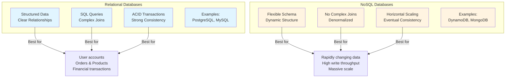
```mermaid
graph TB
    subgraph "Relational Databases"
        R1[Structured Data<br/>Clear Relationships]
        R2[SQL Queries<br/>Complex Joins]
        R3[ACID Transactions<br/>Strong Consistency]
        R4[Examples:<br/>PostgreSQL, MySQL]
    end
    
    subgraph "NoSQL Databases"
        N1[Flexible Schema<br/>Dynamic Structure]
        N2[No Complex Joins<br/>Denormalized]
        N3[Horizontal Scaling<br/>Eventual Consistency]
        N4[Examples:<br/>DynamoDB, MongoDB]
    end
    
    R1 & R2 & R3 -->|Best for| UC1[User accounts<br/>Orders & Products<br/>Financial transactions]
    N1 & N2 & N3 -->|Best for| UC2[Rapidly changing data<br/>High write throughput<br/>Massive scale]
    
    style R1 fill:#e1f5ff
    style R2 fill:#e1f5ff
    style R3 fill:#e1f5ff
    style R4 fill:#e1f5ff
    style N1 fill:#fff4e1
    style N2 fill:#fff4e1
    style N3 fill:#fff4e1
    style N4 fill:#fff4e1
```

### Normalization vs Denormalization

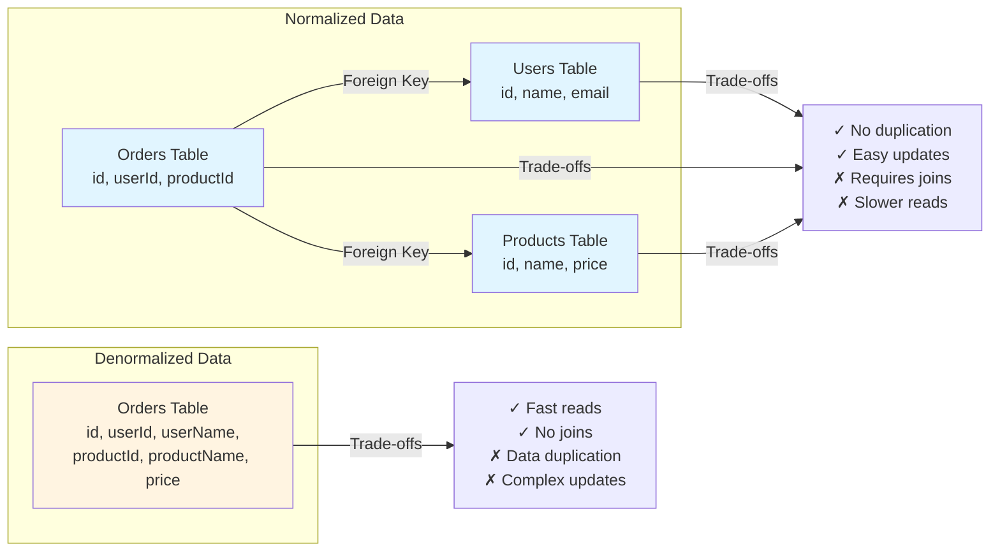
```mermaid
graph LR
    subgraph "Normalized Data"
        UT[Users Table<br/>id, name, email]
        OT[Orders Table<br/>id, userId, productId]
        PT[Products Table<br/>id, name, price]
        
        OT -->|Foreign Key| UT
        OT -->|Foreign Key| PT
    end
    
    subgraph "Denormalized Data"
        OTD[Orders Table<br/>id, userId, userName,<br/>productId, productName, price]
    end
    
    UT & OT & PT -->|Trade-offs| T1[✓ No duplication<br/>✓ Easy updates<br/>✗ Requires joins<br/>✗ Slower reads]
    
    OTD -->|Trade-offs| T2[✓ Fast reads<br/>✓ No joins<br/>✗ Data duplication<br/>✗ Complex updates]
    
    style UT fill:#e1f5ff
    style OT fill:#e1f5ff
    style PT fill:#e1f5ff
    style OTD fill:#fff4e1
```

**Key Trade-offs:**

**Normalization**
- ✅ No data duplication
- ✅ Single source of truth
- ✅ Easy to update
- ❌ Requires joins
- ❌ Slower reads

**Denormalization**
- ✅ Fast reads
- ✅ No joins needed
- ❌ Data duplication
- ❌ Complex updates
- ❌ Potential inconsistency

> 💡 **Interview Strategy**: Start with a normalized relational model and then denormalize specific hot paths if you identify read performance issues. Don't propose denormalization upfront unless you have a clear reason.

### NoSQL Access Patterns

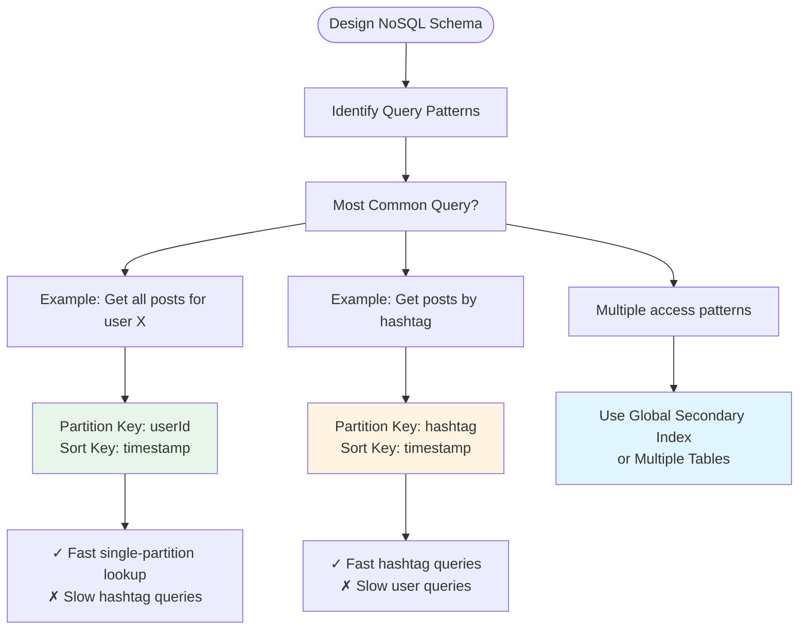
```mermaid
graph TB
    Start([Design NoSQL Schema])
    
    Start --> Q1[Identify Query Patterns]
    Q1 --> Q2[Most Common Query?]
    
    Q2 --> E1["Example: Get all posts for user X"]
    E1 --> D1[Partition Key: userId<br/>Sort Key: timestamp]
    
    D1 --> R1[✓ Fast single-partition lookup<br/>✗ Slow hashtag queries]
    
    Q2 --> E2["Example: Get posts by hashtag"]
    E2 --> D2[Partition Key: hashtag<br/>Sort Key: timestamp]
    
    D2 --> R2[✓ Fast hashtag queries<br/>✗ Slow user queries]
    
    Q2 --> E3[Multiple access patterns]
    E3 --> D3[Use Global Secondary Index<br/>or Multiple Tables]
    
    style D1 fill:#e8f5e9
    style D2 fill:#fff4e1
    style D3 fill:#e1f5ff
```

> ⚠️ **Important**: With NoSQL databases like DynamoDB, you must know your queries upfront and design around them. You can't easily add new query patterns later.

---

## Database Indexing

Indexes are used to **make database queries fast**. Without an index, finding a user by email means scanning every single row in your users table. If you have 10 million users, that's 10 million rows to check. With an index on the email column, the database can jump straight to the right row in milliseconds.

### Index Types

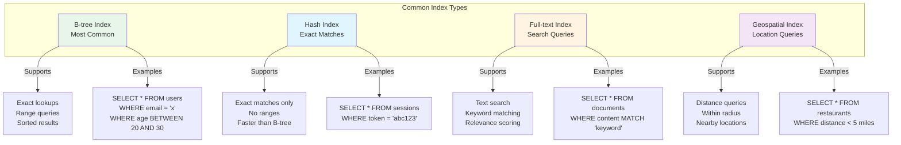
```mermaid
graph TB
    subgraph "Common Index Types"
        BT[B-tree Index<br/>Most Common]
        HI[Hash Index<br/>Exact Matches]
        FT[Full-text Index<br/>Search Queries]
        GS[Geospatial Index<br/>Location Queries]
    end
    
    BT -->|Supports| B1[Exact lookups<br/>Range queries<br/>Sorted results]
    HI -->|Supports| H1[Exact matches only<br/>No ranges<br/>Faster than B-tree]
    FT -->|Supports| F1[Text search<br/>Keyword matching<br/>Relevance scoring]
    GS -->|Supports| G1[Distance queries<br/>Within radius<br/>Nearby locations]
    
    BT -->|Examples| BE["SELECT * FROM users<br/>WHERE email = 'x'<br/>WHERE age BETWEEN 20 AND 30"]
    HI -->|Examples| HE["SELECT * FROM sessions<br/>WHERE token = 'abc123'"]
    FT -->|Examples| FE["SELECT * FROM documents<br/>WHERE content MATCH 'keyword'"]
    GS -->|Examples| GE["SELECT * FROM restaurants<br/>WHERE distance < 5 miles"]
    
    style BT fill:#e8f5e9
    style HI fill:#e1f5ff
    style FT fill:#fff4e1
    style GS fill:#f3e5f5
```

### When to Add Indexes

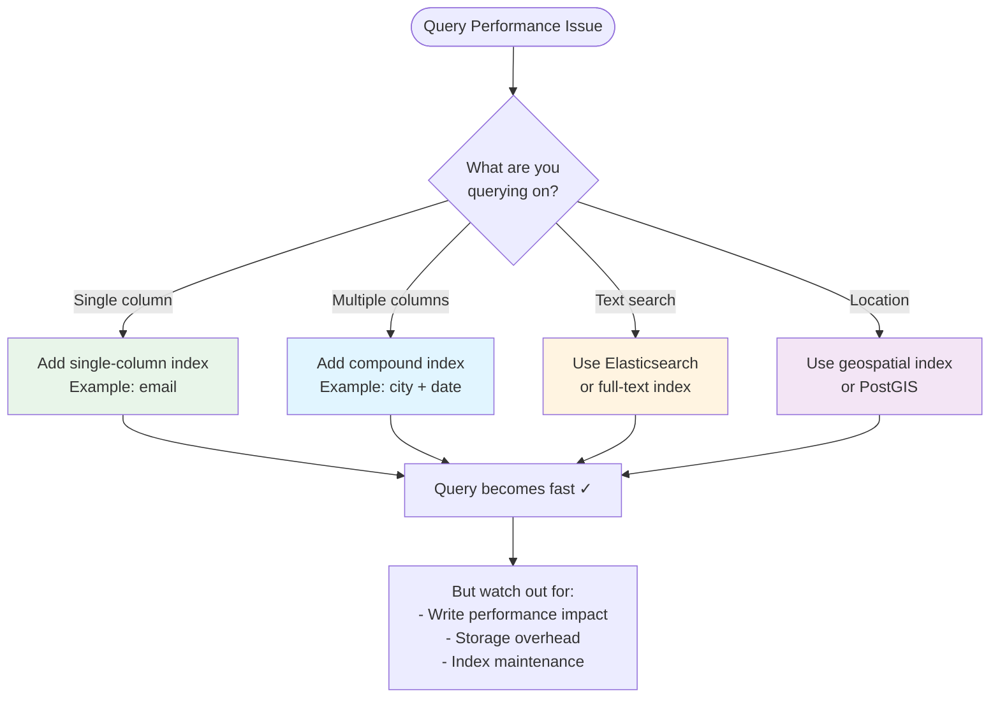
```mermaid
flowchart TD
    Start([Query Performance Issue])
    
    Start --> Q1{What are you<br/>querying on?}
    
    Q1 -->|Single column| A1[Add single-column index<br/>Example: email]
    Q1 -->|Multiple columns| A2[Add compound index<br/>Example: city + date]
    Q1 -->|Text search| A3[Use Elasticsearch<br/>or full-text index]
    Q1 -->|Location| A4[Use geospatial index<br/>or PostGIS]
    
    A1 --> R[Query becomes fast ✓]
    A2 --> R
    A3 --> R
    A4 --> R
    
    R --> Note[But watch out for:<br/>- Write performance impact<br/>- Storage overhead<br/>- Index maintenance]
    
    style A1 fill:#e8f5e9
    style A2 fill:#e1f5ff
    style A3 fill:#fff4e1
    style A4 fill:#f3e5f5
```

### Index Trade-offs

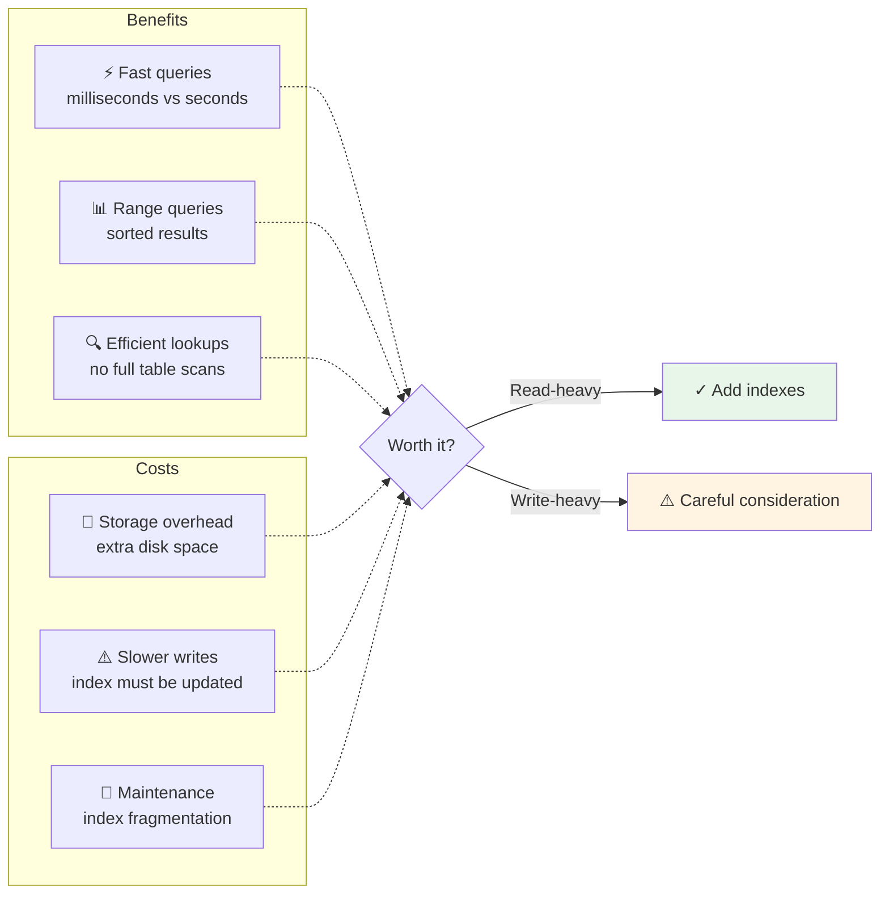
```mermaid
graph LR
    subgraph "Benefits"
        B1[⚡ Fast queries<br/>milliseconds vs seconds]
        B2[📊 Range queries<br/>sorted results]
        B3[🔍 Efficient lookups<br/>no full table scans]
    end
    
    subgraph "Costs"
        C1[💾 Storage overhead<br/>extra disk space]
        C2[⚠️ Slower writes<br/>index must be updated]
        C3[🔧 Maintenance<br/>index fragmentation]
    end
    
    B1 & B2 & B3 -.-> Decision{Worth it?}
    C1 & C2 & C3 -.-> Decision
    
    Decision -->|Read-heavy| YES[✓ Add indexes]
    Decision -->|Write-heavy| MAYBE[⚠️ Careful consideration]
    
    style YES fill:#e8f5e9
    style MAYBE fill:#fff4e1
```

> 💡 **Interview Tip**: Think about your query patterns and propose indexes on the fields you're querying frequently. If you're looking up users by email for authentication, index the email column. If you're fetching a user's orders, index the user_id column on the orders table.

---

## Caching

Caching comes up in almost every system design interview, usually when you identify that your database is getting hammered with reads. The idea is simple: **Store frequently accessed data in fast memory** (like Redis) so you can skip the database entirely for most reads.

### Performance Impact

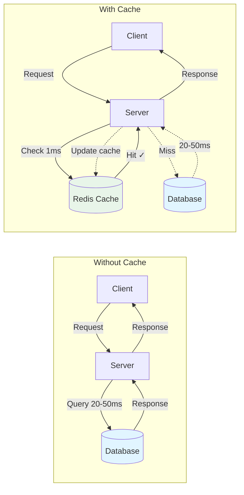
```mermaid
graph LR
    subgraph "Without Cache"
        C1[Client] -->|Request| S1[Server]
        S1 -->|Query 20-50ms| DB1[(Database)]
        DB1 -->|Response| S1
        S1 -->|Response| C1
    end
    
    subgraph "With Cache"
        C2[Client] -->|Request| S2[Server]
        S2 -->|Check 1ms| Cache[(Redis Cache)]
        Cache -->|Hit ✓| S2
        S2 -->|Response| C2
        
        S2 -.->|Miss| DB2[(Database)]
        DB2 -.->|20-50ms| S2
        S2 -.->|Update cache| Cache
    end
    
    style Cache fill:#e8f5e9
    style DB1 fill:#e1f5ff
    style DB2 fill:#e1f5ff
```

**Performance Difference:**
- Cache hit on Redis: **~1ms**
- Database query: **~20-50ms**
- **20-50x speedup** with caching!

### Cache-Aside Pattern

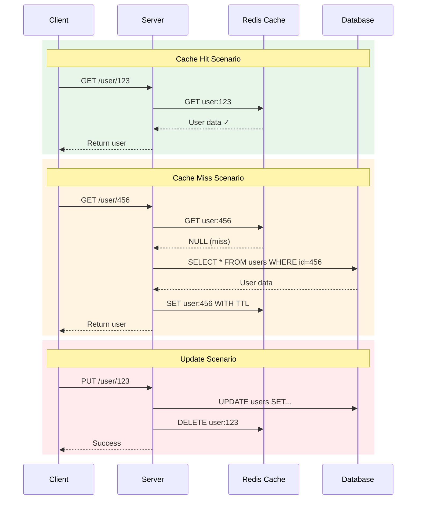
```mermaid
sequenceDiagram
    participant C as Client
    participant S as Server
    participant Cache as Redis Cache
    participant DB as Database
    
    rect rgb(232, 245, 233)
    Note over C,DB: Cache Hit Scenario
    C->>S: GET /user/123
    S->>Cache: GET user:123
    Cache-->>S: User data ✓
    S-->>C: Return user
    end
    
    rect rgb(255, 244, 225)
    Note over C,DB: Cache Miss Scenario
    C->>S: GET /user/456
    S->>Cache: GET user:456
    Cache-->>S: NULL (miss)
    S->>DB: SELECT * FROM users WHERE id=456
    DB-->>S: User data
    S->>Cache: SET user:456 WITH TTL
    S-->>C: Return user
    end
    
    rect rgb(255, 235, 238)
    Note over C,DB: Update Scenario
    C->>S: PUT /user/123
    S->>DB: UPDATE users SET...
    S->>Cache: DELETE user:123
    S-->>C: Success
    end
```

### Caching Challenges

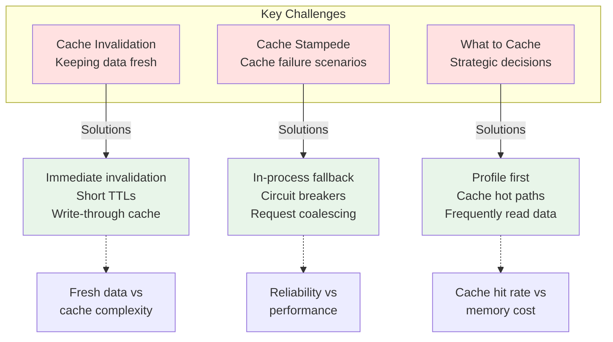
```mermaid
graph TB
    subgraph "Key Challenges"
        I[Cache Invalidation<br/>Keeping data fresh]
        S[Cache Stampede<br/>Cache failure scenarios]
        W[What to Cache<br/>Strategic decisions]
    end
    
    I -->|Solutions| I1[Immediate invalidation<br/>Short TTLs<br/>Write-through cache]
    S -->|Solutions| S1[In-process fallback<br/>Circuit breakers<br/>Request coalescing]
    W -->|Solutions| W1[Profile first<br/>Cache hot paths<br/>Frequently read data]
    
    I1 -.-> Trade1[Fresh data vs<br/>cache complexity]
    S1 -.-> Trade2[Reliability vs<br/>performance]
    W1 -.-> Trade3[Cache hit rate vs<br/>memory cost]
    
    style I fill:#ffe1e1
    style S fill:#ffe1e1
    style W fill:#ffe1e1
    style I1 fill:#e8f5e9
    style S1 fill:#e8f5e9
    style W1 fill:#e8f5e9
```

### Cache Types

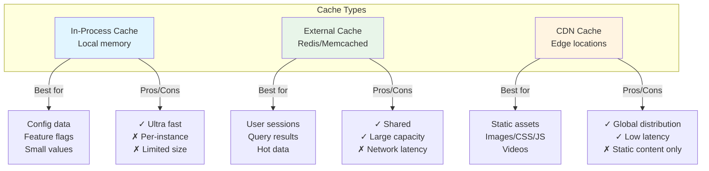
```mermaid
graph TB
    subgraph "Cache Types"
        APP[In-Process Cache<br/>Local memory]
        EXT[External Cache<br/>Redis/Memcached]
        CDN[CDN Cache<br/>Edge locations]
    end
    
    APP -->|Best for| A1[Config data<br/>Feature flags<br/>Small values]
    EXT -->|Best for| E1[User sessions<br/>Query results<br/>Hot data]
    CDN -->|Best for| C1[Static assets<br/>Images/CSS/JS<br/>Videos]
    
    APP -->|Pros/Cons| A2[✓ Ultra fast<br/>✗ Per-instance<br/>✗ Limited size]
    EXT -->|Pros/Cons| E2[✓ Shared<br/>✓ Large capacity<br/>✗ Network latency]
    CDN -->|Pros/Cons| C2[✓ Global distribution<br/>✓ Low latency<br/>✗ Static content only]
    
    style APP fill:#e1f5ff
    style EXT fill:#e8f5e9
    style CDN fill:#fff4e1
```

> ⚠️ **Common Mistake**: Caching everything. Cache only data that's read frequently and doesn't change often. If you're caching data that changes on every request, you're just adding latency and complexity for no benefit.

---

## Sharding

Sharding comes up when you've **outgrown a single database** and need to split your data across multiple independent servers. This happens when you hit storage limits, write throughput limits, or read throughput that even replicas can't handle.

### When to Shard

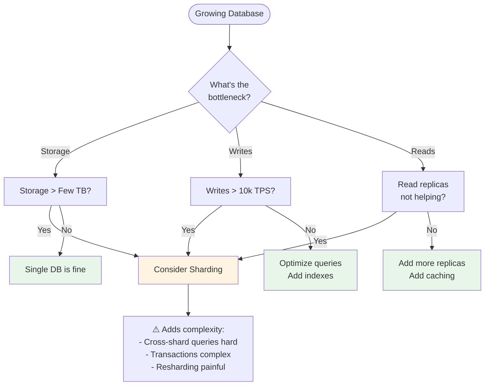
```mermaid
graph TB
    Start([Growing Database])
    
    Start --> Q1{What's the<br/>bottleneck?}
    
    Q1 -->|Storage| S1[Storage > Few TB?]
    Q1 -->|Writes| W1[Writes > 10k TPS?]
    Q1 -->|Reads| R1[Read replicas<br/>not helping?]
    
    S1 -->|Yes| SHARD[Consider Sharding]
    W1 -->|Yes| SHARD
    R1 -->|Yes| SHARD
    
    S1 -->|No| OPT1[Single DB is fine]
    W1 -->|No| OPT2[Optimize queries<br/>Add indexes]
    R1 -->|No| OPT3[Add more replicas<br/>Add caching]
    
    SHARD --> WARNING[⚠️ Adds complexity:<br/>- Cross-shard queries hard<br/>- Transactions complex<br/>- Resharding painful]
    
    style SHARD fill:#fff4e1
    style OPT1 fill:#e8f5e9
    style OPT2 fill:#e8f5e9
    style OPT3 fill:#e8f5e9
```

> ⚠️ **Biggest Mistake**: Sharding too early. A well-tuned single database with read replicas can handle way more than most candidates think.

### Sharding Strategies

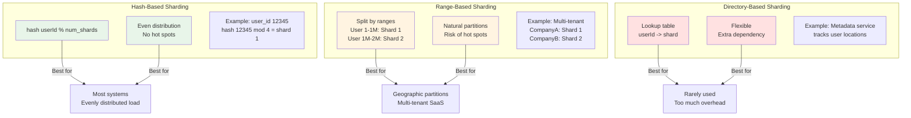
```mermaid
graph TB
    subgraph "Hash-Based Sharding"
        H1[hash userId % num_shards]
        H2[Even distribution<br/>No hot spots]
        H3[Example: user_id 12345<br/>hash 12345 mod 4 = shard 1]
    end
    
    subgraph "Range-Based Sharding"
        R1[Split by ranges<br/>User 1-1M: Shard 1<br/>User 1M-2M: Shard 2]
        R2[Natural partitions<br/>Risk of hot spots]
        R3[Example: Multi-tenant<br/>CompanyA: Shard 1<br/>CompanyB: Shard 2]
    end
    
    subgraph "Directory-Based Sharding"
        D1[Lookup table<br/>userId -> shard]
        D2[Flexible<br/>Extra dependency]
        D3[Example: Metadata service<br/>tracks user locations]
    end
    
    H1 & H2 -->|Best for| HU[Most systems<br/>Evenly distributed load]
    R1 & R2 -->|Best for| RU[Geographic partitions<br/>Multi-tenant SaaS]
    D1 & D2 -->|Best for| DU[Rarely used<br/>Too much overhead]
    
    style H1 fill:#e8f5e9
    style H2 fill:#e8f5e9
    style R1 fill:#fff4e1
    style R2 fill:#fff4e1
    style D1 fill:#ffe1e1
    style D2 fill:#ffe1e1
```

### Shard Key Selection

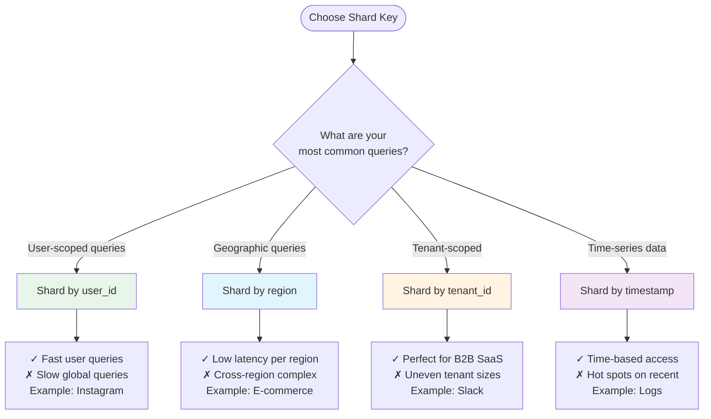
```mermaid
flowchart TD
    Start([Choose Shard Key])
    
    Start --> Q1{What are your<br/>most common queries?}
    
    Q1 -->|User-scoped queries| UK[Shard by user_id]
    Q1 -->|Geographic queries| GK[Shard by region]
    Q1 -->|Tenant-scoped| TK[Shard by tenant_id]
    Q1 -->|Time-series data| TIK[Shard by timestamp]
    
    UK --> UKR[✓ Fast user queries<br/>✗ Slow global queries<br/>Example: Instagram]
    GK --> GKR[✓ Low latency per region<br/>✗ Cross-region complex<br/>Example: E-commerce]
    TK --> TKR[✓ Perfect for B2B SaaS<br/>✗ Uneven tenant sizes<br/>Example: Slack]
    TIK --> TIKR[✓ Time-based access<br/>✗ Hot spots on recent<br/>Example: Logs]
    
    style UK fill:#e8f5e9
    style GK fill:#e1f5ff
    style TK fill:#fff4e1
    style TIK fill:#f3e5f5
```

### Sharding Challenges

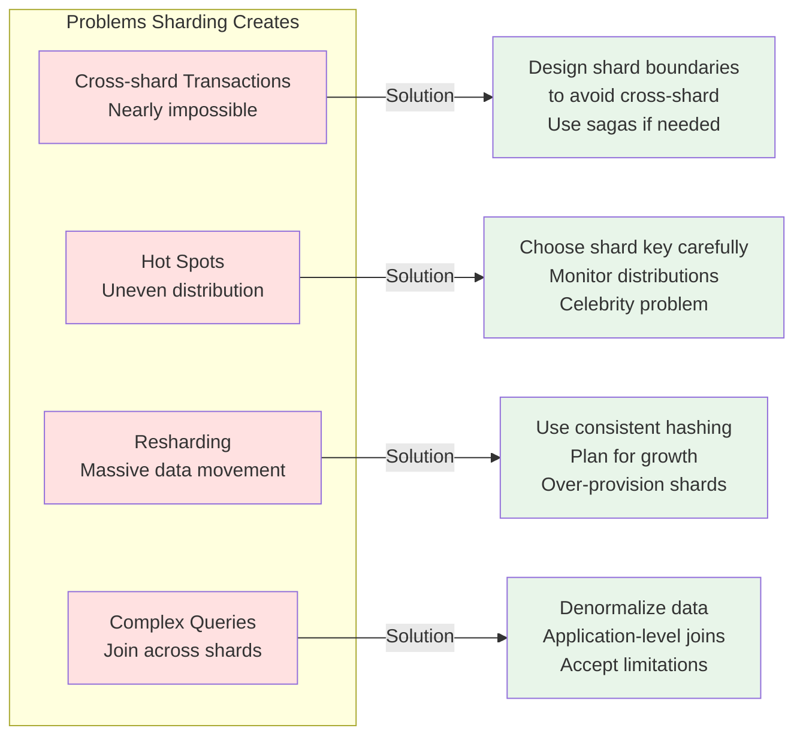
```mermaid
graph LR
    subgraph "Problems Sharding Creates"
        P1[Cross-shard Transactions<br/>Nearly impossible]
        P2[Hot Spots<br/>Uneven distribution]
        P3[Resharding<br/>Massive data movement]
        P4[Complex Queries<br/>Join across shards]
    end
    
    P1 -->|Solution| S1[Design shard boundaries<br/>to avoid cross-shard<br/>Use sagas if needed]
    P2 -->|Solution| S2[Choose shard key carefully<br/>Monitor distributions<br/>Celebrity problem]
    P3 -->|Solution| S3[Use consistent hashing<br/>Plan for growth<br/>Over-provision shards]
    P4 -->|Solution| S4[Denormalize data<br/>Application-level joins<br/>Accept limitations]
    
    style P1 fill:#ffe1e1
    style P2 fill:#ffe1e1
    style P3 fill:#ffe1e1
    style P4 fill:#ffe1e1
    style S1 fill:#e8f5e9
    style S2 fill:#e8f5e9
    style S3 fill:#e8f5e9
    style S4 fill:#e8f5e9
```

> 💡 **Interview Tip**: Bring up sharding after you've justified why a single database won't work. Then clearly state your shard key choice and explain the tradeoff (fast for X queries, slow for Y queries).

---

## Consistent Hashing

Consistent hashing solves a specific problem that comes up with **distributed caches and sharded databases**. When you use simple hash-based distribution (`hash(key) % N` to pick which server stores the data), adding or removing a server changes N. That means almost every key maps to a different server, so you'd have to move most of your data around.

### The Problem with Simple Hashing

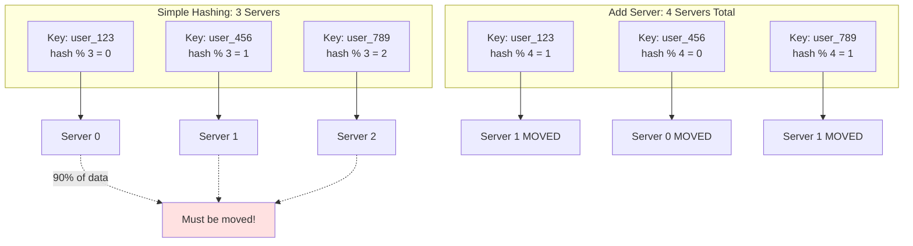
```mermaid
graph TB
    subgraph "Simple Hashing: 3 Servers"
        K1[Key: user_123<br/>hash % 3 = 0]
        K2[Key: user_456<br/>hash % 3 = 1]
        K3[Key: user_789<br/>hash % 3 = 2]
    end
    
    K1 --> S1[Server 0]
    K2 --> S2[Server 1]
    K3 --> S3[Server 2]
    
    subgraph "Add Server: 4 Servers Total"
        K1B[Key: user_123<br/>hash % 4 = 1]
        K2B[Key: user_456<br/>hash % 4 = 0]
        K3B[Key: user_789<br/>hash % 4 = 1]
    end
    
    K1B --> S2B[Server 1 MOVED]
    K2B --> S1B[Server 0 MOVED]
    K3B --> S2C[Server 1 MOVED]
    
    S1 -.->|90% of data| PROBLEM[Must be moved!]
    S2 -.-> PROBLEM
    S3 -.-> PROBLEM
    
    style PROBLEM fill:#ffe1e1
```

### Consistent Hashing Solution

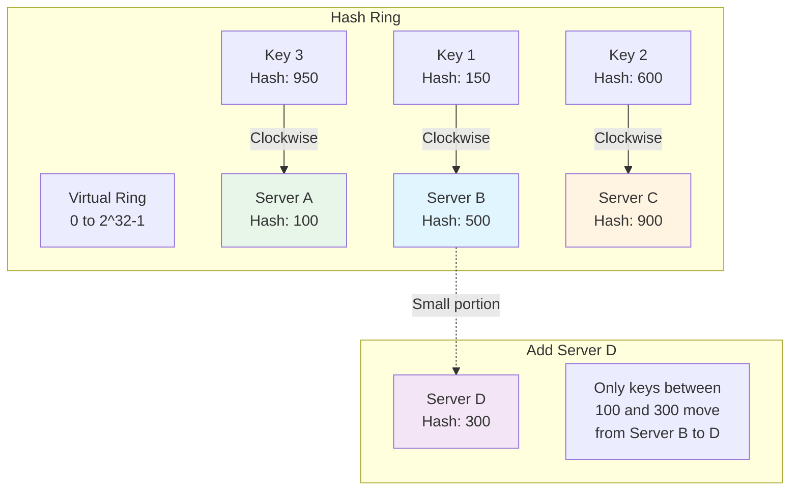
```mermaid
graph TB
    subgraph "Hash Ring"
        direction TB
        R[Virtual Ring<br/>0 to 2^32-1]
        
        S1[Server A<br/>Hash: 100]
        S2[Server B<br/>Hash: 500]
        S3[Server C<br/>Hash: 900]
        
        K1[Key 1<br/>Hash: 150]
        K2[Key 2<br/>Hash: 600]
        K3[Key 3<br/>Hash: 950]
    end
    
    K1 -->|Clockwise| S2
    K2 -->|Clockwise| S3
    K3 -->|Clockwise| S1
    
    subgraph "Add Server D"
        S4[Server D<br/>Hash: 300]
        NOTE[Only keys between<br/>100 and 300 move<br/>from Server B to D]
    end
    
    S2 -.->|Small portion| S4
    
    style S1 fill:#e8f5e9
    style S2 fill:#e1f5ff
    style S3 fill:#fff4e1
    style S4 fill:#f3e5f5
```

### Virtual Nodes

```mermaid
graph LR
    subgraph "Without Virtual Nodes"
        S1[Server A: 1 position]
        S2[Server B: 1 position]
        S3[Server C: 1 position]
    end
    
    S1 & S2 & S3 -->|Problem| P1[Uneven distribution<br/>One server might get<br/>much more data]
    
    subgraph "With Virtual Nodes"
        V1[Server A: 100 positions]
        V2[Server B: 100 positions]
        V3[Server C: 100 positions]
    end
    
    V1 & V2 & V3 -->|Solution| P2[Even distribution<br/>Keys spread uniformly<br/>Better load balancing]
    
    style P1 fill:#ffe1e1
    style P2 fill:#e8f5e9
```

### Impact Comparison

```mermaid
graph TB
    subgraph "Data Movement Impact"
        SM[Simple Modulo Hashing]
        CH[Consistent Hashing]
    end
    
    SM -->|Add 1 server to 10| SM1[~90% of data moves]
    CH -->|Add 1 server to 10| CH1[~10% of data moves]
    
    SM -->|Remove 1 server| SM2[~90% of data moves]
    CH -->|Remove 1 server| CH2[~10% of data moves]
    
    style SM fill:#ffe1e1
    style SM1 fill:#ffe1e1
    style SM2 fill:#ffe1e1
    style CH fill:#e8f5e9
    style CH1 fill:#e8f5e9
    style CH2 fill:#e8f5e9
```

### Where It's Used

```mermaid
mindmap
  root((Consistent<br/>Hashing<br/>Usage))
    Distributed Caches
      Memcached
      Redis Cluster
      Dynamo-style systems
    Load Balancing
      Sticky sessions
      Request routing
      CDN routing
    Databases
      Cassandra
      DynamoDB
      Riak
    Message Queues
      Kafka partitions
      RabbitMQ routing
```

> 💡 **Interview Tip**: You rarely need to explain how consistent hashing works unless specifically asked. It's enough to say "we'll use consistent hashing to distribute data across cache nodes" when you're talking about a distributed cache or "we'll use consistent hashing for the shard key" when discussing database sharding.

---

## CAP Theorem

The CAP theorem comes up when you're designing distributed systems and need to make **tradeoffs about how your data behaves during failures**. It states you can only have two of three properties at once:

- **C**onsistency: All nodes see the same data
- **A**vailability: Every request gets a response  
- **P**artition tolerance: System works even when network connections fail between nodes

Since network partitions are unavoidable in distributed systems, you're really **choosing between consistency and availability**.

### CAP Theorem Visualization

```mermaid
graph TB
    subgraph "CAP Theorem Triangle"
        C[Consistency<br/>All nodes same data]
        A[Availability<br/>Always responds]
        P[Partition Tolerance<br/>Works during network split]
    end
    
    C --- A
    A --- P
    P --- C
    
    C -->|Choose| CP[CP Systems<br/>Consistent + Partition Tolerant<br/>Sacrifice Availability]
    A -->|Choose| AP[AP Systems<br/>Available + Partition Tolerant<br/>Sacrifice Consistency]
    P -->|Must have| REALITY[Network partitions<br/>will happen in<br/>distributed systems]
    
    CP -->|Examples| CPE[MongoDB<br/>HBase<br/>Redis Sentinel]
    AP -->|Examples| APE[Cassandra<br/>DynamoDB<br/>Couchbase]
    
    style C fill:#e1f5ff
    style A fill:#e8f5e9
    style P fill:#fff4e1
    style CP fill:#e1f5ff
    style AP fill:#e8f5e9
```

### Consistency vs Availability Trade-off

```mermaid
sequenceDiagram
    participant C as Client
    participant N1 as Node 1
    participant N2 as Node 2
    
    rect rgb(255, 235, 238)
    Note over C,N2: Network Partition Occurs
    N1 -x N2: Network Split
    end
    
    rect rgb(225, 245, 255)
    Note over C,N2: CP System (Choose Consistency)
    C->>N1: Read request
    N1-->>C: ERROR - Cannot guarantee consistency
    Note over N1: Refuses to serve<br/>stale data
    end
    
    rect rgb(232, 245, 233)
    Note over C,N2: AP System (Choose Availability)
    C->>N1: Read request
    N1-->>C: Returns data (might be stale)
    Note over N1: Serves request even<br/>if data might be outdated
    end
```

### When to Choose Each

```mermaid
flowchart TD
    Start([System Design Decision])
    
    Start --> Q1{What happens if<br/>data is stale?}
    
    Q1 -->|Serious problems| Q2{What kind of problems?}
    Q1 -->|Users can tolerate it| AP[Choose AP<br/>Availability]
    
    Q2 -->|Money/financial| CP1[CP System<br/>Banking<br/>Payments]
    Q2 -->|Inventory/booking| CP2[CP System<br/>Ticket sales<br/>Stock levels]
    Q2 -->|Critical safety| CP3[CP System<br/>Healthcare<br/>Security]
    
    AP -->|Examples| APE[Social media feeds<br/>Recommendations<br/>Analytics dashboards<br/>Content feeds]
    
    style CP1 fill:#e1f5ff
    style CP2 fill:#e1f5ff
    style CP3 fill:#e1f5ff
    style AP fill:#e8f5e9
    style APE fill:#e8f5e9
```

### Mixed Consistency Models

```mermaid
graph TB
    subgraph "E-commerce System"
        PC[Product Catalog<br/>Eventually Consistent<br/>Stale descriptions OK]
        INV[Inventory Count<br/>Strongly Consistent<br/>Prevent overselling]
        ORD[Order Processing<br/>Strongly Consistent<br/>Critical transactions]
        REV[Reviews<br/>Eventually Consistent<br/>Delay acceptable]
    end
    
    PC -->|Strategy| PCS[AP: DynamoDB<br/>High availability<br/>Fast reads]
    INV -->|Strategy| INVS[CP: Postgres<br/>ACID transactions<br/>Accurate counts]
    ORD -->|Strategy| ORDS[CP: Postgres<br/>Strong consistency<br/>No data loss]
    REV -->|Strategy| REVS[AP: Cassandra<br/>High availability<br/>Eventually sync]
    
    style PCS fill:#e8f5e9
    style INVS fill:#e1f5ff
    style ORDS fill:#e1f5ff
    style REVS fill:#e8f5e9
```

> 💡 **Interview Tip**: For most systems, availability is the right default. Users can tolerate seeing slightly stale data (your Instagram feed being 2 seconds old), but they can't tolerate the app being down.

### Real-World Examples

```mermaid
graph LR
    subgraph "CP Systems - Consistency Priority"
        CP1[Banking Systems<br/>Account balances]
        CP2[Ticket Booking<br/>Seat availability]
        CP3[Inventory Management<br/>Stock counts]
    end
    
    subgraph "AP Systems - Availability Priority"
        AP1[Social Media<br/>Feeds and likes]
        AP2[Recommendation Engines<br/>Suggested content]
        AP3[Analytics Dashboards<br/>Metrics and stats]
    end
    
    CP1 & CP2 & CP3 -->|Why| REASON1[Stale data causes<br/>real business problems:<br/>fraud, double-booking,<br/>overselling]
    
    AP1 & AP2 & AP3 -->|Why| REASON2[Stale data acceptable:<br/>slight delays OK,<br/>downtime is worse]
    
    style CP1 fill:#e1f5ff
    style CP2 fill:#e1f5ff
    style CP3 fill:#e1f5ff
    style AP1 fill:#e8f5e9
    style AP2 fill:#e8f5e9
    style AP3 fill:#e8f5e9
```

---

## Numbers to Know

As discussed in the Delivery Framework, you don't need to do back-of-the-envelope calculations at the start of an interview. What matters is **doing them when you need to make a decision**. Should you shard the database? Can a single Redis instance handle the cache load? You can't answer these questions without rough numbers.

### Latency Numbers

```mermaid
graph TB
    subgraph "Latency Hierarchy"
        L1[L1 Cache: 0.5 ns]
        L2[L2 Cache: 7 ns]
        RAM[RAM: 100 ns]
        SSD[SSD Random Read: 16 μs]
        HDD[HDD Seek: 2 ms]
        NET_DC[Network within DC: 0.5 ms]
        NET_CROSS[Cross-continent: 150 ms]
    end
    
    L1 -->|16x slower| L2
    L2 -->|14x slower| RAM
    RAM -->|160x slower| SSD
    SSD -->|125x slower| HDD
    HDD -->|4x slower| NET_DC
    NET_DC -->|300x slower| NET_CROSS
    
    style L1 fill:#e8f5e9
    style RAM fill:#e1f5ff
    style SSD fill:#fff4e1
    style NET_DC fill:#f3e5f5
    style NET_CROSS fill:#ffe1e1
```

### Key Performance Numbers

```mermaid
graph LR
    subgraph "System Capacities"
        direction TB
        C[Redis Cache<br/>~1ms latency<br/>100k+ ops/sec<br/>Up to 1TB memory]
        
        D[PostgreSQL<br/>50k transactions/sec<br/>5ms read latency<br/>64TB storage]
        
        A[App Server<br/>100k connections<br/>64-512GB RAM<br/>8-64 cores]
        
        M[Kafka<br/>1M msgs/sec/broker<br/>5ms latency<br/>50TB storage]
    end
    
    C -->|When to scale| CS[Hit rate < 80%<br/>Latency > 1ms<br/>Memory > 80%]
    D -->|When to scale| DS[Writes > 10k TPS<br/>Latency > 5ms<br/>Need geo distribution]
    A -->|When to scale| AS[CPU > 70%<br/>Connections near 100k<br/>Memory > 80%]
    M -->|When to scale| MS[Throughput near 800k<br/>Consumer lag growing<br/>Partitions > 200k]
    
    style C fill:#e8f5e9
    style D fill:#e1f5ff
    style A fill:#fff4e1
    style M fill:#f3e5f5
```

### Capacity Planning Example

```mermaid
flowchart TD
    Start([System Requirements])
    
    Start --> R[50,000 requests/second]
    
    R --> Q1{What can one<br/>server handle?}
    
    Q1 --> S1[Single server:<br/>~5,000 req/sec]
    
    S1 --> CALC[50,000 ÷ 5,000<br/>= 10 servers needed]
    
    CALC --> HEAD[+ Add headroom<br/>for traffic spikes<br/>and failures]
    
    HEAD --> FINAL[Deploy 15 servers<br/>50% headroom]
    
    FINAL --> NOTE[Monitor:<br/>- CPU usage<br/>- Memory usage<br/>- Request latency<br/>- Error rates]
    
    style FINAL fill:#e8f5e9
```

### Storage Calculations

```mermaid
graph TB
    subgraph "Storage Math Example"
        U[100M users]
        P[Each user: 10 posts/year]
        S[Each post: 1KB data]
    end
    
    U --> CALC1[100M users × 10 posts<br/>= 1B posts/year]
    CALC1 --> CALC2[1B posts × 1KB<br/>= 1TB/year]
    CALC2 --> CALC3[Over 5 years<br/>= 5TB total]
    
    CALC3 --> DEC{Sharding needed?}
    
    DEC -->|No| SINGLE[Single Postgres<br/>handles few TB easily]
    DEC -->|Yes if| SHARD[- Growing to 50TB+<br/>- High write throughput<br/>- Geographic distribution]
    
    style SINGLE fill:#e8f5e9
    style SHARD fill:#fff4e1
```

### When Numbers Matter

```mermaid
mindmap
  root((Use Numbers<br/>When Deciding))
    Database Scaling
      Single DB sufficient?
      Need read replicas?
      Need sharding?
      Storage limits
    Cache Sizing
      Memory requirements
      Hit rate expectations
      Eviction policies
    Server Capacity
      How many servers?
      CPU/Memory specs
      Geographic distribution
    Network Bandwidth
      Data transfer volume
      CDN requirements
      Regional deployment
```

### Quick Reference Table

| Component | Capacity | When to Scale |
|-----------|----------|---------------|
| **Redis Cache** | ~1ms latency 100k+ ops/sec Up to 1TB memory | Hit rate < 80% Latency > 1ms Memory > 80% |
| **PostgreSQL** | 50k transactions/sec 5ms read latency 64TB storage | Writes > 10k TPS Latency > 5ms Geographic needs |
| **App Servers** | 100k connections 64-512GB RAM 8-64 cores | CPU > 70% Connections near limit Memory > 80% |
| **Kafka** | 1M msgs/sec/broker 5ms latency 50TB storage | Throughput near 800k Growing consumer lag Partitions > 200k |

### Production-Accurate Latency Numbers

These are real-world ranges, not theoretical minimums:

| Operation | Best Case | Typical Production | Notes |
|-----------|-----------|-------------------|-------|
| In-process cache (L1) | 0.01ms | 0.01ms | HashMap lookup |
| Redis GET (same AZ) | 0.3ms | 1-2ms | +network overhead |
| Redis GET (cross-region) | 50ms | 80-150ms | Speed of light |
| PostgreSQL indexed read | 1ms | 5-15ms | Buffer pool hit |
| PostgreSQL cold read | 5ms | 20-50ms | Disk access |
| PostgreSQL full table scan | 50ms | 100ms-10s | Depends on table size |
| Elasticsearch query | 5ms | 10-100ms | Depends on cluster size |
| S3 GET | 10ms | 30-100ms | Object size matters |
| CDN edge hit | 1ms | 5-20ms | Geographic proximity |
| Cross-AZ network call | 0.5ms | 1-3ms | Same region, diff AZ |
| Cross-region network call | 70ms | 80-200ms | Speed of light + routing |

### Real Traffic Numbers for Context

Use these when sizing your system design:

| Service | Scale | Key Numbers |
|---------|-------|-------------|
| **Instagram** | 2B users | 100M photos/day, 500M stories/day |
| **Twitter/X** | 400M users | 500M tweets/day, 300K QPS reads |
| **Netflix** | 300M users | 15% of global internet bandwidth |
| **Uber** | 130M users | 25M trips/day, 14M geo updates/sec at peak |
| **WhatsApp** | 2B users | 100B messages/day, 2M connections/server |
| **YouTube** | 2.5B users | 500 hours of video uploaded/minute |
| **Shopify** | 2M merchants | 10K checkouts/min at Black Friday peak |

> 💡 **Interview Tip**: Do your capacity calculations in context when you need them. If your interviewer asks "how many servers do we need," that's when you pull out the numbers. Walk through it: "We're expecting 50K requests per second, each server can handle maybe 5K requests, so we need around 10 servers plus some headroom."

---

## Summary

```mermaid
graph TB
    subgraph "Core Concepts Foundation"
        NET[Networking<br/>HTTP, WebSockets<br/>Load Balancers]
        API[API Design<br/>REST, GraphQL<br/>gRPC]
        DATA[Data Modeling<br/>SQL vs NoSQL<br/>Normalization]
        IDX[Indexing<br/>B-tree, Hash<br/>Full-text]
    end
    
    subgraph "Scaling Patterns"
        CACHE[Caching<br/>Redis<br/>CDN]
        SHARD[Sharding<br/>Partition Keys<br/>Distribution]
        HASH[Consistent Hashing<br/>Ring<br/>Virtual Nodes]
    end
    
    subgraph "Distributed Systems"
        CAP[CAP Theorem<br/>Consistency<br/>Availability]
        NUM[Numbers<br/>Capacity Planning<br/>Performance]
    end
    
    NET & API --> APP[Application Layer]
    DATA & IDX --> STORAGE[Storage Layer]
    CACHE & SHARD & HASH --> SCALE[Scale Layer]
    CAP & NUM --> DIST[Distribution Layer]
    
    APP --> SYSTEM[Complete System Design]
    STORAGE --> SYSTEM
    SCALE --> SYSTEM
    DIST --> SYSTEM
    
    style NET fill:#e8f5e9
    style API fill:#e8f5e9
    style DATA fill:#e1f5ff
    style IDX fill:#e1f5ff
    style CACHE fill:#fff4e1
    style SHARD fill:#fff4e1
    style HASH fill:#fff4e1
    style CAP fill:#f3e5f5
    style NUM fill:#f3e5f5
    style SYSTEM fill:#ffe1e1
```

### Key Takeaways

1. **Start Simple**: Default to HTTP/REST, single database, straightforward patterns
2. **Scale When Needed**: Add complexity (caching, sharding, etc.) only when justified by numbers
3. **Know the Trade-offs**: Every decision has costs - understand and articulate them
4. **Think in Layers**: Separate concerns - networking, API, data, caching, distribution
5. **Use Numbers**: Back up scaling decisions with capacity calculations
6. **Consistency Matters**: Choose the right consistency model for your use case
7. **Index Strategically**: Add indexes based on query patterns, not blindly
8. **Cache Wisely**: Only cache frequently-read, rarely-changed data

---

## Additional Resources

- [Networking Essentials Deep Dive](https://www.hellointerview.com/learn/system-design/core-concepts/networking-essentials)
- [API Design Guide](https://www.hellointerview.com/learn/system-design/core-concepts/api-design)
- [Data Modeling Patterns](https://www.hellointerview.com/learn/system-design/core-concepts/data-modeling)
- [Database Indexing Strategies](https://www.hellointerview.com/learn/system-design/core-concepts/db-indexing)
- [Caching Patterns](https://www.hellointerview.com/learn/system-design/core-concepts/caching)
- [Sharding Techniques](https://www.hellointerview.com/learn/system-design/core-concepts/sharding)
- [Consistent Hashing Explained](https://www.hellointerview.com/learn/system-design/core-concepts/consistent-hashing)
- [CAP Theorem in Practice](https://www.hellointerview.com/learn/system-design/core-concepts/cap-theorem)
- [Performance Numbers Reference](https://www.hellointerview.com/learn/system-design/core-concepts/numbers-to-know)

---

*Content summarized from: [HelloInterview - System Design Core Concepts](https://www.hellointerview.com/learn/system-design/in-a-hurry/core-concepts)*
