# 🗂️ Database Indexing

> **Core Concept**: Database indexes are separate data structures optimized for searching that allow databases to quickly locate records without examining every row. They're essential for making queries fast and efficient.

## 📋 Table of Contents
- [Overview](#overview)
- [How Database Indexes Work](#how-database-indexes-work)
- [Types of Indexes](#types-of-indexes)
- [Index Optimization Patterns](#index-optimization-patterns)
- [Best Practices](#best-practices)

---

## 🎯 Overview

### The Problem

Imagine searching for a user's profile by email in a table with millions of records:

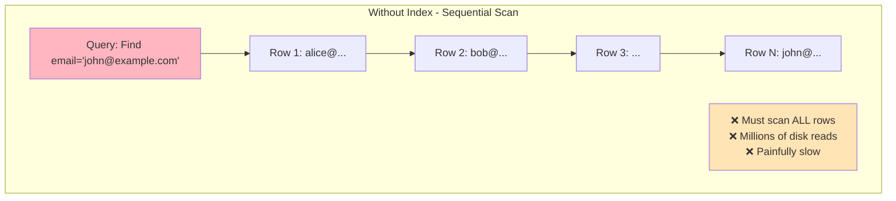

**Without indexes**: Database checks each row sequentially - like searching through every book in a library one by one.

### The Solution

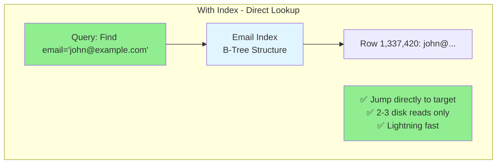

**With indexes**: Database uses optimized data structures to jump directly to the target - like using a book's index.

---

## ⚙️ How Database Indexes Work

### Physical Storage Overview

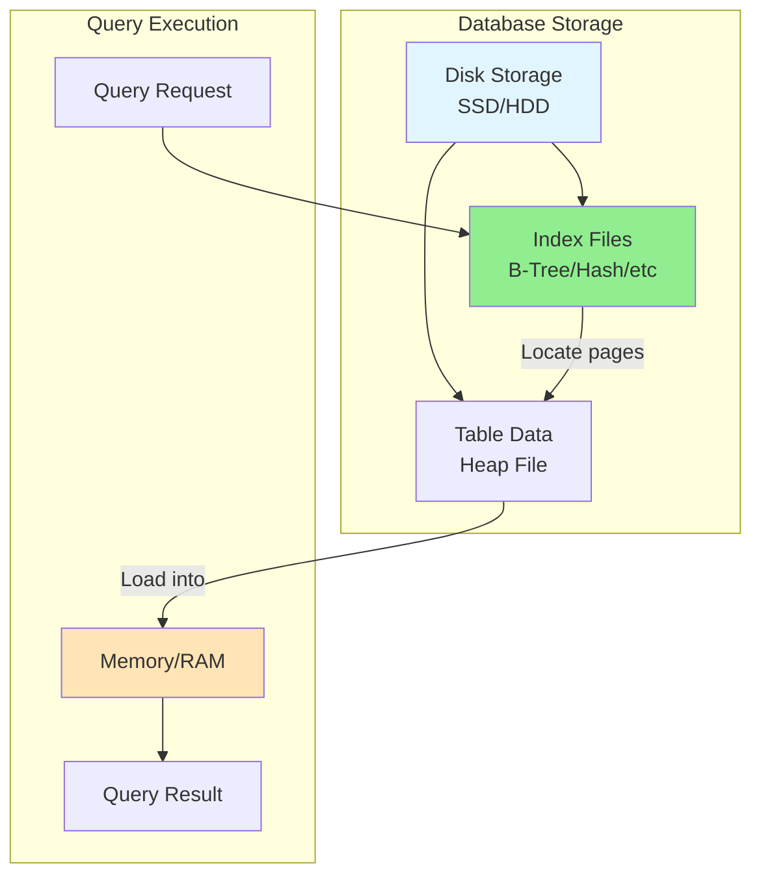

### Access Pattern Comparison

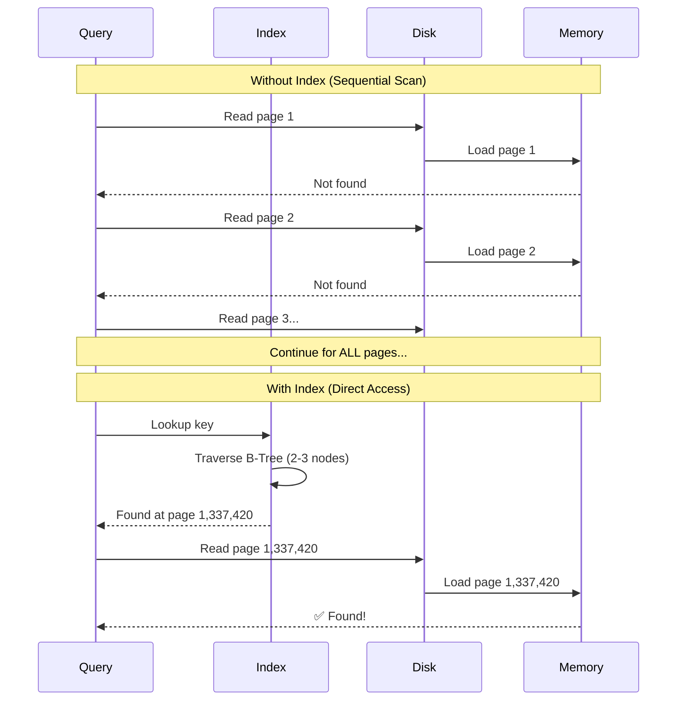

### Key Concepts

**Data Storage**:
- Tables stored as **heap files** on disk
- Data written as collection of rows in no particular order
- Like a notebook where you write entries as they come

**Memory vs Disk**:
- Data lives on disk (SSD/HDD)
- Can only process data when loaded into RAM
- Every query requires disk → memory transfer

**Index Benefit**:
- Provides structured path directly to target data
- Minimizes number of pages read from storage
- Transforms random access into guided navigation

> **⚠️ Important**: Even with SSDs, random access is significantly slower than sequential. Proper indexing is critical for performance.

---

### Cost of Indexes

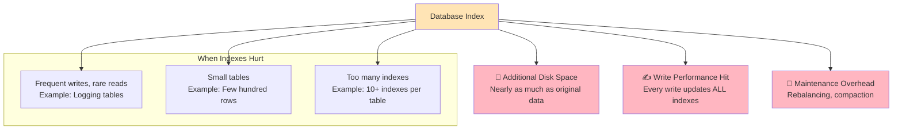

#### Trade-offs

**Costs**:
- 💾 **Disk Space**: Each index requires additional storage
- ✍️ **Write Performance**: Single write operation triggers updates to all indexes
- 🔧 **Maintenance**: Database must keep indexes balanced and optimized

**When to Avoid Indexes**:
- Logging tables (frequent inserts, rare queries)
- Small tables (few hundred rows - sequential scan is faster)
- Rarely queried columns

> **💡 Pro Tip**: Modern databases have smart buffer pool management. Monitor index usage and remove unnecessary indexes.

---

## 📊 Types of Indexes

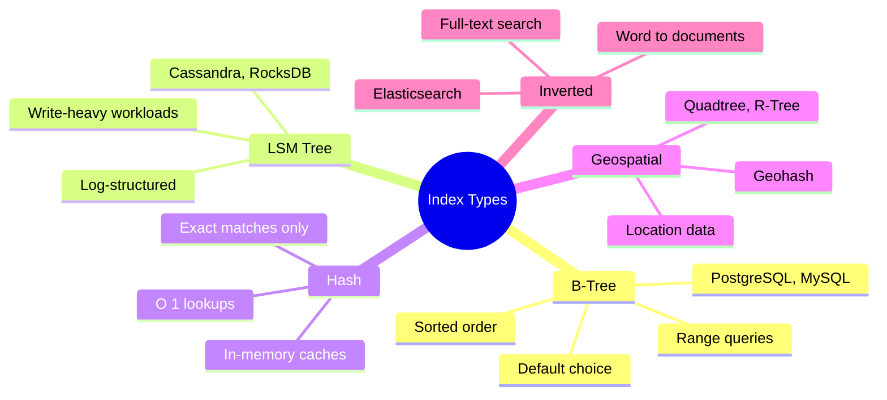

---

### 1️⃣ B-Tree Indexes

> **Most Common**: Default choice for almost all database indexes. If unsure in an interview, choose B-Tree.

#### Structure

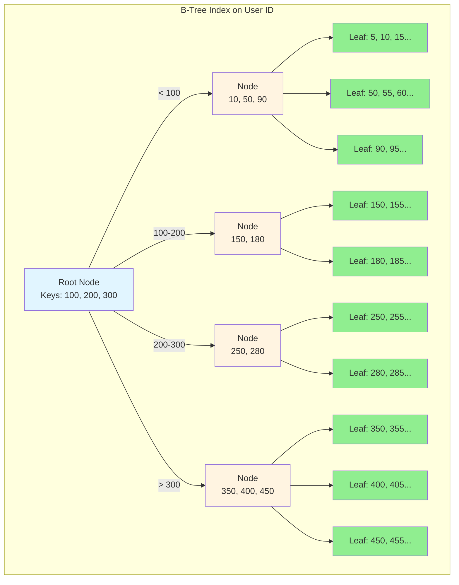

#### Search Example: Finding ID = 350

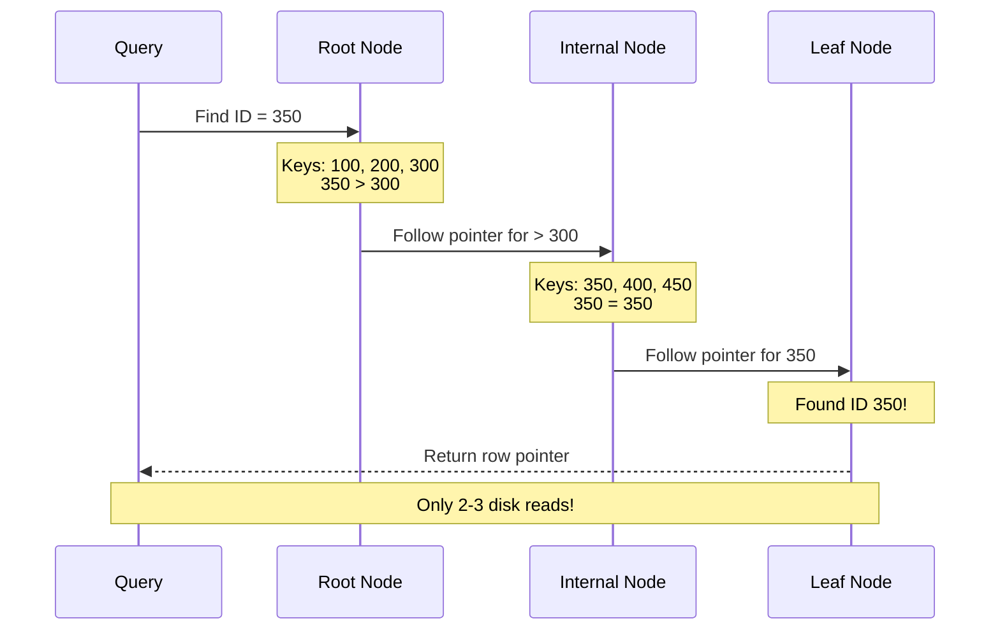

#### B-Tree Properties

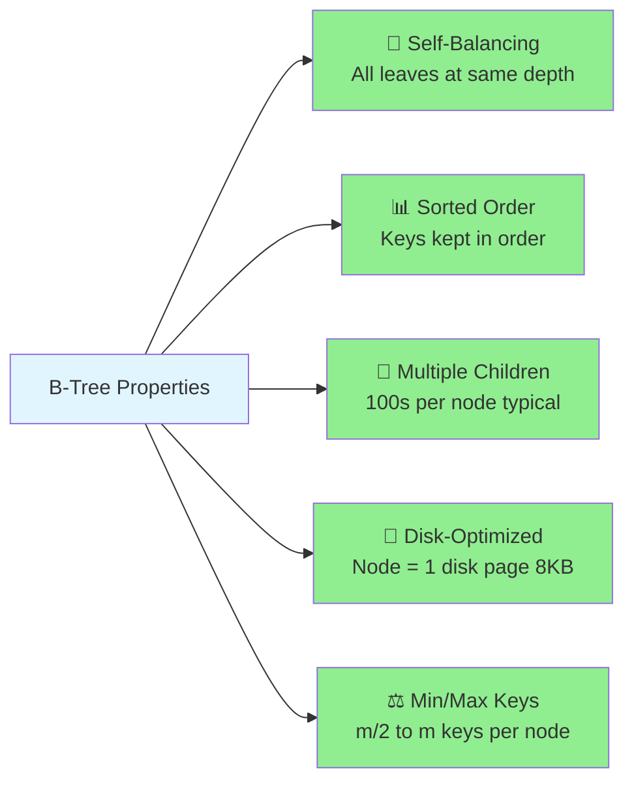

**Rules**:
1. All leaf nodes at same depth
2. Each node contains m/2 to m keys (m = order)
3. Node with k keys has exactly k+1 children
4. Keys within node kept in sorted order
5. Each node sized to fit one disk page (typically 8KB)

#### Real-World Examples

```sql
-- PostgreSQL automatically creates B-Tree indexes
CREATE TABLE users (
    id SERIAL PRIMARY KEY,        -- B-Tree index created
    email VARCHAR(255) UNIQUE     -- B-Tree index created
);

-- MongoDB
db.users.createIndex({ "email": 1 });  // B-Tree created
```

**Databases Using B-Trees**:
- PostgreSQL: Almost everything (primary keys, unique constraints, regular indexes)
- MySQL: InnoDB storage engine
- MongoDB: All indexes (B+ tree variant)
- SQLite: Primary index structure

#### Why B-Trees Are Default

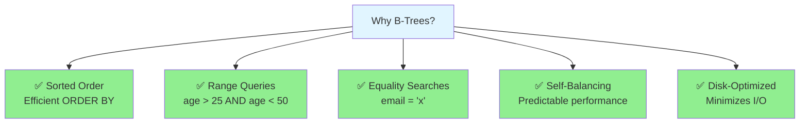

✅ **Perfect For**:
- Range queries: `age BETWEEN 25 AND 50`
- Sorted results: `ORDER BY created_at DESC`
- Equality searches: `email = 'john@example.com'`
- Prefix searches: `name LIKE 'John%'`

---

### 2️⃣ LSM Trees (Log-Structured Merge Trees)

> **Write-Optimized**: Ideal for write-heavy workloads like metrics ingestion, logging systems.

#### How LSM Trees Work

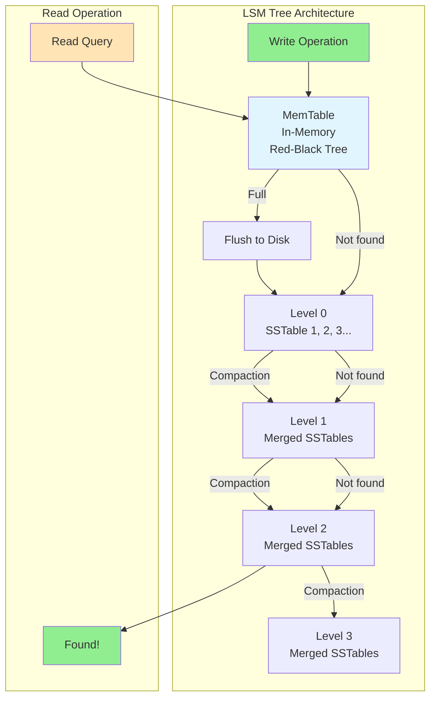

#### Write Path (Fast)

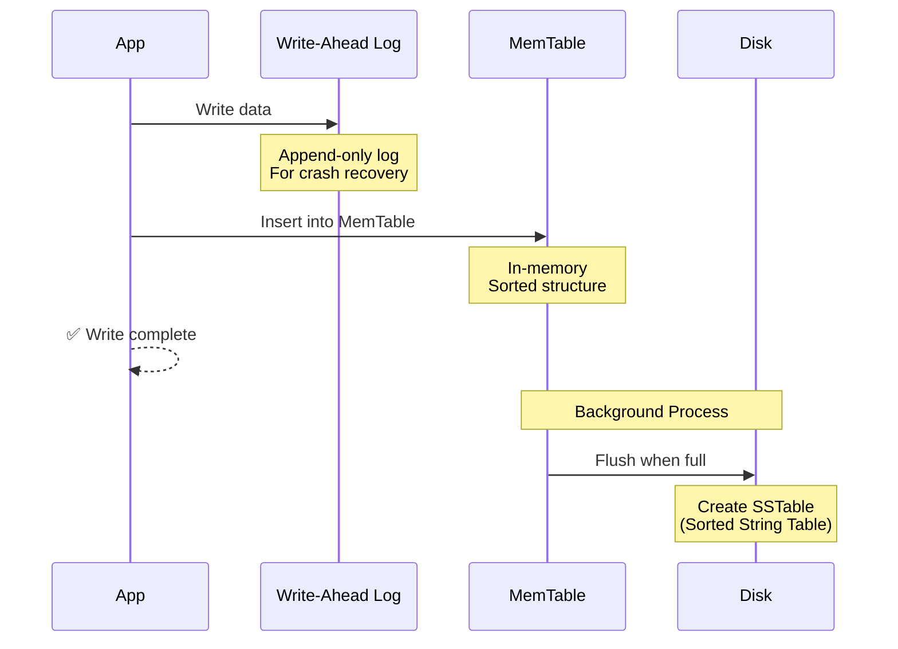

#### Read Path (Slower)

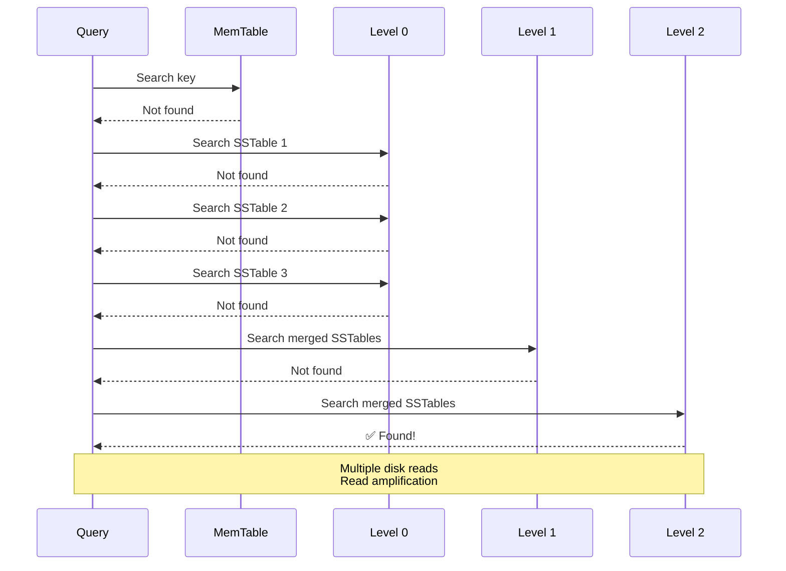

#### Compaction Process

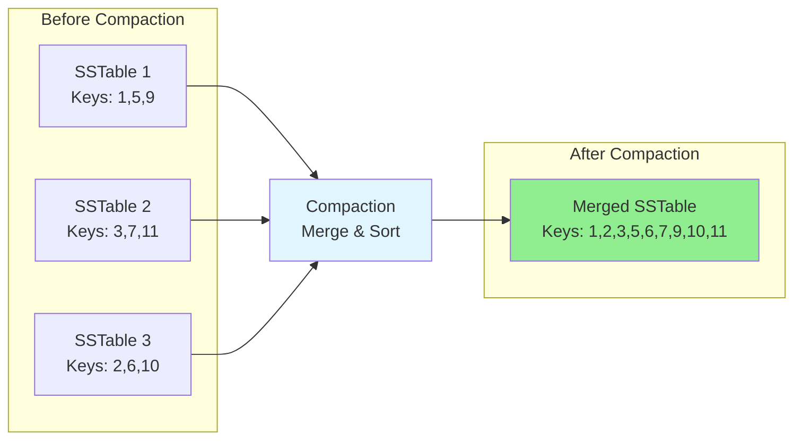

#### LSM Tree Trade-offs

| Aspect | B-Tree | LSM Tree |
|--------|---------|----------|
| **Writes** | ❌ Slower (in-place updates) | ✅ Faster (append-only) |
| **Reads** | ✅ Faster (direct lookup) | ❌ Slower (check multiple levels) |
| **Space** | ✅ Efficient | ❌ Write amplification |
| **Use Case** | Balanced workloads | Write-heavy systems |

✅ **Best For**:
- Metrics/telemetry ingestion (DataDog, Prometheus)
- Time-series data
- Event logging
- Write-heavy workloads

❌ **Avoid For**:
- Read-heavy applications
- Low-latency read requirements
- Range scans (slower than B-Tree)

**Technologies**: Cassandra, RocksDB, LevelDB, HBase

---

### 3️⃣ Hash Indexes

> **Exact Match Only**: Lightning-fast equality lookups, but can't handle ranges.

#### How Hash Indexes Work

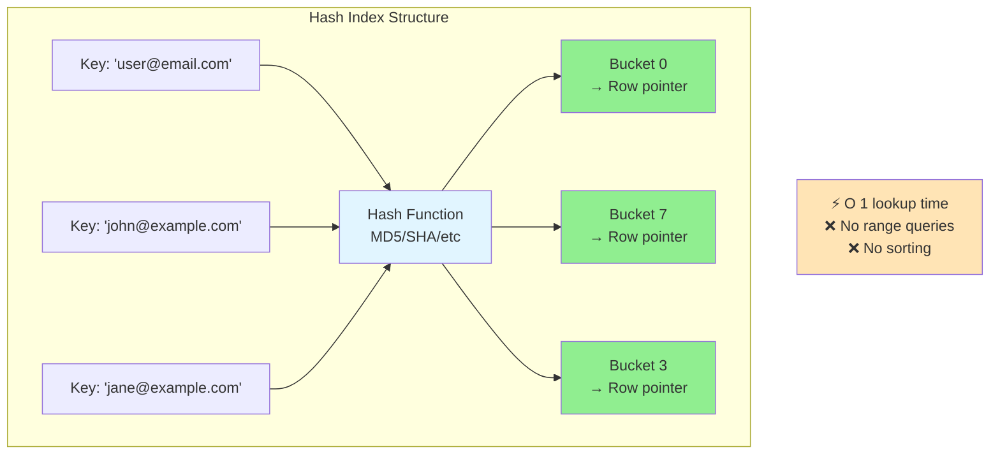

#### Query Support

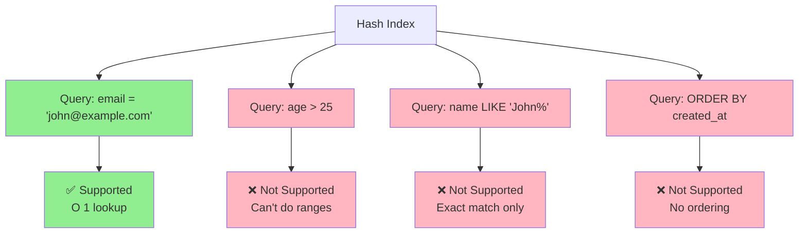

#### Real-World Usage

**In-Memory Caches**:
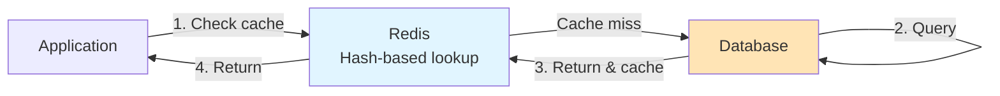

**Session Storage**:
```
session:abc123 → Session data
user:1001 → User object
cart:xyz789 → Shopping cart
```

✅ **Use When**:
- Exact match lookups only
- In-memory data structures
- Primary key lookups
- Key-value stores

❌ **Don't Use When**:
- Need range queries
- Need sorting
- Need prefix matching

**Technologies**: Redis (primary index), Memcached, PostgreSQL (hash indexes available but rarely used)

---

### 4️⃣ Geospatial Indexes

> **Location-Based**: Optimized for queries involving geographic coordinates and proximity searches.

#### The Challenge

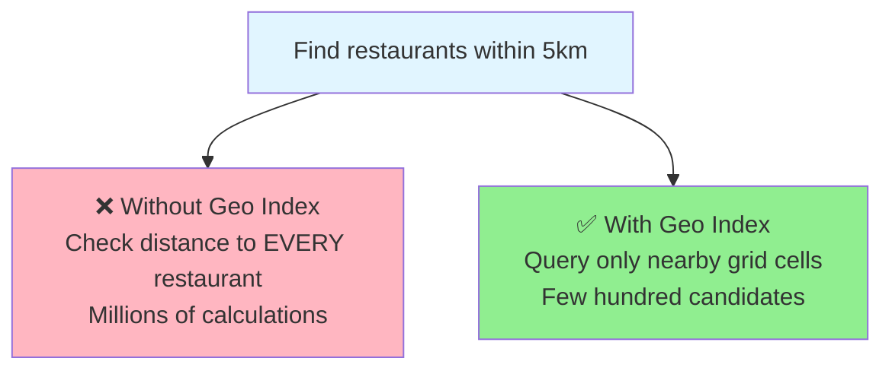

Traditional indexes don't work well for 2D spatial queries:
- B-Tree on latitude doesn't help with longitude
- Distance calculations expensive: `sqrt((x2-x1)² + (y2-y1)²)`

#### Approach 1: Geohash

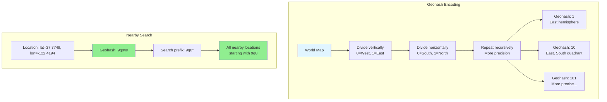

**Geohash Example**:
```
San Francisco: 9q8yy
  9    → Large region
  9q   → California
  9q8  → Bay Area
  9q8y → San Francisco area
  9q8yy → Specific neighborhood
```

#### Approach 2: Quadtree

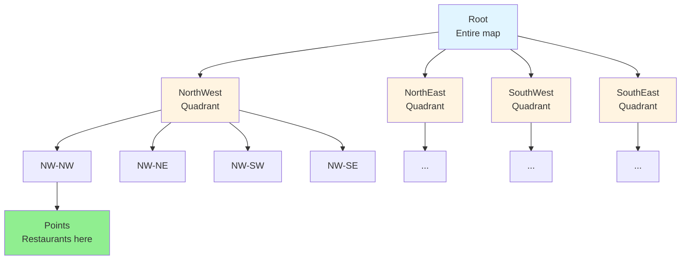

**How Quadtree Works**:
1. Divide map into 4 quadrants
2. Recursively subdivide quadrants with many points
3. Stop when quadrant has few points or max depth reached
4. Query: Only check quadrants intersecting search area

#### Approach 3: R-Tree

```mermaid
graph TB
    subgraph "R-Tree Structure"
        ROOT_R[Root Node<br/>Bounding boxes of children]
        
        ROOT_R --> BB1[Bounding Box 1<br/>Downtown area]
        ROOT_R --> BB2[Bounding Box 2<br/>Suburbs]
        ROOT_R --> BB3[Bounding Box 3<br/>Airport area]
        
        BB1 --> LEAF1[Leaf Node<br/>Restaurant A, B, C]
        BB2 --> LEAF2[Leaf Node<br/>Restaurant D, E, F]
        BB3 --> LEAF3[Leaf Node<br/>Restaurant G, H]
    end
    
    NOTE_R[Similar to B-Tree but<br/>groups by geographic proximity]
    
    style ROOT_R fill:#e1f5ff
    style BB1 fill:#fff4e1
    style BB2 fill:#fff4e1
    style BB3 fill:#fff4e1
    style LEAF1 fill:#90EE90
    style LEAF2 fill:#90EE90
    style LEAF3 fill:#90EE90
```

#### Comparison

| Approach | Best For | Trade-offs |
|----------|----------|------------|
| **Geohash** | Simple proximity searches | Edge cases at boundaries |
| **Quadtree** | Dynamic data, uneven distribution | Memory overhead |
| **R-Tree** | Complex shapes, polygons | More complex implementation |

✅ **Use Cases**:
- Find nearby restaurants/stores
- Ride-sharing driver matching
- Real estate search by location
- Delivery zone calculations

**Technologies**: 
- PostgreSQL: PostGIS extension (R-Tree)
- MongoDB: Geospatial indexes (2d, 2dsphere)
- Elasticsearch: Geo-point, geo-shape queries

---

### 5️⃣ Inverted Indexes

> **Full-Text Search**: Maps words to documents containing them, essential for search engines.

#### How Inverted Indexes Work

```mermaid
graph TB
    subgraph "Documents"
        DOC1[Doc 1: 'The quick brown fox']
        DOC2[Doc 2: 'The lazy dog sleeps']
        DOC3[Doc 3: 'Quick brown dogs run']
    end
    
    subgraph "Inverted Index"
        WORD1[the → Doc 1, Doc 2]
        WORD2[quick → Doc 1, Doc 3]
        WORD3[brown → Doc 1, Doc 3]
        WORD4[fox → Doc 1]
        WORD5[lazy → Doc 2]
        WORD6[dog/dogs → Doc 2, Doc 3]
    end
    
    DOC1 --> WORD1
    DOC1 --> WORD2
    DOC1 --> WORD3
    DOC1 --> WORD4
    
    DOC2 --> WORD1
    DOC2 --> WORD5
    DOC2 --> WORD6
    
    DOC3 --> WORD2
    DOC3 --> WORD3
    DOC3 --> WORD6
    
    style WORD1 fill:#90EE90
    style WORD2 fill:#90EE90
    style WORD3 fill:#90EE90
    style WORD4 fill:#90EE90
    style WORD5 fill:#90EE90
    style WORD6 fill:#90EE90
```

#### Search Query Example

```mermaid
sequenceDiagram
    participant User
    participant Index as Inverted Index
    participant Results
    
    User->>Index: Search "quick brown"
    Note over Index: 1. Tokenize: ["quick", "brown"]
    Index->>Index: Lookup "quick" → Doc 1, Doc 3
    Index->>Index: Lookup "brown" → Doc 1, Doc 3
    Index->>Index: Intersect results: Doc 1, Doc 3
    Index->>Results: Rank by relevance
    Results-->>User: Doc 1, Doc 3 (sorted)
```

#### Index Structure with Positions

```mermaid
graph LR
    subgraph "Term: 'database'"
        TERM[database]
        TERM --> POST1[Doc 5, positions: 1, 15, 23]
        TERM --> POST2[Doc 7, positions: 3, 9]
        TERM --> POST3[Doc 12, positions: 2]
    end
    
    subgraph "Term: 'indexing'"
        TERM2[indexing]
        TERM2 --> POST4[Doc 5, positions: 2, 16]
        TERM2 --> POST5[Doc 7, positions: 4]
        TERM2 --> POST6[Doc 9, positions: 1, 8, 14]
    end
    
    style TERM fill:#e1f5ff
    style TERM2 fill:#e1f5ff
    style POST1 fill:#90EE90
    style POST2 fill:#90EE90
    style POST3 fill:#90EE90
    style POST4 fill:#90EE90
    style POST5 fill:#90EE90
    style POST6 fill:#90EE90
```

**Positions enable**:
- Phrase searches: "database indexing" (words must be adjacent)
- Proximity searches: "database" within 5 words of "indexing"
- Highlighting matching terms in results

#### Advanced Features

```mermaid
graph TB
    FEATURES[Inverted Index Features]
    
    FEATURES --> F1[🔤 Stemming<br/>running → run<br/>databases → database]
    FEATURES --> F2[🚫 Stop Words<br/>Remove: the, a, is, of]
    FEATURES --> F3[📊 TF-IDF Scoring<br/>Term frequency ×<br/>Inverse doc frequency]
    FEATURES --> F4[🔍 Fuzzy Matching<br/>databse → database]
    FEATURES --> F5[🌍 Language Analysis<br/>Multi-language support]
    
    style FEATURES fill:#e1f5ff
    style F1 fill:#90EE90
    style F2 fill:#90EE90
    style F3 fill:#90EE90
    style F4 fill:#90EE90
    style F5 fill:#90EE90
```

✅ **Use Cases**:
- Search engines (Google, Bing)
- E-commerce product search
- Document management systems
- Log analysis and searching
- Code search

**Technologies**: 
- Elasticsearch: Built entirely on inverted indexes
- Solr: Apache Lucene-based search
- PostgreSQL: Full-text search with GIN indexes
- MongoDB: Text indexes

---

## 🎯 Index Optimization Patterns

### Composite Indexes

```mermaid
graph TB
    subgraph "Single-Column Indexes"
        I1[Index on user_id]
        I2[Index on created_at]
        
        QUERY1[Query: WHERE user_id = 123<br/>AND created_at > '2024-01-01']
        
        QUERY1 --> CHOICE[Database picks ONE index<br/>Other condition filtered after]
    end
    
    subgraph "Composite Index"
        CI[Index on user_id, created_at]
        
        QUERY2[Query: WHERE user_id = 123<br/>AND created_at > '2024-01-01']
        
        QUERY2 --> FAST[✅ Both conditions use index<br/>Much faster!]
    end
    
    style I1 fill:#FFE4B5
    style I2 fill:#FFE4B5
    style CI fill:#90EE90
    style FAST fill:#90EE90
```

#### Column Order Matters

```mermaid
flowchart TB
    IDX1[Index: user_id, created_at]
    IDX2[Index: created_at, user_id]
    
    Q1[WHERE user_id = 123<br/>AND created_at > '2024-01-01']
    Q2[WHERE user_id = 123]
    Q3[WHERE created_at > '2024-01-01']
    
    IDX1 --> R1[✅ Uses full index]
    IDX1 --> R2[✅ Uses user_id part]
    IDX1 --> R3[❌ Can't use index]
    
    IDX2 --> R4[✅ Uses full index]
    IDX2 --> R5[❌ Can't use index]
    IDX2 --> R6[✅ Uses created_at part]
    
    Q1 --> IDX1
    Q2 --> IDX1
    Q3 --> IDX1
    
    Q1 --> IDX2
    Q2 --> IDX2
    Q3 --> IDX2
    
    style R1 fill:#90EE90
    style R2 fill:#90EE90
    style R3 fill:#FFB6C1
    style R4 fill:#90EE90
    style R5 fill:#FFB6C1
    style R6 fill:#90EE90
```

**Rule**: Composite index `(A, B, C)` can be used for queries on:
- ✅ `A`
- ✅ `A, B`
- ✅ `A, B, C`
- ❌ `B`
- ❌ `C`
- ❌ `B, C`

**Best Practice**: Most selective columns first (columns with highest cardinality)

---

### Covering Indexes

> **Zero Disk Reads**: Index contains ALL columns needed by query, no need to access table.

```mermaid
sequenceDiagram
    participant Query
    participant Index as Index user_id, email, name
    participant Table
    
    Note over Query: SELECT email, name<br/>WHERE user_id = 123
    
    Query->>Index: Search for user_id = 123
    Index->>Index: Found! email & name in index
    Index-->>Query: Return email, name
    
    Note over Query,Table: ✅ Never touched table!<br/>Called "index-only scan"
```

**Regular Index**:
```sql
CREATE INDEX idx_user ON users(user_id);

SELECT email, name FROM users WHERE user_id = 123;
-- 1. Search index for user_id = 123
-- 2. Get row pointer
-- 3. Fetch full row from table (disk read)
```

**Covering Index**:
```sql
CREATE INDEX idx_user_covering ON users(user_id, email, name);

SELECT email, name FROM users WHERE user_id = 123;
-- 1. Search index for user_id = 123
-- 2. All needed columns in index!
-- 3. No table access needed ✅
```

```mermaid
graph LR
    subgraph "Performance Comparison"
        REG[Regular Index<br/>2 disk reads]
        COV[Covering Index<br/>1 disk read]
    end
    
    REG -->|Slower| RESULT[Query Result]
    COV -->|Faster| RESULT
    
    style REG fill:#FFE4B5
    style COV fill:#90EE90
```

✅ **Use When**:
- Query frequently accesses same columns
- Read-heavy workloads
- Can afford extra storage

⚠️ **Trade-off**:
- Larger index size
- Slower writes (more data to update)

---

## ✅ Best Practices

### Index Selection Strategy

```mermaid
flowchart TB
    START[Need an Index?]
    
    START --> Q1{Query<br/>frequency?}
    Q1 -->|Rare| SKIP[❌ Skip Index]
    Q1 -->|Frequent| Q2{Query<br/>type?}
    
    Q2 -->|Exact match| Q3{Data<br/>type?}
    Q2 -->|Range/Sort| BTREE[✅ B-Tree]
    Q2 -->|Full-text| INVERTED[✅ Inverted Index]
    Q2 -->|Location| GEO[✅ Geospatial]
    
    Q3 -->|Small dataset| HASH[✅ Hash Index]
    Q3 -->|Large dataset| BTREE2[✅ B-Tree]
    
    style START fill:#e1f5ff
    style SKIP fill:#FFB6C1
    style BTREE fill:#90EE90
    style BTREE2 fill:#90EE90
    style INVERTED fill:#90EE90
    style GEO fill:#90EE90
    style HASH fill:#90EE90
```

### Interview Checklist

```mermaid
mindmap
    root((Index Design))
        Identify Access Patterns
            API endpoints
            Query frequency
            Read vs write ratio
        Choose Index Type
            Default: B-Tree
            Write-heavy: LSM
            Exact match: Hash
            Full-text: Inverted
            Location: Geospatial
        Optimize
            Composite indexes
            Column order
            Covering indexes
        Monitor
            Query performance
            Index usage stats
            Remove unused indexes
```

### Common Mistakes

```mermaid
graph TB
    MISTAKES[❌ Common Mistakes]
    
    MISTAKES --> M1[Too Many Indexes<br/>Kills write performance]
    MISTAKES --> M2[Wrong Column Order<br/>In composite indexes]
    MISTAKES --> M3[Indexing Low Cardinality<br/>gender, boolean fields]
    MISTAKES --> M4[Forgetting Covering Indexes<br/>For frequent queries]
    MISTAKES --> M5[Not Monitoring Usage<br/>Unused indexes waste space]
    
    style MISTAKES fill:#FFB6C1
    style M1 fill:#FFE4B5
    style M2 fill:#FFE4B5
    style M3 fill:#FFE4B5
    style M4 fill:#FFE4B5
    style M5 fill:#FFE4B5
```

### Decision Matrix

| Use Case | Index Type | Reasoning |
|----------|------------|-----------|
| User lookup by email | B-Tree | Equality + sorting support |
| Feed timeline (recent posts) | B-Tree composite | Range query on timestamp |
| Session management | Hash | Exact match lookups |
| Metrics ingestion | LSM Tree | Write-heavy workload |
| Restaurant finder | Geospatial | Location-based queries |
| Product search | Inverted | Full-text search |
| Analytics (write-once) | Columnstore/LSM | Append-only workload |

---

## 🎓 Key Takeaways

### The Essentials

```mermaid
graph TB
    CORE[Database Indexing Essentials]
    
    CORE --> K1[🎯 Purpose<br/>Fast lookups without scanning<br/>every row]
    
    CORE --> K2[🌳 B-Tree Default<br/>Works for 90% of cases<br/>Range + equality + sorting]
    
    CORE --> K3[⚖️ Trade-offs<br/>Faster reads<br/>Slower writes + more space]
    
    CORE --> K4[🔧 Optimization<br/>Composite indexes<br/>Covering indexes<br/>Match access patterns]
    
    style CORE fill:#e1f5ff
    style K1 fill:#90EE90
    style K2 fill:#90EE90
    style K3 fill:#FFE4B5
    style K4 fill:#90EE90
```

### Interview Strategy

**When Discussing Indexes**:
1. ✅ Start with access patterns from API design
2. ✅ Default to B-Tree unless special requirements
3. ✅ Mention composite indexes for multi-column queries
4. ✅ Consider covering indexes for hot queries
5. ✅ Acknowledge write trade-offs
6. ✅ Tie back to functional requirements

**Example Script**:
> "For the feed timeline query, I'll create a composite B-Tree index on `(user_id, created_at)`. This supports both filtering by user and sorting by time. For frequently accessed posts, we could use a covering index that includes `content` and `like_count` to avoid table lookups entirely."

---

## 📚 Related Concepts

- [Data Modeling](./DataModelling.md) - Schema design and relationships
- [Database Sharding](./Sharding.md) - Horizontal partitioning strategies
- [Caching](./Caching.md) - Reduce database load
- [PostgreSQL](./PostgreSQL.md) - B-Tree implementation details
- [Query Optimization](./QueryOptimization.md) - Using indexes effectively

---

**Last Updated**: December 2024
**Source**: [HelloInterview - Database Indexing](https://www.hellointerview.com/learn/system-design/core-concepts/db-indexing)

> **💡 Remember**: In interviews, if unsure which index to use, B-Tree is always a safe choice. Focus on identifying access patterns from your API design, then match the right index type to those patterns.
