# 📊 Data Modeling

> **Core Concept**: Data modeling is the process of defining how your application's data is structured, stored, and related. In system design interviews, you need to create clear, functional schemas aligned with your system's requirements.

## 📋 Table of Contents
- [Overview](#overview)
- [Database Model Options](#database-model-options)
- [Schema Design Fundamentals](#schema-design-fundamentals)
- [Best Practices](#best-practices)
- [Conclusion](#conclusion)

---

## 🎯 Overview

### What is Data Modeling?

Data modeling involves deciding:
- **What entities exist** in your system
- **How they're identified** (primary keys)
- **How they connect** to one another (relationships)

### Interview Context

In system design interviews:
- ✅ **Expected**: Clear, functional schema aligned with requirements
- ❌ **Not Expected**: Complete normalized database diagrams
- 🎯 **Focus**: Design something that won't crumble under expected usage

### When It Comes Up

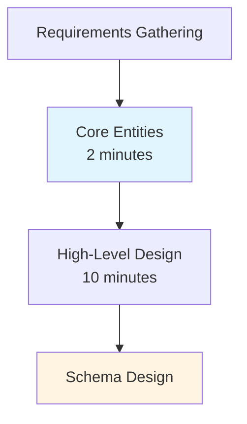
```mermaid
graph TB
    RG[Requirements Gathering]
    CE[Core Entities<br/>2 minutes]
    HLD[High-Level Design<br/>10 minutes]
    SD[Schema Design]
    
    RG --> CE
    CE --> HLD
    HLD --> SD
    
    style CE fill:#e1f5ff
    style SD fill:#fff4e1
```

1. **Requirements Gathering**: Identify core entities (usually map 1:1 with tables)
2. **High-Level Design**: Sketch basic schema with key fields, relationships, indexes

---

## 🗄️ Database Model Options

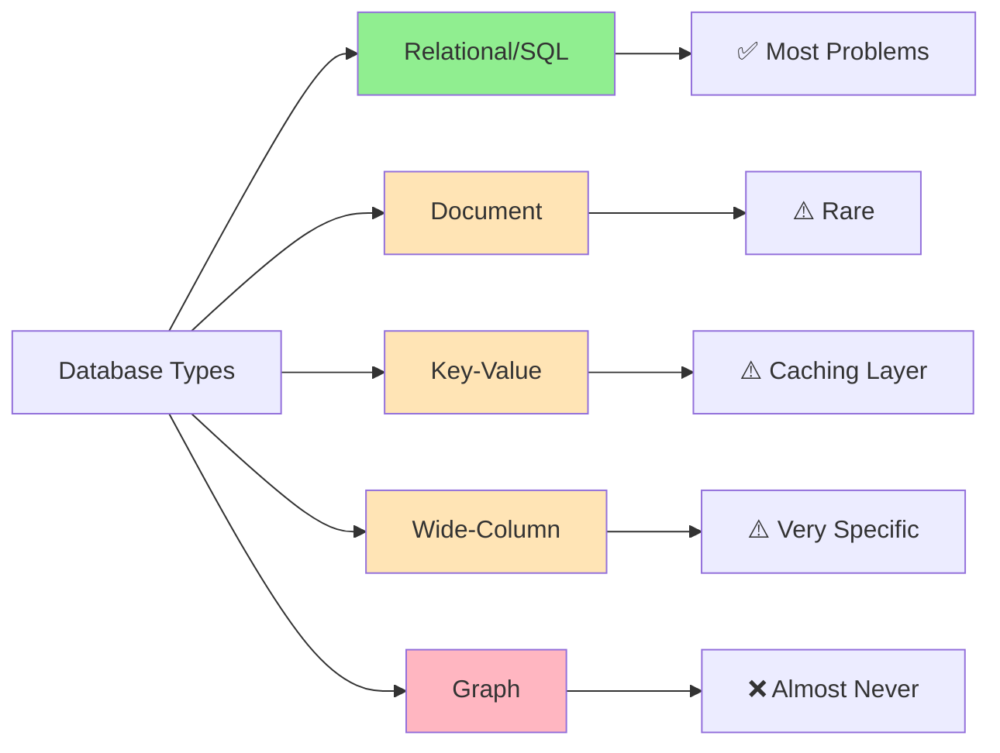
```mermaid
graph LR
    DB[Database Types]
    
    DB --> SQL[Relational/SQL]
    DB --> DOC[Document]
    DB --> KV[Key-Value]
    DB --> WC[Wide-Column]
    DB --> GRAPH[Graph]
    
    SQL --> REC1[✅ Most Problems]
    DOC --> REC2[⚠️ Rare]
    KV --> REC3[⚠️ Caching Layer]
    WC --> REC4[⚠️ Very Specific]
    GRAPH --> REC5[❌ Almost Never]
    
    style SQL fill:#90EE90
    style DOC fill:#FFE4B5
    style KV fill:#FFE4B5
    style WC fill:#FFE4B5
    style GRAPH fill:#FFB6C1
```

> **💡 Interview Tip**: Default to PostgreSQL unless requirements clearly signal a specialized model.

---

### 1️⃣ Relational Databases (SQL)

**Structure**: Tables with fixed schemas, rows represent entities, columns represent attributes

**Key Features**:
- Foreign keys enforce relationships
- ACID guarantees for transactions
- Complex query support with JOINs

#### Example Schema

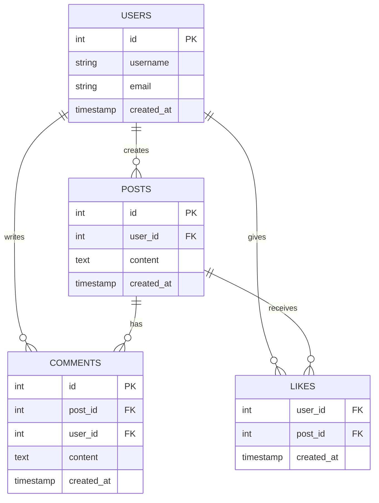
```mermaid
erDiagram
    USERS ||--o{ POSTS : creates
    USERS ||--o{ COMMENTS : writes
    USERS ||--o{ LIKES : gives
    POSTS ||--o{ COMMENTS : has
    POSTS ||--o{ LIKES : receives
    
    USERS {
        int id PK
        string username
        string email
        timestamp created_at
    }
    
    POSTS {
        int id PK
        int user_id FK
        text content
        timestamp created_at
    }
    
    COMMENTS {
        int id PK
        int post_id FK
        int user_id FK
        text content
        timestamp created_at
    }
    
    LIKES {
        int user_id FK
        int post_id FK
        timestamp created_at
    }
```

#### Sample Tables

**Users Table**:
| id | username | email | created_at |
|----|----------|-------|------------|
| 1 | john_doe | john@example.com | 2024-01-01 10:00:00 |
| 2 | jane_doe | jane@example.com | 2024-01-01 10:05:00 |
| 3 | bob_smith | bob@example.com | 2024-01-01 10:10:00 |

**Posts Table**:
| id | user_id | content | created_at |
|----|---------|---------|------------|
| 1 | 1 | Hello, world! | 2024-01-01 10:00:00 |
| 2 | 1 | My first post | 2024-01-01 10:05:00 |
| 3 | 2 | Another post | 2024-01-01 10:10:00 |

**Likes Table**:
| user_id | post_id | created_at |
|---------|---------|------------|
| 1 | 1 | 2024-01-01 10:00:00 |
| 2 | 1 | 2024-01-01 10:05:00 |
| 2 | 3 | 2024-01-01 10:10:00 |

#### When to Use

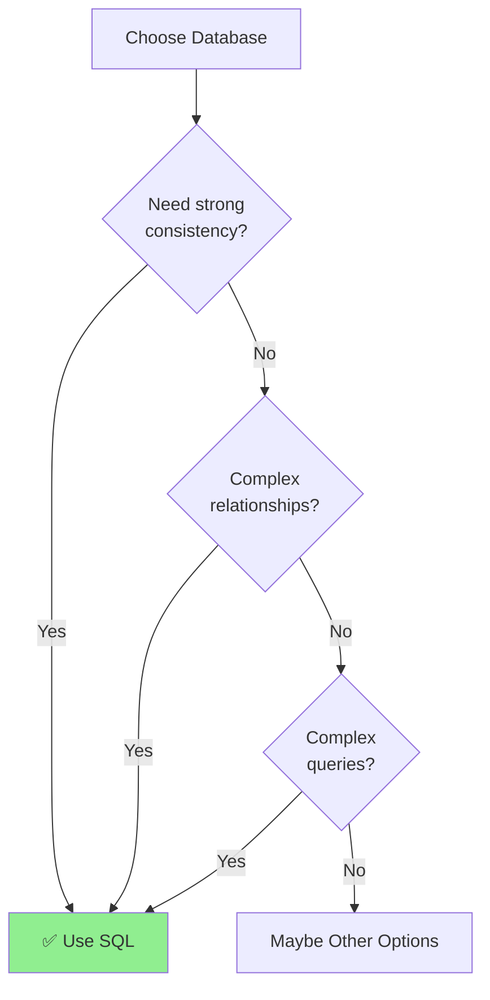
```mermaid
flowchart TB
    START[Choose Database]
    Q1{Need strong<br/>consistency?}
    Q2{Complex<br/>relationships?}
    Q3{Complex<br/>queries?}
    SQL[✅ Use SQL]
    MAYBE[Maybe Other Options]
    
    START --> Q1
    Q1 -->|Yes| SQL
    Q1 -->|No| Q2
    Q2 -->|Yes| SQL
    Q2 -->|No| Q3
    Q3 -->|Yes| SQL
    Q3 -->|No| MAYBE
    
    style SQL fill:#90EE90
```

✅ **Best For**:
- Strong consistency requirements (payments, inventory)
- Complex queries with JOINs
- Clear entity relationships
- Most system design problems

⚠️ **Watch Out**:
- Multi-table JOINs can become performance traps at scale
- May need denormalized views, caching, or pre-computed results

**Technologies**: PostgreSQL, MySQL, SQLite

---

### 2️⃣ Document Databases

**Structure**: JSON-like documents with flexible schemas

**Key Features**:
- Schema flexibility
- Nested/embedded data
- No JOINs required

#### Example Structure

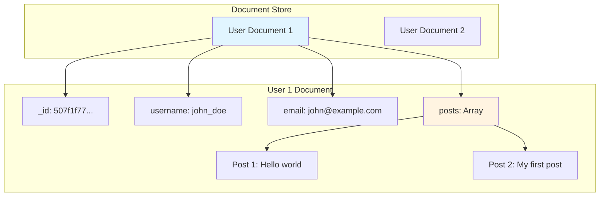
```mermaid
graph TB
    subgraph "Document Store"
        USER1[User Document 1]
        USER2[User Document 2]
    end
    
    subgraph "User 1 Document"
        U1ID[_id: 507f1f77...]
        U1NAME[username: john_doe]
        U1EMAIL[email: john@example.com]
        U1POSTS[posts: Array]
        POST1[Post 1: Hello world]
        POST2[Post 2: My first post]
    end
    
    USER1 --> U1ID
    USER1 --> U1NAME
    USER1 --> U1EMAIL
    USER1 --> U1POSTS
    U1POSTS --> POST1
    U1POSTS --> POST2
    
    style USER1 fill:#e1f5ff
    style U1POSTS fill:#fff4e1
```

#### Sample Document

```json
{
  "_id": "507f1f77bcf86cd799439011",
  "username": "john_doe",
  "email": "john@example.com",
  "posts": [
    {
      "content": "Hello, world!",
      "created_at": "2024-01-01T10:00:00Z"
    },
    {
      "content": "My first post",
      "created_at": "2024-01-01T10:05:00Z"
    }
  ],
  "created_at": "2024-01-01T10:00:00Z"
}
```

#### When to Use

✅ **Consider When**:
- Schema changes frequently
- Deeply nested data requiring many JOINs in SQL
- Different records have vastly different structures
- User profiles with varying detail levels

⚠️ **Trade-offs**:
- Updating a post requires modifying entire user document
- More aggressive denormalization
- Trades storage space and update complexity for read performance

❌ **Interview Reality**: System design interviews have concise, stable requirements - unlikely to need schema flexibility

**Technologies**: MongoDB, Firestore, CouchDB

---

### 3️⃣ Key-Value Stores

**Structure**: Simple key → value lookups

**Key Features**:
- Extremely fast lookups
- Limited query capabilities
- Simple operations

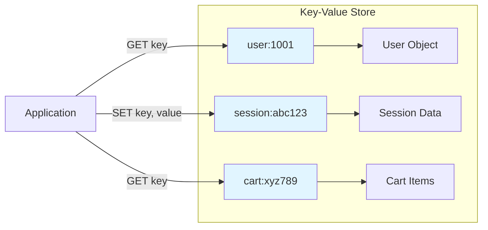
```mermaid
graph LR
    subgraph "Key-Value Store"
        K1[user:1001] --> V1[User Object]
        K2[session:abc123] --> V2[Session Data]
        K3[cart:xyz789] --> V3[Cart Items]
    end
    
    APP[Application] -->|GET key| K1
    APP -->|SET key, value| K2
    APP -->|GET key| K3
    
    style K1 fill:#e1f5ff
    style K2 fill:#e1f5ff
    style K3 fill:#e1f5ff
```

#### Common Pattern: Cache + SQL

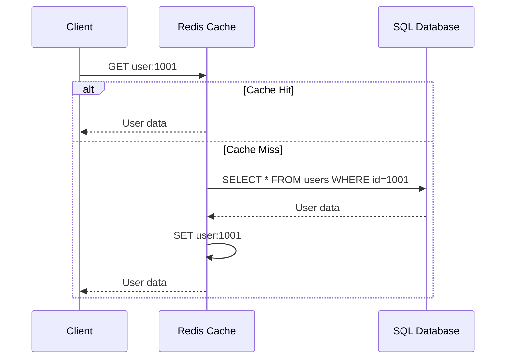
```mermaid
sequenceDiagram
    participant Client
    participant Cache as Redis Cache
    participant DB as SQL Database
    
    Client->>Cache: GET user:1001
    alt Cache Hit
        Cache-->>Client: User data
    else Cache Miss
        Cache->>DB: SELECT * FROM users WHERE id=1001
        DB-->>Cache: User data
        Cache->>Cache: SET user:1001
        Cache-->>Client: User data
    end
```

#### When to Use

✅ **Best For**:
- Caching hot data
- Session storage
- Feature flags
- High-write scenarios with simple lookups

⚠️ **Data Modeling Impact**:
- Very flat schema
- Heavy denormalization
- Duplicate data across multiple keys for different access patterns
- Great for reads, terrible for consistency

> **💡 Key Insight**: "Over SQL" is misleading - use BOTH together. SQL as source of truth, key-value cache for hot data.

**Technologies**: Redis, DynamoDB, Memcached

---

### 4️⃣ Wide-Column Databases

**Structure**: Column families where rows can have different columns

**Key Features**:
- Optimized for massive write-heavy workloads
- Time-series data
- Append-only operations

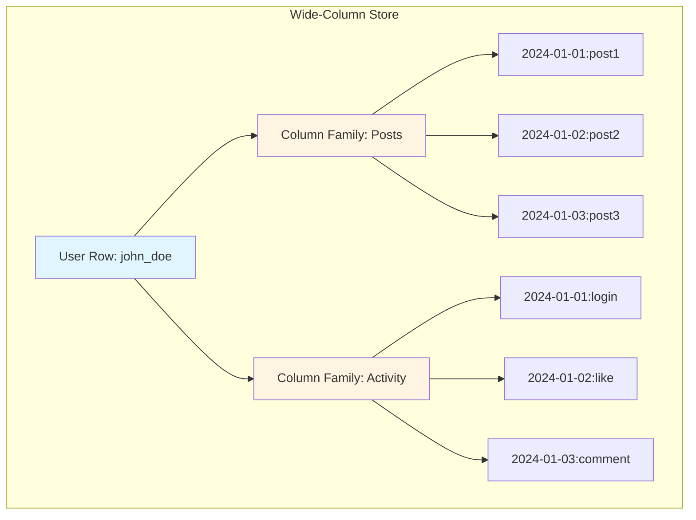
```mermaid
graph TB
    subgraph "Wide-Column Store"
        ROW[User Row: john_doe]
        CF1[Column Family: Posts]
        CF2[Column Family: Activity]
        
        ROW --> CF1
        ROW --> CF2
        
        CF1 --> C1[2024-01-01:post1]
        CF1 --> C2[2024-01-02:post2]
        CF1 --> C3[2024-01-03:post3]
        
        CF2 --> A1[2024-01-01:login]
        CF2 --> A2[2024-01-02:like]
        CF2 --> A3[2024-01-03:comment]
    end
    
    style ROW fill:#e1f5ff
    style CF1 fill:#fff4e1
    style CF2 fill:#fff4e1
```

#### When to Use

✅ **Consider When**:
- Enormous write volumes
- Time-series data
- Analytics workloads
- Event logging, IoT sensor data, telemetry

⚠️ **Data Modeling Impact**:
- Design around query patterns more than SQL
- Duplicate data across column families
- Time becomes first-class citizen

**Technologies**: Cassandra, HBase

---

### 5️⃣ Graph Databases

**Structure**: Nodes and edges optimizing for relationship traversal

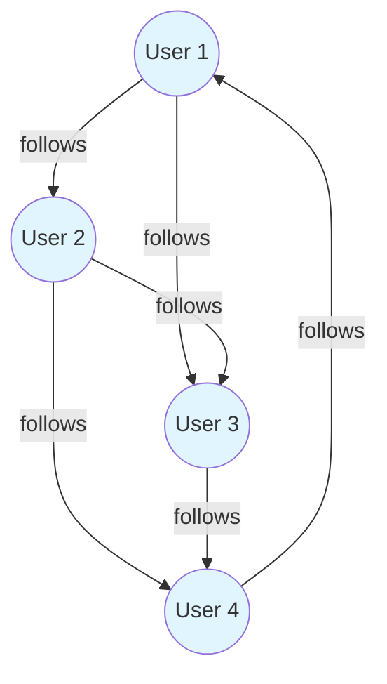
```mermaid
graph TB
    U1((User 1))
    U2((User 2))
    U3((User 3))
    U4((User 4))
    
    U1 -->|follows| U2
    U1 -->|follows| U3
    U2 -->|follows| U3
    U2 -->|follows| U4
    U3 -->|follows| U4
    U4 -->|follows| U1
    
    style U1 fill:#e1f5ff
    style U2 fill:#e1f5ff
    style U3 fill:#e1f5ff
    style U4 fill:#e1f5ff
```

#### When to Use

❌ **Interview Reality**: Almost never!

**Why?**
- Even Facebook uses MySQL for social graph
- LinkedIn and Twitter use SQL for core relationships
- Adds unnecessary operational complexity
- Common mistake showing off sophistication

> **⚠️ Warning**: Graph databases sound sophisticated but are a red flag in most interviews.

**Technologies**: Neo4j, Amazon Neptune

---

## 🏗️ Schema Design Fundamentals

### Step 1: Start with Requirements

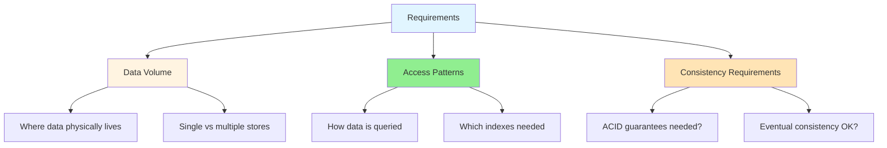
```mermaid
flowchart TB
    REQ[Requirements]
    
    REQ --> VOL[Data Volume]
    REQ --> ACCESS[Access Patterns]
    REQ --> CONS[Consistency Requirements]
    
    VOL --> VOL1[Where data physically lives]
    VOL --> VOL2[Single vs multiple stores]
    
    ACCESS --> ACC1[How data is queried]
    ACCESS --> ACC2[Which indexes needed]
    
    CONS --> CON1[ACID guarantees needed?]
    CONS --> CON2[Eventual consistency OK?]
    
    style REQ fill:#e1f5ff
    style VOL fill:#fff4e1
    style ACCESS fill:#90EE90
    style CONS fill:#FFE4B5
```

#### Three Key Factors

**1. Data Volume**
- Determines where data can physically live
- Drives schema partitioning decisions
- Millions of users might need distributed stores

**2. Access Patterns** ⭐ *Most Important*
- How will data be queried?
- Drives index design
- Comes naturally from API endpoints

**3. Consistency Requirements**
- Strong consistency (ACID) → same database
- Eventual consistency → can distribute across systems

> **💡 Interview Tip**: Explicitly tie schema choices back to these factors:
> 
> *"Since we need to load feeds quickly and likes can be eventually consistent, I'll denormalize like counts into the posts table."*

---

### Step 2: Entities, Keys & Relationships

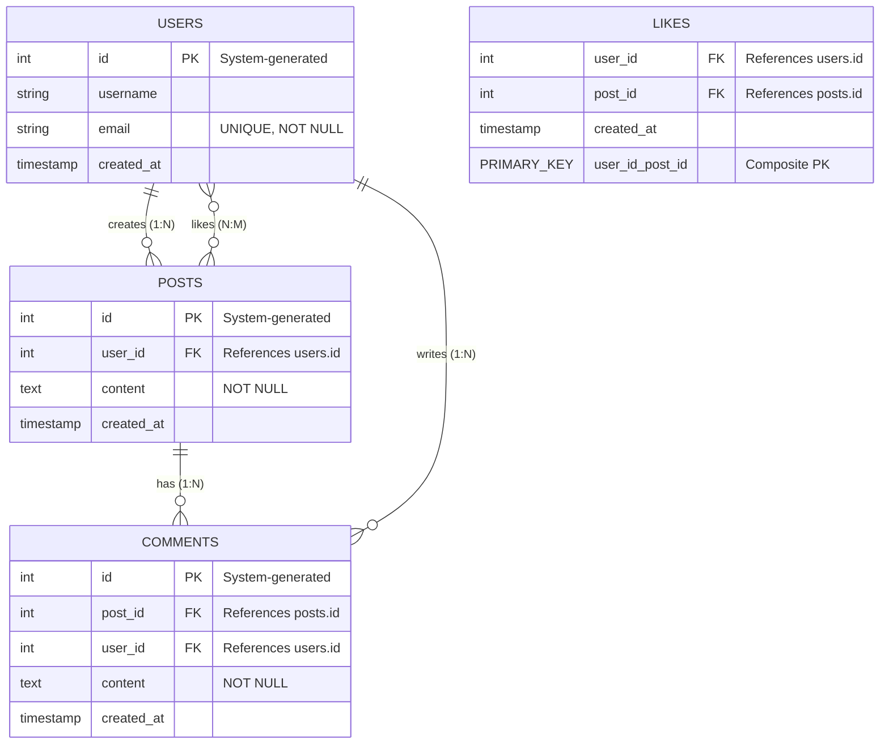
```mermaid
erDiagram
    USERS ||--o{ POSTS : "creates (1:N)"
    POSTS ||--o{ COMMENTS : "has (1:N)"
    USERS ||--o{ COMMENTS : "writes (1:N)"
    USERS }o--o{ POSTS : "likes (N:M)"
    
    USERS {
        int id PK "System-generated"
        string username
        string email "UNIQUE, NOT NULL"
        timestamp created_at
    }
    
    POSTS {
        int id PK "System-generated"
        int user_id FK "References users.id"
        text content "NOT NULL"
        timestamp created_at
    }
    
    COMMENTS {
        int id PK "System-generated"
        int post_id FK "References posts.id"
        int user_id FK "References users.id"
        text content "NOT NULL"
        timestamp created_at
    }
    
    LIKES {
        int user_id FK "References users.id"
        int post_id FK "References posts.id"
        timestamp created_at
        PRIMARY_KEY user_id_post_id "Composite PK"
    }
```

#### Primary Keys (PK)

✅ **Use**: System-generated IDs (user_id, post_id)
❌ **Avoid**: Business data (email addresses)

**Why?** System-generated keys stay stable even when business rules change.

#### Relationships

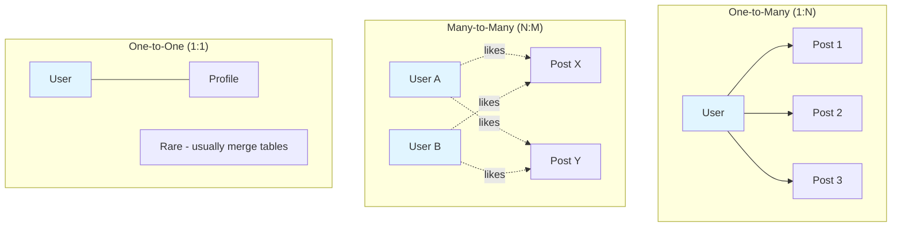
```mermaid
graph TB
    subgraph "One-to-Many (1:N)"
        U1[User]
        P1[Post 1]
        P2[Post 2]
        P3[Post 3]
        U1 --> P1
        U1 --> P2
        U1 --> P3
    end
    
    subgraph "Many-to-Many (N:M)"
        UA[User A]
        UB[User B]
        PA[Post X]
        PB[Post Y]
        UA -.->|likes| PA
        UA -.->|likes| PB
        UB -.->|likes| PA
        UB -.->|likes| PB
    end
    
    subgraph "One-to-One (1:1)"
        UC[User]
        PROF[Profile]
        UC --- PROF
        NOTE[Rare - usually merge tables]
    end
    
    style U1 fill:#e1f5ff
    style UA fill:#e1f5ff
    style UB fill:#e1f5ff
    style UC fill:#e1f5ff
```

**Types**:
- **One-to-Many (1:N)**: User has many posts, post has many comments
- **Many-to-Many (N:M)**: Users like many posts, posts liked by many users
- **One-to-One (1:1)**: Rare, often means tables should merge

#### Foreign Keys

**Benefits**:
- Enforce referential integrity
- Prevent orphaned records (post referencing non-existent user)

**Trade-offs**:
- Write performance cost (validation overhead)
- At large scale, some drop them and enforce in application

#### Constraints

```sql
-- Examples
email VARCHAR(255) UNIQUE NOT NULL
price DECIMAL(10,2) CHECK (price > 0)
username VARCHAR(50) NOT NULL
```

Benefits: Protect data quality at database level
Cost: Add write overhead

---

### Step 3: Indexing for Access Patterns

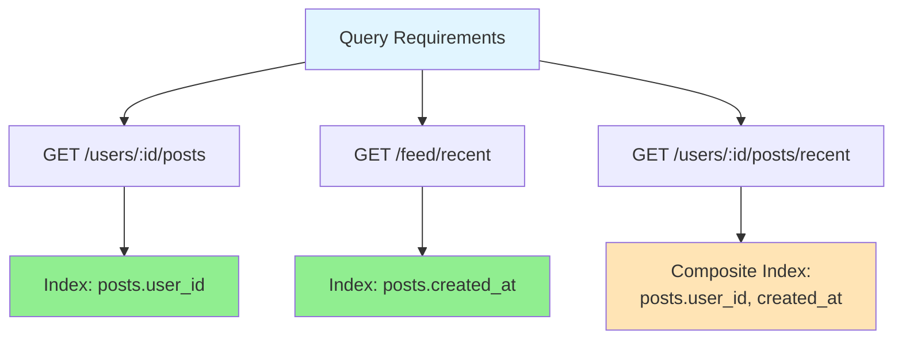
```mermaid
graph TB
    Q[Query Requirements]
    
    Q --> Q1[GET /users/:id/posts]
    Q --> Q2[GET /feed/recent]
    Q --> Q3[GET /users/:id/posts/recent]
    
    Q1 --> I1[Index: posts.user_id]
    Q2 --> I2[Index: posts.created_at]
    Q3 --> I3[Composite Index:<br/>posts.user_id, created_at]
    
    style Q fill:#e1f5ff
    style I1 fill:#90EE90
    style I2 fill:#90EE90
    style I3 fill:#FFE4B5
```

#### How Indexes Work

Think of indexes like a book's index:
- Without index: Read every page to find "normalization"
- With index: Jump directly to page 149

#### Index Strategy

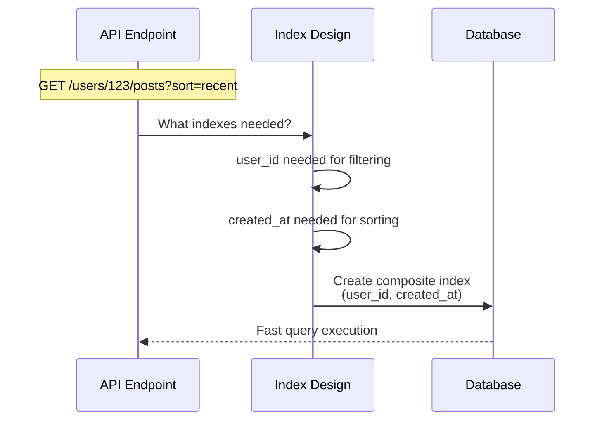
```mermaid
sequenceDiagram
    participant API as API Endpoint
    participant IDX as Index Design
    participant DB as Database
    
    Note over API: GET /users/123/posts?sort=recent
    API->>IDX: What indexes needed?
    IDX->>IDX: user_id needed for filtering
    IDX->>IDX: created_at needed for sorting
    IDX->>DB: Create composite index<br/>(user_id, created_at)
    DB-->>API: Fast query execution
```

**Example Indexes**:

| Query | Index |
|-------|-------|
| All posts by user | `posts.user_id` |
| Recent posts chronologically | `posts.created_at` |
| User's recent posts | `(user_id, created_at)` composite |

> **💡 Interview Tip**: Connect indexes directly to API endpoints:
> 
> *"The GET /users/{id}/posts endpoint needs an index on posts.user_id"*

---

### Step 4: Normalization vs Denormalization

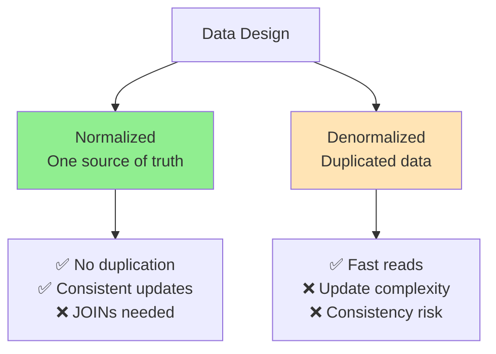
```mermaid
graph TB
    START[Data Design]
    
    START --> NORM[Normalized<br/>One source of truth]
    START --> DENORM[Denormalized<br/>Duplicated data]
    
    NORM --> NORMP[✅ No duplication<br/>✅ Consistent updates<br/>❌ JOINs needed]
    DENORM --> DENORMP[✅ Fast reads<br/>❌ Update complexity<br/>❌ Consistency risk]
    
    style NORM fill:#90EE90
    style DENORM fill:#FFE4B5
```

#### Normalized Schema

Each piece of information stored **exactly once**:

**Users Table**:
| id | username | email |
|----|----------|-------|
| 1 | john_doe | john@example.com |
| 2 | jane_doe | jane@example.com |

**Posts Table**:
| id | user_id | content | created_at |
|----|---------|---------|------------|
| 1 | 1 | Hello, world! | 2024-01-01 10:00:00 |
| 2 | 1 | My first post | 2024-01-01 10:05:00 |

✅ **Pros**: Update username once, consistent everywhere
❌ **Cons**: Need JOIN to get username with post

#### Denormalized Schema

**Posts Table** (with duplicated user data):
| id | user_id | username | email | content | created_at |
|----|---------|----------|-------|---------|------------|
| 1 | 1 | john_doe | john@example.com | Hello, world! | 2024-01-01 10:00:00 |
| 2 | 1 | john_doe | john@example.com | My first post | 2024-01-01 10:05:00 |

✅ **Pros**: No JOIN needed for display
❌ **Cons**: Must update ALL posts if username changes

#### Decision Framework

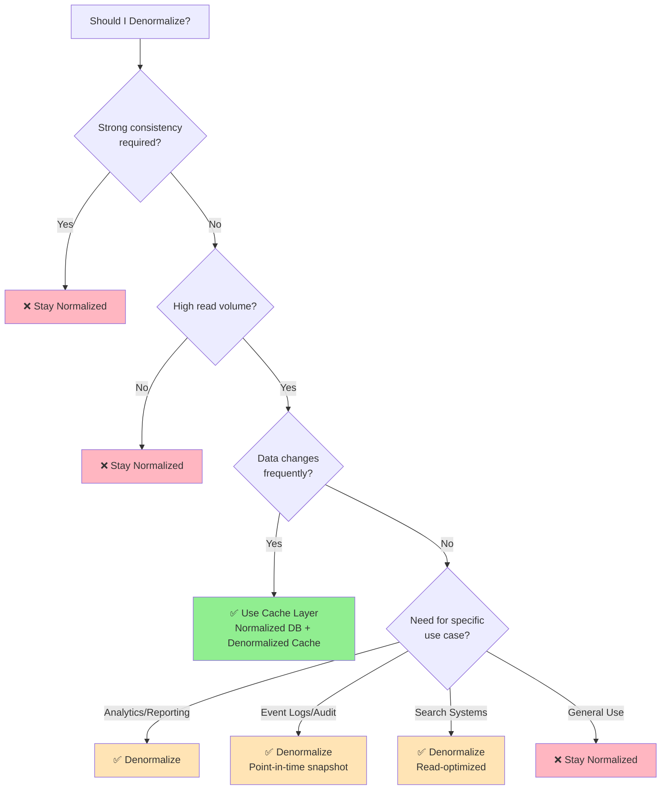
```mermaid
flowchart TB
    START[Should I Denormalize?]
    
    START --> Q1{Strong consistency<br/>required?}
    Q1 -->|Yes| NORM1[❌ Stay Normalized]
    Q1 -->|No| Q2{High read volume?}
    
    Q2 -->|No| NORM2[❌ Stay Normalized]
    Q2 -->|Yes| Q3{Data changes<br/>frequently?}
    
    Q3 -->|Yes| CACHE[✅ Use Cache Layer<br/>Normalized DB + Denormalized Cache]
    Q3 -->|No| Q4{Need for specific<br/>use case?}
    
    Q4 -->|Analytics/Reporting| DENORM1[✅ Denormalize]
    Q4 -->|Event Logs/Audit| DENORM2[✅ Denormalize<br/>Point-in-time snapshot]
    Q4 -->|Search Systems| DENORM3[✅ Denormalize<br/>Read-optimized]
    Q4 -->|General Use| NORM3[❌ Stay Normalized]
    
    style NORM1 fill:#FFB6C1
    style NORM2 fill:#FFB6C1
    style NORM3 fill:#FFB6C1
    style CACHE fill:#90EE90
    style DENORM1 fill:#FFE4B5
    style DENORM2 fill:#FFE4B5
    style DENORM3 fill:#FFE4B5
```

#### Interview Strategy

✅ **Default**: Start with normalized model
⚠️ **Denormalize only when**:
- Analytics/reporting (infrequent data changes)
- Event logs/audit trails (point-in-time snapshots)
- Read-optimized systems like search (consistency less critical)

> **💡 Best Practice**: Keep source of truth normalized, use cache layer for denormalized fast reads.

---

### Step 5: Scaling and Sharding

When data exceeds single database capacity:

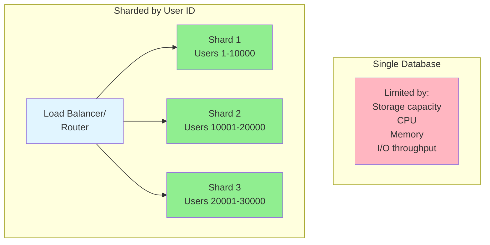
```mermaid
graph TB
    subgraph "Single Database"
        SD[Limited by:<br/>Storage capacity<br/>CPU<br/>Memory<br/>I/O throughput]
    end
    
    subgraph "Sharded by User ID"
        LB[Load Balancer/<br/>Router]
        S1[Shard 1<br/>Users 1-10000]
        S2[Shard 2<br/>Users 10001-20000]
        S3[Shard 3<br/>Users 20001-30000]
        
        LB --> S1
        LB --> S2
        LB --> S3
    end
    
    style SD fill:#FFB6C1
    style LB fill:#e1f5ff
    style S1 fill:#90EE90
    style S2 fill:#90EE90
    style S3 fill:#90EE90
```

#### Shard Key Selection

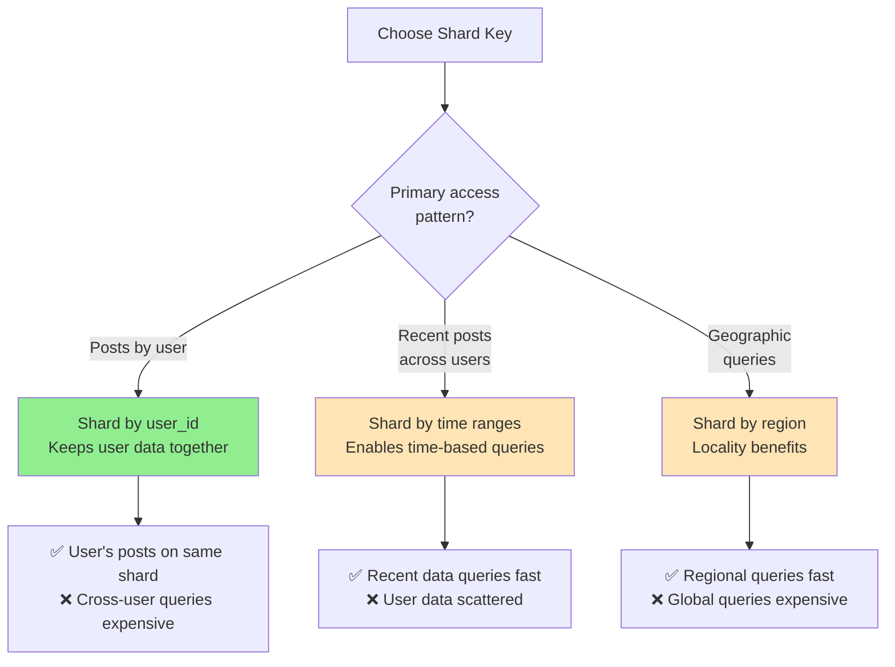
```mermaid
flowchart TB
    START[Choose Shard Key]
    
    START --> Q1{Primary access<br/>pattern?}
    
    Q1 -->|Posts by user| USER[Shard by user_id<br/>Keeps user data together]
    Q1 -->|Recent posts<br/>across users| TIME[Shard by time ranges<br/>Enables time-based queries]
    Q1 -->|Geographic<br/>queries| GEO[Shard by region<br/>Locality benefits]
    
    USER --> USERP[✅ User's posts on same shard<br/>❌ Cross-user queries expensive]
    TIME --> TIMEP[✅ Recent data queries fast<br/>❌ User data scattered]
    GEO --> GEOP[✅ Regional queries fast<br/>❌ Global queries expensive]
    
    style USER fill:#90EE90
    style TIME fill:#FFE4B5
    style GEO fill:#FFE4B5
```

#### Cross-Shard Query Problem

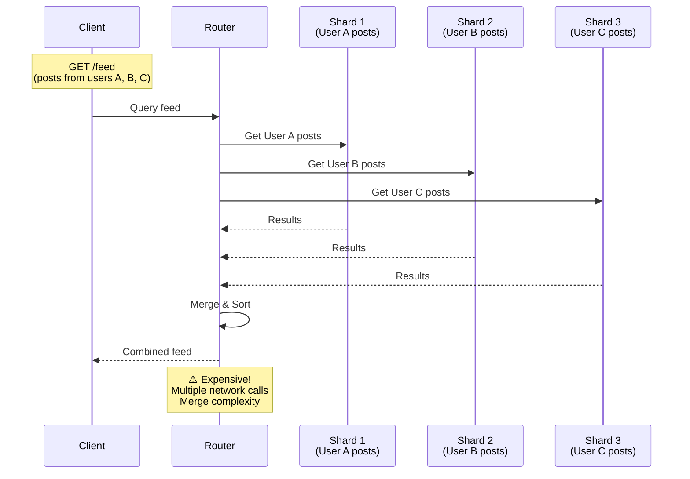
```mermaid
sequenceDiagram
    participant Client
    participant Router
    participant S1 as Shard 1<br/>(User A posts)
    participant S2 as Shard 2<br/>(User B posts)
    participant S3 as Shard 3<br/>(User C posts)
    
    Note over Client: GET /feed<br/>(posts from users A, B, C)
    
    Client->>Router: Query feed
    Router->>S1: Get User A posts
    Router->>S2: Get User B posts
    Router->>S3: Get User C posts
    S1-->>Router: Results
    S2-->>Router: Results
    S3-->>Router: Results
    Router->>Router: Merge & Sort
    Router-->>Client: Combined feed
    
    Note over Router: ⚠️ Expensive!<br/>Multiple network calls<br/>Merge complexity
```

#### Best Practices

✅ **Do**:
- Shard by primary access pattern
- Keep related data together
- Choose permanent shard key carefully

❌ **Avoid**:
- Cross-shard queries when possible
- Frequent re-sharding (expensive)
- Shard keys causing hotspots

> **⚠️ Warning**: Shard key choice is often permanent and affects every query.

---

## ✅ Best Practices

### Interview Checklist

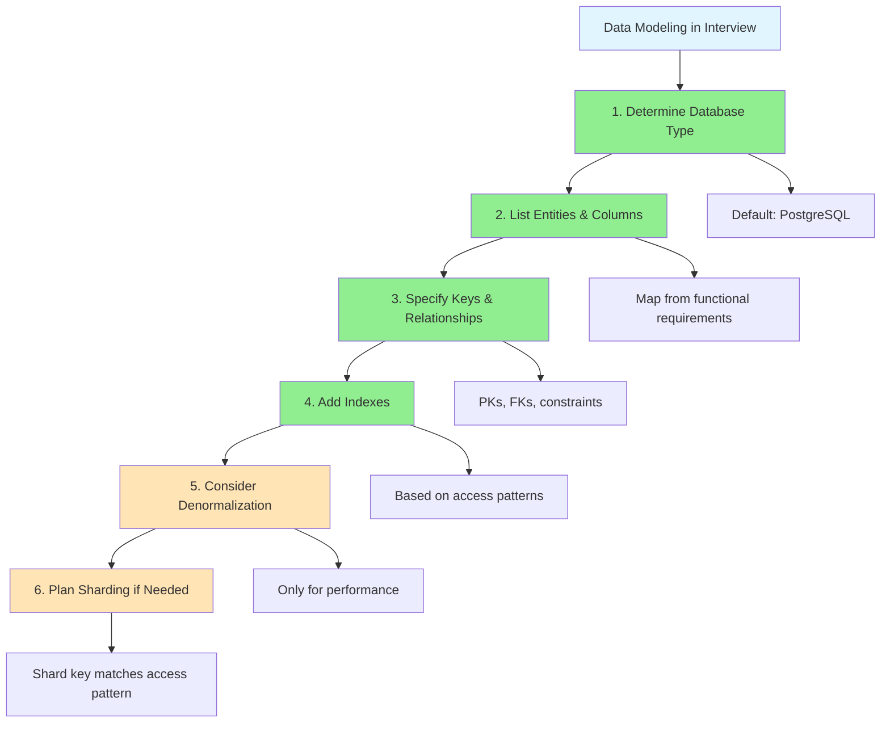
```mermaid
flowchart TB
    START[Data Modeling in Interview]
    
    START --> S1[1. Determine Database Type]
    S1 --> S2[2. List Entities & Columns]
    S2 --> S3[3. Specify Keys & Relationships]
    S3 --> S4[4. Add Indexes]
    S4 --> S5[5. Consider Denormalization]
    S5 --> S6[6. Plan Sharding if Needed]
    
    S1 --> S1A[Default: PostgreSQL]
    S2 --> S2A[Map from functional requirements]
    S3 --> S3A[PKs, FKs, constraints]
    S4 --> S4A[Based on access patterns]
    S5 --> S5A[Only for performance]
    S6 --> S6A[Shard key matches access pattern]
    
    style START fill:#e1f5ff
    style S1 fill:#90EE90
    style S2 fill:#90EE90
    style S3 fill:#90EE90
    style S4 fill:#90EE90
    style S5 fill:#FFE4B5
    style S6 fill:#FFE4B5
```

### Final Whiteboard Example

```mermaid
erDiagram
    USERS ||--o{ POSTS : creates
    USERS ||--o{ FOLLOWS : follower
    USERS ||--o{ FOLLOWS : followed
    POSTS ||--o{ LIKES : receives
    USERS ||--o{ LIKES : gives
    
    USERS {
        int id PK
        string username "INDEX"
        string email "UNIQUE"
        timestamp created_at
        string bio
    }
    
    POSTS {
        int id PK
        int user_id FK "INDEX"
        text content
        timestamp created_at "INDEX"
        int like_count "Denormalized"
    }
    
    FOLLOWS {
        int follower_id FK "Composite INDEX"
        int followed_id FK "Composite INDEX"
        timestamp created_at
    }
    
    LIKES {
        int user_id FK
        int post_id FK
        timestamp created_at
    }
```

**Notes on Schema**:
- **Database**: PostgreSQL
- **Indexes**:
  - `users.username` for lookups
  - `posts(user_id, created_at)` composite for user's recent posts
  - `follows(follower_id)` for finding who user follows
  - `follows(followed_id)` for finding followers
- **Denormalization**: `like_count` in posts table (eventual consistency OK)
- **Sharding**: Shard by `user_id` (keeps user's content together)

### Common Mistakes to Avoid

```mermaid
graph TB
    MISTAKES[Common Mistakes]
    
    MISTAKES --> M1[❌ Choosing Exotic DBs]
    MISTAKES --> M2[❌ Over-Normalization]
    MISTAKES --> M3[❌ Under-Normalization]
    MISTAKES --> M4[❌ Ignoring Indexes]
    MISTAKES --> M5[❌ Wrong Shard Key]
    MISTAKES --> M6[❌ Graph Databases]
    
    M1 --> M1A[Stick to PostgreSQL]
    M2 --> M2A[Denormalize for performance]
    M3 --> M3A[Start normalized first]
    M4 --> M4A[Tie to API endpoints]
    M5 --> M5A[Match access patterns]
    M6 --> M6A[Even Facebook uses MySQL]
    
    style M1 fill:#FFB6C1
    style M2 fill:#FFB6C1
    style M3 fill:#FFB6C1
    style M4 fill:#FFB6C1
    style M5 fill:#FFB6C1
    style M6 fill:#FFB6C1
```

---

## 🎯 Conclusion

### Key Takeaways

```mermaid
mindmap
    root((Data Modeling))
        Database Choice
            Default to SQL
            PostgreSQL recommended
            Avoid exotic types
        Schema Design
            Start with requirements
            Define entities clearly
            Use system-generated keys
        Performance
            Index access patterns
            Start normalized
            Cache for speed
        Scaling
            Shard by access pattern
            Avoid cross-shard queries
            Choose permanent shard key
```

### Interview Strategy

**Goal**: Show you can design a reasonable schema that supports requirements, then move on.

**Steps**:
1. ✅ Outline core entities early
2. ✅ Choose database type (default: PostgreSQL)
3. ✅ List columns fulfilling functional requirements
4. ✅ Specify primary and foreign keys
5. ✅ Determine indexes based on access patterns
6. ✅ Consider denormalization only for performance
7. ✅ Plan sharding if needed with appropriate shard key

**Time Allocation**:
- Core entities: 2 minutes (during requirements)
- Schema design: Part of 10-minute high-level design
- Don't spend too long - it's not the focus!

### Remember

> **💡 Data modeling is NOT the focus of system design interviews, but it IS a core part. Design something clear and functional that supports your requirements, tie decisions back to requirements, then move forward confidently.**

---

## 📚 Related Concepts

- [Sharding](./Sharding.md) - Horizontal partitioning strategies
- [Database Indexing](./DatabaseIndexing.md) - Index types and strategies
- [Caching](./Caching.md) - Cache layers for denormalized reads
- [PostgreSQL Deep Dive](./PostgreSQL.md) - SQL database internals
- [Redis Deep Dive](./Redis.md) - Key-value store patterns

---

**Last Updated**: December 2024
**Source**: [HelloInterview - Data Modeling](https://www.hellointerview.com/learn/system-design/core-concepts/data-modeling)
