# 🔒 Distributed Locking

> **Core Concept**: Distributed locks prevent multiple processes or servers from simultaneously executing a critical section — like processing the same order, scheduling the same job, or updating the same resource. Getting locking wrong causes data corruption, double-charges, and silent bugs that are hard to reproduce.

## 📋 Table of Contents
- [Why Distributed Locking?](#why-distributed-locking)
- [Redis-Based Locking](#redis-based-locking)
- [Redlock Algorithm](#redlock-algorithm)
- [Fencing Tokens](#fencing-tokens)
- [ZooKeeper and etcd](#zookeeper-and-etcd)
- [Lock Patterns in Production](#lock-patterns-in-production)
- [Common Pitfalls](#common-pitfalls)
- [Interview Strategy](#interview-strategy)

---

## 🎯 Why Distributed Locking?

### The Problem

In a single-process system, a mutex solves concurrency. In a distributed system, you have multiple processes on multiple machines:

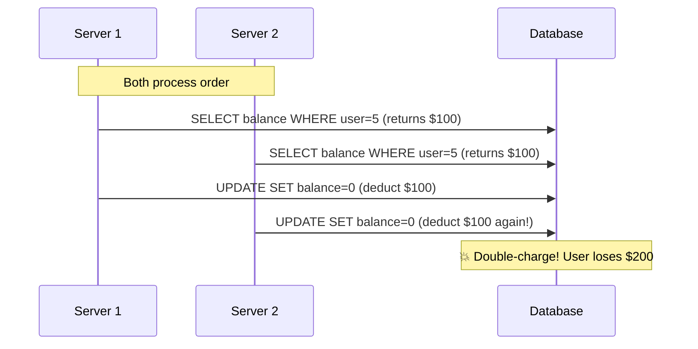

A local mutex on Server 1 does nothing to stop Server 2. You need coordination that spans machines.

### When You Need Distributed Locking

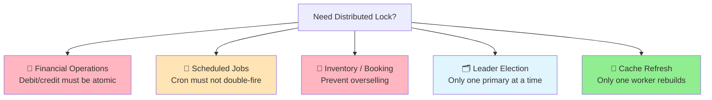

**Real examples**:
- Stripe prevents duplicate charge requests using idempotency keys backed by distributed locks
- Airbnb uses distributed locks to prevent double-booking a listing for the same night
- AWS Lambda uses distributed locks for exactly-once cron triggers

---

## 🧒 Layman's Explanation

Imagine three everyday scenes — each captures a different facet of distributed locking.

**The single-stall airplane bathroom.** There's exactly one toilet, and the "occupied" sign is the lock. When you slide the bolt, the sign flips red and nobody else can walk in. If you forget to lock the door, two passengers might barge in at the same time — that's a race condition. The auto-lock with a timer on the door is the lock's TTL: a safety net so a fainted passenger doesn't strand the rest of the cabin forever.

**The conch shell from Lord of the Flies.** The rule is simple: only the boy holding the conch may speak. Pass it around to take turns. But what if the holder dies in the jungle still clutching the conch? The tribe needs a fallback rule — "if no one speaks for 60 seconds, the conch is up for grabs again." That's a TTL. And what if, after a thunderstorm splits the camp in two, two boys both swear they hold the conch? You hand out **numbered conches** and only honor commands from the highest number anyone has seen. That's a fencing token.

**The single ticketing window at a busy box office.** Customers form one line; the cashier serves one person at a time. Two fans cannot pay for seat 12B simultaneously because the cashier (the lock) only talks to one of them. Without that single window, you'd double-book the seat.

### Dangerous failure modes, in plain language

- **Holder crashes without releasing.** Someone died holding the conch. Without a TTL, the tribe sits in silence forever. This is why every distributed lock must auto-expire.
- **Two clients both think they hold the lock.** A network partition means two boys each believe they have the conch. Numbered conches (fencing tokens) save you: the storage layer only listens to the highest number it has ever seen and rejects stale ones.
- **Slow process holds the lock past its TTL.** You fell asleep in the bathroom past closing. The flight attendant unlocked the door for the next passenger — and now there are two of you inside. Your "I still have the lock" belief is a lie. Heartbeats (renewing the TTL) and fencing tokens are the defenses.

### When the analogy breaks down

Real distributed locks across machines are dramatically harder than an airplane bathroom. The network can lie (a "yes" reply may never arrive, or arrive late), clocks on different servers drift apart, and a process can pause for seconds during garbage collection or VM migration — long enough to lose its lock without realizing. There is no single hallway you can walk down to check who's inside. That's why the core distributed-systems lesson is **use locks sparingly**: prefer idempotency keys, optimistic concurrency, or single-writer designs whenever you can. A lock is a promise the network may quietly break.

---

## 🔴 Redis-Based Locking

### The Basic Pattern (SETNX)

The simplest distributed lock uses Redis's atomic `SET NX PX` command:

```python
# Acquire lock
result = redis.set(
    f"lock:{resource_id}",
    unique_token,          # random UUID so only holder can release
    nx=True,               # Only set if NOT exists
    px=30000               # Expire after 30 seconds (safety net)
)

if not result:
    raise LockNotAcquired("Resource is locked")

try:
    # Critical section
    process_order(resource_id)
finally:
    # Release lock — only if WE hold it (check token!)
    release_lock(redis, f"lock:{resource_id}", unique_token)
```

**Why `NX` (Not Exists)?** Without it, two servers can both set the key and both think they have the lock.

**Why random token?** Prevent accidental release by a different holder.

**Why `PX` expiry?** If the process crashes, the lock auto-expires. Without this, a crash = deadlock.

### Safe Release with Lua Script

Releasing requires atomicity: check token + delete must be one operation:

```lua
-- Release lock atomically
if redis.call("get", KEYS[1]) == ARGV[1] then
    return redis.call("del", KEYS[1])
else
    return 0
end
```

```python
RELEASE_SCRIPT = """
if redis.call("get", KEYS[1]) == ARGV[1] then
    return redis.call("del", KEYS[1])
else
    return 0
end
"""

def release_lock(redis, key, token):
    return redis.eval(RELEASE_SCRIPT, 1, key, token)
```

Without the Lua script, a race condition exists between GET and DEL.

### Lock Expiry Problem

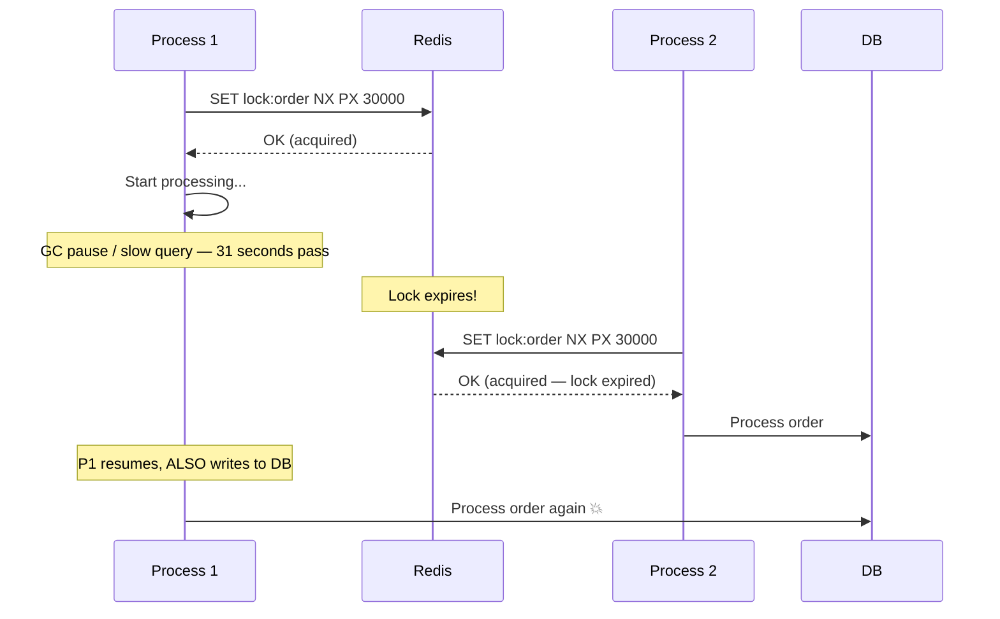

**The core problem**: If your critical section takes longer than the lock TTL, you lose the lock while still holding it in your mind.

**Solutions**:
1. **Lock renewal (heartbeat)**: Extend TTL while still working
2. **Fencing tokens**: Make downstream systems reject stale operations (covered below)

### Lock Renewal (Heartbeat)

```python
import threading

class RedisLock:
    def __init__(self, redis, key, ttl=30):
        self.redis = redis
        self.key = key
        self.ttl = ttl
        self.token = str(uuid.uuid4())
        self._stop_renewal = threading.Event()

    def acquire(self):
        result = self.redis.set(self.key, self.token, nx=True, ex=self.ttl)
        if result:
            self._start_renewal()
        return bool(result)

    def _start_renewal(self):
        def renew():
            while not self._stop_renewal.wait(self.ttl * 0.5):
                if self.redis.get(self.key) == self.token:
                    self.redis.expire(self.key, self.ttl)
                else:
                    break  # Lock stolen or expired
        threading.Thread(target=renew, daemon=True).start()

    def release(self):
        self._stop_renewal.set()
        release_lock(self.redis, self.key, self.token)
```

**Production use**: Redisson (Java), Redsync (Go), python-redis-lock all implement lock renewal.

---

## 🔐 Redlock Algorithm

### The Problem with Single Redis

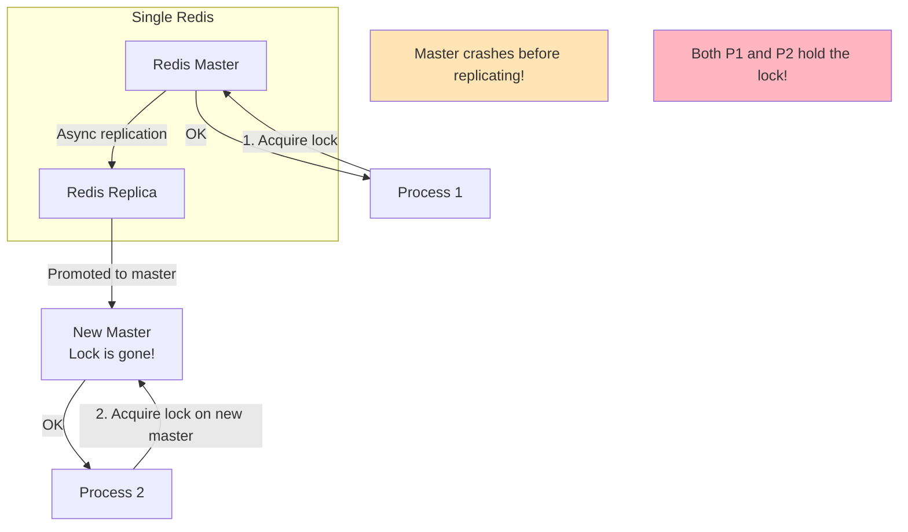

If Redis fails between acquiring the lock and replicating it, two processes can simultaneously hold the lock.

### Redlock: Multi-Instance Solution

Use **5 independent Redis instances** (no replication between them):

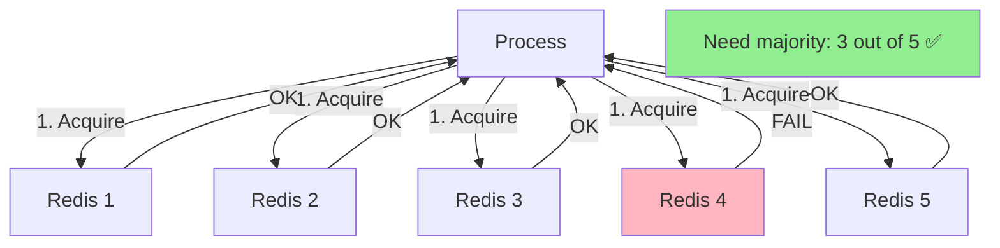

**Algorithm**:
1. Get current time in milliseconds
2. Try to acquire lock on all N instances with short timeout
3. Consider lock acquired if you got **majority** (N/2 + 1) within the validity time
4. Validity time = initial TTL − time taken to acquire − clock drift safety margin
5. If failed, release all locks acquired

```python
def acquire_redlock(redis_instances, key, ttl_ms):
    token = str(uuid.uuid4())
    acquired_count = 0
    start_time = time_ms()

    for redis in redis_instances:
        try:
            result = redis.set(key, token, nx=True, px=ttl_ms,
                               socket_timeout=ttl_ms//(5*1000))
            if result:
                acquired_count += 1
        except Exception:
            pass  # Timeout or connection failure

    elapsed = time_ms() - start_time
    validity_time = ttl_ms - elapsed - CLOCK_DRIFT_FACTOR

    if acquired_count >= (len(redis_instances) // 2 + 1) and validity_time > 0:
        return token, validity_time
    else:
        # Release all acquired locks
        for redis in redis_instances:
            release_lock(redis, key, token)
        raise LockNotAcquired()
```

### When to Use Redlock

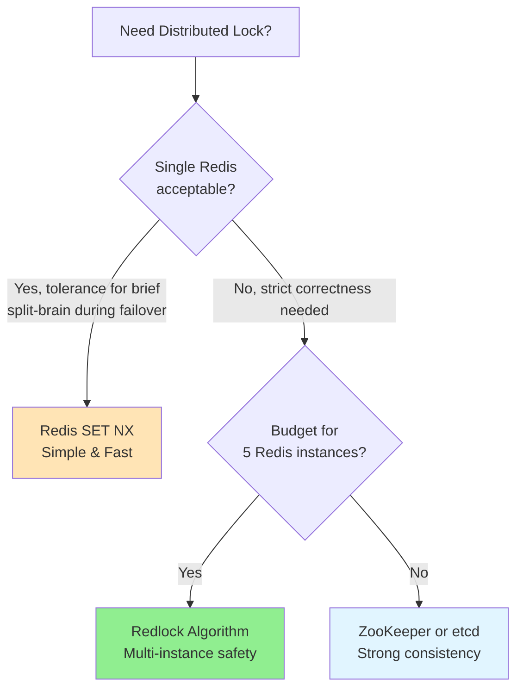

> **Note**: Martin Kleppmann's critique of Redlock (2016) argues even Redlock isn't safe against process pauses combined with clock skew. For true safety, use **fencing tokens**.

---

## 🛡️ Fencing Tokens

### The Safest Pattern

Even if you lose a lock due to a pause, fencing tokens prevent stale operations from succeeding:

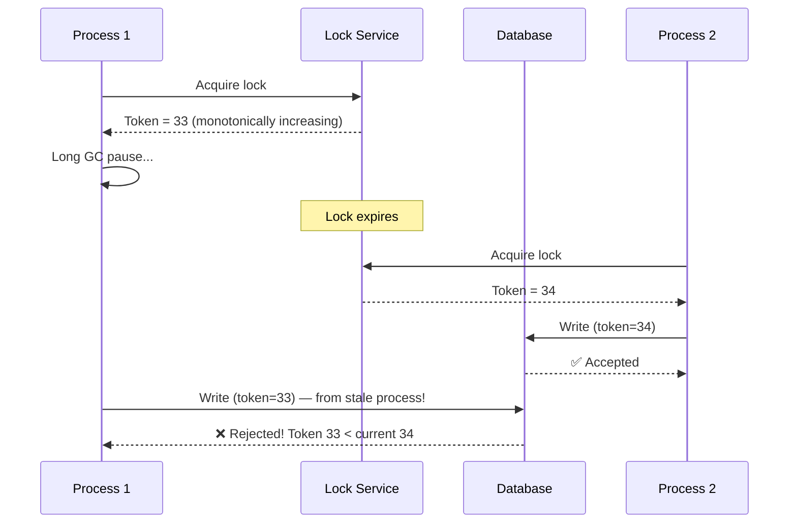

**Implementation**: The database/storage layer tracks the highest seen token and rejects anything lower.

```python
# ZooKeeper ephemeral sequential node gives monotonic token
import kazoo

def acquire_lock_with_fence(zk, lock_path):
    # ZooKeeper creates a sequential ephemeral node
    # The sequence number IS the fencing token
    node = zk.create(f"{lock_path}/lock-", ephemeral=True, sequence=True)
    token = int(node.rsplit("-", 1)[-1])  # e.g., /locks/order/lock-0000000034 → 34
    return node, token

# Storage layer check
def write_with_fence(storage, data, token):
    current_max = storage.get_max_token()
    if token <= current_max:
        raise StaleTokenError(f"Token {token} rejected, current is {current_max}")
    storage.write(data, token)
```

**Who uses fencing tokens**: Amazon DynamoDB conditional writes (condition expressions act as implicit fencing), optimistic locking with version numbers in SQL, Kafka producer epochs for exactly-once semantics.

---

## 🦁 ZooKeeper and etcd

### When to Use Strong Consensus

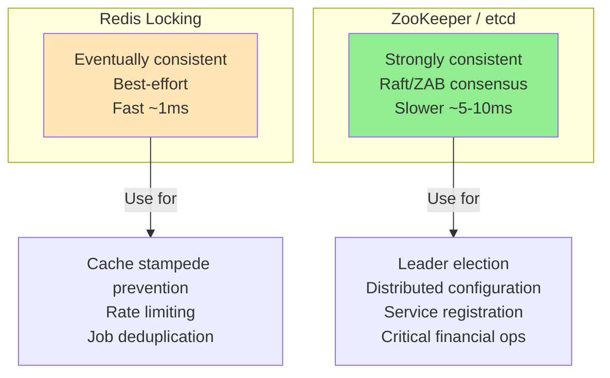

### ZooKeeper Locking Pattern

```python
from kazoo.client import KazooClient
from kazoo.recipe.lock import Lock

zk = KazooClient(hosts='zk1:2181,zk2:2181,zk3:2181')
zk.start()

with Lock(zk, "/locks/order-1234"):
    # Critical section — ZooKeeper guarantees only one holder
    process_order("1234")
```

**ZooKeeper ephemeral nodes**: Automatically deleted when session expires → lock auto-released on crash.

### etcd Distributed Lock

```python
import etcd3

etcd = etcd3.client()

# etcd uses leases with TTL
lease = etcd.lease(30)  # 30 second TTL

success, _ = etcd.transaction(
    compare=[etcd.transactions.create('/locks/order-1234') == '0'],
    success=[etcd.transactions.put('/locks/order-1234', 'holder', lease=lease)],
    failure=[]
)

if success:
    # Renew lease periodically
    lease.refresh()
    try:
        process_order("1234")
    finally:
        etcd.delete('/locks/order-1234')
        lease.revoke()
```

**Used in production**: Kubernetes uses etcd for leader election of controller managers. Consul uses Raft for lock primitives.

---

## 🏭 Lock Patterns in Production

### 1. Idempotency Keys

Rather than locking around a resource, use idempotency keys to make operations safe to retry:

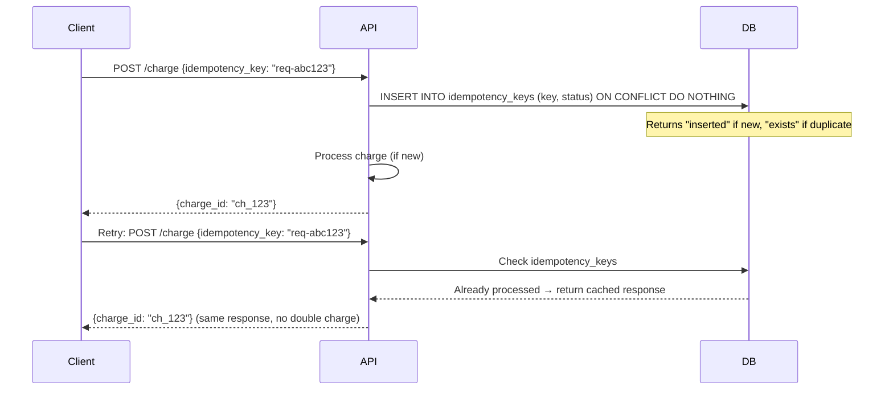

**Stripe's approach**: They store idempotency keys in PostgreSQL with the response. On retry, return the stored response without re-executing.

### 2. Optimistic Locking (No Actual Lock!)

For most cases, optimistic locking avoids the distributed lock entirely:

```sql
-- Read current version
SELECT id, balance, version FROM accounts WHERE id = 5;
-- Returns: {id: 5, balance: 100, version: 7}

-- Update only if version matches
UPDATE accounts
SET balance = balance - 50, version = version + 1
WHERE id = 5 AND version = 7;

-- If 0 rows affected: conflict! Retry.
```

**Use when**: Conflicts are rare (read-heavy data). Lock contention would be costly.  
**Avoid when**: High contention — many retries degrade performance.

### 3. Database-Level Advisory Locks

PostgreSQL has built-in advisory locks — no Redis needed:

```sql
-- Session-level lock (released when session ends)
SELECT pg_advisory_lock(12345);
-- ... critical section ...
SELECT pg_advisory_unlock(12345);

-- Transaction-level (auto-released on commit/rollback)
SELECT pg_advisory_xact_lock(12345);
-- ... critical section within transaction ...
```

**Use when**: You're already in PostgreSQL and want strong consistency without Redis.

**Limitations**: Only one PostgreSQL instance, doesn't work across multiple DB servers.

### 4. Leader Election

Distributed locks are the core of leader election — ensuring only one service instance is "primary":

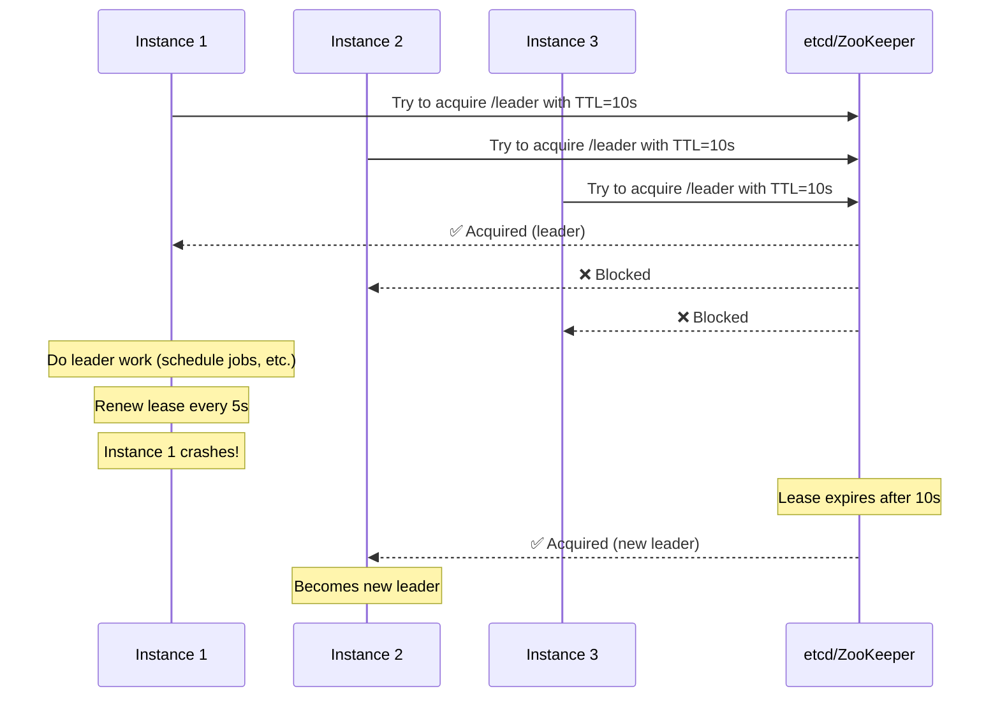

**Real examples**:
- Kafka brokers use ZooKeeper for controller election
- Kubernetes scheduler and controller-manager use leader election via etcd
- Celery beat uses Redis locks to ensure only one beat scheduler runs

---

## ⚠️ Common Pitfalls

### 1. Forgetting the Expiry

```python
# ❌ WRONG: If process crashes, lock never released
redis.setnx("lock:order", "holder")

# ✅ CORRECT: Always set TTL atomically
redis.set("lock:order", "holder", nx=True, px=30000)
```

### 2. Releasing Someone Else's Lock

```python
# ❌ WRONG: No ownership check
redis.delete("lock:order")

# ✅ CORRECT: Only release if YOU own it
if redis.get("lock:order") == my_token:   # NOT atomic!
    redis.delete("lock:order")

# ✅ BEST: Atomic check + delete via Lua
redis.eval(RELEASE_SCRIPT, 1, "lock:order", my_token)
```

### 3. Setting TTL Too Short

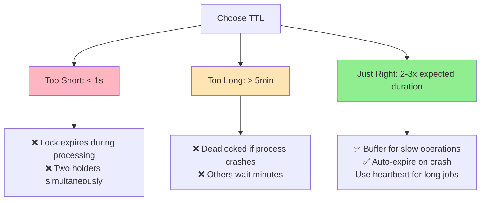

### 4. Not Handling Lock Acquisition Failure

```python
# ❌ WRONG: Silently fails
redis.set("lock:order", token, nx=True, px=30000)
process_order()  # Always runs, lock or not!

# ✅ CORRECT: Check result
result = redis.set("lock:order", token, nx=True, px=30000)
if not result:
    raise RetryLater("Order is being processed")
process_order()
```

### 5. Lock Granularity

```python
# ❌ Too coarse: All orders serialized
lock_key = "lock:all_orders"

# ❌ Too fine: Lock per row might miss conflicts
lock_key = f"lock:order:{order_id}"

# ✅ Right granularity: Lock per user's orders
lock_key = f"lock:user:{user_id}:orders"
```

---

## 🎤 Interview Strategy

### Decision Framework

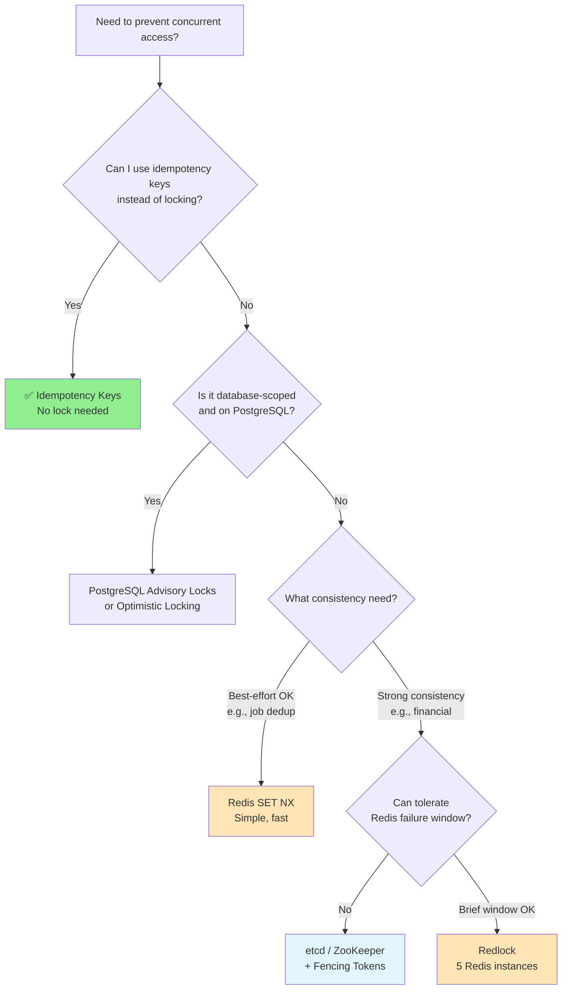

### Interview Script

**When asked "How do you prevent double-processing?"**:

> "I'd start by asking if idempotency keys can solve the problem — they're simpler than locks. If we need a lock, I'd use Redis SET NX with a unique token and TTL. The critical parts: the token ensures only the holder can release it, the TTL is a safety net for crashes, and I'd use a Lua script to atomically check-and-delete. For financial operations, I'd use fencing tokens: the lock service issues a monotonically increasing token, and the database rejects writes with stale tokens."

### Numbers to Know

| Approach | Latency | Consistency | Use Case |
|----------|---------|-------------|----------|
| **Redis SET NX** | ~1ms | Weak (single node) | Job dedup, rate limiting |
| **Redlock** | ~5ms | Stronger | Most distributed locks |
| **ZooKeeper** | ~5-10ms | Strong (ZAB) | Leader election |
| **etcd** | ~5-10ms | Strong (Raft) | K8s, config |
| **PostgreSQL Advisory** | ~2ms | Strong (ACID) | DB-scoped locks |

---

## 🎓 Key Takeaways

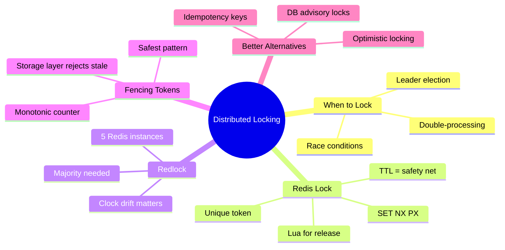

### Production Checklist

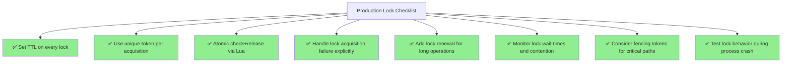

### Real-World Implementations

| Company | Use Case | Technology |
|---------|----------|------------|
| **Stripe** | Idempotency keys for payments | PostgreSQL + Redis |
| **Airbnb** | Prevent double-booking | Redis Redlock |
| **GitHub** | Background job deduplication | Redis SET NX |
| **Kubernetes** | Controller leader election | etcd leases |
| **Kafka** | Broker controller election | ZooKeeper (migrating to KRaft) |
| **AWS Lambda** | Exactly-once cron triggers | DynamoDB conditional writes |

---

## 📚 Related Concepts

- [Caching](./Caching.md) - Redis patterns beyond locking
- [Consistent Hashing](./ConsistentHashing.md) - Distributing data across nodes
- [Sharding](./Sharding.md) - Partitioning data across databases
- [Data Modeling](./DataModelling.md) - Optimistic locking via version columns

---

**Last Updated**: April 2026
**Reference**: [Martin Kleppmann — How to do distributed locking](https://martin.kleppmann.com/2016/02/08/how-to-do-distributed-locking.html)

> **💡 Production Wisdom**: "A lock that doesn't expire is a time bomb. A lock with too short a TTL is a race condition. A lock without a fencing token is wishful thinking." — The key is layering: TTL + token + fencing.
