# Networking Essentials

> **Practical networking concepts for system design interviews**  
> *Understanding how services communicate in distributed systems*

---

## Table of Contents

1. [Introduction](#introduction)
2. [Communication Protocols](#communication-protocols)
3. [Real-time Communication](#real-time-communication)
4. [Load Balancing](#load-balancing)
5. [Geography and Latency](#geography-and-latency)
6. [Network Layers](#network-layers)
7. [Best Practices](#best-practices)

---

## Introduction

Networking is one of those topics where you can go incredibly deep, but for system design interviews you need to know the **practical bits** that come up when you're designing distributed systems.

At a basic level, you need to understand:
- How services talk to each other
- What happens when those connections fail or get slow
- Which protocol to choose for different scenarios
- How to handle real-time communication requirements

> 💡 **Interview Focus**: The most important decision you'll make is choosing your communication protocol. For most systems, you'll default to HTTP over TCP. It's well-understood, works everywhere, and handles 90% of use cases.

---

## Communication Protocols

For most systems, you'll default to **HTTP over TCP**. It's well-understood, works everywhere, and handles 90% of use cases.

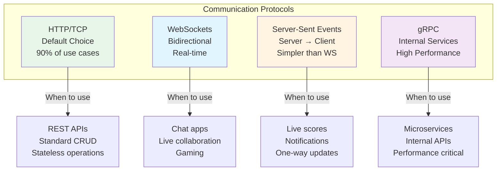

### Protocol Comparison

| Protocol | Use Case | Advantages | Disadvantages |
|----------|----------|------------|---------------|
| **HTTP/TCP** | REST APIs, CRUD operations | Well-understood, universal support, stateless | Higher latency for real-time |
| **WebSockets** | Chat, gaming, live collaboration | Bidirectional, low latency, persistent | Complex at scale, stateful |
| **SSE** | Live scores, notifications, feeds | Simpler than WebSockets, auto-reconnect | One-way only (server→client) |
| **gRPC** | Internal microservices | Binary protocol, fast, streaming support | Limited browser support |

### HTTP/TCP (Default)

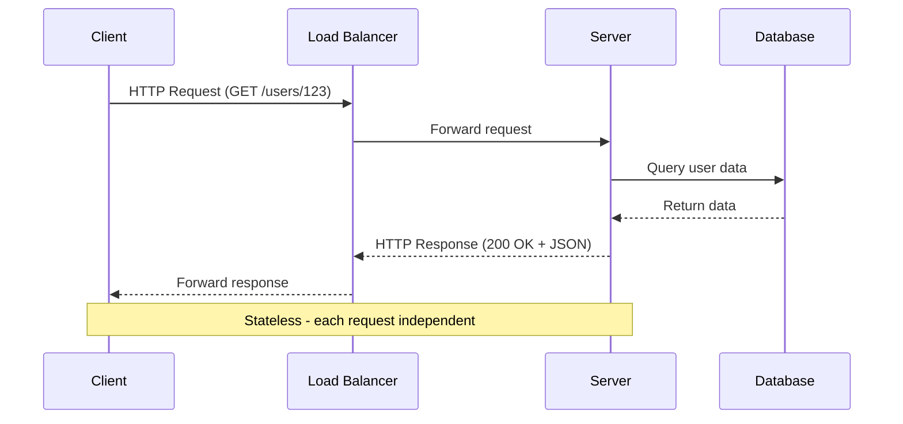

**When to use:**
- REST APIs
- Standard CRUD operations
- Stateless services
- Most web applications

**Key characteristics:**
- Request-response model
- Stateless by default
- Easy to scale horizontally
- Well-supported by all infrastructure

---

## Real-time Communication

### WebSockets vs Server-Sent Events

**WebSockets:**
- **Bidirectional** communication where both sides send messages
- Use cases: chat apps, live collaboration, gaming
- More complex to implement and scale

**Server-Sent Events (SSE):**
- **Server-to-client push only**
- Use cases: live scores, notifications, one-way updates
- Simpler than WebSockets, better with standard HTTP infrastructure

> ⚠️ **Common Mistake**: Proposing WebSockets when HTTP with long polling or Server-Sent Events would work fine. WebSockets add significant complexity for maintaining stateful connections at scale. Only reach for them when you genuinely need bidirectional real-time communication.

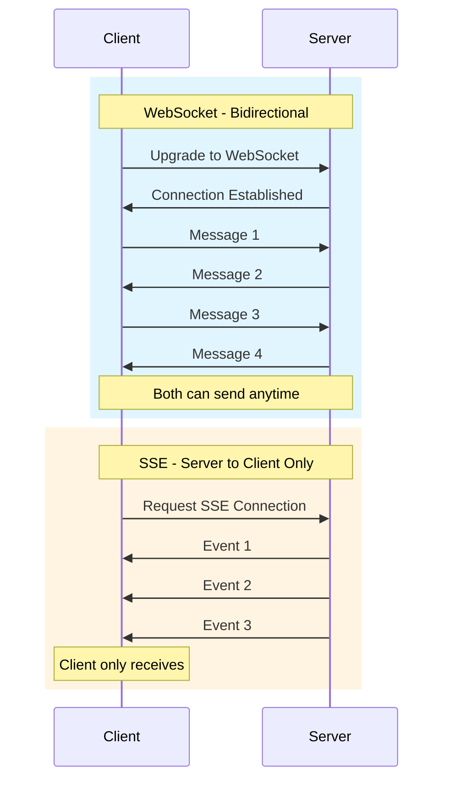

### WebSocket Connection Lifecycle

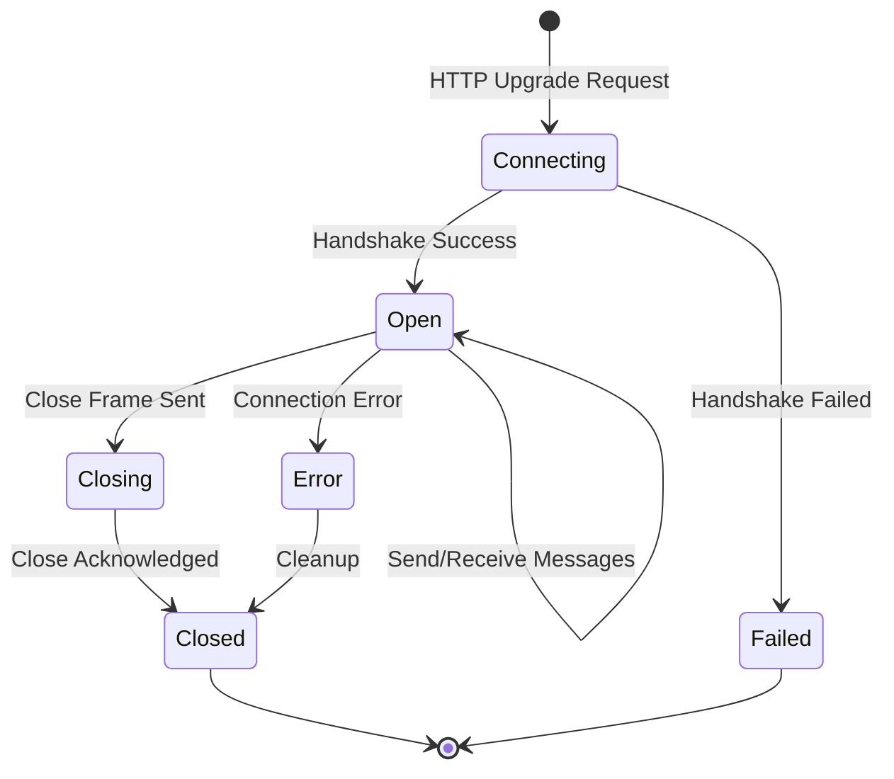

### Scaling Real-time Connections

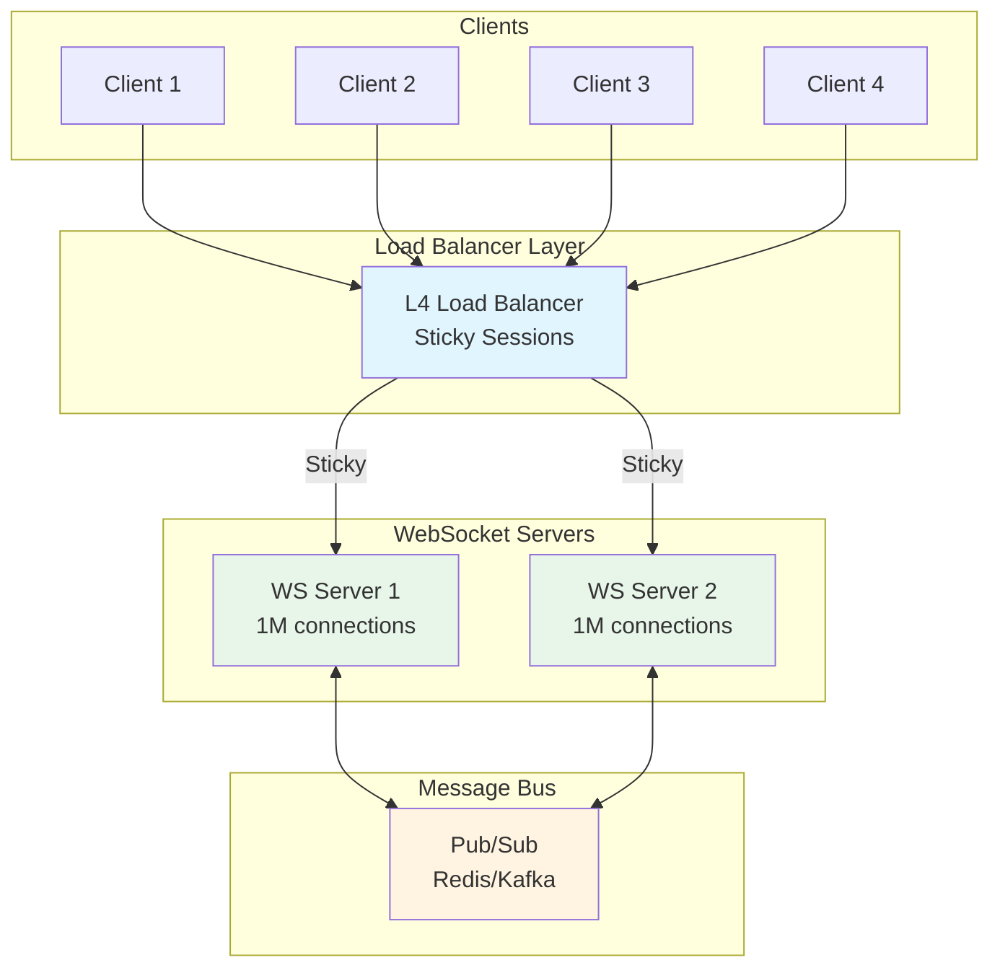

**Key Challenges with WebSockets:**
- **Stateful connections**: Can't just throw them behind a standard load balancer
- **Connection persistence**: Need sticky sessions or session affinity
- **Server failures**: What happens when a server goes down with thousands of active connections?
- **Scaling**: Limited by concurrent connections per server

---

## Load Balancing

Load balancing is another area interviewers love to probe. Understanding the difference between Layer 4 and Layer 7 load balancers is crucial.

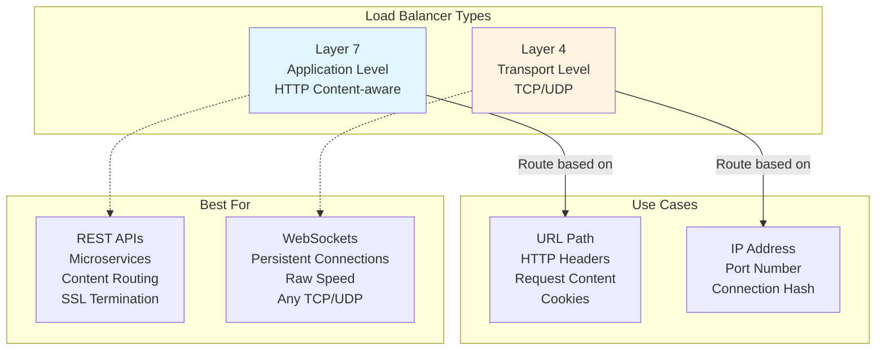

### Layer 7 (Application Load Balancer)

**Operates at:** HTTP/HTTPS level

**Routing capabilities:**
- URL path-based routing (`/api/*` → API servers, `/web/*` → Web servers)
- Header-based routing (mobile vs desktop)
- Host-based routing (different domains to different services)
- Content-based routing (analyze request body)

**Features:**
- SSL/TLS termination
- Cookie-based session affinity
- Request/response modification
- Advanced health checks

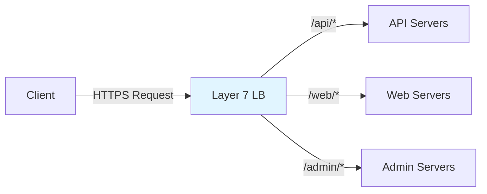

### Layer 4 (Network Load Balancer)

**Operates at:** TCP/UDP level

**Routing capabilities:**
- IP address and port
- Connection hash (source IP + port)
- Simple round-robin or least connections

**Features:**
- Extremely fast (no packet inspection)
- Lower latency
- Handles any TCP/UDP protocol
- Better for persistent connections

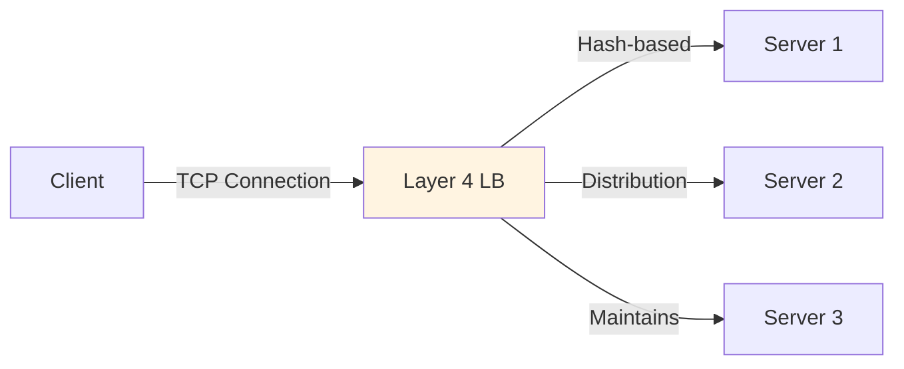

### Comparison Table

| Feature | Layer 7 | Layer 4 |
|---------|---------|---------|
| **Speed** | Slower (inspects content) | Faster (no inspection) |
| **Flexibility** | High (content-aware) | Low (connection-based) |
| **Use Case** | HTTP/HTTPS APIs | WebSockets, TCP/UDP |
| **SSL Termination** | Yes | No (pass-through) |
| **Sticky Sessions** | Cookie-based | IP-based |
| **Protocol Support** | HTTP/HTTPS only | Any TCP/UDP |

> 💡 **Interview Tip**: For WebSockets, you typically need Layer 4 balancing because you're maintaining a persistent TCP connection. For standard REST APIs, Layer 7 gives you more flexibility.

---

## Geography and Latency

Geography and latency matter more than most candidates realize. A request from New York to London has a **minimum latency of around 80ms** just from the speed of light through fiber optic cables, before you even process anything.

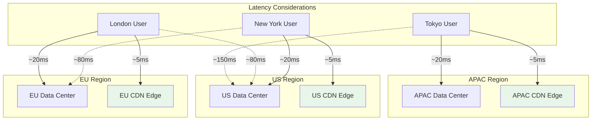

### Geographic Latency Facts

| Route | Minimum Latency | Notes |
|-------|----------------|-------|
| **Same City** | 1-5ms | LAN speeds |
| **Same Region** | 5-20ms | Within data center or nearby |
| **Cross-Country (US)** | 40-60ms | NY to SF |
| **Transatlantic** | 80-100ms | NY to London |
| **Transpacific** | 100-150ms | US to Tokyo |
| **Round the World** | 150-200ms | Physical speed of light limit |

### Solutions for Global Low Latency


### Regional Architecture Example

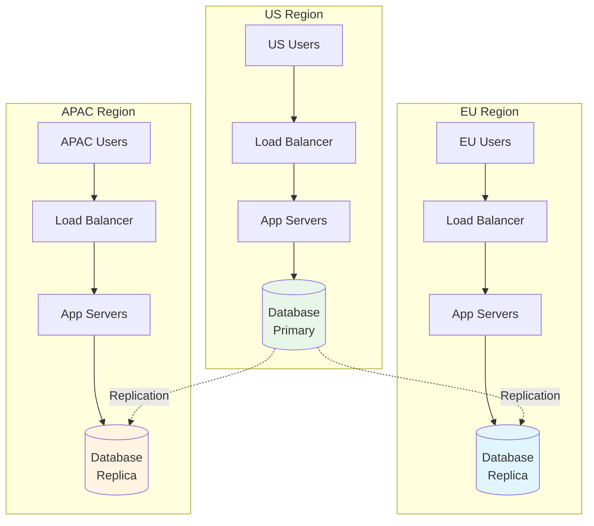

**Solution**: If your system needs low latency globally, you'll need regional deployments with data replicated or partitioned by geography. This is why CDNs exist - to serve static content from edge servers close to users.

---

## Network Layers

Understanding the OSI and TCP/IP models helps contextualize where different technologies operate.

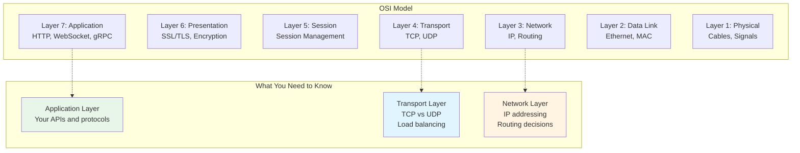

### TCP vs UDP

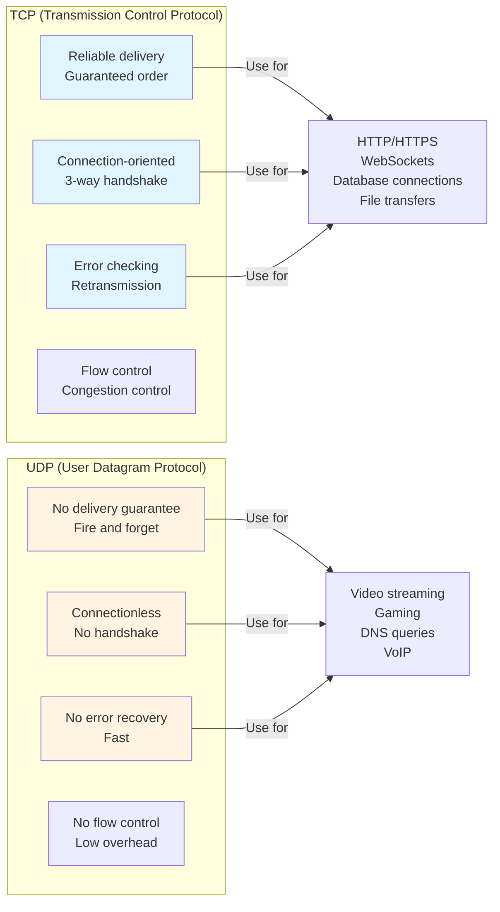

---

## Best Practices

### Decision Framework

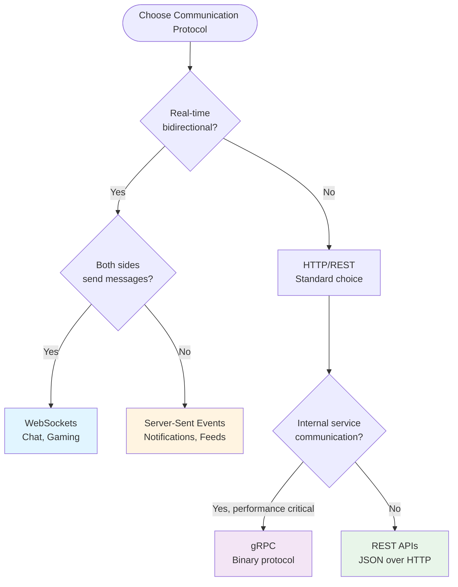

### Common Patterns

#### 1. Public API Pattern
```
Clients (Mobile/Web) → CDN → Layer 7 LB → API Servers → Database
```

#### 2. Real-time Chat Pattern
```
Clients → Layer 4 LB → WebSocket Servers → Pub/Sub (Redis/Kafka) → Database
```

#### 3. Microservices Pattern
```
Public: REST (Layer 7 LB) → API Gateway
Internal: gRPC → Service Mesh → Microservices
```

### Interview Tips

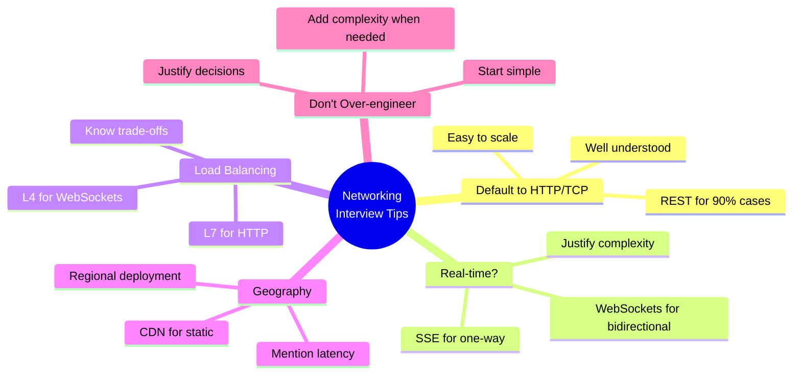

### Key Takeaways

1. **Default to HTTP/TCP**: It handles 90% of use cases and is well-understood
2. **WebSockets = Complexity**: Only use when you need bidirectional real-time communication
3. **SSE is Simpler**: For one-way server push, SSE is easier than WebSockets
4. **Layer 4 vs Layer 7**: Know when to use each (WebSockets = L4, REST APIs = L7)
5. **Geography Matters**: 80ms NY→London is unavoidable physics
6. **gRPC for Internal**: High-performance binary protocol for microservices
7. **CDN for Static**: Always mention CDN for images, CSS, JS
8. **Stateful = Hard**: WebSocket connections are stateful and harder to scale

---

## Summary

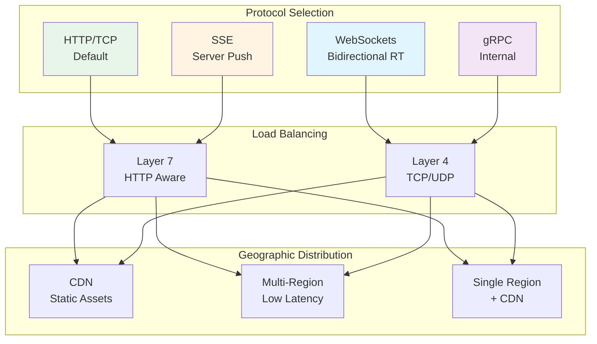

**Remember**: Networking in system design interviews is about making practical choices that you can justify. Start with the simple, well-understood options (HTTP/TCP, REST) and only add complexity (WebSockets, multi-region) when you have a clear reason backed by requirements.

---

## Additional Resources

- [Real-time Updates Pattern](https://www.hellointerview.com/learn/system-design/patterns/realtime-updates)
- [Networking Essentials Deep Dive](https://www.hellointerview.com/learn/system-design/core-concepts/networking-essentials)
- [Load Balancing Strategies](https://www.hellointerview.com/learn/system-design/deep-dives/load-balancing)

---

*Extracted from: System Design Core Concepts - HelloInterview*
