# Networking Essentials

> **Practical networking concepts for system design interviews**  
> *Understanding how services communicate in distributed systems*

---

## Table of Contents

1. [Introduction](#introduction)
2. [Communication Protocols](#communication-protocols)
3. [Real-time Communication](#real-time-communication)
4. [Load Balancing](#load-balancing)
5. [Geography and Latency](#geography-and-latency)
6. [Network Layers](#network-layers)
7. [Best Practices](#best-practices)

---

## Introduction

Networking is one of those topics where you can go incredibly deep, but for system design interviews you need to know the **practical bits** that come up when you're designing distributed systems.

At a basic level, you need to understand:
- How services talk to each other
- What happens when those connections fail or get slow
- Which protocol to choose for different scenarios
- How to handle real-time communication requirements

> 💡 **Interview Focus**: The most important decision you'll make is choosing your communication protocol. For most systems, you'll default to HTTP over TCP. It's well-understood, works everywhere, and handles 90% of use cases.

---

## Communication Protocols

For most systems, you'll default to **HTTP over TCP**. It's well-understood, works everywhere, and handles 90% of use cases.

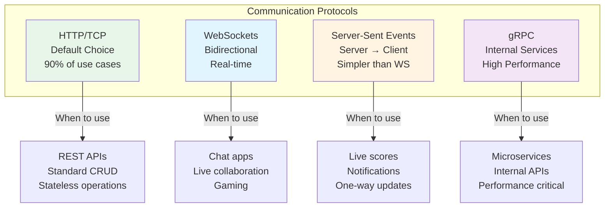

### Protocol Comparison

| Protocol | Use Case | Advantages | Disadvantages |
|----------|----------|------------|---------------|
| **HTTP/TCP** | REST APIs, CRUD operations | Well-understood, universal support, stateless | Higher latency for real-time |
| **WebSockets** | Chat, gaming, live collaboration | Bidirectional, low latency, persistent | Complex at scale, stateful |
| **SSE** | Live scores, notifications, feeds | Simpler than WebSockets, auto-reconnect | One-way only (server→client) |
| **gRPC** | Internal microservices | Binary protocol, fast, streaming support | Limited browser support |

### HTTP/TCP (Default)

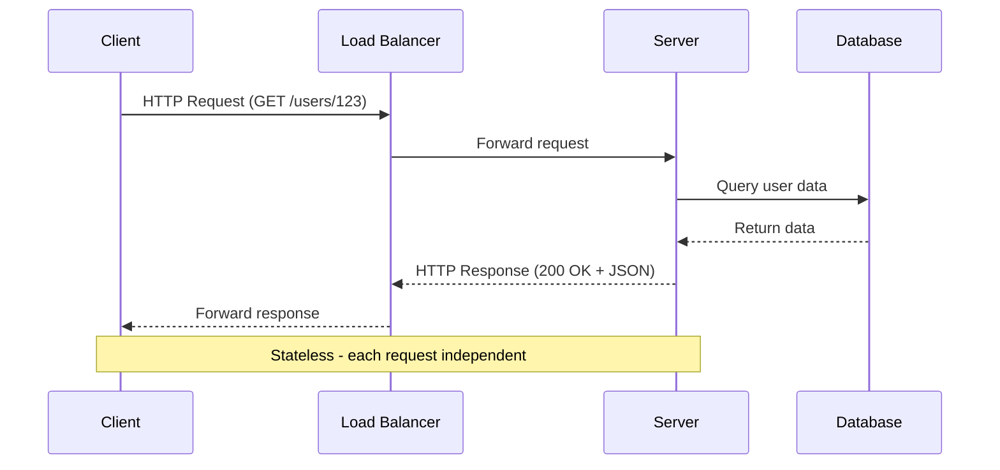

**When to use:**
- REST APIs
- Standard CRUD operations
- Stateless services
- Most web applications

**Key characteristics:**
- Request-response model
- Stateless by default
- Easy to scale horizontally
- Well-supported by all infrastructure

---

## Real-time Communication

### WebSockets vs Server-Sent Events

**WebSockets:**
- **Bidirectional** communication where both sides send messages
- Use cases: chat apps, live collaboration, gaming
- More complex to implement and scale

**Server-Sent Events (SSE):**
- **Server-to-client push only**
- Use cases: live scores, notifications, one-way updates
- Simpler than WebSockets, better with standard HTTP infrastructure

> ⚠️ **Common Mistake**: Proposing WebSockets when HTTP with long polling or Server-Sent Events would work fine. WebSockets add significant complexity for maintaining stateful connections at scale. Only reach for them when you genuinely need bidirectional real-time communication.

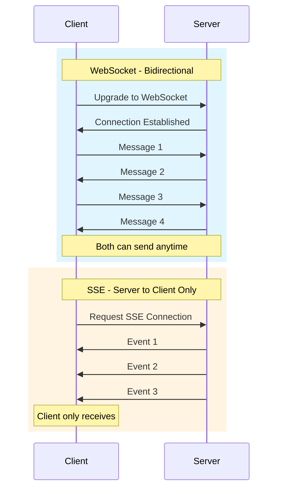

### WebSocket Connection Lifecycle

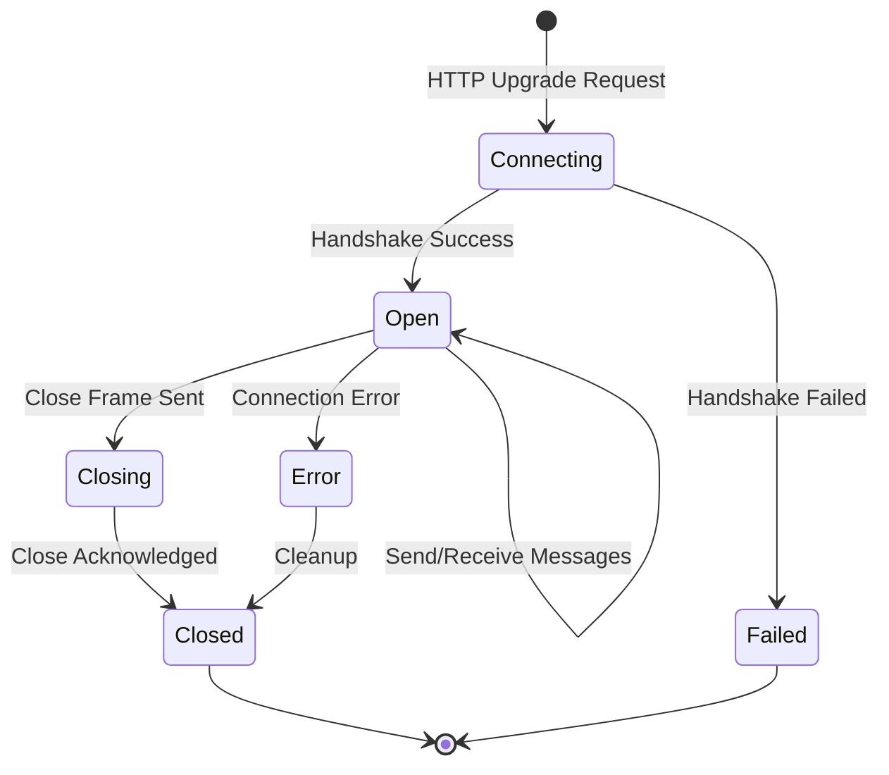

### Scaling Real-time Connections

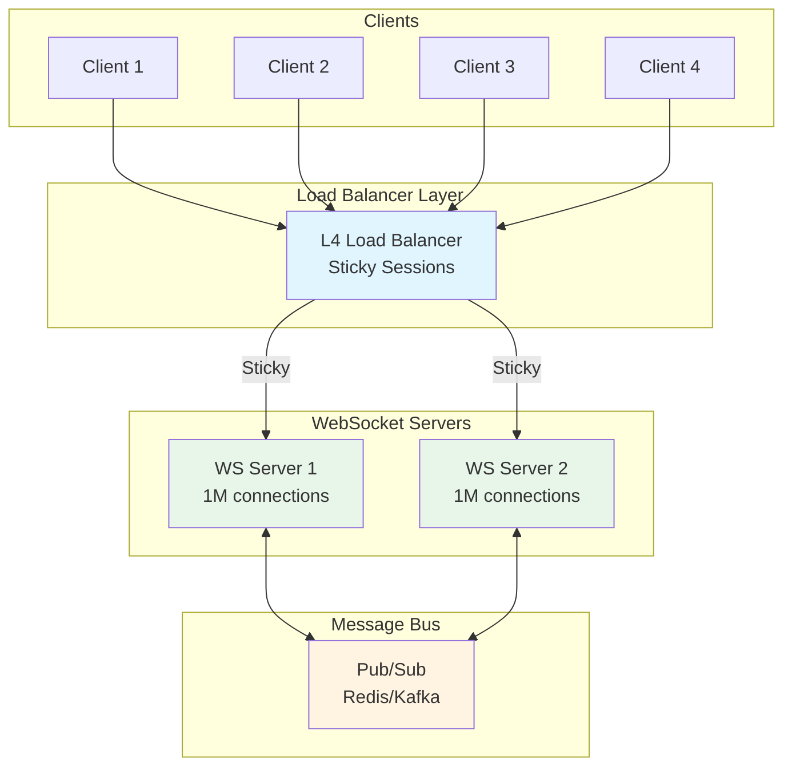

**Key Challenges with WebSockets:**
- **Stateful connections**: Can't just throw them behind a standard load balancer
- **Connection persistence**: Need sticky sessions or session affinity
- **Server failures**: What happens when a server goes down with thousands of active connections?
- **Scaling**: Limited by concurrent connections per server

---

## Load Balancing

Load balancing is another area interviewers love to probe. Understanding the difference between Layer 4 and Layer 7 load balancers is crucial.

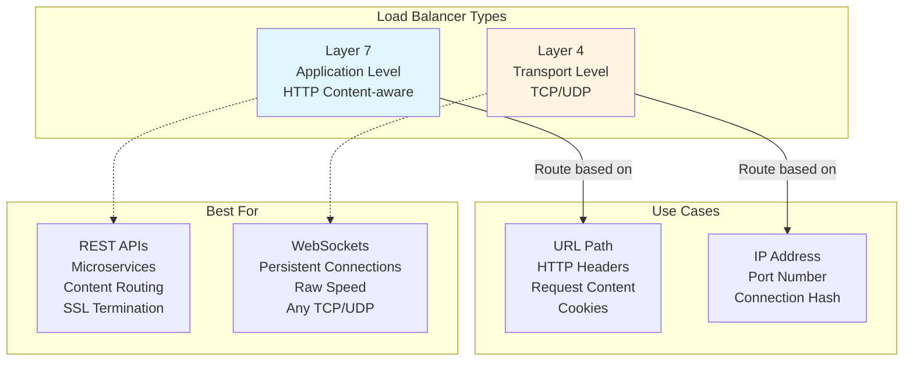

### Layer 7 (Application Load Balancer)

**Operates at:** HTTP/HTTPS level

**Routing capabilities:**
- URL path-based routing (`/api/*` → API servers, `/web/*` → Web servers)
- Header-based routing (mobile vs desktop)
- Host-based routing (different domains to different services)
- Content-based routing (analyze request body)

**Features:**
- SSL/TLS termination
- Cookie-based session affinity
- Request/response modification
- Advanced health checks

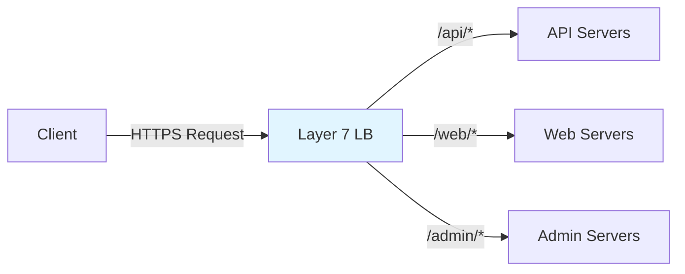

### Layer 4 (Network Load Balancer)

**Operates at:** TCP/UDP level

**Routing capabilities:**
- IP address and port
- Connection hash (source IP + port)
- Simple round-robin or least connections

**Features:**
- Extremely fast (no packet inspection)
- Lower latency
- Handles any TCP/UDP protocol
- Better for persistent connections

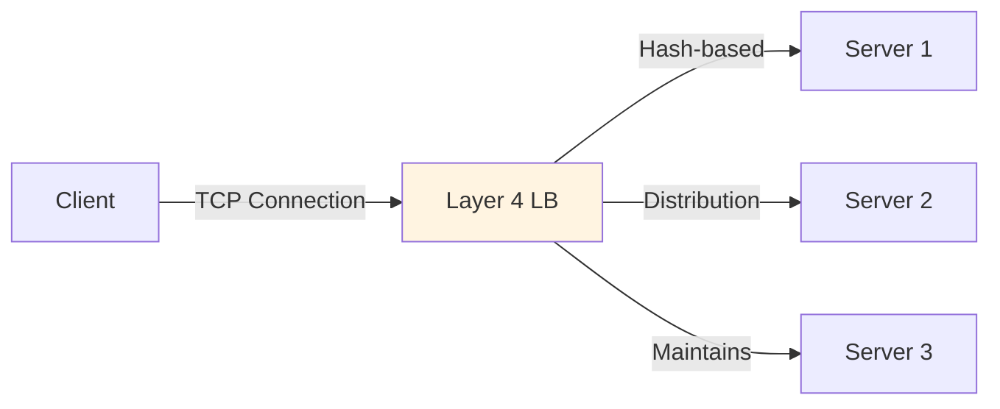

### Comparison Table

| Feature | Layer 7 | Layer 4 |
|---------|---------|---------|
| **Speed** | Slower (inspects content) | Faster (no inspection) |
| **Flexibility** | High (content-aware) | Low (connection-based) |
| **Use Case** | HTTP/HTTPS APIs | WebSockets, TCP/UDP |
| **SSL Termination** | Yes | No (pass-through) |
| **Sticky Sessions** | Cookie-based | IP-based |
| **Protocol Support** | HTTP/HTTPS only | Any TCP/UDP |

> 💡 **Interview Tip**: For WebSockets, you typically need Layer 4 balancing because you're maintaining a persistent TCP connection. For standard REST APIs, Layer 7 gives you more flexibility.

---

## Geography and Latency

Geography and latency matter more than most candidates realize. A request from New York to London has a **minimum latency of around 80ms** just from the speed of light through fiber optic cables, before you even process anything.

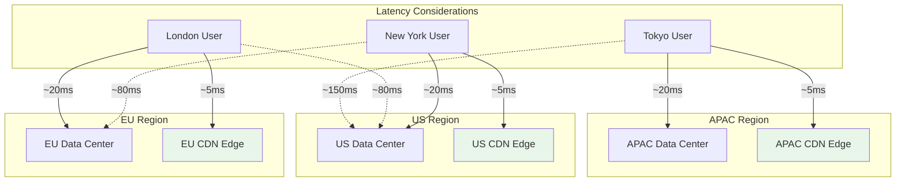

### Geographic Latency Facts

| Route | Minimum Latency | Notes |
|-------|----------------|-------|
| **Same City** | 1-5ms | LAN speeds |
| **Same Region** | 5-20ms | Within data center or nearby |
| **Cross-Country (US)** | 40-60ms | NY to SF |
| **Transatlantic** | 80-100ms | NY to London |
| **Transpacific** | 100-150ms | US to Tokyo |
| **Round the World** | 150-200ms | Physical speed of light limit |

### Solutions for Global Low Latency

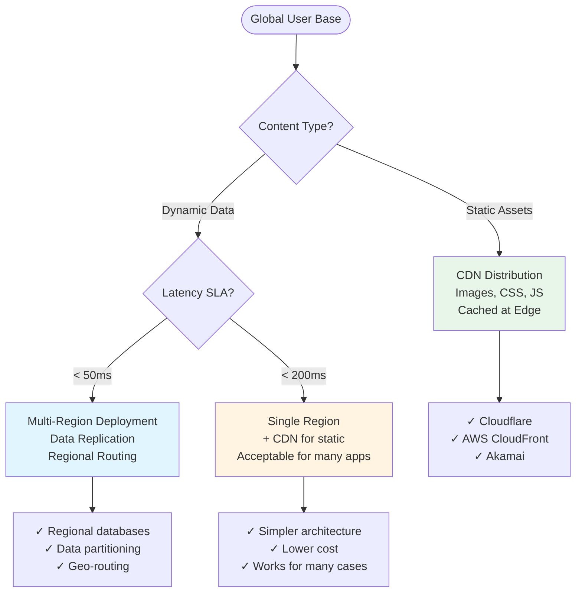

### Regional Architecture Example

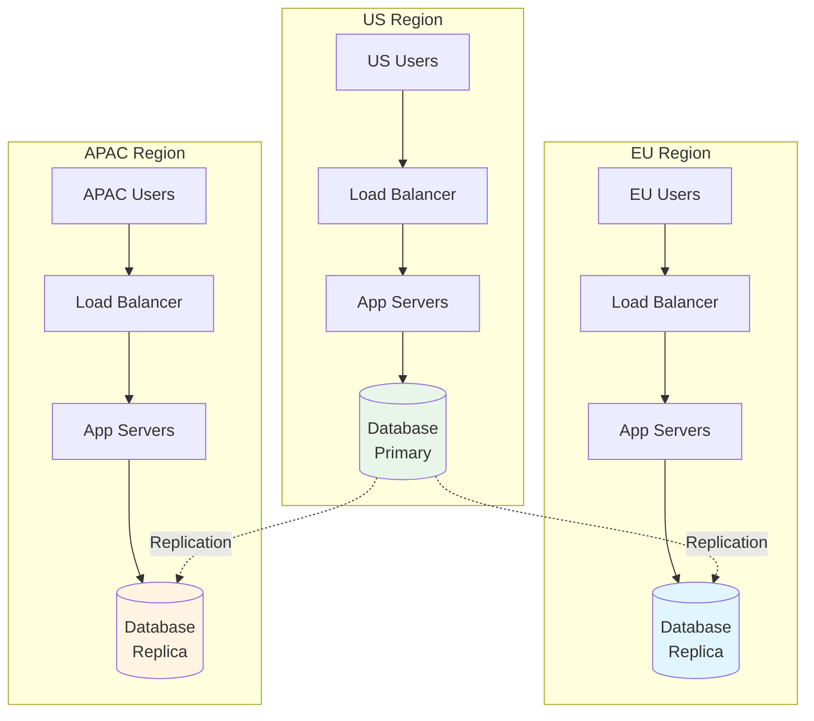

**Solution**: If your system needs low latency globally, you'll need regional deployments with data replicated or partitioned by geography. This is why CDNs exist - to serve static content from edge servers close to users.

---

## Network Layers

### Why OSI Model?

The OSI (Open Systems Interconnect) Model provides a **high-level design on how to transmit data from one computational device to another**. Computational devices include laptops, mobiles, smartwatches, desktops, and more.

Understanding the OSI and TCP/IP models helps contextualize where different technologies operate and how data flows through the network stack.

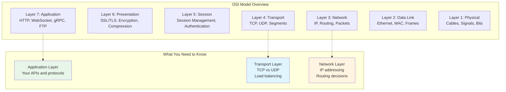

### Detailed Layer Breakdown

#### Layer 7: Application Layer

**Unit of Operation:** Application-specific data

**Purpose:** This is where network applications and their protocols live. It provides network services directly to end-users.

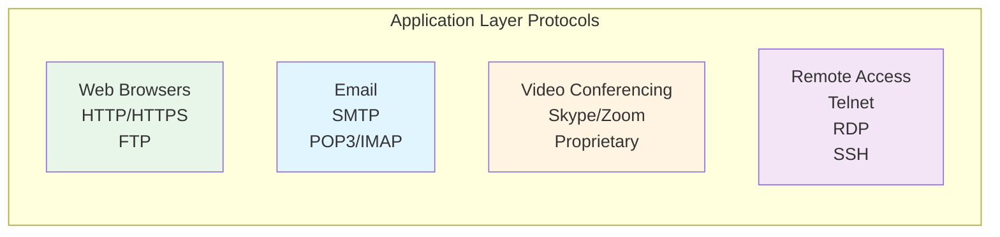

**Key Protocols:**
- **HTTP/HTTPS**: Web browsing and REST APIs
- **FTP**: File transfer
- **SMTP**: Sending emails
- **POP3/IMAP**: Receiving emails
- **DNS**: Domain name resolution
- **Telnet/SSH**: Remote access
- **RDP**: Remote Desktop Protocol

**Interview Focus:** This is where your API design decisions (REST, GraphQL, gRPC) live. Understanding protocols helps you choose the right communication pattern.

---

#### Layer 6: Presentation Layer

**Unit of Operation:** Formatted data

**Purpose:** Translates data between the application layer and the network format. Handles data encoding, compression, and encryption.

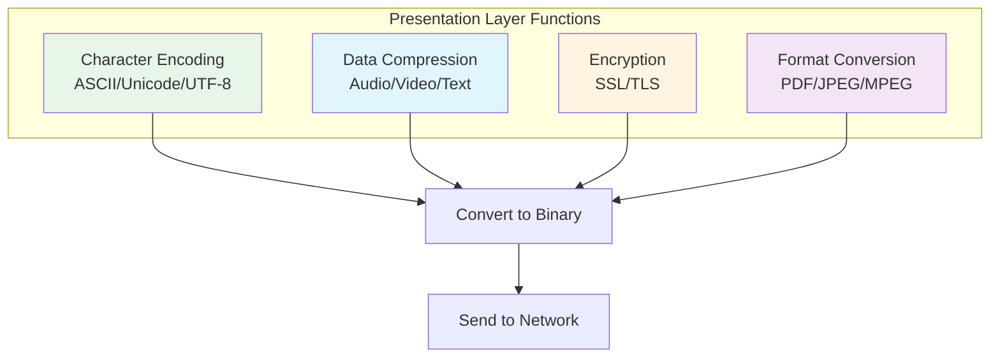

**Key Functions:**

1. **Character Encoding/Translation**
   - Converts ASCII/EBCDIC/Unicode/PDF encoded data to binary format
   - **Why it matters**: 1 byte = 8 bits, and 2^8 (256) combinations can fit enough characters without wasting space
   - Handles different character sets across systems

2. **Data Compression**
   - Reduces bandwidth usage
   - Critical for audio and video streaming
   - Lossless (ZIP) vs Lossy (JPEG, MP3) compression

3. **Encryption**
   - SSL/TLS encryption happens here
   - Ensures data confidentiality
   - Certificate validation

**Interview Focus:** When discussing security (HTTPS, TLS) or data optimization (compression), you're dealing with presentation layer concerns.

---

#### Layer 5: Session Layer

**Unit of Operation:** Sessions/Connections

**Purpose:** Establishes, manages, and terminates sessions between applications. Handles authentication and authorization.

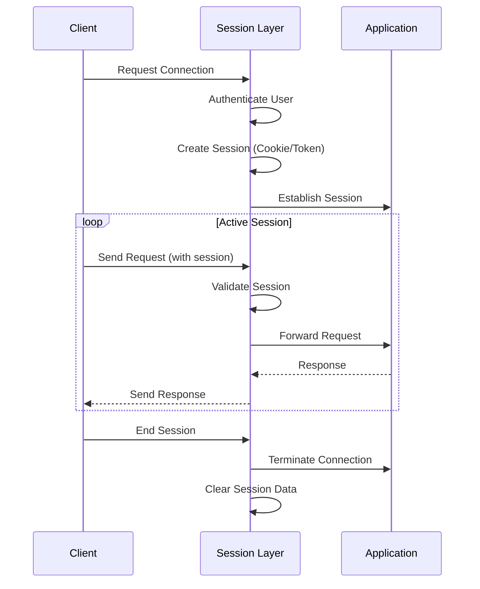

**Key Functions:**

1. **Session Management**
   - Establishes, maintains, and terminates connections
   - Does NOT modify data, just manages the connection
   - Uses cookies, tokens, or session IDs

2. **Authorization and Authentication**
   - Verifies user identity
   - Manages permissions
   - Token validation (JWT, OAuth)

3. **Security**
   - SSL/TLS session establishment
   - Certificate exchange
   - Secure channel setup

**Common Implementations:**
- HTTP Cookies
- JWT (JSON Web Tokens)
- Session IDs
- OAuth tokens

**Interview Focus:** When discussing authentication, session management, or stateful connections, you're operating at the session layer.

---

#### Layer 4: Transport Layer

**Unit of Operation:** Segments

**Purpose:** Ensures reliable data transfer between hosts. Handles segmentation, flow control, and error control.

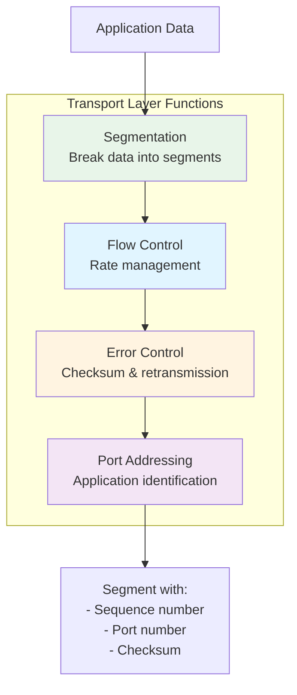

**Key Functions:**

1. **Segmentation**
   - Takes data from session layer and breaks it into segments
   - Each segment has:
     - **Sequence number**: For ordering and reassembly
     - **Port number**: Identifies destination application (e.g., port 80 for HTTP, 443 for HTTPS)
   - TCP and UDP have different segment sizes

2. **Flow Control**
   - Controls the rate at which data is sent from server to client
   - Prevents overwhelming the receiver
   - Sliding window mechanism

3. **Error Control**
   - Automatic Repeat Request (ARQ) to recover lost data
   - Computes **checksum** for each segment
   - Detects data corruption over physical layer
   - Adds checksum bits to segment tail

**Segment Structure:**
```
+------------------+------------------+
| Source Port (16) | Dest Port (16)   |
+------------------+------------------+
| Sequence Number (32 bits)           |
+--------------------------------------+
| Acknowledgment Number (32 bits)     |
+--------------------------------------+
| Data | Flags | Window Size          |
+--------------------------------------+
| Checksum        | Urgent Pointer    |
+--------------------------------------+
| Data ...                            |
+--------------------------------------+
```

**Interview Focus:** Understanding TCP vs UDP, port numbers, and reliability mechanisms is crucial for system design discussions.

---

#### Layer 3: Network Layer

**Unit of Operation:** Packets

**Purpose:** Handles logical addressing (IP) and routing. Determines the best path for data to travel from source to destination.

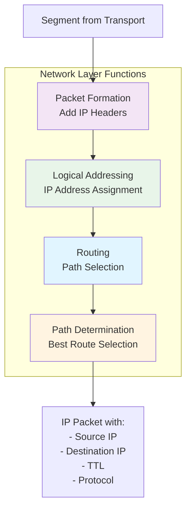

**Key Functions:**

1. **Packets**
   - Segment + IP header information = Packet
   - Contains source and destination IP addresses

2. **Logical Addressing (IP)**
   - IPv4: 32-bit addresses (e.g., 192.168.1.1)
   - IPv6: 128-bit addresses (e.g., 2001:0db8:85a3::8a2e:0370:7334)
   - Uniquely identifies devices on a network

3. **Routing (with Masking)**
   - Forwards packets to destination using subnet masks
   - Routers make forwarding decisions
   - ISP maintains DNS to resolve names to IP addresses

4. **Path Determination**
   - Selects the best path based on:
     - Hop count
     - Bandwidth
     - Latency
     - Network congestion
   - Uses routing protocols: OSPF, BGP, RIP

**Common Protocols:**
- **IPv4/IPv6**: Internet Protocol versions
- **ICMP**: Internet Control Message Protocol (ping, traceroute)
- **ARP**: Address Resolution Protocol (IP to MAC)
- **Routing Protocols**: OSPF, BGP, RIP

**Interview Focus:** IP addressing, routing decisions, and geographic distribution discussions happen at this layer.

---

#### Layer 2: Data Link Layer

**Unit of Operation:** Frames

**Purpose:** Provides node-to-node data transfer. Handles MAC addressing, error detection, and media access control.

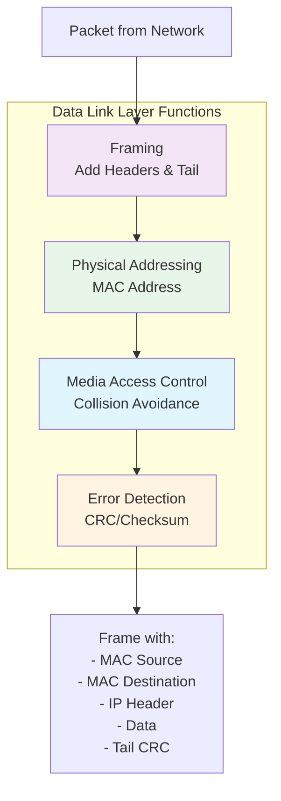

**Key Functions:**

1. **Physical Addressing (MAC)**
   - **MAC Address**: Unique 48-bit hardware address
   - Burned into Network Interface Card (NIC)
   - Format: `AA:BB:CC:DD:EE:FF`
   - Used for local network communication

2. **Access to Physical Medium**
   - Controls access to copper wires, Ethernet cables, fiber optics
   - NIC (Network Interface Card) operates here

3. **Media Access Control (MAC)**
   - Reduces collisions across mediums
   - CSMA/CD (Carrier Sense Multiple Access with Collision Detection)
   - Ensures orderly access to shared medium

4. **Error Detection**
   - Detects errors in received frames
   - Uses CRC (Cyclic Redundancy Check)
   - Adds error detection bits to frame tail

**Frame Structure:**
```
+------------------+------------------+
| Destination MAC  | Source MAC       |
+------------------+------------------+
| Type/Length      | IP Packet        |
+------------------+------------------+
| Data Payload ...                    |
+--------------------------------------+
| Frame Check Sequence (CRC)          |
+--------------------------------------+
```

**Technologies:**
- Ethernet
- Wi-Fi (802.11)
- PPP (Point-to-Point Protocol)
- Switches operate at this layer

**Interview Focus:** Understanding MAC addresses, switching, and local network communication.

---

#### Layer 1: Physical Layer

**Unit of Operation:** Bits

**Purpose:** Converts digital data into electrical, optical, or radio signals for transmission over physical medium.

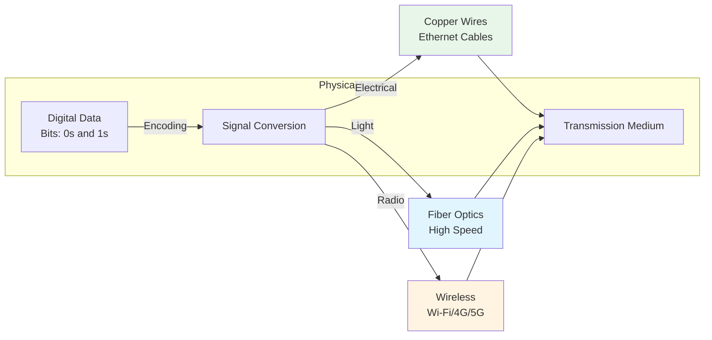

**Key Functions:**

1. **Bit Transmission**
   - Converts bits (0s and 1s) to signals
   - Digital to analog conversion
   - Signal modulation

2. **Physical Characteristics**
   - Voltage levels (for electrical signals)
   - Light wavelengths (for fiber optics)
   - Radio frequencies (for wireless)

**Transmission Mediums:**

**Guided Mediums** (Physical cables):
- **Copper Wires**: Twisted pair cables (Cat5e, Cat6)
- **Coaxial Cables**: TV cables, older networks
- **Fiber Optic Cables**: High-speed, long-distance

**Unguided Mediums** (Wireless):
- **Radio Waves**: Wi-Fi, Bluetooth
- **Microwaves**: Satellite communication
- **Infrared**: Short-range (remote controls)

**Transmission Modes:**

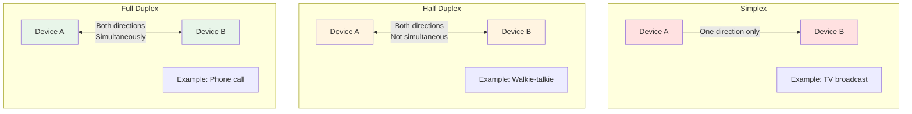

- **Simplex**: One direction only (e.g., TV broadcast)
- **Half Duplex**: Both directions, but one at a time (e.g., walkie-talkie)
- **Full Duplex**: Both directions simultaneously (e.g., phone call, modern Ethernet)

**Network Types by Physical Scope:**
- **PAN** (Personal Area Network): Bluetooth, USB
- **LAN** (Local Area Network): Office, home network
- **WLAN** (Wireless LAN): Wi-Fi networks
- **CAN** (Campus Area Network): University campus
- **MAN** (Metropolitan Area Network): City-wide
- **WAN** (Wide Area Network): Internet, cross-country

**Interview Focus:** Understanding physical constraints (latency due to speed of light in fiber) and transmission medium choices.

---

### Complete Data Flow Through OSI Layers

```mermaid
graph TB
    subgraph "Sender Side - Data Encapsulation"
        APP_S[Application Layer<br/>User Data]
        PRES_S[Presentation Layer<br/>Format + Compress + Encrypt]
        SESS_S[Session Layer<br/>Add Session Info]
        TRANS_S[Transport Layer<br/>Add Segment Header<br/>Port, Sequence, Checksum]
        NET_S[Network Layer<br/>Add IP Header<br/>Source & Dest IP]
        LINK_S[Data Link Layer<br/>Add MAC Header + Tail<br/>Frame]
        PHY_S[Physical Layer<br/>Convert to Signals<br/>Bits]
    end
    
    subgraph "Transmission Medium"
        MEDIUM[Copper/Fiber/Wireless]
    end
    
    subgraph "Receiver Side - Data Decapsulation"
        PHY_R[Physical Layer<br/>Receive Signals<br/>Convert to Bits]
        LINK_R[Data Link Layer<br/>Remove MAC Header<br/>Error Check]
        NET_R[Network Layer<br/>Remove IP Header<br/>Check Destination]
        TRANS_R[Transport Layer<br/>Remove Segment Header<br/>Reassemble, Error Check]
        SESS_R[Session Layer<br/>Validate Session]
        PRES_R[Presentation Layer<br/>Decrypt + Decompress]
        APP_R[Application Layer<br/>Deliver to Application]
    end
    
    APP_S --> PRES_S --> SESS_S --> TRANS_S --> NET_S --> LINK_S --> PHY_S
    PHY_S --> MEDIUM
    MEDIUM --> PHY_R
    PHY_R --> LINK_R --> NET_R --> TRANS_R --> SESS_R --> PRES_R --> APP_R
    
    style APP_S fill:#e8f5e9
    style TRANS_S fill:#e1f5ff
    style NET_S fill:#fff4e1
    style LINK_S fill:#f3e5f5
    style APP_R fill:#e8f5e9
    style TRANS_R fill:#e1f5ff
    style NET_R fill:#fff4e1
    style LINK_R fill:#f3e5f5
```

### Layer-by-Layer Data Transformation

```mermaid
graph LR
    subgraph "Data Encapsulation Process"
        D1[User Data<br/>Hello World]
        D2[Compressed<br/>Encrypted Data]
        D3[Session Info<br/>+ Data]
        D4[Segment<br/>Port: 443<br/>Seq: 1<br/>+ Data]
        D5[Packet<br/>IP: 192.168.1.1<br/>+ Segment]
        D6[Frame<br/>MAC: AA:BB:CC<br/>+ Packet + CRC]
        D7[Bits<br/>01010101...]
    end
    
    D1 -->|Presentation| D2
    D2 -->|Session| D3
    D3 -->|Transport| D4
    D4 -->|Network| D5
    D5 -->|Data Link| D6
    D6 -->|Physical| D7
    
    style D1 fill:#e8f5e9
    style D4 fill:#e1f5ff
    style D5 fill:#fff4e1
    style D6 fill:#f3e5f5
```

### Quick Reference: What Happens at Each Layer

| Layer | Adds | Unit | Key Info |
|-------|------|------|----------|
| **7. Application** | Application data | Data | HTTP request, email, etc. |
| **6. Presentation** | Formatting | Data | Encryption, compression |
| **5. Session** | Session tokens | Data | Authentication, session ID |
| **4. Transport** | Port numbers, sequence | **Segment** | Source port, dest port, checksum |
| **3. Network** | IP addresses | **Packet** | Source IP, dest IP, TTL |
| **2. Data Link** | MAC addresses, CRC | **Frame** | Source MAC, dest MAC, error check |
| **1. Physical** | - | **Bits** | Electrical/optical/radio signals |

### TCP vs UDP

```mermaid
graph LR
    subgraph "TCP (Transmission Control Protocol)"
        TCP1[Reliable delivery<br/>Guaranteed order]
        TCP2[Connection-oriented<br/>3-way handshake]
        TCP3[Error checking<br/>Retransmission]
        TCP4[Flow control<br/>Congestion control]
    end
    
    subgraph "UDP (User Datagram Protocol)"
        UDP1[No delivery guarantee<br/>Fire and forget]
        UDP2[Connectionless<br/>No handshake]
        UDP3[No error recovery<br/>Fast]
        UDP4[No flow control<br/>Low overhead]
    end
    
    TCP1 & TCP2 & TCP3 -->|Use for| TCPU[HTTP/HTTPS<br/>WebSockets<br/>Database connections<br/>File transfers]
    
    UDP1 & UDP2 & UDP3 -->|Use for| UDPU[Video streaming<br/>Gaming<br/>DNS queries<br/>VoIP]
    
    style TCP1 fill:#e1f5ff
    style TCP2 fill:#e1f5ff
    style TCP3 fill:#e1f5ff
    style UDP1 fill:#fff4e1
    style UDP2 fill:#fff4e1
    style UDP3 fill:#fff4e1
```

---

## Best Practices

### Decision Framework

```mermaid
flowchart TD
    Start([Choose Communication Protocol])
    
    Start --> Q1{Real-time<br/>bidirectional?}
    
    Q1 -->|Yes| Q2{Both sides<br/>send messages?}
    Q1 -->|No| REST[HTTP/REST<br/>Standard choice]
    
    Q2 -->|Yes| WS[WebSockets<br/>Chat, Gaming]
    Q2 -->|No| SSE[Server-Sent Events<br/>Notifications, Feeds]
    
    REST --> Q3{Internal service<br/>communication?}
    Q3 -->|Yes, performance critical| GRPC[gRPC<br/>Binary protocol]
    Q3 -->|No| FINAL_REST[REST APIs<br/>JSON over HTTP]
    
    style FINAL_REST fill:#e8f5e9
    style WS fill:#e1f5ff
    style SSE fill:#fff4e1
    style GRPC fill:#f3e5f5
```

### Common Patterns

#### 1. Public API Pattern
```
Clients (Mobile/Web) → CDN → Layer 7 LB → API Servers → Database
```

#### 2. Real-time Chat Pattern
```
Clients → Layer 4 LB → WebSocket Servers → Pub/Sub (Redis/Kafka) → Database
```

#### 3. Microservices Pattern
```
Public: REST (Layer 7 LB) → API Gateway
Internal: gRPC → Service Mesh → Microservices
```

### Interview Tips

```mermaid
mindmap
  root((Networking<br/>Interview Tips))
    Default to HTTP/TCP
      REST for 90% cases
      Well understood
      Easy to scale
    Real-time?
      SSE for one-way
      WebSockets for bidirectional
      Justify complexity
    Load Balancing
      L7 for HTTP
      L4 for WebSockets
      Know trade-offs
    Geography
      Mention latency
      CDN for static
      Regional deployment
    Don't Over-engineer
      Start simple
      Add complexity when needed
      Justify decisions
```

### Key Takeaways

1. **Default to HTTP/TCP**: It handles 90% of use cases and is well-understood
2. **WebSockets = Complexity**: Only use when you need bidirectional real-time communication
3. **SSE is Simpler**: For one-way server push, SSE is easier than WebSockets
4. **Layer 4 vs Layer 7**: Know when to use each (WebSockets = L4, REST APIs = L7)
5. **Geography Matters**: 80ms NY→London is unavoidable physics
6. **gRPC for Internal**: High-performance binary protocol for microservices
7. **CDN for Static**: Always mention CDN for images, CSS, JS
8. **Stateful = Hard**: WebSocket connections are stateful and harder to scale

---

## Summary

```mermaid
graph TB
    subgraph "Protocol Selection"
        P1[HTTP/TCP<br/>Default]
        P2[WebSockets<br/>Bidirectional RT]
        P3[SSE<br/>Server Push]
        P4[gRPC<br/>Internal]
    end
    
    subgraph "Load Balancing"
        L1[Layer 7<br/>HTTP Aware]
        L2[Layer 4<br/>TCP/UDP]
    end
    
    subgraph "Geographic Distribution"
        G1[CDN<br/>Static Assets]
        G2[Multi-Region<br/>Low Latency]
        G3[Single Region<br/>+ CDN]
    end
    
    P1 --> L1
    P2 --> L2
    P3 --> L1
    P4 --> L2
    
    L1 & L2 --> G1 & G2 & G3
    
    style P1 fill:#e8f5e9
    style P2 fill:#e1f5ff
    style P3 fill:#fff4e1
    style P4 fill:#f3e5f5
```

**Remember**: Networking in system design interviews is about making practical choices that you can justify. Start with the simple, well-understood options (HTTP/TCP, REST) and only add complexity (WebSockets, multi-region) when you have a clear reason backed by requirements.

---

## Additional Resources

- [Real-time Updates Pattern](https://www.hellointerview.com/learn/system-design/patterns/realtime-updates)
- [Networking Essentials Deep Dive](https://www.hellointerview.com/learn/system-design/core-concepts/networking-essentials)
- [Load Balancing Strategies](https://www.hellointerview.com/learn/system-design/deep-dives/load-balancing)

---

*Extracted from: System Design Core Concepts - HelloInterview*
