# 🔴 Redis

> **Core Concept**: Redis is an in-memory, single-threaded, data-structure server that powers caches, queues, leaderboards, rate limiters, distributed locks, and pub/sub fanout in nearly every modern backend. Understanding Redis means understanding *why* its design choices (single-threaded, RESP protocol, in-memory, optional persistence) make it both extraordinarily fast and operationally tricky.

## 📋 Table of Contents

- [Why Redis](#why-redis)
- [The Single-Threaded Event Loop](#the-single-threaded-event-loop)
- [Data Structures (and When to Use Each)](#data-structures-and-when-to-use-each)
- [Persistence: RDB, AOF, Hybrid](#persistence-rdb-aof-hybrid)
- [Replication and High Availability](#replication-and-high-availability)
- [Redis Cluster: Sharding and Slots](#redis-cluster-sharding-and-slots)
- [Atomicity Primitives: Transactions, WATCH, Lua](#atomicity-primitives-transactions-watch-lua)
- [Eviction Policies and Memory Management](#eviction-policies-and-memory-management)
- [Deep Dive 1: Stale-While-Revalidate (SWR) with Redis](#deep-dive-1-stale-while-revalidate-swr-with-redis)
- [Deep Dive 2: Pub/Sub — Mechanics, Pitfalls, and Streams](#deep-dive-2-pubsub--mechanics-pitfalls-and-streams)
- [Deep Dive 3: Version Increments and Cache Invalidation Patterns](#deep-dive-3-version-increments-and-cache-invalidation-patterns)
- [Common Production Patterns](#common-production-patterns)
- [Insider Tips and Tricks](#insider-tips-and-tricks)
- [Conclusion](#conclusion)

---

## 🎯 Why Redis

Redis is the default answer to "we need this fast" in most backend architectures. The core selling points are:

1. **In-memory storage** — every read and write is RAM-speed (microseconds, not milliseconds).
2. **Rich data structures** — not just key/value; lists, sets, sorted sets, hashes, streams, bitmaps, HyperLogLog, geospatial indexes — each with O(1) or O(log N) operations.
3. **Single-threaded execution** — no locks, no race conditions inside a single command.
4. **Atomic compound operations** — Lua scripts and transactions execute as one indivisible unit.
5. **Optional persistence** — durability when you want it (AOF), pure cache when you don't.
6. **Replication and clustering built in** — primary/replica with async replication, plus Redis Cluster for sharded multi-node deployments.

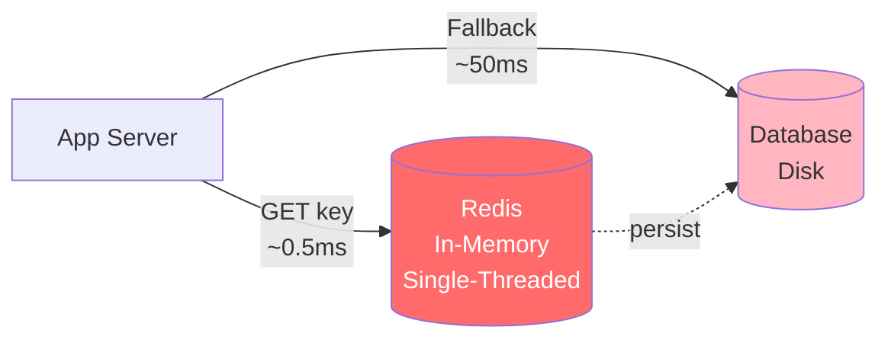

### When NOT to use Redis

- **Large objects** (multi-MB values): Redis serializes payloads through a single thread; a single 50MB SET blocks all other clients for tens of milliseconds.
- **Strong durability with no data loss tolerance**: even AOF `everysec` can lose ~1 second of writes; for money-grade durability, use Postgres or a transactional log.
- **Complex queries**: no joins, no rich SQL — Redis is a key/value store with operations on each key, not a query engine.
- **Working set larger than RAM**: cost per GB of RAM dwarfs SSD; if your data does not fit in memory, use a tiered store.

---

## 🧒 Layman's Explanation

Forget the jargon for a minute. Redis is best understood through the rhythms of small, busy places.

**The diner counter at lunch rush.** Picture a single, preternaturally fast short-order cook behind the counter. Every order — pancakes, coffee, eggs benedict — is handled by this one cook in the exact order it lands on the rail. Because there's only one cook, there's no fight over the fryer, no two hands reaching for the same spatula, no need for locks or coordination. Things just happen in order. The catch? If someone orders a 17-ingredient omelet, every customer behind them waits. That single-cook design is why Redis is so fast and lock-free, and also why one slow command (`KEYS *`, a giant `HGETALL`, a runaway Lua script) freezes the entire line.

**The whiteboard at a coffee shop.** Orders go up on the whiteboard the second they're called in, and come down when the drink is delivered. The board is fast because it lives right there on the wall — no filing cabinet involved. That's Redis being in-memory. At closing time, the manager snaps a photo of the whiteboard so they have a record for tomorrow (that's an **RDB snapshot**). For a more paranoid record, every chalk mark is also copied into a logbook as it happens (that's **AOF**). Lose the whiteboard mid-day with no logbook, and you've lost everything written since the last photo.

**The bulletin board with thumbtacks.** Announcements get pinned up for a moment — anyone in the room sees them. Step out for coffee? You miss whatever was pinned while you were gone, and there's no replay. That's Redis **Pub/Sub**: blazing fast broadcast, zero memory of what was said, zero durability.

### The three deep-dive concepts in plain terms

- **SWR (Stale-While-Revalidate)**: like a cafe handing you yesterday's pastry with a fresh espresso while the new batch is still in the oven. You're never standing at the counter staring at nothing — you eat the slightly older croissant now, and the next person gets the fresh one.
- **Pub/Sub**: like a school PA system. The announcement goes out to everyone present in the building right now. If you're absent, in the bathroom, or your radio is off — too bad. No replay, no transcript, no "wait, what did they say?"
- **Version increments**: like a magazine subscription. You don't recycle issue 46 and reprint corrections on top of it. You print issue 47 with a new number, and the old one becomes obsolete the moment the new one hits the mailbox. Readers naturally pick up the latest issue; the old ones gather dust until thrown out.

### When the analogy breaks down

Real Redis has clustering, replication, and Sentinel-driven failover that don't fit a single coffee shop — imagine a chain with branches across town, each carrying part of the menu, with managers gossiping over walkie-talkies about who's still open. And the "fire-and-forget" nature of Pub/Sub catches a lot of engineers off guard: they assume the bulletin board is a mailbox, get burned when an absent subscriber misses a critical announcement, and only then learn to reach for Streams.

---

## 🧵 The Single-Threaded Event Loop

The most important fact about Redis: **all command execution happens on a single thread**. Network I/O can be multi-threaded (since Redis 6 with `io-threads`), but command processing — the actual logic — is single-threaded.

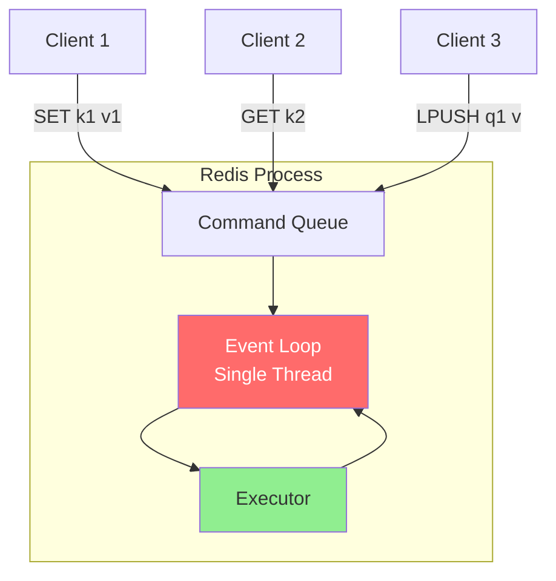

### Implications

| Implication | Why It Matters |
|---|---|
| **No locks needed inside a command** | `INCR` is atomic without coordination. So is `LPUSH`, `ZADD`, `HSET`. |
| **Slow commands block everyone** | `KEYS *` on a 10M-key DB freezes the server for seconds. Use `SCAN` instead. |
| **Lua scripts are atomic** | While a Lua script runs, no other command executes. Powerful, but a slow script blocks everything. |
| **CPU is the bottleneck, not concurrency** | Scaling Redis means scaling out (Cluster, replicas), not adding cores. |
| **One Redis ≈ 100K-200K ops/sec** | Modern hardware caps a single Redis instance around this range for typical workloads. |

### The Time Complexity Discipline

Every Redis command's docs list its time complexity. **Treat O(N) commands as production-hostile** for large N:

- ❌ `KEYS pattern` — O(N) scan over entire keyspace
- ❌ `SMEMBERS bigset` — O(N) where N can be millions
- ❌ `LRANGE key 0 -1` on a giant list
- ❌ `HGETALL bighash` — O(N) where N is field count
- ✅ `SCAN`, `SSCAN`, `HSCAN`, `ZSCAN` — incremental, cursor-based

---

## 🧱 Data Structures (and When to Use Each)

| Structure | Operations | Time | Use Cases |
|---|---|---|---|
| **String** | GET, SET, INCR, INCRBY, APPEND, GETSET | O(1) | Counters, JSON blobs, simple cache values, distributed locks |
| **List** | LPUSH, RPUSH, LPOP, BRPOP, LRANGE | O(1) push/pop | Queues (LPUSH/BRPOP for blocking consumer), recent-items feed |
| **Hash** | HSET, HGET, HGETALL, HINCRBY | O(1) | Object storage (`user:123` → {name, email, age}), partial updates |
| **Set** | SADD, SREM, SISMEMBER, SUNION, SINTER | O(1) for member ops, O(N) for set ops | Tags, unique visitors, friend lists, set algebra |
| **Sorted Set (ZSET)** | ZADD, ZRANGE, ZRANGEBYSCORE, ZRANK | O(log N) | Leaderboards, time-ordered queues, priority queues, rate limiting |
| **Stream** | XADD, XREAD, XGROUP, XACK | O(1) for appends, O(log N) for range | Event log, durable pub/sub with consumer groups, replacement for Pub/Sub |
| **Bitmap** | SETBIT, GETBIT, BITCOUNT, BITOP | O(1) bit ops | Daily active users (BITCOUNT after SETBIT per user), feature flags |
| **HyperLogLog** | PFADD, PFCOUNT | O(1) | Cardinality estimation (count unique IPs across billions of events with 12KB) |
| **Geo** | GEOADD, GEORADIUS, GEOSEARCH | O(log N) | Proximity search ("nearest 10 drivers within 5km") |

### Choosing the Right Structure

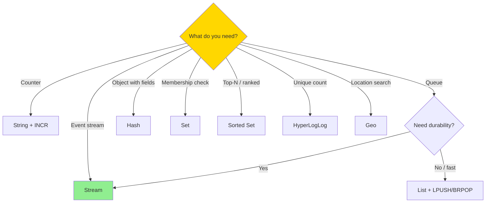

---

## 💾 Persistence: RDB, AOF, Hybrid

Redis is in-memory, but it can persist to disk. The choice of persistence mode is a durability/performance trade-off.

### RDB (Snapshots)

- Periodic point-in-time binary snapshots of the entire dataset.
- Triggered by `save` config (e.g., `save 900 1` = snapshot if ≥1 key changed in 900s) or manual `BGSAVE`.
- **Pros**: Compact, fast restart, low runtime cost (fork + copy-on-write writes the snapshot).
- **Cons**: Loses everything since the last snapshot on crash. Fork can momentarily double memory on heavy write workloads.

### AOF (Append-Only File)

- Every write command is appended to a log file.
- Sync policy controls durability:
  - `appendfsync always` — fsync every write (safest, slowest)
  - `appendfsync everysec` — fsync once per second (default; loses up to 1s on crash)
  - `appendfsync no` — let the OS decide (fastest, riskiest)
- AOF rewrites compact the log periodically.
- **Pros**: Strong durability with `everysec` or `always`.
- **Cons**: Larger files than RDB, slower startup (replay on boot).

### Hybrid Persistence (Modern Default)

Since Redis 4.0, AOF can begin with an RDB snapshot followed by AOF entries: best of both — fast restart from RDB, full durability from AOF tail.

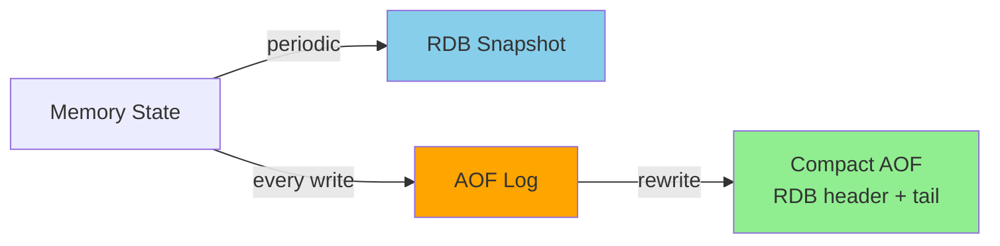

**Production recommendation**: AOF `everysec` + periodic RDB for backup. Pure cache use cases can disable both.

---

## 🔁 Replication and High Availability

Redis supports asynchronous primary-replica replication out of the box.

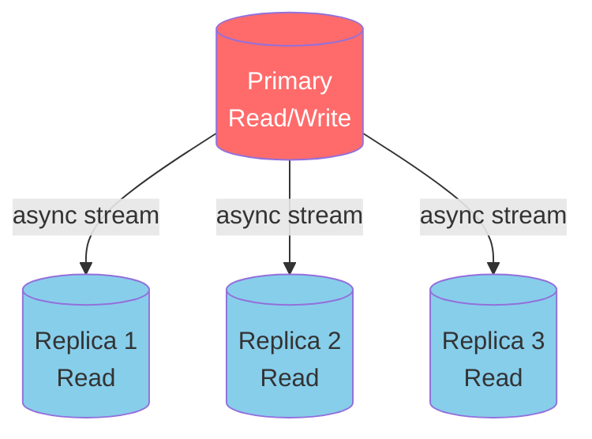

### Failover with Sentinel

Redis Sentinel is a separate process group that monitors primary/replica health and orchestrates failover.

- Sentinels gossip and form a quorum.
- When the primary is unreachable to a quorum of sentinels, they elect a new primary from the replicas.
- Clients use a sentinel-aware client library that asks "who is primary?" on reconnect.

### Replication Caveats

- **Async replication = potential data loss on failover.** Writes acknowledged by the primary that hadn't replicated yet are lost when the replica is promoted.
- **`WAIT` command** can force the primary to wait for N replicas to ack — but it's still best-effort, not synchronous replication.
- **Replicas can serve stale reads.** This is usually fine for cache use cases but can violate read-your-writes.

---

## 🧩 Redis Cluster: Sharding and Slots

Cluster mode shards the keyspace across multiple primary nodes using a fixed 16,384-slot ring.

```
slot = CRC16(key) mod 16384
```

Each primary owns a range of slots. Clients compute the slot client-side and route the request directly to the owning node.

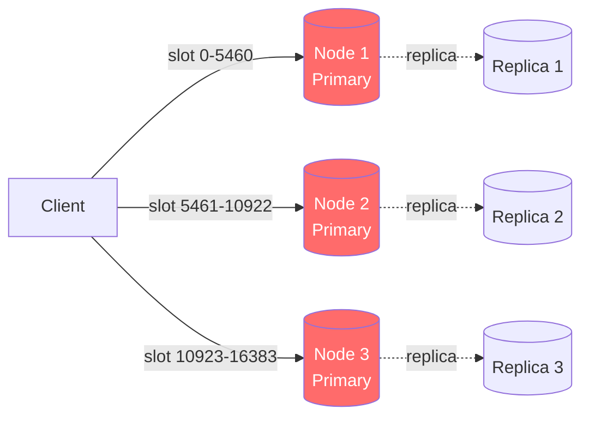

### Hash Tags

Multi-key commands (like `MGET k1 k2 k3` or Lua scripts referencing multiple keys) only work if all keys live on the same shard. **Hash tags** let you force colocation:

```
SET {user:123}:profile  ...
SET {user:123}:sessions ...
SET {user:123}:cart     ...
```

The substring inside `{...}` is what's hashed, so all three keys land on the same slot. Use this carefully — over-tagging defeats sharding.

### Resharding

Adding or removing nodes triggers slot migration. During migration, the client may receive an `ASK` redirect telling it to retry on the new owner. Cluster-aware clients handle this transparently.

---

## ⚛️ Atomicity Primitives: Transactions, WATCH, Lua

Redis offers three mechanisms for compound atomic operations, each with different trade-offs.

### MULTI / EXEC (Transactions)

Queues commands and runs them as one batch:

```
MULTI
INCR counter
LPUSH events "incremented"
EXEC
```

- Commands execute sequentially with no interleaving from other clients.
- **No rollback on logical failures** — Redis transactions are "all queued, all executed." If `INCR` fails because the key holds a string, the LPUSH still runs.
- Good for write-only batching, weak for read-modify-write logic.

### WATCH (Optimistic Locking / CAS)

`WATCH` marks one or more keys; if any are modified before `EXEC`, the transaction aborts.

```
WATCH balance
current = GET balance
if current >= amount:
    MULTI
    DECRBY balance amount
    EXEC   -- returns nil if balance was modified concurrently
else:
    UNWATCH
```

This is **optimistic concurrency**: retry on conflict, no locks held. Great for low-contention workloads, expensive under high contention (lots of retries).

### Lua Scripts (The Production Workhorse)

Lua scripts execute atomically — single-threaded Redis runs the entire script as one indivisible operation. This is the most powerful primitive Redis offers.

```lua
-- Atomic conditional decrement: only if balance >= amount
local current = tonumber(redis.call('GET', KEYS[1]))
if current >= tonumber(ARGV[1]) then
    return redis.call('DECRBY', KEYS[1], ARGV[1])
else
    return -1
end
```

Sent via `EVAL` (or `EVALSHA` after caching). Use Lua for:

- Atomic compare-and-set with arbitrary logic
- Multi-key atomic updates (rate limiters, distributed locks, bid arbitration)
- Avoiding round trips for compound operations

**Caveat**: A long-running Lua script blocks the entire server. Default `lua-time-limit` is 5 seconds; exceeding it returns `BUSY` to other clients but doesn't kill the script (only `SCRIPT KILL` does, and only if the script hasn't written yet).

---

## 🗑️ Eviction Policies and Memory Management

When `maxmemory` is hit, Redis must evict something to accept new writes. Eviction policy is set via `maxmemory-policy`.

| Policy | Behavior | Best For |
|---|---|---|
| `noeviction` | Reject writes with OOM error | Critical data, no overwrite acceptable |
| `allkeys-lru` | Evict approximate LRU across all keys | General-purpose cache |
| `allkeys-lfu` | Evict approximate LFU (least frequently used) | Skewed access patterns, long tails |
| `volatile-lru` | LRU among keys with TTL set | Mixed workload (some persistent, some cache) |
| `volatile-ttl` | Evict shortest remaining TTL first | Predictable expiry behavior |
| `allkeys-random` | Random eviction | Surprisingly OK under uniform workloads |

### Approximate, Not Exact, LRU

Redis does NOT maintain a global LRU list (would require a write on every access). Instead, on eviction it samples N keys (default 5, tunable via `maxmemory-samples`) and evicts the worst among them. Higher sample count → better accuracy → more CPU.

### TTL: Lazy + Active

- **Lazy expiration**: keys with expired TTL are deleted on next access.
- **Active expiration**: a background task samples 20 keys 10x/sec; if >25% are expired, it loops.

This means an expired key occupies memory until either is accessed or sampled.

---

## 🌊 Deep Dive 1: Stale-While-Revalidate (SWR) with Redis

**Stale-While-Revalidate (SWR)** is a caching pattern where the cache returns stale data immediately while asynchronously refreshing it in the background. It originates from HTTP `Cache-Control: stale-while-revalidate=N` and is the gold standard for low-latency, high-availability caching.

### The Problem SWR Solves

Standard cache-aside has a brutal failure mode under cache miss:

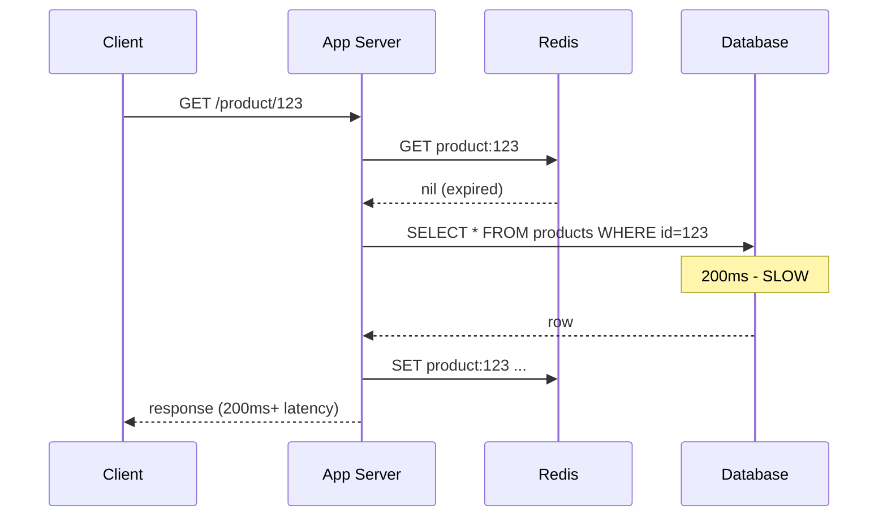

When 1,000 clients miss simultaneously on the same expired key (the *thundering herd*), all 1,000 hit the database. SWR breaks this: stale data is served instantly while a single background refresh updates the cache.

### SWR with Redis: The Pattern

Store both the value and its freshness deadline. Treat the value as valid for `t_fresh`, stale-but-usable until `t_stale`, and dead after.

```
Key: product:123
Value: {
  "data": { ... product json ... },
  "fresh_until": 1735000000,   -- e.g., now + 60s
  "stale_until": 1735001800    -- e.g., now + 30min
}
```

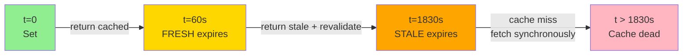

### Implementation Sketch

```python
def get_with_swr(key, fetch_fn, fresh_ttl=60, stale_ttl=1800):
    raw = redis.get(key)
    now = time.time()

    if raw is None:
        # Cold miss — synchronous load with single-flight lock
        return load_with_single_flight(key, fetch_fn, fresh_ttl, stale_ttl)

    entry = json.loads(raw)

    if now < entry["fresh_until"]:
        # FRESH — return as is
        return entry["data"]

    if now < entry["stale_until"]:
        # STALE — return stale, trigger async refresh
        async_revalidate(key, fetch_fn, fresh_ttl, stale_ttl)
        return entry["data"]

    # DEAD — synchronous reload
    return load_with_single_flight(key, fetch_fn, fresh_ttl, stale_ttl)
```

### Critical Component: Single-Flight to Prevent Refresh Stampedes

If 1,000 requests trigger `async_revalidate` simultaneously, you get 1,000 background fetches. Use a Redis-based mutex per key:

```lua
-- Try to acquire revalidation lock; only one client wins
-- KEYS[1] = "lock:revalidate:product:123"
-- ARGV[1] = lock TTL (e.g., 30s)
return redis.call('SET', KEYS[1], '1', 'NX', 'PX', ARGV[1])
```

Only the lock-winner triggers the actual refresh. Others see stale data this round, fresh data next.

### Pub/Sub Notification: Push vs Pull Revalidation

The above is **pull-based SWR**: the next reader checks freshness and triggers refresh. There's also **push-based SWR** using Pub/Sub:

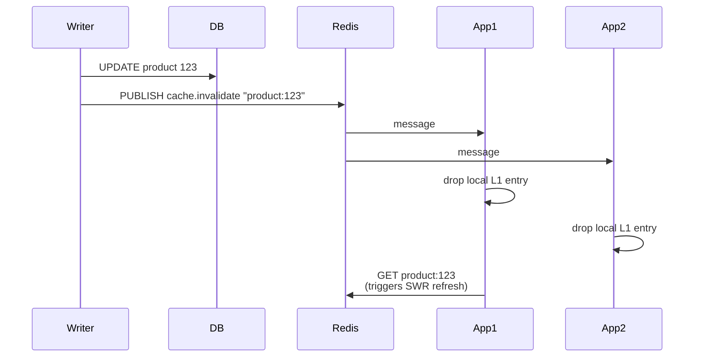

This combines:
1. **L1 (in-process) cache** for sub-millisecond reads
2. **L2 (Redis) cache** for shared state
3. **Pub/Sub invalidation** to notify L1 caches of L2 changes

Combined with SWR semantics on L2, you get a near-CDN-quality multi-tier cache.

### Why SWR Wins Over Plain TTL

| Scenario | Plain TTL | SWR |
|---|---|---|
| **Hot key expires** | Thundering herd to DB | Single background refresh |
| **DB momentarily slow** | All readers wait for DB | Readers see stale data, no impact |
| **DB temporarily down** | Cache misses fail | Stale data served until `stale_until` |
| **p99 latency under spike** | Spikes to DB latency | Stays at Redis latency |

**SWR trades a bounded staleness window (`stale_until - fresh_until`) for dramatically better availability and tail latency.** This is almost always the right trade-off for read-heavy workloads.

### Production Refinements

- **Probabilistic early expiration** (XFetch algorithm): trigger refresh probabilistically as freshness deadline approaches, smoothing the refresh load instead of bunching it.
- **Negative caching with shorter TTL**: cache "not found" results too, but with tighter freshness, to absorb 404 storms.
- **Per-tier circuit breaker**: if revalidation fails, extend `stale_until` automatically — preferable to surfacing the failure to users.

---

## 📡 Deep Dive 2: Pub/Sub — Mechanics, Pitfalls, and Streams

Redis Pub/Sub is the simplest possible messaging primitive: publishers send to channels, subscribers receive. It's blazingly fast and correspondingly limited.

### How Pub/Sub Works

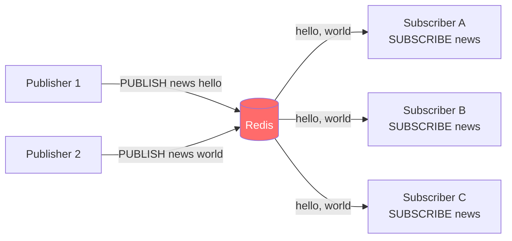

- `PUBLISH channel msg` — pushes to all currently subscribed clients.
- `SUBSCRIBE channel [channel ...]` — receives messages until unsubscribed.
- `PSUBSCRIBE pattern` — pattern-matching subscribe (`news.*`).

### The Brutal Limitations

**1. Fire-and-forget. No durability.** If a subscriber is disconnected when a message is published, **the message is lost forever**. There's no replay, no offset, no consumer group.

**2. No backpressure.** A slow subscriber's outbound buffer grows. When it exceeds `client-output-buffer-limit pubsub`, the subscriber is forcibly disconnected — and then misses everything until reconnect.

**3. No ack, no delivery guarantee.** Redis tries best-effort delivery. Network blips drop messages.

**4. Pub/Sub bypasses cluster sharding.** In Redis Cluster, `PUBLISH` is broadcast to all nodes. Every publish is replicated cluster-wide. Adding nodes does NOT scale out pub/sub throughput. (Redis 7 added "sharded pub/sub" with `SPUBLISH`/`SSUBSCRIBE` to fix this.)

**5. Subscribers occupy a connection slot indefinitely.** A SUBSCRIBE'd client cannot issue normal commands. You need a separate connection for subscription vs request/reply.

### When Pub/Sub Is the Right Tool

✅ **Cache invalidation broadcasts** — losing one notification is acceptable; the next read fixes it.
✅ **Real-time UI updates** — chat presence, score updates, low-stakes notifications.
✅ **Inter-process signaling** — config reload notifications, shutdown signals.

### When You Need Streams Instead

❌ **Durable event delivery** — payments, audit logs, anything you cannot lose.
❌ **Consumer groups** — multiple workers competing for messages with at-least-once delivery.
❌ **Replay / offset semantics** — "process all events since ID X."

### Redis Streams: The Durable Pub/Sub Replacement

`XADD` / `XREAD` / `XGROUP` / `XACK` give you a Kafka-lite primitive inside Redis:

```
XADD mystream * type "order_placed" id "1234" amount "29.99"
   -> 1735000000-0   (auto-generated stream ID)

XGROUP CREATE mystream workers $ MKSTREAM
XREADGROUP GROUP workers worker-1 COUNT 10 BLOCK 5000 STREAMS mystream >

   -> [(stream_id, fields)...]

XACK mystream workers 1735000000-0
```

| Feature | Pub/Sub | Streams |
|---|---|---|
| Durability | None | Persistent (RDB+AOF) |
| Consumer groups | No | Yes (XGROUP) |
| At-least-once | No | Yes (XACK + Pending list) |
| Replay | No | Yes (XRANGE / XREAD with offset) |
| Memory cost | Zero (no buffer) | Linear in stream length |
| Use case | Best-effort signaling | Durable event log |

### The Pub/Sub + Polling Hybrid

A common production pattern: use Pub/Sub for low-latency wake-up + a durable store for actual data.

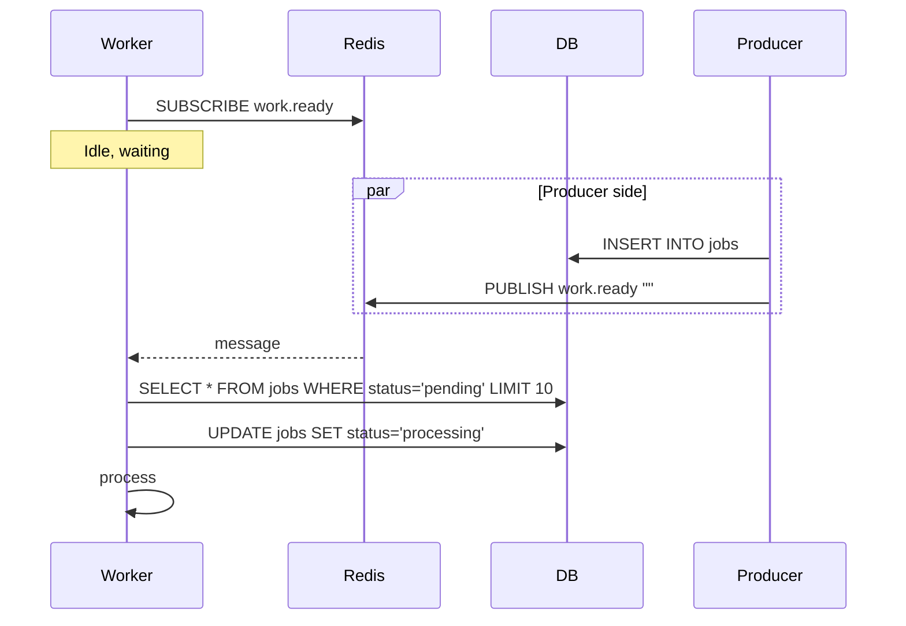

The pub/sub message is just a "tap on the shoulder." The actual job lives in the durable store. Lost pub/sub message? Worker eventually polls anyway, just with higher latency. Best of both worlds.

### Sharded Pub/Sub (Redis 7+)

`SPUBLISH` and `SSUBSCRIBE` route by hash slot like normal keys. This means:

- Adding cluster nodes scales out pub/sub throughput.
- A channel is owned by one shard — no cluster-wide broadcast.
- Subscribers must connect to the owning shard.

If you're starting fresh on Redis 7+ Cluster and need pub/sub at scale, use sharded pub/sub.

---

## 🔢 Deep Dive 3: Version Increments and Cache Invalidation Patterns

Cache invalidation is famously hard. Version increments are a clean, race-free pattern that sidesteps most of the headaches.

### The Naive Approach (and Why It Fails)

```python
# WRONG: race condition between DB write and cache delete
db.update(product_id=123, name="New Name")
redis.delete(f"product:{123}")
```

**Race scenario:**
1. App A reads `product:123` from cache → sees old value, starts processing.
2. App B updates DB and `DELETE`s the cache key.
3. App A finishes its read-modify-write, calls `SET product:123` with the *old* value.
4. Cache is now stale forever (or until next TTL).

This is the classic **read-fills-stale-after-delete** race. It's subtle and you can ship it for years before noticing.

### The Version Key Pattern

Instead of mutating the cache key directly, use a version namespace:

```
product:123:v3   -> { ...current data... }
product:123:ver  -> 3
```

Read:
```
ver = GET product:123:ver
data = GET product:123:v{ver}
```

Invalidate:
```
INCR product:123:ver
```

After invalidation, all readers compute a new key and miss the cache, falling back to the source of truth. The old `product:123:v3` entry is orphaned and will be evicted by LRU/TTL.

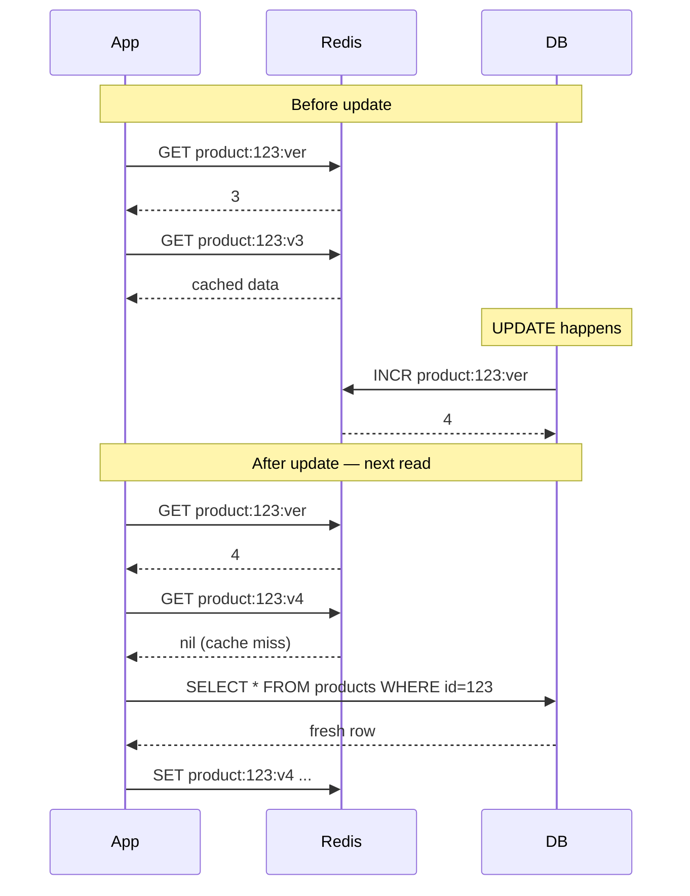

### Why This Works

- **No race window.** The version increment atomically invalidates the cache. Any read after the increment sees `v4` and either finds fresh data or misses cleanly.
- **Atomic via `INCR`.** Single-threaded Redis guarantees increment is race-free.
- **Old versioned keys age out.** They're not deleted explicitly; LRU and TTL clean them up over time.
- **Cheap.** A single `INCR` per write, regardless of the cached value's size.

### Variant 1: Versioned Hash Tags for Cluster

In Redis Cluster, `GET product:123:ver` and `GET product:123:v3` could land on different shards. Force colocation with a hash tag:

```
{product:123}:ver
{product:123}:v3
```

Now both keys hash to the same slot, allowing batched reads (`MGET`) and atomic Lua scripts.

### Variant 2: Embedded Version (Single Round Trip)

Two GETs per read is wasteful. Embed the version in the value and do a single GET:

```
{product:123}:cache  -> { "ver": 3, "data": { ... } }
{product:123}:ver    -> 3
```

Read:
```python
# Single round trip, optimistic
cached = redis.get("{product:123}:cache")
expected_ver = redis.get("{product:123}:ver")

if cached and json.loads(cached)["ver"] == int(expected_ver):
    return json.loads(cached)["data"]
# Else: cache miss, refetch
```

Or pipeline both GETs to make it one network round trip.

### Variant 3: Atomic Compare-and-Set with Lua

To safely SET only if version matches (avoiding writing stale data after a concurrent update):

```lua
-- KEYS[1] = cache key, KEYS[2] = version key
-- ARGV[1] = expected version, ARGV[2] = new value, ARGV[3] = ttl
local current_ver = redis.call('GET', KEYS[2])
if current_ver == ARGV[1] then
    redis.call('SET', KEYS[1], ARGV[2], 'EX', ARGV[3])
    return 1
else
    return 0
end
```

App calls this after computing fresh data:
1. Read `ver = N`.
2. Fetch from DB.
3. CAS-set cache: only commit if `ver` is still `N`.
4. If `ver` advanced to `N+1` mid-fetch, our data is stale and we don't write it.

This eliminates the "stale write after invalidation" race entirely.

### Variant 4: Pub/Sub-Driven Multi-Tier Invalidation

For multi-tier caches (L1 in-process + L2 Redis), the version pattern combined with pub/sub propagation gives near-instant cross-process invalidation:

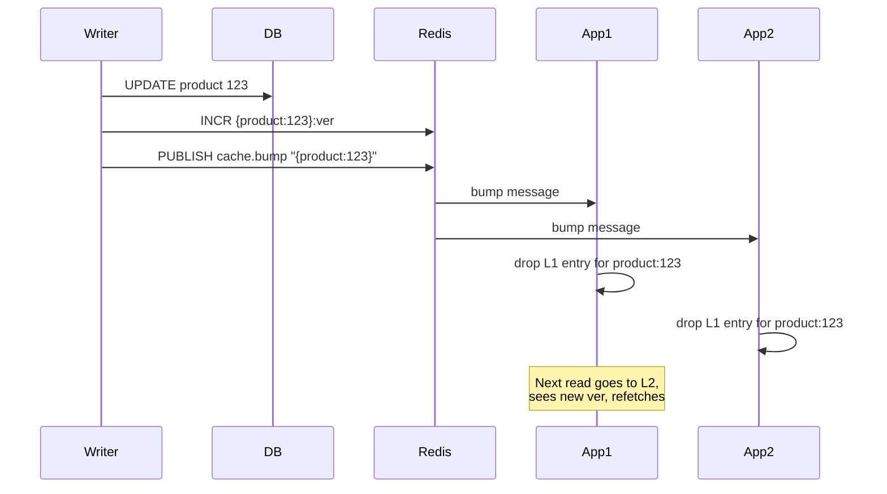

The pub/sub message tells L1 caches to drop their entry. The Redis version key is the durable source of truth — even if pub/sub drops the message, the next L1 miss will read the current version from Redis and behave correctly.

### Variant 5: Bulk Invalidation via Tag Versions

For "invalidate all caches for category X" semantics:

```
category:electronics:ver  -> 7

product:123:cache_key = hash("product:123" + ":" + ver_for_each_tag(...))
```

Bumping the category version invalidates all products tagged with it in one operation. This is how Rails' Russian-doll caching and Fastly's surrogate keys work under the hood.

### Comparison: When to Use Each Invalidation Strategy

| Strategy | Race-Safe? | Complexity | Best For |
|---|---|---|---|
| **TTL only** | Eventually (bounded by TTL) | Trivial | Low-update-rate data, tolerable staleness |
| **DELETE on write** | NO (race window) | Low | Don't use this; it has subtle bugs |
| **Version increment** | Yes | Medium | High-update-rate data, no staleness tolerance |
| **CAS via Lua** | Yes | Higher | Concurrent writers competing for the cache |
| **CDC-based invalidation** | Yes | Highest | Multi-system invalidation, source-of-truth tail |

**Default to version increments for any cache that gets invalidated programmatically.** TTL-only is fine for low-stakes data; version increments are the correct primitive for everything else.

---

## 🛠️ Common Production Patterns

### Distributed Lock (Redlock-lite)

```lua
-- Acquire: SET lock:resource <random_token> NX PX 30000
-- Release (atomic check-and-delete):
if redis.call('GET', KEYS[1]) == ARGV[1] then
    return redis.call('DEL', KEYS[1])
else
    return 0
end
```

Always use a random token; never `DEL` blindly (you might delete someone else's lock after expiry).

### Rate Limiter (Token Bucket via Lua)

```lua
-- KEYS[1] = bucket key, ARGV[1] = capacity, ARGV[2] = refill rate, ARGV[3] = now
local bucket = redis.call('HMGET', KEYS[1], 'tokens', 'updated')
local tokens = tonumber(bucket[1]) or tonumber(ARGV[1])
local updated = tonumber(bucket[2]) or tonumber(ARGV[3])
local elapsed = tonumber(ARGV[3]) - updated
local refill = elapsed * tonumber(ARGV[2])
tokens = math.min(tonumber(ARGV[1]), tokens + refill)

if tokens >= 1 then
    tokens = tokens - 1
    redis.call('HMSET', KEYS[1], 'tokens', tokens, 'updated', ARGV[3])
    return 1   -- allowed
else
    return 0   -- rejected
end
```

### Leaderboard (Sorted Set)

```
ZADD leaderboard 1500 user:alice
ZADD leaderboard 1800 user:bob

ZREVRANGE leaderboard 0 9 WITHSCORES   -- top 10
ZRANK leaderboard user:alice           -- alice's rank
```

### Session Store (Hash + EXPIRE)

```
HSET session:abc123 user_id 42 created_at ...
EXPIRE session:abc123 1800
```

### Counter with Periodic Flush

```
INCR pageviews:product:123
-- Background job: read counter, write to DB, reset
```

### Geo Search

```
GEOADD drivers 37.7749 -122.4194 driver:1
GEOSEARCH drivers FROMLONLAT -122.42 37.77 BYRADIUS 5 km ASC COUNT 10
```

---

## 🧙 Insider Tips and Tricks

### Approximate LRU Is Not Real LRU
Redis samples 5 keys (default) and evicts the worst. A key accessed 60 seconds ago can survive while a 55-second-old one gets evicted, depending on which keys were sampled. Bump `maxmemory-samples` to 10+ if you need closer-to-true LRU; the trade-off is more CPU per eviction.

### `KEYS *` Will Take Down Your Production Cluster
`KEYS` blocks the single thread for the entire scan. On a 10M-key cluster, this means seconds of unavailability for *all* commands. Use `SCAN` with cursors, or maintain a separate index of keys you care about. The same applies to `HGETALL`, `SMEMBERS`, and `LRANGE 0 -1` on large structures.

### Pipelining Is the Cheapest Latency Win You'll Ever Get
A single GET round-trips at ~0.5ms; 10 sequential GETs round-trip at 5ms. Pipelining sends all 10 commands in one network packet and reads 10 responses back-to-back, taking ~0.6ms total. Most clients support pipelining trivially. **If your code does 5+ Redis calls in a row, pipeline them.**

### Lua Scripts Beat WATCH/MULTI for Most CAS Patterns
WATCH/MULTI requires a network round-trip per attempt and retries on contention. A Lua script does the same logic atomically in a single round-trip with no retry. Unless you need to cancel based on application logic between WATCH and MULTI, prefer Lua.

### Connection Pool Sizing Is Often Wrong
Most production Redis problems trace to either too few connections (queue depth piles up at the client) or too many (Redis spends CPU on connection handshakes and the kernel on socket overhead). Monitor `client_recent_max_input_buffer` and `tcp_backlog`. A typical good range: 5-20 connections per app server, scaled per CPU core.

### `DEBUG SLEEP` Is the Best Tool You're Not Using in Staging
`DEBUG SLEEP 5` blocks the server for 5 seconds. Use it in staging to verify your client's failover behavior, timeout handling, and circuit breakers actually work. Most apps fail in surprising ways when Redis becomes briefly unresponsive.

### Hash Tag Over-Use Defeats Cluster Sharding
Hash tags (`{user:123}:cart`) force colocation, which is necessary for multi-key Lua scripts. But if you tag *everything* with the same tag, all your data lands on one shard. Use hash tags only for keys that genuinely need atomic multi-key operations.

### `redis-cli --bigkeys` Finds Your Memory Hot Spots
This scans the keyspace and reports the largest keys per type. Run it during incident analysis when memory is unexpectedly high — there's almost always a runaway list, set, or hash that grew unbounded. Combine with `redis-cli --memkeys` for memory-by-key sampling.

### Pub/Sub in Cluster Mode Is a Trap
Classic `PUBLISH` broadcasts to every node in the cluster. Adding nodes does NOT scale out pub/sub throughput; it makes it *worse* because every publish replicates everywhere. If you're on Redis 7+, use sharded pub/sub (`SPUBLISH`/`SSUBSCRIBE`). Otherwise, consider Streams or an external broker (Kafka, NATS) for high-throughput messaging.

### Forking for RDB Snapshots Can Double Memory Briefly
`BGSAVE` forks the process. Linux's copy-on-write means the fork starts cheap, but as the parent writes pages, those pages get duplicated. On a write-heavy 100GB Redis, the fork can briefly use 150-200GB. Provision RAM for the worst case or disable RDB and rely on AOF + replicas.

### `appendfsync everysec` Officially Loses Up to 1 Second
Redis docs state `everysec` "may lose 1 second of data if there is a disaster." The mechanism: fsync runs in a background thread once per second. In practice, if the disk is unusually slow and the background fsync takes longer than 1s to complete, the worst-case loss can drift higher — but the documented guarantee is 1s. For tighter durability, use `always` (slow) or replicate to a second AZ and treat ACK-after-replication as your durability boundary.

### Slow Log Is Your Best Postmortem Friend
`SLOWLOG GET 100` returns the 100 slowest commands. Configure `slowlog-log-slower-than 10000` (microseconds) to capture anything >10ms. Always check the slow log first when investigating latency spikes — it's almost always a `KEYS`, `HGETALL`, or pathological Lua script.

### Use `EXPIREAT` Instead of `EXPIRE` for Synchronization
`EXPIRE key 60` schedules expiry 60 seconds from "now" (server's now). If you set the same TTL on multiple keys at slightly different times, they expire at different absolute moments. `EXPIREAT key <unix_ts>` schedules to a specific wall-clock time, useful for synchronizing batch expirations or implementing daily-reset counters.

---

## 🎯 Conclusion

Redis is deceptively simple: a single-threaded event loop serving in-memory data structures over a tiny protocol. The simplicity is what makes it fast, and the trade-offs that simplicity demands are what trip up engineers who treat it as a magic key/value box.

The three patterns this document goes deep on — **stale-while-revalidate**, **pub/sub**, and **version increments** — are the ones that separate a working Redis integration from a *resilient* one:

- **SWR** trades a bounded staleness window for huge gains in tail latency and availability under cache misses and origin slowness.
- **Pub/Sub** is the right primitive for fire-and-forget signaling, but switching to **Streams** is mandatory the moment you need durability or consumer groups.
- **Version increments** eliminate the cache-invalidation race conditions that plain `DELETE` quietly suffers from.

When designing with Redis, internalize three rules:

1. **Every command competes for one thread.** Slow commands hurt everyone.
2. **Async replication means data loss on failover.** Plan for it.
3. **Atomicity is via Lua, not transactions.** Reach for Lua when you need compound atomic logic.

Master those, and Redis becomes the most reliable performance lever in your stack.
