# 🔀 Sharding

> **Core Concept**: Sharding is horizontal partitioning across multiple machines. When a single database can't handle your scale, you split data across multiple independent databases to increase storage capacity and throughput.

## 📋 Table of Contents
- [Overview](#overview)
- [Partitioning vs Sharding](#partitioning-vs-sharding)
- [How to Shard Your Data](#how-to-shard-your-data)
- [Sharding Strategies](#sharding-strategies)
- [Challenges of Sharding](#challenges-of-sharding)
- [Sharding in Modern Databases](#sharding-in-modern-databases)
- [Interview Strategy](#interview-strategy)
- [Conclusion](#conclusion)

---

## 🎯 Overview

### The Scaling Problem

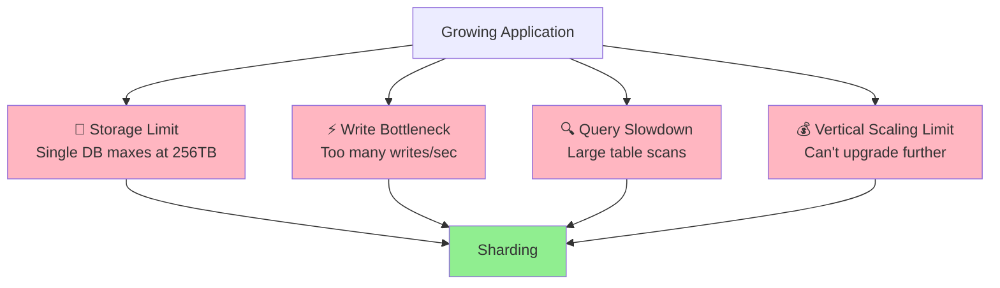
```mermaid
graph TB
    START[Growing Application]
    
    START --> PROB1[💾 Storage Limit<br/>Single DB maxes at 256TB]
    START --> PROB2[⚡ Write Bottleneck<br/>Too many writes/sec]
    START --> PROB3[🔍 Query Slowdown<br/>Large table scans]
    START --> PROB4[💰 Vertical Scaling Limit<br/>Can't upgrade further]
    
    PROB1 --> SOLUTION[Sharding]
    PROB2 --> SOLUTION
    PROB3 --> SOLUTION
    PROB4 --> SOLUTION
    
    style PROB1 fill:#FFB6C1
    style PROB2 fill:#FFB6C1
    style PROB3 fill:#FFB6C1
    style PROB4 fill:#FFB6C1
    style SOLUTION fill:#90EE90
```

### Evolution of Database Scaling

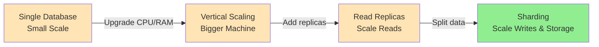
```mermaid
graph LR
    SINGLE[Single Database<br/>Small Scale]
    VERTICAL[Vertical Scaling<br/>Bigger Machine]
    REPLICAS[Read Replicas<br/>Scale Reads]
    SHARD[Sharding<br/>Scale Writes & Storage]
    
    SINGLE -->|Upgrade CPU/RAM| VERTICAL
    VERTICAL -->|Add replicas| REPLICAS
    REPLICAS -->|Split data| SHARD
    
    style SINGLE fill:#FFE4B5
    style VERTICAL fill:#FFE4B5
    style REPLICAS fill:#FFE4B5
    style SHARD fill:#90EE90
```

---

## 🧒 Layman's Explanation

Imagine you have a **giant phone book** so heavy you can't lift it. The obvious fix: split it by first letter. A–F goes into Volume 1, G–M into Volume 2, N–S into Volume 3, T–Z into Volume 4. Each volume is now thin enough to use. To find someone, you first decide which volume to grab — that "decide which volume" step is the **routing layer**, and each volume is a **shard**.

Now picture a **massive city library split into branches by zip code**. Each branch holds the books for one neighborhood. Looking up a book card (a query) goes straight to the local branch — fast and cheap. But if a book in your branch references a book in another branch (a cross-shard join), a librarian has to call across town and arrange an inter-branch loan — slow and inconvenient. This is exactly why you design your shards to **keep related data together**: a user's profile, their orders, and their messages should ideally live in the same branch.

A third way to see it: a **restaurant kitchen with specialized stations**. The grill station handles all grill orders, the salad station all salads, the pastry station all desserts. Each station scales independently — adding two more grills doesn't change anything about how the salad station works. That's the magic of horizontal scaling: each shard is its own little kitchen with its own CPU, memory, and storage.

### The Hot Shard Problem

Now imagine that **80% of phone book lookups were for the last name "Smith"**. Volume 3 (N–S) gets absolutely slammed while Volume 1 (A–F, with very few Smiths) sits idle, gathering dust. Splitting the book "fairly" by alphabet didn't actually split the **work** fairly — because the workload was skewed.

This is the **hot shard problem**, and it's why you can't always shard by the obvious key. If you shard a social network by `country`, the US shard melts while the Liechtenstein shard naps. If you shard messages by `created_at`, today's shard is on fire while last year's is frozen. You have to shard by something that distributes both **the data AND the traffic** evenly.

### When the analogy breaks down

The phone book analogy starts to crack when Volume 3 grows too thick and you need to split it into 3a (N–P) and 3b (Q–S). With a real book, you just print two new volumes overnight. With a sharded database, you have to **re-shard live** — moving millions of rows from one machine to another **without taking the library offline**, while customers are actively borrowing books, returning books, and adding new ones. Every "page" you move has to be tracked so in-flight lookups don't see stale data. This is dramatically harder than re-shelving books, and it's why choosing the right shard key upfront matters so much — and why tools like consistent hashing and over-sharding exist.

---

## 📊 Partitioning vs Sharding

### Partitioning (Single Machine)

> **Definition**: Splitting a large table into smaller pieces within a single database instance

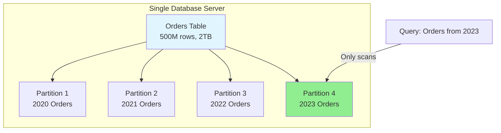
```mermaid
graph TB
    subgraph "Single Database Server"
        TABLE[Orders Table<br/>500M rows, 2TB]
        
        TABLE --> P1[Partition 1<br/>2020 Orders]
        TABLE --> P2[Partition 2<br/>2021 Orders]
        TABLE --> P3[Partition 3<br/>2022 Orders]
        TABLE --> P4[Partition 4<br/>2023 Orders]
    end
    
    QUERY[Query: Orders from 2023]
    QUERY -->|Only scans| P4
    
    style TABLE fill:#e1f5ff
    style P4 fill:#90EE90
```

#### Horizontal Partitioning

**Split rows**: Same columns, fewer rows per partition

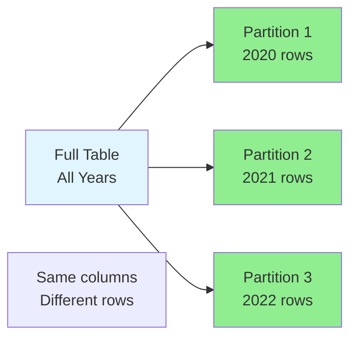
```mermaid
graph LR
    FULL[Full Table<br/>All Years]
    
    FULL --> H1[Partition 1<br/>2020 rows]
    FULL --> H2[Partition 2<br/>2021 rows]
    FULL --> H3[Partition 3<br/>2022 rows]
    
    NOTE[Same columns<br/>Different rows]
    
    style FULL fill:#e1f5ff
    style H1 fill:#90EE90
    style H2 fill:#90EE90
    style H3 fill:#90EE90
```

#### Vertical Partitioning

**Split columns**: Same rows, fewer columns per partition

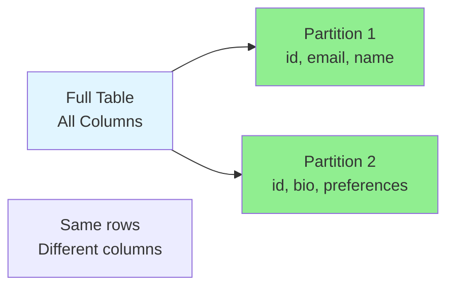
```mermaid
graph LR
    FULL[Full Table<br/>All Columns]
    
    FULL --> V1[Partition 1<br/>id, email, name]
    FULL --> V2[Partition 2<br/>id, bio, preferences]
    
    NOTE[Same rows<br/>Different columns]
    
    style FULL fill:#e1f5ff
    style V1 fill:#90EE90
    style V2 fill:#90EE90
```

**Benefits**:
- ✅ Faster queries (scan less data)
- ✅ Easier maintenance (smaller indexes)
- ✅ Better performance (parallel operations)

**Limitation**: Still on one machine - doesn't solve storage/throughput limits

---

### Sharding (Multiple Machines)

> **Definition**: Horizontal partitioning across multiple independent database servers

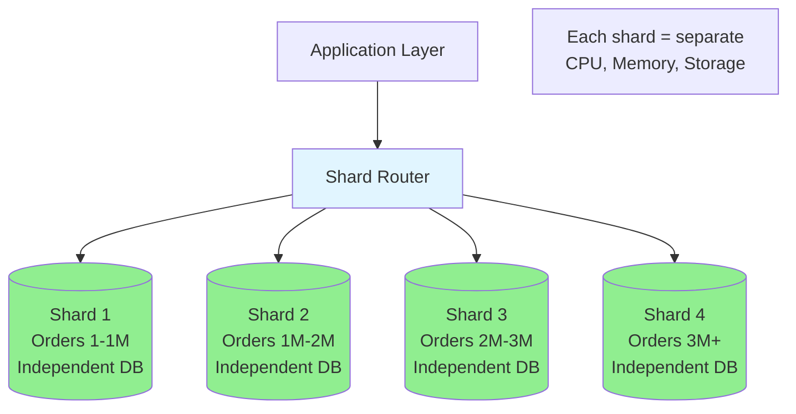
```mermaid
graph TB
    APP[Application Layer]
    ROUTER[Shard Router]
    
    APP --> ROUTER
    
    ROUTER --> S1[(Shard 1<br/>Orders 1-1M<br/>Independent DB)]
    ROUTER --> S2[(Shard 2<br/>Orders 1M-2M<br/>Independent DB)]
    ROUTER --> S3[(Shard 3<br/>Orders 2M-3M<br/>Independent DB)]
    ROUTER --> S4[(Shard 4<br/>Orders 3M+<br/>Independent DB)]
    
    NOTE[Each shard = separate<br/>CPU, Memory, Storage]
    
    style ROUTER fill:#e1f5ff
    style S1 fill:#90EE90
    style S2 fill:#90EE90
    style S3 fill:#90EE90
    style S4 fill:#90EE90
```

**Key Difference**:

| Aspect | Partitioning | Sharding |
|--------|--------------|----------|
| **Location** | Single machine | Multiple machines |
| **Independence** | Logical split | Physical split |
| **Scalability** | Limited by one machine | Scales horizontally |
| **Complexity** | Low | High |
| **Storage** | One pool | Multiple pools |
| **Throughput** | One machine's limit | Multiplied across shards |

---

## 🔑 How to Shard Your Data

### Choosing Your Shard Key

> **Critical Decision**: The shard key determines data distribution and query patterns

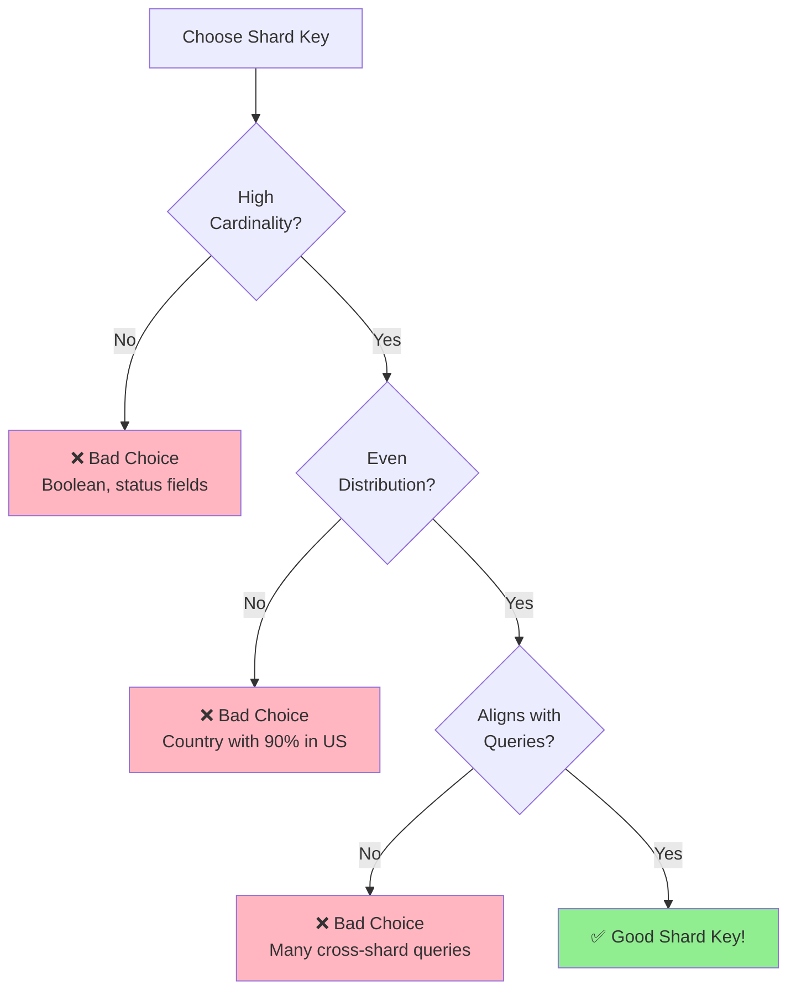
```mermaid
flowchart TB
    START[Choose Shard Key]
    
    START --> Q1{High<br/>Cardinality?}
    Q1 -->|No| BAD1[❌ Bad Choice<br/>Boolean, status fields]
    Q1 -->|Yes| Q2{Even<br/>Distribution?}
    
    Q2 -->|No| BAD2[❌ Bad Choice<br/>Country with 90% in US]
    Q2 -->|Yes| Q3{Aligns with<br/>Queries?}
    
    Q3 -->|No| BAD3[❌ Bad Choice<br/>Many cross-shard queries]
    Q3 -->|Yes| GOOD[✅ Good Shard Key!]
    
    style BAD1 fill:#FFB6C1
    style BAD2 fill:#FFB6C1
    style BAD3 fill:#FFB6C1
    style GOOD fill:#90EE90
```

#### Characteristics of Good Shard Keys

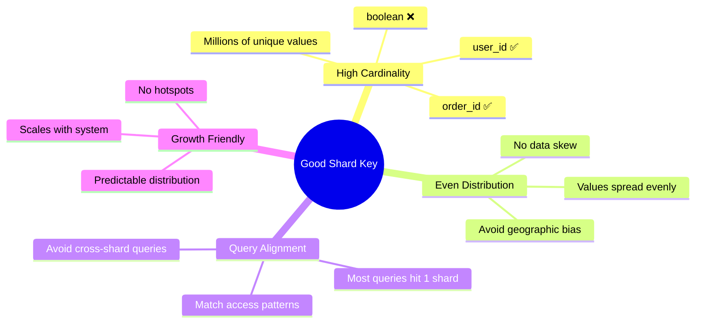
```mermaid
mindmap
    root((Good Shard Key))
        High Cardinality
            Millions of unique values
            user_id ✅
            order_id ✅
            boolean ❌
        Even Distribution
            No data skew
            Values spread evenly
            Avoid geographic bias
        Query Alignment
            Most queries hit 1 shard
            Avoid cross-shard queries
            Match access patterns
        Growth Friendly
            Scales with system
            No hotspots
            Predictable distribution
```

#### Good Shard Key Examples

**🟢 user_id for User-Centric App**:
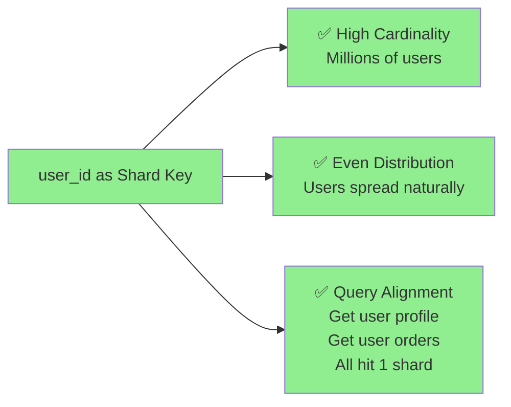
```mermaid
graph LR
    KEY[user_id as Shard Key]
    
    KEY --> C1[✅ High Cardinality<br/>Millions of users]
    KEY --> C2[✅ Even Distribution<br/>Users spread naturally]
    KEY --> C3[✅ Query Alignment<br/>Get user profile<br/>Get user orders<br/>All hit 1 shard]
    
    style KEY fill:#90EE90
    style C1 fill:#90EE90
    style C2 fill:#90EE90
    style C3 fill:#90EE90
```

**🟢 order_id for E-commerce**:
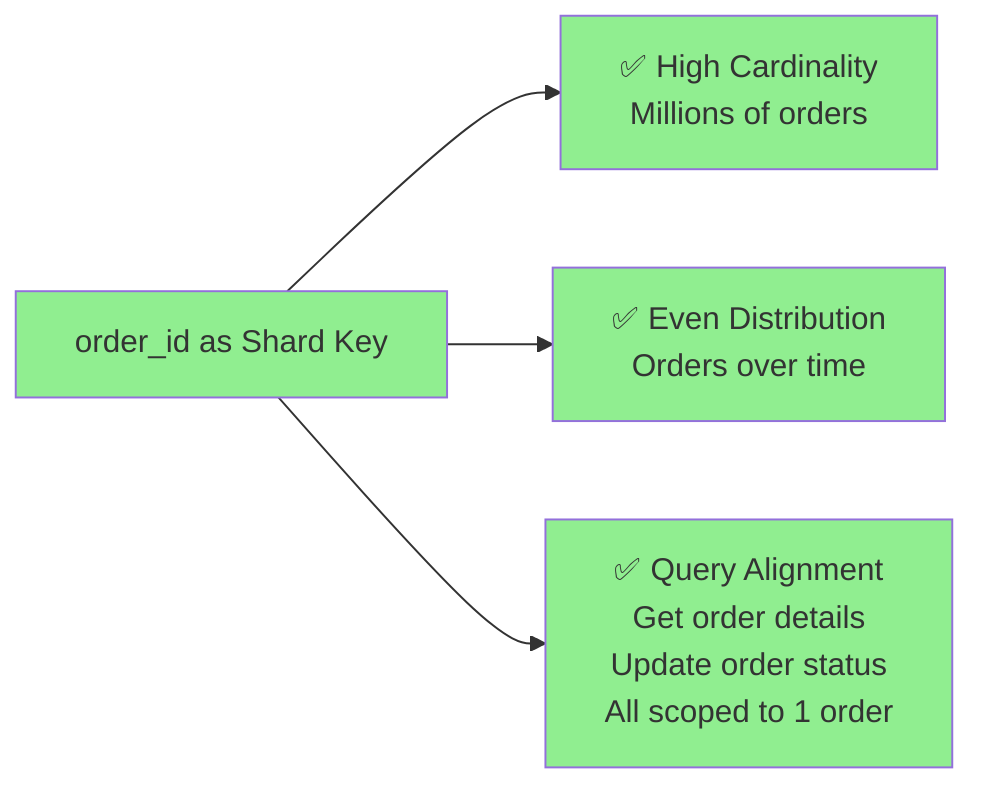
```mermaid
graph LR
    KEY[order_id as Shard Key]
    
    KEY --> C1[✅ High Cardinality<br/>Millions of orders]
    KEY --> C2[✅ Even Distribution<br/>Orders over time]
    KEY --> C3[✅ Query Alignment<br/>Get order details<br/>Update order status<br/>All scoped to 1 order]
    
    style KEY fill:#90EE90
    style C1 fill:#90EE90
    style C2 fill:#90EE90
    style C3 fill:#90EE90
```

#### Bad Shard Key Examples

**🔴 is_premium (Boolean)**:
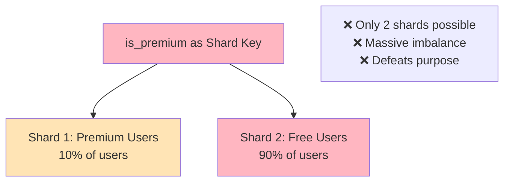
```mermaid
graph TB
    KEY[is_premium as Shard Key]
    
    KEY --> S1[Shard 1: Premium Users<br/>10% of users]
    KEY --> S2[Shard 2: Free Users<br/>90% of users]
    
    NOTE[❌ Only 2 shards possible<br/>❌ Massive imbalance<br/>❌ Defeats purpose]
    
    style KEY fill:#FFB6C1
    style S1 fill:#FFE4B5
    style S2 fill:#FFB6C1
```

**🔴 created_at for Growing Table**:
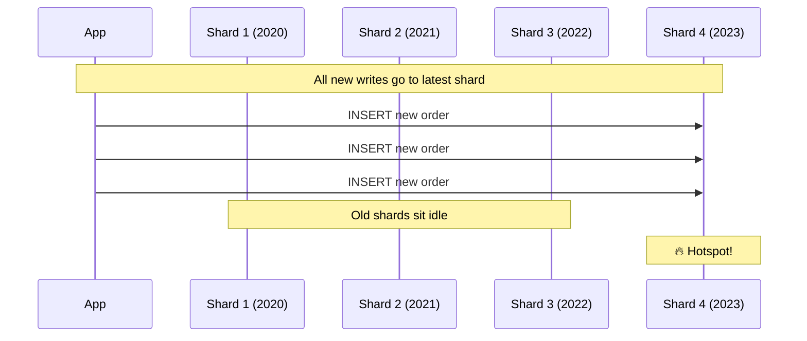
```mermaid
sequenceDiagram
    participant App
    participant S1 as Shard 1 (2020)
    participant S2 as Shard 2 (2021)
    participant S3 as Shard 3 (2022)
    participant S4 as Shard 4 (2023)
    
    Note over App,S4: All new writes go to latest shard
    
    App->>S4: INSERT new order
    App->>S4: INSERT new order
    App->>S4: INSERT new order
    
    Note over S1,S3: Old shards sit idle
    Note over S4: 🔥 Hotspot!
```

---

## 🎯 Sharding Strategies

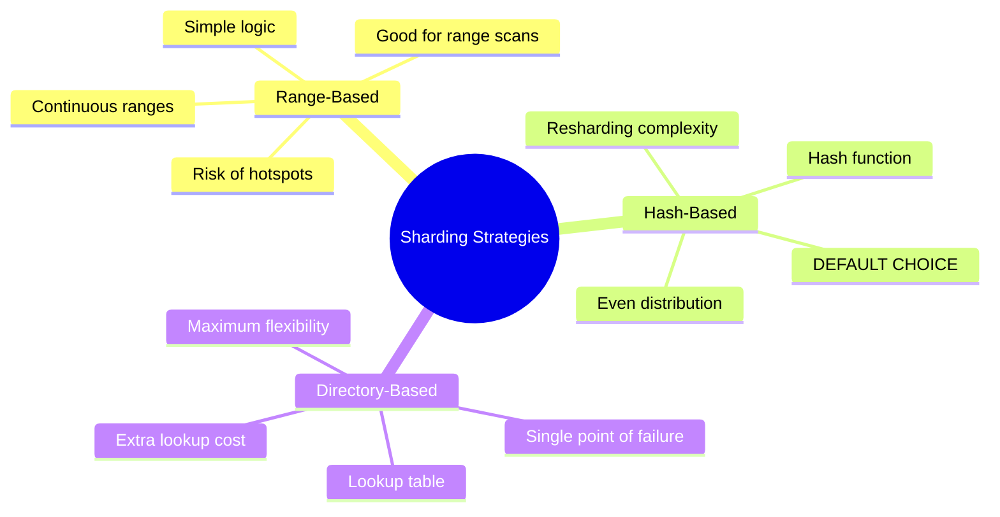
```mermaid
mindmap
    root((Sharding Strategies))
        Range-Based
            Continuous ranges
            Simple logic
            Good for range scans
            Risk of hotspots
        Hash-Based
            Hash function
            Even distribution
            DEFAULT CHOICE
            Resharding complexity
        Directory-Based
            Lookup table
            Maximum flexibility
            Extra lookup cost
            Single point of failure
```

---

### 1️⃣ Range-Based Sharding

> **Concept**: Group records by continuous ranges of values

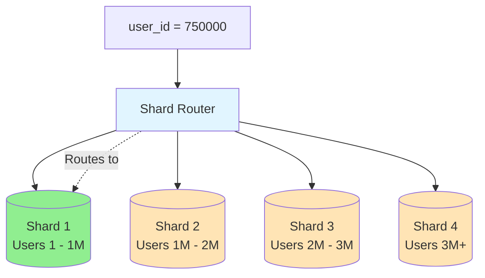
```mermaid
graph TB
    ROUTER[Shard Router]
    
    QUERY[user_id = 750000]
    
    QUERY --> ROUTER
    
    ROUTER --> S1[(Shard 1<br/>Users 1 - 1M)]
    ROUTER --> S2[(Shard 2<br/>Users 1M - 2M)]
    ROUTER --> S3[(Shard 3<br/>Users 2M - 3M)]
    ROUTER --> S4[(Shard 4<br/>Users 3M+)]
    
    ROUTER -.->|Routes to| S1
    
    style ROUTER fill:#e1f5ff
    style S1 fill:#90EE90
    style S2 fill:#FFE4B5
    style S3 fill:#FFE4B5
    style S4 fill:#FFE4B5
```

#### How It Works

```
Shard 1 → User IDs 1 – 1M
Shard 2 → User IDs 1M – 2M  
Shard 3 → User IDs 2M – 3M
Shard 4 → User IDs 3M+
```

**Routing Logic**:
```python
def get_shard(user_id):
    if user_id <= 1_000_000:
        return "shard_1"
    elif user_id <= 2_000_000:
        return "shard_2"
    elif user_id <= 3_000_000:
        return "shard_3"
    else:
        return "shard_4"
```

#### Range Scan Example

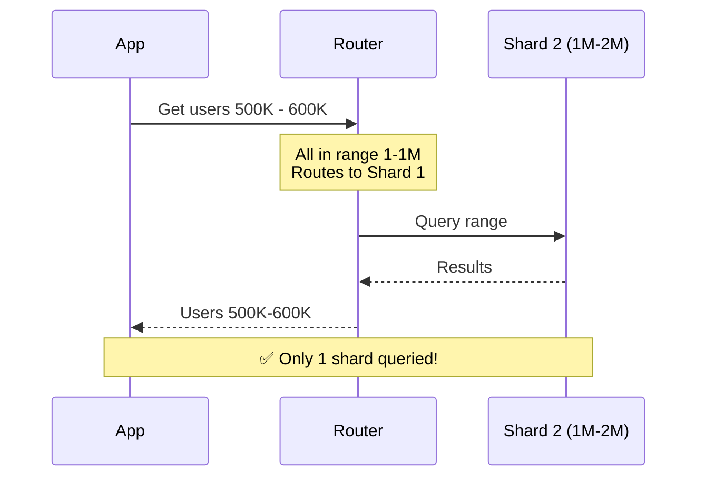
```mermaid
sequenceDiagram
    participant App
    participant Router
    participant S2 as Shard 2 (1M-2M)
    
    App->>Router: Get users 500K - 600K
    Note over Router: All in range 1-1M<br/>Routes to Shard 1
    Router->>S2: Query range
    S2-->>Router: Results
    Router-->>App: Users 500K-600K
    
    Note over App,S2: ✅ Only 1 shard queried!
```

#### The Hotspot Problem

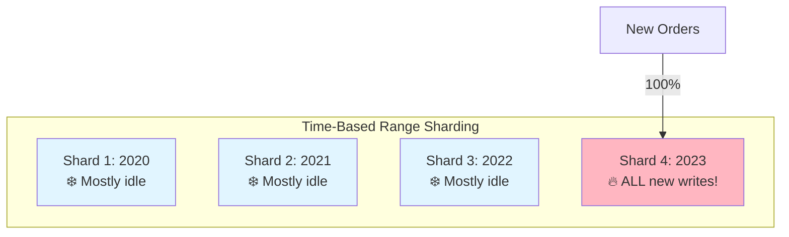
```mermaid
graph TB
    subgraph "Time-Based Range Sharding"
        S1[Shard 1: 2020<br/>❄️ Mostly idle]
        S2[Shard 2: 2021<br/>❄️ Mostly idle]
        S3[Shard 3: 2022<br/>❄️ Mostly idle]
        S4[Shard 4: 2023<br/>🔥 ALL new writes!]
    end
    
    WRITES[New Orders]
    WRITES -->|100%| S4
    
    style S1 fill:#e1f5ff
    style S2 fill:#e1f5ff
    style S3 fill:#e1f5ff
    style S4 fill:#FFB6C1
```

✅ **Pros**:
- Simple logic
- Efficient range queries
- Easy to understand

❌ **Cons**:
- Uneven distribution (hotspots)
- New writes hit latest shard
- Requires careful range planning

**When to Use**: Multi-tenant systems where each tenant queries their own range

---

### 2️⃣ Hash-Based Sharding (Default)

> **Concept**: Use hash function to evenly distribute records

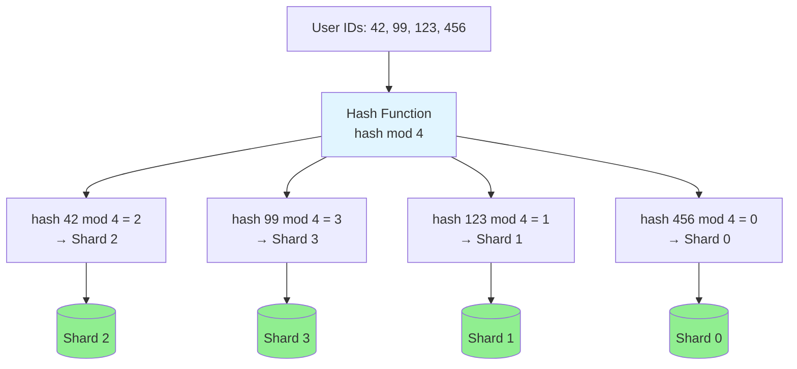
```mermaid
graph TB
    USERS[User IDs: 42, 99, 123, 456]
    
    HASH[Hash Function<br/>hash mod 4]
    
    USERS --> HASH
    
    HASH --> R1[hash 42 mod 4 = 2<br/>→ Shard 2]
    HASH --> R2[hash 99 mod 4 = 3<br/>→ Shard 3]
    HASH --> R3[hash 123 mod 4 = 1<br/>→ Shard 1]
    HASH --> R4[hash 456 mod 4 = 0<br/>→ Shard 0]
    
    R1 --> S2[(Shard 2)]
    R2 --> S3[(Shard 3)]
    R3 --> S1[(Shard 1)]
    R4 --> S0[(Shard 0)]
    
    style HASH fill:#e1f5ff
    style S0 fill:#90EE90
    style S1 fill:#90EE90
    style S2 fill:#90EE90
    style S3 fill:#90EE90
```

#### Hash Distribution

```python
def get_shard(user_id, num_shards=4):
    # Hash and modulo for even distribution
    return hash(user_id) % num_shards

# Examples:
get_shard(42)   # → 2
get_shard(99)   # → 3
get_shard(123)  # → 1
get_shard(456)  # → 0
```

#### Even Distribution

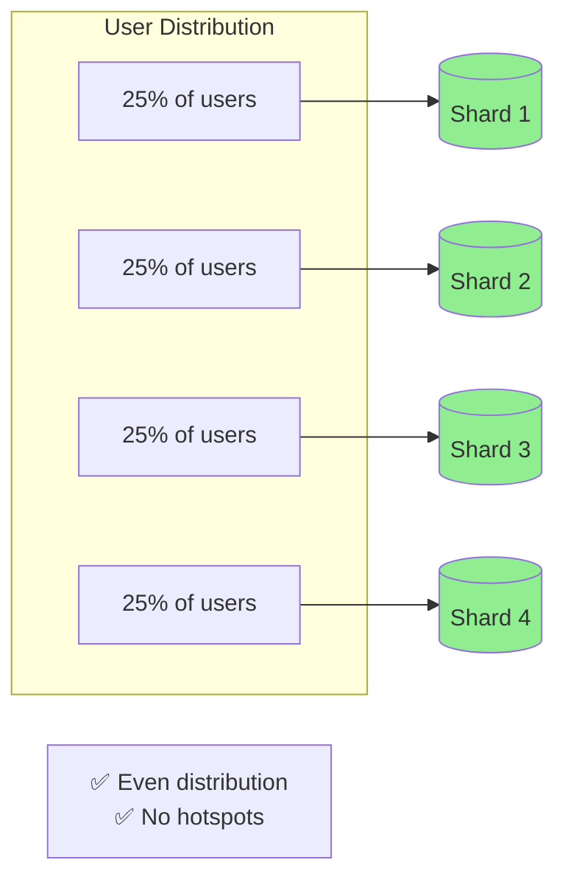
```mermaid
graph LR
    subgraph "User Distribution"
        U1[25% of users]
        U2[25% of users]
        U3[25% of users]
        U4[25% of users]
    end
    
    U1 --> S1[(Shard 1)]
    U2 --> S2[(Shard 2)]
    U3 --> S3[(Shard 3)]
    U4 --> S4[(Shard 4)]
    
    NOTE[✅ Even distribution<br/>✅ No hotspots]
    
    style S1 fill:#90EE90
    style S2 fill:#90EE90
    style S3 fill:#90EE90
    style S4 fill:#90EE90
```

#### The Resharding Problem

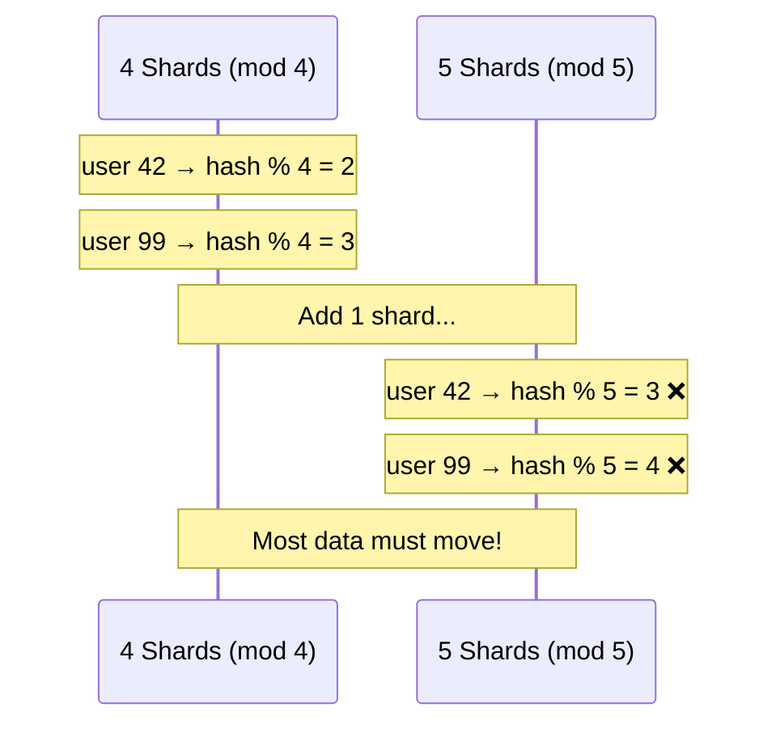
```mermaid
sequenceDiagram
    participant Old as 4 Shards (mod 4)
    participant New as 5 Shards (mod 5)
    
    Note over Old: user 42 → hash % 4 = 2
    Note over Old: user 99 → hash % 4 = 3
    
    Note over Old,New: Add 1 shard...
    
    Note over New: user 42 → hash % 5 = 3 ❌
    Note over New: user 99 → hash % 5 = 4 ❌
    
    Note over Old,New: Most data must move!
```

**Solution**: Use **Consistent Hashing** to minimize data movement

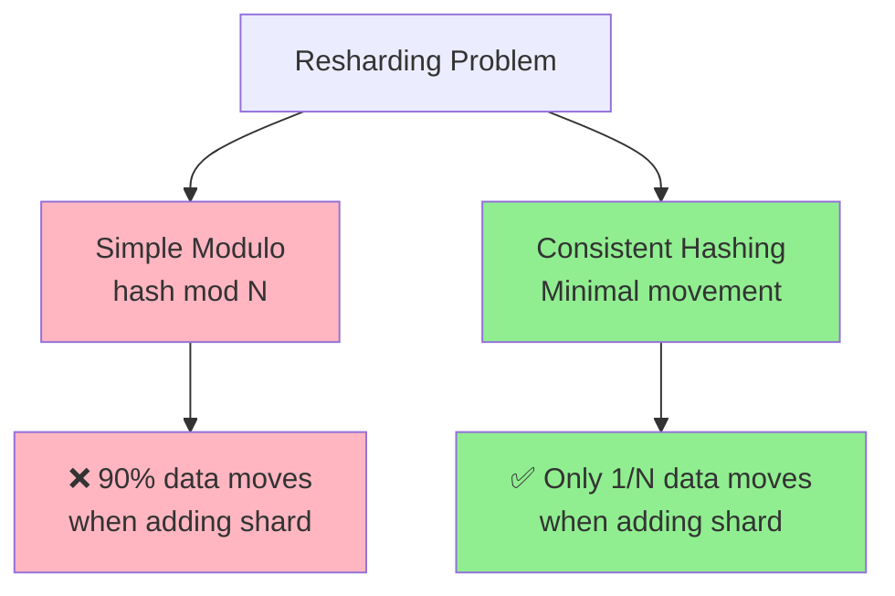
```mermaid
graph TB
    PROBLEM[Resharding Problem]
    
    PROBLEM --> SIMPLE[Simple Modulo<br/>hash mod N]
    PROBLEM --> CONSISTENT[Consistent Hashing<br/>Minimal movement]
    
    SIMPLE --> BAD[❌ 90% data moves<br/>when adding shard]
    CONSISTENT --> GOOD[✅ Only 1/N data moves<br/>when adding shard]
    
    style SIMPLE fill:#FFB6C1
    style CONSISTENT fill:#90EE90
    style BAD fill:#FFB6C1
    style GOOD fill:#90EE90
```

✅ **Pros**:
- Even distribution
- No hotspots
- Predictable load
- Most common strategy

❌ **Cons**:
- Resharding complexity (use consistent hashing)
- No range query support
- Random data placement

> **💡 Interview Tip**: This is the DEFAULT strategy. Use unless specific requirements demand otherwise.

---

### 3️⃣ Directory-Based Sharding

> **Concept**: Use lookup table to map keys to shards

```mermaid
graph TB
    APP[Application]
    DIR[Directory Service<br/>Lookup Table]
    
    APP -->|1. Where is user 15?| DIR
    DIR -->|2. Shard 1| APP
    APP -->|3. Query| S1
    
    S1[(Shard 1)]
    S2[(Shard 2)]
    S3[(Shard 3)]
    S4[(Shard 4)]
    
    DIR -.-> S1
    DIR -.-> S2
    DIR -.-> S3
    DIR -.-> S4
    
    style DIR fill:#e1f5ff
    style S1 fill:#90EE90
```

#### Lookup Table

```
user_to_shard mapping:
------------------------
User 15   → Shard 1
User 87   → Shard 4
User 204  → Shard 2
User 567  → Shard 3
...
```

#### The Flexibility Advantage

```mermaid
sequenceDiagram
    participant Admin
    participant Directory
    participant S1 as Shard 1
    participant S5 as Shard 5 (VIP)
    
    Note over Admin: Taylor Swift's account<br/>is creating hotspot
    
    Admin->>Directory: Move user:taylorswift → Shard 5
    Directory->>Directory: Update mapping
    Note over Directory: user:taylorswift → Shard 5
    
    Note over S5: Dedicated shard<br/>for VIP users
```

#### The Single Point of Failure

```mermaid
graph TB
    APP1[App Server 1]
    APP2[App Server 2]
    APP3[App Server 3]
    
    DIR[Directory Service<br/>💥 DOWN]
    
    S1[(Shard 1<br/>✅ Healthy)]
    S2[(Shard 2<br/>✅ Healthy)]
    S3[(Shard 3<br/>✅ Healthy)]
    
    APP1 -->|Can't lookup| DIR
    APP2 -->|Can't lookup| DIR
    APP3 -->|Can't lookup| DIR
    
    DIR -.-x|Blocked| S1
    DIR -.-x|Blocked| S2
    DIR -.-x|Blocked| S3
    
    NOTE[❌ Directory down = System down<br/>Even though shards are healthy!]
    
    style DIR fill:#FFB6C1
    style S1 fill:#90EE90
    style S2 fill:#90EE90
    style S3 fill:#90EE90
```

✅ **Pros**:
- Maximum flexibility
- Can move hot keys
- Complex sharding logic possible
- Easy rebalancing

❌ **Cons**:
- Extra lookup latency (every request)
- Single point of failure
- Additional infrastructure
- More complexity

**When to Use**: Rarely! Only when you need dynamic shard assignment for specific use cases

> **⚠️ Interview Warning**: Introduces SPOF and latency. Will prompt many follow-up questions. Avoid unless necessary.

---

## ⚠️ Challenges of Sharding

```mermaid
mindmap
    root((Sharding Challenges))
        Hot Spots
            Celebrity problem
            Time-based writes
            Uneven load
        Cross-Shard Queries
            Query all shards
            Aggregate results
            High latency
        Consistency
            Multi-shard transactions
            2PC complexity
            Eventual consistency
        Operational
            Monitoring
            Resharding
            Backups
```

---

### 1️⃣ Hot Spots and Load Imbalance

> **Problem**: Some shards handle way more traffic than others

```mermaid
graph TB
    subgraph "Unbalanced Load"
        S1[Shard 1<br/>Regular Users<br/>10 req/sec]
        S2[Shard 2<br/>Regular Users<br/>12 req/sec]
        S3[Shard 3<br/>Taylor Swift<br/>🔥 10,000 req/sec]
        S4[Shard 4<br/>Regular Users<br/>11 req/sec]
    end
    
    NOTE[❌ Shard 3 is bottleneck<br/>❌ Other shards underutilized<br/>❌ Defeats sharding purpose]
    
    style S1 fill:#90EE90
    style S2 fill:#90EE90
    style S3 fill:#FFB6C1
    style S4 fill:#90EE90
```

#### The Celebrity Problem

```mermaid
sequenceDiagram
    participant Users as Millions of Users
    participant Router
    participant S3 as Shard 3 (Taylor Swift)
    participant Other as Other Shards
    
    Note over Users: Everyone viewing Taylor Swift
    
    Users->>Router: GET user:taylorswift
    Router->>S3: Query (x1,000,000)
    Note over S3: 💥 Overloaded!
    S3-->>Router: Slow/Timeout
    
    Note over Other: 😴 Mostly idle
```

#### Solution Strategies

```mermaid
flowchart TB
    HOTSPOT[Hot Spot Detected]
    
    HOTSPOT --> S1[Isolate to Dedicated Shard]
    HOTSPOT --> S2[Compound Shard Key]
    HOTSPOT --> S3[Dynamic Splitting]
    
    S1 --> S1A[Move VIP users<br/>to dedicated shards]
    S2 --> S2A[hash user_id + date<br/>Spread over time]
    S3 --> S3A[Auto-split hot shards<br/>MongoDB balancer]
    
    style HOTSPOT fill:#FFB6C1
    style S1 fill:#90EE90
    style S2 fill:#90EE90
    style S3 fill:#90EE90
```

**Solutions**:

1. **Isolate Hot Keys**:
```python
# Special routing for celebrities
if user_id in VIP_USERS:
    return "shard_vip"
else:
    return hash(user_id) % num_shards
```

2. **Compound Shard Key**:
```python
# Spread single user across shards by date
shard = hash(user_id + date) % num_shards
```

3. **Dynamic Splitting**: Database auto-splits hot shards (MongoDB, Vitess)

---

### 2️⃣ Cross-Shard Operations

> **Problem**: Queries needing data from multiple shards are expensive

```mermaid
sequenceDiagram
    participant App
    participant S1 as Shard 1
    participant S2 as Shard 2
    participant S3 as Shard 3
    participant S4 as Shard 4
    
    Note over App: Query: Top 10 most popular posts globally
    
    App->>S1: Get top posts
    App->>S2: Get top posts
    App->>S3: Get top posts
    App->>S4: Get top posts
    
    S1-->>App: Top 10 from Shard 1
    S2-->>App: Top 10 from Shard 2
    S3-->>App: Top 10 from Shard 3
    S4-->>App: Top 10 from Shard 4
    
    App->>App: Merge & Sort 40 posts
    App->>App: Return top 10
    
    Note over App,S4: ❌ 4x network calls<br/>❌ 4x latency<br/>❌ Complex aggregation
```

#### Query Alignment

```mermaid
graph TB
    QUERY{Query Type}
    
    QUERY -->|Single user| GOOD[✅ Single Shard<br/>user_id = 123]
    QUERY -->|Global aggregate| BAD[❌ All Shards<br/>Top 10 posts]
    
    GOOD --> FAST[Fast: 10ms]
    BAD --> SLOW[Slow: 40ms+]
    
    style GOOD fill:#90EE90
    style BAD fill:#FFB6C1
    style FAST fill:#90EE90
    style SLOW fill:#FFB6C1
```

#### Solution Strategies

```mermaid
flowchart TB
    CROSS[Cross-Shard Query]
    
    CROSS --> S1{Is it<br/>frequent?}
    
    S1 -->|Yes, hot query| CACHE[Cache Results<br/>5-min TTL]
    S1 -->|Yes, but complex| PRECOMP[Precompute<br/>Background job]
    S1 -->|No, rare admin| ACCEPT[Accept Cost<br/>Okay if infrequent]
    
    CACHE --> CACHE2[First query expensive<br/>Next 1000 hit cache]
    PRECOMP --> PRECOMP2[Update every 5 min<br/>Serve from cache]
    
    style CROSS fill:#FFB6C1
    style CACHE fill:#90EE90
    style PRECOMP fill:#90EE90
    style ACCEPT fill:#FFE4B5
```

**Solutions**:

1. **Cache Results**:
```python
# Cache expensive cross-shard queries
def get_trending_posts():
    cached = cache.get("trending_posts")
    if cached:
        return cached
    
    # Query all shards (expensive)
    results = query_all_shards()
    cache.set("trending_posts", results, ttl=300)
    return results
```

2. **Denormalize Data**:
```python
# Store post preview on user's shard
users_shard = {
    "user_id": 123,
    "posts_preview": [post1, post2, post3]  # Denormalized
}
```

3. **Precompute with Background Jobs**:
```python
# Cron job every 5 minutes
def update_trending():
    results = query_all_shards()
    cache.set("trending", results)
```

---

### 3️⃣ Maintaining Consistency

> **Problem**: Transactions across multiple shards are complex

```mermaid
sequenceDiagram
    participant App
    participant S1 as Shard 1 (User A)
    participant S2 as Shard 2 (User B)
    
    Note over App: Transfer $100: A → B
    
    App->>S1: Deduct $100 from A
    S1-->>App: OK
    
    App->>S2: Add $100 to B
    S2-->>App: ❌ FAIL (network error)
    
    Note over S1,S2: 💥 Inconsistent!<br/>Money lost in system
```

#### Two-Phase Commit (2PC) - Avoid!

```mermaid
sequenceDiagram
    participant Coordinator
    participant S1 as Shard 1
    participant S2 as Shard 2
    
    Note over Coordinator: Phase 1: Prepare
    Coordinator->>S1: Prepare to commit
    Coordinator->>S2: Prepare to commit
    S1-->>Coordinator: OK, ready
    S2-->>Coordinator: OK, ready
    
    Note over Coordinator: Phase 2: Commit
    Coordinator->>S1: Commit
    Coordinator->>S2: Commit
    S1-->>Coordinator: Done
    S2-->>Coordinator: Done
    
    Note over Coordinator,S2: ⚠️ Slow & fragile<br/>If coordinator fails = stuck!
```

#### Better Solution: Saga Pattern

```mermaid
sequenceDiagram
    participant App
    participant S1 as Shard 1 (User A)
    participant S2 as Shard 2 (User B)
    
    Note over App: Transfer $100: A → B
    
    App->>S1: Step 1: Deduct $100 from A
    S1-->>App: OK
    
    App->>S2: Step 2: Add $100 to B
    S2-->>App: ❌ FAIL
    
    Note over App: Compensating action
    App->>S1: Refund $100 to A (rollback)
    S1-->>App: OK
    
    Note over App,S2: ✅ Eventual consistency<br/>No money lost
```

#### Best Solution: Avoid Cross-Shard Transactions

```mermaid
graph TB
    DESIGN[System Design]
    
    DESIGN --> GOOD[✅ Keep Related Data Together]
    DESIGN --> BAD[❌ Frequent Cross-Shard Writes]
    
    GOOD --> EX1[User's account balance<br/>+ transaction history<br/>= Same shard]
    
    BAD --> PROBLEM[Wrong shard key choice<br/>Redesign needed]
    
    style GOOD fill:#90EE90
    style BAD fill:#FFB6C1
    style EX1 fill:#90EE90
```

**Solutions**:

1. **Design to Avoid** (Best):
   - Keep related data on same shard
   - Shard by user_id, all user data together

2. **Saga Pattern** (When needed):
   - Sequential steps with compensating actions
   - Eventual consistency

3. **Accept Eventual Consistency**:
   - For non-critical operations (follower counts, likes)
   - Tolerate brief inconsistency

---

## 🔧 Sharding in Modern Databases

```mermaid
graph TB
    MANUAL[Manual Sharding<br/>❌ Complex, error-prone]
    
    AUTO[Auto-Sharding Databases]
    
    MANUAL --> AUTO
    
    AUTO --> NOSQL[NoSQL Databases]
    AUTO --> SQL[SQL Sharding Layers]
    AUTO --> CLOUD[Cloud Native]
    
    NOSQL --> N1[Cassandra<br/>Consistent hashing]
    NOSQL --> N2[DynamoDB<br/>Auto partition]
    NOSQL --> N3[MongoDB<br/>Range chunks + balancer]
    
    SQL --> S1[Vitess<br/>MySQL sharding]
    SQL --> S2[Citus<br/>PostgreSQL sharding]
    
    CLOUD --> C1[AWS Aurora<br/>Built-in sharding]
    CLOUD --> C2[Google Spanner<br/>Global distribution]
    
    style MANUAL fill:#FFB6C1
    style AUTO fill:#90EE90
    style N1 fill:#90EE90
    style N2 fill:#90EE90
    style N3 fill:#90EE90
    style S1 fill:#90EE90
    style S2 fill:#90EE90
    style C1 fill:#90EE90
    style C2 fill:#90EE90
```

### Database-Specific Approaches

| Database | Mechanism | Type |
|----------|-----------|------|
| **Cassandra** | Consistent hashing with virtual nodes | Hash-based |
| **DynamoDB** | Auto partition splitting | Hash-based |
| **MongoDB** | Range chunks + balancer | Range or Hash |
| **Vitess** | Operator-driven resharding | Range or Hash |
| **Citus** | Table sharding | Hash-based |

> **💡 Interview Tip**: You don't need to implement sharding from scratch. Say: "We'll use MongoDB with user_id as the shard key" or "We'll use Vitess for MySQL sharding."

---

## 🏭 Production Sharding: How Companies Actually Do It

### Instagram: Sharding PostgreSQL with Django

Instagram's 2012 sharding approach became an industry reference. They sharded PostgreSQL before moving to Cassandra:

```mermaid
graph TB
    subgraph "Instagram's Approach (2012)"
        PK[Photo ID = Shard Key]
        PK --> SHARD_ID[Shard ID embedded in ID]
        PK --> LOCAL_ID[Local ID within shard]
        PK --> TIME[Timestamp milliseconds]

        NOTE[ID = timestamp + shard_id + local_sequence<br/>64-bit integer, globally unique, sortable]
    end

    subgraph "ID Anatomy"
        BIT64[64-bit Photo ID]
        BIT64 --> B1[Bits 63-23: Epoch ms<br/>41 bits = 69 years]
        BIT64 --> B2[Bits 22-10: Shard ID<br/>13 bits = 8192 shards]
        BIT64 --> B3[Bits 9-0: Sequence<br/>10 bits = 1024/ms/shard]
    end

    style NOTE fill:#90EE90
```

**The key insight**: The shard ID is baked into every primary key. You never need a separate lookup table — just extract bits from the ID to find the shard.

```python
def get_shard(photo_id, num_shards=2048):
    # Extract shard bits from ID
    shard_id = (photo_id >> 10) & 0x1FFF  # Bits 10-22
    return shard_id % num_shards
```

This is how Twitter's Snowflake ID works too (Twitter open-sourced it in 2010).

---

### Discord: Cassandra for Messages at Scale

Discord stores 4 billion messages and handles 120+ million users. Their sharding story:

```mermaid
graph TB
    subgraph "Discord Message Storage"
        CK[Compound Key: channel_id + message_id]
        CK --> PART[Partition Key: channel_id<br/>All messages in one channel → one node]
        CK --> CLUSTER["Clustering Key: message_id (time-ordered UUID)<br/>Messages sorted chronologically within partition"]

        QUERY["Query: Last 50 messages in #general"]
        QUERY -->|Hits exactly ONE Cassandra partition| FAST[Fast single-partition query]
    end

    subgraph "Challenges They Faced"
        HOT[🔥 Hot Channels: 50k+ members all reading same channel]
        HOT --> SOL[Solution: Local in-process cache per gateway server<br/>+ dedicated Cassandra nodes for largest guilds]
    end

    style FAST fill:#90EE90
    style HOT fill:#FFB6C1
```

**Discord's lesson**: Sharding by `channel_id` means all reads for a channel hit one Cassandra partition. Perfect for the "get latest messages" query. But massive public channels (game announcements, etc.) create hot partitions.

---

### Shopify: Vitess for MySQL Sharding

Shopify shards MySQL using Vitess (YouTube's open-source MySQL sharding layer):

```mermaid
graph TB
    subgraph "Shopify's Shard Architecture"
        TENANT[Shard Key: shop_id]
        TENANT --> VGATE[VTGate: Query Router<br/>Transparent to application]
        VGATE --> S1[(MySQL Shard 1<br/>Shop 1-10K)]
        VGATE --> S2[(MySQL Shard 2<br/>Shop 10K-20K)]
        VGATE --> SN[(MySQL Shard N<br/>...)]

        NOTE[Vitess handles cross-shard queries<br/>scatter-gather for analytics]
    end

    subgraph "Multi-Tenant Isolation"
        BIG[Large merchant: Gymshark<br/>10M orders → dedicated shard]
        SMALL[Small merchants: 1K shops<br/>shared shard]
    end

    style NOTE fill:#90EE90
```

**Key trick**: Shopify allocates small merchants to shared shards but moves large merchants to dedicated shards. This prevents one Gymshark Black Friday event from killing other merchants.

---

### Online Resharding with gh-ost and pt-online-schema-change

The hardest part of sharding is doing it without downtime. Two battle-tested tools:

**gh-ost** (GitHub's Online Schema Tool for MySQL):
```bash
# Doubles writes during migration (shadow table + triggers)
# Throttles to keep replication lag < 1s
gh-ost \
  --host=db-primary \
  --database=shopify \
  --table=orders \
  --alter="ADD COLUMN shard_id INT" \
  --execute \
  --max-lag-millis=1000 \    # Throttle if replica lag > 1s
  --chunk-size=1000           # Migrate 1000 rows at a time
```

**How it works**:
1. Creates a `_orders_gho` shadow table with new schema
2. Copies rows in chunks (throttled)
3. Uses MySQL binary log to replay concurrent writes to shadow table
4. Atomic rename: `RENAME TABLE orders TO orders_old, _orders_gho TO orders`

**Zero downtime**: The rename is a microsecond atomic operation in MySQL.

---

### Consistent Hashing in Practice: Over-Sharding

**Production trick**: Create 10x more logical shards than physical machines. This lets you add machines without resharding:

```mermaid
graph TB
    subgraph "Initial Setup: 4 Machines, 256 Logical Shards"
        M1[Machine 1<br/>Shards 0-63]
        M2[Machine 2<br/>Shards 64-127]
        M3[Machine 3<br/>Shards 128-191]
        M4[Machine 4<br/>Shards 192-255]
    end

    subgraph "Add Machine 5 (No Resharding!)"
        M1B[Machine 1<br/>Shards 0-50]
        M2B[Machine 2<br/>Shards 64-114]
        M3B[Machine 3<br/>Shards 128-178]
        M4B[Machine 4<br/>Shards 192-242]
        M5[Machine 5<br/>Shards 51-63, 115-127, 179-191, 243-255]
    end

    NOTE[Logical shard assignments change<br/>but NO DATA MOVES between formats<br/>Just update the routing table]

    style M5 fill:#90EE90
    style NOTE fill:#90EE90
```

**Companies that do this**: DynamoDB (auto-partitions), MongoDB (configurable chunk count), Cassandra (token ranges).

---

### Shard Monitoring: What to Watch

```mermaid
graph TB
    MONITOR[Shard Health Monitoring]

    MONITOR --> M1[📊 Shard Size Distribution<br/>Alert if any shard > 2x average]
    MONITOR --> M2[⚡ Write Throughput per Shard<br/>Alert if one shard > 3x average]
    MONITOR --> M3[🔄 Replication Lag per Shard<br/>Alert if replica lag > 5s]
    MONITOR --> M4[📈 Connection Count per Shard<br/>Alert if near max_connections]
    MONITOR --> M5[💾 Storage per Shard<br/>Alert if > 70% full]

    style M1 fill:#e1f5ff
    style M2 fill:#FFE4B5
    style M3 fill:#FFB6C1
    style M4 fill:#FFE4B5
    style M5 fill:#FFB6C1
```

```bash
# Example: Check shard sizes in MySQL with Vitess
SELECT
    shard,
    SUM(data_length + index_length) / 1024 / 1024 AS size_mb
FROM vtgate_schema_info
GROUP BY shard
ORDER BY size_mb DESC;

# Alert if max_shard_size > 2 * avg_shard_size
```

---

### The Pre-Splitting Trick

Before you have much data, create all your future shards upfront:

```
MongoDB: mongos --numInitialChunks=256
DynamoDB: Request 128+ partitions upfront via AWS support for large tables
Cassandra: Set num_tokens=256 per node from the start
```

**Why**: Empty shards are cheap. Moving data to new shards later is expensive. If you know you'll need 128 shards in 2 years, start with 128 (even if most are empty).

---

### Sharding Anti-Patterns from Production

```mermaid
graph TB
    ANTI[Real Production Anti-Patterns]

    ANTI --> A1[❌ Sharding by created_at<br/>All new writes → hotspot on latest shard<br/>Fix: Hash the timestamp or use compound key]

    ANTI --> A2[❌ Sharding a small table<br/>10GB data doesn't need sharding<br/>Fix: Single DB + read replicas handles this]

    ANTI --> A3[❌ Cross-shard foreign keys<br/>Referential integrity breaks across shards<br/>Fix: Enforce in application code or denormalize]

    ANTI --> A4[❌ Changing the shard key later<br/>All data must move → major incident<br/>Fix: Choose your shard key very carefully upfront]

    ANTI --> A5[❌ Too few shards<br/>'We'll start with 4 and add more'<br/>Fix: Start with 64+ for any serious system]

    style A1 fill:#FFB6C1
    style A2 fill:#FFE4B5
    style A3 fill:#FFB6C1
    style A4 fill:#FFB6C1
    style A5 fill:#FFE4B5
```

---

## 🎤 Interview Strategy

### When to Mention Sharding

```mermaid
flowchart TB
    START[System Design]
    
    START --> CALC[Calculate Requirements]
    
    CALC --> Q1{Storage > 256TB?}
    CALC --> Q2{Writes > 50K/sec?}
    CALC --> Q3{Reads > 100K/sec<br/>even with replicas?}
    
    Q1 -->|Yes| SHARD[✅ Need Sharding]
    Q2 -->|Yes| SHARD
    Q3 -->|Yes| SHARD
    
    Q1 -->|No| CHECK[Continue designing...]
    Q2 -->|No| CHECK
    Q3 -->|No| CHECK
    
    style SHARD fill:#90EE90
    style CHECK fill:#FFE4B5
```

**Common Mistake**: ❌ Introducing sharding before proving it's necessary

**Correct Approach**: ✅ Show the math first

**Example**:
> "We have 500M users with 5KB each = 2.5TB. A single Postgres can handle that. But if we grow 10x to 5B users, that's 25TB - we'll need to shard."

---

### Interview Framework

```mermaid
graph TB
    STEP1[1. Prove Necessity]
    STEP2[2. Choose Shard Key]
    STEP3[3. Pick Strategy]
    STEP4[4. Address Trade-offs]
    STEP5[5. Plan for Growth]
    
    STEP1 --> STEP2 --> STEP3 --> STEP4 --> STEP5
    
    STEP1 --> D1[Show calculations<br/>Storage/throughput limits]
    STEP2 --> D2[Based on access patterns<br/>user_id, order_id, etc]
    STEP3 --> D3[Hash-based default<br/>Consistent hashing]
    STEP4 --> D4[Cross-shard queries?<br/>Hot spots?]
    STEP5 --> D5[Start with N shards<br/>Resharding plan]
    
    style STEP1 fill:#e1f5ff
    style STEP2 fill:#e1f5ff
    style STEP3 fill:#90EE90
    style STEP4 fill:#FFE4B5
    style STEP5 fill:#FFE4B5
```

### Example Interview Script

**Step 1: Prove Necessity**
> "We're expecting 50K writes per second during peak. A single database will struggle with that write load, so we should shard."

**Step 2: Choose Shard Key**
> "For this social media app, most queries are user-centric - loading feeds, posts, followers. Everything is scoped to a single user. So I'd shard by `user_id`."

**Step 3: Pick Strategy**
> "I'd use hash-based sharding with consistent hashing. Hash the `user_id` to distribute users evenly across shards."

**Step 4: Address Trade-offs**
> "The trade-off is that global queries like 'trending posts' become expensive - we'd have to query all shards. We can handle that by caching trending content and precomputing it with a background job."

**Step 5: Plan for Growth**
> "We'll start with 64 shards, which gives us room to grow. Consistent hashing makes it easier to add shards later without resharding all the data."

---

## 🎓 Key Takeaways

```mermaid
mindmap
    root((Sharding Essentials))
        When
            Storage limit
            Write bottleneck
            Read at scale
        What Key
            High cardinality
            Even distribution
            Query alignment
        How
            Hash-based default
            Consistent hashing
            Avoid cross-shard ops
        Challenges
            Hot spots
            Cross-shard queries
            Consistency
```

### Decision Matrix

| Scenario | Shard Key | Strategy | Notes |
|----------|-----------|----------|-------|
| Social media | user_id | Hash-based | User-centric queries |
| E-commerce orders | order_id | Hash-based | Order-scoped queries |
| Multi-tenant SaaS | tenant_id | Range-based | Natural isolation |
| Time-series logs | timestamp | Range-based | Time-based queries |
| Gaming leaderboard | game_id | Hash-based | Game-scoped queries |

### Quick Reference

```mermaid
flowchart TB
    Q[Need to Shard?]
    
    Q --> YES{Yes}
    
    YES --> KEY[Choose Shard Key]
    KEY --> CARD{High Cardinality?}
    CARD -->|Yes| DIST{Even Distribution?}
    DIST -->|Yes| ALIGN{Query Alignment?}
    ALIGN -->|Yes| HASH[Use Hash-Based<br/>with Consistent Hashing]
    
    HASH --> IMPL[Modern DB:<br/>MongoDB/DynamoDB/Vitess]
    
    style Q fill:#e1f5ff
    style HASH fill:#90EE90
    style IMPL fill:#90EE90
```

---

## 📝 Conclusion

### Core Trade-off

```mermaid
graph LR
    SHARD[Sharding]
    
    SHARD --> PROS[✅ Benefits]
    SHARD --> CONS[❌ Costs]
    
    PROS --> P1[Horizontal scalability]
    PROS --> P2[Unlimited storage]
    PROS --> P3[Higher throughput]
    
    CONS --> C1[Complex operations]
    CONS --> C2[Cross-shard queries]
    CONS --> C3[Consistency challenges]
    CONS --> C4[Operational overhead]
    
    style PROS fill:#90EE90
    style CONS fill:#FFB6C1
```

### Remember

> **Sharding is what you do when a single database can't handle your scale anymore.**

**Critical Points**:
1. ✅ **Prove necessity first** - Don't shard prematurely
2. ✅ **Choose shard key carefully** - High cardinality, even distribution, query alignment
3. ✅ **Default to hash-based** - With consistent hashing
4. ✅ **Minimize cross-shard queries** - Design around shard boundaries
5. ✅ **Use modern databases** - Don't implement from scratch

**Most Important**:
- Hash-based sharding is the default
- Shard key determines everything
- Avoid cross-shard transactions
- Modern DBs handle most complexity

### Anti-Patterns

❌ Sharding too early (most common mistake)
❌ Wrong shard key (leads to hotspots)
❌ Ignoring cross-shard query costs
❌ Using directory-based without strong reason
❌ Not planning for resharding

---

## 📚 Related Concepts

- [Consistent Hashing](./ConsistentHashing.md) - Minimize resharding cost
- [Database Indexing](./DataIndexing.md) - Optimize queries within shards
- [Caching](./Caching.md) - Reduce cross-shard query costs
- [Data Modeling](./DataModelling.md) - Design for single-shard operations
- [Replication](./Replication.md) - Combine with sharding for HA

---

**Last Updated**: December 2024
**Source**: [HelloInterview - Sharding](https://www.hellointerview.com/learn/system-design/core-concepts/sharding)

> **💡 Final Tip**: A well-tuned single database can get you surprisingly far. Don't shard until you've proven you need to!
