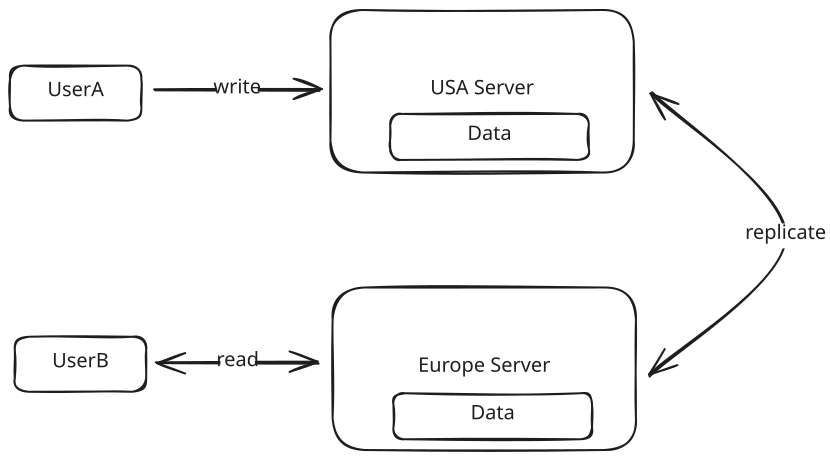
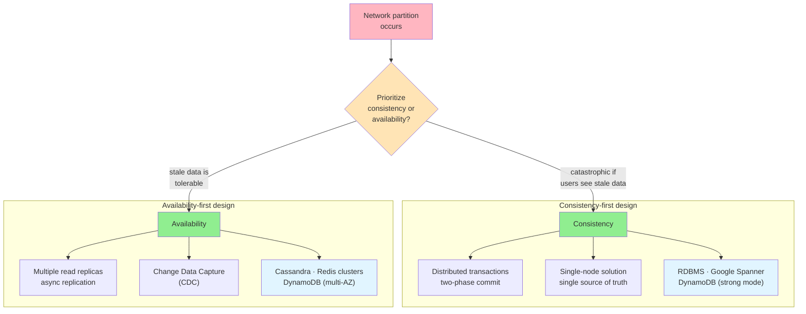
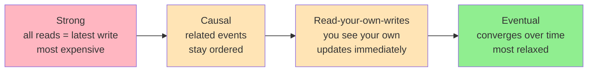

# ⚖️ CAP Theorem

Master the fundamental tradeoffs between consistency and availability in distributed systems.

> **Overview**: CAP theorem states that a distributed system can guarantee only two of three properties — Consistency, Availability, and Partition tolerance. Because network partitions are unavoidable in the real world, the practical decision collapses to a single question: do you prioritize consistency or availability *when a partition occurs*? Getting this right belongs at the very top of the non-functional requirements discussion in a system design interview.

## 📋 Table of Contents
- [Layman's Explanation](#laymans-explanation)
- [What is CAP Theorem?](#what-is-cap-theorem)
- [Understanding CAP Theorem Through an Example](#understanding-cap-theorem-through-an-example)
- [CAP Theorem in System Design Interviews](#cap-theorem-in-system-design-interviews)
- [Advanced CAP Theorem Considerations](#advanced-cap-theorem-considerations)
- [Conclusion](#conclusion)
- [Key Takeaways](#key-takeaways)
- [Related Concepts](#related-concepts)

---

## 🧒 Layman's Explanation

Imagine the same guestbook is kept by two librarians — one in the USA, one in Europe — and they normally phone each other whenever someone signs it, so both copies stay identical. One day the phone line between them goes down (a **network partition**). Now a visitor in Europe asks the local librarian for the *latest* entry. The librarian has two honest choices:

- "I can't be sure this is current right now — come back when the line is fixed." That's choosing **consistency**: never show something that might be wrong, even if it means showing nothing.
- "Here's what I have; it might be a few minutes out of date." That's choosing **availability**: always give an answer, even if it's slightly stale.

There's no third option where both librarians magically agree while the phone line is dead — that's the whole theorem. And the "right" answer depends on the stakes: for a name in a guestbook, stale-but-there beats an error. For "is this the last seat on the flight?", you'd rather refuse to answer than sell it twice.

## 🎯 What is CAP Theorem?

At its core, CAP theorem states that in a distributed system, you can only have two out of three of the following properties:

- **Consistency**: All nodes see the same data at the same time. When a write is made to one node, all subsequent reads from any node will return that updated value.
- **Availability**: Every request to a non-failing node receives a response, without the guarantee that it contains the most recent version of the data.
- **Partition Tolerance**: The system continues to operate despite arbitrary message loss or failure of part of the system (i.e., network partitions between nodes).

> ⚠️ Note that consistency in the context of the CAP theorem is quite different from the consistency guaranteed by ACID databases. Confusing, I know.

Here's the key insight that makes CAP theorem much simpler to reason about in interviews: In any distributed system, partition tolerance is a must. Network failures will happen, and your system needs to handle them.

This means that in practice, CAP theorem really boils down to a single choice: Do you prioritize consistency or availability when a network partition occurs?

Let's explore what this means through a practical example.

## 🔎 Understanding CAP Theorem Through an Example

Imagine you're running a website with two servers - one in the USA and one in Europe. When a user updates their public profile (let's say their display name), here's what happens:

1. User A connects to their closest server (USA) and updates their name
2. This update is replicated to the server in Europe
3. When User B in Europe views User A's profile, they see the updated name

Everything works smoothly until we encounter a network partition - the connection between our USA and Europe servers goes down. Now we have a critical decision to make:

When User B tries to view User A's profile, should we:

- Option A: Return an error because we can't guarantee the data is up-to-date (choosing consistency)
- Option B: Show potentially stale data (choosing availability)

This is where CAP theorem becomes practical - we must choose between consistency and availability.

In the case, the answer is rather clear: we would rather show a user in Europe the old name of User A, rather than show an error. Seeing a stale name is better than seeing no name at all.

Let's look at some other real-world examples of this choice:

### When to Choose Consistency

Some systems absolutely require consistency, even at the cost of availability:

1. **Ticket Booking Systems**: Imagine if User A booked seat 6A on a flight, but due to a network partition, User B sees the seat as available and books it too. You'd have two people showing up for the same seat!
2. **E-commerce Inventory**: If Amazon has one toothbrush left and the system shows it as available to multiple users during a network partition, they could oversell their inventory.
3. **Financial Systems**: Stock trading platforms need to show accurate, up-to-date order books. Showing stale data could lead to trades at incorrect prices.

### When to Choose Availability

The majority of systems can tolerate some inconsistency and should prioritize availability. In these cases, eventual consistency is fine. Meaning, the system will eventually become consistent, but it may take a few seconds or minutes.

1. **Social Media**: If User A updates their profile picture, it's perfectly fine if User B sees the old picture for a few minutes.
2. **Content Platforms (like Netflix)**: If someone updates a movie description, showing the old description temporarily to some users isn't catastrophic.
3. **Review Sites (like Yelp)**: If a restaurant updates their hours, showing slightly outdated information briefly is better than showing no information at all.

> 💡 The key question to ask yourself is: "Would it be catastrophic if users briefly saw inconsistent data?" If the answer is yes, choose consistency. If not, choose availability.

## 🎤 CAP Theorem in System Design Interviews

Understanding CAP theorem matters because it should be one of the first things you discuss in a system design interview as it will have a meaningful impact on how you design your system.

In a system design interview, you typically begin by:

1. Aligning on functional requirements (features)
2. Defining non-functional requirements (system qualities)

When discussing non-functional requirements, CAP theorem should be your starting point. You need to ask the all important question: "Does this system need to prioritize consistency or availability?"

The choice cascades directly into your architecture and technology selection:

If you prioritize consistency, your design might include:

- **Distributed Transactions**: Ensuring multiple data stores (like cache and database) remain in sync through two-phase commit protocols. This adds complexity but guarantees consistency across all nodes. This means users will likely experience higher latency as the system ensures data is consistent across all nodes.
- **Single-Node Solutions**: Using a single database instance to avoid propagation issues entirely. While this limits scalability, it eliminates consistency challenges by having a single source of truth.
- **Technology Choices**:
  - Traditional RDBMSs ([PostgreSQL](https://www.hellointerview.com/learn/system-design/deep-dives/postgres), MySQL)
  - Google Spanner
  - [DynamoDB](https://www.hellointerview.com/learn/system-design/deep-dives/dynamodb) (in strong consistency mode)

On the other hand, if you prioritize availability, your design can include:

- **Multiple Replicas**: Scaling to additional read replicas with asynchronous replication, allowing reads to be served from any replica even if it's slightly behind. This improves read performance and availability at the cost of potential staleness.
- **Change Data Capture (CDC)**: Using CDC to track changes in the primary database and propagate them asynchronously to replicas, caches, and other systems. This allows the primary system to remain available while updates flow through the system eventually.
- **Technology Choices**:
  - [Cassandra](https://www.hellointerview.com/learn/system-design/deep-dives/cassandra)
  - [DynamoDB](https://www.hellointerview.com/learn/system-design/deep-dives/dynamodb) (in multiple availability zone configuration)
  - [Redis](https://www.hellointerview.com/learn/system-design/deep-dives/redis) clusters

> 💡 Most modern distributed databases offer configuration options for both consistency and availability. The key is understanding which to choose for your use case.

## 🔬 Advanced CAP Theorem Considerations

> 📖 If you're a junior or mid-level candidate, the previous sections are sufficient for most interviews. The following section covers more advanced concepts that might be relevant for senior and staff-level discussions.

As systems grow in complexity, the choice between consistency and availability isn't always binary. Modern distributed systems often require nuanced approaches that vary by feature and use case. Let's explore these advanced considerations.

Real-world systems frequently need both availability and consistency - just for different features. Let's look at two examples:

#### Example 1: Ticketmaster

[Ticketmaster](https://www.hellointerview.com/learn/system-design/problem-breakdowns/ticketmaster) needs different consistency models for different features within the same system:

- **Booking a seat at an event**: Requires strong consistency to prevent double-booking as we discussed in the previous section.
- **Viewing event details**: Can prioritize availability (showing slightly outdated event descriptions is acceptable)

In an interview, you might say: "For this ticketing system, I'll prioritize consistency for booking transactions but optimize for availability when users are browsing and viewing events."

#### Example 2: Tinder

Similarly, [Tinder](https://www.hellointerview.com/learn/system-design/problem-breakdowns/tinder) has mixed requirements:

- **Matching**: Needs consistency. If both users swipe right at about the same time, they should both see the match immediately.
- **Viewing a users profile**: Can prioritize availability. Seeing a slightly outdated profile picture is acceptable if a user just updated their image.

In an interview, you might say: "For this dating app, I'll prioritize consistency for matching but optimize for availability when users are viewing profiles."

### Different Levels of Consistency

When discussing consistency in CAP theorem, people usually mean strong consistency - where all reads reflect the most recent write. However, understanding the spectrum of consistency models can help you make more nuanced design decisions:

**Strong Consistency**: All reads reflect the most recent write. This is the most expensive consistency model in terms of performance, but is necessary for systems that require absolute accuracy like bank account balances. This is what we have been discussing so far.

**Causal Consistency**: Related events appear in the same order to all users. This ensures logical ordering of dependent actions, such as ensuring comments on a post must appear after the post itself.

**Read-your-own-writes Consistency**: Users always see their own updates immediately, though other users might see older versions. This is commonly used in social media platforms where users expect to see their own profile updates right away.

**Eventual Consistency**: The system will become consistent over time but may temporarily have inconsistencies. This is the most relaxed form of consistency and is often used in systems like DNS where temporary inconsistencies are acceptable. This is the default behavior of most distributed databases and what we are implicitly choosing when we prioritize availability.

## 📝 Conclusion

CAP theorem is important. It sets the stage for how you approach your design in an interview and should not be overlooked.

But it doesn't need to be complicated. Just ask yourself: "Does every read need to read the most recent write?" If the answer is yes, you need to prioritize consistency. If the answer is no, you can prioritize availability.

Answer the question below to find your gaps.

Get a quick-reference sheet for this topic, perfect for last-minute review.

## 🎓 Key Takeaways

- **Partition tolerance is non-negotiable** in any distributed system — network failures are a given, so CAP really reduces to a *binary choice between consistency and availability during a partition*.
- **Ask one question**: "Would it be catastrophic if users briefly saw inconsistent data?" Yes → consistency (ticket booking, inventory, financial systems). No → availability (social media, content platforms, review sites).
- **CAP consistency ≠ ACID consistency** — a common source of confusion; CAP consistency is about all nodes agreeing on the latest value.
- **The choice drives your architecture**: consistency-first leans on distributed transactions, single-node designs, and RDBMS/Spanner/DynamoDB-strong; availability-first leans on read replicas, CDC, and Cassandra/Redis clusters/DynamoDB multi-AZ.
- **It's not always binary** — mature systems mix models per feature (Ticketmaster: consistent bookings, available browsing; Tinder: consistent matching, available profiles).
- **Consistency is a spectrum** — strong → causal → read-your-own-writes → eventual — pick the weakest model your requirements can tolerate to buy back performance and availability.

## 📚 Related Concepts

- [Sharding](../../CoreConcepts/Sharding.md) — how data is partitioned and replicated across nodes, where partition tolerance becomes concrete.
- [Consistent Hashing](../../CoreConcepts/ConsistentHashing.md) — the technique that maps keys to replicas in availability-first distributed stores.
- [Distributed Locking](../../CoreConcepts/DistributedLocking.md) — a consistency mechanism used to serialize access and prevent the double-booking problem.
- [PostgreSQL](../DeepDives/Postgresql.md) — a strong-consistency RDBMS choice for consistency-first designs.
- [DynamoDB](../DeepDives/Dynamodb.md) — tunable per request: strong consistency mode vs. multi-AZ availability.
- [Cassandra](../DeepDives/Cassandra.md) — an availability-first store built around eventual consistency.
- [Redis](../DeepDives/Redis.md) — the in-memory store behind availability-first caching and replica clusters.
- [Ticketmaster](../ProblemBreakdowns/Ticketmaster.md) — mixes strong-consistent bookings with available browsing.
- [Tinder](../ProblemBreakdowns/Tinder.md) — consistent matching alongside available profile viewing.

---
*Source: [https://www.hellointerview.com/learn/system-design/core-concepts/cap-theorem](https://www.hellointerview.com/learn/system-design/core-concepts/cap-theorem)*
