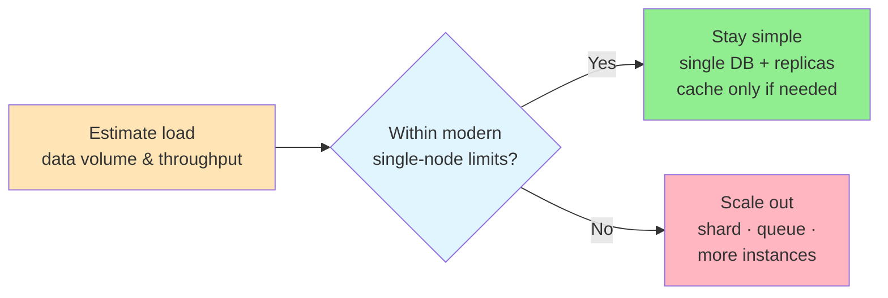

# 📊 Numbers to Know

> **Overview**: Modern hardware has changed the calculus of system design — a single machine now holds terabytes of RAM, single databases handle dozens of terabytes at millisecond latency, and message queues push millions of messages per second. This page collects the numbers that actually matter in 2026 so you can estimate capacity accurately, know where the real limits are, and avoid over-engineering systems based on outdated constraints.

## 📋 Table of Contents
- [🧒 Layman's Explanation](#laymans-explanation)
- [🖥️ Modern Hardware Limits](#modern-hardware-limits)
- [🎤 Applying These Numbers in System Design Interviews](#applying-these-numbers-in-system-design-interviews)
- [📋 Cheat Sheet](#cheat-sheet)
- [⚠️ Common Mistakes In Interviews](#common-mistakes-in-interviews)
- [💰 What about costs?](#what-about-costs)
- [📝 Conclusion](#conclusion)
- [🎓 Key Takeaways](#key-takeaways)
- [📚 Related Concepts](#related-concepts)

---

## 🧒 Layman's Explanation

Imagine you're moving house and you assume you'll need a whole fleet of trucks making dozens of trips. But you're picturing the little handcart your grandparents used decades ago. In reality, a modern moving truck is enormous — one trip might carry everything you own. If you plan the whole move around the old handcart, you'll hire far too many trucks, coordinate a needlessly complex convoy, and spend money and effort solving a problem you don't actually have.

System design is the same. Many engineers still "pack for the handcart" — they reach for sharding, message queues, and distributed caches because they remember when a database maxed out at 100GB and a Redis instance held 32GB. But today's single "truck" is huge: one database holds tens of terabytes, one cache holds ~1TB in RAM, one server juggles 100k+ connections. Knowing the real size of the modern truck is what lets you make the right call — one machine when one will do, and scaling out only when you've done the math and genuinely need it.

Our industry moves fast. The hardware we build systems on evolves constantly, which means even recent textbooks can become outdated quickly. A book published just a few years ago might be teaching patterns that still make sense, but quoting numbers that are off by orders of magnitude.

One of the biggest giveaways that a candidate has book knowledge but no hands-on experience during a system design interview is when they rely on outdated hardware constraints. They do scale calculations using numbers from 2015 (or even 2020!) that dramatically underestimate what modern systems can handle. You'll hear concerns about database sizes, memory limits, and storage costs that made sense then, but would lead to significantly over-engineered systems today.

This isn't the candidate's fault – they're doing the right thing by studying. But understanding modern hardware capabilities is crucial for making good system design decisions. When to shard a database, whether to cache aggressively, how to handle large objects – these choices all depend on having an accurate sense of what today's hardware can handle.

Let's look at the numbers that actually matter in 2026.

## 🖥️ Modern Hardware Limits

Modern servers pack serious computing power. An AWS [M6i.32xlarge](https://aws.amazon.com/ec2/instance-types/m6i/) comes with 512 GiB of memory and 128 vCPUs for general workloads. Memory-optimized instances go further: the [X1e.32xlarge](https://aws.amazon.com/ec2/instance-types/x1e/) provides 4 TB of RAM, while the [U-24tb1.metal](https://aws.amazon.com/blogs/aws/ec2-high-memory-update-new-18-tb-and-24-tb-instances/) reaches 24 TB of RAM. This shift matters because many applications that once required distributed systems can now run on a single machine.

Storage capacity has seen similar growth. Modern instances like AWS's [i3en.24xlarge](https://aws.amazon.com/ec2/instance-types/i3en/) provide 60 TB of local SSD (solid-state drive) storage. If you need more, the [D3en.12xlarge](https://aws.amazon.com/ec2/instance-types/d3/) offers 336 TB of HDD (hard disk drive) storage for data-heavy workloads. Object storage like [S3](https://aws.amazon.com/s3/) is effectively unlimited, handling petabyte-scale deployments as a standard practice. The days of storage being a primary constraint are largely behind us.

Network capabilities haven't stagnated either. Within a datacenter, 25 Gbps is common for standard instances, with high-performance instances supporting 50-100 Gbps or more. Bandwidth across availability zones (AZs) within a region is limited only by instance network capacity. Latency remains predictable: sub-1ms within a single AZ, 1-2ms across AZs in the same region, and 50-150ms cross-region. This consistent performance allows for reliable distributed system design.

These aren't just incremental improvements – they represent a step change in what's possible. When textbooks talk about splitting databases at 100GB or avoiding large objects in memory, they're working from outdated constraints. The hardware running our systems today would have been unimaginable a decade ago, and these capabilities fundamentally change how we approach system design.

## 🎤 Applying These Numbers in System Design Interviews

Let's look at how these numbers impact specific components and the decisions we make when designing systems in an interview.

The mental model these numbers unlock is the same for every component: estimate your load, compare it against what a single modern machine can actually handle, and only reach for distributed complexity once you've confirmed you've crossed a real scale trigger.

### 🗄️ Caching

In-memory caches have grown exponentially in both size and capability. Gone are the days of 32-64GB Redis instances that required careful memory management and partial dataset caching. Today's caches routinely handle terabyte-scale datasets with single-digit millisecond latency, and a single instance can process hundreds of thousands of operations per second. This shift in scale changes the entire approach to caching strategy.

Numbers to know:

- Memory: Up to 1TB on memory-optimized instances, with some configurations exceeding this for specialized use cases
- Latency
  - Reads: < 1ms within the same region
  - Writes: < 1ms same-AZ, 1-2ms cross-AZ (within the same region) for optimized systems
- Throughput: 100k-200k+ operations/second per instance for in-memory caches like ElastiCache Redis on modern Graviton-based nodes (reads and writes are roughly equivalent for simple operations)

When to consider scaling:

- Dataset Size: Approaching 1TB in size
- Throughput: Sustained throughput of 100k+ ops/second
- Read Latency: Requirements below 0.5ms consistently

These capabilities fundamentally change caching strategy. The ability to cache entire databases in memory, even at hundreds of gigabytes, means you can often avoid complex partial caching schemes altogether. This "cache everything" approach, while seemingly brute force, typically costs less than engineering time spent on selective caching logic. When you do need to scale, the bottleneck is usually operations per second or network bandwidth, not memory size – a counterintuitive shift from just a few years ago.

### 🛢️ Databases

The raw power of modern databases surprises even experienced engineers. Single PostgreSQL or MySQL instances now routinely handle dozens of terabytes of data while maintaining millisecond-level response times. This isn't just about storage either. Modern databases efficiently handle tens of thousands of transactions per second on a single primary, with the bottleneck often being operational concerns rather than performance limits.

Numbers to know:

- Storage: Single instances handle up to 64 TiB for most database engines, with Aurora supporting up to 256 TiB
- Latency
  - Reads: 1-5ms for cached data, 5-30ms for disk (optimized configurations for RDS and Aurora)
  - Writes: 5-15ms for commit latency (for single-node, high-performance setups)
- Throughput
  - Reads: Up to 50k TPS (transactions per second) in single-node configurations on Aurora and RDS
  - Writes: 10-20k TPS in single-node configurations on Aurora and RDS
- Connections: 5-20k concurrent connections, depending on database and instance type

When to consider sharding:

- Dataset Size: Approaching or exceeding 50 TiB may require sharding or distributed solutions
- Write Throughput: Consistently exceeding 10k TPS indicates scaling considerations
- Read Latency: Requirements below 5ms for uncached data may necessitate optimization
- Geographic Distribution: Cross-region replication or distribution needs
- Backup/Recovery: Backup windows that stretch into hours or become operationally impractical

While the largest systems in the world (social networks, e-commerce giants, etc.) absolutely need sharding to handle their scale, many candidates jump to distributed solutions too early. For systems handling millions or even tens of millions of users, a well-tuned single database can often handle the load. When you do need to scale, carefully consider what's driving the decision: is it pure data volume, operational concerns like backup windows, or the need for geographic distribution? Understanding these tradeoffs leads to better scaling decisions.

> 💡 A "single instance" doesn't mean a single point of failure. In practice, you'd still run a primary with read replicas for availability (e.g. Aurora's multi-AZ failover). The point here is that you often don't need to shard the data — replication for HA is a separate concern from horizontal partitioning for scale.

> ⚠️ More often than not I see candidates reaching for scaling too quickly. They have 500GB or a couple of terabytes of data and they're start explaining how they'd shard the database. Slow down, do the math, and make sure sharding is actually needed before you start explaining how you'd do it.

### 🖥️ Application Servers

Modern application servers have evolved beyond the resource constraints that shaped many traditional design patterns. Today's servers routinely handle thousands of concurrent connections with modest resource usage, while cloud platforms enable rapid scaling in response to load. CPU processing power, rather than memory or connection limits, typically determines your server's capabilities.

Numbers to know:

- Connections: 100k+ concurrent connections per instance for optimized configurations
- CPU: 8-64 cores
- Memory: 64-512GB standard, up to 2TB available for high-memory instances
- Network: 25 Gbps standard, up to 50-100 Gbps on high-performance instances
- Startup Time: 30-60 seconds for containerized apps

When to consider horizontal scaling:

- CPU Utilization: Consistently above 70-80%
- Response Latency: Exceeding SLA or critical thresholds
- Memory Usage: Trending above 70-80%
- Network Bandwidth: Approaching instance limits

The implications for system design are significant. While the trend toward stateless services is valuable for scaling, don't forget that each server has substantial memory available. Local caching, in-memory computations, and session handling can all leverage this memory to improve performance dramatically. CPU is almost always your first bottleneck, not memory, so don't shy away from memory-intensive optimizations when they make sense. When you do need to scale, cloud platforms can spin up new instances in 30-60 seconds for containerized apps, making aggressive auto-scaling a viable alternative to over-provisioning. This combination of powerful individual instances and rapid scaling means you can often achieve high performance through simple architectures.

### 📨 Message Queues

Message queues have transformed from simple task delegation systems into high-performance data highways. Modern systems like Kafka process [millions of messages per second](https://engineering.linkedin.com/kafka/benchmarking-apache-kafka-2-million-writes-second-three-cheap-machines) with single-digit millisecond latency, while maintaining weeks or months of data. This combination of speed and durability has expanded their role far beyond traditional async processing.

Numbers to know:

- Throughput: Up to 1 million messages/second per broker in modern configurations
- Latency: 1-5ms end-to-end within a region for optimized setups
- Message Size: 1KB-10MB efficiently handled
- Storage: Up to 50TB per broker in advanced configurations
- Retention: Weeks to months of data, depending on disk capacity and configuration

When to consider scaling:

- Throughput: Nearing 800k messages/second per broker
- Partition Count: Approaching 200k per cluster
- Consumer Lag: Consistently growing, impacting real-time processing
- Cross-Region Replication: If geographic redundancy is required

The performance characteristics of modern queues challenge traditional system design assumptions. With consistent sub-5ms latencies, you can now use queues within synchronous request flows—getting the benefits of reliable delivery and decoupling without forcing APIs to be async. This speed, combined with practically unlimited storage, means queues can serve as the backbone for event sourcing, real-time analytics, and data integration patterns that previously required specialized systems.

## 📋 Cheat Sheet

Here is a one-stop-shop for the numbers you need to know in 2026. These numbers represent typical values for well-tuned systems with specific workloads - your requirements may vary based on workload, hardware, and configuration. Use them as a starting point for capacity planning and system design discussions, not as hard limits. Remember that cloud providers regularly update their offerings, so while I'll try to keep this up to date, it should be treated more as a starting point than a hard limit.

| Component | Key Metrics | Scale Triggers |
| --- | --- | --- |
| **Caching** | - ~1 millisecond latency - 100k+ operations/second - Memory-bound (up to 1TB) | - Hit rate < 80% - Latency > 1ms - Memory usage > 80% - Cache churn/thrashing |
| **Databases** | - Up to 50k transactions/second - Sub-5ms read latency (cached) - 64 TiB+ storage capacity | - Write throughput > 10k TPS - Read latency > 5ms uncached - Geographic distribution needs |
| **App Servers** | - 100k+ concurrent connections - 8-64 cores @ 2-4 GHz - 64-512GB RAM standard, up to 2TB | - CPU > 70% utilization - Response latency > SLA - Connections near 100k/instance - Memory > 80% |
| **Message Queues** | - Up to 1 million msgs/sec per broker - Sub-5ms end-to-end latency - Up to 50TB storage | - Throughput near 800k msgs/sec - Partition count ~200k per cluster - Growing consumer lag |

## ⚠️ Common Mistakes In Interviews

### Premature sharding

The single biggest mistake I see candidates make is assuming [sharding](https://www.hellointerview.com/learn/system-design/core-concepts/sharding) is always necessary. They introduce a data model and immediately explain which column they'd shard on. It comes up almost every time with [Design Yelp](https://hellointerview.com/learn/system-design/problem-breakdowns/yelp) in particular. Here we have 10M businesses, each of which is roughly 1KB of data. This is `10M * 1KB = 10GB` of data! 10x it to account for reviews which we can store in the same database and you're only at `100GB`, why would you shard?

The same thing comes up a lot with caches. Take a [LeetCode](https://hellointerview.com/learn/system-design/problem-breakdowns/leetcode) leaderboard where we have 100k competitions and up to 100k users per competition. We're looking at `100k * 100k * (36B ID + 4B float rating) = 400GB`. While even more than what we store on disk with Yelp, this can still fit on a single large cache -- no need to [shard](https://www.hellointerview.com/learn/system-design/core-concepts/sharding)!

### Overestimating latency

I see this most with SSDs. Candidates tend to vastly overestimate the latency to query an SSD (Database) for a simple key or row lookup. We're talking sub-millisecond to a few milliseconds for indexed lookups. It's fast! Candidates will oftentimes justify adding a caching layer to reduce latency when the simple row lookup is already fast enough -- no need to add additional infrastructure.

> 💡 **Note**: this is only for simple row lookups with an index. It is still wise to cache expensive queries.

### Over-engineering given a high write throughput

Similar to the above, incorrect estimates routinely lead to over-engineering. Imagine we have a system with 5k writes per second. Candidates will often jump to adding a message queue to buffer this "high" write throughput. But they don't need to!

Let's put this in perspective. A well-tuned Postgres instance with simple writes can handle 20k+ writes per second. What actually limits write capacity are things like complex transactions spanning multiple tables, write amplification from excessive indexes, writes that trigger expensive cascading updates, or heavy concurrent reads competing with writes. If you're just inserting rows or doing simple updates with proper indexes, there's no need for complex queueing systems at 5k WPS.

Message queues become valuable when you need guaranteed delivery in case of downstream failures, event sourcing patterns, handling write spikes that exceed your database's capacity (e.g. above 20k+ WPS for a single Postgres instance), or decoupling producers from consumers. But they add complexity and should be justified by actual requirements. Before reaching for a message queue, consider simpler optimizations like batch writes, optimizing your schema and indexes, using connection pooling effectively, or using async commits for non-critical writes.

The core point is to understand your actual write patterns and requirements before adding infrastructure complexity. Modern databases are incredibly capable, and simple solutions often perform better than you might expect.

## 💰 What about costs?

When you're actually designing a real system, cost is often a major factor. You'll sketch out estimates for your usage, multiply those by pricing tables, and try to compare the exact dollar costs of different options to establish a TCO (Total Cost of Ownership).

But in system design interviews, this is rarely the focus. First, most candidates and interviewers don't care to memorize pricing tables (and RAM or SSD prices are changing _constantly_). And secondly, accurate pricing requires good estimates, and remember for our SD estimates we're usually looking for an order of magnitude: not an exact dollar amount.

So interviewers tend to not be especially sensitive to exact costs. That's not to say you should ignore the abstract idea of whether something is cost-effective or not. Having 100 machines when 1 will do, or using a bank of in-memory caches when users only need their data in hundreds of milliseconds will trigger a flag from an interviewer. But we would not recommend you memorize AWS pricing tables — spend your time elsewhere.

## 📝 Conclusion

Modern hardware capabilities have fundamentally changed the calculus of system design. While distributed systems and horizontal scaling remain necessary for the world's largest applications, many systems can be significantly simpler than what traditional wisdom suggests.

Understanding these numbers helps you make better scaling decisions:

- Single databases can handle terabytes of data
- Caches can hold entire datasets in memory
- Message queues are fast enough for synchronous flows (as long as there is no backlog!)
- Application servers have enough memory for significant local optimization

The key insight isn't that vertical scaling is always the answer – it's knowing where the real limits are. This knowledge helps you avoid premature optimization and build simpler systems that can grow with your needs. In system design interviews, demonstrating this understanding shows that you can balance theoretical knowledge with practical experience – a crucial skill, especially for the more senior levels.

Answer the question below to find your gaps.

## 🎓 Key Takeaways

- **The hardware moved, so should your estimates.** A single machine now offers up to ~24TB RAM; caches hold ~1TB in memory; single databases handle up to 64 TiB (256 TiB on Aurora) at millisecond latency. Quoting 2015-era limits is the clearest tell of book-only knowledge.
- **Do the math before you scale.** 10M businesses at ~1KB each is only ~10GB — even 10x'd for reviews that's ~100GB. A LeetCode leaderboard of 100k competitions × 100k users fits in ~400GB. Neither needs sharding.
- **CPU is usually the first bottleneck, not memory.** App servers handle 100k+ concurrent connections with 64–512GB RAM standard; scale horizontally around 70–80% CPU, and use the spare memory for local caching and in-memory work.
- **Know the scale triggers per component:** caches past ~1TB or 100k+ ops/sec; databases past ~50 TiB or 10k+ write TPS; message queues nearing 800k msgs/sec per broker or ~200k partitions per cluster.
- **Modern queues are fast enough for synchronous flows** (1–5ms end-to-end) as long as there's no backlog — reliable delivery without forcing every API async.
- **Costs rarely decide interviews.** Don't memorize pricing tables; aim for order-of-magnitude estimates and flag only egregiously wasteful designs (100 machines when 1 will do).

## 📚 Related Concepts

- [Sharding](../../CoreConcepts/Sharding.md) — when horizontal partitioning is actually warranted (and when it's premature).
- [Caching](../../CoreConcepts/Caching.md) — the "cache everything" strategy these memory numbers enable.
- [Data Indexing](../../CoreConcepts/DataIndexing.md) — why indexed row lookups are sub-millisecond and rarely need a cache in front.
- [Scaling Reads](../Patterns/ScalingReads.md) — the ~50k–100k RPS rule of thumb before scaling out reads.
- [Scaling Writes](../Patterns/ScalingWrites.md) — the write-throughput limits that justify (or don't) a message queue.
- [Kafka](../DeepDives/Kafka.md) — the message queue behind the million-messages-per-second figures.
- [PostgreSQL](../DeepDives/Postgresql.md) — the single-instance database whose limits anchor these estimates.

---
*Source: [https://www.hellointerview.com/learn/system-design/core-concepts/numbers-to-know](https://www.hellointerview.com/learn/system-design/core-concepts/numbers-to-know)*
