# 📨 Kafka

> **Overview**: Apache Kafka is an open-source distributed event streaming platform that can be used either as a message queue or as a stream processing system. It stores messages as ordered, immutable partitions distributed across brokers, using producers to write data to topics and consumers (organized into consumer groups) to read it. Configured with appropriate replication and acknowledgment settings, Kafka delivers high performance, horizontal scalability, and strong durability guarantees for real-time data at scale.

## 📋 Table of Contents
- [🧒 Layman's Explanation](#-laymans-explanation)
- [🎯 A Motivating Example](#-a-motivating-example)
- [🏗️ Basic Terminology and Architecture](#️-basic-terminology-and-architecture)
- [🔬 How Kafka Works](#-how-kafka-works)
- [🎤 When to use Kafka in your interview](#-when-to-use-kafka-in-your-interview)
- [🔎 What you should know about Kafka for System Design Interviews](#-what-you-should-know-about-kafka-for-system-design-interviews)
- [🗝️ Choosing a Partition Key: Real-World Playbook](#️-choosing-a-partition-key-real-world-playbook)
- [📝 Summary](#-summary)
- [🎓 Key Takeaways](#-key-takeaways)
- [📚 Related Concepts](#-related-concepts)

---

## 🧒 Layman's Explanation

Imagine a stadium's live-scoreboard operation. Every time something happens on the pitch — a goal, a booking, a substitution — a scorekeeper (the **producer**) writes it on a card and drops it into a labeled inbox tray. Kafka is the wall of inbox trays: there is one set of trays per sport (a **topic**), and within each sport the cards are split across several trays (**partitions**) so multiple assistants can work in parallel. To keep each game's story in the right order, all cards for a single game always go into the same tray — that "which tray?" decision is the **partition key**.

A team of updaters (a **consumer group**) then picks up the trays, one tray per person, so no card gets handled twice. Each updater also remembers the number of the last card they processed (the **offset**), so if they step away and come back they resume exactly where they left off. And the trays are append-only: you can only add a new card to the bottom, never erase one — which is precisely why Kafka can replay the entire history later.

Learn about how you can use Kafka to solve a large number of problems in System Design.

Watch the author walk through the problem step-by-step

Watch the author walk through the problem step-by-step

There is a good chance you've heard of Kafka. It's popular. In fact, [according to their website](https://kafka.apache.org/), it's used by 80% of the Fortune 100. If it's good enough to help scale the largest companies in the world, it's probably good enough for your next system design interview.

[Apache Kafka](https://notes.stephenholiday.com/Kafka.pdf) is an open-source distributed event streaming platform that can be used either as a [message queue](https://www.hellointerview.com/learn/system-design/in-a-hurry/key-technologies#queue) or as a [stream processing system](https://www.hellointerview.com/learn/system-design/in-a-hurry/key-technologies#streams--event-sourcing). Kafka excels in delivering high performance, scalability, and durability. It's engineered to handle vast volumes of data in real-time, and when configured properly (with appropriate replication and acknowledgment settings), it can provide strong guarantees against message loss.

In this deep dive, we're going to take a top down approach. Starting with a zoomed out view of Kafka and progressing into more and more detail. If you know the basics, feel free to skip ahead to the more advanced sections.

### 🎯 A Motivating Example

It's the World Cup (my personal favorite competition). And we run a website that provides real-time statistics on the matches. Each time a goal is scored, a player is booked, or a substitution is made, we want to update our website with the latest information.

Events are placed on a queue when they occur. We call the server or process responsible for putting these events on the queue the **producer**. Downstream, we have a server that reads events off the queue and updates the website. We call this the **consumer**.

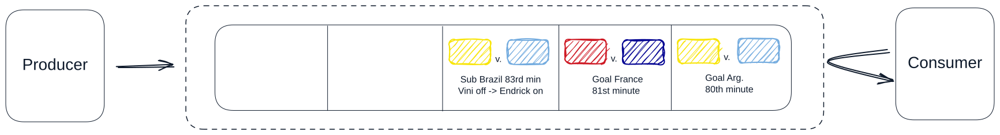

Now, imagine the World Cup expanded from just the top 48 teams to a hypothetical 1,000-team tournament, and all the games are now played at the same time. The number of events has increased significantly, and our single server hosting the queue is struggling to keep up. Similarly, our consumer feels like it has its mouth under a firehose and is crashing under the load.

We need to scale the system by adding more servers to distribute our queue. But how do we ensure that the events are still processed in order?

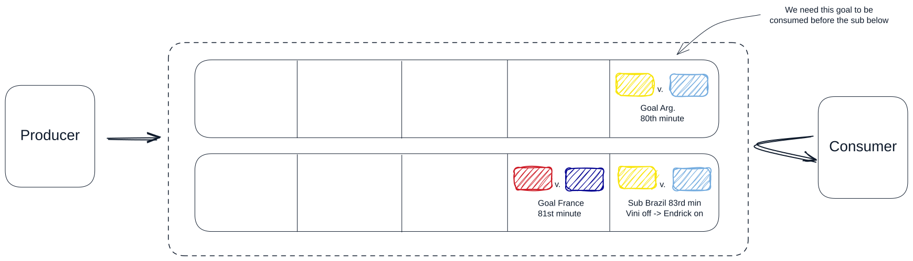

If we were to randomly distribute the events across the servers, we would have a mess on our hands. Goals would be scored before the match even started, and players would be booked for fouls they haven't committed yet.

A logical solution is to distribute the items in the queue based on the game they are associated with. This way, all events for a single game are processed in order because they exist on the same queue. This is one of the fundamental ideas behind Kafka: **messages sent and received through Kafka are distributed across partitions using a partitioning strategy** (Kafka provides sensible defaults, but choosing the right key is critical for ordering guarantees).

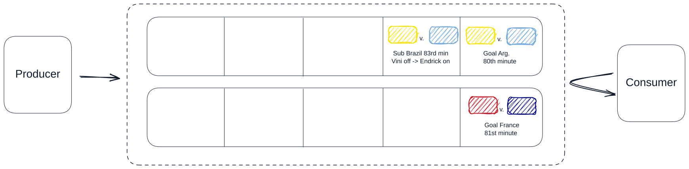

But what about our consumer, it's still overwhelmed. It is easy enough to add more, but how do we make sure that each event is only processed once? We can group consumers together into what Kafka calls a **consumer group**. With consumer groups, each partition is assigned to exactly one consumer in the group, so under normal operation each event is delivered to a single consumer. (In failure scenarios, Kafka's default at-least-once semantics mean a message could be reprocessed, but it won't be split across consumers.)

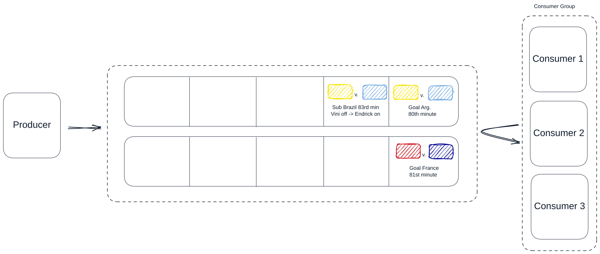

Lastly, we've decided that we want to expand our hypothetical World Cup to more sports, like basketball. But we don't want our soccer website to cover basketball events, and we don't want our basketball website to cover soccer events. So we introduce the concept of **topics**. Each event is associated with a topic, and consumers can subscribe to specific topics. Therefore, our consumers who update the soccer website only subscribe to the soccer topic, and our consumers that update the basketball website only subscribe to basketball events.

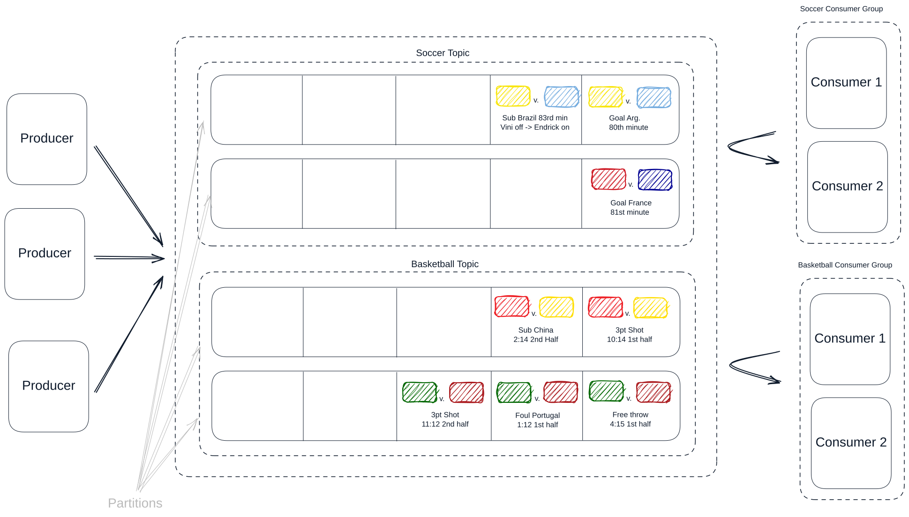

### 🏗️ Basic Terminology and Architecture

The example is great, but let's define Kafka a bit more concretely by formalizing some of the key terms and concepts introduced above.

A Kafka cluster is made up of multiple **brokers**. These are just individual servers (they can be physical or virtual). Each broker is responsible for storing data and serving clients. The more brokers you have, the more data you can store and the more clients you can serve.

Each broker has a number of **partitions**. Each partition is an ordered, immutable sequence of messages that is continually appended to -- think of like a log file. Partitions are the way Kafka scales as they allow for messages to be consumed in parallel.

A **topic** is just a logical grouping of partitions. Topics are the way you publish and subscribe to data in Kafka. When you publish a message, you publish it to a topic, and when you consume a message, you consume it from a topic. Topics are always multi-producer; that is, a topic can have zero, one, or many producers that write data to it.

> So what is the difference between a topic and a partition? A topic is a logical grouping of messages. A partition is a physical grouping of messages. A topic can have multiple partitions, and each partition can be on a different broker. Topics are just a way to organize your data, while partitions are a way to scale your data.

Last up we have our **producers** and **consumers**. Producers are the ones who write data to topics, and consumers are the ones who read data from topics. While Kafka exposes a simple API for both producers and consumers, the creation and processing of messages is on you, the developer. Kafka doesn't care what the data is, it just stores and serves it.

Importantly, you can use Kafka as either a message queue or a stream. Frankly, the distinction here is minor. In both modes, consumers track their progress using offset commits. The key difference is in the consumption pattern: when used as a message queue, each message is processed by one consumer in a group and then effectively "consumed." When used as a stream, the log is retained and can be replayed, multiple consumer groups can independently read the same data, and consumers can process data continuously as it arrives.

Putting the terminology together, a single topic's partitions are spread across the brokers in the cluster; producers route each message to a partition by hashing its key, and each partition is consumed by exactly one member of a consumer group:

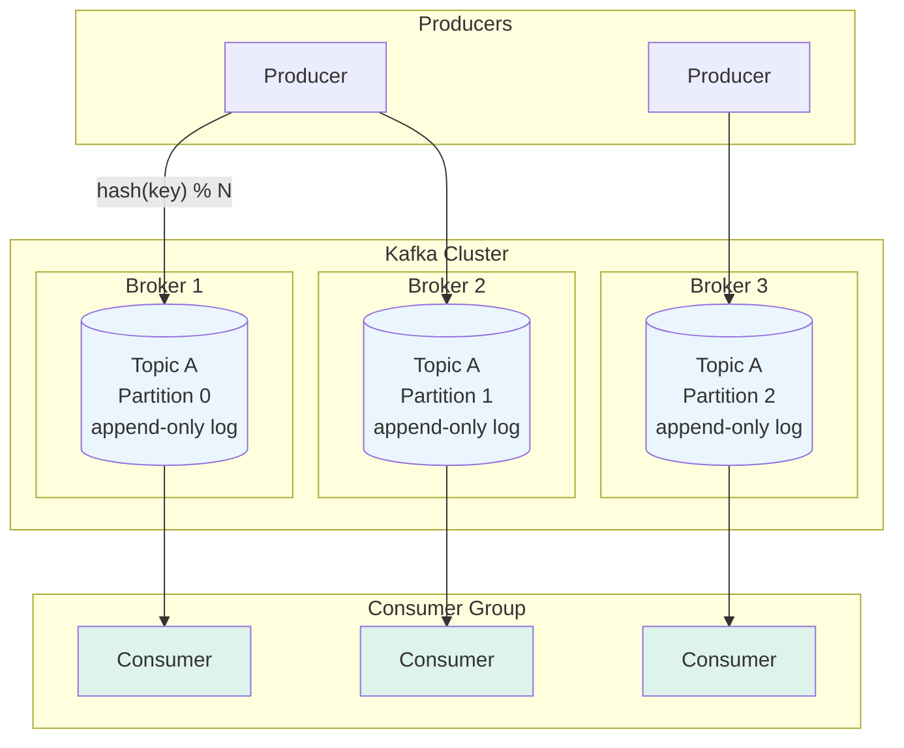

## 🔬 How Kafka Works

When an event occurs, the producer formats a message, also referred to as a record, and sends it to a Kafka topic. A message consists of four fields, all technically optional: a value (the payload), a key, a timestamp, and headers. The key is used to determine which partition the message is sent to. The timestamp records when the message was created or ingested (but ordering within a partition is determined by offsets, not timestamps). Headers, like HTTP headers, are key-value pairs that can be used to store metadata about the message.

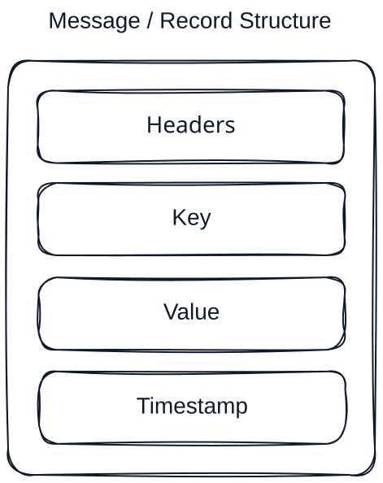

> While not strictly required, the key is used to determine which partition the message is sent to. If you don't provide a key, Kafka will distribute messages across partitions using a default strategy (modern Kafka clients use a "sticky" partitioner that batches messages to the same partition for efficiency, then rotates). So when designing a large, distributed system like you're likely to be asked about in your interview, you'll want to use keys to ensure that related messages land on the same partition and are processed in order. The choice of that key is important. More on this later.

As a quick example, here is how we might put a message on the topic `my-topic` using the Kafka command line tool `kafka-console-producer`:

```bash
kafka-console-producer --bootstrap-server localhost:9092 --topic my_topic --property "parse.key=true" --property "key.separator=:"
> key1: Hello, Kafka with key!
> key2: Another message with a different key
```

> The --property "parse.key=true" and --property "key.separator=:" flags are used to specify that the key-value pairs are separated by a colon.

We can see what the same would look like using `kafkajs`, a popular Node.js client for Kafka:

```python
from kafka import KafkaProducer

# Initialize the producer
producer = KafkaProducer(
    bootstrap_servers=["localhost:9092"],
    client_id="my-app",
)

# Sending messages to the topic 'my_topic' with keys
producer.send("my_topic", key=b"key1", value=b"Hello, Kafka with key!")
producer.send("my_topic", key=b"key2", value=b"Another message with a different key")

# Block until everything buffered is actually delivered
producer.flush()
```

When a message is published to a Kafka topic, Kafka first determines the appropriate partition for the message. This partition selection is critical because it influences the distribution of data across the cluster. This is a two-step process:

1. **Partition Determination**: Kafka uses a partitioning algorithm that hashes the message key to assign the message to a specific partition. If the message does not have a key, Kafka can either round-robin the message to partitions or follow another partitioning logic defined in the producer configuration. This ensures that messages with the same key always go to the same partition, preserving order at the partition level.
2. **Broker Assignment**: Once the partition is determined, Kafka then identifies which broker holds that particular partition. The mapping of partitions to specific brokers is managed by the Kafka cluster metadata, which is maintained by the Kafka controller (a role within the broker cluster). The producer uses this metadata to send the message directly to the broker that hosts the target partition.

Each partition in Kafka functions essentially as an append-only log file. Messages are sequentially added to the end of this log, which is why Kafka is commonly described as a distributed commit log. This append-only design is central to Kafka’s architecture, providing several important benefits:

1. **Immutability**: Once written, messages in a partition cannot be altered in-place. They are eventually removed through retention policies or log compaction, but they're never modified. This immutability is crucial for Kafka's performance and reliability. It simplifies replication, speeds up recovery processes, and avoids consistency issues common in systems where data can be changed.
2. **Efficiency**: By restricting operations to appending data at the end of the log, Kafka minimizes disk seek times, which are a major bottleneck in many storage systems.
3. **Scalability**: The simplicity of the append-only log mechanism facilitates horizontal scaling. More partitions can be added and distributed across a cluster of brokers to handle increasing loads, and each partition can be replicated across multiple brokers to enhance fault tolerance.

Each message in a Kafka partition is assigned a unique offset, which is a sequential identifier indicating the message’s position in the partition. This offset is used by consumers to track their progress in reading messages from the topic. As consumers read messages, they maintain their current offset and periodically commit this offset back to Kafka. This way, they can resume reading from where they left off in case of failure or restart. Note that Kafka provides at-least-once delivery by default: if a consumer crashes after processing a message but before committing its offset, the message will be reprocessed after restart. Exactly-once semantics are possible but require additional configuration (idempotent producers + transactional APIs).

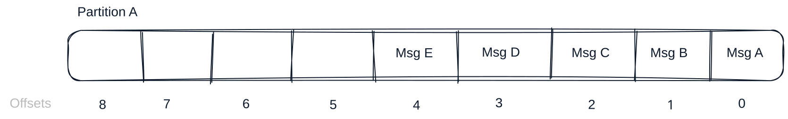

Once a message is published to the designated partition, Kafka ensures its durability and availability through a robust replication mechanism. Kafka employs a leader-follower model for replication, which works as follows:

1. **Leader Replica Assignment**: Each partition has a designated leader replica, which resides on a broker. This leader replica handles all write requests and, by default, read requests for the partition (though Kafka 2.4+ supports consumer reads from follower replicas for latency optimization). The assignment of the leader replica is managed centrally by the cluster controller, which ensures that each partition's leader replica is effectively distributed across the cluster to balance the load.
2. **Follower Replication**: Alongside the leader replica, several follower replicas exist for each partition, residing on different brokers. These followers do not handle direct client requests; instead, they passively replicate the data from the leader replica. By replicating the messages received by the leader replica, these followers act as backups, ready to take over should the leader replica fail.
3. **Synchronization and Consistency**: Followers continuously sync with the leader replica to ensure they have the latest set of messages appended to the partition log. This synchronization is crucial for maintaining consistency across the cluster. If the leader replica fails, one of the follower replicas that has been fully synced can be quickly promoted to be the new leader, minimizing downtime and data loss.
4. **Controller's Role in Replication**: The controller within the Kafka cluster manages this replication process. It monitors the health of all brokers and manages the leadership and replication dynamics. When a broker fails, the controller reassigns the leader role to one of the in-sync follower replicas to ensure continued availability of the partition.

Last up, consumers read messages from Kafka topics using a **pull-based model**. Unlike some messaging systems that push data to consumers, Kafka consumers actively poll the broker for new messages at intervals they control. As explained by [Apache Kafka's official documentation](https://kafka.apache.org/documentation.html#design_pull), this pull approach was a deliberate design choice that provides several advantages: it lets consumers control their consumption rate, simplifies failure handling, prevents overwhelming slow consumers, and enables efficient batching.

To round out our earlier example, here is how we might consume messages from the `my-topic` topic using the Kafka command line tool `kafka-console-consumer`:

```bash
kafka-console-consumer --bootstrap-server localhost:9092 --topic my_topic --from-beginning --property print.key=true --property key.separator=": "

# Output
key1: Hello, Kafka with key!
key2: Another message with a different key
```

Similarly, with `kafkajs`, we can consume messages from the `my_topic` topic:

```python
from kafka import KafkaConsumer

# Initialize the consumer and subscribe to 'my_topic'
consumer = KafkaConsumer(
    "my_topic",
    bootstrap_servers=["localhost:9092"],
    client_id="my-app",
    group_id="my-group",
    auto_offset_reset="earliest",
)

# Consuming messages
for message in consumer:
    print({
        "key": message.key.decode() if message.key else None,
        "value": message.value.decode(),
        "partition": message.partition,
    })
```

Tying it all together, we get something like this:

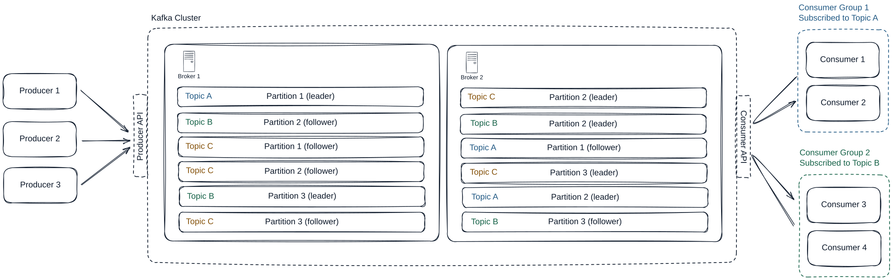

## 🎤 When to use Kafka in your interview

Kafka can be used as either a message queue or a stream.

The key difference between the two lies in the consumption pattern. When used as a message queue, each message is processed by one consumer in a group and then effectively "consumed" (though Kafka still retains it based on retention policy). When used as a stream, consumers continuously process messages as they arrive in real-time, and the same data can be read by multiple independent consumer groups or replayed from any point in the log.

Consider adding a message queue to your system when:

- You have processing that can be done asynchronously. YouTube is a good example of this. When users upload a video we can make the standard definition video available immediately and then put the video (via link) a Kafka topic to be transcoded when the system has time.
- You need to ensure that messages are processed in order. We could use Kafka for our virtual waiting queue in [Design Ticketmaster](https://www.hellointerview.com/learn/system-design/problem-breakdowns/ticketmaster) which is meant to ensure that users are let into the booking page in the order they arrived.
- You want to decouple the producer and consumer so that they can scale independently. Usually this means that the producer is producing messages faster than the consumer can consume them. This is a common pattern in microservices where you want to ensure that one service can't take down another.

Streams are useful when:

- You require continuous and immediate processing of incoming data, treating it as a real-time flow. See [Design an Ad Click Aggregator](https://www.hellointerview.com/learn/system-design/problem-breakdowns/ad-click-aggregator) for an example where we aggregate click data in real-time.
- Messages need to be processed by multiple consumers simultaneously. In [Design FB Live Comments](https://www.hellointerview.com/learn/system-design/problem-breakdowns/fb-live-comments) we can use Kafka as a pub/sub system to send comments to multiple consumers.

## 🔎 What you should know about Kafka for System Design Interviews

There is a lot to know about Kafka. But we'll focus in on this bits that are most likely to be relevant to your system design interview.

> This deep dive is rather exhaustive, especially as it pertains to the knowledge needed for an interview. Don't feel overwhelmed. If you're a junior or mid-level engineer, you likely won't need to know anything below this point. If you're a senior engineer, you should be familiar with some of the topics we're about to cover. Staff engineers and above would do well to know the majority of the topics below, but by no means is this knowledge required to pass an interview.

### 📈 Scalability

Let's start by understanding the constraints of a single Kafka broker. It's important in your interview to estimate the throughput and number of messages you'll be storing in order to determine whether we need to worry about scaling in the first place.

First, there is no hard limit on the size of a Kafka message as this can be configured via `message.max.bytes`. However, it is recommended to keep messages under 1MB to ensure optimal performance via reduced memory pressure and better network utilization.

> It's a common anti-pattern in system design interviews to store large blobs of data in Kafka. Kafka is not a database, and it's not meant to store large files. It's meant to store small messages that can be processed quickly. For example, when designing YouTube, we need to perform post-processing on videos after uploading to chunk and transcode them. Naively, you might place the videos in Kafka so that the chunk/transcoding worker can pull them off the queue asynchronously and process them. This is not a good idea. Instead, you should store the videos in a distributed file system like S3 and place a message in Kafka with the location of the video in S3. This way, the Kafka message is small and serves as a pointer to the full video in S3.

On good hardware, a single broker can store around 1TB of data and handle as many as 1M messages per second (this is very hand wavy as it depends on message size and hardware specs, but is a useful estimate). If your design does not require more than this, than scaling is likely not a relevant conversation.

In the case that you do need to scale, you have a couple strategies at your disposal:

1. **Horizontal Scaling With More Brokers**: The simplest way to scale Kafka is by adding more brokers to the cluster. This helps distribute the load and offers greater fault tolerance. Each broker can handle a portion of the traffic, increasing the overall capacity of the system. It's really important that when adding brokers you ensure that your topics have sufficient partitions to take advantage of the additional brokers. More partitions allow more parallelism and better load distribution. If you are under partitioned, you won't be able to take advantage of these newly added brokers.
2. **Partitioning Strategy**: This should be the main focus of your scaling strategy in an interview and is the main decision you make when dealing with Kafka clusters (since much of the scaling happens dynamically in managed services nowadays). You need to decide how to partition your data across the brokers. This is done by choosing a key for your messages. The partition is determined by hashing the key using a hash function (murmur2 by default) and taking the modulo with the number of partitions: `partition = hash(key) % num_partitions`. If you choose a bad key, you can end up with hot partitions that are overwhelmed with traffic. Good keys are ones that are evenly distributed across the partition space.

> It's worth noting that outside of an interview, many scaling consideration are made easy via managed Kafka services like Confluent Cloud or AWS MSK. These services handle much of the scaling for you, but you should still understand the underlying concepts.

When working with Kafka, you're usually thinking about scaling topics rather than the entire cluster. This is because different topics can have different requirements. For example, you may have a topic that is very high throughput and needs to be partitioned across many brokers, while another topic is low throughput and can be handled by a single broker. To scale a topic, you can increase the number of partitions, which will allow you to take advantage of more brokers.

**How can we handle hot partitions?**

Interviewers love to ask this question. Consider an [Ad Click Aggregator](https://www.hellointerview.com/learn/system-design/problem-breakdowns/ad-click-aggregator) where Kafka stores a stream of click events from when users click on ads. Naturally, you would start by partitioning by ad id. But when Nike launches their new Lebron James ad, you better believe that partition is going to be overwhelmed with traffic and you'll have a hot partition on your hands.

There are a few strategies to handle hot partitions:

1. **No key (default partitioning)**: If you don't provide a key, Kafka will distribute messages across partitions using its default partitioner (modern clients use a sticky strategy that batches to one partition then rotates, producing roughly even distribution over time). The downside is that you lose the ability to guarantee ordering of related messages. If ordering isn't important to your design, this is a good option.
2. **Random salting**: We can add a random number or timestamp to the ad ID when generating the partition key. This can help in distributing the load more evenly across multiple partitions, though it may complicate aggregation logic later on the consumer side. This is often referred to as "salting" the key.
3. **Use a compound key**: Instead of using just the ad ID, use a combination of ad ID and another attribute, such as geographical region or user ID segments, to form a compound key. This approach helps in distributing traffic more evenly and is particularly useful if you can identify attributes that vary independently of the ad ID.
4. **Back pressure**: Depending on your requirements, one easy solution is to just slow down the producer. If you're using a managed Kafka service, they may have built-in mechanisms to handle this. If you're running your own Kafka cluster, you can implement back pressure by having the producer check the lag on the partition and slow down if it's too high.

### 🛡️ Fault Tolerance and Durability

If you chose Kafka, one reason may have been because of its strong durability guarantees. But how does Kafka ensure that your data is safe and that no messages are lost?

Kafka ensures data durability through its replication mechanism. Each partition is replicated across multiple brokers, with one broker acting as the leader and others as followers. When a producer sends a message, it is written to the leader and then replicated to the followers. This ensures that even if a broker fails, the data remains available. Producer acknowledgments (`acks` setting) play a crucial role here. Setting `acks=all` ensures that the message is acknowledged only when all **in-sync replicas (ISR)** have received it, providing the strongest durability guarantee available.

Depending on how much durability you need, you can configure the replication factor of your topics. The replication factor is the number of replicas that are maintained for each partition. A replication factor of 3 is common, meaning that each partition has 3 total replicas (1 leader + 2 followers). So if one broker fails, the data is still available on the other two and we can promote a follower to be the new leader.

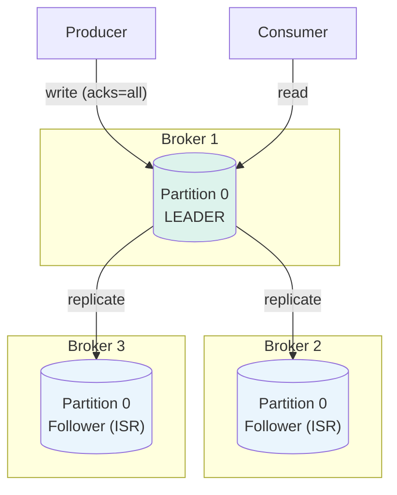

**But what happens when a consumer goes down?**

Kafka is usually thought of as always available. You'll often hear people say, "Kafka is always available, sometimes consistent." This means that a question like, "what happens if Kafka goes down?" is not very realistic, and you may even want to gently push back on the interviewer if they ask this.

What is far more relevant and likely is that a consumer goes down. When a consumer fails, Kafka's fault tolerance mechanisms help ensure continuity:

1. **Offset Management**: Remember that partitions are just append-only logs where each message is assigned a unique offset. Consumers commit their offsets to Kafka after they process a message. This is the consumers way of saying, "I've processed this message." When a consumer restarts, it reads its last committed offset from Kafka and resumes processing from there. This ensures no messages are missed, though some may be reprocessed if the consumer crashed before committing its latest offset (at-least-once delivery).
2. **Rebalancing**: When part of a consumer group, if one consumer goes down, Kafka will redistribute the partitions among the remaining consumers so that all partitions are still being processed.

The trade-off you may need to consider in an interview is when to commit offsets. In [Design a Web Crawler](https://www.hellointerview.com/learn/system-design/problem-breakdowns/web-crawler), for example, you want to be careful not to commit the offset until you're sure the raw HTML has been stored in your blob storage. The more work a consumer has to do, the more likely you are to have to redo work if the consumer fails. For this reason, keeping the work of the consumer as small as possible is a good strategy -- as was the case in Web Crawler where we broke the crawler into 2 phases: downloading the HTML and then parsing it.

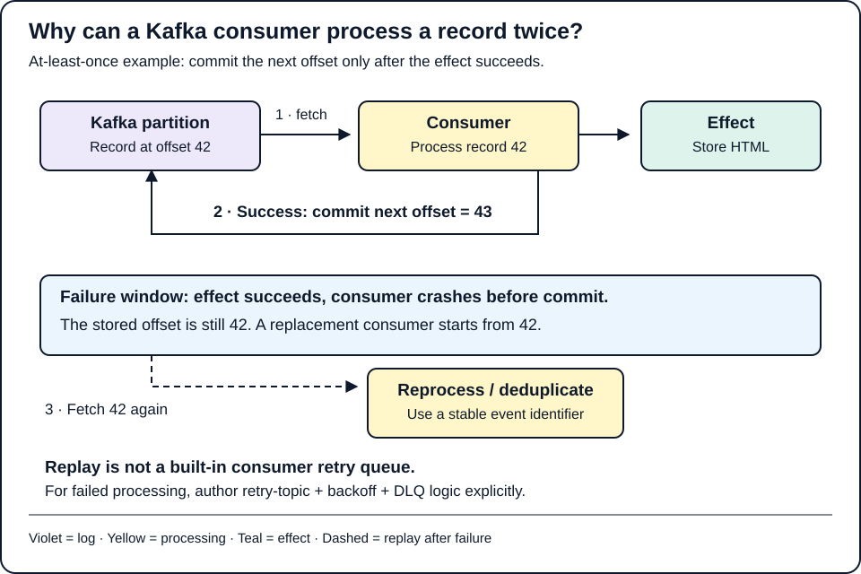

*Committing offset 43 after processing record 42 records the next read position. A crash before that commit can replay 42 and repeat its effect. The optional walkthrough highlights the authored steps; the complete static figure is shown above.*

### ⚠️ Handling Retries and Errors

While Kafka itself handles most of the reliability (as we saw above), our system may fail getting messages into and out of Kafka. We need to handle these scenarios gracefully.

#### Producer Retries

First up, we may fail to get a message to Kafka in the first place. Errors can occur due to network issues, broker unavailability, or transient failures. To handle these scenarios gracefully, Kafka producers support automatic retries. Here's a sneak peek of how you can configure them:

```python
producer = KafkaProducer(
    bootstrap_servers=["localhost:9092"],
    retries=5,                 # Retry up to 5 times
    retry_backoff_ms=100,      # Wait 100ms between retries
    enable_idempotence=True,   # Exactly-once semantics per partition
)
```

> You'll want to ensure that you enable idempotent producer mode to avoid duplicate messages when retries are enabled. This just ensures that messages are only sent once in the case we incorrectly think they weren't sent.

#### Consumer Retries

On the consumer side, we may fail to process a message for any number of reasons. Kafka does not actually support retries for consumers out of the box (but [AWS SQS](https://aws.amazon.com/sqs/) does!) so we need to implement our own retry logic. One common pattern is to set up a custom topic that we can move failed messages to and then have a separate consumer that processes these messages. This way, we can retry messages as many times as we want without affecting the main consumer. If a given message is retried too many times, we can move it to a dead letter queue (DLQ). DLQs are just a place to store failed messages so that we can investigate them later.

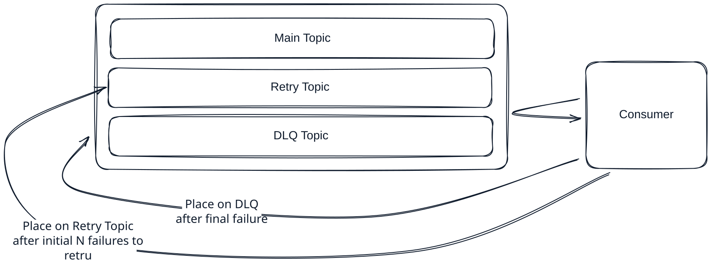

You'll see in our [Web Crawler](https://www.hellointerview.com/learn/system-design/problem-breakdowns/web-crawler) breakdown that we actually opt for SQS instead of Kafka so that we could take advantage of the built-in retry and dead letter queue functionality without having to implement it ourselves.

### ⚡ Performance Optimizations

Especially when using Kafka as an event stream, we need to be mindful of performance so that we can process messages as quickly as possible.

The first thing we can do is batch messages by sending multiple messages in a single `send()` call. Kafka producers naturally batch messages before sending them over the network to reduce overhead. You can also use `sendBatch()` to send messages across multiple topics in one call.

```python
for key, value in [
    (b"key1", b"message1"),
    (b"key2", b"message2"),
    (b"key3", b"message3"),
]:
    producer.send("my_topic", key=key, value=value)

# One batched request per partition, rather than three round trips
producer.flush()
```

Another common way to improve throughput is by compressing messages. This can be done by setting the `compression` option when sending messages. Kafka supports several compression algorithms, including GZIP, Snappy, and LZ4. Essentially, we're just making the messages smaller so that they can be sent faster.

```python
producer = KafkaProducer(
    bootstrap_servers=["localhost:9092"],
    compression_type="gzip",
)

producer.send("my_topic", key=b"key1", value=b"Hello, Kafka!")
producer.flush()
```

Arguably the biggest impact you can have to performance comes back to your choice of partition key. The goal is to maximize parallelism by ensuring that messages are evenly distributed across partitions. In your interview, discussing the partition strategy, as we go into above, should just about always be where you start.

### 🗄️ Retention Policies

Kafka topics have a retention policy that determines how long messages are retained in the log. This is configured via the `retention.ms` and `retention.bytes` settings. The default retention policy is to keep messages for 7 days.

In your interview, you may be asked to design a system that needs to store messages for a longer period of time. In this case, you can configure the retention policy to keep messages for a longer duration. Just be mindful of the impact on storage costs and performance.

## 🗝️ Choosing a Partition Key: Real-World Playbook

Saying "I'll partition by user ID" is easy. Defending it is the part interviewers probe. This section walks through the questions that actually decide a key, then applies them to the use cases that come up again and again in system design interviews.

### 🧭 The Four Questions That Pick the Key

1. **What must happen in order?** Kafka only orders records *within* a partition, so the key defines your **ordering scope**. Find the entity whose events must never be seen out of sequence — an order, an account, a device — and key by it. If nothing needs ordering, you may not need a key at all.
2. **Whose state does the consumer mutate?** Keying by the entity a consumer updates means exactly one consumer owns that entity's state at a time. That is what lets a consumer keep a local cache, a running balance or a window aggregate without distributed locks. The key is your **consistency boundary**, not just a load-balancing hint.
3. **Is the key well spread?** You want cardinality far above the partition count (millions of users across 64 partitions, not 50 US states) and no single key producing a large share of traffic. A key with skew becomes a hot partition no matter how many brokers you add.
4. **Is it stable and known at send time?** The producer has to have the key in hand when it sends, and the key must not change over the entity's life. Keying by `order_status` or `assigned_driver` moves the same entity between partitions mid-lifecycle and silently breaks ordering.

The tension is almost always between question 1 and question 3: the narrower your ordering scope, the better the spread. So pick the **narrowest key that still protects the invariant you care about**.

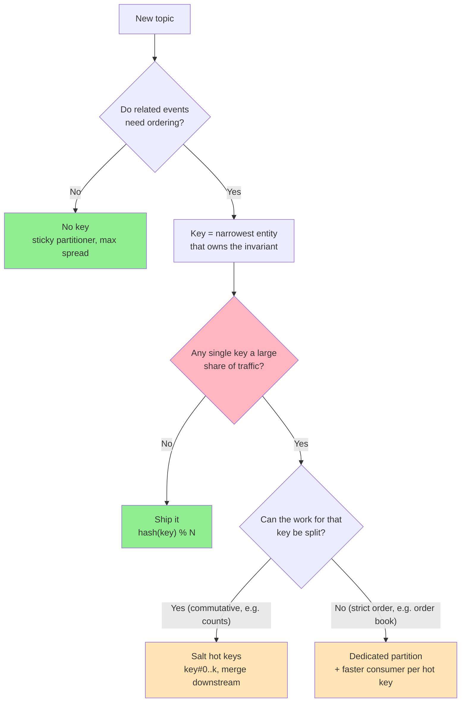

### 🛒 E-commerce Order Lifecycle — key by `order_id`

**Workload.** `OrderPlaced → PaymentAuthorized → Packed → Shipped → Delivered`, consumed by fulfilment, email and analytics services.

**Key: `order_id`.** The invariant is "a single order's state machine advances in order" — fulfilment must never see `Shipped` before `PaymentAuthorized`. Order IDs are high cardinality and every order generates a handful of events, so spread is excellent.

**Why not the alternatives?**
- `customer_id` also preserves per-order ordering (an order belongs to one customer) but widens the ordering scope for no benefit, and a B2B customer placing 50,000 orders a day becomes a hot key.
- `order_status` is the classic wrong answer: every `Shipped` event lands on one partition and the same order hops partitions as it progresses — ordering is lost *and* load is skewed.

> Widen to `customer_id` only when there is a genuinely cross-order invariant, such as "a customer may have at most one open return" or per-customer credit limits.

### 💳 Payments and Ledgers — key by `account_id`

**Workload.** Debits and credits applied to account balances, often by a consumer that keeps balances in a local store.

**Key: `account_id`.** Two concurrent withdrawals against one account must be applied serially or you overdraw it. Keying by account means one consumer owns that account and processes its events one at a time — no row locks or distributed coordination.

**The tempting mistake is `transaction_id`.** It spreads perfectly, but two transactions against the same account land on different partitions, get processed by different consumers in parallel, and race on the balance.

**What about a transfer between two accounts?** It touches two keys, so it cannot live on one partition. Model it as a saga: publish `DebitRequested` keyed by the source account; when that consumer succeeds it emits `CreditRequested` keyed by the destination account. Each step is ordered within its own account, and each carries the transfer ID as an idempotency key so a replay after a crash cannot debit twice.

**Hot accounts.** A large merchant can receive thousands of credits a second onto one `account_id`. Incoming credits only ever add to the balance, so they can be split: give the merchant several sub-ledger accounts (`merchant-42:0` .. `merchant-42:7`) that each take a share of credits, and sum them when reporting the balance. Debits, which must check the balance, stay on a single account.

### 🚗 Ride-sharing Location Pings — key by `driver_id`

**Workload.** Every active driver sends a GPS ping every few seconds, hundreds of thousands of pings per second at peak.

**Key: `driver_id`.** You need each driver's pings in order so the latest position wins and speed or ETA calculations do not jump backwards. Drivers are numerous and each sends at roughly the same rate, so the distribution is naturally even.

**Why not the alternatives?**
- `city_id` is the hot-partition trap: New York produces orders of magnitude more pings than a small town, and your parallelism is capped at the number of cities.
- `ride_id` does not exist while a driver is idle, so it fails the "known at send time" test.

**Different consumers, different keys.** The matching service actually wants pings grouped by *geo cell*, not by driver. Do not change the producer's key to suit one consumer — have a stream processor read the `driver_id`-keyed topic and **re-key** it into a second topic keyed by geohash. Kafka Streams calls this a repartition topic; [Flink](Flink.md) does the same with `keyBy`. One event, two topics, each keyed for its own consumer.

### 💬 Chat and Messaging — key by `conversation_id`

**Workload.** Messages in one-to-one chats and group channels, consumed by persistence and fan-out services.

**Key: `conversation_id`.** Everyone in a conversation must see messages in the same order. A conversation is the natural ordering scope — you never need global order across chats.

**But what about a channel with a million members?** That feels like a hot key, but look at what flows through the topic: *messages sent*, not deliveries. Even a very busy channel produces a few hundred messages a second because humans are typing them, which one partition handles easily. The million-member fan-out happens downstream in the delivery service. Heat comes from write volume per key, not from how many people eventually read it.

### 📊 Ad Click Aggregation — key by `ad_id`, salt the hot ones

**Workload.** Click events aggregated into per-ad counts every minute, as in [Ad Click Aggregator](../ProblemBreakdowns/AdClickAggregator.md).

**Key: `ad_id`.** Grouping by ad lets one consumer own the running count for each ad. But ordering does not actually matter here — counting is commutative, so `click 1 + click 2` equals `click 2 + click 1`. That is what makes the hot-key fix cheap.

**Salt only the hot keys.** When a viral ad launches, append a bucket number for that ad only, spreading it across *k* partitions, and let the aggregator sum the *k* partial counts:

```python
import random

HOT_ADS = {"nike-lebron-launch"}  # refreshed from a traffic-monitoring job
SALT_BUCKETS = 8

def click_key(ad_id: str) -> bytes:
    if ad_id in HOT_ADS:
        # nike-lebron-launch#0 .. #7 hash to different partitions
        return f"{ad_id}#{random.randrange(SALT_BUCKETS)}".encode()
    return ad_id.encode()

producer.send("ad-clicks", key=click_key("nike-lebron-launch"), value=b"{...}")
```

Salting everything doubles the merge work for the 99% of ads that were never hot, so salt selectively. And note this only works because the operation is splittable — compare the exchange example next.

### 📈 Stock Exchange Order Book — key by `symbol`, dedicate the hot ones

**Workload.** Buy and sell orders fed to a matching engine.

**Key: `symbol`.** Price-time priority means orders for a symbol must be matched in exactly the order they arrived. The matching engine holds the order book in memory, so one consumer must own each symbol.

**The hot key here cannot be salted.** NVDA or TSLA may carry a huge share of volume, but splitting a symbol across partitions splits its order book, and two matching engines would each match against half the book — which is simply wrong. When ordering is non-negotiable you **scale the key vertically**: give the hottest symbols dedicated partitions (so they never share with other symbols) and run their consumers on the fastest hardware.

A custom partitioner pins the hot symbols and hashes the rest over the remaining partitions:

```python
from kafka import KafkaProducer
from kafka.partitioner.default import murmur2

DEDICATED = {b"NVDA": 0, b"TSLA": 1, b"AAPL": 2}

def symbol_partitioner(key_bytes, all_partitions, available_partitions):
    if key_bytes in DEDICATED:
        return all_partitions[DEDICATED[key_bytes]]
    shared = all_partitions[len(DEDICATED):]
    return shared[(murmur2(key_bytes) & 0x7FFFFFFF) % len(shared)]

producer = KafkaProducer(
    bootstrap_servers=["localhost:9092"],
    partitioner=symbol_partitioner,
)
```

> The general rule: if the per-key work is **commutative** (counts, sums, max), salt it. If it is **order-dependent** (state machines, matching, balances), isolate it instead.

### 🗃️ Change Data Capture (CDC) — key by the row's primary key

**Workload.** Every insert, update and delete in a database table streamed to Kafka (for example by Debezium) to feed search indexes, caches or a data lake.

**Key: the table's primary key.** Updates to one row must apply in commit order, or a stale `UPDATE` overwrites a newer one in [Elasticsearch](Elasticsearch.md). Debezium keys by primary key by default for exactly this reason.

**Bonus: log compaction.** With `cleanup.policy=compact`, Kafka keeps only the latest record per key, so the topic becomes a complete, replayable snapshot of the table — a new consumer can rebuild its index from offset zero without the topic growing forever. Compaction is keyed, which is one more reason the key must be the row identity and not something like `tenant_id`.

### 🏢 Multi-tenant SaaS Events — key by `tenant_id:entity_id`, not `tenant_id`

**Workload.** Events from thousands of customer organisations sharing one topic.

**The trap: `tenant_id`.** It is attractive because consumers can keep per-tenant state, but tenant sizes follow a power law — one enterprise customer can be bigger than your next thousand combined, and that whale pins one partition.

**Key: a compound key, `tenant_id:entity_id`** (for example `acme:invoice-881`). Ask what really needs ordering: almost always it is a single document, ticket or invoice, not the entire tenant. The compound key keeps per-entity order, spreads the whale's traffic, and still lets consumers find the tenant by parsing the key. If a few tenants genuinely need tenant-wide ordering, give them their own topic.

### 📦 Inventory During a Flash Sale — key by `sku`, then split the stock

**Workload.** Reservation requests decrementing stock for a product, where overselling is unacceptable.

**Key: `sku`.** One consumer per SKU serialises decrements, so two buyers can never both take the last unit.

**When one SKU goes hot** (a console launch, concert merch), you cannot salt the requests alone — two consumers decrementing the same counter would oversell. Instead **split the invariant itself**: divide 10,000 units into 10 buckets of 1,000, key requests by `sku:bucket`, and let each bucket's consumer sell its own allocation. Each bucket is an independent counter, so splitting is now safe. When a bucket empties, route its traffic to the buckets with stock left. This is the same idea as salting — it only works once you make the work splittable.

### 🌐 Clickstream Sessionisation — key by `user_id` (or device ID)

**Workload.** Page views and clicks grouped into sessions ("30 minutes of inactivity ends a session") for analytics.

**Key: `user_id`, or an anonymous device ID for logged-out users.** Sessionising requires seeing all of one user's events, in order, in one place. `session_id` sounds right but sessions are exactly what you are trying to *compute*, so the producer does not have it yet.

**Hot keys come from bots.** A scraper firing thousands of requests a second under one device ID will heat a partition. Filter or rate-limit known bots before they reach the topic, or route them to a separate topic, rather than reshaping the key for everyone.

### 🪵 Logs and Metrics — no key at all

**Workload.** Application logs or metrics shipped to a search index or time-series store.

**Key: none.** Each line is independent, the sink indexes by timestamp, and nobody cares which order two log lines from different pods arrive in. Sending without a key lets the sticky partitioner build large batches and spread load evenly — the best possible throughput.

> Do not reach for a key just because a field exists. Keying by `host` here would make every chatty host a hot spot for no ordering benefit. A key is a cost you pay for ordering — only pay it when you need it.

### 🧾 Cheat Sheet

| Use case | Partition key | Invariant it protects | Hot-key risk | Mitigation |
|---|---|---|---|---|
| Order lifecycle | `order_id` | One order's state machine | Low | — |
| Payments / ledger | `account_id` | Serial balance updates | Medium (merchant accounts) | Sub-ledgers per merchant, saga for transfers |
| Driver locations | `driver_id` | Latest position wins | Low | Re-key to geohash for matching |
| Chat | `conversation_id` | Same message order for everyone | Low (writes are human-paced) | Fan-out downstream |
| Ad clicks | `ad_id` | One owner per running count | High (viral ads) | Salt hot keys, merge partial counts |
| Order book | `symbol` | Price-time priority | High (popular stocks) | Dedicated partitions, no salting |
| CDC | Primary key | Row updates in commit order | Low | Log compaction |
| Multi-tenant SaaS | `tenant_id:entity_id` | Per-entity order | High if `tenant_id` alone | Compound key, own topic for whales |
| Flash-sale inventory | `sku` → `sku:bucket` | No overselling | High (launch SKUs) | Split stock into buckets |
| Clickstream | `user_id` / device ID | Complete sessions | Medium (bots) | Filter bots upstream |
| Logs / metrics | None | Nothing | None | Sticky partitioner |

### ⚠️ Gotchas Interviewers Like to Probe

- **Adding partitions remaps keys.** `hash(key) % N` changes when `N` changes, so after you go from 12 to 24 partitions, new events for a key may land on a different partition than its old events — and two consumers could briefly process the same entity out of order. Kafka never moves existing data. Over-provision partitions at creation time (enough for a couple of years of growth) rather than planning to add them later; if you must, drain the topic or migrate to a new topic.
- **Sizing the partition count.** A practical starting point is `partitions ≥ max(target throughput ÷ per-partition producer throughput, target throughput ÷ per-consumer throughput)`. Since one partition feeds at most one consumer in a group, the partition count is also your ceiling on consumer parallelism.
- **Ordering also needs a well-behaved producer.** A key keeps related records on one partition, but retries can still reorder in-flight batches unless the producer is idempotent (`enable_idempotence=True`, which keeps order with up to five in-flight requests).
- **Null key ≠ empty string.** An empty-string key is a real key — every such record hashes to the same partition. Make sure "no key" is actually `None`.
- **One key, one consumer bottleneck.** Even perfect hashing cannot split a single key. If your slowest-to-process key needs more throughput than one consumer thread provides, no amount of partitions helps — you need salting, isolation or a smaller ordering scope.

## 📝 Summary

Congrats! You made it through. Let's recap quickly.

Apache Kafka is an open-source, distributed event streaming platform engineered for high performance, scalability, and durability. It uses producers to send messages to topics, and consumers to read them, with messages being stored in ordered, immutable partitions across multiple brokers (servers). It is highly suited for real-time data processing and asynchronous message queuing in system design.

When it comes to scale, make sure you start by discussing your partitioning strategy and how you'll handle hot partitions. And remember, Kafka is always available, sometimes consistent 😝

Answer the question below to find your gaps.

## 🎓 Key Takeaways

- **Partitions are the unit of parallelism and ordering.** A topic is a logical grouping; partitions are the physical, append-only logs. Ordering is only guaranteed *within* a partition, so choosing a good partition key is the single most important decision — it's where your scaling conversation should start.
- **Consumer groups distribute work without double-processing.** Each partition is assigned to exactly one consumer in a group, and consumers track progress via committed offsets so they can resume after a crash or rebalance.
- **Durability comes from replication + acks.** Each partition is replicated (factor of 3 is common: 1 leader + 2 followers), and `acks=all` only acknowledges once all in-sync replicas (ISR) have the message — the strongest guarantee. Kafka is "always available, sometimes consistent."
- **Pick the narrowest key that protects your invariant.** The key is the ordering scope and the consistency boundary: `order_id` for an order's state machine, `account_id` for balances, `conversation_id` for chat, no key for logs. Keys must be high-cardinality, stable, and known at send time — and adding partitions later remaps them.
- **Watch out for hot partitions.** A skewed key (e.g. a viral ad) overwhelms one partition; mitigate with no-key default partitioning, random salting, compound keys, or producer back pressure. Salt only when the per-key work is commutative (counts); for order-dependent work (order books, balances) isolate the hot key on its own partition instead.
- **Kafka delivers at-least-once by default.** A consumer that crashes after processing but before committing will reprocess — keep consumer work small, commit carefully, and reach for idempotent producers + transactions if you need exactly-once.
- **Don't abuse Kafka as a database or blob store.** Keep messages under ~1MB and store large payloads (e.g. videos) in S3 with just a pointer in the message; a single broker handles roughly 1TB and up to ~1M messages/sec before scaling matters.

## 📚 Related Concepts

- [Redis](Redis.md) — an alternative for lightweight queues and pub/sub; contrast its in-memory model with Kafka's durable log.
- [Flink](Flink.md) — a stream-processing engine that commonly consumes from Kafka topics.
- [Consistent Hashing](../../CoreConcepts/ConsistentHashing.md) — the key-hashing intuition behind partition assignment.
- [Sharding](../../CoreConcepts/Sharding.md) — partitioning data across nodes, the same principle Kafka applies to topics.
- [Managing Long Running Tasks](../Patterns/ManagingLongRunningTasks.md) — the async-worker pattern Kafka enables (e.g. YouTube transcoding).
- [Scaling Writes](../Patterns/ScalingWrites.md) — where Kafka fits as a write-buffer and decoupling layer.
- [Ad Click Aggregator](../ProblemBreakdowns/AdClickAggregator.md) — the hot-partition and streaming example referenced throughout this deep dive.
- [Web Crawler](../ProblemBreakdowns/WebCrawler.md) — offset-commit timing and the Kafka-vs-SQS retry trade-off in practice.

---
*Source: [https://www.hellointerview.com/learn/system-design/deep-dives/kafka](https://www.hellointerview.com/learn/system-design/deep-dives/kafka)*
