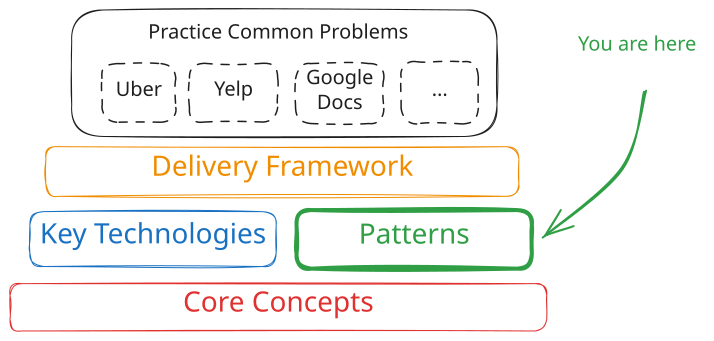
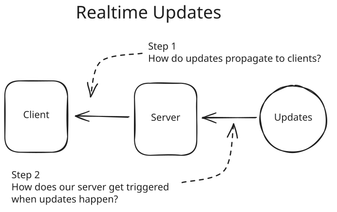
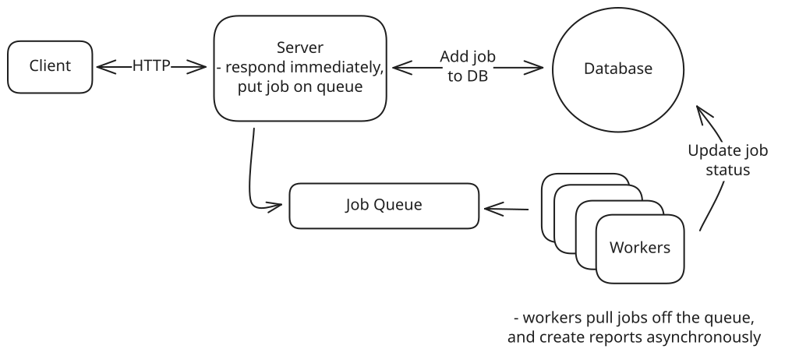
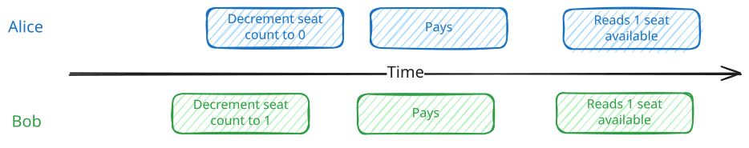
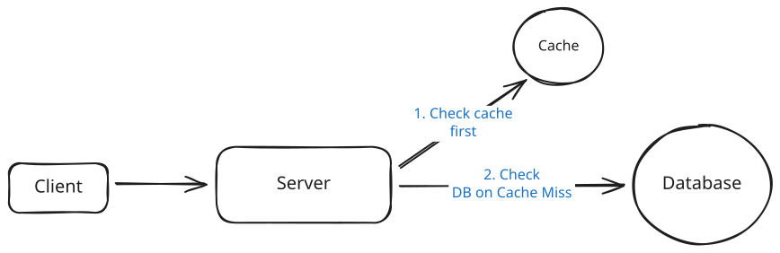
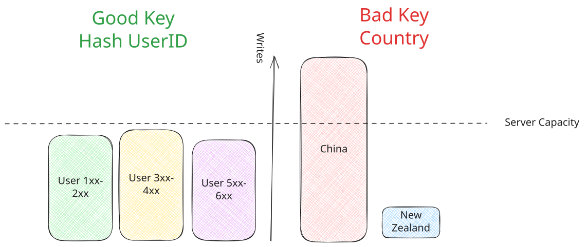
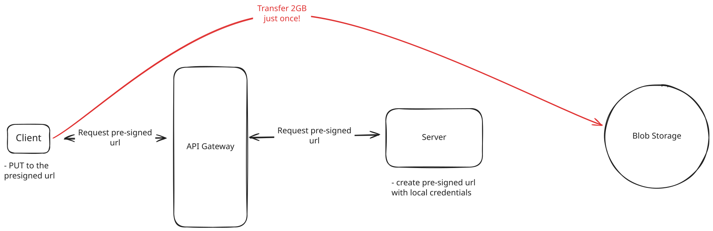
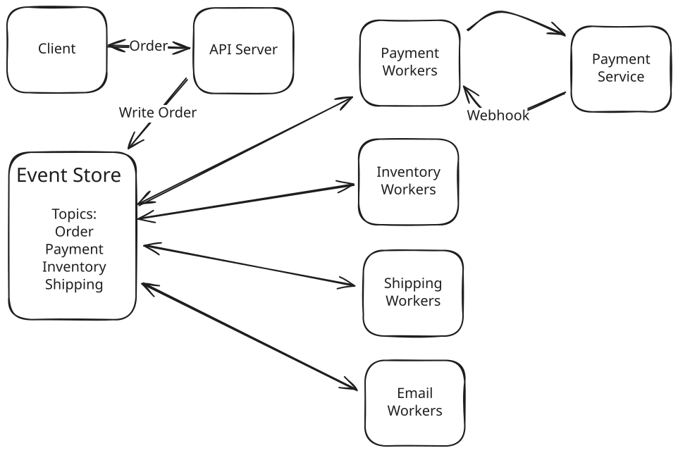
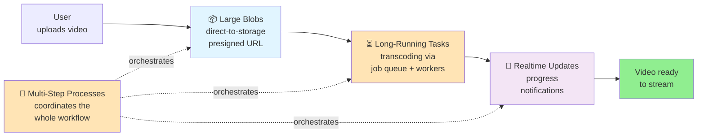

# 🧩 Common Patterns

The most common system design interview patterns, built by FAANG managers and staff engineers

> **Overview**: By combining the key technologies and core concepts, you can build a wide variety of systems — but success in the time-constrained interview is all about *patterns*. Recognizing which patterns a design requires lets you fall back on best practices and save time instead of reinventing the wheel. This page catalogs the recurring building blocks (realtime updates, long-running tasks, contention, read/write scaling, large blobs, multi-step processes, and proximity search) that show up across nearly every problem breakdown.

## 📋 Table of Contents

- [🧒 Layman's Explanation](#-laymans-explanation)
- [📡 Pushing Realtime Updates](#-pushing-realtime-updates)
- [⏳ Managing Long-Running Tasks](#-managing-long-running-tasks)
- [🔒 Dealing with Contention](#-dealing-with-contention)
- [📖 Scaling Reads](#-scaling-reads)
- [✍️ Scaling Writes](#-scaling-writes)
- [📦 Handling Large Blobs](#-handling-large-blobs)
- [🔗 Multi-Step Processes](#-multi-step-processes)
- [📍 Proximity-Based Services](#-proximity-based-services)
- [🎯 Pattern Selection](#-pattern-selection)
- [🎓 Key Takeaways](#-key-takeaways)
- [📚 Related Concepts](#-related-concepts)

---

## 🧒 Layman's Explanation

Think of an experienced chef. A beginner treats every dish as a brand-new problem, figuring out from scratch how to thicken a sauce or keep a steak from drying out. A seasoned chef instead recognizes a handful of *techniques* — searing, braising, emulsifying, resting — and knows which one each dish needs the moment they read the recipe. They don't reinvent how to make a roux every time; they reach for the pattern.

System design patterns are exactly these cooking techniques. When you need to push updates to users as they happen, that's one technique (realtime updates). When a job takes too long to answer synchronously, that's another (long-running tasks). When two users grab for the last concert ticket at once, that's a third (contention). Learning the small set of patterns on this page means that when an interview problem lands, you already know what's interesting, what's routine, and where the usual failure modes hide — so you can spend your time on the tricky parts instead of rediscovering the basics.

By taking the [key technologies](https://www.hellointerview.com/learn/system-design/in-a-hurry/key-technologies) and [core concepts](https://www.hellointerview.com/learn/system-design/in-a-hurry/core-concepts) we've discussed and combining them, you can build a wide variety of systems. But success in the time-constrained environment of interviewing is all about patterns. If you're able to identify the patterns that are required for a specific design, not only can you fall back to best practices but you'll save a bunch of time trying to reinvent the wheel.

> The ability to identify and apply patterns is a skill that often separates senior engineers from more junior engineers in the system design interview. Patterns allow you to know what's interesting and what's not, they also save you time by helping you to see common failure modes rather than reverse engineering them on the fly!

What follows are some common patterns that you can use to build systems. These patterns are not mutually exclusive, and you'll often find yourself utilizing several of them to build a system. In each of our [Problem Breakdowns](https://www.hellointerview.com/learn/system-design/problem-breakdowns/overview), we'll call out patterns that are used to build the system so you can spot these commonalities and read about common deep dives and pitfalls.

## 📡 Pushing Realtime Updates

In many systems, you'll need to be able to make updates to the user in real-time. For synchronous APIs, this is as simple as returning a response once the request is completed. For other systems like chat applications, notifications, or live dashboards, you'll need to be able to push updates to the user as they happen.

There are a lot of decisions to make when implementing realtime updates. First, you'll need to choose a protocol. Simple HTTP polling is the simplest option, but it's not the most efficient. Server-sent events (SSE) and websockets are purpose-built for realtime updates, but the infrastructure can be tricky to get right. Read our [Networking Essentials](https://www.hellointerview.com/learn/system-design/core-concepts/networking-essentials) core concept for a deep dive on the protocol choice. We generally recommend starting with HTTP polling until it no longer serves your needs. Once you're there, you can consider SSE or websockets.

For the server side of realtime updates, you again have more options! Pub/Sub services are a common way to decouple the publisher and subscriber (used in our [Whatsapp](https://www.hellointerview.com/learn/system-design/problem-breakdowns/whatsapp) breakdown), while stateful servers in a consistent hash ring or other configuration can be used for situations where processing is heavier (used in our [Google Docs](https://www.hellointerview.com/learn/system-design/problem-breakdowns/google-docs) breakdown).

We talk about all of these options at length in our [Pushing Realtime Updates](https://www.hellointerview.com/learn/system-design/patterns/realtime-updates) Pattern.

## ⏳ Managing Long-Running Tasks

Many operations in distributed systems take too long for synchronous processing - video encoding, report generation, bulk operations, or any task that takes more than a few seconds. The Managing Long-Running Tasks pattern splits these operations into immediate acknowledgment and background processing.

When users submit heavy tasks, your web server instantly validates the request, pushes a job to a queue (like Redis or Kafka), and returns a job ID within milliseconds. Separate worker processes continuously pull jobs from the queue and execute the actual work. This provides fast user response times, independent scaling of web servers and workers, and fault isolation.

> Many candidates are quick to pull the trigger on pushing their processing behind a queue, but this is frequently a bad decision and you need to be careful about the tradeoffs. If you have short-running jobs, returning the status of the job synchronously with the request simplifies your architecture dramatically providing clearer back-pressure and better user experience.

The key technologies are message queues for job coordination and worker pools for processing. You'll need to handle job status tracking, retries, and failure scenarios like dead letter queues for poison messages.

Get the full breakdown of async worker pools, job queues, and failure handling in our [Managing Long-Running Tasks](https://www.hellointerview.com/learn/system-design/patterns/long-running-tasks) Pattern.

## 🔒 Dealing with Contention

When multiple users try to access the same resource simultaneously, like booking the last concert ticket or bidding on an auction item, you need mechanisms to prevent race conditions and ensure data consistency. This pattern addresses coordination challenges in distributed systems.

Solutions range from database-level approaches like pessimistic locking and optimistic concurrency control to distributed coordination mechanisms. The key is understanding when to use atomicity and transactions versus explicit locking strategies. For distributed systems, you might need distributed locks, two-phase commit protocols, or queue-based serialization.

Trade-offs include performance versus consistency guarantees, and simple database solutions versus complex distributed coordination. Most problems start with single-database solutions before scaling to distributed approaches.

> Databases are built around problems of contention. When you separate your data into multiple databases, you're taking on all of the challenges that the database systems were originally designed to solve. In some cases this can be completely appropriate, but be careful about doing it prematurely. Interviewers are keen to dig in and see if you really understand all that you're giving up by breaking your data apart.

Dive deeper into locks, transactions, and distributed coordination techniques in our [Dealing with Contention](https://www.hellointerview.com/learn/system-design/patterns/dealing-with-contention) Pattern.

## 📖 Scaling Reads

As your application grows from hundreds to millions of users, read traffic often becomes the first bottleneck. While writes create data, reads consume it - and read traffic typically grows much faster than write traffic. The Scaling Reads pattern addresses high-volume read requests through database optimization, horizontal scaling, and intelligent caching.

For most applications, the read-to-write ratio starts at 10:1 but often reaches 100:1 or higher. Consider Instagram: when you open the app, you see dozens of photos requiring hundreds of database queries for metadata, user info, and engagement data. Meanwhile, you might only post once per day - a single write operation.

The solution follows a natural progression: optimize read performance within your database through indexing and denormalization, scale horizontally with read replicas, then add external caching layers like Redis and CDNs.

Key considerations include managing cache invalidation, handling replication lag in read replicas, and dealing with hot keys where millions of users request the same popular content simultaneously.

Learn about indexing strategies, read replicas, and cache invalidation patterns in our [Scaling Reads](https://www.hellointerview.com/learn/system-design/patterns/scaling-reads) Pattern.

## ✍️ Scaling Writes

As your application grows from hundreds to millions of writes per second, individual database servers and storage systems hit hard limits. The Scaling Writes pattern addresses write bottlenecks through [sharding](https://www.hellointerview.com/learn/system-design/core-concepts/sharding), batching, and intelligent load management.

The core strategies are horizontal [sharding](https://www.hellointerview.com/learn/system-design/core-concepts/sharding) (distributing data across multiple servers), vertical partitioning (separating different types of data), and handling write bursts through queues and load shedding. Key considerations include selecting good partition keys that distribute load evenly while keeping related data together.

For burst handling, you can use write queues to buffer temporary spikes or implement load shedding to prioritize important writes during overload. Batching techniques help reduce per-operation overhead by grouping multiple writes together.

Read our comprehensive guide to [sharding](https://www.hellointerview.com/learn/system-design/core-concepts/sharding), partitioning, and handling write bursts in our [Scaling Writes](https://www.hellointerview.com/learn/system-design/patterns/scaling-writes) Pattern.

## 📦 Handling Large Blobs

Large files like videos, images, and documents need special handling in distributed systems. Instead of routing gigabytes through your application servers, this pattern uses direct client-to-storage transfers with presigned URLs and CDN delivery.

Your application server generates temporary, scoped credentials (presigned URLs) that let clients upload directly to blob storage like S3. Downloads come from CDNs with signed URLs for access control. This eliminates your servers as bottlenecks while providing resumable uploads, progress tracking, and global distribution.

Key challenges include state synchronization between your database metadata and blob storage, handling upload failures, and managing the lifecycle of large files. Event notifications from storage services help keep your application state consistent.

Explore advanced techniques for presigned URLs, resumable uploads, and CDN delivery in our [Large Blobs](https://www.hellointerview.com/learn/system-design/patterns/large-blobs) Pattern.

## 🔗 Multi-Step Processes

Complex business processes often involve multiple services and long-running operations that must survive failures, retries, and external dependencies. This pattern provides reliable coordination for workflows like order fulfillment, user onboarding, or payment processing.

Solutions range from simple single-server orchestration to sophisticated workflow engines and durable execution systems. Event sourcing provides a distributed approach where each step emits events that trigger subsequent steps. Modern workflow systems like Temporal or AWS Step Functions handle state management, failure recovery, and retry logic automatically.

The key insight is moving from scattered state management and manual error handling to declarative workflow definitions where the system guarantees exactly-once execution and maintains complete audit trails.

See detailed examples and implementation strategies for workflow engines and durable execution in our [Multi-Step Processes](https://www.hellointerview.com/learn/system-design/patterns/multi-step-processes) Pattern.

## 📍 Proximity-Based Services

Several systems like [Design Uber](https://www.hellointerview.com/learn/system-design/problem-breakdowns/uber) or [Design Gopuff](https://www.hellointerview.com/learn/system-design/problem-breakdowns/gopuff) will require you to search for entities by location. [Geospatial indexes](https://www.hellointerview.com/learn/system-design/deep-dives/proximity-search) are the key to efficiently querying and retrieving entities based on geographical proximity. These services often rely on extensions to commodity databases like [PostgreSQL with PostGIS extensions](https://postgis.net/) or [Redis' geospatial data type](https://redis.io/docs/latest/develop/data-types/geospatial/), or dedicated solutions like Elasticsearch with geo-queries enabled.

The architecture typically involves dividing the geographical area into manageable regions and indexing entities within these regions. This allows the system to quickly exclude vast areas that don't contain relevant entities, thereby reducing the search space significantly.

> While geospatial indexes are great, they're only really necessary when you need to index hundreds of thousands or millions of items. If you need to search through a map of 1,000 items, you're better off scanning all of the items than the overhead of a purpose-built index or service.

Note that most systems won't require users to be querying globally. Often, when proximity is involved, it means users are looking for entities _local_ to them.

## 🎯 Pattern Selection

These patterns often work together to solve complex system design challenges. A video platform might use **Large Blobs** for video uploads, **Long-Running Tasks** for transcoding, **Realtime Updates** for progress notifications, and **Multi-Step Processes** to coordinate the entire workflow.

The diagram below shows how these four patterns compose in that single video-platform example — each pattern owning one stage of the flow:

The key is recognizing which patterns apply to your specific problem and understanding their trade-offs. Start with simpler approaches (polling, single-server orchestration) and only add complexity when you have specific requirements that demand it.

In system design interviews, proactively identifying and applying these patterns demonstrates architectural maturity and helps you focus on the most important aspects of your design rather than getting bogged down in implementation details.

## 🎓 Key Takeaways

- **Patterns are the senior-engineer shortcut.** Recognizing which patterns a design needs lets you fall back on best practices, spot common failure modes early, and save the time you'd otherwise spend reinventing the wheel.
- **The core catalog is small:** realtime updates, long-running tasks, contention, scaling reads, scaling writes, large blobs, multi-step processes, and proximity search cover the vast majority of interview problems.
- **Start simple, then add complexity.** Prefer HTTP polling over websockets, synchronous responses over queues, and single-database solutions over distributed coordination — reach for the heavier tool only when a specific requirement demands it.
- **Watch the premature-async and premature-split traps.** Pushing short jobs behind a queue or splitting data across databases before you need to gives up back-pressure, clarity, and the guarantees databases were built to provide.
- **Patterns compose.** Real systems (like a video platform) stack several at once — Large Blobs + Long-Running Tasks + Realtime Updates coordinated by a Multi-Step Process — so learn how they fit together, not just in isolation.
- **Geospatial indexes only earn their keep at scale.** For a few thousand items, scanning beats the overhead of a purpose-built proximity index.

## 📚 Related Concepts

- [Pushing Realtime Updates](../Patterns/Real-TimeUpdates.md) — polling vs. SSE vs. websockets, pub/sub, and stateful servers.
- [Managing Long-Running Tasks](../Patterns/ManagingLongRunningTasks.md) — async worker pools, job queues, and failure handling.
- [Dealing with Contention](../Patterns/DealingWithContention.md) — locks, transactions, and distributed coordination.
- [Scaling Reads](../Patterns/ScalingReads.md) — indexing, read replicas, and caching layers.
- [Scaling Writes](../Patterns/ScalingWrites.md) — sharding, partitioning, and handling write bursts.
- [Handling Large Blobs](../Patterns/HandlingLargeBlobs.md) — presigned URLs, resumable uploads, and CDN delivery.
- [Multi-Step Processes](../Patterns/Multi-StepProcesses.md) — workflow engines, event sourcing, and durable execution.
- [Proximity Search](../DeepDives/ProximitySearch.md) — geospatial indexes for location-based queries.
- [Sharding](../../CoreConcepts/Sharding.md) — the write-scaling backbone behind partitioned data.
- [Consistent Hashing](../../CoreConcepts/ConsistentHashing.md) — the hash ring used for stateful realtime servers.
- [Caching](../../CoreConcepts/Caching.md) — the read-scaling workhorse across these patterns.
- [Networking](../../CoreConcepts/Networking.md) — protocol choices that underpin realtime update delivery.

---
*Source: [https://www.hellointerview.com/learn/system-design/in-a-hurry/patterns](https://www.hellointerview.com/learn/system-design/in-a-hurry/patterns)*
