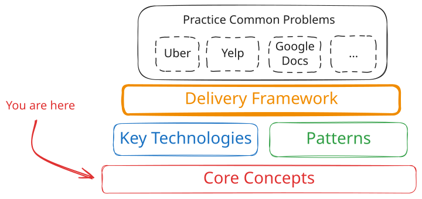
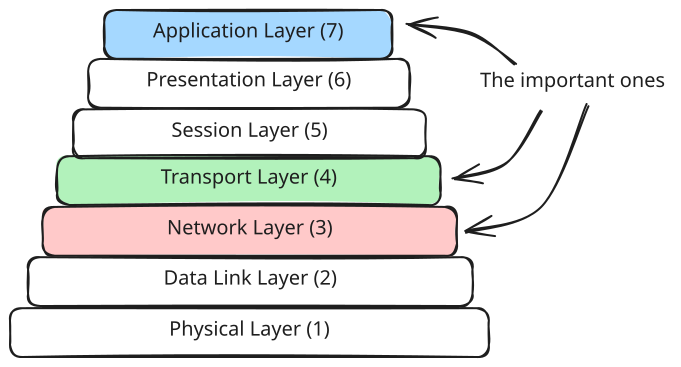
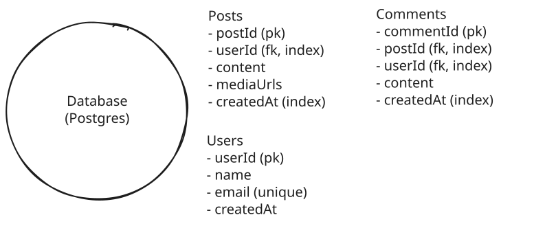
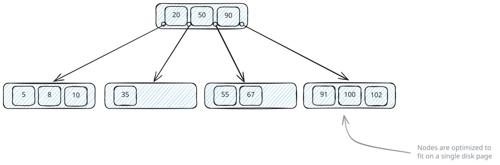
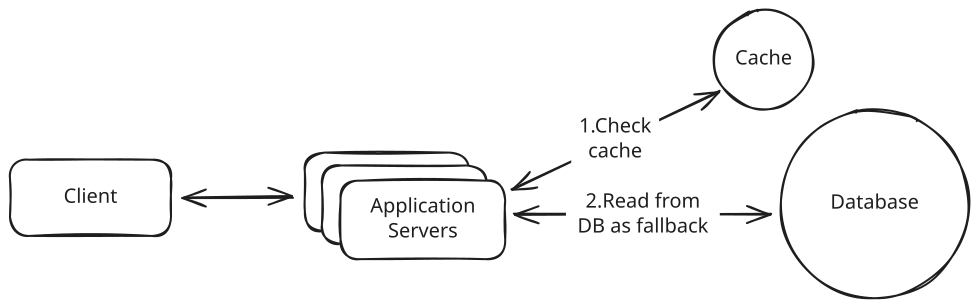
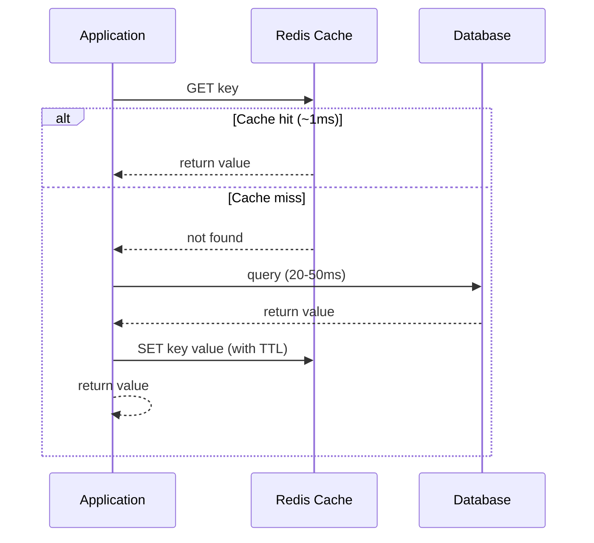
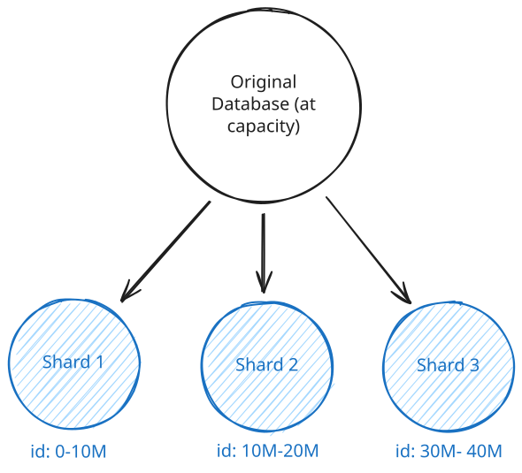
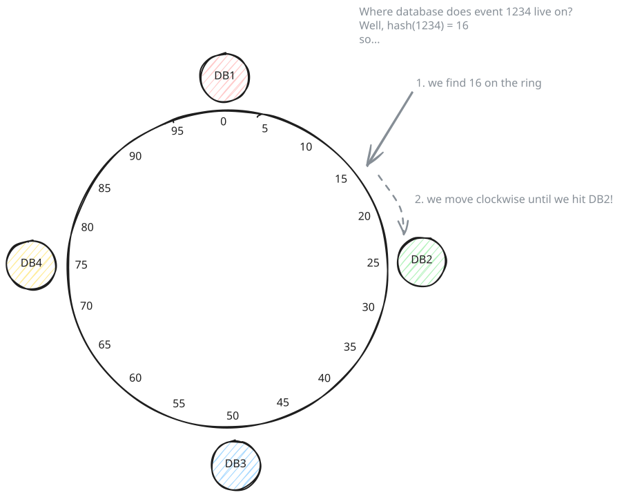
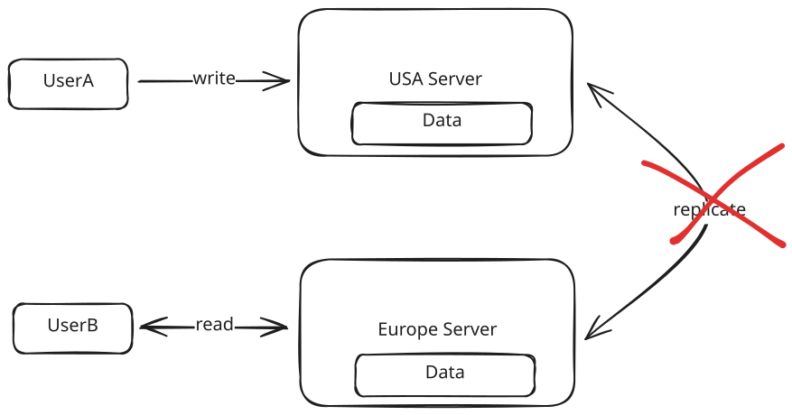

# 🧠 Core Concepts

> **Overview**: Core concepts are the technology-agnostic building blocks that show up in nearly every system design interview — caching, sharding, indexing, data modeling, networking, consistency, and the rough numbers behind capacity decisions. They are the vocabulary and grammar you need *before* you can design Instagram or a ride-sharing service, and interviewers assume you know them. This page gives a quick, interview-focused tour of each, with links out to the full deep dives.

## 📋 Table of Contents

- [🧒 Layman's Explanation](#laymans-explanation)
- [🌐 Networking Essentials](#networking-essentials)
- [🔌 API Design](#api-design)
- [🗄️ Data Modeling](#data-modeling)
- [🔍 Database Indexing](#database-indexing)
- [⚡ Caching](#caching)
- [🧩 Sharding](#sharding)
- [🔗 Consistent Hashing](#consistent-hashing)
- [⚖️ CAP Theorem](#cap-theorem)
- [🔢 Numbers to Know](#numbers-to-know)
- [🎓 Key Takeaways](#key-takeaways)
- [📚 Related Concepts](#related-concepts)

---

## 🧒 Layman's Explanation

Imagine you're setting up a busy restaurant. **Networking** is how the waiters talk to the kitchen — a quick shout works for a simple order, but a live back-and-forth conversation (WebSockets) is different from the kitchen just calling out "order up!" (Server-Sent Events). **API design** is the menu: a clear, predictable list of what customers can ask for. **Data modeling** is how you organize the pantry — one big labeled shelf per ingredient (normalized) versus pre-made meal kits with everything bundled together (denormalized). **Indexing** is the alphabetized recipe binder so a cook doesn't flip through every page to find one dish. **Caching** is keeping the popular dishes warm on the pass so you don't re-cook them for every order. **Sharding** is opening more kitchens when one can't keep up, each handling its own set of tables. **Consistent hashing** is the seating plan that lets you add or close a kitchen without reshuffling every reservation. The **CAP theorem** is the hard choice during a crisis: if the phone line to the second kitchen goes down, do you stop taking orders (consistency) or keep serving with slightly-out-of-date info (availability)? And **Numbers to Know** are the rules of thumb — how many covers one cook can handle — that tell you *when* you actually need that second kitchen instead of guessing.

Learn the most important concepts you'll need for system design interviews, put together by FAANG managers and staff engineers.

Core concepts are the fundamental principles and techniques that form the foundation of every system design interview. Unlike specific technologies (Redis, Kafka) or problem-specific patterns, these are technology-agnostic building blocks that show up across nearly every design problem you'll encounter.

Think of core concepts as the vocabulary and grammar of system design. Before you can discuss how to scale Instagram or design a ride-sharing service, you need to understand what caching is, when to shard a database, and how networks actually work. Interviewers assume you know these and will probe your understanding when you propose using them.

This page provides a quick overview of each core concept with just enough context to understand what it is, why it matters, and when to reach for it. Each section links to a deeper article where you can learn the full details, common pitfalls, and interview-specific guidance. If you're short on time, this overview will get you functional knowledge. If you're serious about mastering system design, read the full articles.

## 🌐 [Networking Essentials](https://www.hellointerview.com/learn/system-design/core-concepts/networking-essentials)

Networking is one of those topics where you can go incredibly deep, but for system design interviews you need to know the practical bits that come up when you're designing distributed systems. At a basic level, you need to understand how services talk to each other and what happens when those connections fail or get slow.

The most important decision you'll make is choosing your communication protocol. For most systems, you'll default to HTTP over TCP. It's well-understood, works everywhere, and handles 90% of use cases. Your interviewer will expect this unless you have a specific reason to use something else.

WebSockets and Server-Sent Events (SSE) come up when you need real-time updates. The key difference: SSE is unidirectional - the client makes an initial HTTP request to open the connection, and then the server pushes data down that connection (like live scores or notifications). The client can't send additional data over the same SSE connection. WebSockets handle true bidirectional communication where both sides send messages freely (like chat or live collaboration). SSE is simpler to implement and works better with standard HTTP infrastructure, but WebSockets are necessary when clients need to push data back to the server frequently. Learn more about different approaches in our [Realtime Updates](https://www.hellointerview.com/learn/system-design/patterns/realtime-updates) pattern guide.

Both are stateful connections, which means you can't just throw them behind a standard load balancer. You'll need to think about connection persistence and what happens when a server goes down with thousands of active connections.

gRPC is worth mentioning for internal service-to-service communication when performance is critical. It uses binary serialization and HTTP/2, making it significantly faster than JSON over HTTP. But you won't use it for public-facing APIs because browsers don't natively support gRPC (gRPC-Web exists as a workaround, but it requires a proxy and doesn't support all gRPC features). A common pattern is REST for external APIs and gRPC internally.

Load balancing is another area interviewers love to probe. Layer 7 load balancers operate at the application level and can route based on the actual HTTP request content. You can send API calls to one service and web page requests to another. Layer 4 load balancers work at the TCP level and are faster but dumber. They just distribute connections without looking at the content. For WebSockets, you typically need Layer 4 balancing because you're maintaining a persistent TCP connection.

> A common mistake is proposing WebSockets when HTTP with long polling or Server-Sent Events would work fine. WebSockets add significant complexity for maintaining stateful connections at scale. Only reach for them when you genuinely need bidirectional real-time communication, not just because "real-time" is mentioned in the problem.

Geography and latency matter more than most candidates realize. A request from New York to London has a minimum latency of around 80ms just from the speed of light through fiber optic cables, before you even process anything. If your system needs low latency globally, you'll need regional deployments with data replicated or partitioned by geography. This is why CDNs exist - to serve static content from edge servers close to users.

Learn the full details in our [Networking Essentials](https://www.hellointerview.com/learn/system-design/core-concepts/networking-essentials) guide.

## 🔌 [API Design](https://www.hellointerview.com/learn/system-design/core-concepts/api-design)

In almost every system design interview, you'll need to sketch out the APIs that clients use to interact with your system. The good news is that most interviewers don't care about perfect API design. They want to see that you can create reasonable endpoints and move on to the harder architectural problems. That said, sloppy API design can signal inexperience, so it's worth knowing the basics.

For 90% of interviews, you'll default to REST. It maps resources to URLs and uses HTTP methods to manipulate them. Think `/users/{id}` for getting a user, `POST /events/{id}/bookings` for creating a booking. REST is well-understood, works everywhere, and your interviewer will assume this unless you propose something else.

> A common mistake is spending too much time designing APIs in interviews. You should be able to sketch out 4-5 key endpoints in a couple minutes and move on. If you find yourself still designing API details 10 minutes into the interview, you're going too deep.

There are a few concepts worth mentioning when they come up. If you're returning large result sets, you'll need pagination. Cursor-based works better for real-time data where new items get added frequently, but offset-based is fine for most cases. For authentication, use JWT tokens for user sessions and API keys for service-to-service calls. And if your system could get hammered by bots or abuse, mention rate limiting. But don't go deep on any of these unless the interviewer specifically asks.

Read our full [API Design](https://www.hellointerview.com/learn/system-design/core-concepts/api-design) breakdown for interview-focused guidance.

## 🗄️ [Data Modeling](https://www.hellointerview.com/learn/system-design/core-concepts/data-modeling)

Data modeling is one of those things that sounds simple but has massive downstream effects on your system. The decisions you make about what data to store and how to structure it directly affect performance, scalability, and how painful it is to build and maintain your system.

The first big choice is relational versus NoSQL. Relational databases like Postgres work great when you have structured data with clear relationships and need strong consistency. Things like user accounts linking to orders linking to products. You can express complex queries with SQL, use transactions to keep data consistent, and enforce foreign key constraints. NoSQL databases like DynamoDB or MongoDB shine when you need flexible schemas (your data structure changes frequently) or you need to scale horizontally across many servers without complex joins.

Within relational databases, you'll hear about normalization and denormalization. Normalization means splitting data across tables to avoid duplication. You have a users table, an orders table, and a products table. Each order references a user ID and product ID instead of copying the full user and product data into every order record. This keeps your data consistent (update a product name once and it's updated everywhere), but it means you need joins to get complete data. Joins get expensive when your tables are huge or you're joining across multiple tables.

Denormalization goes the other way. You duplicate data to avoid joins and make reads faster. Instead of joining to the users table every time you display an order, you store the username directly in each order record. Now you can fetch an order and display it without touching another table. The downside is updates. If a user changes their name, you have to update it in the users table plus every order record that copied it. For read-heavy systems where data rarely changes, this tradeoff is often worth it.

> In interviews, a safe default is to start with a normalized relational model and then denormalize specific hot paths if you identify read performance issues. Don't propose denormalization upfront unless you have a clear reason. Interviewers want to see that you understand the tradeoffs, not that you blindly apply techniques.

NoSQL databases force you to think differently. DynamoDB requires you to design your partition key and sort key based on your access patterns. If you're building a social media app and your most common query is "get all posts for user X," you'd use `user_id` as the partition key. This makes that query a fast single-partition lookup. But now queries like "get all posts mentioning hashtag Y" require scanning the entire table because you didn't design for that access pattern. You have to know your queries upfront and design around them.

Learn more in our [Data Modeling](https://www.hellointerview.com/learn/system-design/core-concepts/data-modeling) article.

## 🔍 [Database Indexing](https://www.hellointerview.com/learn/system-design/core-concepts/db-indexing)

Indexes are used to make database queries fast. Without an index, finding a user by email means scanning every single row in your users table. If you have 10 million users, that's 10 million rows to check. With an index on the email column, the database can jump straight to the right row in milliseconds.

The most common index is a B-tree. It keeps data sorted in a tree structure that supports both exact lookups (find user with email X) and range queries (find all orders between date A and date B). Most relational databases create B-tree indexes by default. Hash indexes are faster for exact matches but can't do range queries, so they're less common. You'll also see specialized indexes like full-text indexes for search (finding documents containing specific words) and geospatial indexes for location queries (find restaurants within 5 miles).

In interviews, think about your query patterns and propose indexes on the fields you're querying frequently. If you're looking up users by email for authentication, index the email column. If you're fetching a user's orders, index the `user_id` column on the orders table. For composite queries like "find events in San Francisco on December 25th," you might need a compound index on both city and date.

For specialized needs beyond what your primary database supports, you'll need external systems. Elasticsearch is the go-to for full-text search (think searching tweets or documents). For geospatial queries in Postgres, PostGIS is a popular extension. These external indexes typically sync from your primary database via change data capture (CDC), meaning the search index will lag slightly behind the primary database. The data you read from the search index is going to be stale by some small amount, but for search use cases that's almost always acceptable. The tradeoff is worth it because it lets you search in ways your main database can't handle.

Get the full breakdown in our [Database Indexing](https://www.hellointerview.com/learn/system-design/core-concepts/db-indexing) guide.

## ⚡ [Caching](https://www.hellointerview.com/learn/system-design/core-concepts/caching)

Caching comes up in almost every system design interview, usually when you identify that your database is getting hammered with reads. The idea is simple. Store frequently accessed data in fast memory (like Redis) so you can skip the database entirely for most reads.

The performance difference is massive. A cache hit on Redis takes around 1ms compared to 20-50ms for a typical database query. When you're serving millions of requests, that 20-50x speedup matters. You also reduce load on your database, letting it handle more write traffic and avoiding the need to scale it prematurely.

The pattern you'll use 90% of the time is cache-aside with Redis. On a read, check the cache first. If the data is there, return it. If not, query the database, store the result in the cache with a TTL, and return it. This is straightforward to implement and works for most read-heavy systems.

But caching introduces real complexity. The hardest part is invalidation. When a user updates their profile in the database, you need to delete or update the cached copy. Otherwise the next read returns stale data. There are a few strategies here. You can invalidate the cache entry immediately after writes, use short TTLs and accept some staleness, or combine both. The right choice depends on how fresh your data needs to be.

You also need to think about cache stampedes. When a popular cache entry expires, many concurrent requests all miss at the same time and pile onto the database to regenerate it. This thundering herd can spike your database load and take down your whole system. You can prevent this with locking (only one request regenerates the entry while the rest wait), early recomputation (refresh entries before they expire), or staggering TTLs so entries don't all expire at once. A related but distinct problem is a full cache outage. If Redis goes down entirely, every request hits the database. Defenses here include a small in-process fallback cache, circuit breakers to shed load, or graceful degradation until Redis recovers.

> A common mistake is caching everything. Cache only data that's read frequently and doesn't change often. If you're caching data that changes on every request, you're just adding latency and complexity for no benefit. Profile your system first, then cache the hot paths.

CDN caching is different. It's for static assets like images, videos, and JavaScript files served from edge locations close to users. In-process caching works for small values that change rarely, like feature flags or config data. But for your core application data, external caching with Redis is the default.

Dive deeper in our [Caching](https://www.hellointerview.com/learn/system-design/core-concepts/caching) article, or see how caching fits into the [Scaling Reads](https://www.hellointerview.com/learn/system-design/patterns/scaling-reads) pattern.

## 🧩 [Sharding](https://www.hellointerview.com/learn/system-design/core-concepts/sharding)

Sharding comes up when you've outgrown a single database and need to split your data across multiple independent servers. This happens when you hit storage limits (a single Postgres instance maxes out in the TB), write throughput limits (tens of thousands of writes per second), or read throughput that even replicas can't handle.

The most important decision is your shard key. This determines how data gets distributed and affects everything else in your design. For a user-centric app like Instagram, sharding by `user_id` means all of a user's posts, likes, and comments live on one shard. User-scoped queries are fast because they only hit one shard. But now global queries like "trending posts across all users" become expensive because you have to hit every shard and aggregate results. That's the tradeoff.

Most systems use hash-based sharding where you hash the shard key and use modulo to pick a shard. This distributes data evenly and avoids hot spots. Range-based sharding can work if your access patterns naturally partition (like multi-tenant SaaS where each company only queries their own data), but it's easy to create hot spots if one range gets more traffic. Directory-based sharding uses a lookup table to decide where data lives. It's flexible but adds a dependency and latency to every request, so it's rarely worth it in interviews.

> The biggest mistake with sharding is doing it too early. A well-tuned single database with read replicas can handle way more than most candidates think. Before you propose sharding, do the capacity math. If you're at 10K writes per second and 100GB of data, you don't need sharding yet. Bring it up when the numbers justify it, not as a default scaling strategy.

Sharding creates new problems you need to address. Cross-shard transactions become nearly impossible, so you need to design your shard boundaries to avoid them. If a user transfer in your banking app requires updating accounts on different shards, you'll need distributed transactions or sagas, which are complex and slow. Hot spots happen when one shard gets disproportionate traffic (think Taylor Swift's shard getting hammered while others sit idle). And resharding is painful. You can't just add a new shard without moving massive amounts of data around.

In interviews, bring up sharding after you've justified why a single database won't work. Then clearly state your shard key choice and explain the tradeoff (fast for X queries, slow for Y queries). That's all most interviewers need to see.

Get the full breakdown in our [Sharding](https://www.hellointerview.com/learn/system-design/core-concepts/sharding) guide, or see how sharding fits into the [Scaling Writes](https://www.hellointerview.com/learn/system-design/patterns/scaling-writes) pattern.

## 🔗 [Consistent Hashing](https://www.hellointerview.com/learn/system-design/core-concepts/consistent-hashing)

Consistent hashing solves a specific problem that comes up with distributed caches and sharded databases. When you use simple hash-based distribution (`hash(key) % N` to pick which server stores the data), adding or removing a server changes N. That means almost every key maps to a different server, so you'd have to move most of your data around. With millions of cache entries or database records, that's a disaster.

Consistent hashing fixes this by arranging both servers and keys on a virtual ring. You hash each key and place it on the ring, then the key belongs to the next server you encounter going clockwise. When you add a new server, only the keys between that new server and the previous server need to move. When you remove a server, only its keys relocate to the next server on the ring. Everything else stays put.

The improvement is massive. With simple modulo hashing, adding one server to a 10-server cluster means moving roughly 90% of your data. With consistent hashing, you only move about 10% (the keys that belonged to the affected range). This makes it practical to add and remove servers dynamically without causing a massive data migration.

This pattern shows up in several places. Distributed caches like Memcached and Redis Cluster use it to distribute keys across cache nodes. Distributed databases like Cassandra and DynamoDB use it for sharding. Some load balancers use it to assign requests to backend servers in a way that's stable when servers come and go. CDNs use it to route requests to edge servers.

> In interviews, you rarely need to explain how consistent hashing works unless specifically asked. It's enough to say "we'll use consistent hashing to distribute data across cache nodes" when you're talking about a distributed cache or "we'll use consistent hashing for the shard key" when discussing database sharding. The interviewer usually just wants to know you're aware of the technique.

The main time to bring it up is when you're discussing elastic scaling. If your system needs to add or remove cache nodes or database shards based on load, mention consistent hashing as the mechanism that makes this practical without massive data movement.

Learn the details in our [Consistent Hashing](https://www.hellointerview.com/learn/system-design/core-concepts/consistent-hashing) article.

## ⚖️ [CAP Theorem](https://www.hellointerview.com/learn/system-design/core-concepts/cap-theorem)

The CAP theorem comes up when you're designing distributed systems and need to make tradeoffs about how your data behaves during failures. It states you can only have two of three properties at once. Consistency (all nodes see the same data), Availability (every request gets a response), and Partition tolerance (system works even when network connections fail between nodes). Since network partitions are unavoidable in distributed systems, you're really choosing between consistency and availability.

Here's what that means in practice. If you choose consistency, when a network partition happens, some nodes will refuse to serve requests rather than return potentially stale data. Your system might go down, but when it's up, the data is always correct. If you choose availability, every node keeps serving requests even during a partition. Users always get a response, but different nodes might temporarily have different data until the partition heals.

For most systems, availability is the right default. Users can tolerate seeing slightly stale data (your Instagram feed being 2 seconds old), but they can't tolerate the app being down. Social media feeds, recommendation systems, and analytics dashboards all work fine with eventual consistency, where the system guarantees that all nodes will converge to the same state given enough time without new updates. This is different from weak consistency, which makes no such guarantee about convergence.

Strong consistency matters when stale data causes actual business problems. Inventory systems need accurate stock counts or you'll oversell products. Banking systems need correct account balances or you'll allow fraud. Booking systems like Ticketmaster need to prevent double-booking the same seat. These are systems where reading stale data for even a few seconds can cost real money or create bad user experiences.

> You don't have to pick one model for your entire system. It's common to have different consistency requirements for different parts of the same application. In an e-commerce system, product descriptions and reviews can be eventually consistent (who cares if a review takes 5 seconds to appear), but inventory counts and order processing need strong consistency to prevent overselling.

It's worth knowing that the CAP theorem only describes behavior during network partitions, which are relatively rare. In normal operation, the real tradeoff is between consistency and latency. This is captured by the PACELC theorem: during a Partition, choose Availability or Consistency; Else, choose Latency or Consistency. In practice this means that even when your network is healthy, choosing strong consistency adds latency because nodes need to coordinate before responding.

In interviews, when you mention replication or distributed data, your interviewer might ask about consistency. The safe answer is eventual consistency unless the problem specifically involves money, inventory, or booking limited resources.

Read more in our [CAP Theorem](https://www.hellointerview.com/learn/system-design/core-concepts/cap-theorem) breakdown.

## 🔢 [Numbers to Know](https://www.hellointerview.com/learn/system-design/core-concepts/numbers-to-know)

As discussed in the [Delivery Framework](https://www.hellointerview.com/learn/system-design/in-a-hurry/delivery), you don't need to do back-of-the-envelope calculations at the start of an interview. That's not what interviewers care about. What matters is doing them when you need to make a decision. Should you shard the database? Can a single Redis instance handle the cache load? You can't answer these questions without rough numbers.

The trick is knowing which numbers to use. Modern hardware is way more powerful than most candidates realize. A well-tuned database server handles tens of thousands of queries per second. A single Redis instance handles hundreds of thousands of operations per second. If you're using 2010-era numbers in your head, you'll propose sharding and caching way earlier than you need to.

Start with the latency numbers because they affect almost every design decision. Memory access takes nanoseconds. SSD reads take microseconds. Network calls within a data center take 1-10 milliseconds. Cross-continent calls take tens to hundreds of milliseconds. When you're deciding whether to cache something or whether geographic distribution is worth the complexity, these gaps are what matter.

> Do your capacity calculations in context when you need them. If your interviewer asks "how many servers do we need," that's when you pull out the numbers. Walk through it. "We're expecting 50K requests per second, each server can handle maybe 5K requests, so we need around 10 servers plus some headroom." The interviewer wants to see you think through the math, not recite memorized facts.

Storage capacity matters for sharding decisions. A single Postgres instance handles a few terabytes comfortably. You don't need sharding until you're hitting tens or hundreds of terabytes. If someone proposes sharding at 500GB, they're adding massive complexity for no reason.

| Component | Key Metrics | Scale Triggers |
| --- | --- | --- |
| **Caching** | - ~1 millisecond latency - 100k+ operations/second - Memory-bound (up to 1TB) | - Hit rate < 80% - Latency > 1ms - Memory usage > 80% - Cache churn/thrashing |
| **Databases** | - Up to 50k transactions/second - Sub-5ms read latency (cached) - 64 TiB+ storage capacity | - Write throughput > 10k TPS - Read latency > 5ms uncached - Geographic distribution needs |
| **App Servers** | - 100k+ concurrent connections - 8-64 cores @ 2-4 GHz - 64-512GB RAM standard, up to 2TB | - CPU > 70% utilization - Response latency > SLA - Connections near 100k/instance - Memory > 80% |
| **Message Queues** | - Up to 1 million msgs/sec per broker - Sub-5ms end-to-end latency - Up to 50TB storage | - Throughput near 800k msgs/sec - Partition count ~200k per cluster - Growing consumer lag |

Get the full reference in our [Numbers to Know](https://www.hellointerview.com/learn/system-design/core-concepts/numbers-to-know) guide.

Answer the question below to find your gaps.

## 🎓 Key Takeaways

- **Default to the boring choice.** REST over HTTP/TCP, a normalized relational model, cache-aside with Redis — these handle ~90% of interviews. Reach for WebSockets, NoSQL, or sharding only when the problem forces it.
- **Modern hardware is bigger than you think.** A tuned DB does tens of thousands of QPS and holds a few TB; a single Redis handles 100k+ ops/sec. Don't shard or cache prematurely — do the capacity math first.
- **Every technique is a tradeoff.** Denormalization buys read speed with write complexity; sharding buys scale by making cross-shard queries and transactions hard; caching buys latency but forces you to solve invalidation.
- **Caching's hard part is correctness.** Watch for stale reads on invalidation, cache stampedes when a hot key expires, and full-cache outages — mitigate with TTLs, locking/early recompute, and fallbacks.
- **Pick your shard key and index around access patterns.** Both indexing and sharding optimize the queries you design for and penalize the ones you didn't — know your queries upfront.
- **Consistency is per-feature, not per-system.** Default to eventual consistency (availability) unless the problem involves money, inventory, or booking limited resources, where strong consistency is worth the latency.

## 📚 Related Concepts

- [Networking](../../CoreConcepts/Networking.md) — protocols, load balancing, and stateful connections in depth.
- [Data Modelling](../../CoreConcepts/DataModelling.md) — relational vs NoSQL and normalization tradeoffs.
- [Data Indexing](../../CoreConcepts/DataIndexing.md) — B-trees, hash, and specialized index types.
- [Caching](../../CoreConcepts/Caching.md) — cache-aside, invalidation, and stampede defenses.
- [Sharding](../../CoreConcepts/Sharding.md) — shard keys, hot spots, and resharding pain.
- [Consistent Hashing](../../CoreConcepts/ConsistentHashing.md) — the ring that makes elastic scaling practical.
- [Redis](../../CoreConcepts/Redis.md) — the in-memory store behind most application caches.
- [Numbers to Know](../CoreConcepts/NumbersToKnow.md) — the full capacity-and-latency reference table.
- [CAP Theorem](../CoreConcepts/CapTheorem.md) — consistency vs availability during partitions.
- [Scaling Reads](../Patterns/ScalingReads.md) — how indexing, caching, and replicas fit a read-heavy design.

---
*Source: [https://www.hellointerview.com/learn/system-design/in-a-hurry/core-concepts](https://www.hellointerview.com/learn/system-design/in-a-hurry/core-concepts)*
