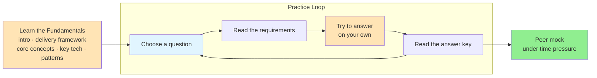

# 🧭 How to Prepare for System Design Interviews

> **Overview**: A step-by-step roadmap for preparing for system design interviews, distilled from coaching thousands of candidates through FAANG loops. Prep splits into two phases — first build the mental model (intro, delivery framework, core concepts, key technologies, common patterns), then practice deliberately by working real questions on your own before reading the answer key.

## 📋 Table of Contents
- [Layman's Explanation](#laymans-explanation)
- [The Preparation Roadmap](#the-preparation-roadmap)
- [Learn the Fundamentals](#learn-the-fundamentals)
- [Practice Deliberately](#practice-deliberately)
- [Interview Questions with Write-Ups](#interview-questions-with-write-ups)
- [Additional Guided Practice](#additional-guided-practice)
- [Key Takeaways](#key-takeaways)
- [Related Concepts](#related-concepts)

---

Tutor

## 🧒 Layman's Explanation

Preparing for a system design interview is like learning to cook for a dinner party. First you read the recipes and learn the basic techniques — that's the **fundamentals**. But nobody becomes a chef by only reading. You have to get in the kitchen and actually cook a dish start to finish (attempt a question **on your own**), then taste it against how it was supposed to turn out (read the **answer key**). Once a few dishes come out well, you invite a friend who's a tough critic to judge you live (a **peer mock**) — because plating a meal while someone watches the clock is a completely different skill than reading a cookbook.

## 🗺️ The Preparation Roadmap

Having helped thousands of candidates pass their FAANG interviews, we've learned exactly what works. The plan is two phases: build the mental model, then practice it until it's automatic.

## 🎯 Learn the Fundamentals

1. Understand what a system design interview is: Maybe you've never done a system design interview before, you're not alone! Start by reading our [intro to system design](https://www.hellointerview.com/learn/system-design/in-a-hurry/introduction) or [watching a video of a mock system design interview.](https://www.youtube.com/watch?v=tgSe27eoBG0)

2. Choose a delivery framework: System design interviews move fast. It's important that you have a clear roadmap to help you think linearly and avoid scope creep. We strongly recommend our [Delivery Framework](https://www.hellointerview.com/learn/system-design/in-a-hurry/delivery). This is the framework you'll follow to design your system come interview day.

3. Start with the basics: If you're new to system design in particular, you'll want to start by learning the basics and mapping out the scope of knowledge required. Start by reading about the [Core Concepts](https://www.hellointerview.com/learn/system-design/in-a-hurry/core-concepts), [Key Technologies](https://www.hellointerview.com/learn/system-design/in-a-hurry/key-technologies), and [Common Patterns](https://www.hellointerview.com/learn/system-design/in-a-hurry/patterns) used in system design interviews. These write-ups are high-level, but they help you build the mental model necessary to build upon.

## 🎤 Practice Deliberately

Once you have the foundation in place, it's time to practice. Passively consuming content is good, but you'll retain 10x more information by actually doing.

> 💡 **Insider tip:** Passive consuming is comfortable but low-retention. The single biggest jump in preparation comes from attempting a full design *on your own* before you look at any answer — the struggle is the point.

1. Choose a question: Select a question from the list of common questions below.

2. Read the requirements: Understand the requirements of the system you'll need to design.

3. Try to answer on your own: Either practice with our [Guided Practices](https://www.hellointerview.com/premium) (below) or on a virtual whiteboard like [Excalidraw](https://excalidraw.com/).

4. Read the answer key: Only after you have tried to answer the question, read the answer key to see how your answer compares.

5. Put your knowledge to the test: Once you've done a few questions and are feeling comfortable, run a peer mock with someone who works at your target company — telling your design out loud under time pressure is a different skill than reading about it.

## 📝 Interview Questions with Write-Ups

|  | Interview Question | Difficulty | Write-Up | Mark as Read | Guided Practice |
| --- | --- | --- | --- | --- | --- |
|  | Bitly | Easy |  |  |  |
|  |  |  |  |  |  |
|  | Dropbox | Easy |  |  |  |
|  |  |  |  |  |  |
|  | Yelp | Easy |  |  |  |
|  |  |  |  |  |  |
|  | Local Delivery Service | Easy |  |  |  |
|  |  |  |  |  |  |
|  | Ticketmaster | Medium |  |  |  |
|  |  |  |  |  |  |
|  | Instagram | Medium |  |  |  |
|  |  |  |  |  |  |
|  | FB News Feed | Medium |  |  |  |
|  |  |  |  |  |  |
|  | Tinder | Medium |  |  |  |
|  |  |  |  |  |  |
|  | LeetCode | Medium |  |  |  |
|  |  |  |  |  |  |
|  | WhatsApp | Medium |  |  |  |
|  |  |  |  |  |  |
|  | Strava | Medium |  |  |  |
|  |  |  |  |  |  |
|  | Distributed Cache | Medium |  |  |  |
|  |  |  |  |  |  |
|  | Rate Limiter | Medium |  |  |  |
|  |  |  |  |  |  |
|  | Online Auction | Medium |  |  |  |
|  |  |  |  |  |  |
|  | YouTube | Medium |  |  |  |
|  |  |  |  |  |  |
|  | Job Scheduler | Medium |  |  |  |
|  |  |  |  |  |  |
|  | FB Live Comments | Medium |  |  |  |
|  |  |  |  |  |  |
|  | News Aggregator | Medium |  |  |  |
|  |  |  |  |  |  |
|  | Price Tracking Service | Medium |  |  |  |
|  |  |  |  |  |  |
|  | YouTube Top K | Hard |  |  |  |
|  |  |  |  |  |  |
|  | Uber | Hard |  |  |  |
|  |  |  |  |  |  |
|  | Robinhood | Hard |  |  |  |
|  |  |  |  |  |  |
|  | Google Docs | Hard |  |  |  |
|  |  |  |  |  |  |
|  | Web Crawler | Hard |  |  |  |
|  |  |  |  |  |  |
|  | Ad Click Aggregator | Hard |  |  |  |
|  |  |  |  |  |  |
|  | FB Post Search | Hard |  |  |  |
|  |  |  |  |  |  |
|  | Payment System | Hard |  |  |  |
|  |  |  |  |  |  |
|  | Metrics Monitoring | Hard |  |  |  |
|  |  |  |  |  |  |
|  | Online Chess | Hard |  |  |  |
|  |  |  |  |  |  |
|  | ChatGPT | Hard |  |  |  |
|  |  |  |  |  |  |

## 🧩 Additional Guided Practice

Full Guided Practice on additional interview questions. These problems don't include a written guide but have the same step-by-step practice and AI feedback and are sourced from real interview questions reported by the community.

|  | Interview Question | Asked At | Difficulty | Guided Practice |
| --- | --- | --- | --- | --- |
|  | Food Review App |  | Medium |  |
|  |  |  |  |  |
|  | Game Leaderboard |  | Medium |  |
|  |  |  |  |  |
|  | Notification System |  | Medium |  |
|  |  |  |  |  |
|  | Donations Website |  | Hard |  |
|  |  |  |  |  |
|  | GitHub Actions |  | Hard |  |
|  |  |  |  |  |

Mark as read

7511 Greenwood Ave North
Unit #4238 Seattle
WA 98103

© 2026 Optick Labs Inc. All rights reserved.

## 🎓 Key Takeaways

- **Two phases, in order:** build the mental model first, then practice — don't jump to questions before you have the foundation.
- **Foundation reading:** the intro, a delivery framework, core concepts, key technologies, and common patterns give you the vocabulary and structure to build on.
- **Doing beats consuming:** you retain roughly 10x more by attempting a design yourself than by passively reading answer keys.
- **Always attempt first:** only read the answer key *after* you've tried the question on your own, so you can compare and find your gaps.
- **Work up in difficulty:** start with Easy write-ups (Bitly, Dropbox, Yelp) and progress toward Hard ones (Uber, Google Docs, Payment System).
- **Finish with a peer mock:** talking through a design out loud under time pressure is a distinct skill — rehearse it with someone at your target company.

## 📚 Related Concepts

- [Introduction](Introduction.md) — what a system design interview actually is, for first-timers.
- [Delivery Framework](DeliveryFramework.md) — the step-by-step roadmap to follow on interview day.
- [Core Concepts](CoreConcepts.md) — the foundational building blocks of system design.
- [Key Technologies](KeyTechnologies.md) — the databases, caches, and queues you'll reach for.
- [Common Patterns](CommonPatterns.md) — reusable design patterns across problems.
- [Breakdowns of Popular System Design Questions](BreakdownsOfPopularSystemDesignQuestions.md) — how to think about the questions in the tables above.
- [Bitly](../ProblemBreakdowns/Bitly.md) — a good Easy starter write-up to attempt first.
- [Uber](../ProblemBreakdowns/Uber.md) — a Hard question to work toward once you're comfortable.

---
*Source: [https://www.hellointerview.com/learn/system-design/in-a-hurry/how-to-prepare](https://www.hellointerview.com/learn/system-design/in-a-hurry/how-to-prepare)*
