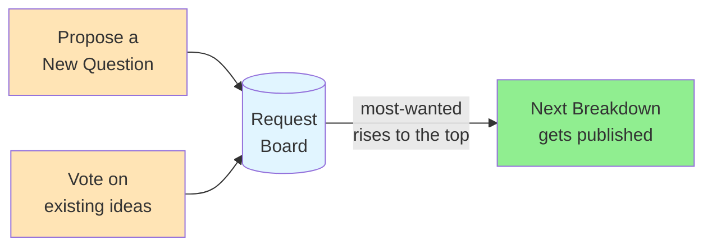

# 🗳️ Vote for what we break down next

> **Overview**: This page is a community request board for HelloInterview's system design content. It invites you to vote on which questions or deep dives should be broken down next — and to propose entirely new questions when the one you want isn't already on the list.

## 📋 Table of Contents
- [Layman's Explanation](#-laymans-explanation)
- [How It Works](#-how-it-works)
- [Key Takeaways](#-key-takeaways)
- [Related Concepts](#-related-concepts)

---

## 🧒 Layman's Explanation

Imagine a suggestion box at the front of a workshop. Instead of the craftspeople guessing what to build next, they let the people who actually use their work drop in ideas and upvote the ones they care about most. The idea with the most support gets made first. That's exactly what this page is: a suggestion box for system design breakdowns. You can back an existing idea by voting, or drop a brand-new idea into the box by proposing a question.

## 🎯 How It Works

There are two ways to influence what gets covered next:

- **Vote** on the questions or deep dives you'd most like to see broken down.
- **Propose a New Question** when the topic you want isn't already listed.

What questions or deep dives would you like to see next?

Propose a New Question

## 🎓 Key Takeaways

- This page is a **community-driven request board** for choosing which system design topics get covered next.
- You can participate in two ways: **voting** on existing questions/deep dives, or **proposing a new question**.
- The most-supported ideas surface to the top, steering what gets **broken down next**.

## 📚 Related Concepts

- [Breakdowns of Popular System Design Questions](BreakdownsOfPopularSystemDesignQuestions.md) — the catalog of questions already broken down.
- [How to Prepare for System Design Interviews](HowToPrepareForSystemDesignInterviews.md) — where these breakdowns fit into a study plan.
- [Key Technologies](KeyTechnologies.md) — the deep-dive topics you can request more of.

---
*Source: [https://www.hellointerview.com/learn/system-design/in-a-hurry/vote](https://www.hellointerview.com/learn/system-design/in-a-hurry/vote)*
