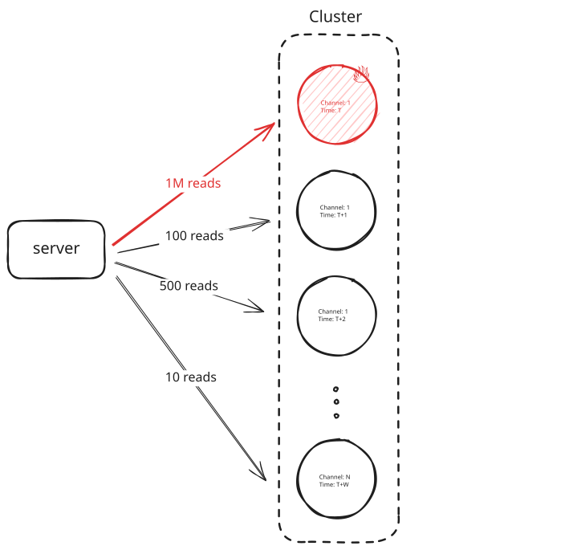
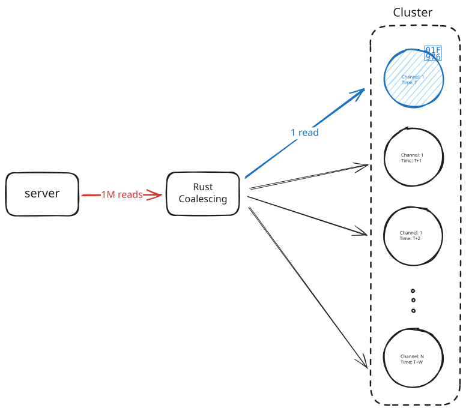
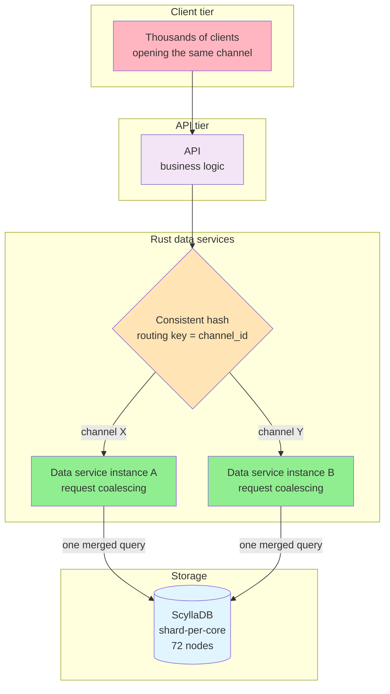
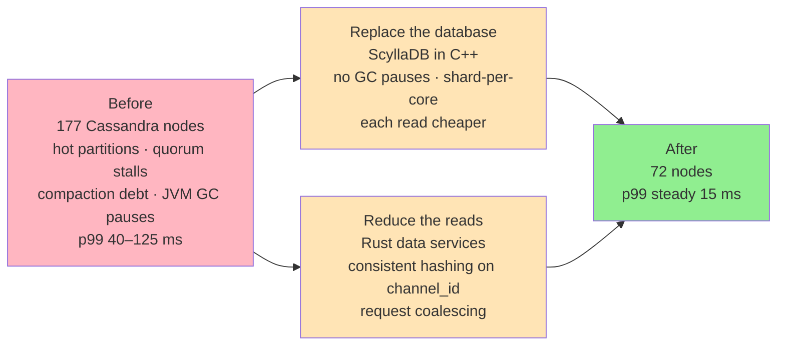

# 🗄️ How Discord Moved Trillions of Messages to ScyllaDB

Originally published by Discord Engineering on March 6, 2023

> **Overview**: Discord's trillions of messages had outgrown a 177-node Cassandra cluster whose hot partitions, compaction backlogs, and JVM garbage-collection pauses made reads slow and the cluster fragile to operate. Discord fixed this with two independent moves: replacing Cassandra with ScyllaDB (a C++ reimplementation that removed the GC pauses and made the storage layer faster) and putting Rust data services in front of the database to coalesce duplicate reads for the same channel. The result was 72 nodes instead of 177, and p99 reads falling from a range of 40–125 ms to a steady 15 ms.

## 📋 Table of Contents

- [🧒 Layman's Explanation](#laymans-explanation)
- [🎯 The TLDR](#the-tldr)
- [⚠️ The Problem](#the-problem)
- [🛠️ The Solution](#the-solution)
- [📝 Conclusion](#conclusion)
- [🎓 Key Takeaways](#key-takeaways)
- [📚 Related Concepts](#related-concepts)

---

## 🧒 Layman's Explanation

Picture a huge library where every request for books in a given room always goes to the same three clerks. Most readers want the newest arrivals in the most *popular* room, so those three clerks get mobbed while clerks in quiet rooms sit idle. And because every request waits for at least two of the three clerks to agree before answering (that's **quorum**), one mobbed clerk drags down unrelated requests that also happen to need them.

Discord fixed this in two ways. First, they swapped the clerks for faster ones who never take unpredictable breaks — ScyllaDB is written in C++, so it avoids the JVM's garbage collector that used to freeze Cassandra's work at random moments. Second, they added a **front desk** before the clerks: when a thousand people ask for the exact same book at the same instant, the front desk sends *one* person to fetch it and hands the same copy to everyone waiting, instead of making a thousand identical trips. This is **request coalescing**. And because all requests about the same room are always routed to the same front desk (via **consistent hashing** on the channel ID), the duplicate requests actually meet in one place where they can be combined.

The key insight: a faster clerk and fewer trips solve *different* problems. ScyllaDB made each trip cheaper; coalescing reduced how many trips happened at all.

## 🎯 The TLDR

At the start of 2022, Discord was storing trillions of messages across 177 [Cassandra](https://www.hellointerview.com/learn/system-design/deep-dives/cassandra) nodes. Cassandra was a strong fit for Discord’s write-heavy workload. But the problem was reads, as a popular channel could send thousands of requests to the same partition, overwhelming the nodes and slowing unrelated queries on those same machines. On top of this, compaction backlogs and JVM garbage-collection pauses made the cluster increasingly difficult to operate.

To address the problems inside the database, Discord replaced Cassandra with ScyllaDB, a compatible reimplementation in C++ that removed the JVM garbage-collection pauses and made the storage layer faster and easier to operate.

But a faster database could not stop thousands of people from requesting the same messages at once. For that, Discord put Rust data services in front of the database. Requests for the same channel route to the same service instance, where overlapping reads for the same message are [merged into one database query](https://www.hellointerview.com/learn/system-design/patterns/scaling-reads#how-do-you-handle-millions-of-concurrent-reads-for-the-same-cached-data).

The new cluster runs 72 nodes instead of 177, and p99 reads fell from a range of 40 to 125 milliseconds to a steady 15.

We picked this post because it cleanly separates two problems that are easy to conflate. ScyllaDB made the storage layer faster and easier to operate, while request coalescing reduced how many reads reached it in the first place.

## ⚠️ The Problem

### How Discord stored messages

Discord had stored messages in Cassandra since 2017. By early 2022, the cluster had grown to 177 nodes holding trillions of messages. All Discord messages were stored in a single table that looked like this.

```sql
CREATE TABLE messages (
   channel_id bigint,
   bucket int,
   message_id bigint,
   author_id bigint,
   content text,
   PRIMARY KEY ((channel_id, bucket), message_id)
) WITH CLUSTERING ORDER BY (message_id DESC);
```

In Cassandra, `(channel_id, bucket)` is the partition key, which determines where the messages are stored. A channel is one chat room inside a Discord server, while the `bucket` represents a window of time. Together, they place one channel’s messages from one period into the same partition, replicated across three nodes.

The `message_id` then orders messages within that partition, with the newest messages first.

The time bucket is what keeps any one partition from growing without bound. Without it, every message ever sent in a popular channel would accumulate in the same partition.

> Our Cassandra deep dive uses Discord’s message schema as its worked example, if you want to see this partitioning scheme built up from first principles.

This schema did what it had to in order to distribute the write load across the cluster, but it couldn't make the read traffic evenly distributed. Most live reads for a channel hit its newest bucket, and Discord’s channels vary enormously in popularity. A busy public channel could therefore concentrate thousands of reads on one partition and the three nodes that stored it.

The partition was hot because the data itself was popular, not because Discord had chosen too few buckets. Further sharding could spread the load, but only by making the primary query, reading a channel in order, more complicated.

### How one popular channel slowed unrelated requests

Cassandra is designed to make writes cheap. A new message is appended to a commit log and written to an in-memory structure called a memtable. When that memtable fills, Cassandra flushes it to disk as an immutable file called an SSTable.

Because Cassandra never updates those files in place, the latest version of a row may be spread across the memtable and several SSTables, forcing reads to check multiple places and merge what they find. Periodically, a background process called compaction combines SSTables so future reads have fewer files to inspect.

> We walk through this storage model and its write-over-read tradeoff in our Cassandra deep dive .

Now put thousands of readers on the partition holding a popular channel’s newest messages. Every request lands on the same three replicas, and each replica has to perform the same relatively expensive read work.



Even worse still, those three nodes also stored partitions belonging to thousands of quieter channels. And since Discord ran reads and writes at quorum, meaning each query waited for two of a partition’s three replicas to respond, when a node was overwhelmed by traffic for one popular channel, unrelated queries that also needed that node slowed down behind it.

### Compaction debt and garbage-collection pauses

As if things weren't bad enough, the Cassandra cluster was also becoming increasingly difficult to operate.

As we mentioned, Cassandra depends on that compaction process to keep the number of SSTables under control, but Discord’s cluster regularly fell behind. As more uncompacted files accumulated, reads became slower. Those slower reads consumed more of each node’s resources, leaving even less capacity for compaction and allowing the backlog to grow further.

Simply running compaction more aggressively doesn't solve the problem because compaction competes with live traffic for the same CPU and disk, so increasing it just ends up making latency worse.

To catch up, engineers performed what Discord called the “gossip dance.” They removed one node from service so it could compact without handling live traffic, brought it back, waited for it to replay the writes it had missed, and then repeated the process on the next node.

Cassandra also runs on the JVM, whose garbage collector periodically pauses application work while reclaiming memory. Those pauses appeared as latency spikes, and the worst lasted long enough that operators had to reboot nodes and nurse them back into the cluster. Together, the compaction backlog and garbage-collection pauses made the cluster fragile. Engineers were spending too much time manually keeping it healthy, even before accounting for the hot partitions caused by Discord’s traffic.

## 🛠️ The Solution

### Replacing Cassandra with ScyllaDB

To fix the problems inside the database, Discord replaced Cassandra with ScyllaDB. ScyllaDB uses the same query language and data model as Cassandra, but it is implemented in C++ rather than running on the JVM. That meant Discord could preserve its existing schema while eliminating the garbage collector behind so many of its latency spikes and stability incidents.

ScyllaDB also uses a shard-per-core architecture, where each CPU core handles its own slice of the node’s data and requests. This gave Discord better performance from each machine and made repairs faster, reducing the operational work required to keep the cluster healthy.

But changing databases doesn't eliminate hot partitions. ScyllaDB could make each read cheaper, but it can't stop thousands of people from requesting messages stored in the same partition. To solve that problem, Discord had to reduce how many reads reached the database in the first place.

### Request coalescing

Suppose someone posts an `@everyone` announcement in a huge server and thousands of members open the channel at nearly the same time. Without coalescing, every request independently asks the database for the same message, sending thousands of reads to the same partition.

With coalescing, the first request starts the database query. Any identical request that arrives while that query is still running joins the existing task instead of starting another one. When the database returns the message, the data service sends that same result to everyone waiting.

To pull this off, Discord added a fleet of Rust data services between its API and the database. Business logic remained in the API, while the data services handled database access and provided a place to combine duplicate requests before they reached ScyllaDB.



First, they had to make sure requests for the same data reached the same service instance. They used [consistent hashing](https://www.hellointerview.com/learn/system-design/patterns/realtime-updates#pushing-via-consistent-hashes) with the `channel_id` as the routing key, so requests for a given channel were sent to the same instance even as instances were added or removed.

*The request path with the new routing layer — business logic stays in the API, while consistent hashing on `channel_id` funnels all requests for one channel into a single data-service instance where duplicates can meet:*



Once the requests met in the same process, the data service could apply [request coalescing](https://www.hellointerview.com/learn/system-design/patterns/scaling-reads#how-do-you-handle-millions-of-concurrent-reads-for-the-same-cached-data).

A simplified implementation keeps a map from each query key to the task already fetching it:

```rust
// Simplified sketch. get_or_start checks and inserts atomically.
async fn get_message(channel_id: u64, message_id: u64) -> Message {
    let key = (channel_id, message_id);

    let task = in_flight.get_or_start(key, || {
        spawn_query(channel_id, message_id)
    });

    task.subscribe().await
}
```

The data service is the right place to do this because it understands the complete request. ScyllaDB can reuse lower-level work through its caches, but it does not know that two separate RPCs are asking for the same message. The data service sees the shared query key and can merge the requests before either becomes a database read.

Why not just cache the messages? A cache would absorb requests arriving after the first query finished too, but it would also introduce expiration and invalidation. Coalescing is a narrower optimization. It never serves an old result; it only lets requests that overlap share work the database is already doing. Discord gave up some hit rate in exchange for much simpler consistency.

Discord shipped the data services while Cassandra was still the primary store. They didn't eliminate hot partitions entirely, but they wen't a long way towards sharply reducing the duplicate reads hitting them. That made latency incidents less frequent and kept Cassandra manageable while the team finished testing and tuning ScyllaDB.

## 📝 Conclusion

Hot partitions are fundamentally a traffic problem. A popular channel concentrates thousands of reads on whichever partition holds its newest messages. Replacing the database can make each of those reads faster, but it can't stop them from arriving.

That is why Discord needed both parts of the solution. ScyllaDB made the storage layer faster and easier to operate, eliminating the JVM garbage-collection pauses and compaction firefighting that had made Cassandra so difficult to keep healthy. The data services reduced the load reaching that storage layer in the first place.

By routing requests for the same channel to the same service instance, they created one place where duplicate reads could meet. Any identical requests that overlapped while a query was running could then share the same result instead of each hitting the database separately. This was already reducing hot-partition incidents while Cassandra was still the primary store, before the migration to ScyllaDB was complete.

The broader lesson is that a faster database and less database work solve different problems. ScyllaDB made each read cheaper. Consistent hashing and request coalescing reduced how many reads Discord needed to perform at all. Together, they brought the cluster from 177 nodes to 72 and reduced p99 read latency from a range of 40 to 125 milliseconds to a steady 15.

*The two independent changes and their combined outcome:*



[Read the original at Discord Engineering](https://discord.com/blog/how-discord-stores-trillions-of-messages)

## 🎓 Key Takeaways

- **Hot partitions are a traffic problem, not a schema problem.** A popular channel concentrates thousands of reads on the three replicas holding its newest bucket — adding more buckets only complicates the primary "read a channel in order" query without removing the underlying demand.
- **A faster database and less database work solve different problems.** ScyllaDB made each read cheaper; consistent hashing plus request coalescing reduced how many reads reached the database at all. Discord needed both.
- **ScyllaDB removed the JVM tax.** Being a C++ reimplementation of Cassandra's data model and query language, it kept Discord's existing schema while eliminating the garbage-collection pauses behind so many latency spikes, and its shard-per-core design cut operational firefighting.
- **Request coalescing bounds duplicate reads to N.** Routing every request for a channel to the same instance (consistent hashing on `channel_id`) lets identical in-flight requests share one query — so millions of simultaneous readers collapse to at most one database read per service instance.
- **Coalescing was chosen over caching to keep consistency simple.** Unlike a cache, coalescing never serves a stale result and needs no expiration or invalidation; it only lets requests that overlap in time share work the database is already doing.
- **The two changes were decoupled.** The data services shipped while Cassandra was still the primary store, reducing hot-partition incidents before the ScyllaDB migration was even complete — and took the cluster from 177 nodes to 72.

## 📚 Related Concepts

- [Cassandra](../DeepDives/Cassandra.md) — the LSM/SSTable/memtable storage model, compaction, and the partition-key + clustering-key scheme this post builds on.
- [Scaling Reads](../Patterns/ScalingReads.md) — request coalescing and other techniques for handling many concurrent reads of the same data.
- [Real-Time Updates](../Patterns/Real-TimeUpdates.md) — pushing/routing via consistent hashing so related requests land on the same instance.
- [Consistent Hashing](../../CoreConcepts/ConsistentHashing.md) — the routing scheme that keeps a channel pinned to one data-service instance as instances scale.
- [Sharding](../../CoreConcepts/Sharding.md) — partitioning data across nodes and why hot partitions arise from skewed traffic.
- [Data Modeling](../CoreConcepts/DataModeling.md) — partition keys vs. clustering keys and time-bucketing to bound partition growth.

---
*Source: [https://www.hellointerview.com/learn/system-design/in-the-wild/discord-messages-scylladb](https://www.hellointerview.com/learn/system-design/in-the-wild/discord-messages-scylladb)*
