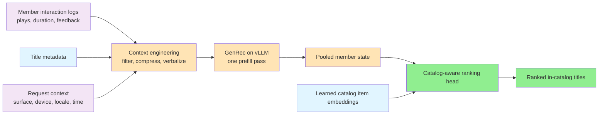
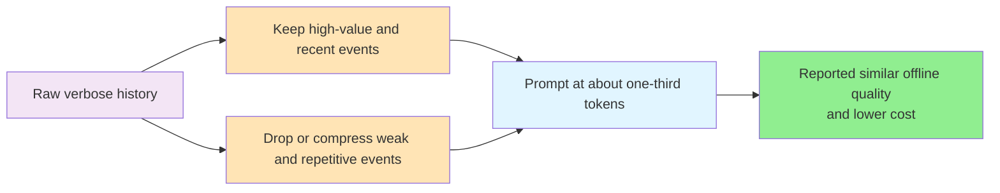
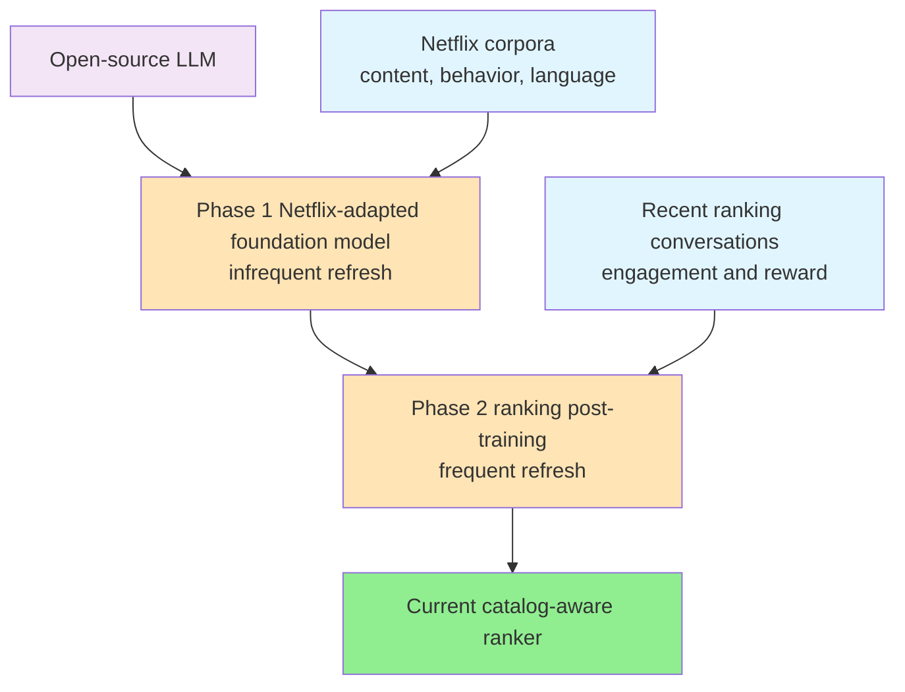
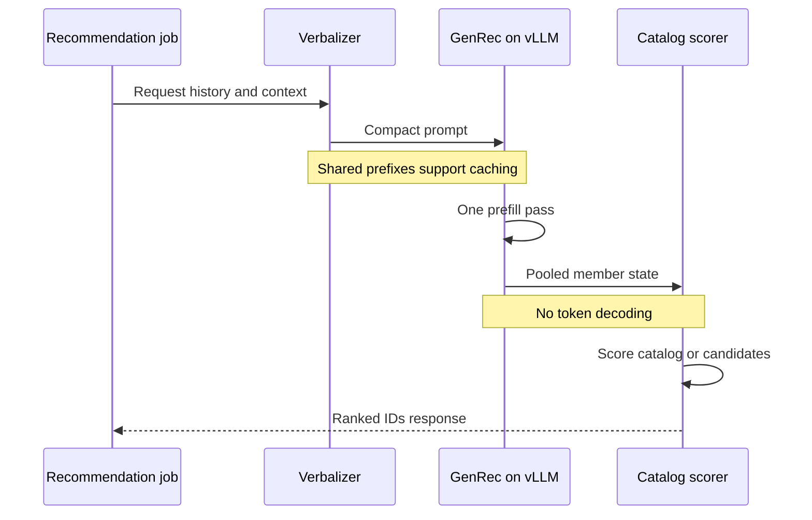

# 🎬 How Netflix Built GenRec for LLM-Native Recommendation

Originally published by Netflix TechBlog in July 2026

> **Overview**: Netflix's GenRec turns member behavior, title metadata, and request context into text, processes that text with a Netflix-adapted decoder-only Transformer, and ranks learned catalog item embeddings from one pooled hidden state. The design replaces much manual feature engineering with context engineering, but still treats tokens, model size, inference mode, catalog constraints, and long-term member utility as hard system-design concerns.

## 🧒 Layman's Explanation

Imagine a video-store clerk who inherited thousands of old index cards. Each card records something a customer did: rented a movie, returned it unfinished, watched most of it, added it to a list, or said they liked it. The old store has built thousands of filing rules and specialist desks around those cards. The rules work, but adding games, live events, or a new shelf means changing many of them.

GenRec gives the clerk a different workflow. A **verbalizer** selects the useful cards and turns them into a compact viewing story: what the customer watched recently, what held their attention, what they abandoned, and whether they are now browsing on a television or phone. It leaves out weak clues and summarizes repetitive ones because the clerk can read only so much at once.

The clerk also studies in two phases. In **Phase 1**, they learn Netflix's catalog, audiences, behavior, and language broadly. In **Phase 2**, they refresh the narrower skill of ranking today's catalog for today's tastes. The first course provides durable knowledge, while the second can run more often as titles and preferences change.

Most importantly, the clerk may choose only titles physically on the shelves. They do not invent a plausible-sounding movie. At recommendation time they read the compact story once, form an understanding of the member, and score the shelf inventory. They do not generate an answer word by word. That one-reading-pass design is the difference between a conversational LLM and GenRec's ranking path.

## 🎯 The TLDR

Netflix describes GenRec as an LLM-backed ranker rather than a chatbot. Logs containing plays, durations, explicit feedback, adds, and abandons are joined with title metadata and request context. A verbalizer chooses and compresses those signals into text. A Netflix-adapted decoder-only Transformer then produces a pooled member state, while a catalog-aware head compares that state with learned item embeddings to score either the full catalog or a supplied candidate set.

Training combines catalog-aware ranking, language modeling, and reward-weighted alignment. Serving uses vLLM in prefill-only mode: consume the prompt once, extract the pooled state, score catalog items, and return ranked IDs without decoding assistant text. This keeps recommendations in catalog and avoids token-by-token generation cost.

The reusable lesson is not that LLMs remove engineering constraints. Feature engineering shifts toward **context engineering**, while limits on input quality, token budget, model size, serving cost, catalog validity, and business objectives remain.

## ⚠️ The Problem

### A mature ranker that was expensive to extend

Netflix's existing production ranker was not a weak baseline waiting for a Transformer. According to Netflix, it had evolved over years around thousands of engineered user, item, and interaction features, plus specialized architectures for sequence modeling, feature interactions, and multiple objectives.

That specialization carries an integration tax. Supporting another content type such as games, live programming, or podcasts, or onboarding another product surface, can require new features, model changes, infrastructure, and experiments. Each local optimization is reasonable, but collectively the stack becomes expensive to evolve.

GenRec asks whether histories and metadata can instead share a textual representation and a common foundation backbone. That reduces dependence on task-specific feature pipelines, but it does not mean raw logs can simply be pasted into a prompt. Selecting and expressing the right evidence becomes a first-class subsystem.

### Why a generic LLM is not a recommender

An open-source or generic LLM brings language understanding and broad world knowledge, but its default objective is not personalized, constrained recommendation. Netflix identifies several practical failures:

- **Popularity bias:** familiar global hits can overwhelm evidence about one member's preferences.
- **Hallucination:** unconstrained generation can name titles that are not available in the Netflix catalog.
- **Weak personalization:** general semantic similarity does not by itself model an individual's evolving behavior.
- **Business constraints:** a useful ranking may need to balance content types, launch stages, and long-term outcomes rather than maximize the next click.

The engineering task is therefore to reuse an LLM's representation capacity while replacing open-ended generation with a learned, catalog-constrained ranking decision.

### The actual ranking task

For each request, the system maps member history plus device, surface, locale, and time context to an ordering over the full catalog or a candidate set. The target is expected **long-term member utility**, using satisfaction and retention-oriented proxies, not merely immediate play probability.

This framing matters in an interview. The output is a permutation or top-*K* list of known item IDs, not prose. The request context can change the ranking even when history is identical, and an engagement label is not automatically a reward: a long binge, an abandon, a return visit, and catalog exploration can carry different implications for durable satisfaction.

## 🛠️ The Solution

### Turn behavior into language

Netflix members generate interaction events across product surfaces. Relevant logs include plays, viewing durations, explicit feedback, additions to a list, and abandons. A verbalizer selects history, title metadata, profile or task information, and request context, then serializes them as natural language.

Phase 2 represents examples as single-turn or multi-turn training conversations:

- The **user message** contains the verbalized history, metadata, current context, and recommendation task.
- The **assistant message** contains the member's actual subsequent engagement, such as the selected title, duration, or feedback.

During training, the model uses the assistant output to learn how engagement follows the input and to retain a language-modeling objective. During inference, it does **not** decode that assistant message. The prompt is consumed only to construct a member representation for catalog scoring.

### Treat the context window as a feature budget

Verbalizing every event would make prompts too long and expensive. GenRec therefore treats the context window as the new feature budget. The verbalizer retains rich detail for recent or high-signal events, omits weak events, compresses repetitive behavior, and selectively elaborates important cold-start titles whose IDs have little behavioral history.

Prompt structure is also an infrastructure decision. Stable text is placed in shared prefixes where possible so vLLM's prefix caching can reuse work. The useful question is not "How much history exists?" but "Which evidence earns space in this request's finite token budget?"

Netflix reports that its experiments reduced context to roughly one-third of the original token budget with negligible offline ranking degradation, while observing a similar reduction in serving cost. That result belongs to Netflix's tested workloads and verbalizations, not a universal one-third rule.

### Train in two phases

**Phase 1** starts with an open-source base model and adapts it to proprietary Netflix corpora. The goal is broad understanding of Netflix content, member behavior and preference patterns, and language. This shared Netflix-aware foundation is expensive and refreshed relatively infrequently.

**Phase 2** post-trains that foundation on recent ranking conversations, engagement labels, catalog-aware objectives, and rewards. It is refreshed more frequently so the ranker can follow catalog changes and taste drift without rebuilding the broad foundation on the same cadence.

This split creates two operating cadences. Durable domain understanding belongs in the slower foundation cycle. Fast-moving catalog and preference information belongs in the cheaper ranking cycle. In system-design terms, it isolates a stable dependency from a volatile one.

### Combine ranking, language, and reward objectives

GenRec jointly optimizes three complementary objectives:

1. **Catalog-aware ranking:** cross-entropy over the catalog or candidate set teaches the model to assign more probability to high-value observed engagements. Sampled softmax can make training over a very large catalog cheaper.
2. **Language-model preservation:** next-token prediction over verbalized inputs and training outputs preserves the backbone's ability to understand rich text and supports possible future language use cases.
3. **Reward-weighted alignment:** scalar weights derived from reward models make long-term satisfaction proxies count more and rebalance behavior across content types or launch stages.

Reward weighting matters because observed behavior is not the same as the desired objective. Training only on raw engagements could over-favor binge behavior or one dominant content type. Weighting lets the ranking loss reflect return behavior, sustained engagement, catalog exploration, and business priorities without turning online inference into a reinforcement-learning loop.

Netflix says it observed additional gains from RL-style methods such as GRPO, but used reward weighting for the described design because it was simpler and cheaper. The article does not publish the exact reward formulas, so an interview design should describe the signal categories and evaluation strategy without inventing coefficients.

### Score the catalog instead of generating titles

The backbone is a decoder-only, Netflix-adapted Transformer. After it processes the verbalized sequence, GenRec extracts a pooled hidden state representing the member's current preferences and context. Every catalog item has a learned embedding. A ranking head combines the pooled state and each item embedding with a dot product or a small MLP to produce scores.

The backbone, item embeddings, and scoring head are jointly trained. A softmax over the full catalog can produce the ranking distribution, while sampled softmax during training or a candidate set during training and inference can reduce scale cost.

This architecture makes catalog validity structural rather than advisory. The head can score only known embeddings, so it cannot return an out-of-catalog string. It also separates semantic sequence processing from item retrieval: the LLM creates one request representation, then efficient vector-style scoring applies it across inventory.

## 🚀 Serving GenRec at Netflix Scale

### One prefill pass, no autoregressive decoding

Netflix serves GenRec with vLLM in **prefill-only** mode. A recommendation job asks the verbalizer for a compact prompt, the Transformer processes that prompt in one forward prefill pass, and the catalog head scores item embeddings from the pooled state. The response is ranked IDs, with no generated explanation or assistant turn.

Conversational LLM serving pays repeatedly for autoregressive token generation, where each new token depends on earlier output. GenRec does not need prose, so decoding would add latency and GPU work without improving the required output. Prefill-only inference turns the LLM into a contextual encoder for a conventional scoring stage.

### Three controls on serving cost

Netflix identifies three main levers:

1. **Smaller or distilled models:** use targeted data to preserve much of a larger model's ranking quality at lower compute cost.
2. **Context compaction:** spend tokens on high-information history, compress repetition, and exploit cache-friendly shared prefixes.
3. **Prefill-only execution:** process the prompt once and avoid autoregressive decoding entirely.

These controls interact. A larger model may improve offline MRR but cost more per prompt. A longer prompt may expose useful history but increase prefill work. Better context selection can let a smaller model or shorter prompt retain quality. The architecture therefore needs joint model, data, prompt, batching, and cache experiments rather than a model-quality decision in isolation.

## 📊 What Netflix Reported

### Offline and online results

All figures below are Netflix's reported experimental results, not independent benchmarks:

- In one low-data configuration, GenRec used about **40 times fewer Phase-2 labeled examples** than the mature production ranker and improved Mean Reciprocal Rank by about **1.6%**.
- Netflix ran a **four-week A/B test** on batch-compute recommendation surfaces covering around **10% of Netflix traffic**. Netflix reports statistically significant gains in both short-term and long-term online metrics.
- Starting Phase 2 from the Netflix-adapted Phase 1 model improved offline ranking metrics by roughly **10% to 20%** compared with starting directly from an off-the-shelf open-source model.
- Near the Phase 1 training cutoff, Phase 2 added roughly **35% to 50%** over Phase 1. Netflix reports that this relative benefit grew to around **80% after two weeks** as the foundation became stale relative to new catalog and taste data.
- In Netflix's tested range, larger models achieved higher offline MRR, and adding more Phase-2 data also improved MRR.
- Netflix reports reducing prompt tokens to approximately **one-third** with negligible offline metric degradation in its context optimization experiment.

These measurements support data efficiency and the two-cadence design, but they do not imply that GenRec powers every Netflix recommendation. The disclosed online experiment concerns batch-compute surfaces and a traffic slice.

### What the article does not disclose

The article does not provide exact production latency, throughput, hidden-state or item-embedding dimensions, reward formulas, prefix-cache hit rates, failure handling, or rollout topology. It also does not state that all Netflix recommendation surfaces use GenRec.

Those omissions define important interview follow-ups. A production design would still need latency and freshness SLOs, GPU capacity and batching policy, fallback behavior when verbalization or model serving fails, catalog-embedding update semantics, cache isolation, model-version compatibility, observability, and progressive rollout controls. These are reasonable design requirements, but they should not be presented as details Netflix disclosed.

## 📝 Conclusion

GenRec is a recommendation ranker built from LLM infrastructure, not a conversational model placed in front of a catalog. It translates behavior into a compact textual context, adapts a shared foundation on one cadence, refreshes ranking knowledge on another, and constrains output through learned catalog embeddings. Reward-weighted objectives steer the ranker toward long-term value, while prefill-only serving avoids the cost and failure mode of generated title text.

The broader system-design lesson is a shift in where complexity lives. Thousands of handcrafted features and specialized architectures can give way to a common backbone and verbalized context, but the work does not disappear. Teams must still decide which history matters, how to represent it, how to bound tokens, how to encode objectives, how to keep inventory current, and how to serve within a compute budget. Feature engineering becomes context engineering, and disciplined constraints remain the difference between a demonstration and a production recommender.

## 🎓 Key Takeaways

- **The context window is a feature budget.** Rich recent and high-signal events deserve detail, while weak or repetitive behavior should be omitted or compressed.
- **Use two training cadences.** An infrequently refreshed domain foundation captures stable catalog and audience knowledge, while frequent ranking post-training follows title and taste drift.
- **Constrain recommendation structurally.** Scoring learned catalog embeddings prevents hallucinated titles and makes full-catalog or candidate-set ranking the explicit output.
- **Use prefill when the product needs IDs, not prose.** One vLLM prefill pass plus a pooled state avoids autoregressive token decoding.
- **Align labels with rewards.** Reward-weighted losses can prioritize long-term satisfaction and rebalance behavior more simply and cheaply than the RL-style alternatives discussed by Netflix.
- **Keep evidence boundaries visible.** Netflix reported strong offline and batch-surface online results, but did not publish core serving dimensions or claim deployment across every recommendation surface.
- **LLMs move rather than remove systems work.** Feature engineering shifts toward context selection, verbalization, caching, model sizing, and cost-quality tradeoffs.

## 📚 Related Concepts

- [Vector Databases](../DeepDives/VectorDatabases.md) - learned item embeddings and similarity-style scoring connect GenRec's pooled state to catalog retrieval concepts.
- [ChatGPT](../ProblemBreakdowns/Chatgpt.md) - contrasts conversational autoregressive serving with GenRec's prefill-only ranking path.
- [Facebook News Feed](../ProblemBreakdowns/FbNewsFeed.md) - another large-scale personalized ranking system with multi-objective and business constraints.
- [News Aggregator](../ProblemBreakdowns/NewsAggregator.md) - covers candidate selection, freshness, and ranking for evolving inventories.
- [Scaling Reads](../Patterns/ScalingReads.md) - provides patterns for batching, caching, and controlling repeated serving work at scale.

---
*Source: [GenRec: Towards LLM-Native Recommendation at Netflix](https://netflixtechblog.com/genrec-towards-llm-native-recommendation-at-netflix-f20be6f643e3)*
