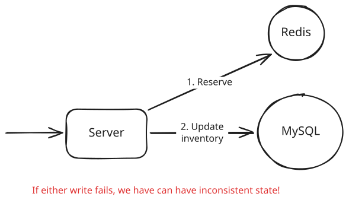
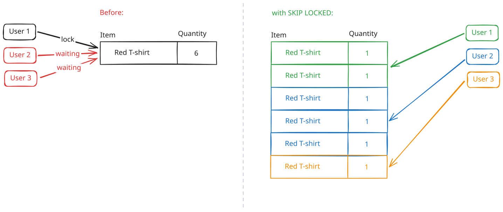

# How Shopify Moved Inventory Reservations from Redis to MySQL

Originally published by Shopify Engineering on May 12, 2026

## The TLDR

Shopify processes more than 14% of U.S. e-commerce. In order to prevent incorrectly selling the last item in stock to two buyers at the same time, every checkout is protected by a reservation system. When a buyer starts paying, Shopify reserves their items for a few minutes. If the payment succeeds, it permanently deducts them from the merchant’s record of how much inventory remains.

For years, those two steps occurred in different databases. Redis tracked how many units shoppers had temporarily reserved, while MySQL tracked how many units the merchant actually had. Since no single transaction could update both together, a crash between the two writes could leave them in disagreement, either hiding inventory that was still available or allowing Shopify to sell inventory that was already gone.

Shopify moved reservations from Redis into MySQL, so now both operations can happen in a single transaction. Instead of keeping a single row per inventory with a count of how many units are available, it uses a bounded pool of rows, with each row representing one reservable unit. They could then rely on MySQL 8’s `SKIP LOCKED` to let concurrent buyers claim different rows without waiting on each other, while a replenishment process keeps the pool from growing with the merchant’s full inventory. The rebuilt system survived Black Friday 2025, even as merchant sales peaked at a record $5.1 million a minute.

We chose this post to dig into because it's the seat-per-row move from [ticket booking](https://www.hellointerview.com/learn/system-design/problem-breakdowns/ticketmaster#1-how-do-we-improve-the-booking-experience-by-reserving-tickets), where you store one row per seat so buyers contend on different rows, proven in production at enormous scale. It also shows that a relational database with the right table design can handle workloads many engineers assume need specialized infrastructure. The [original](https://shopify.engineering/scaling-inventory-reservations) is worth your time too.

## The problem

### What oversell protection does

Picture a flash sale with one hoodie left and two buyers hitting the pay button at the same time. Shopify needs to make sure only one of them can buy it.

That is the job of oversell protection. When a buyer starts paying, the system reserves their items for a few minutes so nobody else can take them while the payment processes. If the payment succeeds, Shopify claims those items, permanently deducting them from the merchant’s inventory. If the payment fails or times out, it releases the reservation and makes them available again.

Getting either side wrong costs the merchant money. If two buyers purchase the same last hoodie, one order has to be canceled. If Shopify hides a hoodie that is still sitting in the warehouse, the merchant loses a sale. This system sits in the path of every inventory-backed checkout, so even rare mistakes become common at Shopify’s scale.

### Why Redis had to go

For years, Shopify stored temporary reservations in Redis, using one counter per item. Reserving or releasing units updated that counter, and because [Redis executes commands one at a time](https://www.hellointerview.com/learn/system-design/deep-dives/redis), two buyers could not both reserve the same last unit. As a concurrency mechanism, Redis worked.

The problem was that the merchant’s permanent inventory record lived in MySQL. Once a payment succeeded, Shopify had to make two changes: deduct the purchased units from MySQL and clear the temporary reservation in Redis. Those writes happened in different databases, so they could not commit together.

Suppose Shopify updates MySQL first and then crashes before clearing the reservation in Redis. The purchase is complete, but Redis still treats those units as reserved, so Shopify hides inventory that is actually available. Reverse the order and the opposite can happen. Shopify clears the reservation, crashes before updating MySQL, and makes units available again even though they were already sold.

Changing the order only changes which failure is possible. It does not remove the window between the two writes.



The standard set of fixes like two-phase commit or an outbox did not close that window either. Two-phase commit would require both databases to participate in the same coordination protocol, which Redis could not do because it doesn't speak the same language. And while an outbox or reconciliation job could eventually detect and repair a mismatch, inventory would still be wrong until that happened. In the middle of a flash sale, wrong for even a short time can mean selling the same unit twice.

## The solution

### One row per reservable unit

Moving reservations into MySQL solved the transaction problem, but Shopify had tried (and failed) with the obvious MySQL design before: one row per item with a quantity counter.

```
-- The failed first attempt, simplified
UPDATE reservations
SET available = available - 1
WHERE inventory_item_id = 42 AND available >= 1;
```

Every checkout for a popular item had to update the same row. InnoDB, MySQL’s default storage engine, grants that row lock to one transaction at a time, so every other buyer has to wait. This meant that during a flash sale, thousands of checkouts for the same item collapsed onto a single lock, forcing the database to process them one after another which slowed things to a crawl.

The new design spreads that contention across a pool of rows. Each row in `reservation_units` represents one unit that can currently be reserved. To reserve three hoodies, Shopify selects and locks three available rows, removes them from the pool, and creates one active hold in `reserved_quantities`, all inside the same transaction.

The magic comes from MySQL 8's `SELECT ... FOR UPDATE SKIP LOCKED`, which is `SELECT ... FOR UPDATE` combined with `SKIP LOCKED`. An ordinary `FOR UPDATE` query waits when it reaches a row another transaction has locked. `SKIP LOCKED` tells MySQL to pass over that row and keep looking for an available one. So with it, two buyers reserving the same item can lock different rows and commit in parallel instead of lining up behind one shared counter.

> This is the one-row-per-seat trick from our Ticketmaster breakdown . Instead of making every buyer contend on one quantity row, you give them separate rows to claim. The broader pattern is covered in dealing with contention .



```sql
BEGIN;

SELECT id FROM reservation_units
WHERE shop_id = 1
  AND inventory_item_id = 42
  AND inventory_group_id = 7
LIMIT 3
FOR UPDATE SKIP LOCKED;

-- Remove the selected units from the available pool,
-- then create one active hold in reserved_quantities.

COMMIT;
```

### A bounded pool

With this design, the natural challenge that emerges is that at scale, a single item could produce hundreds of thousands of mostly idle rows, and the scans would get slower as the table grew. Considering Shopify deals with millions of items, the scale makes a row per item a non-starter.

So instead, Shopify caps the number of reservation rows for any given item at 1,000 and relies on a replenishment process to keep the pool filled when it runs low.

A rush can still drain it before the background process catches up. When that happens, the reservation request refills the pool inline and then tries again. A lock ensures that only one transaction performs the refill while other requests for the same item wait, preventing them from adding the same capacity more than once. Whenever this happens, the request that triggers the refill takes longer, but Shopify does not reject a buyer when the ledger says inventory still exists just because the reservation pool has fallen behind.

The post doesn't say how much latency this fallback adds or how Shopify handles orders larger than the 1,000-row pool.

### Making the locks behave

The basic design removed the single hot row. Making it safe under production traffic required three more changes to how InnoDB acquired locks.

The first prototype used an ordinary auto-increment primary key, while reservation queries searched through a secondary index. InnoDB stores the table itself in primary-key order, so a locking query through a secondary index locks both the matching index entry and the underlying table row.

Shopify instead made the columns used by the reservation query part of the primary key:

```
PRIMARY KEY (shop_id, inventory_item_id, inventory_group_id, id)
```

The query can now scan and lock the table rows directly. That means one lock per reservation unit instead of two, cutting the lock traffic on the hottest path in half.

The second problem appeared when a pool was empty. Under REPEATABLE READ, MySQL’s default [isolation level](https://www.hellointerview.com/learn/system-design/patterns/dealing-with-contention#isolation-levels), a locking query does not only lock the rows it finds. It also locks the gaps between them so another transaction cannot insert a new row into the range while the query is running.

When the pool is empty, there are no rows to lock, so the query locks the gap at the end of the index instead. That is exactly where the replenishment process needs to insert new rows. Reservation queries could therefore block replenishment or deadlock with it.

Shopify moved these transactions to READ COMMITTED, where the scan does not take those same gap locks. It was the first time Shopify had used a non-default isolation level anywhere in its codebase.

The final issue was a classic ordering deadlock. Different code paths touched the reservation tables in different orders, so two transactions could each hold a lock the other needed.

The fix, consistent with what we recommend [here](https://www.hellointerview.com/learn/system-design/patterns/dealing-with-contention#how-do-you-prevent-deadlocks-with-pessimistic-locking), was to make every path acquire locks in the same sequence. A reservation now removes rows from `reservation_units` before inserting the hold into `reserved_quantities`, matching the order shown above. With every transaction following the same order, the cycle disappears.

## Conclusion

The requirement was that reserve and claim commit together with the ledger, and only rows living in the same database as that ledger can deliver it. Redis counted concurrent decrements correctly the whole time and still had to go, because it couldn't take part in the ledger's transactions. The post closes on "If you're reaching for Redis, Kafka, or a custom coordination layer for high-throughput mutual exclusion, your existing database might already be enough," and the useful version of that advice starts with atomicity. If a hold and the record it guards must commit together, put them in the same database. If they don't need to, a Redis counter is still the simpler tool, and nothing in this story argues against it.

None of this was possible before MySQL 8 shipped `SKIP LOCKED`, which is why the conclusion that MySQL couldn't handle this workload was correct when Shopify first reached it and wrong by the time they revisited it. If your team ruled out the plain database years ago, the reasons behind that call are worth rechecking against what the database can do today.

The bounded pool deserves a close look before you copy it, because that's where the operational cost landed. Replenishment is a new process to run, monitor, and page on, and its natural failure mode is an empty pool in the middle of a flash sale. Shopify traded a Redis cluster for that process, one moving part for another, and the trade came out ahead because the new part lives inside the transaction boundary that mattered.

[Read the original at Shopify Engineering](https://shopify.engineering/scaling-inventory-reservations)

---
*Source: [https://www.hellointerview.com/learn/system-design/in-the-wild/shopify-inventory-reservations](https://www.hellointerview.com/learn/system-design/in-the-wild/shopify-inventory-reservations)*
