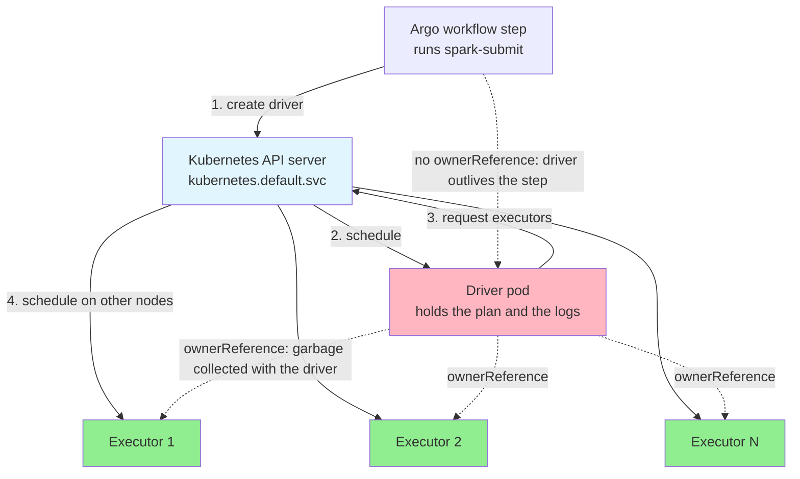
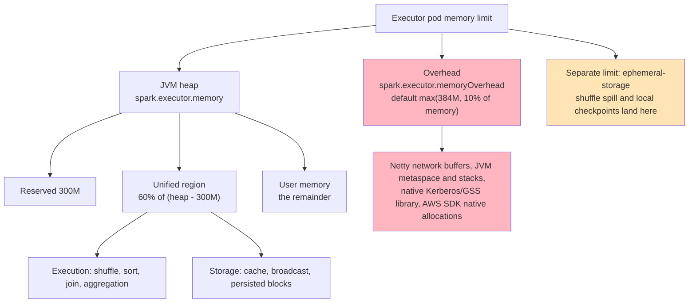
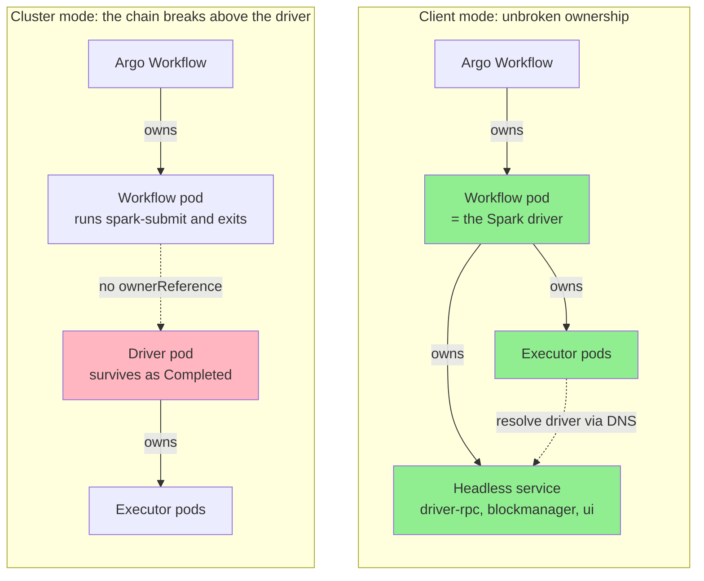
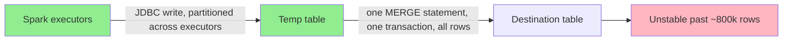

# ⚡ How We Ran Spark on Kubernetes: Cluster Mode, Then Client Mode

> **Overview**: Two regulatory-reporting pipelines outgrew single-JVM Spark at the same time. The first — a four-stage trade-reporting ETL — proved **cluster mode** on EKS under Argo Workflows: it removed the single-node memory ceiling and carried 500k records end to end, while exposing four gaps that the raw `spark-submit` path leaves you to close yourself. The second — a reference-data ingestion service — took the lessons and shipped **client mode**, running the driver inside the Argo workflow pod behind a purpose-built headless service, which closed the ownership, exit-code, observability and templating gaps outright and cut processing time 75% and cost 74%. This is what each mode actually buys, what it costs, and where the bottleneck went when Spark stopped being it.

*Identifiers here — registry paths, bucket names, namespaces, node names, secret paths, class names — are generalized. The configuration semantics, failure modes and measurements are the real ones.*

## 🧒 Layman's Explanation

Imagine one very strong worker who has to carry every box in a warehouse, and a desk big enough to lay out everything they are working on at once. That is Spark in local mode: one machine, one JVM, and a desk that has to be as large as the largest job. As the shipments grew we kept buying a bigger desk — 10 GB, then 20 GB, then 60 GB — and at half a million boxes there was no desk in the building big enough.

The fix is to hire a crew. One person becomes the foreman (the *driver*): they hold the plan, hand out work and collect results. Everyone else (the *executors*) gets their own smaller desk on their own floor. Total desk space goes *up*, not down — but no single desk has to be enormous any more, and that was the binding constraint. Kubernetes is the building manager: the foreman phones it to ask for more crew, it finds floors with space, and it evicts anyone who spills past their allotted desk.

Where you put the foreman turns out to matter enormously. **Cluster mode** sends the foreman into the building with the crew: clean and isolated, but now the person who dispatched the job is standing outside with no phone line — they cannot read the foreman's notes and cannot tell whether the job succeeded. **Client mode** keeps the foreman at the front desk where the dispatcher already sits: the notes are right there, "did it work" is answered by the foreman going home, and when the dispatcher's shift ends the crew is sent home automatically. The cost is that the foreman is now sharing the dispatcher's small office.

Two things followed that the analogy predicts. First, hiring a crew takes time regardless of how many boxes there are, so tiny jobs got no faster. Second, once the crew could move boxes quickly, the queue moved to the loading dock — the database — which was still accepting one enormous pallet at a time.

## 🎯 The TLDR

Two projects, one platform, opposite conclusions about where the driver belongs.

**Project A — the trade-reporting ETL, cluster mode.** Four stages, raw → enriched → normalized → regulatory → ARM, under Argo Workflows on EKS. Local mode needed 10 GB for 10k records, 20 GB for 100k, 60 GB for 200k, and would not complete 500k at any heap we were willing to schedule. Cluster mode ran 500k end to end on six 48 GB executors behind a 10 GB driver. It also left four things undone, because with raw `spark-submit` they are yours to do: the driver pod carries **no `ownerReference`**, so nothing cleans it up and a failed application can exit its Argo step green; there is no Spark UI or event log to debug from; and the pod templates were maintained by hand per environment.

**Project B — the reference-data ingestion service, client mode.** Previously pinned to local mode because the platform had no per-namespace RBAC for it. Once that landed, it chose client mode rather than cluster mode *specifically* to avoid Project A's ownership problem: with the driver running inside the Argo workflow pod, the workflow's own exit code **is** the application's, driver logs are already in the pod Argo streams, and Kubernetes garbage-collects executors through a complete owner chain. Making that work required something Spark gives you for free in cluster mode and not at all in client mode — a headless service the executors can reach the driver through — so we built a small lifecycle helper to create and tear it down around each run. Result: 45–60 minutes down to 8–12, and 8 CPU-hours per job down to 2.4.

The thread connecting them: **cluster mode is the better isolation story, client mode is the better integration story**, and if your orchestrator is the system of record for "did this succeed", integration wins. And in both projects, once Spark scaled, the limit moved somewhere Spark could not reach — for Project A, a single-transaction `MERGE` over plain JDBC.

## 🧭 Why Leave Local Mode

Spark in local mode runs driver and executors as threads inside one JVM. Everything — plan, shuffle, cache, checkpoint — is bounded by that one process's heap and by the memory of the one node scheduling it. Project A's scaling curve is what that constraint looks like from outside:

| Mode | Volume | Driver memory | Executor memory | Executors | Cores/executor | Latency |
|---|---|---|---|---|---|---|
| Local | 10k | 10 GB | — | — | — | 15 min |
| Local | 100k | 20 GB | — | — | — | 18 min |
| Local | 200k | 60 GB | — | — | — | 27 min |
| Local | 500k | — | — | — | — | did not complete |
| Cluster | 10k | 10 GB | 10 GB | 2 | 2 | 15 min |
| Cluster | 100k | 10 GB | 20 GB | 6 | 2 | 16 min |
| Cluster | 200k | 10 GB | 25 GB | 6 | 2 | 23 min |
| Cluster | 500k | 10 GB | 50 GB | 6 | 3 | 36 min |
| Cluster | > 1M | 10 GB | 64 GB | 12 | 2 | blocked on the database |

All measurements are the raw → enriched stage, which applies the heaviest transformations.

Three readings matter more than the raw numbers:

- **The 10k row is identical in both modes.** Fifteen minutes buys nothing extra at that volume, which puts a **volume-independent floor** of roughly a quarter-hour on the pipeline: image pull, executor scheduling, Kerberos and credential setup, plan compilation, JDBC connection establishment. Distribution only starts paying back past about 100k records; below that it is strictly overhead.
- **Distribution did not reduce total memory — it reduced the largest single allocation.** 200k needed 60 GB in one JVM or 6 × 25 GB across nodes. The second is 150 GB in aggregate and far easier to schedule, because a node has to satisfy the *largest* request, not the sum.
- **Latency grew sub-linearly with volume.** 100k → 500k is 5× the data for 2.25× the wall clock. That is the shape you want, and it is also the shape that hides skew: the job finishes when the slowest task finishes, and averages will not show you that.

Project B was stuck in local mode for a different reason — not physics but platform. The job-optimized cluster existed and sat underused, because there was no mechanism to grant an application-specific namespace the RBAC that Spark needs to create pods. That is worth separating out explicitly, because it is the more common blocker in an enterprise: **the ceiling was administrative before it was technical.**

One local-mode caution that survives into the new world, since local mode remains the default for development: `--master local[*]` sizes its thread pool from `Runtime.availableProcessors()`. Modern JVMs are cgroup-aware and will read a container CPU *limit* — but if the pod sets only a request and no limit, `local[*]` sees every core on the node and oversubscribes wildly. Pin `local[N]` to the pod's actual CPU allocation rather than trusting `*`.

## 🚪 Two Ways In: `spark-submit` or the Spark Operator

Before choosing a mode, you choose a submission mechanism. Both projects landed on `spark-submit`, and it is worth being explicit that this was a constraint-driven choice rather than a technical verdict.

| | `spark-submit` | Spark Operator (`SparkApplication` CRD) |
|---|---|---|
| **Model** | A command in a container step | A Kubernetes custom resource reconciled by a controller |
| **Setup** | Nothing to install | Requires the operator deployed and maintained in-cluster |
| **Lifecycle** | Yours: cleanup, retries, status | The operator's: creation, monitoring, cleanup, restart policy |
| **Ownership** | You set owner references yourself | Set for you |
| **Per-job config** | Trivial — it is just flags | Templated through the CRD spec |
| **Observability** | Whatever you wire up | Built-in metrics and status conditions |
| **Fit with Argo** | Native: an ordinary step, inheriting retries, artifacts, parameters, audit trail | Two control planes: Argo creates an object a second controller reconciles, and the workflow's notion of "done" decouples from the application's |

The deciding factor was that Argo Workflows was already the platform's orchestration layer and the operator was not deployed. A `spark-submit` step inherits everything the workflow already provides; a CRD would have meant introducing a second controller and then reconciling two definitions of success. That is a defensible trade in either direction — but it is exactly the trade that hands you Project A's ownership problem, because **owner references are the main thing the operator would have done for you.**

## 🧩 Three Execution Modes, and What Each Costs

| Aspect | Local | Client | Cluster |
|---|---|---|---|
| **Driver runs** | In the submitting JVM, as threads | In the submitting pod, as its main process | As its own pod in the cluster |
| **Executors** | Threads in the same JVM | Separate pods | Separate pods |
| **Scalability** | One JVM, one node | Distributed | Distributed |
| **Exit-code propagation** | Direct | **Direct** — the driver *is* the container's process | Indirect — the client must poll the driver pod to a terminal state |
| **Log access** | Local | **In the workflow pod**, already streamed by Argo | In a separate pod, fetched out of band |
| **Driver sizing** | The pod's limits | The pod's limits, shared with orchestrator sidecars | Independent, requested from the scheduler |
| **Driver isolation** | None | None — an evicted workflow pod kills the application | Full |
| **Executor GC** | N/A | Via driver pod ownership — **only if you set `spark.kubernetes.driver.pod.name`** | Automatic |
| **Driver reachability** | N/A | **You must provide a service** | Spark creates one |
| **Infrastructure readiness** | Immediate | Ready once RBAC exists | Needs the ownership and status gaps closed |

The two rows in bold are the whole decision. Client mode makes the orchestrator's exit code the truth and puts the logs where the operator already looks — at the price of doing the driver's networking yourself and giving up driver isolation. Cluster mode inverts both.

For a platform where **Argo is the system of record for whether a job succeeded**, that is not a close call. A silent green on a failed run is a correctness bug that propagates downstream into data nobody wrote.

## 🏗️ Cluster Mode: How a Submission Flows



`spark-submit` creates the driver pod and returns. The driver builds the plan and asks the API server for executors, which are created **owned by the driver pod**. Executors connect back over a headless service Spark creates for the driver and run tasks. When the application finishes, executors terminate and are garbage collected with their owner, while the **driver pod stays in `Completed`**, holding its logs, consuming no CPU or memory, until something deletes it.

That last part is a design decision, not an accident — the driver pod *is* the log and status record of the run. It is also the thing nobody was cleaning up.

### The submission that worked

```bash
spark-submit \
  --master k8s://https://kubernetes.default.svc \
  --deploy-mode cluster \
  --name trade-etl \
  --class com.example.tradereports.etl.Main \
  --conf spark.kubernetes.namespace="${POD}-trade-etl" \
  --conf spark.kubernetes.container.image="${REGISTRY}/trade-etl/etl:${IMAGE_VERSION}" \
  --conf spark.kubernetes.authenticate.driver.serviceAccountName="${SPARK_SA}" \
  --conf spark.kubernetes.driver.podTemplateFile=/config/spark/driver.yaml \
  --conf spark.kubernetes.executor.podTemplateFile=/config/spark/executor.yaml \
  --conf spark.kubernetes.file.upload.path="s3a://${BUCKET}/trade-etl/spark-uploads/" \
  --conf spark.kubernetes.submission.waitAppCompletion=true \
  --conf spark.executor.instances=6 \
  --conf spark.executor.cores=2 \
  --conf spark.executor.memory=48g \
  --conf spark.driver.memory=10g \
  --conf spark.executor.extraJavaOptions="${ETL_JAVA_OPTS}" \
  --conf spark.driver.extraJavaOptions="${ETL_JAVA_OPTS}" \
  local:///opt/app/trade-etl.jar "$@"
```

The properties worth explaining rather than listing:

| Property | What it does, and the part that bites |
|---|---|
| `--master k8s://https://kubernetes.default.svc` | The API server **the submitting client** talks to. From inside a pod this in-cluster address needs no kubeconfig — the service account token is mounted for you. `spark.kubernetes.driver.master` is the separate, later-added property for the address the *driver* uses to request executors. |
| `spark.kubernetes.namespace` | Spark **overwrites** the namespace in both pod templates. Setting it in the template and not in the property is a silent no-op. |
| `spark.kubernetes.container.image` | Same story — it overwrites the image in the template. One image serves driver and executors unless split with `driver.container.image` / `executor.container.image`. The jar is referenced as `local://`, meaning "already inside this image", which avoids shipping it per run. |
| `spark.kubernetes.file.upload.path` | Where the client stages local files (`--files`, `--jars`, a local application jar) for the driver to fetch. It must be a **Hadoop-compatible** URI — `s3a://`, not `s3://` — and the *submitting* container needs `hadoop-aws` plus the AWS SDK on its classpath. Spark writes here per submission and **never cleans up**; it needs a bucket lifecycle rule or it grows without bound. |
| `spark.kubernetes.submission.waitAppCompletion` | Defaults to `true`, and is what makes the client poll the driver to a terminal state instead of returning at submission. Setting it `false` is the fastest way to make a failed application exit its Argo step green. |
| `spark.executor.extraJavaOptions` | A long tail of system properties: timezone pinned to GMT, native Kerberos/GSS, environment and secret-path identifiers, AWS SDK flags. These must be set on **both** driver and executors — a property set only on the driver is simply absent in executor JVMs, and the failure surfaces as a task-level exception thrown far from the cause. |

### The one setting we would change: a fixed driver pod name

`spark.kubernetes.driver.pod.name` was pinned to a constant. In **cluster** mode, when this is unset Spark derives the driver pod name from `spark.app.name` plus a timestamp *specifically to avoid collisions*. Pinning it re-introduces them:

- Two runs overlapping in one namespace — a retry firing while the original drains, a backfill next to a scheduled run — collide, and the second submission fails at pod creation.
- A `Completed` driver pod still owns the name. Until it is deleted, the next run cannot start. That turns "we never clean up driver pods" from untidiness into an outage.

The rationale usually quoted for pinning it is a **client-mode** one: a driver running inside a pod it does not know about cannot make itself the owner of its executors, so you tell it its own pod name. In cluster mode Spark creates the driver pod itself and knows its identity regardless, so executors get their owner reference either way — the property buys nothing and costs collisions. **In client mode the same property is essential**, and Project B sets it correctly: read from the pod's own downward-API `POD_NAME` at runtime, never hardcoded.

## 📐 Pod Templates: The Escape Hatch, and Its Boundaries

Pod templates exist because Spark models a small subset of the pod spec. Everything else — volumes, security context, node selection, ephemeral storage, environment — arrives this way. The critical thing to internalize is that Spark **overwrites** the parts it considers its own. Setting those in YAML looks like configuration and behaves like a comment.

| Field | Who wins | Notes |
|---|---|---|
| `metadata.name` | **Spark** | Driver name from `spark.kubernetes.driver.pod.name` or generated. Executor names are always Spark's. |
| `metadata.namespace` | **Spark** | Replaced by `spark.kubernetes.namespace` for both pods. |
| `metadata.labels` | Merged | Spark adds `spark-app-selector` and `spark-role` on top of yours. |
| `spec.containers[].image` | **Spark** | From `spark.kubernetes.container.image`. |
| `spec.containers[].resources` | **Spark** for cpu/memory | CPU from `spark.{driver,executor}.cores` and `.limit.cores`; memory from `spark.{driver,executor}.memory` **plus** `memoryOverhead`. Other resources — notably `ephemeral-storage` — are yours. |
| `spec.serviceAccountName` | **Spark** in practice | Driven by the authenticate properties; set the property, not the template. |
| `spec.volumes`, `volumeMounts` | **Template**, plus Spark's own | Spark appends what it needs (config maps for Spark conf and the pod template). |
| `spec.nodeSelector`, affinity, tolerations | **Template** | The reason pod templates exist at all. |
| `spec.securityContext`, `env`, `envFrom` | **Template** | Spark does not set these. |

Plumbing note: **both** template files are read by `spark-submit` on the client side. In cluster mode the executor template is shipped to the driver inside a config map that Spark mounts into the driver pod. Either way the path must be readable at *submission* time, in the workflow step's filesystem — not at execution time in the driver's.

Project B's executor template, trimmed to what carries weight:

```yaml
apiVersion: v1
kind: Pod
metadata:
  labels:
    app.kubernetes.io/name: refdata-ingestion
    app.kubernetes.io/component: spark-executor
    spark-role: executor
spec:
  serviceAccountName: ${SPARK_SA}
  nodeSelector:
    apod: ${MACHINE_POD}
  containers:
    - name: refdata-spark-k8s-executor
      resources:
        requests:
          ephemeral-storage: ${EXECUTOR_EPHEMERAL_STORAGE_REQUEST:-10Gi}
        limits:
          ephemeral-storage: ${EXECUTOR_EPHEMERAL_STORAGE_LIMIT:-20Gi}
      securityContext:
        runAsUser: 2000
        runAsGroup: 2000
        runAsNonRoot: true
        allowPrivilegeEscalation: false
        capabilities:
          drop: ["ALL"]
      envFrom:
        - configMapRef:
            name: machine
      env:
        - name: KRB5_CLIENT_KTNAME
          value: /data/secrets/keytabs/client/${USER_NAME}.keytab
        - name: KRB5_KTNAME
          value: /data/secrets/keytabs/server/application-server.keytab
        - name: KRB5_CONFIG
          value: /volume/kerberos/krb5.conf
        - name: KRB5RCACHETYPE
          value: none
        - name: DD_AGENT_HOST
          valueFrom:
            fieldRef:
              fieldPath: status.hostIP
        - name: DD_ENTITY_ID
          valueFrom:
            fieldRef:
              fieldPath: metadata.uid
      volumeMounts:
        - name: kerberos-client-keytab
          mountPath: /data/secrets/keytabs/client
        - name: kerberos-server-keytab
          mountPath: /data/secrets/keytabs/server
        - name: kerberos
          mountPath: /volume/kerberos
        - name: aws-creds
          mountPath: /home/app/.aws
          readOnly: true
  volumes:
    - name: aws-creds
      secret:
        secretName: sts-${USER_NAME}
    - name: kerberos-client-keytab
      secret:
        secretName: keytab-${USER_NAME}
        items:
          - key: secret
            path: ${USER_NAME}.keytab
    - name: kerberos-server-keytab
      secret:
        secretName: keytab-application-server
        items:
          - key: secret
            path: application-server.keytab
    - name: kerberos
      configMap:
        name: kerberos
```

Four details in that file that are easy to get wrong:

- **The container name must match what Spark expects** (`spark-kubernetes-driver` / `spark-kubernetes-executor`), or be named explicitly via `spark.kubernetes.{driver,executor}.podTemplateContainerName`. Spark merges its settings into *one* container; if it cannot find yours it merges into the first in the list, and your carefully written second container becomes a stray sidecar. The template above relies on the explicit property.
- **`runAsUser: 2000` must be a UID the image's Spark directories are writable by.** Non-root plus a root-owned `/opt/spark/work-dir` produces a permission error during executor startup, before any application code runs.
- **`envFrom` a shared config map plus `fieldRef` for the Datadog host** is how executors get their environment identity and metrics endpoint without baking anything into the image. `status.hostIP` for `DD_AGENT_HOST` is the standard node-local agent pattern; `metadata.uid` gives each executor a stable entity id.
- **`KRB5RCACHETYPE: none`** disables the Kerberos replay cache. On a shared filesystem the replay cache is a contention point and a source of spurious auth failures when many executors authenticate at once with the same principal; disabling it is the usual answer for machine-to-machine keytab auth, and is a deliberate trade of replay protection for throughput.

### Templating the templates

Project A maintained these files by hand, near-identical across environments and stability tiers, because the platform's Kustomize layer does not reach into Spark's template DSL. That was the honest weak point of that setup.

Project B closed it with a small idea: keep **one** template and substitute at workflow-init time, with `${VAR:-default}` defaults so an unset variable produces a sane value rather than an empty field. The template becomes generated output rather than checked-in duplicates — the same "generated, never hand-edited" discipline you would apply to any other build artifact. The substitution step runs before `spark-submit`, writing the rendered file to the path the submit command points at.

## 🧮 Where the Memory Actually Goes

We hit out-of-memory conditions in both modes, and they were not the same failure. Separating them is the single most useful diagnostic step on Kubernetes.



The pod's memory request and limit are `spark.executor.memory` **plus** the overhead, so a 48 GB executor actually asks the scheduler for roughly 53 GB. Inside the heap, Spark reserves 300 MB, gives `spark.memory.fraction` (0.6) of what remains to the unified execution/storage region, and leaves the rest for your own objects. A 48 GB heap therefore offers about 28 GB for shuffles and caching, not 48.

The two failures look nothing alike:

- **`java.lang.OutOfMemoryError` in the logs** — the *heap* is too small for what one task or the driver is holding. In local mode this was the whole story: a single JVM held the plan, the broadcast side of joins, the cached frames and the collected results.
- **Exit code 137 / `OOMKilled` with no Java exception** — the *container* exceeded its limit while the heap was fine. This is an overhead problem, and both projects' configuration invites it: native Kerberos/GSS loads a native library and the AWS SDK allocates off-heap, both entirely outside `spark.executor.memory`. When executors vanish without a stack trace, raise `spark.executor.memoryOverhead` before raising `spark.executor.memory` — raising the heap on an OOMKill makes the pod *larger* and no less likely to be killed.

### Budget down from the pod, not up from the heap

Project B does something worth stealing. Rather than setting `spark.executor.memory` and letting the pod request grow by the overhead factor, it starts from the **total memory the pod is allowed** and splits it:

```
heap     = total / (1 + overheadFactor)
overhead = total - heap

overheadFactor = 0.10   for JVM applications
overheadFactor = 0.40   for PySpark (spark.kubernetes.memoryOverheadFactor)
```

So an 8 GB driver budget becomes ~7.2 GB heap and ~0.8 GB overhead; a 4 GB executor becomes ~3.6 GB and ~0.4 GB.

The difference is not arithmetic, it is which number is authoritative. Spark's own model builds *up* from the heap and lets the pod request follow — which means the pod request is a derived quantity you have to remember to reconcile against your namespace quota and node shape. Budgeting *down* from the pod makes the hard constraint — the Kubernetes limit, the thing that will OOMKill you — the input, and the JVM heap the derived quantity. On Kubernetes, that is the right way round. The 0.4 factor for Python is not optional generosity either: the Python worker processes live entirely outside the JVM heap, and a PySpark job configured with the JVM's 10% is the textbook OOMKill.

### The third limit nobody budgets for

**`ephemeral-storage`** is capped independently — 6 GiB in Project A, 10–20 GiB in Project B. Shuffle spill and local checkpoint data are written to the executor's local directories, which on Kubernetes default to an `emptyDir` counted against that limit. Exceed it and the kubelet **evicts the pod**, which reads in the driver log as an executor lost for no stated reason. Project B's larger, explicitly-defaulted values are the better default; Project A's 6 GiB was the least examined number in its whole configuration, and it was where the local checkpoints were landing.

## 🔌 Client Mode: Putting the Driver in the Argo Pod

Client mode moves the driver into the process that submitted it. In an Argo step, that means the driver **is** the workflow container's main process. Three things follow immediately, and they are precisely Project A's open problems:

- **Exit codes propagate for free.** The driver's exit status is the container's exit status is the step's outcome. There is no polling, no terminal-phase check, no window in which a failed application looks successful.
- **Logs are already where the operator looks.** Argo streams the workflow pod's stdout; the driver writes to it. No second pod to fetch from, no log lost to a garbage-collected driver.
- **Ownership has a complete chain.** The workflow pod owns the executors, the Argo Workflow owns the pod. Nothing is orphaned, and deleting the workflow cascades all the way down.



### The thing Spark does not do for you

In cluster mode Spark creates a headless service for the driver so executors can find it. **In client mode it creates nothing** — it assumes the driver already has a stable, routable address, which a pod in a job-optimized cluster does not. Executors come up, try to reach the driver, and fail.

Project B solves this with a small lifecycle helper invoked as two workflow steps around the submit — `create` before, `delete` after. It reads the workflow pod from the downward API, builds a headless service targeting that pod, and writes the resulting name into the Spark configuration the submit will read. The service it produces:

```yaml
apiVersion: v1
kind: Service
metadata:
  name: spark-app-<id>-svc
  ownerReferences:
    - apiVersion: v1
      kind: Pod
      name: <driver-pod-name>
      uid: <driver-pod-uid>
      controller: true
spec:
  clusterIP: None                 # headless: DNS resolves straight to the pod
  selector:
    spark-app-selector: spark-app-<id>
    spark-role: driver
  ports:
    - name: driver-rpc-port
      port: 7078
      targetPort: 7078
    - name: blockmanager
      port: 7079
      targetPort: 7079
    - name: spark-ui
      port: 4040
      targetPort: 4040
```

Three design choices in there earn their place:

- **`clusterIP: None`.** A headless service gives DNS records that resolve directly to pod IPs, with no proxying and no load-balancing in the path. Spark's RPC and block-manager traffic is point-to-point and stateful; a virtual IP with round-robin behind it would be actively wrong.
- **The `ownerReference` back to the driver pod** is what makes the service self-cleaning. Even if the `delete` step never runs — the workflow is killed, the node dies — Kubernetes garbage-collects the service when the pod goes. The explicit teardown is the fast path, not the only path.
- **The selector matches Spark's own labels** (`spark-app-selector`, `spark-role: driver`), which Spark stamps on the driver. Nothing custom has to be injected into the pod for the service to find it.

### The configuration that makes it connect

Creating the service is half the job. The other half is four properties, and getting any of them wrong produces a driver that starts, waits, and never gets an executor:

```properties
# Where executors dial. Must be the service, not the pod IP, which is not stable.
spark.driver.host=spark-app-<id>-svc.<namespace>.svc.cluster.local

# Which interface the driver binds locally. Differs from the advertised host,
# so it has to be set explicitly.
spark.driver.bindAddress=0.0.0.0

# Pinned, because a Service publishes fixed ports and Spark otherwise
# picks a random one that nothing routes to.
spark.driver.port=7078
spark.blockManager.port=7079

# Makes the workflow pod the owner of every executor it creates.
spark.kubernetes.driver.pod.name=${POD_NAME}
```

The two that surprise people:

- **`spark.driver.host` and `spark.driver.bindAddress` are different values on purpose.** The host is what the driver *advertises* to executors — the service DNS name. The bind address is the interface it *listens* on inside the pod. Set only the host and the driver tries to bind to a name it does not own and fails at startup. Prefer the fully-qualified `<svc>.<ns>.svc.cluster.local` over the bare service name: the short form relies on the pod's DNS search path, which works right up until an executor lands somewhere with a different `ndots` or search configuration.
- **`spark.driver.port` and `spark.blockManager.port` must be pinned** to whatever the service publishes. Their defaults are `0`, meaning "pick any free port" — and a `targetPort: 7078` pointing at a driver listening on 41537 is a service that resolves correctly and connects to nothing.

### What client mode costs

It is not free, and the price is worth stating plainly:

- **The driver has no independent resource envelope.** It is bounded by the workflow pod's limits and shares them with Argo's own sidecars. You cannot ask the scheduler for a 60 GB driver; you get whatever the workflow pod was sized for. For a driver-heavy job — wide broadcasts, large collects, a deep plan — that ceiling is real, and it is the exact ceiling local mode had.
- **The driver's failure domain is the workflow pod's.** An evicted or preempted workflow pod takes the application with it. On spot capacity, that is not a theoretical risk.
- **You own the networking.** The service helper is a component that has to be maintained, tested and reasoned about at teardown. Spark gives you this for free in cluster mode; choosing client mode means choosing to build it.

There is also one configuration subtlety worth auditing in any client-mode setup: `spark.kubernetes.authenticate.driver.serviceAccountName` is the **cluster-mode** property — it names the service account Spark should attach to a driver pod *it creates*. In client mode there is no such pod to create; the driver authenticates with the token already mounted into the pod it happens to be running in, which is the **workflow pod's** service account. So the account that actually needs the RBAC below is the one Argo runs the step as, and it is worth confirming that the executor template's `serviceAccountName` names the same identity you granted — a mismatch between the two is easy to introduce and silent until an executor cannot start.

## 🔑 What the Cluster Has to Grant

Spark on Kubernetes needs pod-management rights that no ordinary workflow operator has by default, and this was the administrative blocker that kept Project B in local mode for as long as it did.

```yaml
rules:
  - apiGroups: [""]
    resources: ["pods", "services"]
    verbs: ["create", "get", "list", "watch", "delete", "update", "patch"]
  - apiGroups: [""]
    resources: ["configmaps"]
    verbs: ["create", "get", "list", "watch", "delete"]
  - apiGroups: [""]
    resources: ["pods/log"]
    verbs: ["get", "list"]
```

Why each is needed, since granting more than necessary is its own problem:

| Resource | Who needs it | For what |
|---|---|---|
| `pods` — create/delete/watch | The driver, in both distributed modes | Requesting executors and reaping them |
| `pods` — get | The submitting client, cluster mode | Polling the driver to a terminal state |
| `services` | The driver (cluster mode, automatic) or the helper (client mode) | The headless service executors resolve the driver through |
| `configmaps` | The driver, cluster mode | Spark ships its configuration and pod templates to the driver this way |
| `pods/log` | The submitting client, cluster mode | Reading driver output from outside the pod |

Verify as the identity that will actually be used, not as yourself:

```bash
for verb in create get list watch delete; do
  for res in pods services configmaps; do
    printf '%s %s: ' "$verb" "$res"
    kubectl auth can-i "$verb" "$res" \
      --as=system:serviceaccount:"${NAMESPACE}":"${SPARK_SA}" -n "${NAMESPACE}"
  done
done
```

Two prerequisites that are silent rather than loud when missing:

- **Kubernetes ≥ 1.30** — we ran 1.32. The binding constraint is the `kubernetes-client` (fabric8) version bundled in your Spark distribution: it is only *tested* against a window of API-server versions, and a mismatch surfaces as deserialization errors on pod watches, not as a clean version check.
- **Cluster DNS.** Executors resolve the driver by DNS name. Without CoreDNS working in that namespace, executors start, fail to register, and the driver waits forever with no error.

## ♻️ Dynamic Allocation

Static `spark.executor.instances` means sizing for the worst stage and paying for it during the best. Project B runs dynamic allocation instead:

```properties
spark.dynamicAllocation.enabled=true
spark.dynamicAllocation.shuffleTracking.enabled=true
spark.dynamicAllocation.minExecutors=1
spark.dynamicAllocation.initialExecutors=2
spark.dynamicAllocation.maxExecutors=20
spark.dynamicAllocation.executorIdleTimeout=120s
spark.dynamicAllocation.cachedExecutorIdleTimeout=7200s
```

`shuffleTracking.enabled=true` is **not optional on Kubernetes** and is the line most often missing. Dynamic allocation normally relies on an external shuffle service to hold shuffle files after an executor is removed; Kubernetes has no such service, so Spark instead tracks which executors still hold shuffle data and refuses to reclaim them. Without it, enabling dynamic allocation either fails outright or silently discards shuffle output and forces recomputation.

Two things to watch, both of which cost money rather than correctness:

- **Scale-up is far more eager than it looks.** It is governed by `spark.dynamicAllocation.schedulerBacklogTimeout`, which defaults to **1 second**, and then doubles the request every `sustainedSchedulerBacklogTimeout` after that. If you believe your cluster scales up after a minute of backlog, check whether anyone actually set that — the default will take you toward `maxExecutors` far faster than the mental model suggests.
- **`cachedExecutorIdleTimeout=7200s` combined with shuffle tracking can hold executors for hours.** Any executor holding cached blocks or shuffle data is exempt from the 120-second idle rule. That is correct behaviour — reclaiming it would force recomputation — but it means "executors scale down after two minutes" is only true for executors holding nothing, and the cost model needs to account for the ones that hold something. If jobs are costing more than the arithmetic predicts, this is the first place to look.

## 📊 What the Runs Showed

### Project A — cluster mode, four stages at 500k

| Stage | Records | Driver | Executor | Executors | Cores | Latency |
|---|---|---|---|---|---|---|
| Raw → Enriched | 505k | 10 GB | 48 GB | 6 | 2 | 35 min |
| Enriched → Normalized | 450k | 10 GB | 48 GB | 6 | 2 | 42 min |
| Normalized → Regulatory | 1k | 10 GB | 48 GB | 6 | 2 | 6 min |

One driver, six executors, spread across four distinct EC2 nodes, logs streaming into the driver, data landing in the destination tables. The 1k stage taking six minutes is the fixed floor again, undisguised — six minutes of scheduling and setup to transform a thousand rows on a cluster sized for five hundred thousand.

The two volume-carrying stages also expose the skew: within 15% of each other on wall clock despite one having 12% more input, and neither improves proportionally when executors are added.

### Project B — local vs client mode

| Metric | Local | Client | Change |
|---|---|---|---|
| Job startup | 30–45 s | 60–90 s | ~2× slower |
| Data processing | 45–60 min | 8–12 min | **~75% faster** |
| Resource utilization | 15–25% | 70–85% | ~3.5× |
| Concurrent jobs | 1 | 5–10 | ~10× throughput |
| CPU-hours per job | 8.0 | 2.4 | **~70% less** |

Cost, worked through: local mode holds 8 CPU and 8 GiB for the full 60 minutes — 8 CPU-hours. Client mode runs a 4-CPU driver for 12 minutes (0.8) plus two 4-CPU executors for 12 minutes (1.6) — 2.4 CPU-hours, about a 74% reduction per job.

Three caveats that keep those numbers honest, and which the raw table hides:

- **The cost figure assumes two executors.** With `maxExecutors=20` a busy stage can request far more, and the arithmetic moves with it. The saving is real but it is a function of how far allocation actually scales, not a fixed 74%.
- **The startup penalty doubles.** It is irrelevant at 12 minutes of work and decisive at 30 seconds of work — the crossover is somewhere around a two-minute job. Keep local mode as the development default for exactly this reason, which both projects do.
- **The two projects' speedups are not comparable, and the reason is the point of this whole write-up.** Project B is compute-bound ingestion, so parallelism converts almost directly into wall-clock. Project A's heavy stage ends in a database write, so past a point parallelism converts into nothing at all. Same platform, same modes, opposite returns — because the bottleneck was in a different place.

## ⚠️ What Broke, and What Each Fix Actually Is

### 1. The persistence path collapses past ~800k rows *(open)*



Step one is fine: Spark's JDBC writer partitions the write across executors. Step two is a single-line SQL `MERGE` issued from application code over plain JDBC, and at a million rows it asks the database to do, in one transaction, what Spark just spent six executors doing: hold every changed row, keep the entire undo/redo record until commit, and hold locks that escalate from rows to pages to the whole table. Nothing Spark can do about it — the bottleneck is downstream of Spark entirely.

Three fixes, in the order they pay:

- **Index the temp table after loading it**, on the columns the merge joins by. Without one, the merge degrades to a scan per match. Create it *after* the bulk load so the load is not paying to maintain it.
- **Chunk the merge and commit per chunk.** A loop over key ranges of ~25–50k rows turns one unbounded transaction into a series of bounded ones — and makes the step *restartable*, which the single transaction never was: a failure at 90% currently discards everything.

  ```sql
  MERGE INTO destination AS d
  USING (SELECT * FROM staging_batch
         WHERE batch_key >= :lo AND batch_key < :hi) AS s
     ON d.trade_id = s.trade_id
  WHEN MATCHED THEN UPDATE SET ...
  WHEN NOT MATCHED THEN INSERT ...;
  ```

- **Bound the write side too.** Spark's JDBC writer opens one connection per partition and batches at `batchsize` (default 1000). With twelve task slots that is twelve concurrent writers against one database; `coalesce` before the write to cap concurrency, raise `batchsize`, and enable the driver-level rewrite flag for your engine — batched inserts are otherwise sent one statement at a time regardless of what `batchsize` says.

  ```python
  (df.coalesce(4)
     .write
     .format("jdbc")
     .option("url", jdbc_url)
     .option("dbtable", "staging_batch")
     .option("batchsize", 10000)
     .option("isolationLevel", "READ_COMMITTED")
     .mode("append")
     .save())
  ```

### 2. No `ownerReference` between the Argo step and the driver *(closed by client mode)*

Spark sets owner references from the driver **down** to executors and the driver service. It sets nothing **above** the driver, by design — the driver pod is meant to survive as the record of the run. With `spark-submit` in cluster mode that leaves two gaps: driver pods accumulate in `Completed` (and with a pinned name, block the next run), and a failed application can exit its Argo step green, letting the pipeline continue on data that was never written. The second is the worst failure in this document, because it is silent.

Client mode removes both by construction — the driver is the step. If you must stay in cluster mode, close them explicitly:

- Keep `spark.kubernetes.submission.waitAppCompletion=true` and **verify** it by deliberately failing a job and asserting the step goes red. If the client's exit code cannot be trusted in your Spark version, follow the submit with a terminal-phase check:

  ```bash
  phase=$(kubectl get pod "$DRIVER_POD" -n "$NAMESPACE" -o jsonpath='{.status.phase}')
  [ "$phase" = "Succeeded" ] || exit 1
  ```

- Give the driver pod an owner in its template. The owner must be in the **same namespace** — cross-namespace owner references are treated as invalid and the object is garbage collected as an orphan, the opposite of the intent:

  ```yaml
  metadata:
    ownerReferences:
      - apiVersion: argoproj.io/v1alpha1
        kind: Workflow
        name: "{{workflow.name}}"
        uid: "{{workflow.uid}}"
  ```

### 3. Local checkpointing trades away exactly the guarantee distribution needs *(open)*

`localCheckpoint()` truncates a DataFrame's lineage and writes the materialized result to the executor's local disk. Truncating the lineage is why it is fast — Spark stops re-deriving a deep plan — and it is exactly what makes it unrecoverable. Once lineage is gone, a lost executor takes with it data that cannot be recomputed, and the job fails rather than retrying. Distribution makes this materially worse: there are now many processes that can be preempted, evicted or rescheduled, where before there was one. It also lands in the `ephemeral-storage` limit, so the same call is simultaneously a fault-tolerance risk and a scaling ceiling.

Three options, increasing in durability:

- **`persist(DISK_ONLY)`** — keeps lineage, so losing a block costs recomputation rather than the job. Right when the plan is deep but the intermediate is cheap to rebuild.
- **Reliable `checkpoint()` to S3** — survives executor loss at the cost of a distributed write. Right when the plan is expensive to rebuild.
- **Write the intermediate to Parquet and re-read it** — most durable, and it makes each pipeline stage independently restartable from Argo, which suits an ETL that already has four natural boundaries.

### 4. Skew, and why more executors stopped helping *(open)*

Memory was not evenly distributed across executors, and the job's wall clock is the slowest task's wall clock. Spark 3.3 mitigates this through Adaptive Query Execution, on by default, which coalesces small shuffle partitions after the fact and splits skewed partitions in sort-merge joins when one exceeds both `spark.sql.adaptive.skewJoin.skewedPartitionFactor` (5×) times the median **and** `skewedPartitionThresholdInBytes` (256 MB).

AQE will not save a job whose skew falls outside that shape — skew in a `groupBy` rather than a join, a partition large but not 5× the median, a join AQE cannot split, or a key so dominant that splitting still leaves one enormous side. The manual remedy is **salting**: widen the hot key so it hashes to many partitions, join on the widened key, drop the salt.

```python
from pyspark.sql import functions as F

SALT_BUCKETS = 32

salted_facts = facts.withColumn(
    "salt", (F.rand() * SALT_BUCKETS).cast("int")
)
exploded_dim = dim.withColumn(
    "salt", F.explode(F.array([F.lit(i) for i in range(SALT_BUCKETS)]))
)

joined = (
    salted_facts
    .join(exploded_dim, ["join_key", "salt"], "left")
    .drop("salt")
)
```

The cost is explicit: the dimension side is replicated `SALT_BUCKETS` times, trading memory and shuffle volume for parallelism, and it is only worth it for keys you have measured. Before reaching for it, check `spark.sql.shuffle.partitions` — the default 200 was chosen for neither our data size nor our task-slot count.

### 5. Serialization, with an honest bound on the win *(open)*

Java's default serializer is slower and bulkier than Kryo. Switching is two properties, and the second is the one that matters:

```properties
spark.serializer=org.apache.spark.serializer.KryoSerializer
spark.kryo.registrationRequired=true
```

`registrationRequired=true` makes an unregistered class an error rather than a silent fallback to writing the full class name with every instance — without it you can "enable Kryo" and measure almost nothing.

The caveat: this affects RDD operations, closures, broadcast payloads and cached RDD blocks. DataFrame and Dataset operations serialize through Tungsten's binary encoders and are unaffected by `spark.serializer`. For a DataFrame-heavy ETL the win is real but bounded, and it should be measured before it is scheduled ahead of the database work.

### 6. Limited observability *(largely closed)*

Project A was diagnosed from driver logs, which is the hard way. Project B ships the instrumentation up front:

```properties
spark.eventLog.enabled=true
spark.eventLog.dir=s3a://<bucket>/<app>/spark/event-logs
```

Event logs on S3 are the durable record — every stage, task, shuffle and executor lifecycle event, readable after the pods are gone. They are the *input* to a History Server, not a substitute for one: standing up the server (or pointing an existing one at that prefix) is what turns the logs into something you can actually read.

For a running job, the driver UI is on port 4040 — in client mode that is the workflow pod, which is convenient:

```bash
kubectl port-forward pod/<driver-pod> 4040:4040 -n "${NAMESPACE}"
```

And one setting that saves entire debugging sessions: `spark.kubernetes.executor.deleteOnTermination` defaults to `true`, so a failed executor's pod — and any chance of reading its logs or seeing why the kubelet evicted it — is deleted before you can look. Set it `false` while investigating, and remember to set it back.

Executor-level metrics come from the Datadog agent addressing described in the pod template, giving per-executor resource series alongside the Spark-level view.

## 🔧 Troubleshooting Runbook

The three failures that account for nearly everything, and the order to check them in.

### Executors never appear

*Symptom:* the driver hangs waiting for executors; executor pods are `Pending`, `Failed`, or absent entirely.

```bash
kubectl get pods -l spark-role=executor -n "${NAMESPACE}"
kubectl describe pod <executor-pod> -n "${NAMESPACE}"
```

| Cause | How it shows | Check |
|---|---|---|
| Namespace quota exhausted | `Pending`, quota message in events | `kubectl describe resourcequota -n "${NAMESPACE}"` |
| No node matches the selector | `Pending`, "0/N nodes are available" | `kubectl get nodes -l apod="${MACHINE_POD}"` |
| Service account lacks RBAC | No pods created at all, 403 in driver log | `kubectl auth can-i create pods --as=system:serviceaccount:<ns>:<sa>` |
| Image not pullable | `ImagePullBackOff` | Registry path and pull credentials in the namespace |

The distinction that saves time: **pods `Pending` means Spark asked and Kubernetes could not place them** (quota, selector, capacity). **No pods at all means Spark never asked** — which is RBAC, or the driver failing before it got that far.

### Executors start but cannot reach the driver

*Symptom:* tasks fail with connection timeouts; executors log connection refused against the driver address.

```bash
kubectl logs <driver-pod> -n "${NAMESPACE}" | grep -iE "connection|rpc|bind"
kubectl get svc -l spark-app-selector=<app-id> -n "${NAMESPACE}"
```

This is almost always client mode, and almost always one of the four properties from earlier: the service does not exist, its selector does not match the driver's labels, `spark.driver.port` is unpinned so `targetPort` points at nothing, or `spark.driver.bindAddress` was left to follow `spark.driver.host` and the driver failed to bind. Check them in that order. If the service exists and the ports are right, test resolution from inside an executor before suspecting Spark — a `NetworkPolicy` denying pod-to-pod traffic on 7078/7079 presents identically.

### Distributed, and still slow or out of memory

*Symptom:* OOM errors, or wall clock that does not improve when executors are added.

```bash
kubectl top pods -l spark-role=executor -n "${NAMESPACE}"
```

Triage in this order:

1. **`OOMKilled` (137) or `OutOfMemoryError`?** Different bugs, opposite fixes — see the memory section. Check the pod's termination reason, not just the application log.
2. **Evicted for `ephemeral-storage`?** Shuffle spill and local checkpoints, against a limit nobody sized.
3. **Uneven task durations in one stage?** Skew. `kubectl top` showing one executor pinned while others idle is the same signal from outside.
4. **Flat wall clock as executors increase?** The bottleneck is not in Spark. Look downstream — the database, an external API, a single-threaded final step.

## 🧭 Choosing a Mode

- **Local** — development, tests, and anything small enough that the ~15-minute distributed floor dominates. Pin `local[N]` to the pod's CPU limit.
- **Client** — the default for orchestrated production work, when the orchestrator owns the definition of success. You get exit codes, logs and garbage collection for free; you build the driver's service and accept that the driver is sized and fated like the workflow pod.
- **Cluster** — when the driver needs a resource envelope the workflow pod cannot give it, or when driver isolation genuinely matters. Budget the work to close the ownership and status gaps, or adopt the Spark Operator, which closes them for you.

## 📝 Conclusion

Both migrations did what they were chosen to do. Local mode had a hard ceiling at a single node's memory and both projects had reached it — one on physics, one on the administrative reality that no namespace had the RBAC to escape. Distribution removed both ceilings, and for a compute-bound ingestion job it converted almost directly into a 75% reduction in wall clock and a 74% reduction in cost.

The more useful finding is what the two projects disagreed about. Cluster mode is the cleaner architecture in isolation: a driver with its own resources, its own failure domain, its own lifecycle. But it detaches the application's fate from the orchestrator's, and once your orchestrator is the system of record for "did this run succeed", that detachment is a correctness problem wearing an architecture problem's clothes. Client mode is messier on paper — a driver squatting in an orchestration pod, a service you have to build and tear down yourself — and it makes the exit code, the logs and the garbage collection true by construction rather than by configuration you have to remember and verify. **Choose the mode that makes your system of record correct by default**, and pay the isolation cost knowingly.

The second finding is the one that generalizes furthest. Project A's heavy stage got 2.25× faster for 5× the data and then stopped, because a single-transaction `MERGE` over plain JDBC was waiting downstream. Project B's got 5× faster and kept going, because nothing was. Same platform, same modes, opposite returns. **Scaling one stage of a pipeline relocates the bottleneck rather than removing it**, and the honest measure of a migration is what it exposes downstream, not what it fixes upstream.

Ordered by value returned: make status propagation correct (client mode, or `waitAppCompletion` plus a verified failing test), then own the resource lifecycle (owner references on everything you create, so a killed workflow leaks nothing), then chunk the merge and index the staging table (the actual ceiling), then replace local checkpointing (fault tolerance and ephemeral storage at once), then stand up the History Server — and only then tune skew and serialization, because the first five are what make the last two measurable.

## 🎓 Key Takeaways

- **Where the driver runs is an integration decision, not a performance one.** Both distributed modes scale identically. Client mode makes exit codes, logs and garbage collection correct by construction; cluster mode gives the driver its own resources and failure domain, and detaches it from the orchestrator. If the orchestrator decides whether a run succeeded, client mode wins.
- **Distribution does not reduce total memory — it reduces the largest single allocation.** 200k records needed 60 GB in one JVM or 6 × 25 GB across nodes. Aggregate memory went *up*; schedulability is what improved, because a node must satisfy the largest request, not the sum.
- **There is a volume-independent floor.** 10k records took 15 minutes in both modes, and client mode doubles job startup. Below roughly a two-minute job, distribution is pure overhead — which is why local mode stays the development default.
- **Client mode makes you build what cluster mode gives you free.** Spark creates no driver service in client mode. You need a headless service (`clusterIP: None`, owner-referenced to the driver pod so it self-cleans), plus `spark.driver.host` **and** `bindAddress` set to different values, plus **pinned** `driver.port` / `blockManager.port` — their `0` defaults make a service that resolves correctly and connects to nothing.
- **`spark.kubernetes.driver.pod.name` is essential in client mode and harmful in cluster mode.** In client mode it is what makes the workflow pod the owner of its executors — read it from the downward API. In cluster mode Spark already knows its identity, and pinning a constant re-introduces the collisions the generated name exists to prevent.
- **`OOMKilled` and `OutOfMemoryError` are different bugs.** Exit 137 with no stack trace means the container exceeded its limit while the heap was fine — raise `memoryOverhead`, not `executor.memory`. Native Kerberos and the AWS SDK allocate entirely outside the heap; PySpark workers do too, which is why the overhead factor is 0.4 rather than 0.1.
- **Budget memory down from the pod limit, not up from the heap.** `heap = total / (1 + overheadFactor)` makes the hard Kubernetes constraint the input and the JVM heap the derived value. And `ephemeral-storage` is a third limit that evicts pods just as abruptly — it is where shuffle spill and local checkpoints land.
- **Dynamic allocation on Kubernetes requires `shuffleTracking.enabled=true`** — there is no external shuffle service to hold shuffle files after an executor goes away. Also check `schedulerBacklogTimeout` (default **1 second**, not a minute) and remember that `cachedExecutorIdleTimeout` exempts any executor holding cached or shuffle data from the idle rule.
- **Pod templates fill the gap Spark's configuration leaves — but Spark overwrites its own fields.** Name, namespace, image and cpu/memory come from `spark.*` properties no matter what the YAML says. Volumes, `securityContext`, `nodeSelector`, `env` and `ephemeral-storage` are yours. Render them from one parameterized source with `${VAR:-default}` defaults rather than maintaining a copy per environment.
- **Scaling one stage relocates the bottleneck.** Once Spark could produce a million rows, a single-transaction `MERGE` over plain JDBC became the ceiling. Chunk it, index the staging table after loading, bound write concurrency — and expect the next limit to be somewhere new.

## 📚 Related Concepts

- [Flink](../DeepDives/Flink.md) — the streaming counterpart to these batch pipelines, with the same partitioning, checkpointing and state-recovery concerns solved continuously.
- [Scaling Writes](../Patterns/ScalingWrites.md) — batching, bounded concurrency and durable buffers, which is exactly the shape the `MERGE` bottleneck is missing.
- [Managing Long Running Tasks](../Patterns/ManagingLongRunningTasks.md) — the orchestration layer around jobs whose stages run for tens of minutes and must survive failure.
- [Multi-Step Processes](../Patterns/Multi-StepProcesses.md) — why a pipeline with natural stage boundaries wants restartable, idempotent steps rather than one long transaction.
- [Sharding](../CoreConcepts/Sharding.md) — the partitioning and hot-key problem underneath Spark's skew, and why salting works.
- [Database Indexing](../CoreConcepts/DatabaseIndexing.md) — why the staging table's join key needs an index, and why it should be built after the bulk load.
- [Networking Essentials](../CoreConcepts/NetworkingEssentials.md) — DNS resolution, headless services and the bind-versus-advertise distinction that client mode turns into a configuration requirement.
- [Ad Click Aggregator](../ProblemBreakdowns/AdClickAggregator.md) — the same batch-versus-stream and skew trade-offs in an interview-shaped problem.
