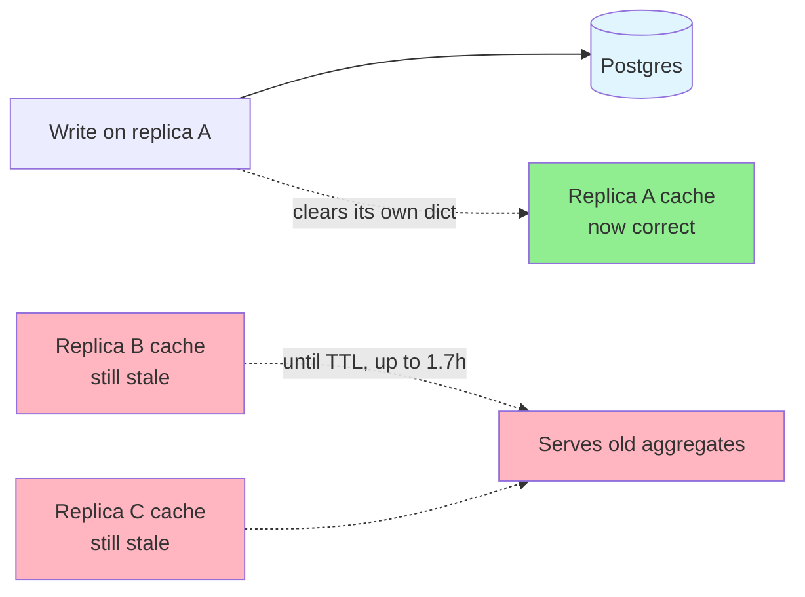
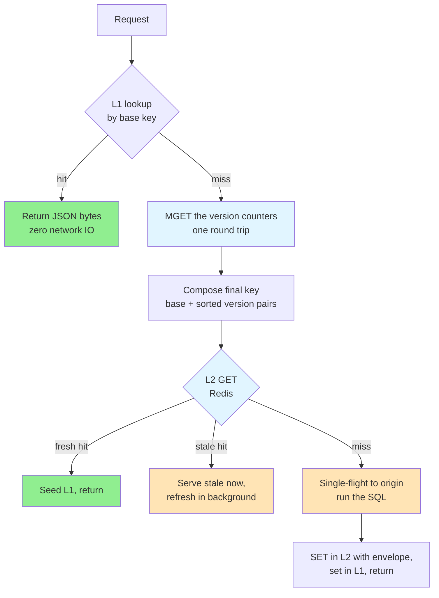
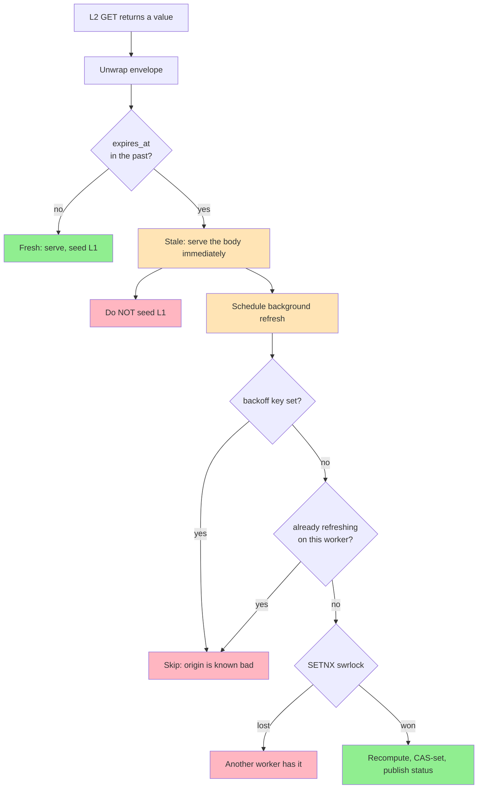
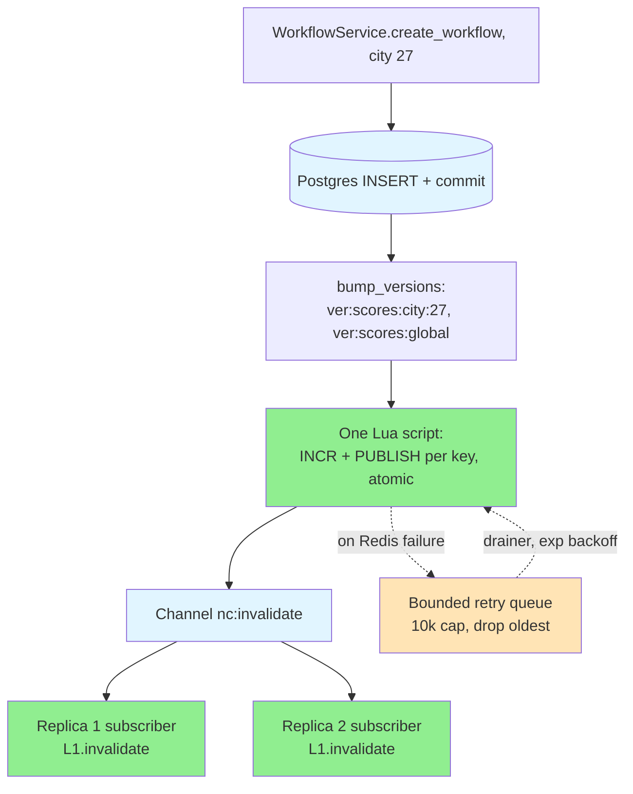
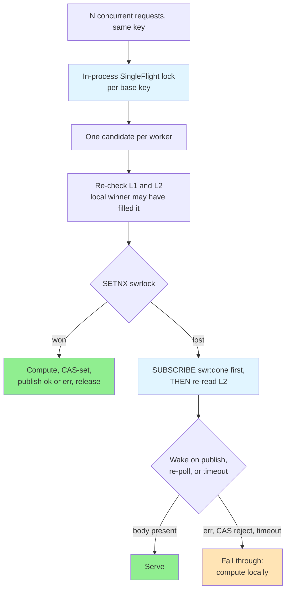

# 🗝️ How I Built a Two-Tier Cache That Never Deletes a Key

> **Overview**: A per-worker dictionary is a correct cache exactly once — the moment a second worker exists, a write on one replica leaves every other replica serving data it believes is fresh. Fixing that for a civic-data platform whose heaviest reads are PostGIS aggregations that have taken over 100 seconds cold meant a two-tier cache: an in-process L1 in front of a shared Redis L2. The design decision the whole system rests on is that **it never deletes a cache key**. Invalidation is an `INCR` on a version counter whose value is baked into the key itself, so one integer bump orphans every parameter combination of a query at once. This is that mechanism, the machinery that makes it safe under concurrency, and the three incidents that taught me which parts were load-bearing.

*This is a side project, which is the only reason it has this much cache machinery — nobody was waiting on it, so I could keep going until the design was actually right. The operational numbers are the real ones.*

## 🧒 Layman's Explanation

Imagine a library where the popular books are photocopied and the copies handed out at a dozen branches. Someone revises a book. Now you have to find and destroy twelve photocopies scattered across twelve buildings — and you have to be sure you got all of them, because a copy you miss is indistinguishable from a copy that is still correct.

That is cache invalidation done by deletion, and it is hard for exactly the reason it sounds hard: you must enumerate every copy.

The trick this system uses is to stop chasing copies. Every book gets an **edition number** printed on its spine, and every photocopy is filed under the edition it came from. To revise the book you don't destroy anything — you just declare that the current edition is now 8. Every branch that goes looking for "edition 8" finds nothing on the shelf and fetches a fresh copy. The dozen copies of edition 7 are still sitting there, but nobody is looking for edition 7 any more, so they are harmless. The cleaners throw them out eventually.

One `INCR` replaces the search. You never have to know how many copies exist or where they are — which is the whole point, because in a cache the "copies" are every combination of query parameters anyone has ever asked for, and you genuinely cannot enumerate them.

The rest of the design is the consequences of that trick. If nobody deletes the old editions, something else must, or the shelves fill up. If a branch keeps a copy on its own desk for speed, it needs telling when the edition changes. And if a book takes two minutes to reprint, you would rather hand someone yesterday's edition immediately than make them wait — but only one branch should be doing the reprinting.

## 🎯 The TLDR

**The problem was two failure modes, not one.** The original cache was an in-process `SimpleMemoryCache` — one dictionary per gunicorn worker. A write on replica A left replica B's copy untouched until its TTL expired, and only one entity type invalidated on write at all. Everything else rode a 6000-second TTL, which meant up to **1.7 hours of stale aggregates** after a data upload. Cross-replica staleness and no write-path invalidation are different bugs, and a bigger TTL fixes neither.

**The fix is versioned keys, and it inverts what invalidation costs.** Every cached entry's key ends in a literal suffix of the version counters it depends on — `...:vk=ver:cities=3|ver:scores:global=42`. A writer bumps the counter; the next reader composes a *different* key, misses, and refills. Invalidation is O(1) in the number of counters, not O(cached parameter combinations), and it requires knowing nothing about what is currently cached.

**L1 exists because the network is not free, and pub/sub exists because L1 is not shared.** The per-worker `TTLCache` serves hot reads with zero IO. Its 5-minute TTL is not the invalidation mechanism — a pub/sub fan-out on every bump wipes matching L1 entries fleet-wide within milliseconds. The TTL is the backstop for when that message is lost.

**Stale-while-revalidate is what makes a 24-hour TTL survivable.** Logical expiry is embedded in the value; the Redis TTL is logical + one hour of grace. Inside the grace window a stale read is served immediately while exactly one worker in the fleet recomputes. Without it, every TTL boundary on a >100-second query is a latency spike with a stampede attached.

**Three Lua scripts do the work that makes it correct rather than merely fast**, and each closes a specific window: `INCR`+`PUBLISH` fused so a crash between them can't leave siblings stale; a compare-and-set that refuses to cache a recompute which raced a write; and a token-checked release so a slow lock-holder can't delete a lock someone else now owns.

**The most transferable piece is not in the cache at all.** It is a registry — a declarative map of which cached readers depend on which version-key families and which writers bump them — enforced by tests that fail when the two halves drift. Cache invalidation bugs are silent by construction. This makes them a red build.

## 🧭 Where I Started: One Dict Per Worker

The original setup was the obvious one, and it is the one almost every service starts with: an `aiocache.SimpleMemoryCache` behind a decorator, a TTL, and a single explicit invalidation path for the one entity somebody had been bitten by.



Two distinct failure modes came out of that, and it is worth separating them because they have different fixes:

- **Cross-replica staleness.** Each gunicorn worker held its own dictionary. A write served by replica A cleared A's copy and nothing else. Every other worker kept serving its own copy until that copy's TTL ran out. Raising or lowering the TTL trades staleness against load — it never makes the cache *correct*.
- **No invalidation on write.** Only one entity type cleared keys on mutation. Everything else — the score aggregations, the ward rollups, the cross-city summaries that are the actual product — relied entirely on the 6000-second TTL. After a workflow upload, the page that motivated the upload could show pre-upload numbers for **1.7 hours**.

The second one is the one that matters, and it is the one that a shared cache alone does not fix. Moving to Redis makes every replica agree; it does not make them agree on something *current*. You need a mechanism that turns a write into an invalidation, and it has to be a mechanism that does not require the writer to know which cached queries its write affected — because a workflow upload for one city affects four different aggregation endpoints across two services plus a cross-city rollup, at every combination of `skip` and `limit` anyone has ever requested.

## 🔑 The Idea: Version the Key, Never Delete It

Every entity family has a counter in Redis: `ver:cities`, `ver:scores:city:27`, `ver:wards:global`. A cached read declares which counters it depends on. Before reading, it fetches those counters and appends their values to its cache key:

```
v1:nc:CityService.read_cities:limit=100:skip=0:state_id=None:vk=ver:cities=3|ver:scores:global=42
└──────────────── base key: method + arguments ─────────────────┘└──── version suffix ────┘
```

To invalidate, a writer runs `INCR ver:scores:global`. It becomes 43. Every future reader composes a key ending `...|ver:scores:global=43`, which has never been written, so it misses and refills from the database. The entries ending in `42` are still in Redis — nobody will ever ask for them again.

The properties this buys are worth being precise about, because they are what justify the rest of the complexity:

- **Invalidation cost is independent of cache size.** One `INCR` invalidates every cached variant of every query that depends on that counter — all pagination offsets, all filter combinations, across every replica. The writer does not enumerate anything, and does not need to.
- **Fan-out is expressed as a data dependency, not a call graph.** A workflow write bumps `ver:scores:city:27` *and* `ver:scores:global`. That single pair invalidates four aggregation readers across three services plus the cross-city rollup, because those readers declared the dependency. The writer never names them.
- **There is no partial-invalidation window.** Deletion-based invalidation has a gap between "deleted key A" and "deleted key B" during which the cache is internally inconsistent. A version bump is one integer; there is no intermediate state where half the family is invalidated.
- **It is trivially correct under concurrent writes.** Two writers bumping the same counter produce 44 instead of 43. Both intended the old entries to be unreachable; both got that. `INCR` being atomic is the entire concurrency story.

### Why the suffix is literal and not hashed

The instinct is to hash the suffix — it looks tidier and the keys get shorter. I decided against it, and the reasoning generalizes:

- **Truncated hashes collide sooner than intuition says.** A 32-bit truncation hits birthday-paradox collisions at roughly 65,000 distinct keys. A collision here is not a performance problem, it is a *correctness* problem: two different queries silently sharing a cached body. The cache would be wrong in a way that looks exactly like it working.
- **Redis does not care.** Keys are allowed up to 512 MB. Version keys and their integer values are short. There is no pressure to compress.
- **A literal suffix is debuggable, and that turned out to matter more than anything else.** When someone reports a stale read, `redis-cli --scan --pattern 'v1:nc:CityService.read_cities:*'` shows the composed keys with their version pairs in plain text. You can see at a glance which counter values a cached entry was built under, compare them against the live counters, and know immediately whether the bump landed. With a hashed suffix, every one of those questions requires reproducing the hash offline.

That last point is the one I would defend hardest. This mechanism's failure mode is *silence* — a bump that didn't land looks identical to a cache that is working. Optimizing away the readability of the one artifact that can tell you the difference is a bad trade at any key length.

### What it costs

Nothing is free, and this design has one obvious cost and one non-obvious one.

The obvious cost is **garbage**. Orphaned entries stay in Redis until their TTL expires or memory pressure evicts them. Steady-state overhead is bounded by write rate times TTL, which for this workload is small — but it is real, and on a 1 GB instance it is not nothing.

The non-obvious cost is that **this design silently requires an eviction policy**. `maxmemory-policy` must be `allkeys-lru`. With the default `noeviction`, a Redis instance that fills with orphaned entries stops accepting writes and starts returning errors — turning a cache-space problem into a write-path outage. That coupling is invisible in the application code: nothing in the cache module mentions `maxmemory-policy`, and everything works perfectly right up until the instance fills. It belongs in the same mental bucket as a database migration — infrastructure configuration the application's correctness depends on but does not declare.

## 🏎️ The Read Path

Three tiers, checked in order, with the cheapest first.



**L1 is keyed by the base key, not the composed key.** This is a small detail with a large consequence. If L1 were keyed by the composed key, every L1 lookup would first need the version counters — which means a Redis round trip, which defeats the entire purpose of having an in-process tier. Keying L1 by the base key means a hot read touches no network at all.

The cost of that choice is that L1 entries cannot self-invalidate when a version changes: the key doesn't contain the version, so a bumped counter doesn't change what L1 looks up. Something has to actively wipe them. That something is pub/sub, and the 5-minute TTL is the backstop for when the message is lost.

The L1 implementation carries a forward and a reverse index for this — `base_key → {version keys}` and `version key → {base keys}` — so that invalidating a counter wipes exactly the affected entries rather than sweeping the whole cache, and overwriting an entry cleans up its old tags in time proportional to that entry's tag count rather than the size of the index. `TTLCache` evicts silently, so both indices are pruned lazily on access and by a periodic sweep; without that, the indices are a slow memory leak on a long-running worker with high key churn.

## ⏳ Stale-While-Revalidate

A 24-hour TTL on a query that takes 100 seconds cold means that once a day, some unlucky user waits 100 seconds — and on a multi-worker fleet, every request that arrives during those 100 seconds piles onto the same cold key.

SWR decouples two things that a plain TTL conflates: **when a value stops being fresh** and **when it stops being available**.

### The envelope

The logical expiry is embedded in the cached value; the Redis TTL is logical plus grace.

```
b"SWR1" + struct.pack("!I", expires_at_unix) + body
└─magic─┘└──── 4 bytes ────┘
```

Eight bytes of header. Three things about this format earned their place:

- **The magic prefix makes the format self-describing**, which is what allows a deploy of the SWR code to coexist with values written by the previous code path. A value that doesn't start with `SWR1` unwraps to `expires_at = None` and is treated as fresh, so pre-SWR entries age out naturally instead of requiring a flush.
- **`!I` is unsigned**, so the timestamp is good until 2106 rather than 2038. A signed 4-byte timestamp would have quietly inherited the Y2038 problem for the sake of one bit.
- **The header is fixed-width**, so unwrapping is a slice and a `struct.unpack` rather than a parse.

Inside the grace window the value is past its logical deadline but still physically in Redis. That is the window where the interesting behaviour lives:



### Why L1 is never seeded with a stale body

This is the subtlest rule in the system and it is easy to get backwards.

When a stale L2 hit is served, the body is returned to the caller but **not** written into L1. The reasoning: L1 has its own 5-minute TTL and no knowledge of logical expiry. Seeding it with a stale body would keep that stale body alive for a further five minutes *on this worker*, independent of whether the background refresh succeeded seconds later. The refresh would update L2, and this worker would keep serving the old value from L1 anyway — the cache tier that exists to be fast would systematically become the tier that is wrong.

So stale bodies go to the caller and nowhere else. The next request on this worker misses L1 again, hits L2, and by then the refresh has usually landed.

### The status payload is load-bearing

The refresh task publishes to a per-key channel `swr:done:<final_key>` in a `finally` block, with a status of `ok` or `err`. That status field looks like an observability nicety. It is not — it is the difference between a bad origin call costing one request and costing the whole fleet several minutes.

Consider a cold miss where the winner's database query raises. Losers are waiting on a pub/sub message with a 600-second timeout. If the winner simply doesn't publish on failure, every loser blocks for the full 600 seconds before falling through to compute locally. **One failed query becomes a ten-minute fleet-wide latency event.** Publishing `err` lets every loser fall through immediately.

The same instinct produced the origin-error backoff. When a refresh's origin call raises, the worker sets `swrbackoff:<final_key>` for 60 seconds, and stale reads skip the refresh attempt entirely while it exists. Without it, a key whose origin is down gets a lock acquisition, an origin call, a failure, and a release *for every stale read*, sustained at the read rate for the whole outage — a retry storm generated by the machinery that was supposed to protect the origin.

Both are the same lesson in different clothing: **a failure path that just doesn't signal is worse than one that signals failure.** Silence is indistinguishable from slowness, and the system's response to slowness is to wait.

## ✍️ The Write Path

A write commits to Postgres, then bumps the counters its data feeds.



Note the ordering: **the database commit happens first, and the bump follows.** If the bump fails, the data is durable and the cache is stale — recoverable, and bounded by the TTL. If it were the other way round, a failed commit after a successful bump would throw away a perfectly good cache for a write that never happened. Given that one of these failure modes is recoverable and the other is pure loss, the ordering is not a close call.

A failed bump goes onto a bounded in-process retry queue with a background drainer. Bounded matters: an unbounded queue during a sustained Redis outage is a memory leak that eventually takes down the process that was trying to degrade gracefully. It drops oldest at 10,000 entries and logs, accepting that a sustained outage falls back to the TTL backstop.

### Three Lua scripts, three closed windows

Each script exists because a specific two-step sequence had a gap in the middle.

**Fused `INCR` + `PUBLISH`.** Issued as separate commands, a worker crash between them leaves L2 correctly invalidated but sibling replicas never told — their L1 keeps serving the old value until its TTL. One script makes both happen or neither.

```lua
local channel = KEYS[1]
for i = 2, #KEYS do
    redis.call('INCR', KEYS[i])
    redis.call('PUBLISH', channel, KEYS[i])
end
```

**Compare-and-set on write-back.** A recompute reads the version counters, runs a query that may take 100 seconds, then writes the result. If a writer bumped a counter during those 100 seconds, the computed value is already stale and writing it would cache a known-wrong answer under the *new* key. The CAS script re-checks every counter server-side and refuses the write if any changed:

```lua
local final_key = KEYS[1]
for i = 1, #KEYS - 1 do
    local current = redis.call('GET', KEYS[i + 1]) or '0'
    if current ~= ARGV[i + 2] then
        return 0
    end
end
redis.call('SET', final_key, ARGV[1], 'EX', tonumber(ARGV[2]))
return 1
```

A rejected CAS is not an error — it is the system noticing that the world moved and declining to persist a stale snapshot. The counter is expected to be non-zero during normal write traffic.

**Token-checked release.** The refresh lock has a TTL so a crashed holder can't block the key forever. But a TTL means a slow holder can have its lock expire while it is still running — at which point another worker legitimately acquires it. If the original holder then finishes and calls `DEL`, it deletes *someone else's* lock. Checking the token first makes release a no-op for stale holders:

```lua
if redis.call('GET', KEYS[1]) == ARGV[1] then
    return redis.call('DEL', KEYS[1])
end
return 0
```

This is the classic distributed-lock mistake, and it is worth naming because it is invisible in testing — it only manifests when a holder is slow enough to exceed its own lock TTL, which is exactly the condition your tests don't reproduce.

## 🚦 The Cold Miss

A cold miss is when L2 has nothing at all under the current composed key: first request after a deploy, immediately after a version bump, or a grace window that fully elapsed. This is where a stampede would happen, and the protection is two-layered.



The in-process lock collapses concurrent coroutines within one worker to a single candidate; the Redis `SETNX` collapses the surviving candidates across the fleet to one. Two layers because they solve different problems at different costs — the in-process lock is free and handles the common case, and only the survivors pay for a Redis round trip.

### Subscribe, then re-check

The ordering of those two operations is a genuine race, and getting it wrong produces a bug that only appears under load.

A loser needs to know when the winner has written the value. The obvious sequence — re-read L2, and if it is empty, subscribe and wait — has a window: if the winner writes and publishes *between* the loser's read and its subscribe, the loser misses the notification and blocks until timeout. Subscribing first closes it. Either the subsequent re-read finds the value (and the loser never waits), or the subscription is already live to catch the publish.

There is still a periodic L2 re-poll every 10 seconds inside the wait, as a safety net against a dropped message. Redis pub/sub is fire-and-forget with no delivery guarantee — a subscriber that is disconnected at the moment of publish simply never receives it. The re-poll increments a `publish_loss_recovered` counter when it catches something, which makes an invisible failure mode into a metric. **A non-zero value there is a signal to investigate, not a success story** — it means pub/sub is dropping messages, and the safety net is carrying load it was not meant to carry.

### Why pub/sub and not polling

Because the wait is as long as the origin call, and the origin call can exceed 100 seconds. Polling every 100 ms means over a thousand `GET`s per waiting worker per refresh. Polling with backoff is better but worst-case latency becomes the poll interval, so the loser sits on a value that has been available for seconds. Pub/sub wakes losers within one Redis round trip of the write, costs one connection per waiting worker, and reuses plumbing the invalidation path already needs.

## 🗺️ The Registry: Making the Invalidation Graph Testable

This is the piece I would port to any other project, and it is the least glamorous thing in the system.

Cache invalidation bugs are silent. A reader that gates on a counter no writer ever bumps serves stale data forever, and looks exactly like a reader that is working. Nothing errors. No alert fires. You find out when a user says the number is wrong, and by then it has been wrong for weeks.

So the dependency graph is declared as data — which readers gate on which version-key families, which writers bump them — and tests assert the two halves agree:

```python
# Excerpted shape: generators are compared by identity, so the same
# vk.* attribute must be reused on both sides — never a literal string.
CACHED_READERS = {
    "CityService.read_cities": frozenset({vk.cities, vk.scores_global}),
    "WardService.read_wards_by_city": frozenset({vk.wards_for_city}),
}

CACHE_WRITERS = {
    "CityService.create_city": frozenset({vk.cities}),
    "WardService.create_ward": frozenset({vk.wards_for_city, vk.wards_global}),
}
```

Four checks run against it, and each one catches a different class of mistake:

- **Every reader dependency has at least one writer.** An orphan reader is a cached endpoint that can never invalidate. This is the silent-stale-data bug, caught at build time.
- **Every writer bumps something a reader wants.** A dead bump is harmless at runtime but signals drift — usually a reader that was refactored away while its invalidation stayed behind.
- **Registry entries reference real `vk.*` attributes.** Generators are compared by identity, so a typo'd literal string would silently never match.
- **A domain invariant.** Any writer that bumps a per-city score counter must also bump the global one. This encodes a rule the type system cannot: per-city writes feed cross-city aggregations, and forgetting the global bump means the per-city page updates while the summary page silently doesn't.

A separate parametrized test generates one assertion per `(writer, reader)` pair the registry connects, proving the bump set actually invalidates every reader that claims to depend on it. Adding a cached read without wiring its invalidation is a red build rather than a bug report six weeks later.

The honest limitation: **the registry catches drift between declarations, not between declaration and reality.** It cannot detect a reader whose decorator names one counter while its registry entry names another, if both counters happen to have writers. It is a strong check on a specific and common failure, not a proof of correctness.

And it has one blind spot that is documented in the registry itself, which I think is the right instinct — a landmine you can see is much better than one you cannot. Two readers, `get_all_categories` and `get_all_entities`, are not on the versioned cache at all. They use a module-level list populated on first call: no TTL, no invalidation, no version key. This is safe *only* because those domains have no writers anywhere in the codebase. The day someone adds one, staleness is bounded by process uptime — days, not the one-hour TTL backstop — and **no test will catch it**, because the enforcement operates on the registry and these are deliberately outside it. The docstring says so in as many words. That is the correct treatment for a known risk you have chosen to accept, and it is also the first thing I would remove.

## ⚠️ What Broke

Three incidents, all in the warming layer rather than the cache itself, and all instances of the same failure shape: **a component reporting success while doing the opposite of its job.**

### 1. The warmer that cancelled its own database queries

The cache-warmer sidecar was, every cycle, timing out two of its warmers at their 600-second budget, leaking hundreds of Postgres connections, and **logging success anyway**. Seven days of logs held 386 `non-checked-in connection` errors against 24 successful warms.

The chain had four links, and the interesting one is the third:

1. **Pool starvation.** SQLAlchemy defaults gave 15 max connections. The cron ran 4 warmers concurrently, three of which fanned out 8-wide — up to ~25 concurrent sessions against a 15-connection pool. Tasks blocked on the pool while slow PostGIS queries crawled.
2. **A timeout implemented as task cancellation.** `asyncio.wait_for` cancels the coroutine when the budget elapses.
3. **Cancellation mid-query orphans the connection.** When `CancelledError` fires during an in-flight asyncpg query, the session's `__aexit__` cannot cleanly reset and return the connection. It is orphaned and later reaped by the garbage collector — one error line per leak. Leaked connections starve the pool further, which makes queries slower, which makes more timeouts fire. **A self-reinforcing spiral.**
4. **The runner swallowed it.** Timeouts were logged, then success was reported unconditionally.

The fix that matters is the third link: replace task cancellation with a **database-level timeout** (`command_timeout` on asyncpg, set to 120 seconds, well under the 600-second backstop). A server-side cancellation raises an ordinary exception and leaves the connection cleanly reusable. The generalizable lesson is that **`asyncio.wait_for` around I/O that owns a pooled resource is a resource leak waiting for a slow day** — cancellation unwinds your code, but it cannot unwind the state your code was in the middle of establishing with a remote system. Timeouts belong as deep in the stack as you can push them.

The rest: right-size the pool against the actual fan-out, use `return_exceptions=True` so one failing entry doesn't cancel its in-flight siblings, and return an honest summary with a `degraded` state that the metric distinguishes from clean success.

### 2. The warmer that invalidated the cache it was warming

There is a startup safety net called force-bump: on boot, one elected worker bumps every known counter, so no cache entry written before a restart can survive it. This exists because bumps are buffered in a process-local queue — a worker that dies holding undelivered bumps leaves Postgres updated and Redis showing old counter values, and entries built under those old versions keep serving stale data. Over-bumping on startup is replay-by-overshoot.

That is correct for the backend. The warmer sidecar reused the backend image and called the same bootstrap, so it inherited the behaviour. **Every warmer restart invalidated the entire cache and then tried to re-warm it** — and when warmers were slow or timing out (see above), the sidecar left the cache colder than it found it. A component whose entire job was populating the cache was, on restart, its most effective purge mechanism.

The fix is one environment variable, and the interesting part is the diagnosis: two components, one shared bootstrap, opposite responsibilities. A safety net that is correct for the process that serves requests is actively harmful in the process that warms them, and nothing in the code said so, because the code did not know which process it was in.

### 3. Cold, but reporting warm

The force-bump leader election originally used a single fleet-wide lock with a 60-second TTL. That correctly deduplicated the workers of one booting instance — and re-fired on **every** instance boot. A rolling deploy boots its instances minutes apart, so each new instance re-bumped and re-invalidated the L2 that the previous instance's warmer had just finished populating.

Meanwhile the readiness marker was version-scoped, so it still reported *warm*. The fleet ended up **cold behind a gate that said it was warm** after every deploy, which is worse than being visibly cold — the load balancer confidently routed traffic to instances it had verified were ready to serve slowly.

The fix scopes the lock by deploy version with a one-hour TTL: the first instance of a deploy bumps once, and a second instance of the same version finds the lock held, skips, and reads the already-warm L2. Force-bump is inherently a per-deploy concern, so once-per-deploy is the correct cadence — the original per-boot cadence was a category error that happened to work with one instance.

**The pattern across all three:** a green signal that was measuring the wrong thing. The cron reported "I ran" rather than "I succeeded". The readiness marker reported "this version was warmed" rather than "this version is warm now". In each case the signal was true and useless. When a component's health check cannot distinguish doing its job from doing the opposite, it will eventually report success while doing the opposite — and you will believe it, because that is what health checks are for.

## 🧮 The Numbers That Have to Hold

Three relationships between config values that are invariants rather than preferences. Each has a failure mode that only shows up under the load that makes it matter.

```
wait_timeout  ≤  lock_ttl
lock_ttl      ≫  slowest legitimate origin call
swr_grace     >  origin call duration
```

- **`wait_timeout ≤ lock_ttl`.** Once the lock can expire, there is no live winner to wait for. Waiting longer than the lock's lifetime just delays the fall-through. Both default to 600 seconds; they must move in lockstep.
- **`lock_ttl` comfortably exceeds the slowest legitimate origin call.** If the lock expires while a real recompute is still running, a second worker acquires it and starts a second recompute — **reproducing exactly the stampede the lock exists to prevent**, at the worst possible moment. With `read_city` observed above 100 seconds, 600 gives about 6× headroom.
- **`swr_grace` exceeds the origin duration.** Otherwise stale serving ends before the refresh it triggered can finish, and the grace window provides nothing.

Two limits worth stating rather than discovering:

**Clock skew.** `expires_at` is wall-clock, compared against each reader's local clock. On NTP-synced hosts drift is sub-second and irrelevant. Without NTP, hosts disagree about staleness — extra refresh attempts, or slightly delayed ones. Neither breaks correctness; both inflate the metrics you would use to diagnose it.

**Redis Cluster would break the invalidation fan-out.** `PUBLISH` on a cluster only reaches subscribers connected to nodes holding the channel's slot, unless you explicitly use sharded pub/sub. On a single-primary instance this is a non-issue — but it means "scale Redis out" is not a transparent operation here. It is a change to the correctness of L1 invalidation, and the L1 tier would silently fall back to its TTL backstop on the replicas that stopped receiving messages.

## 🕳️ What I'd Fix Next

In the order I would do them:

1. **Move the two module-level caches onto the versioned path.** They are correct only by the accident of having no writers, they fail with an unbounded staleness window, and the enforcement layer structurally cannot catch it. This is the only known correctness landmine left.
2. **Fix the query that made the machinery necessary.** `read_city` is slow because it appears to return full boundary geometry. A 100-second origin call is what forces the 600-second lock TTL, the grace window, and much of the SWR complexity. Making the query fast would let several of these numbers shrink toward boring.
3. **Alert on `publish_loss_recovered` and `cold_miss_fallback`.** Both are currently counters someone has to look at. They are the two signals that say the pub/sub layer is degrading, and a degrading pub/sub layer presents as nothing at all until L1 is systematically stale.
4. **Bound the orphaned-key growth explicitly.** Right now it is bounded by TTL and LRU, which is fine at current write rates and entirely unmonitored. `evicted_keys` trending up is the early warning that the 1 GB instance has become the constraint.

## 📝 Conclusion

The design decision that made everything else possible was refusing to delete keys. Deletion-based invalidation requires the writer to know what the readers cached, which is a coupling that grows with every new endpoint and fails silently when someone forgets. Versioned keys invert it: readers declare what they depend on, writers bump what they change, and neither knows about the other. The cost is garbage in Redis, and garbage is cheap — an eviction policy handles it, provided you remember that the eviction policy is now load-bearing.

The second lesson is that **a cache tier's staleness bound is a property of the whole system, not of its TTL.** L1's five minutes is not how stale L1 gets; it is how stale L1 gets *when pub/sub fails*. In the normal case the bound is one Redis round trip. Quoting the TTL as the staleness guarantee would be quoting the failure mode as the design — and it took the third incident to notice I had been doing exactly that with the readiness marker.

The third is the one I would take anywhere. **Cache invalidation fails silently, so the only defence is to make it fail loudly somewhere else.** The registry does not prevent a single invalidation bug at runtime — it prevents the *class* of bug where a declaration and its counterpart drift apart, and it does so at build time, in a test, with a message naming the reader that has no writer. Every incident in this document was a component reporting success while doing the opposite of its job. The registry is the one place where that is structurally impossible, because the assertion is not "did it work" but "do these two lists agree" — and lists cannot lie about agreeing.

## 🎓 Key Takeaways

- **Version the key instead of deleting it.** Cache keys embed the values of the version counters they depend on, so invalidation is one `INCR` regardless of how many parameter combinations are cached. Writers never enumerate what readers cached — the coupling that makes deletion-based invalidation fail as a system grows.
- **Versioned invalidation silently requires an eviction policy.** Orphaned entries are never deleted. With `noeviction`, a filling instance stops accepting writes and turns a space problem into an outage. `allkeys-lru` is part of the design, not part of the ops config.
- **Keep the version suffix literal, not hashed.** 32-bit truncation collides around 65k keys, and a collision is silent wrongness rather than slowness. A greppable suffix is what makes "did the bump land?" answerable in one `redis-cli` command — and this mechanism's failure mode is silence, so readability of the diagnostic artifact is worth more than key length.
- **L1 is keyed by the base key so hot reads touch no network** — which means L1 cannot self-invalidate on a version change, which is why pub/sub exists. The TTL is the backstop for a lost message, not the invalidation mechanism. Quoting it as the staleness bound describes the failure mode, not the design.
- **Never seed L1 with a stale body.** L1 has no notion of logical expiry, so a stale body seeded there outlives the background refresh that was supposed to replace it — making the fast tier systematically the wrong one.
- **A failure path that doesn't signal is worse than one that signals failure.** A refresh that fails without publishing leaves every waiter blocked for the full timeout, turning one bad query into a fleet-wide multi-minute latency event. Publish `err`, and set a backoff key so a down origin doesn't get retried at the rate of incoming stale reads.
- **Subscribe before re-checking.** If the winner publishes between a loser's read and its subscribe, the loser blocks until timeout. Subscribe first, then read: either the value is already there or the subscription catches the publish. Keep a periodic re-poll as a safety net, and treat its recovery counter as an alarm rather than a success.
- **`asyncio.wait_for` around pooled I/O is a resource leak waiting for a slow day.** Cancellation mid-query orphans the connection, leaked connections starve the pool, starvation causes more timeouts. Push timeouts down to the driver, where cancellation is a normal exception and the connection stays reusable.
- **Lock TTL must comfortably exceed the slowest legitimate origin call**, or the lock expires mid-recompute, a second worker acquires it, and you have reproduced the stampede the lock was preventing — under exactly the load that made it slow. And release must be token-checked, or a slow holder deletes a lock someone else now owns.
- **Declare the invalidation graph as data and test it.** Which readers gate on which counters, which writers bump them, asserted by tests that fail on orphan readers, dead bumps, and domain invariants. Invalidation bugs are silent at runtime — this is what makes them a red build instead.
- **A green signal that measures the wrong thing is worse than no signal.** A cron reporting "I ran" while half its warmers timed out, and a readiness marker reporting "this version was warmed" while a later instance re-invalidated it, both produced confident routing into a cold cache. Health checks must distinguish doing the job from doing its opposite.
- **The same safety net can be correct in one process and harmful in another.** Force-bumping every counter on startup protects a request-serving worker from undelivered bumps and makes a cache-warming sidecar purge the cache it exists to fill. Shared bootstrap code cannot tell which process it is in — so the role has to be configuration, not inheritance.

## 📚 Related Concepts

- [Caching](../../CoreConcepts/Caching.md) — TTL as a staleness budget, and the tier-versus-invalidation trade this design is a worked instance of.
- [Redis (Deep Dive)](../DeepDives/Redis.md) — single-threaded atomic execution and server-side scripting, which is what makes the three Lua scripts correct rather than merely convenient.
- [Distributed Locking](../../CoreConcepts/DistributedLocking.md) — lock TTLs, token-checked release, and why a holder slower than its own lease is the failure that matters.
- [Scaling Reads](../Patterns/ScalingReads.md) — the read-path tiering this sits inside, and where a cache stops being the answer.
- [Dealing with Contention](../Patterns/DealingWithContention.md) — single-flight and stampede control as a contention problem rather than a caching one.
- [Distributed Cache](../ProblemBreakdowns/DistributedCache.md) — the same problem posed as an interview design, with the shared-counter question at its centre.
- [PostgreSQL](../DeepDives/Postgresql.md) — the origin behind this cache, and why connection-pool exhaustion is the failure the warmer kept rediscovering.
- [How We Built a Firm-Wide LLM Gateway](HowWeBuiltTheFirmwideLlmGateway.md) — the same in-memory-versus-shared-counter decision, resolved the other way and for different reasons.
