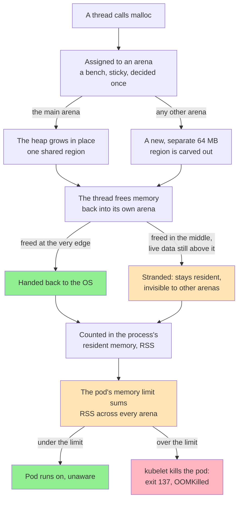
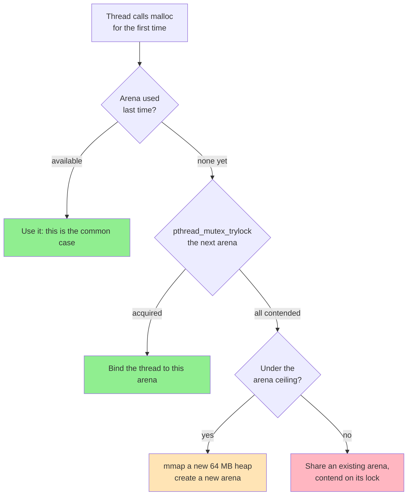
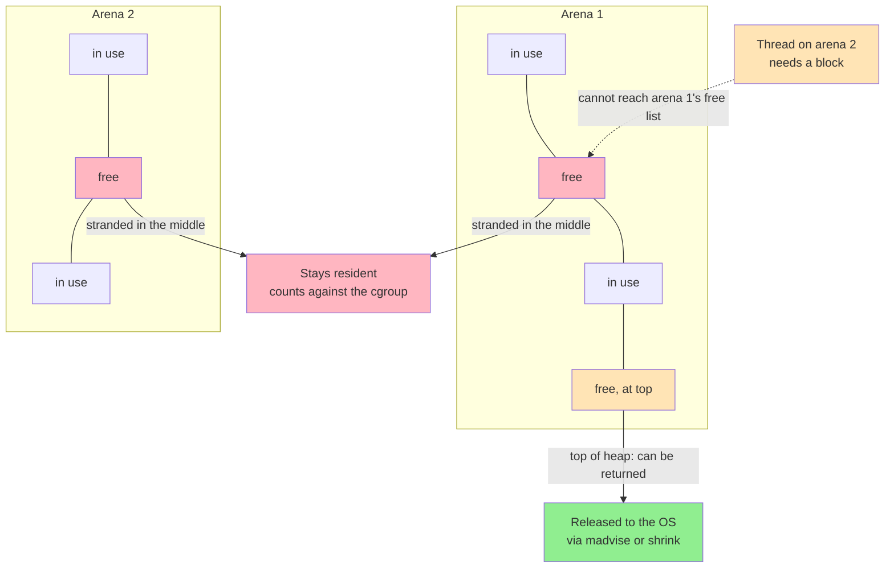
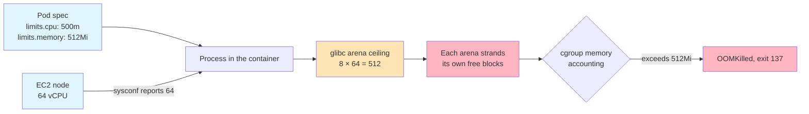

# 🧨 Why Our EKS Pods Kept Getting OOMKilled — and Nothing Was Leaking

> **Overview**: A Python service on EKS kept climbing in memory until the kubelet killed it with exit 137. Every leak hunt came back clean: `tracemalloc` was flat, the object graph was stable, and the same code on a laptop behaved perfectly. The memory was real, it was resident, and it was **free** — stranded across dozens of per-thread `malloc` arenas that glibc had opened to avoid lock contention, sized from a core count that described the EC2 node rather than the pod. The fix was one environment variable, `MALLOC_ARENA_MAX=2`. This is what arenas are, why the usual "arenas waste memory" complaint is mostly wrong, why it becomes right inside a container, and how to tell the difference before you reach for the knob.

*Numbers quoted here are from the public sources cited at the end and from glibc's own documented defaults. I have deliberately not invented figures for our own incident — the shape of it is what transfers, and the arithmetic below is reproducible from your own node's core count.*

## 🧒 Layman's Explanation

Give every worker in a workshop their own bench, and nobody queues for tools — that is a **memory arena**: a private pool a thread allocates from without taking a lock shared with every other thread. Each bench also gets its own scrap bin, and a worker at bench 7 cannot use the offcuts sitting in bin 3 — the wood exists and is paid for, but it is unreachable, so bench 7 just orders more.

A landlord who bills by total square footage does not care which bin anything sits in. Nobody wasted material and nobody leaked anything — there were simply more benches than the room needed, and the sum of everyone's small, reasonable scrap pile is what went over budget.

### The Whole Path, in One Picture

Here is that same shape as an actual allocation moving through the machine. You do not need any kernel background to read it — every technical term that shows up later in the article is just a closer look at one box in this picture.



Nothing in that picture is a mistake by itself — every arrow is a reasonable design choice. The bug is what happens when the left branch (a new arena, over and over) fires far more often than intended, and the "stranded" branch accumulates across all of them. The rest of this article is about why that happens, and how to tell it apart from a real leak.

## 🎯 The TLDR

**The symptom was a leak that wasn't one.** RSS climbed under load and plateaued high, never returning to baseline. The pod eventually crossed its memory limit and the kubelet killed it — exit code 137, no traceback, no Python exception. Every tool that understands the Python heap said the Python heap was fine, because the memory was not on the Python heap.

**glibc gives threads their own allocation arenas to avoid a shared lock.** The main arena grows the data segment with `brk`; secondary arenas are `mmap`ed in 64 MB chunks. A thread sticks to the arena it used last, and only when arenas are contended does glibc create another — up to a ceiling of **8 × the number of cores** on 64-bit (2 × on 32-bit).

**The usual complaint about arenas is wrong, and the real one is narrower.** Arenas reserve *address space*, not memory. They are demand-paged, so an untouched arena costs essentially nothing in RAM. What genuinely costs you is **fragmentation inside** each arena: a freed block goes back to its own arena's free list, and glibc only returns pages to the OS when free space happens to sit at the top of that arena's heap. Free memory stranded in the middle stays resident — and resident is what your cgroup counts.

**Containers break the heuristic, because glibc cannot see your CPU limit.** The arena ceiling comes from `sysconf(_SC_NPROCESSORS_ONLN)`, which reports the **node's** cores. A pod limited to half a core on a 64-core instance still gets an arena ceiling of 512. The rule of thumb that was sane on bare metal is computed from a number that no longer describes the process.

**Python hides this especially well**, for three compounding reasons: `tracemalloc` only sees Python-level allocations; anything over 512 bytes bypasses pymalloc and goes straight to `malloc`; and C extensions — plus the BLAS thread pool NumPy quietly starts for you — allocate natively in threads you never wrote.

**The fix is `MALLOC_ARENA_MAX=2`**, set in the pod spec so it is present before the process starts. Two rather than one, because one serializes every thread on a single lock. It trades allocator throughput for a bounded footprint, and it is a trade you should measure rather than assume.

## 🔍 The Shape of the Problem

The signature is specific enough to recognise, and worth writing down because it rules out most of the things you would otherwise spend a week on:

- **RSS grows under load and plateaus high.** It does not grow without bound — which is the first hint that it is not a classic leak. It rises to a ceiling determined by concurrency and stays there.
- **It never comes back down after the load stops.** Idle for an hour, still high.
- **The managed-heap tooling is clean.** `tracemalloc` snapshots show no growth. Object counts are stable. `gc.collect()` changes nothing.
- **It reproduces under concurrency, not under volume.** Push the same total number of requests through one thread and the problem is much smaller or absent. Push them through many threads and it appears.
- **It does not reproduce on a laptop** — or rather, it reproduces so much more mildly that it looks like a different bug. Your laptop has 8 cores. The node has 64.
- **The kill is `OOMKilled`, exit 137, with no Python traceback.** This distinction is the same one that matters for JVM workloads: the kernel killed the container for exceeding its cgroup limit. The process was not asked politely and did not get to raise `MemoryError`.

That last point is worth dwelling on, because it is where people go wrong first. A `MemoryError` in Python means the allocator asked the OS for memory and was refused. `OOMKilled` means the cgroup's limit was exceeded and the kernel reaped the process. **The first is your program failing to get memory; the second is your program successfully getting too much of it.** They point at opposite investigations.

## 🏭 Why Arenas Exist At All

Every call to `malloc` has to mutate shared bookkeeping — free lists, bin structures, the top-of-heap pointer. That requires a lock. With one arena, every thread in the process contends for that one lock on every allocation, and allocation is one of the most frequent operations a program performs.

The original approach was to detect contention and split off a new arena in response, but detecting contention was itself slow enough to hurt. So glibc moved to assigning arenas up front:



### Two Ways to Ask the Kernel for Memory

Neither arena type invents memory on its own — every byte glibc hands out ultimately came from one of two requests to the kernel, and the difference between them is why the two arena types behave so differently.

**`brk`** moves a single pointer, the *program break*, which marks the current end of the heap sitting right after your program's data in virtual memory. Ask the kernel to move the break up and the heap grows; ask it to move down and the heap shrinks. Because it is one pointer for one contiguous region, memory can only be handed back from the **top** — right below the break. A freed block with anything still live above it cannot be returned, no matter how large it is, since the break can't move past a byte that's still in use.

**`mmap`** asks the kernel for a brand new region of virtual address space that doesn't have to sit next to the heap at all. Called anonymously — no file behind it — the kernel doesn't hand over physical RAM up front; it just reserves the address range and marks those pages "not present" in the page table. The first time a thread touches a page in that range, a page fault fires, and only then does the kernel find a physical frame and map it in: the same demand paging that backs a process's memory generally. Because each `mmap`ed region is its own independent mapping, it can be handed back with `munmap` on its own, with no shared pointer to coordinate.

That is the whole reason glibc treats the two arena types differently: the **main arena** grows and shrinks with `brk`, sharing one break pointer across whichever threads land on it. Every **secondary arena** gets its own **64 MB** region from `mmap`, so it can be released independently — and it's also why a thread on arena 2 can never reach into arena 1's free list: they are genuinely separate mappings, not slices of one heap.

Two structural details fall out of that split and matter for everything that follows:

**Trimming behaves differently between the two.** The main arena's freed pages return to the OS only when they sit at the top of that one break-managed heap; each secondary arena returns its own pages via `munmap`/`madvise` independently. This is also why the arena count multiplies address space in units of 64 MB — one new `mmap` per new arena.

**Thread-to-arena assignment is sticky, and it is decided on first allocation.** A thread does not shop around for the least-contended arena on every `malloc` — it stays where it was. That is the point: the cost of choosing well is precisely what the design is avoiding. It is a good trade when threads are roughly as numerous as cores, and it is the source of the imbalance when they are not.

**The ceiling is a function of the core count:**

```
64-bit:  max arenas = 8 × number of cores
32-bit:  max arenas = 2 × number of cores
```

The reasoning behind `8 ×` is documented and sound: a sane program does not run many more than twice as many threads as cores, so a ceiling of eight times the core count is generous headroom that should never actually bind. Hold onto that sentence — it is the assumption the container breaks.

## 🧮 Address Space Is Not Memory

Before reaching for the knob, it is worth being precise about what arenas actually cost, because the popular version of this story is wrong and believing it will send you tuning the wrong thing.

A new arena `mmap`s a 64 MB region. It does **not** consume 64 MB of RAM. The region is mapped without backing, and the kernel populates pages on demand as they are touched. On a 64-bit system, address space is effectively free — you have far more of it than you can ever populate. So the common complaint that "arenas waste hundreds of megabytes" is, in the general case, a misreading of virtual size for resident size.

This is why `top`'s `VIRT` column is nearly useless here and `RES` is what matters. It is also why the same misdiagnosis recurs: someone runs `pmap`, sees a long column of 64 MB mappings, sums them, and reports a leak of several gigabytes that does not exist.

What *is* real is **fragmentation within each arena**, and this is a genuinely different claim:



Three facts combine into the problem:

1. **Free memory is returned to the arena it came from**, not to a global pool. There is no rebalancing between arenas.
2. **Pages go back to the OS only when the free space is at the top of the heap** — glibc shrinks from the top, or releases whole free pages with `madvise(MADV_DONTNEED)`. A free block with a live allocation above it cannot be returned, no matter how large it is.
3. **Every arena has its own top.** So the amount of "trapped" memory scales with the number of arenas, and each arena independently accumulates its own high-water mark.

An arena that peaked at 40 MB and now holds 2 MB of live data may still be holding most of those 40 MB resident, because the live data is scattered through it. That is not a leak — every byte is accounted for and reusable *by that arena* — but the cgroup does not care about the distinction. With a handful of arenas this is noise. With a few hundred, it is your memory limit.

## 🐍 Two Different Things Are Called "Arenas"

If your service is Python, there is a naming collision here that will cost you an afternoon, so it is worth separating the two carefully.

**CPython has its own allocator, pymalloc, with its own arenas.** It serves small objects from arenas of 256 KiB (1 MiB on 64-bit platforms in current CPython; 256 KiB everywhere through 3.10). These are *not* glibc arenas, and `MALLOC_ARENA_MAX` has no effect on them whatsoever.

The load-bearing detail is the threshold: **pymalloc handles allocations of 512 bytes or less. Anything larger falls through to `malloc`.** So the moment your workload touches a buffer, an array, a decoded image, a parsed document, or a database row of any size, you are in glibc's allocator, not Python's.

That produces three compounding blind spots:

- **`tracemalloc` only sees allocations made through Python's allocator APIs.** A NumPy array's data buffer, a Pillow image, a `psycopg` result set, an `lxml` document tree — these are allocated by C code calling `malloc` directly. `tracemalloc` reports the small Python wrapper object and is blind to the megabytes hanging off it. A flat `tracemalloc` graph next to a climbing RSS is not a contradiction; it is the expected reading for this bug.
- **C extensions release the GIL and do real concurrent work.** The GIL is not the protection people assume it is here. An extension that releases the GIL for a long computation is a genuine second thread allocating genuinely concurrently — which is exactly the condition that causes glibc to hand out another arena.
- **You have more threads than you wrote.** This is the one that catches people. NumPy's BLAS backend — OpenBLAS or MKL — starts a thread pool sized to the machine's core count, without being asked. On a 64-core node, importing NumPy and doing one matrix operation can put 64 compute threads in your process. Each one that allocates gets bound to an arena.

So a Python service that looks single-threaded in its own source code can have dozens of allocating threads and dozens of arenas. And the environment variables that cap those thread pools — `OPENBLAS_NUM_THREADS`, `MKL_NUM_THREADS`, `OMP_NUM_THREADS` — are frequently a bigger and more honest win than capping arenas, because they fix the thread count rather than compensating for it.

## ☸️ The Container Twist: glibc Cannot See Your CPU Limit

Here is where a reasonable heuristic becomes an unreasonable one.

glibc computes the arena ceiling from `sysconf(_SC_NPROCESSORS_ONLN)`. Inside a container, that call reports the **cores on the host node**. Your cgroup CPU quota — the `limits.cpu` in your pod spec, enforced as a CFS bandwidth quota — is not visible through that interface.



The arithmetic is worth doing explicitly, because it is the whole argument:

```
arena ceiling      = 8 × node cores          (not 8 × your CPU limit)
worst-case strand  ≈ arenas actually created × per-arena stranded bytes
```

Neither term is what you designed for. The first is set by the instance type your pod happened to be scheduled onto — meaning **the same pod spec behaves differently on different node types**, which is an unusually unpleasant property to debug. The second is a property of your allocation pattern. You control neither through the pod spec, and nothing in your application code mentions either one.

This is the same class of bug as Spark's `--master local[*]` sizing its thread pool from `Runtime.availableProcessors()`: a runtime reading the machine's shape when it should be reading the container's. The general form is worth naming, because it will keep happening — **any runtime heuristic derived from "how big is this machine" is wrong in a container unless it was explicitly taught about cgroups.** Modern JVMs learned this and became container-aware. glibc's arena heuristic has not.

## 🔬 How to Tell, Before You Touch Anything

A ladder of checks, cheapest first. The goal is to *prove* the diagnosis, because `MALLOC_ARENA_MAX` applied to a genuine leak just changes how long you survive.

**1. Confirm the Python heap is innocent.** If these two numbers diverge under load, the memory is not on the Python heap:

```python
import resource
import tracemalloc

tracemalloc.start()
run_the_workload()

python_bytes, python_peak = tracemalloc.get_traced_memory()
# ru_maxrss is in kilobytes on Linux.
rss_bytes = resource.getrusage(resource.RUSAGE_SELF).ru_maxrss * 1024

print(f"python heap : {python_bytes / 1e6:8.1f} MB")
print(f"python peak : {python_peak / 1e6:8.1f} MB")
print(f"process rss : {rss_bytes / 1e6:8.1f} MB")
```

A flat Python heap beside a climbing RSS is the signature. It does not yet prove arenas — it proves the allocation is native.

**2. Count the arenas.** glibc will tell you its own state through `malloc_info`, which writes an XML report with one `<heap>` element per arena:

```python
import ctypes
import ctypes.util


def dump_malloc_info(path: str = "/tmp/malloc_info.xml") -> None:
    """Write glibc's per-arena allocator state to a file as XML."""
    libc = ctypes.CDLL(ctypes.util.find_library("c"), use_errno=True)

    # Declaring these matters: the default restype is c_int, which would
    # truncate the 64-bit FILE* returned by fopen and crash on fclose.
    libc.fopen.argtypes = [ctypes.c_char_p, ctypes.c_char_p]
    libc.fopen.restype = ctypes.c_void_p
    libc.malloc_info.argtypes = [ctypes.c_int, ctypes.c_void_p]
    libc.fclose.argtypes = [ctypes.c_void_p]

    handle = libc.fopen(path.encode(), b"w")
    if not handle:
        raise OSError(ctypes.get_errno(), f"could not open {path}")
    try:
        libc.malloc_info(0, handle)
    finally:
        libc.fclose(handle)
```

Count the `<heap>` entries and compare against `nproc` on the **node**. If you have dozens where you expected a handful, that is your answer. The per-arena `rest` and free totals tell you how much is stranded.

**3. Look at the mappings.** A column of 64 MB anonymous regions is the arena fingerprint:

```bash
# Count 64 MB anonymous mappings — one per secondary arena heap
pmap -x "$(pgrep -f my-service)" | awk '$2 == 65536' | wc -l

# Resident vs virtual for the whole process, in one line
cat /proc/"$(pgrep -f my-service)"/smaps_rollup

# What the node actually has, versus what the pod was promised
nproc
cat /sys/fs/cgroup/cpu.max
```

Read these together. A large `VIRT` with a modest `RSS` is arenas behaving exactly as designed and is **not** your problem. A large `RSS` with many arenas is.

**4. Test the hypothesis directly.** Ask glibc to return everything it can. Since glibc 2.8, `malloc_trim()` walks every arena and releases whole free pages, not just the top of the main heap:

```python
import ctypes
import ctypes.util

libc = ctypes.CDLL(ctypes.util.find_library("c"))
libc.malloc_trim.argtypes = [ctypes.c_size_t]
libc.malloc_trim.restype = ctypes.c_int

released = libc.malloc_trim(0)  # 1 if any memory was actually returned
```

If RSS drops sharply after this, the memory was free-but-resident and you have confirmed fragmentation rather than a leak. If it barely moves, the memory is genuinely live and you have a real leak to go and find — **stop here, because arena tuning will not help you.**

## 🔧 The Fix, and Why Two

The knob is an environment variable, and it must be set before the process starts — glibc reads it during allocator initialisation, so exporting it later in the container's lifetime does nothing:

```yaml
spec:
  containers:
    - name: api
      env:
        - name: MALLOC_ARENA_MAX
          value: "2"
        # Cap the thread pools you didn't ask for, while you're here.
        - name: OPENBLAS_NUM_THREADS
          value: "2"
        - name: OMP_NUM_THREADS
          value: "2"
```

Three things about this that are easy to get wrong:

- **`MALLOC_ARENA_MAX` has no trailing underscore.** Several of its neighbours do — `MALLOC_TRIM_THRESHOLD_`, `MALLOC_MMAP_THRESHOLD_`, `MALLOC_TOP_PAD_`, `MALLOC_MMAP_MAX_` — and the inconsistency is purely historical. A misspelled name is silently ignored, so verify the effect rather than the spelling.
- **On glibc 2.26 and later there is a modern equivalent**, `GLIBC_TUNABLES=glibc.malloc.arena_max=2`, and `mallopt(M_ARENA_MAX, 2)` from inside the process if you would rather not depend on the environment.
- **On Alpine, none of this does anything.** musl has a completely different allocator with no arena concept. If your base image is Alpine and someone suggests this fix, they are debugging a different program than the one you are running.

**Why 2 and not 1.** Setting `MALLOC_ARENA_MAX=1` forces every thread through the main arena and one lock, which reinstates precisely the contention arenas were invented to remove. For an allocation-heavy multithreaded service, that can cost real throughput. Two keeps a second arena available, which in practice absorbs most of the contention benefit at a fraction of the footprint — the marginal value of arenas falls off very quickly, while the marginal fragmentation cost stays roughly linear.

But **2 is a starting point, not a constant.** The honest framing is that you are trading allocator throughput for a bounded footprint, and the correct value depends on your thread count and allocation pattern. Measure p99 latency and RSS at 1, 2, 4, and 8, and pick from data. If your service is not allocation-bound, even 1 may cost you nothing.

**What else is worth trying**, roughly in order of how well it addresses the actual cause:

- **Reduce the thread count.** If 64 BLAS threads on a half-core pod are creating the arenas, capping the pool fixes the cause rather than the symptom, and it also stops you paying CFS throttling for threads that cannot run.
- **Fix the allocation pattern.** Long-lived small allocations interleaved with short-lived large ones are what strand pages. Pooling or reusing buffers removes the fragmentation instead of confining it.
- **Call `malloc_trim(0)` periodically** — for example after a large batch job completes. It is a real tool, not just a diagnostic, though it is a poor substitute for not fragmenting.
- **Replace the allocator.** jemalloc or tcmalloc via `LD_PRELOAD` have substantially better fragmentation behaviour under exactly this workload. This is a bigger change with its own tuning surface, and worth it if allocation is central to your service.

## 🧾 The Public Precedent

If you want to see this reported in the wild, [imaginary#314](https://github.com/h2non/imaginary/issues/314) is a clean example. imaginary is a Go image-processing service that calls libvips through cgo — so, like a Python service with C extensions, its real allocation happens in C and is invisible to the managed runtime's profiler.

The reporter ran it as a Kubernetes pod with a 128 Mi limit, drove it with a benchmark, and watched memory climb continuously until the pod became unresponsive and was killed. Their working configuration already included `MALLOC_ARENA_MAX=2`, alongside libvips' own `-mrelease` interval and disabled HTTP caching.

Two honest caveats, because the thread is more useful as corroboration than as proof: it documents the workaround being applied but does not post clean before-and-after numbers, and a 128 Mi limit is small enough that several causes could produce the same curve. What it does establish is the shape — a containerised service whose native allocations grow past a cgroup limit, in a runtime whose own profiler reports nothing wrong.

## ⚖️ When This Is the Wrong Fix

`MALLOC_ARENA_MAX` has become something of a folk remedy, applied to any container that uses more memory than expected. It deserves the same scepticism as any other knob that appears to work:

- **If it is a real leak, this changes nothing that matters.** Bounding arenas slows the climb slightly by reducing stranding. The line still goes up and you still get killed, just later and with a worse understanding of why. `malloc_trim` returning nothing is the check that separates these cases.
- **If your process is single-threaded, arenas were never your problem.** One thread uses the main arena. There is nothing to cap.
- **If `VIRT` is large but `RSS` is fine, nothing is wrong.** This is the misreading the whole design invites. Do not tune away a number that is not costing you anything.
- **If you set it and your latency regresses, believe the latency.** You have moved the cost, not removed it, and for an allocation-heavy service the lock is a real constraint.
- **It is a mitigation, not an explanation.** The reason to understand the mechanism is that the same misconfiguration — a runtime sizing itself from the node instead of the cgroup — shows up in thread pools, connection pools, GC ergonomics and parallelism defaults. Arenas are one instance of a pattern that will keep finding you.

## 📝 Conclusion

The bug was never in our code, and it was never really in glibc either. It was in an assumption that stopped being true: that the machine a process can see is the machine it is allowed to use. The `8 × cores` arena ceiling is a good heuristic on a host, where thread counts track core counts and the generous headroom never binds. Inside a pod with a fractional CPU limit on a large instance, it is a large number derived from a quantity the process has no claim on.

The second lesson is about which tool is authoritative for which question. Every Python-level tool we reached for was working correctly and answering honestly — they were answering a question about the Python heap, and the memory was not there. **A clean profile is only evidence about the thing the profiler can see**, and the boundary of what it can see is exactly where this class of bug lives. Knowing that `tracemalloc` stops at the C extension boundary, and that pymalloc stops at 512 bytes, is what turns a week of confused searching into an afternoon of confirming a hypothesis.

The third is the most portable. Free memory and returned memory are not the same thing, and the gap between them is where "we have no leak" and "we keep getting OOMKilled" are both true at once. Every allocator has some version of this gap. It is worth knowing where yours is before the kubelet introduces you to it.

## 🎓 Key Takeaways

- **`OOMKilled` and `MemoryError` point at opposite investigations.** Exit 137 with no traceback means the cgroup limit was exceeded and the kernel reaped the process — your program successfully got too much memory. `MemoryError` means it was refused. Establish which one you have before anything else.
- **Arenas exist to remove a lock, and they work.** Every `malloc` locks an arena; one arena means every thread queues on every allocation. Per-thread arenas were the fix, with sticky assignment on first allocation so nothing pays to choose well.
- **Address space is not memory.** A 64 MB arena is `mmap`ed and demand-paged, so an untouched one costs essentially nothing in RAM. A large `VIRT` beside a modest `RSS` is arenas working as designed — tuning that away is optimising a number that costs nothing.
- **The real cost is fragmentation inside each arena.** Freed blocks return to their own arena's free list, unreachable from any other, and glibc only returns pages sitting at the top of a heap. Stranded free memory in the middle stays resident, and every arena strands its own — so the waste scales with arena count.
- **glibc sizes the arena ceiling from the node, not your cgroup.** `8 × cores` on 64-bit reads `sysconf(_SC_NPROCESSORS_ONLN)`, which reports host cores. The same pod spec therefore behaves differently on different instance types — and any runtime heuristic derived from "how big is this machine" is suspect in a container.
- **Python hides native memory in three compounding ways.** `tracemalloc` sees only Python-level allocations; pymalloc only handles objects of 512 bytes or less, so everything bigger goes to `malloc`; and C extensions release the GIL and allocate in threads you did not write.
- **You have more threads than your source code shows.** NumPy's BLAS backend starts a pool sized to the machine's cores. Capping `OPENBLAS_NUM_THREADS` / `OMP_NUM_THREADS` often fixes the cause where `MALLOC_ARENA_MAX` only bounds the symptom.
- **`malloc_trim(0)` is the test that separates leak from fragmentation.** RSS drops sharply — the memory was free but resident, and arena tuning will help. RSS barely moves — the memory is live, you have a genuine leak, and no allocator knob will save you.
- **Set the variable in the pod spec, and know its neighbours.** glibc reads it at allocator init, so it must exist before the process starts. `MALLOC_ARENA_MAX` has no trailing underscore while several sibling variables do, a misspelling is silently ignored, and on musl-based images like Alpine the whole mechanism does not exist.
- **Choose 2 over 1 deliberately.** One arena reinstates the single lock the design exists to avoid. Two recovers most of the concurrency benefit at a small fraction of the footprint — but it is a throughput-for-memory trade, so measure RSS and p99 at 1, 2, 4 and 8 rather than inheriting someone else's constant.
- **A clean profile is evidence only about what the profiler can see.** Every Python tool was answering honestly about the Python heap. The bug lived exactly at the boundary of their visibility, which is where this whole class of bug lives.

## 📖 References

- [Per-thread arenas in malloc](https://gotplt.org/posts/malloc-per-thread-arenas-in-glibc.html) — Siddhesh Poyarekar on why arenas exist, how they are assigned, and why the memory-waste complaint is mostly a confusion of address space with memory.
- [imaginary#314 — container memory is never deallocated](https://github.com/h2non/imaginary/issues/314) — the same failure in a Go + cgo + libvips service under a 128 Mi pod limit.
- [Python C-API: Memory Management](https://docs.python.org/3/c-api/memory.html) — pymalloc's 512-byte threshold and arena sizes, and the fallback to `PyMem_RawMalloc` above it.
- `mallopt(3)` and `malloc_trim(3)` — the documented behaviour of `M_ARENA_MAX`, the `GLIBC_TUNABLES` interface, and the guarantee that since glibc 2.8 `malloc_trim` walks every arena.

## 📚 Related Concepts

- [How We Ran Spark on Kubernetes](HowWeRanSparkOnKubernetes.md) — the same container-blindness in another runtime, where `local[*]` sizes a thread pool from the node's cores, plus the `OOMKilled`-versus-`OutOfMemoryError` distinction in its JVM form.
- [Dealing with Contention](../Patterns/DealingWithContention.md) — the lock contention that arenas exist to remove, and the general shape of trading memory for reduced contention.
- [Redis (Deep Dive)](../DeepDives/Redis.md) — a single-threaded design that sidesteps this entire trade, and pays for it elsewhere.
- [How I Built a Two-Tier Cache That Never Deletes a Key](TwoTierCacheWithVersionedKeys.md) — an in-process cache tier whose budget lives in the same RSS the cgroup counts, and which has to be sized against it.
- [Numbers to Know](../CoreConcepts/NumbersToKnow.md) — the sizing intuition that makes "is 64 MB per arena a lot?" answerable without measuring.
