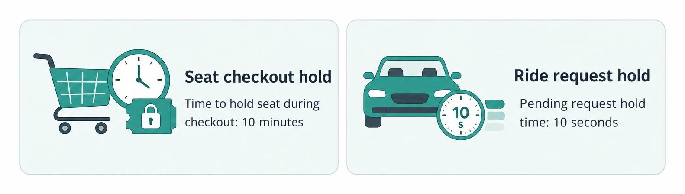

# Dealing with Contention

> **Quick Reference** for [DealingWithContention](../DealingWithContention.md) — condensed cheat-sheet.

## Recognition Signals

Concert tickets, auction items, flash-sale inventory, or drivers/riders have one winner.

Seats, payments, and meeting rooms need coordination to prevent duplicate claims.

Balances, inventory, and shared edits need consistency under simultaneous updates.

Across servers, simultaneous operations can change outcomes based on commit order.

## Selection Ladder

1

Default for most designs; predicate fits in WHERE so check and write are atomic.

2

App must read-decide-write; high contention favors blocking over repeated retries.

3

Same gap, but conflicts are rare; compare a changing row value and retry on conflict.

4

Invariant spans rows with no shared row; weaker row-level tools miss it.

5

Hold spans a wait, external call, or multiple steps; use a TTL lease or reservation.

## Isolation Levels

- **READ COMMITTED**: Sees only committed changes; default in PostgreSQL.
- **READ UNCOMMITTED**: Can see uncommitted changes from other transactions; rarely used.
- **REPEATABLE READ**: Repeated reads within a transaction stay consistent.
- **SERIALIZABLE**: Strongest isolation; catches write skew by aborting one transaction.

## Common Pitfalls

- **Zero-row writes**: Failed predicates or stale versions are not errors; check count and roll back before inserts.
- **Wrong guarded row**: A counter says a ticket exists; only the ticket row says seat A15 is free.
- **Locking too long**: Keep locks narrow and millisecond-long; keep slow payment API calls outside transactions.
- **Deadlocks**: Acquire locks in globally sorted order; retry the transaction the database aborts.
- **ABA problem**: Business values can go A to B to A; use a dedicated incrementing version.
- **Distributed lock overuse**: If one database transaction handles it, avoid Redis and extra failure modes.

## Distributed Locks

### Lease Stores

- **Redis with TTL**: SET NX plus TTL is fast and auto-expires; a stalled holder can overlap the next lease.
- **Database columns**: reserved_by and reserved_until claim row if free or expired; no new infrastructure.
- **ZooKeeper/etcd**: Strong consensus coordination with robust failure handling; operationally complex.

### TTL Examples

- **Seat checkout hold**: 10 minutes: held while the user enters payment details.
- **Ride request hold**: 10 seconds: stale pending_request reads as free.

## Interview Moves

For auctions, current high bid works as the concurrency check because bids only go up.

For Ticketmaster, reserve on selection rather than holding database row locks through checkout.

Single database uses locks or versions; spanning services or shards becomes distributed transactions.

For ride sharing, pending_request prevents simultaneous ride requests to one driver.

For flash sales, combine versioned inventory updates with temporary cart holds.

For one hot item needing strong consistency, one worker processes that resource's queue.

---
*Source: [https://www.hellointerview.com/learn/system-design/patterns/dealing-with-contention/quick-reference](https://www.hellointerview.com/learn/system-design/patterns/dealing-with-contention/quick-reference)*
