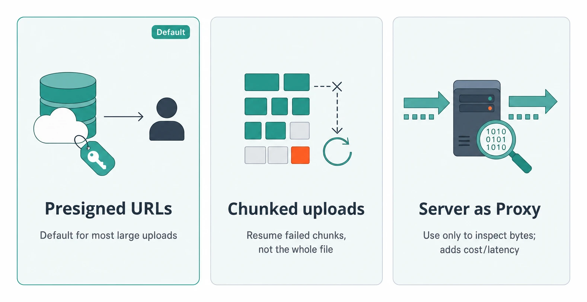
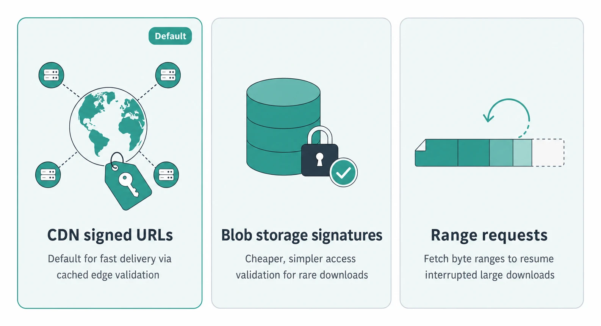
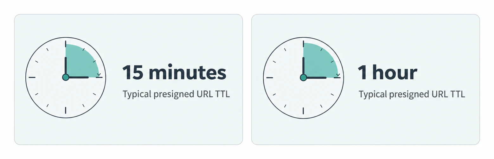
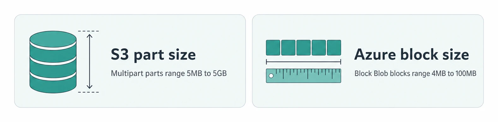
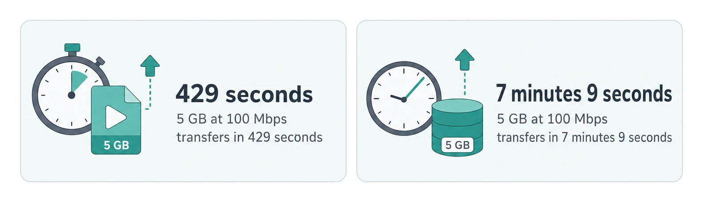
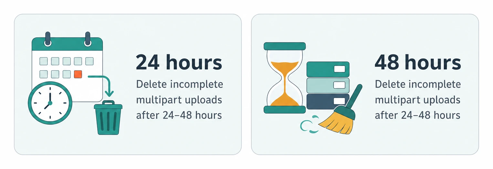
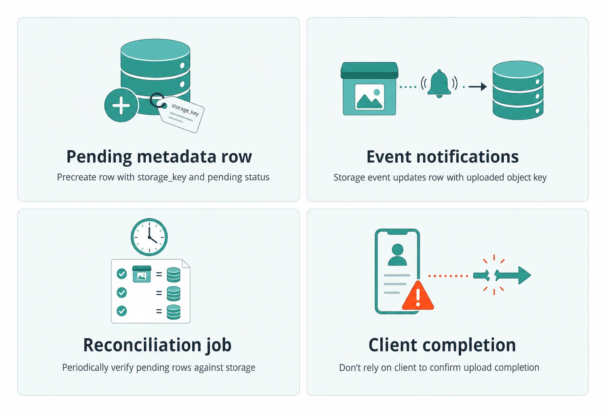
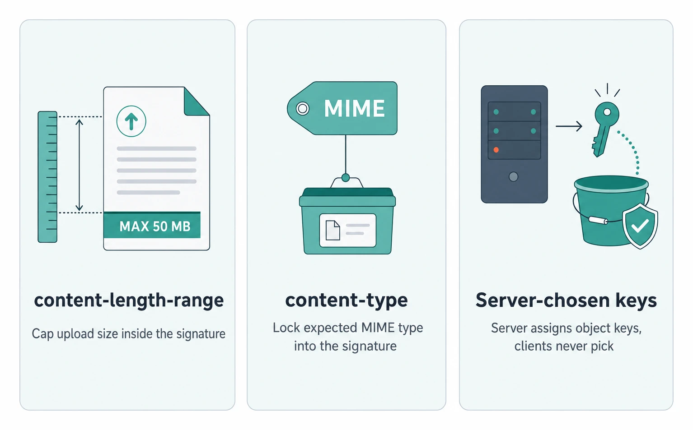
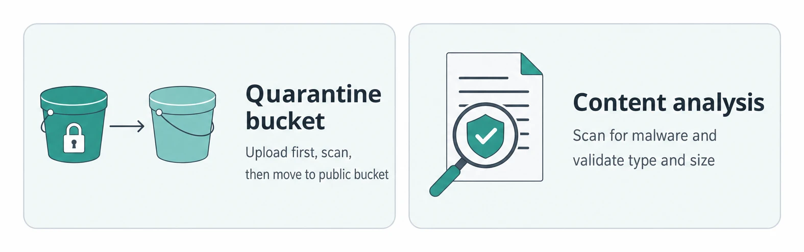

# Handling Large Blobs

> **Quick Reference** for [HandlingLargeBlobs](../HandlingLargeBlobs.md) — condensed cheat-sheet.

## Blob Decision

### Use When

Default trigger: direct storage access when moving files larger than 10MB through an API.

Video uploads, photo sharing, file sync, and chat media all fit this pattern.

### Avoid When

Under 10MB, normal API endpoints avoid the two-step URL flow.

Use servers when invalid bytes must be rejected before accepting the upload.

Use servers when data must pass through certified scanners before storage.

Avoid async upload-process-notify when users need immediate content feedback.

## Transfer Paths

### Upload Options

- **Presigned URLs**: Default for most large uploads; server validates auth, quotas, and signs scoped temporary access.
- **Chunked uploads**: Resume failed chunks instead of restarting a whole large file after network drops.
- **Server as Proxy**: Only when servers must inspect bytes; otherwise they add latency and cost.

### Download Options

- **CDN signed URLs**: Default for fast delivery; edge servers validate signatures and cache near users.
- **Blob storage signatures**: Simpler and cheaper for infrequent downloads; storage service validates access.
- **Range requests**: Request byte ranges so broken large downloads resume from missing pieces.

## Key Numbers

### Presigned URL TTL

- **15 minutes**: Typical presigned URL TTL.
- **1 hour**: Typical presigned URL TTL.

### Upload Size Limits

- **S3 part size**: Multipart Upload API parts are 5MB-5GB.
- **Azure block size**: Block Blob blocks are 4MB-100MB.

### Upload Transfer Time

- **429 seconds**: At 100 Mbps, a 5 GB video takes 429 seconds.
- **7 minutes 9 seconds**: At 100 Mbps, a 5 GB video takes 7 minutes 9 seconds.

### Incomplete Upload Cleanup Window

- **24 hours**: Delete incomplete multipart uploads after 24-48 hours.
- **48 hours**: Delete incomplete multipart uploads after 24-48 hours.

## State Sync

- **Pending metadata row**: Create it when signing, with storage_key and status 'pending' before the file exists.
- **Event notifications**: Primary sync path; storage publishes the uploaded object key to update the row.
- **Reconciliation job**: Safety net for delayed or lost events; checks pending rows against storage.
- **Client completion**: Do not trust it; clients can crash, lie, or fail before notifying your API.

## Abuse Controls

### Signature-Level Controls

- **content-length-range**: Bake max size into the signature so one URL cannot upload terabytes.
- **content-type**: Bake expected MIME type into the signature so image endpoints reject videos.
- **Server-chosen keys**: Never let clients choose storage keys; prevents overwrites and security issues.

### Post-Upload Inspection

- **Quarantine bucket**: Upload there first; scan before moving files to the public bucket.
- **Content analysis**: Run virus scans, file type validation, image recognition, and size checks.

## Provider Names

- **AWS**: Presigned URLs, Multipart Upload API, S3 Event Notifications, CloudFront, Lifecycle Rules.
- **Google Cloud**: Signed URLs, Resumable Uploads, Cloud Storage Pub/Sub, Cloud CDN, Lifecycle Management.
- **Azure**: SAS tokens, Block Blobs, Event Grid, Azure CDN, Lifecycle Management Policies.

---
*Source: [https://www.hellointerview.com/learn/system-design/patterns/large-blobs/quick-reference](https://www.hellointerview.com/learn/system-design/patterns/large-blobs/quick-reference)*
