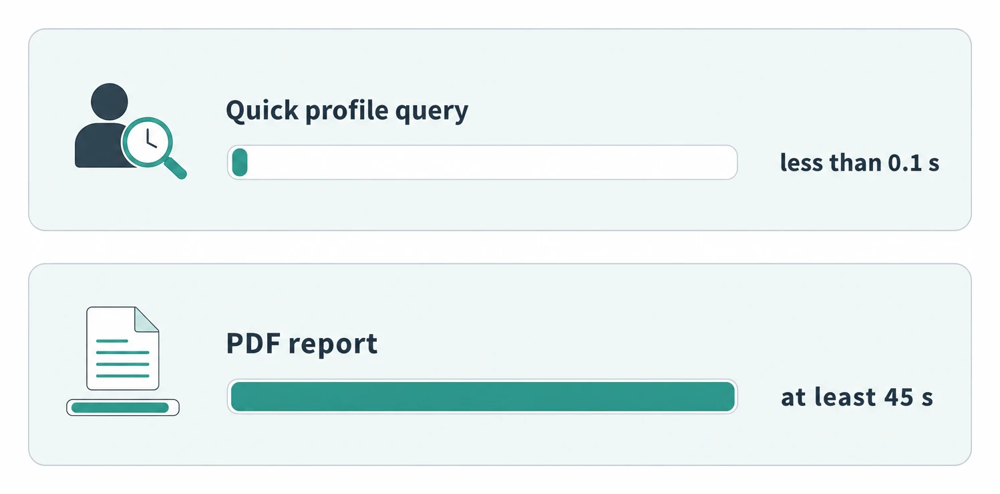
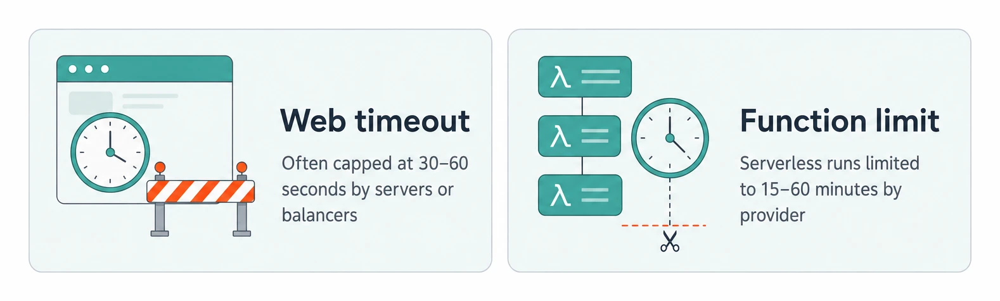

# Managing Long Running Tasks

> **Quick Reference** for [ManagingLongRunningTasks](../ManagingLongRunningTasks.md) — condensed cheat-sheet.

## Decision Triggers

Operations taking more than a few seconds should return a job ID and process async.

Simple request/response flows do not need queue, worker, and status-tracking overhead.

Video transcoding, image processing, PDFs, bulk emails, CSV imports, and exports fit.

Multiply job volume by per-job processing time before assigning work to web servers.

Run GPU, CPU-heavy, or memory-heavy work on worker fleets, not the web tier.

Queues, workers, job states, retries, and monitoring replace simple request/response.

## Request Flow

1

Web server validates the request and stores a job record with status pending.

2

Push only the job ID to the queue; keep full job data in the database.

3

Client gets the job ID right away instead of waiting for the work to finish.

4

Worker pulls the message, fetches details, and updates status to processing.

5

Worker writes files to S3 or metadata to the database after doing the work.

6

Worker updates the job to completed or failed for status checks and notifications.

## Core Components

### Queue Choice

![Kafka is the default interview pick unless constraints apply, with replay, fan-out, retention, huge volume, and partition ordering. Redis with Bull or BullMQ is startup-friendly with retries, delayed jobs, and priorities, but has memory-first durability tradeoffs. AWS SQS is managed and scalable with guaranteed delivery, but its 1 MB limit means passing IDs instead of full job data. RabbitMQ supports complex routing and enterprise workflows, but self-hosting adds cluster, upgrade, and disk monitoring work.](assets/aa3cd63cf82688fa-03e770112359060f.png)

- **Kafka**: Default interview pick unless constrained; replay, fan-out, retention, huge volume, partition ordering.
- **Redis with Bull/BullMQ**: Startup-friendly retries, delayed jobs, and priorities; memory-first durability tradeoff.
- **AWS SQS**: Managed scaling and delivery; 1 MB message limit means pass IDs, not full job data.
- **RabbitMQ**: Complex routing and enterprise workflows; self-hosting adds cluster, upgrade, disk monitoring.

### Worker Runtime

- **Normal servers**: Default for interviews; full control, easy debugging, and support for long jobs.
- **Serverless functions**: Autoscale and pay per execution; constraints include cold starts and minimal local storage.
- **Container-based workers**: Kubernetes or ECS middle ground; more complex than servers, more flexible than serverless.

## Key Time Numbers

### Job Latency Reference

Simple synchronous profile fetch takes less than 0.1 seconds.

Example annual report generation takes at least 45 seconds.

### Platform Timeout Constraints

- **Web timeout**: Web servers and load balancers often enforce 30-60 second limits.
- **Function limit**: Serverless executions are limited to 15-60 minutes, depending on provider.

### Operational Tuning Values

10-30 seconds is a good starting point for most systems.

Move to a Dead Letter Queue after 3-5 attempts for investigation.

## Pitfalls and Fixes

- **Worker crash**: Use heartbeats; queue retries the job when the worker stops checking in.
- **Duplicate work**: Use idempotency keys; return the existing job ID for the same operation.
- **Queue overload**: Set queue depth limits; reject with system busy instead of accepting doomed work.
- **Mixed workloads**: Separate fast and slow queues to prevent long jobs from blocking short jobs.
- **Job dependencies**: Chain simple steps; use Step Functions, Temporal, or Airflow for complex workflows.

---
*Source: [https://www.hellointerview.com/learn/system-design/patterns/long-running-tasks/quick-reference](https://www.hellointerview.com/learn/system-design/patterns/long-running-tasks/quick-reference)*
