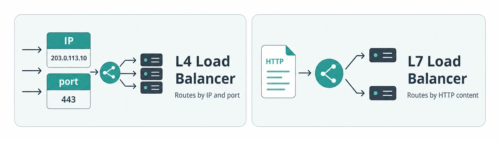
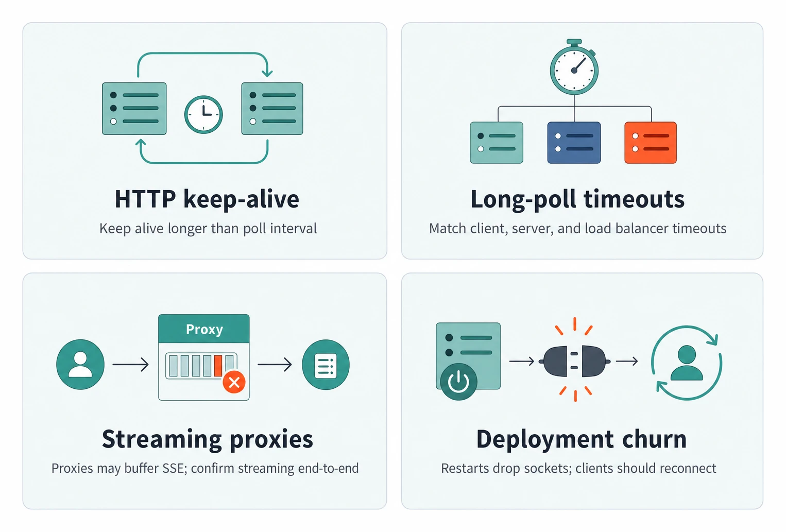
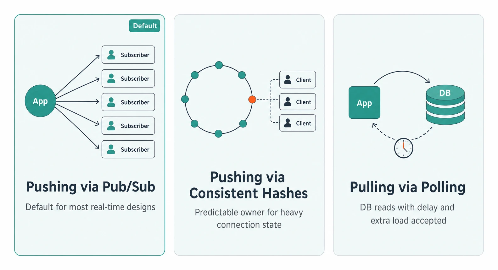
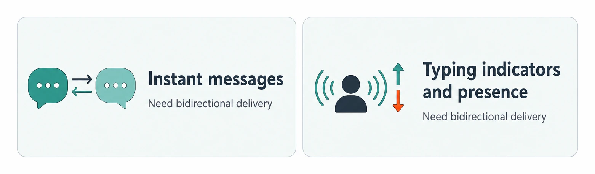
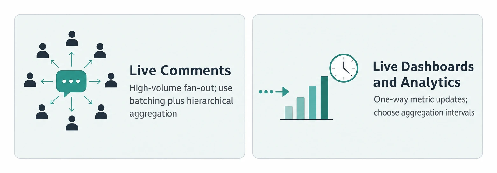
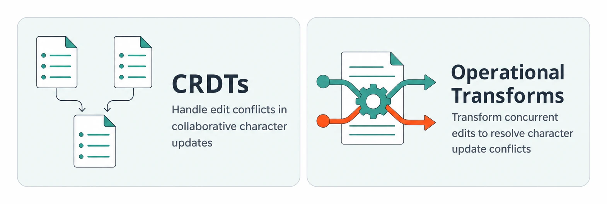
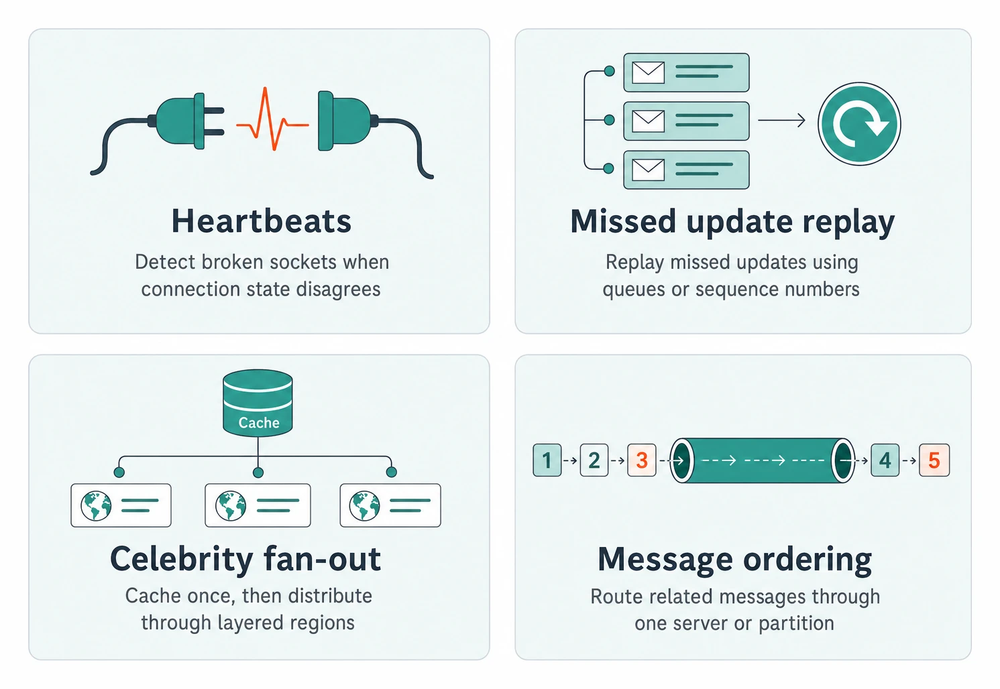

# Real-time Updates

> **Quick Reference** for [Real-TimeUpdates](../Real-TimeUpdates.md) — condensed cheat-sheet.

## First Hop

### Client Protocols

- **Simple Polling**: Default unless low latency is required; stateless HTTP, delayed by the polling interval.
- **Long Polling**: Held HTTP request gives near real-time for infrequent updates, but bursts add callback latency.
- **Server-Sent Events (SSE)**: One-way HTTP stream; efficient for server push when clients rarely write back.
- **WebSockets**: Full-duplex persistent channel for high-frequency reads and writes; adds stateful infra.
- **WebRTC**: Peer-to-peer for audio/video or server-load reduction; requires signaling, STUN, and TURN.

### Load Balancers

- **L4 Load Balancer**: Routes by IP and port, preserves TCP sessions, and fits persistent connections.
- **L7 Load Balancer**: Terminates connections and routes by HTTP content; better for HTTP traffic.

### Connection Pitfalls

- **HTTP keep-alive**: Set it longer than the polling interval to avoid repeated TCP setup and teardown.
- **Long-poll timeouts**: Align client, server, and load balancer timeouts so long requests are not cut off.
- **Streaming proxies**: Some proxies buffer SSE responses; verify streaming support across every hop.
- **Deployment churn**: Server restarts sever persistent sockets; expect clients to reconnect rather than transfer sockets.

## Second Hop

### Trigger Models

- **Pushing via Pub/Sub**: Default for most real-time designs; endpoints subscribe and forward lightweight updates.
- **Pushing via Consistent Hashes**: Predictable owner for heavy connection state; needs Zookeeper or etcd routing metadata.
- **Pulling via Polling**: DB-backed reads decouple producers and clients; accepts delay and extra DB load.

### Scaling Assignment

1

Signal scaling start and keep both old and new server mappings.

2

Reconnect clients to new owners while sending updates to both old and new servers.

3

Signal completion and update the coordination service with new assignments.

## Key Numbers

2-5 second updates may be acceptable when true real-time is not required.

With 100ms latency and updates 10ms apart, the second update can arrive up to 290ms late.

15-30s is a common polling interval that avoids load balancer timeout fuss.

1M clients polling every 10s creates 100k TPS of read volume.

The extra indirection has minimal latency impact, under 10ms.

## Interview Scenarios

### Bidirectional Delivery Scenarios

- **Instant messages**: Need bidirectional delivery.
- **Typing indicators and presence**: Need bidirectional delivery.

### High-Volume Fan-Out Scenarios

- **Live Comments**: High-volume fan-out during live events; use batching and hierarchical aggregation.
- **Live Dashboards and Analytics**: One-way metric updates; decide aggregation intervals and real-time enough.

### Consistency and Conflict Scenarios

- **CRDTs**: Conflict handling for collaborative document editing character updates.
- **Operational Transforms**: Conflict handling for collaborative document editing character updates.

## Deep Dive Fixes

- **Heartbeats**: Detect broken sockets where client and server disagree on connection state.
- **Missed update replay**: Use per-user queues or sequence numbers; Redis streams are a popular option.
- **Celebrity fan-out**: Cache once, then distribute through regional or hierarchical layers.
- **Message ordering**: For product designs, send related messages through one server or partition.

---
*Source: [https://www.hellointerview.com/learn/system-design/patterns/realtime-updates/quick-reference](https://www.hellointerview.com/learn/system-design/patterns/realtime-updates/quick-reference)*
