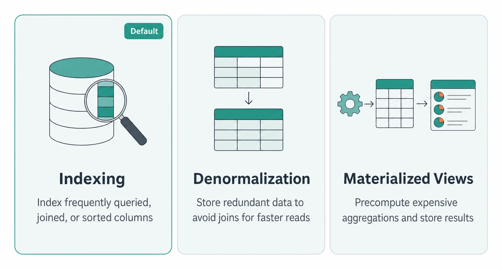
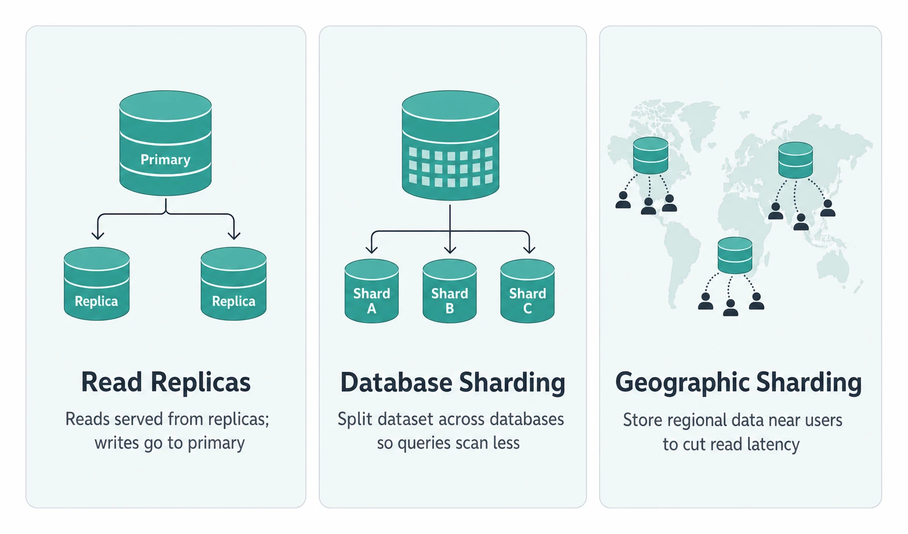
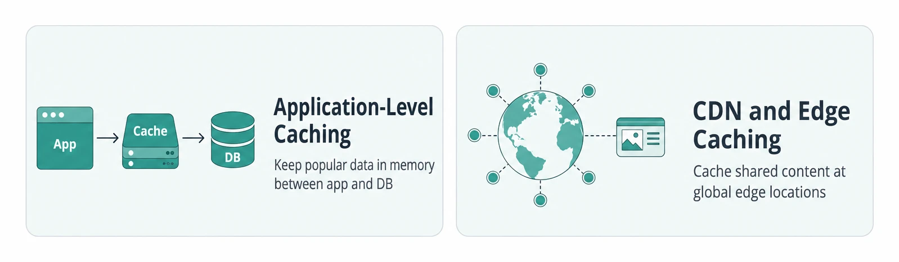
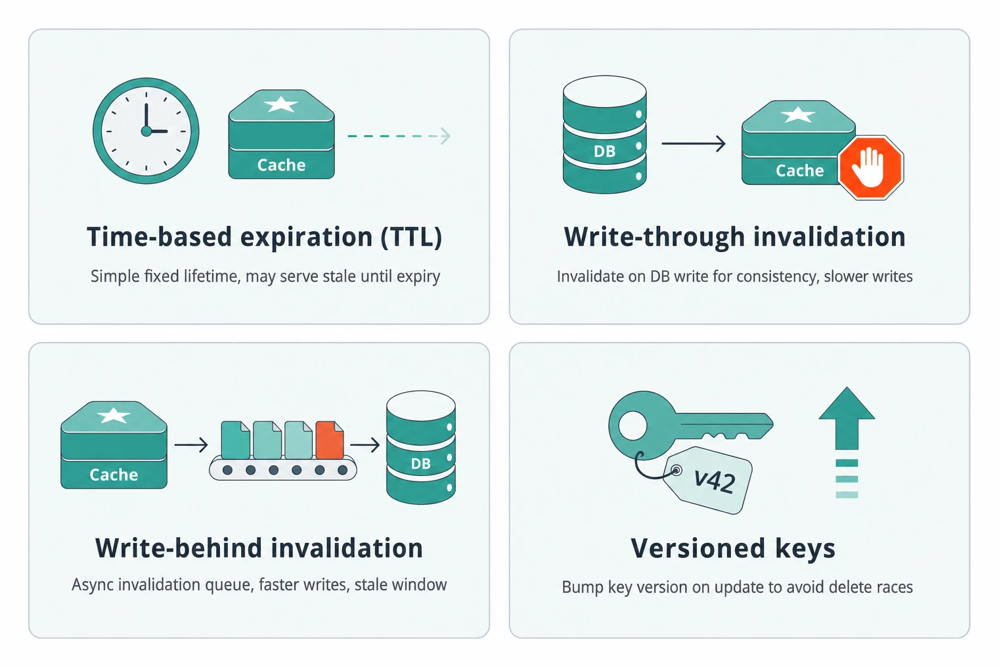
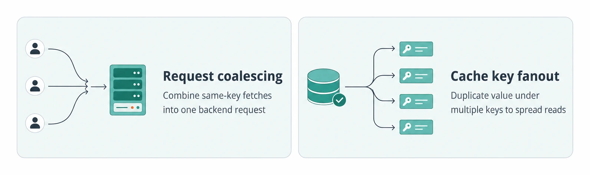
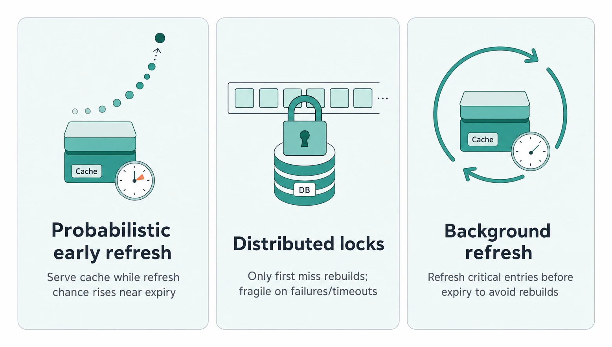
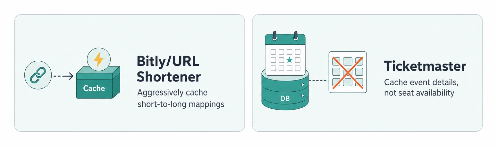

# Scaling Reads

> **Quick Reference** for [ScalingReads](../ScalingReads.md) — condensed cheat-sheet.

## Read Scaling Decisions

### When To Apply

High-volume external endpoints where many users repeatedly read the same data.

Write-heavy 2:1 or 1:1 workloads and 1000-user apps do not need complex read scaling.

Financial, inventory, and real-time collaboration may reject stale cached reads.

### Scaling Progression

1

Add indexes, tune data model, and denormalize before adding infrastructure.

2

Add read replicas or shard when one database server hits limits.

3

Use application caches or CDNs when repeated reads dominate.

## Key Numbers

Standard starts at 10:1; content-heavy apps often reach 100:1+.

Consider replicas/cache above 50,000-100,000 read requests per second.

Cache hits are sub-millisecond versus tens of milliseconds for DB queries.

Tokyo edge example cuts Virginia round trip from 200ms to under 10ms.

Short TTLs of 5-15 minutes often pair with active invalidation.

## Database Optimization

- **Indexing**: Default first move; index columns frequently queried, joined, or sorted.
- **Denormalization**: Store redundant data to avoid joins; faster reads, more complex writes.
- **Materialized Views**: Precompute expensive aggregations in background and store the results.

## Horizontal Scaling

- **Read Replicas**: Writes go to primary and reads to replicas; distributes load but can lag.
- **Database Sharding**: Split large datasets across databases so each query scans less data.
- **Geographic Sharding**: Store regional data near users to reduce global read latency and load.

## Cache Strategy

### Cache Layers

- **Application-Level Caching**: Redis or Memcached between app and DB; popular data stays in memory.
- **CDN and Edge Caching**: Cache shared content at global edge locations; skip user-specific data.

### Invalidation Choices

- **Time-based expiration (TTL)**: Fixed lifetime; simple, but stale data may serve until expiration.
- **Write-through invalidation**: Update or delete cache on DB write; consistent but adds write latency.
- **Write-behind invalidation**: Queue invalidations asynchronously; lowers write latency but opens a stale window.
- **Versioned keys**: Change key version on update; avoids delete races but needs version tracking.

## Failure Modes

### Hot Key Fixes

- **Request coalescing**: Combine same-key fetches; backend gets one request per app server.
- **Cache key fanout**: Store identical copies under multiple keys; spreads one hot key across caches.

### Stampede Fixes

- **Probabilistic early refresh**: Smarter than locks; refresh chance rises near expiry while serving cached data.
- **Distributed locks**: Only first miss rebuilds; fragile if rebuild fails or waiters time out.
- **Background refresh**: Continuously refresh critical entries before expiration so users never rebuild.

## Interview Scenarios

- **Bitly/URL Shortener**: Cache short-to-long mappings aggressively; URLs do not change.
- **Ticketmaster**: Cache event details, not seat availability; use replicas for browsing.

---
*Source: [https://www.hellointerview.com/learn/system-design/patterns/scaling-reads/quick-reference](https://www.hellointerview.com/learn/system-design/patterns/scaling-reads/quick-reference)*
