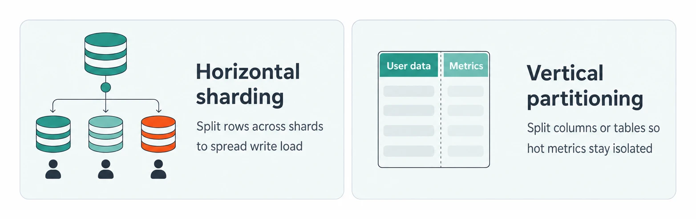
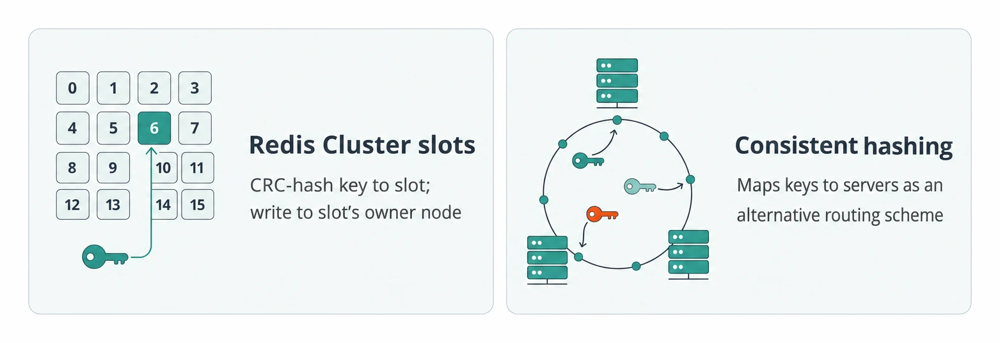
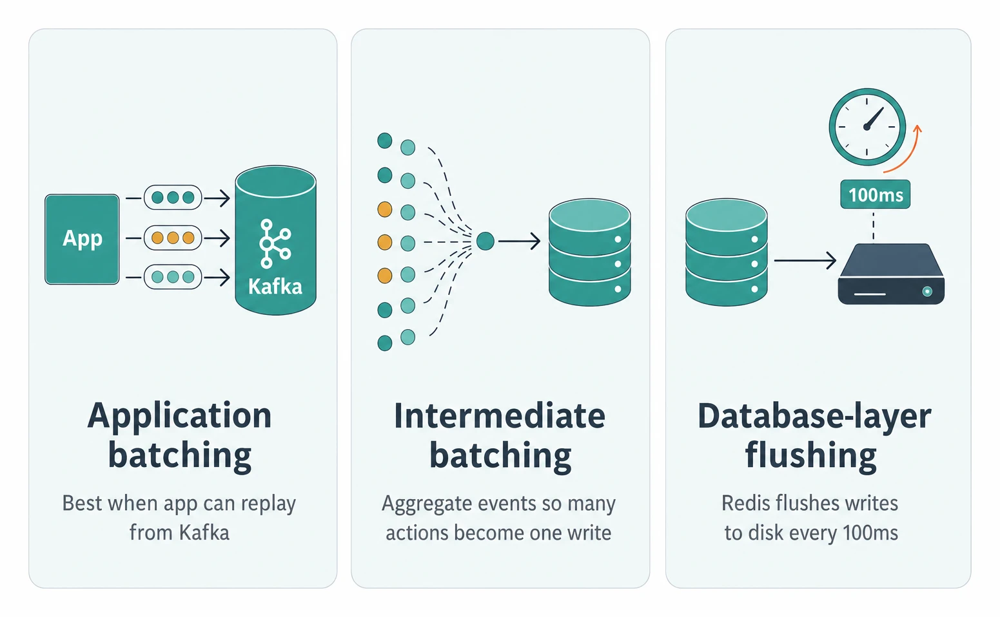
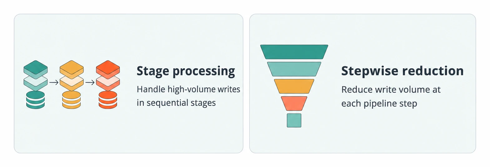
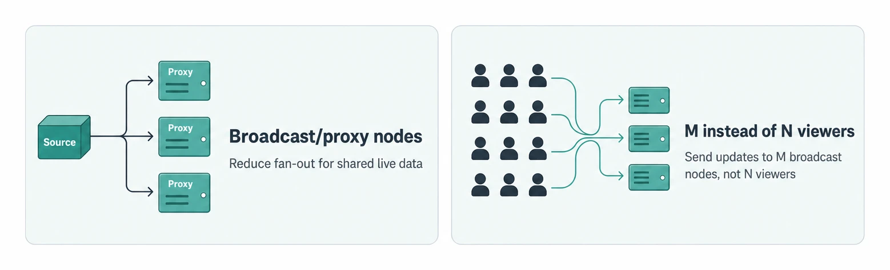
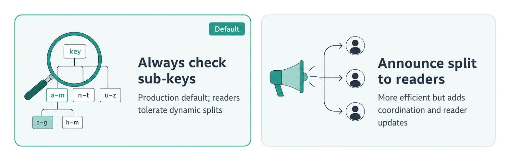

# Scaling Writes

> **Quick Reference** for [ScalingWrites](../ScalingWrites.md) — condensed cheat-sheet.

## First Moves

### Vertical Scaling

- **Vertical scaling**: Default first step; 200 CPU cores and 10gigabit network interfaces are not uncommon.
- **Estimate write throughput**: Use back-of-the-envelope math before adding write-scaling complexity.
- **Find the bottleneck**: Confirm disk I/O, CPU, or network bandwidth is the actual limit.
- **Avoid premature scaling**: If hardware or tuning handles the load, do not add sharding, queues, or batching.

### Write-Optimized Engine Choice

- **Write-optimized database**: Choose append-only, time-series, log-structured, or column stores when writes dominate reads.
- **Cassandra append-only**: 10,000+ writes per second via append-only commit log.
- **Traditional relational**: Maybe 1,000 writes per second for the same work with in-place updates.

### Database Tuning

Reduce indexes, triggers, and constraints for write-heavy periods.

Tune write-ahead logging for write-heavy periods.

## Partitioning

### Split Direction

- **Horizontal sharding**: Splits rows across shards so each server handles a manageable write slice.
- **Vertical partitioning**: Splits columns or tables by access pattern so hot metrics do not interfere with content.

### Key Choice

Often the best key for flat write distribution across shards.

Avoid keys like country that overload popular shards and waste sparse ones.

Ask how many shards each common request must hit and how often it happens.

### Shard Routing

- **Redis Cluster slots**: Hashes each key with CRC to a slot, then clients write to the node owning that slot.
- **Consistent hashing**: Alternative scheme for mapping keys to servers; know it for interviewer probes.

## Bursts

A 4x peak means off-peak load can only use 25% of capacity without buffering.

Buffer writes when delayed processing and inconsistent reads are acceptable.

Queues require async processing and clients may need to verify completion later.

Drop less important writes, like stale locations or impressions, before system failure.

Scaling takes time; databases may have downtime or reduced throughput while scaling.

## Write Reduction

### Batching Layer

- **Application batching**: Works well when the app is not the source of truth and can replay from Kafka.
- **Intermediate batching**: Aggregate events before DB writes; 100 likes in 1 minute can become 1 write.
- **Database-layer flushing**: Big-hammer option; Redis defaults to flushing writes to disk every 100ms.

### Pipeline Aggregation

- **Stage processing**: Processes high-volume data in stages.
- **Stepwise reduction**: Reduce volume at each step.

### Fan-Out Reduction

- **Broadcast/proxy nodes**: Reduce fan-out for shared live data.
- **M instead of N viewers**: Send shared live-comment updates to M broadcast nodes instead of N viewers.

## Hot Keys

### Split Strategy

- **Split all keys**: Fixed k sub-keys reduce per-shard writes by k but increase dataset and reads by k.
- **Split hot keys dynamically**: Use 100 sub-keys, each handling 1,000 likes per second, for a 100,000 likes/sec tweet.
- **Aggregatable metrics only**: Works for likes, views, counts, balances; not atomic data like user profiles.

### Reader Agreement

- **Always check sub-keys**: Default in production; readers find dynamic splits without announcements.
- **Announce split to readers**: More efficient but complex; readers must learn the split before writers execute it.

---
*Source: [https://www.hellointerview.com/learn/system-design/patterns/scaling-writes/quick-reference](https://www.hellointerview.com/learn/system-design/patterns/scaling-writes/quick-reference)*
