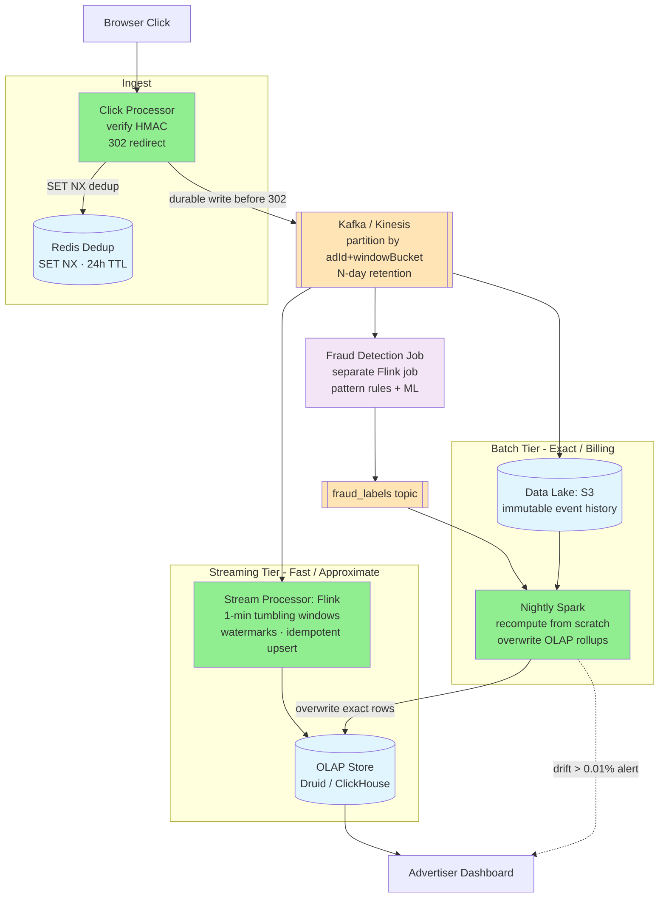
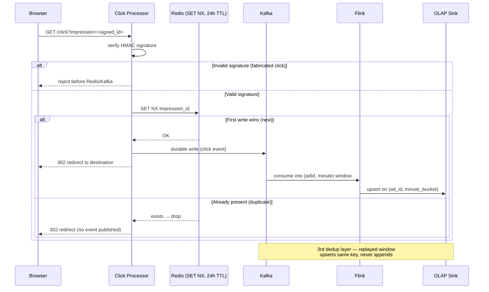
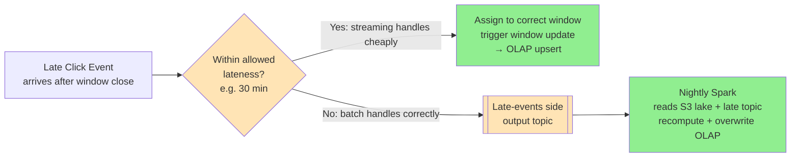
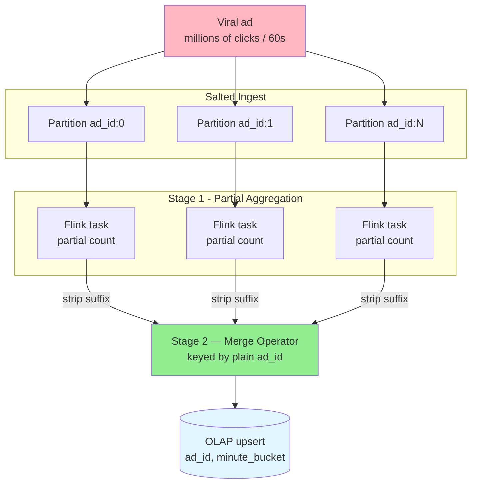
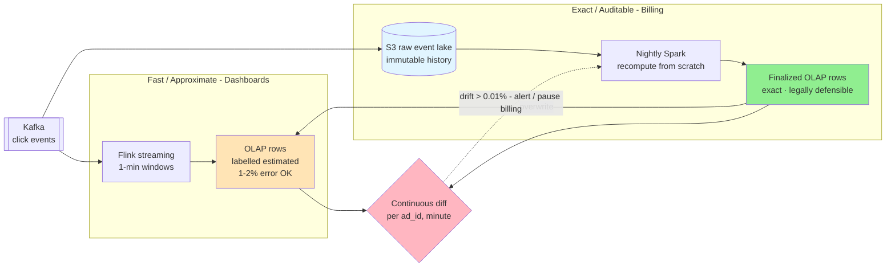

# 📊 Design Ad Click Aggregator

> **Pattern**: Stream Aggregation / Exactly-Once
> **Difficulty**: Hard
> **Source**: [hellointerview.com](https://www.hellointerview.com/learn/system-design/problem-breakdowns/ad-click-aggregator)

> **Summary**: An ad click aggregator straddles two opposed workloads — a write-heavy ingest firehose (~10K clicks/sec, ~100M/day) and a read-heavy analytics tier (advertisers refreshing dashboards). Both sides touch money, so clicks can be neither lost nor double-counted, yet dashboards must feel live. The mature design lands clicks in Kafka behind an HMAC + Redis `SET NX` dedup gate, aggregates them in Flink 1-minute tumbling windows into an OLAP store for fast "estimated" reads, and reconciles nightly with Spark over the S3 event lake to produce the exact, audit-proof numbers that billing actually charges against.

## 📋 Table of Contents
1. [Understanding the Problem](#understanding-the-problem)
2. [Layman's Explanation](#laymans-explanation)
3. [Core Entities](#core-entities)
4. [API Design](#api-design)
5. [High-Level Design](#high-level-design)
6. [Deep Dives](#deep-dives)
7. [Scaling Journey: 0 to Infinity](#scaling-journey-0-to-infinity)
8. [Insider Tips and Tricks](#insider-tips-and-tricks)
9. [Expected Depth by Level](#expected-depth-by-level)
10. [Related Concepts](#related-concepts)

---

## 🎯 Understanding the Problem

An ad click aggregator sits at the intersection of two very different workloads: a massive write-heavy ingest pipeline (every click on every ad on every page) and a read-heavy analytics pipeline (advertisers continually refreshing dashboards to watch campaign performance). The interesting tension in the problem is that both sides care about money: advertisers pay per click, so clicks cannot be lost or double-counted, yet the dashboards must feel live.

### Functional Requirements

- When a user clicks on an ad, the click is recorded and the user is redirected to the advertiser's destination URL.
- Advertisers can query aggregated click metrics for their ads at minute-level granularity (counts over arbitrary time ranges, grouped by ad, campaign, or advertiser).
- Metrics should become visible in near real time, not hours after the fact.

**Out of scope:** ad serving, ad targeting, demographic profiles, conversion tracking, cross-device identity, offline attribution.

### Non-Functional Requirements

- Scale: around 10K clicks/second at peak, roughly 100M clicks/day.
- Accuracy: no lost clicks, no double-counted clicks. Billing data must ultimately be exact.
- Freshness: advertiser dashboards should see clicks within roughly a minute.
- Query latency: sub-second response for typical dashboard queries.
- Resilience to duplicates, retries, malicious click injection, and late-arriving events.
- Fault tolerance: a broker, worker, or AZ failure should not drop or duplicate events.

---

## 🧒 Layman's Explanation

Picture a **bake sale tally counter**. Every brownie a customer buys is one click of the metal counter on the table. At the end of the day, the baker hears "247 brownies sold" and knows exactly how much to deposit. Now imagine a million bake sales happening simultaneously across every neighborhood on Earth, all sending their counts to a single ledger that has to add up perfectly because someone is paying real money per brownie. That is an ad click aggregator.

Now think about **election night vote counting**. Precincts tally their own ballots, then pass totals up to the county, the county forwards to the state, and the state feeds the news networks. Each level aggregates and projects rather than reaching down to raw ballots. Click systems work the same way: raw events get rolled into minute buckets, minutes into hours, hours into days, so a dashboard query never has to scan billions of individual clicks.

A **fitness tracker counting steps** captures the third instinct. It does not ping the cloud once per footfall — your battery would die before lunch. Instead it counts locally and uploads in batches every few minutes. Click pipelines do the equivalent: events flow into Kafka, get grouped into 1-minute windows, and only then get aggregated downstream.

The genuinely hard parts:

- **Massive write volume** — billions of clicks per day; you cannot write each one directly to a database, so clicks land in Kafka first and a batch aggregator drains the queue.
- **Real-time vs batch** — advertisers want both last-5-minutes and last-quarter, which forces two storage strategies running side by side.
- **Idempotency** — network retries cannot double-count, so each click carries a unique ID that the aggregator deduplicates against.
- **Fraud detection** — bots click ads to drain budgets, so suspicious traffic must be filtered before billing.
- **Late-arriving data** — a phone in airplane mode comes back with 50 saved clicks, and the system has to backfill them into the right time window instead of silently dropping them.

### When the analogy breaks down

Real ad systems reconcile **billions of dollars of revenue** down to legally defensible, audit-proof numbers. They handle **multi-device attribution** — you see the ad on your phone, buy the product on your laptop, and someone has to stitch those journeys together. They face **adversaries actively gaming clicks for profit**, not just accidental double-counts. And they have to power **instant dashboards** for advertisers who refresh every few seconds during a campaign launch. A bake sale counter never had to survive a Super Bowl ad, a botnet, and an SEC audit simultaneously.

---

## 🔑 Core Entities

| Entity | Key Fields | Notes |
|--------|-----------|-------|
| **Ad** | `ad_id`, `campaign_id`, `advertiser_id`, `destination_url`, `bid`, `budget` | Metadata only; rarely changes. |
| **Impression** | `impression_id`, `ad_id`, `user_id`, `shown_at`, `placement` | Generated every time the ad is rendered. The impression ID is the natural dedup key. |
| **Click Event** | `click_id`, `impression_id`, `ad_id`, `user_id`, `ts`, `ip`, `ua` | Raw, append-only fact. This is what the system ingests. |
| **Aggregate Metric** | `ad_id`, `minute_bucket`, `click_count`, `unique_users` | Pre-computed row in the OLAP store; the unit of truth for the dashboard. |

The impression is what makes click tracking tractable. Every render produces a fresh impression ID that is signed before being handed to the browser; that ID is what arrives when a user clicks, so duplicates caused by retries or replay attacks can be detected without relying on identity.

---

## 🔌 API Design

### Click ingest

```
GET /click?impression=<signed_impression_id>
  -> 302 Redirect to advertiser destination
```

The request is intentionally a `GET` so the browser can follow the redirect without custom client code. The payload is the signed impression ID, verified server-side with an HMAC secret. The click processor never blocks the redirect on a durable write; it pushes to the stream, caches the impression ID, and returns the 302. Critically, the HTTP 200 (or 302) is only returned after the event is durably written to Kafka — if Kafka is unavailable, the click service writes to a local WAL and retries rather than acknowledging an event it has not persisted.

### Metrics query

```
GET /ads/{ad_id}/metrics?from=<ts>&to=<ts>&granularity=minute|hour|day
  -> { buckets: [ { ts, clicks, unique_users } ] }
```

Optional variants roll up by `campaign_id` or `advertiser_id`. All reads hit the pre-aggregated OLAP store, never the raw event stream. Dashboard responses carry an `"estimated": true` flag until the nightly batch reconciliation has run and finalized the numbers for the queried period.

---

## 🏗️ High-Level Design



The ingest side is tuned for never losing a click: the stream is the source of truth, Redis only exists to drop near-duplicates, and the OLAP store is a materialized view that can always be rebuilt from the lake. The query side is deliberately boring: serve pre-aggregated minute rows out of an OLAP engine that already handles time-series scans efficiently. Billing always uses the batch-reconciled exact tier, never the streaming approximate tier.

---

## 🔬 Deep Dives

### 1. Exactly-Once vs At-Least-Once and Why "Exactly-Once" Is a Misnomer

True end-to-end exactly-once across a message broker and a downstream store requires two-phase commit between those two systems — prohibitively expensive at scale. What production systems actually implement is effectively-once: at-least-once delivery combined with idempotent processing, so any duplicate that slips through is absorbed without affecting the final count.

Kafka provides at-least-once by default: consumer offsets are committed after processing, but a crash between processing and committing causes re-delivery of the same message on restart. The idempotency key on the consumer side is `(clickId, windowStart)`. Processing the same click twice yields the same result as processing it once, because the OLAP sink performs an upsert keyed on `(ad_id, minute_bucket)` rather than an append. Flink's checkpointing advances the offset only after the sink confirms the upsert, giving a clear recovery point. For ad billing, this is stronger than the "exactly-once" label implies: even if Flink replays a window from a checkpoint, the sink rejects the duplicate write.

The dedup window at the Redis layer is intentionally bounded to 24 hours. Storing impression IDs indefinitely is impractical (unbounded storage growth). A 24-hour window covers the vast majority of retries — network timeouts retry within seconds, not days. The risk is a message that arrives exactly 24 hours late being double-counted; this is accepted as an explicit SLA: "deduplication guaranteed within 24 hours." At 100M impressions/day with a 24-hour TTL and roughly 20 bytes per key, Redis footprint is on the order of 2 GB — well within a single shard.

### 2. Idempotency via Signed Impression IDs

The dedup key is generated upstream of the click, at render time. The ad placement service issues a fresh `impression_id` per render, signs it with an HMAC secret, and embeds the signed token in the click URL. The click processor verifies the signature (blocking fake click injection), then checks a distributed Redis set for the impression ID with `SET NX` and a 24-hour TTL. First write wins: if new, publish to the stream and cache the ID; if already present, drop.

This stays correct across retries at any layer, including browser reload, CDN replays, or ingest-side retries. The HMAC verification gates entry to the pipeline, so a flood of fabricated click URLs is rejected before touching Redis or Kafka. The combination — HMAC at the edge, `SET NX` in Redis, upsert in the OLAP sink — provides three independent layers of deduplication, each addressing a different failure mode.



### 3. Stream Processing, Windowing, and Time Bucketing

Flink reads the Kafka topic and applies a tumbling 1-minute window, emitting `(ad_id, minute, count, unique_users)` rows into the OLAP store. Bucketing events into fixed tumbling windows is not just a convenience: it means all aggregation state for a given bucket can be flushed simultaneously when the window closes. Without bucketing, maintaining a sliding count over arbitrary time ranges requires O(events) state per query. With fixed-width buckets: O(window_count) state, which is O(1) for a fixed retention period. The aggregation key is `(adId, windowStartMinute)`.

Unique-user counting uses HyperLogLog sketches inside each window to keep state bounded (~12 KB per window per ad regardless of distinct user count). Sketches can be merged across windows for longer granularities without reprocessing raw events. The sink uses an upsert keyed on `(ad_id, minute_bucket)` so window replays overwrite rather than duplicate.

Watermarks control when a window is considered closed and drive the late-data tolerance mechanism described in Deep Dive 4.

### 4. Late-Arriving Events and Watermarks

A mobile client clicks an ad, goes offline, comes back 10 minutes later, and sends the click event. Without late event handling, this event arrives after the 1-minute window it belongs to has been finalized and flushed — the click is silently dropped and the advertiser is undercharged.

The system uses two complementary mechanisms:

- **Bounded allowed-lateness on Flink windows.** Watermarks advance event time based on observed event timestamps. A configurable tolerance (e.g., 30 minutes) keeps windows open past their nominal close time. Events within the tolerance are assigned to their correct window and trigger a window update to the OLAP sink. This handles the majority of mobile retries and flaky-network cases.
- **Late-arrival side output.** Events arriving beyond the allowed-lateness tolerance are not dropped — they are routed to a "late events" side output topic. The nightly Spark batch job reads this topic alongside the main S3 event lake and includes late events in its recomputation. The nightly job's output overwrites the OLAP rows, so even clicks that were weeks late end up in the correct billing period once the batch runs.



The key insight: the streaming layer handles the common case cheaply; the batch layer handles the tail case correctly. Neither layer needs to handle both.

### 5. Hot Advertisers and Hot Partitions

Partitioning Kafka by `ad_id` alone is simple but catastrophic when a single ad goes viral — a Super Bowl campaign can produce millions of clicks in 60 seconds, all routing to one partition and one Flink task. Two defenses:

- **Composite partition key.** Partition by `(advertiserId, windowBucket)` or by `adId` (individual ad ID, which is more granular than advertiser ID) to distribute load. For ultra-high-volume ads, add random salting: rewrite the Kafka key as `ad_id:<0..N>` where N is chosen per ad based on recent traffic volume. The stream processor strips the suffix before aggregation.
- **Two-stage aggregation.** Pre-aggregate within each salted partition (stage 1), then merge partial counts in a second Flink operator keyed by plain `ad_id` (stage 2). This keeps per-task state small on hot keys and prevents a single partition from stalling the entire job's watermark progress.



OLAP-side hotspots are handled by sharding on `advertiser_id` rather than `ad_id`, which naturally distributes load since a single advertiser runs many ads with different popularity profiles. The metrics API layer fans out queries across shards and merges results.

For the top N advertisers by traffic, dedicated Flink job graphs and dedicated OLAP shards provide hard tenant isolation — a Super Bowl campaign cannot starve smaller clients.

### 6. Two Pipelines: Fast-Approximate for Dashboards, Exact for Billing

This is one of the most important architectural decisions in the design, and one that is frequently collapsed into a single pipeline by candidates who then cannot explain how billing can be "exact."

The streaming pipeline (Kafka + Flink) is optimized for freshness, not exactness. It can have bugs, consumer lag, duplicate processing from checkpoint replay, or missed events during a bad deploy. Its output is labelled "estimated" and is appropriate for real-time dashboards where a 1-2% error is invisible and acceptable.

The batch reconciliation pipeline (Spark on raw event logs in S3, running nightly) reads the complete, immutable event history, recomputes all aggregates from scratch, and overwrites the streaming pipeline's outputs in the OLAP store. This pipeline's output is exact, auditable, and legally defensible for billing. Never bill from the streaming pipeline.



Discrepancies between the two layers are a monitoring signal. A continuous diff job compares streaming counts to batch counts for each `(ad_id, minute_bucket)`. Discrepancies above 0.01% trigger alerts and can pause billing exports before incorrect invoices go out. This is not redundant work — it is the audit trail that catches silent streaming bugs before they compound.

### 7. Click Fraud Detection as a Separate Pipeline

Fraud signals — same IP clicking the same ad 100 times in 1 minute, impossible geographic velocity, bot user-agent patterns — must be detected and labeled before fraudulent clicks reach billing counts. This cannot be merged into the aggregation pipeline without coupling two very different computational concerns: aggregation is stateless per window, while fraud detection requires cross-window state and ML model inference.

The fraud detection pipeline is a separate Flink job reading from the same Kafka topic. It applies pattern rules (velocity checks, IP reputation lookups) and optionally ML model scoring, and emits fraud labels to a separate `fraud_labels` topic. The nightly Spark reconciliation job joins raw events against fraud labels, excluding fraudulent clicks from billing counts. This means fraudulent clicks may appear in the real-time dashboard briefly but are excluded from the final billing figures — an acceptable tradeoff.

> ⚠️ **Fraud filtering lives in the batch tier, not the stream.** Fraudulent clicks can transiently inflate the "estimated" dashboard number, but they are stripped during nightly reconciliation before any invoice is generated. Merging fraud detection into the aggregation pipeline would couple stateless per-window aggregation with cross-window state and ML inference — two very different computational concerns.

---

## 📈 Scaling Journey: 0 to Infinity

```mermaid
graph LR
    S1["Stage 1<br/>0–100 clicks/s<br/>Postgres INSERT<br/>SELECT GROUP BY"]
    S2["Stage 2<br/>100–1K<br/>Async queue + batch<br/>read replica + rollups"]
    S3["Stage 3<br/>1K–100K<br/>Redis + Kafka + Flink<br/>OLAP upsert · HLL"]
    S4["Stage 4<br/>100K–1M<br/>Key salting · sharded OLAP<br/>nightly Spark reconcile"]
    S5["Stage 5<br/>1M+ Hyperscale<br/>Multi-region · tiered SLAs<br/>hot-advertiser isolation"]

    S1 -->|"read/write fight over 1 disk"| S2
    S2 -->|"cron lag + hot ad primary"| S3
    S3 -->|"viral ad pins 1 partition"| S4
    S4 -->|"single-region blast radius"| S5

    style S1 fill:#FFB6C1
    style S3 fill:#FFE4B5
    style S5 fill:#90EE90
```



### Stage 1: 0 to 100 Clicks/sec (MVP)

**Goal.** Prove the redirect, the counting, and the advertiser dashboard work end to end.

**Architecture.** A single stateless click service behind a load balancer writes each click synchronously to Postgres as an `INSERT` into a `clicks` table. The metrics API runs `SELECT ad_id, date_trunc('minute', ts), count(*) FROM clicks GROUP BY ...` on demand, maybe with a small materialized view refreshed every few minutes.

**What you skip.** No Kafka, no Flink, no Redis, no HLL. Dedup is a unique index on `impression_id`. Late data is whatever Postgres sees.

**Failure mode.** Two problems show up together. First, write amplification: every click is a durable WAL write, and at a few hundred writes per second the primary starts to lag. Second, aggregation queries scan the hot tail of the clicks table and cripple the same primary that is trying to ingest. The read and write paths are fighting over the same disk.

### Stage 2: 100 to 1K Clicks/sec

**Goal.** Keep the redirect fast even when the analytics query load grows, and survive brief DB outages without losing clicks.

**Architecture.** Introduce an asynchronous ingest buffer. The click service writes to a lightweight queue (Kafka with a small cluster, or SQS for simplicity) and returns the 302 immediately. A batch worker drains the queue every few seconds and bulk-inserts into Postgres. Analytics queries are redirected to a read replica, and a scheduled job maintains per-minute rollup tables (`ad_minute_counts`) so dashboards hit a small pre-aggregated table rather than the raw clicks.

**What you skip.** Still no stream processor; aggregation is micro-batched via cron. No Redis dedup yet; the unique index on `impression_id` in Postgres is enough at this volume. No reconciliation layer.

**Failure mode.** The pre-aggregation cron starts falling behind at peak, so dashboards lag. Meanwhile, the write primary gets hot on a few popular ads because the bulk inserter is keyed by `ad_id`. Per-minute freshness becomes inconsistent across ads, and a single bad deploy of the cron job can silently produce wrong numbers for hours.

### Stage 3: 1K to 100K Clicks/sec

**Goal.** Real-time metrics, strong idempotency, and a write path that never touches an OLTP database.

**Architecture.** This is where the canonical design crystallizes.

- Click service verifies the HMAC-signed `impression_id`, does a Redis `SET NX` for dedup, and publishes to Kafka partitioned by `ad_id`.
- Flink consumes the topic with 1-minute tumbling windows and allowed lateness of 10 minutes. State is checkpointed to S3.
- Sink is an OLAP store (Druid or ClickHouse) upserting on `(ad_id, minute_bucket)`. Unique users are tracked via HLL sketches.
- Raw events are also tee'd to S3 via Kafka Connect for the future batch layer.
- Advertiser dashboards query the OLAP store directly.

**What you skip.** Still a single Flink job graph. No cross-region replication. No separate tiered storage for cold minutes. Reconciliation is planned but not yet running.

**Failure mode.** A viral ad pins one Kafka partition and one Flink task at 100% CPU while the rest of the cluster sits idle. Watermarks on the hot partition stall, which stalls the entire job's progress and delays every advertiser's dashboard. Simultaneously, a bad deploy produces subtly wrong counts for a few hours, and there is no batch job to correct the numbers before billing runs.

### Stage 4: 100K to 1M Clicks/sec

**Goal.** Eliminate hot partitions, add an authoritative correction path, and isolate tenants so one advertiser cannot degrade another.

**Architecture.**

- Key salting at ingest: rewrite Kafka keys as `ad_id:<0..N>` with N chosen per ad based on recent traffic. A two-stage Flink topology pre-aggregates per salted key, then merges by plain `ad_id` in a downstream operator.
- Shard the OLAP store by `advertiser_id`; route queries via a thin metrics-API layer that fans out and merges.
- Reconciliation pipeline: nightly Spark job reads the S3 raw event lake, recomputes every minute bucket for the prior day, and overwrites the OLAP rows. The OLAP store becomes a fast approximate view; S3 plus the batch job is the ledger of record.
- Multi-AZ Kafka with rack-aware replication; Flink savepoints support zero-downtime upgrades.
- Redis dedup sharded by `impression_id` hash, with a 24-hour TTL sized for peak.

**What you skip.** Still a single region for now. No tiered accuracy SLAs yet; one OLAP store serves both dashboard and billing queries.

**Failure mode.** At this volume the cost and blast radius of the single-region design becomes untenable. A regional outage loses minutes of clicks from the OLAP view (the lake is still safe, but dashboards go dark). Billing queries and advertiser dashboards contend for the same OLAP cluster, and a heavy export from one advertiser can slow dashboards for everyone. Late-arriving events from mobile SDKs start exceeding the 10-minute watermark and silently drop.

### Stage 5: 1M+ Clicks/sec (Hyperscale)

**Goal.** Multi-region durability, tiered accuracy SLAs, and tenant isolation for the largest advertisers.

**Architecture.**

- Active-active ingest across regions. Each region has its own Kafka cluster; raw events are replicated to a global S3 bucket for the reconciliation pipeline. Impression IDs are globally unique, so cross-region duplicates dedup correctly in Redis (per-region) and again at the sink (via upsert key).
- Tiered accuracy: a fast approximate tier serves dashboards out of a pre-aggregated, HLL-backed OLAP cluster with a freshness SLA of under a minute but explicit "estimated" labelling. A separate exact tier, rebuilt nightly from S3 by Spark, serves billing, invoicing, and external reporting. Advertisers see both numbers in the UI.
- Multi-level pre-aggregation: minute rollups compacted into hourly, daily, weekly, and monthly tables. Dashboard queries pick the coarsest table that still satisfies the requested granularity.
- Hot-advertiser isolation: the top N advertisers by traffic get dedicated Flink job graphs and dedicated OLAP shards, so a Super Bowl campaign cannot starve smaller clients.
- Late-arrival side channel: events arriving past the allowed lateness are written to a "late events" topic that feeds the batch layer only, so the nightly Spark job still corrects them without destabilizing the streaming windows.
- Observability: continuous diffing between the stream tier and the batch tier emits a drift metric; above a threshold it pages on-call and pauses billing exports.

**What you skip at this point.** Nothing essential; any further scaling is about cost optimization (spot capacity for batch, tiered storage for old minutes, smarter compaction) and product features (sub-second granularity, custom attribution windows).

---

## 💡 Insider Tips and Tricks

### "Exactly-Once" Delivery Is a Lie — At-Least-Once + Idempotency Is the Standard

True exactly-once processing across distributed systems requires two-phase commit between the message broker and the downstream store — prohibitively expensive at scale. The production pattern: at-least-once delivery (Kafka consumer commits offsets after processing, but crashes can cause reprocessing) combined with idempotency keys on the consumer side. The idempotency key is `(clickId, windowStart)` — processing the same click twice yields the same result as processing it once.

### Deduplication Windows Cannot Be Infinite

Storing idempotency keys indefinitely is impractical (unbounded storage growth). A 24-hour dedup window covers the vast majority of retries (network timeouts retry within seconds, not days). Keys older than 24 hours are expired from the dedup store (a Redis set with TTL). The risk: a message that's exactly 24 hours late would be double-counted. Accept this as an SLA: "deduplication guaranteed within 24 hours."

### Two Separate Pipelines: Fast-Approximate for UI, Exact for Billing

Dashboard UIs showing "10,234 clicks in the last hour" can tolerate 1-2% error. Billing-critical counts (advertiser charged per click) must be exact, auditable, and legally defensible. Build two pipelines: (1) a streaming pipeline (Kafka + Flink) for real-time approximate counts, used by dashboards; (2) a batch reconciliation pipeline (Spark on raw event logs nightly) for exact counts, used for billing. Never bill from the streaming pipeline.

### Click Fraud Detection Runs on a Separate Real-Time Pipeline

Fraud signals (same IP clicking same ad 100 times in 1 minute, impossible geographic velocity) must be detected before counts reach billing. This is a separate stream processing job reading from the same Kafka topic, applying pattern rules and ML models, and emitting fraud labels. Fraudulent clicks are excluded from billing counts during the nightly reconciliation. Merging fraud detection into the aggregation pipeline couples two very different computational concerns.

### Time Window Bucketing Aligns Flush Times and Reduces State

Bucketing events into fixed tumbling windows (e.g., 1-minute buckets) means all aggregation state for a given bucket can be flushed simultaneously when the window closes. Without bucketing, you'd need to maintain a sliding count over arbitrary time ranges — O(events) state per query. With bucketing: O(window_count) state, which is O(1) for a fixed retention period. Bucket by `(adId, windowStartMinute)` as the aggregation key.

### Late-Arriving Events Use Watermarks to Avoid Losing Data

A mobile client clicks an ad, goes offline, comes back 10 minutes later, and sends the click event. Without late event handling, this event arrives after the 1-minute window it belongs to has been finalized and flushed. Flink/Spark Streaming watermarks allow a configurable late data tolerance (e.g., 30 minutes). Events within the tolerance are assigned to their correct window and trigger a window update. Events beyond the tolerance are routed to a "late data" side output for separate reconciliation.

### Partition Kafka by (advertiserId + windowMinute) to Prevent Hot Partitions

A popular advertiser runs a Super Bowl ad — millions of clicks in 60 seconds, all with the same `advertiserId`. If you partition Kafka by `advertiserId` alone, all these clicks hit one partition and one consumer. Partition by a composite key `(advertiserId, windowBucket)` or by `adId` (individual ad, not advertiser) to distribute load. For ultra-popular ads, consider random partition assignment with cross-partition merge in the consumer.

### The Impression-Click Join Problem

CTR (click-through rate) = clicks / impressions. Both impression events (ad shown to user) and click events (user clicked ad) must be joined by `(adId, userId, sessionId)`. Impressions arrive first; clicks may arrive minutes later. This is a stream-stream join with a time bound. Flink's interval join or a stateful join with a TTL (keep impressions in state for 30 minutes waiting for a matching click) handles this. Implement it as a separate pipeline from pure click counting.

### Nightly Reconciliation Is Non-Negotiable

The streaming pipeline can have bugs, Kafka consumer lag, duplicate processing, or missed events. The nightly batch reconciliation reads the raw event log (Kafka long-term retention or S3 data lake), recomputes all aggregates from scratch, and compares to the streaming pipeline's outputs. Discrepancies above 0.01% trigger alerts. This is not redundant work — it's the audit trail that makes your billing legally defensible and catches silent streaming bugs before they compound.

### A Dropped Click Event Is a Revenue Loss Event

Unlike most systems where a dropped message is an acceptable tradeoff for throughput, dropped click events mean advertisers aren't charged for real clicks (or users aren't credited for referral clicks). Every event must be durably written to Kafka before the HTTP 200 is returned to the client. If Kafka is unavailable, write to a local WAL and retry — never acknowledge a click without durable persistence. Use dead-letter queues for messages that fail processing after N retries.

> 💡 **Never acknowledge a click you haven't persisted.** The 302 redirect is only returned after the event is durably written to Kafka; if the broker is down, the click service writes to a local WAL and retries rather than dropping it. A dropped click is a revenue-loss event, not a throughput tradeoff.

---

## 🎓 Expected Depth by Level

| Level | Breadth vs Depth | What interviewers expect | Pitfalls |
|-------|------------------|--------------------------|----------|
| Mid (E4) | ~80% breadth, 20% depth | Arrive at a workable batch or micro-batch design. Identify the need for idempotency. Choose reasonable stores with a short justification. Respond well to prompts about scaling. | Jumping straight to "use Kafka and Flink" without explaining why. Forgetting to protect billing accuracy. |
| Senior (E5) | ~60% breadth, 40% depth | Move through the high-level design quickly, then go deep on at least two of: exactly-once semantics, hot partitions, reconciliation, late data, OLAP choice. Articulate trade-offs between batch, micro-batch, and streaming. Recognize bottlenecks before being asked. | Hand-waving dedup ("we'll just use a UUID"). Treating stream vs batch as either/or instead of complementary. |
| Staff+ (E6+) | ~40% breadth, 60% depth | Skip fundamentals. Drive the conversation. Discuss specifics like Flink watermarks, HLL merging, key salting, Kafka replication modes, and the cost/accuracy trade-off between tiers. Bring real operational experience: how deploys corrupt windows, how to diff stream vs batch, how to evacuate a hot region. Teach the interviewer something. | Being academic instead of operational. Proposing exotic architectures without justifying them against simpler Lambda-style designs. |

---

## 📚 Related Concepts

- [Sharding](../CoreConcepts/Sharding.md) — sharding the OLAP store by `advertiser_id` and Redis dedup by `impression_id` hash.
- [Consistent Hashing](../CoreConcepts/ConsistentHashing.md) — distributing Kafka partitions and salted keys across nodes without hot spots.
- [Caching](../CoreConcepts/Caching.md) — the Redis `SET NX` dedup layer and its bounded 24-hour TTL.
- [Redis](../CoreConcepts/Redis.md) — the `SET NX` dedup set that drops near-duplicate impression IDs.
- [Data Indexing](../CoreConcepts/DataIndexing.md) — time-bucketed OLAP rollups and multi-level pre-aggregation for fast dashboard scans.
- [Kafka](../SystemDesign/DeepDives/Kafka.md) — the durable event log, partitioning strategy, and at-least-once delivery semantics.
- [Flink](../SystemDesign/DeepDives/Flink.md) — tumbling windows, watermarks, checkpointing, and idempotent upsert sinks.
- [Time Series Databases](../SystemDesign/DeepDives/TimeSeriesDatabases.md) — the OLAP tier (Druid / ClickHouse) that serves minute-bucket metrics.
- [Scaling Writes](../SystemDesign/Patterns/ScalingWrites.md) — absorbing the ~10K clicks/sec ingest firehose off the OLTP path.
- [Managing Long Running Tasks](../SystemDesign/Patterns/ManagingLongRunningTasks.md) — the nightly Spark reconciliation batch job.
- [Ad Click Aggregator (HelloInterview breakdown)](../SystemDesign/ProblemBreakdowns/AdClickAggregator.md) — the source breakdown this doc expands on.
- [Metrics Monitoring](../SystemDesign/ProblemBreakdowns/MetricsMonitoring.md) — a sibling write-heavy aggregation problem with the same stream-vs-batch tension.
