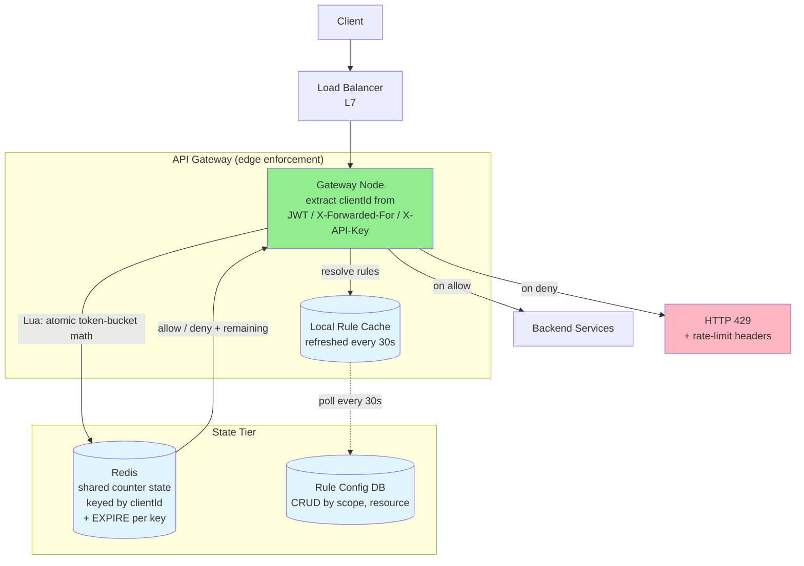
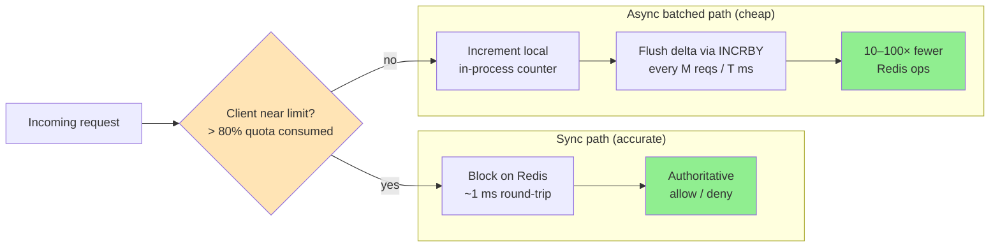
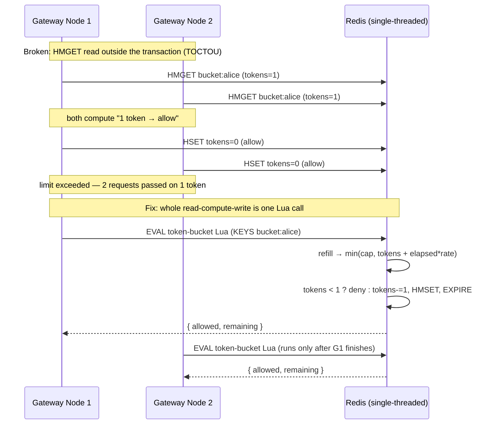
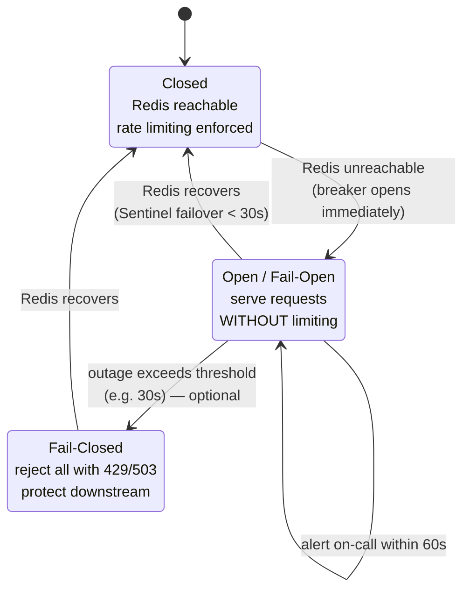
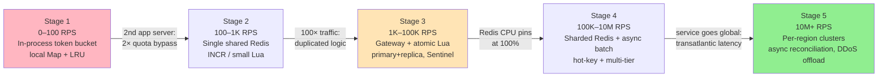

# 🚦 Design Distributed Rate Limiter

> **Pattern**: Coordination / Counting
> **Difficulty**: Medium
> **Source**: [hellointerview.com](https://www.hellointerview.com/learn/system-design/problem-breakdowns/distributed-rate-limiter)

> **Summary**: A distributed rate limiter caps how often a client (user, IP, or API key) can call an API over a time window, enforcing a global limit across many gateway nodes without adding meaningful latency (< 10 ms) to the critical path. The design places the limiter at the edge (API gateway), keeps counter state in a centralized, sharded Redis accessed through atomic Lua scripts (to defeat the read-modify-write race), and picks token bucket as the default algorithm for its O(1) state and burst tolerance. The hard parts are consistency-vs-latency trade-offs, sync-vs-async counter updates at scale, hot-key mitigation, and choosing fail-open so the limiter never becomes the API's single point of failure.

---

## 📋 Table of Contents

- [Understanding the Problem](#understanding-the-problem)
  - [Functional Requirements](#functional-requirements)
  - [Non-Functional Requirements](#non-functional-requirements)
- [Layman's Explanation](#laymans-explanation)
- [Core Entities / Algorithms](#core-entities--algorithms)
- [API Design](#api-design)
- [High-Level Design](#high-level-design)
- [Deep Dives](#deep-dives)
  - [1. Algorithm Choice: Token Bucket vs Sliding Window](#1-algorithm-choice-token-bucket-vs-sliding-window)
  - [2. Consistency vs Performance](#2-consistency-vs-performance)
  - [3. Sync vs Async Counter Updates](#3-sync-vs-async-counter-updates)
  - [4. Multi-Node Coordination and Atomicity (Redis + Lua)](#4-multi-node-coordination-and-atomicity-redis--lua)
  - [5. Fail-Open vs Fail-Closed](#5-fail-open-vs-fail-closed)
- [Scaling Journey: 0 → ∞](#scaling-journey-0--)
  - [Stage 1: 0 – 100 RPS (MVP)](#stage-1-0--100-rps-mvp)
  - [Stage 2: 100 – 1,000 RPS](#stage-2-100--1000-rps)
  - [Stage 3: 1K – 100K RPS](#stage-3-1k--100k-rps)
  - [Stage 4: 100K – 10M RPS](#stage-4-100k--10m-rps)
  - [Stage 5: 10M+ RPS (Hyperscale)](#stage-5-10m-rps-hyperscale)
- [Insider Tips and Tricks](#insider-tips-and-tricks)
- [Expected Depth by Level](#expected-depth-by-level)
- [Related Concepts](#related-concepts)

---

## 🎯 Understanding the Problem

A distributed rate limiter caps how often a client (user, IP, or API key) can call an API over a time window, protecting backends from abuse, runaway clients, and traffic spikes. The core tension is enforcing a global limit across many gateway nodes without adding meaningful latency to the critical path.

### Functional Requirements

**In scope:**
1. Identify the client per request via user ID, IP address, or API key
2. Enforce configurable rules (e.g., 100 req/min per user, 10 req/sec per IP, per-endpoint caps)
3. Reject excess traffic with HTTP 429 and informative headers (`X-RateLimit-Remaining`, `X-RateLimit-Reset`, `Retry-After`)
4. Support layered rules — most restrictive applicable rule wins

**Out of scope:** strong consistency, long-term audit/persistence of every request, billing-grade accuracy.

### Non-Functional Requirements

1. **Low latency**: < 10 ms overhead on the request path
2. **High availability**: eventual consistency is acceptable; brief counter drift across nodes is fine
3. **Scale**: target 1M+ requests per second across 100M+ DAU
4. **Graceful degradation**: the limiter must not itself cause outages
5. **Cheap**: per-request cost must be tiny — limiter runs on every call

---

## 🧒 Layman's Explanation

Picture **the bouncer at a nightclub**: only 100 people are allowed inside at a time. Twenty more show up at once? They wait outside in line until someone leaves. The bouncer keeps a clicker counter — that clicker is the rate limit. Every time someone enters, click up; every time someone leaves, click down. Simple, local, effective.

Now picture **a water faucet with a flow regulator**. The handle is fully open, but the regulator only lets 1 gallon per minute through. Try to fill a swimming pool, you'll be waiting all day. That's the **token-bucket algorithm**: tokens drip into a bucket at a fixed rate, and you spend one token per request. If the bucket is empty, you wait for a drip.

A third image: **the single ticket booth at a small museum**. Only one person can buy a ticket at a time. If 50 people show up, queueing is automatic — that's a concurrency limit, a close cousin of rate limiting.

**Why "distributed" makes this hard.** Imagine the nightclub now has 5 doors with 5 bouncers, each holding their own clicker. If they don't talk to each other, you might end up with 5 × 100 = 500 people inside — way over capacity. The bouncers need a **shared count**, like a walkie-talkie or a central whiteboard. That shared whiteboard is **Redis**.

**Per-user vs global limits.** You might allow each user 10 requests/sec, but only 10,000/sec total across everyone. That's two different bouncers checking two different rules — one stamps your hand, one watches the building's overall capacity.

**Token bucket vs sliding window.** Token bucket = the water regulator: smooth, refills slowly, tolerates short bursts. Sliding window = "no more than 100 hits in any rolling 1-minute window" — stricter, harder to game, but more bookkeeping.

**Burst tolerance.** A faucet with a small reservoir can handle short bursts of demand without dropping a single request. That's why bucket-shaped algorithms feel friendly to legitimate users.

### When the analogy breaks down

Real rate limiters serve **billions of requests across global regions**. They have to handle **clock drift between machines** (no two server clocks agree exactly), survive Redis outages without taking down the whole API, and remain precise enough to **bill customers** while still loose enough not to break legitimate traffic spikes. A nightclub bouncer never has to coordinate with bouncers in Tokyo while their clickers tick at slightly different speeds — but a global rate limiter does, every millisecond.

---

## 🔑 Core Entities / Algorithms

The "entities" in a rate limiter are really the algorithm choices. Each trades accuracy, memory, and burst handling differently.

| Algorithm | Idea | Memory per client | Pros | Cons |
|---|---|---|---|---|
| **Token Bucket** | Bucket of N tokens refills at rate R; each request costs 1 token | 2 fields (tokens, last_refill) | Handles bursts naturally; simple; cheap | Cold-start bursts; two params to tune |
| **Leaky Bucket** | Requests queue into a bucket draining at rate R | Queue / counter + timestamp | Smooth output rate | Queues add latency; doesn't allow bursts |
| **Fixed Window** | Count requests in discrete N-second buckets | 1 counter | Trivial to implement | Boundary doubling: user fires N requests at :59 and N more at :01 — 2N in two seconds while satisfying "N/minute" |
| **Sliding Window Log** | Store every request timestamp; drop those outside [now-window, now]; count remainder | O(N) timestamps per client — 10K requests/min means 10K timestamps in Redis per user | Exact; no boundary effect | Memory-prohibitive at scale; O(N) scan on every check |
| **Sliding Window Counter** | Weighted blend of current + previous fixed-window counts: `prev * (1 - elapsed/window) + current` | 2 counters (O(1) per client) | Near-exact (~0.1% error), cheap, immune to boundary burst | Assumes uniform distribution within each window |

**Default choice: Token Bucket** — best blend of simplicity, burst tolerance, and O(1) state per client. Used by AWS API Gateway, Stripe, and most cloud providers.

---

## 🔌 API Design

The rate limiter exposes a single internal decision primitive, invoked by the gateway on every request.

```
isRequestAllowed(clientId, ruleId)
  → { passes: bool, remaining: int, resetTime: unixTs }
```

On reject, the gateway returns:

```
HTTP/1.1 429 Too Many Requests
X-RateLimit-Limit:     100
X-RateLimit-Remaining: 0
X-RateLimit-Reset:     1713590400
Retry-After:           12
```

These headers are standardized in RFC 6585. Without them, clients implement exponential backoff blindly, causing thundering herds when limits reset simultaneously. With them, well-behaved SDK clients pace themselves automatically.

Rule configuration itself lives behind a small admin API (CRUD on rules; rules keyed by `(scope, resource)`).

---

## 🏗️ High-Level Design

**Placement decision: at the edge (API gateway / L7 load balancer).**
- *In-process in each app server* — rejected: each node only sees its own slice of traffic, making the global limit unpredictable.
- *Dedicated limiter microservice* — viable but adds a per-request network hop.
- *Embedded in API gateway* — chosen: single enforcement point, already on the hot path, no extra hop.

**State store: centralized Redis.**
- All gateway nodes read/write the same counter keyed by `clientId`.
- Redis gives sub-millisecond ops, atomic primitives (`INCR`, `EXPIRE`), and Lua for read-modify-write.
- Critical: use `EXPIRE` on every key. With 100M clients, each idle key that is never cleaned up becomes a memory leak.

**Request flow:**
1. Gateway extracts `clientId` from JWT / `X-Forwarded-For` / `X-API-Key`.
2. Resolves applicable rules (most restrictive wins) from a local in-process cache refreshed every 30 seconds.
3. Calls Redis via a Lua script that performs the token-bucket math atomically and returns allow/deny + remaining.
4. Attaches rate-limit headers, forwards or rejects.



---

## 🔬 Deep Dives

### 1. Algorithm Choice: Token Bucket vs Sliding Window

**Token Bucket** wins on the happy path: O(1) state per client (two fields: `tokens`, `last_refill`), burst-tolerant, trivially atomic in Lua. Refill math: `new_tokens = min(capacity, stored_tokens + elapsed_seconds * refill_rate)`. Deduct 1 token per request; deny if tokens < 1.

**Sliding Window Counter** wins when fairness across the window boundary matters — for example, billing APIs where a customer must not be able to fire 2× their quota at the minute boundary (the boundary burst problem that fixed windows cannot prevent). The formula:

```
approx_count = prev_window_count * (1 - elapsed_in_current_window / window_size)
             + current_window_count
```

This requires only two integer fields per client and is still atomically executable in Lua. The approximation error is ≤ 0.1% in practice — the assumption of uniform request distribution within a window is almost always satisfied by real traffic patterns.

**Sliding Window Log** is correct but memory-prohibitive at scale. An active user making 10,000 requests per minute accumulates 10,000 timestamps in Redis — that single user's key consumes as much memory as 10,000 token-bucket keys. Every `isRequestAllowed` call requires an O(N) scan to purge expired timestamps before counting. Never choose this algorithm for high-traffic users unless you have an explicit regulatory or billing requirement for exact counts and can bound the number of high-traffic users.

**GCRA (Generic Cell Rate Algorithm)** is the most mathematically elegant option and is used by Cloudflare and Shopify in production. It models a virtual token bucket with a single value: `tat` (theoretical arrival time — the earliest time the next request is permitted). On each request: if `now >= tat`, allow and set `tat = max(now, tat) + emission_interval`. Burst tolerance is added via a burst parameter that shifts `tat` backward by `burst_tokens * emission_interval`. GCRA is O(1) per operation, requires one Redis value per user, and handles burst without a separate burst counter.

**Rule of thumb:**
- User-facing API with bursty legitimate traffic → Token Bucket or GCRA
- Billing/quota-critical, fairness across window boundaries → Sliding Window Counter
- Regulatory/exact-count requirement → Sliding Window Log (and explicitly budget the memory cost)

### 2. Consistency vs Performance

A perfectly consistent global counter requires either a single-leader store or distributed consensus — both kill the < 10 ms budget. Rate limiters exploit the fact that **strict consistency is not required**: if a user occasionally sneaks one extra request through during a race window, the cost is negligible compared to adding 50 ms of Paxos/Raft to every API call.

- **Single Redis primary per shard** gives linearizable operations with sub-millisecond latency. This is the production sweet spot for most systems.
- **Read replicas are not used for rate-limit reads** — replica lag (typically 1–5 ms, occasionally 50+ ms during replication backlog) means you would under-count and allow excess requests. Replicas are useful only for config reads, never for counter reads.
- **Multi-region active-active** uses per-region counters with async reconciliation. Accept that a user gets a separate quota per region — this is often acceptable by design (and sometimes preferred: a user's EU quota is independent of their US quota). For truly global limits, periodically synchronize regional deltas to a global aggregator; local counters self-correct. Overshoot is bounded by `reconciliation_interval × per_region_rate`.
- **Clock skew** is a hidden consistency hazard in distributed setups. For approximate algorithms (token bucket, sliding window counter), skew < 100 ms is within the algorithm's error tolerance. For exact algorithms (sliding window log), you need NTP with < 10 ms skew across all nodes, or a centralized timestamp source (e.g., Redis `TIME` command called inside the Lua script to ensure the counter and the timestamp share the same clock).

### 3. Sync vs Async Counter Updates

**Sync (default):** every request blocks on Redis until the counter is updated and the allow/deny decision is returned. This is correct, adds ~1 ms round-trip on a warm connection pool, and is sufficient up to Redis's single-instance throughput ceiling of approximately 50–100K ops/sec.

**Async batching (optimization at scale):**
- Each gateway node maintains a *local approximate counter* in process memory.
- Every M requests (or every T milliseconds, whichever comes first), the gateway flushes the accumulated delta to Redis via `INCRBY` and reads back the new total.
- Redis remains the authoritative source of truth; local counters are advisory between flushes.
- Benefit: 10–100× reduction in Redis operations — the most effective single optimization at high RPS.
- Cost: between flushes, a client can overshoot the global limit by up to `M × num_gateway_nodes` requests. Tune M so that this overshoot is within acceptable tolerance (e.g., for a 100 req/min limit, M = 5 with 10 gateways means a worst-case 50-request overshoot — 50% over limit). For most use cases this is acceptable; for billing-critical limits, reduce M or switch to sync.

**Hybrid (best for hyperscale):**
- Sync path for clients whose counters show > 80% of quota consumed — accuracy matters when approaching the limit.
- Async batched path for clients clearly under quota — the common case for most clients most of the time.
- A per-gateway local cache tracks "earliest time this client could possibly hit the limit given current local count" so the gateway knows when to escalate to sync mode automatically.



> ⚠️ **Async batching trades accuracy for throughput.** Between flushes a client can overshoot the global limit by up to `M × num_gateway_nodes` requests — e.g., a 100 req/min limit with `M = 5` across 10 gateways permits a worst-case 50-request (50%) overshoot. Tune `M` to your tolerance; for billing-critical limits, reduce `M` or stay on the sync path.

### 4. Multi-Node Coordination and Atomicity (Redis + Lua)

Naive implementation using Redis transactions:

```
tokens, last_refill = HMGET bucket:alice tokens last_refill
# ... compute new tokens in app code ...
MULTI
  HSET bucket:alice tokens <new>
  HSET bucket:alice last_refill <now>
EXEC
```

This is **broken** due to a TOCTOU (time-of-check/time-of-use) race: the `HMGET` read happens outside the transaction. Two gateway nodes can both read the same stale state, both compute "1 token remaining → allow", and both write back 0 tokens — the limit is exceeded. Redis `MULTI/EXEC` prevents interleaving of the write commands but does nothing to prevent another client from reading between the `HMGET` and the `MULTI`.

**Fix: Lua script.** Redis executes Lua scripts single-threaded and atomically — the entire read-compute-write sequence is one indivisible operation from Redis's perspective:

```lua
-- KEYS[1] = bucket key
-- ARGV[1] = capacity, ARGV[2] = refill_rate (tokens/sec), ARGV[3] = now (unix seconds float)
local state  = redis.call('HMGET', KEYS[1], 'tokens', 'ts')
local tokens = tonumber(state[1]) or tonumber(ARGV[1])
local ts     = tonumber(state[2]) or tonumber(ARGV[3])
local delta  = math.max(0, tonumber(ARGV[3]) - ts) * tonumber(ARGV[2])
tokens = math.min(tonumber(ARGV[1]), tokens + delta)
if tokens < 1 then
  return { 0, tokens }
end
tokens = tokens - 1
redis.call('HMSET', KEYS[1], 'tokens', tokens, 'ts', ARGV[3])
redis.call('EXPIRE', KEYS[1], 3600)
return { 1, tokens }
```

All gateway nodes running the same Lua script against the same Redis primary produce a total serializable order of per-client operations. The `EXPIRE` call auto-cleans idle keys — critical when you have 100M registered clients, the vast majority of whom are inactive at any given moment.

The contrast between the broken transaction and the atomic script is the crux of the whole design:



**Alternative for simple fixed-window counters:** use `INCR` and check the *returned value* (not a prior `GET`). `INCR` is atomic: `count = INCR key; if count == 1 then EXPIRE key window_seconds end; if count > limit then deny end`. This avoids Lua for the simplest case but does not generalize to token bucket math.

**Sharding for horizontal scale:** hash `clientId` to a Redis shard via consistent hashing (or Redis Cluster's 16,384 hash slot scheme). The same client always routes to the same shard, preserving per-client atomicity globally. A single Redis instance handling 50–100K ops/sec × 10 shards = 500K–1M ops/sec capacity, covering well over 1M RPS of rate-limit checks (since each check is one Lua call that is faster than the request itself).

### 5. Fail-Open vs Fail-Closed

When the Redis cluster is unreachable, the gateway must choose a fallback policy. This is not a theoretical edge case — Redis can become unavailable during a traffic spike (ironically, the very situation where the rate limiter matters most).

- **Fail-open**: allow all requests through. The API stays available, but rate limiting is suspended exactly when it may be most needed. Risk: a bad actor could exploit a Redis outage window to bypass limits.
- **Fail-closed**: reject all requests with 429 or 503. Downstream services are protected, but all legitimate traffic is also blocked. A Redis outage becomes a full service outage from the user's perspective.

**Production recommendation: fail-open with monitoring and a short circuit-breaker timeout.** A Redis outage is already a P0 incident. Piling a denial-of-service onto a P0 makes recovery harder and lengthens the incident. The practical approach:
1. Open the circuit breaker immediately on Redis unavailability — serve requests without rate limiting.
2. Alert on-call within 60 seconds.
3. If the outage exceeds a configured threshold (e.g., 30 seconds), optionally switch to fail-closed to protect downstream services from a traffic avalanche.
4. Pair with Redis primary-replica failover (Sentinel or Redis Cluster) so "unreachable" states are rare (< 30 seconds for automatic failover) and the circuit breaker rarely opens.



> 💡 **Say the fail-open vs fail-closed tradeoff out loud.** Interviewers consistently reward candidates who surface operational failure modes, not just happy-path design. The production default is fail-open with monitoring and a short circuit-breaker timeout: a Redis outage is already a P0 incident, and piling a denial-of-service on top only lengthens recovery.

---

## 📈 Scaling Journey: 0 → ∞

A rate limiter is measured by the traffic flowing through it, not the user count. Each stage below adds infrastructure only when the previous stage's bottleneck bites.



### Stage 1: 0 – 100 RPS (MVP)

**Goal:** protect a single-server API from obvious abuse.

**Architecture:**
- **In-process token bucket** in the app server (e.g., `golang.org/x/time/rate`, `express-rate-limit`, `bucket4j`).
- State lives in a local `Map<clientId, Bucket>` with LRU eviction.
- One process, one counter table, zero network hops.

**What you skip:** Redis, distributed coordination, any gateway tier.

**Failure mode that pushes to Stage 2:** you add a second app server behind a load balancer. Now each server only sees half the traffic → a client can fire 2× their quota by hitting both.

---

### Stage 2: 100 – 1,000 RPS

**Goal:** enforce a single global limit across a small fleet (2–5 app servers).

**Architecture:**
- Stand up a **single Redis instance** (or managed ElastiCache/Upstash) shared by all servers.
- Switch the bucket implementation to use Redis `INCR` + `EXPIRE` for fixed-window, or a small Lua script for token bucket.
- Keep the limiter logic in the app layer — no dedicated gateway yet.
- Connection pooling to Redis (persistent TCP; never open per request).

**What you skip:** sharding, replication, async batching. One Redis handles this comfortably.

**Failure mode that pushes to Stage 3:** traffic grows 100×. Redis CPU is fine, but the limiter logic is duplicated across services and a deploy bug in one service bypasses it entirely.

---

### Stage 3: 1K – 100K RPS

**Goal:** centralize enforcement and hit real production SLAs.

**Architecture:**
- **Move rate limiting to the API gateway / edge load balancer** (Envoy, Kong, AWS API Gateway, nginx + Lua). One enforcement point, no per-service reimplementation.
- **Atomic Lua scripts** for token bucket — eliminate the TOCTOU read-modify-write race described in Deep Dive 4.
- **Redis primary + replica** with Sentinel for automatic failover (< 30 second failover time).
- **Dynamic rule config**: rules stored in a small DB, gateways poll every 30 seconds and cache locally — rule reads never hit the hot path.
- **Response headers on every request**: `X-RateLimit-Limit`, `X-RateLimit-Remaining`, `X-RateLimit-Reset`, and `Retry-After` on 429s.
- **Structured metrics**: `limit_hit_total`, `limit_check_latency_p99`, `redis_errors_total`.

**What you skip:** Redis Cluster sharding, async batching, multi-region. One Redis primary still handles 50–100K ops/sec.

**Failure mode that pushes to Stage 4:** approaching 100K RPS, Redis CPU pins at 100%. A single primary is the bottleneck.

---

### Stage 4: 100K – 10M RPS

**Goal:** horizontally scale the limiter state tier.

**Architecture:**
- **Shard Redis** via consistent hashing on `clientId` (or Redis Cluster, 16,384 slots). Each shard handles ~50–100K ops/sec → 10 shards covers 500K–1M RPS of rate-limit checks, 100 shards covers 10M.
- All requests from the same client always land on the same shard, preserving per-client Lua atomicity.
- **Hot-key mitigation**: a single viral API key can saturate its shard. Options: (a) replicated read counter with async writes for that key (sacrificing a small amount of accuracy); (b) promote the client to a dedicated shard; (c) pre-shard hot keys across multiple slots with a merge step.
- **Async counter batching** for the far-from-limit common case (Deep Dive 3): each gateway flushes deltas every 100 ms, reducing Redis load by ~50× for typical traffic distributions.
- **Multi-tier enforcement**: per-IP (blocks volumetric DDoS at the edge), per-unauthenticated-user (prevents credential stuffing), per-authenticated-user (fair use), per-tenant (noisy neighbor isolation), and global (protects downstream throughput). Each tier uses a different Redis key namespace and different limit thresholds. A request must pass all tiers; any failure returns 429.
- **Circuit breaker around Redis** with short fail-open windows (see Deep Dive 5).

**What you skip:** multi-region active-active, cross-region reconciliation. Still one region.

**Failure mode that pushes to Stage 5:** the service goes global. Users in Europe pay transatlantic latency on every Redis check, blowing the 10 ms budget.

---

### Stage 5: 10M+ RPS (Hyperscale)

**Goal:** global, multi-region rate limiting with production-grade operations.

**Architecture:**
- **Per-region Redis clusters.** Each region enforces independently; most rate limits are "per region" by design. This is often a feature, not a bug (quota-by-region is what enterprise customers want).
- For truly global limits (e.g., total API quota across all regions), **async cross-region reconciliation**: each region periodically pushes deltas to a global aggregator; local counters self-correct. Overshoot is bounded by `reconciliation_interval × per_region_rate`. This is distinct from rate limiting — it is quota enforcement and should be implemented and monitored separately.
- **Client-side approximation** for the hottest internal services: SDKs enforce a local budget and sync deltas asynchronously. The central limiter becomes an auditor rather than a gatekeeper on the critical path. Trades strictness for latency and cost.
- **Per-user rolling windows** instead of wall-clock-aligned windows — the window starts at the user's first request, not at :00 every minute. This eliminates the thundering herd that occurs when all throttled users' limits reset at the same second.
- **Tiered limits**: free / paid / enterprise tiers with different rules; premium customers get dedicated shards to avoid noisy-neighbor contention.
- **DDoS offload**: obvious attack traffic (single IP hammering with no auth) is shed at the CDN edge (Cloudflare, AWS Shield) before hitting the limiter at all.
- **Observability**: per-rule hit rates, per-shard latency histograms, anomaly detection on limit-hit patterns (sudden spike in 429s → likely attack or upstream bug).
- **Graceful degradation playbook**: explicit runbooks for Redis partition loss, regional failover, limit-config rollback.

**Key insight at this stage:** the rate limiter's own failure modes become the dominant risk. Every design decision is now judged by "does this make the limiter itself more or less likely to cause an outage?" Fail-open windows, circuit breakers, per-region isolation, and client-side approximation all exist because the limiter must never be the single point of failure for the entire API.

---

## 💡 Insider Tips and Tricks

### Sliding Window Log Is Theoretically Correct but Practically Unusable
The sliding window log stores every request timestamp for each user, then counts how many fall within the last N seconds. At 10K requests per user per window, you're storing 10K timestamps in Redis per user — prohibitive memory. The fix is the sliding window counter: divide time into fixed buckets, weight the previous bucket proportionally to overlap with the current window. It's an approximation (±0.1% error) but uses O(1) memory per user.

### The Boundary Burst Problem with Fixed Window Counters
A fixed window counter resets at wall-clock boundaries (e.g., every minute at :00). A user can make 100 requests at :59 and 100 more at :01 — 200 requests in 2 seconds while staying within the "100/minute" limit. This burst is unavoidable with fixed windows. Sliding window counter mitigates it; token bucket solves it entirely by smoothing consumption over time.

### Redis Atomicity Requires Lua Scripts, Not Separate Commands
A naive implementation: `GET counter`, check limit in app code, then `INCR counter`. This has a TOCTOU race: two requests both GET, both pass the check, both INCR — the limit is exceeded. The fix: a Lua script that does GET+INCR atomically on the Redis server. Redis executes Lua scripts single-threaded, making them inherently atomic. Alternatively, use `INCR` first and check the returned value — but only if the increment itself is the check.

### GCRA: The Most Elegant Algorithm Most Engineers Don't Know
Generic Cell Rate Algorithm (GCRA) models a "virtual token bucket" with a single value: the time at which the next request is theoretically allowed. On each request: if `now >= tat`, allow and set `tat = max(now, tat) + emission_interval`. This supports burst via a burst tolerance parameter. GCRA is used by Cloudflare and Shopify. It's O(1) per operation, requires one Redis value per user, and naturally handles burst without a separate burst counter.

### Fail-Open vs Fail-Closed When Redis Goes Down
If the rate limiter's Redis cluster fails, you have two options: fail-open (allow all requests) or fail-closed (deny all requests). Fail-open risks letting through an attacker during an outage. Fail-closed risks denying all legitimate traffic during an outage. Most production systems use fail-open with monitoring alerts — a Redis outage is already a P0 incident; adding a denial-of-service on top makes recovery harder. State this tradeoff explicitly in an interview.

### Multi-Tier Rate Limiting: All Layers Are Necessary
A single global limit is insufficient. Production systems layer: (1) per-IP — blocks volumetric DDoS at the network edge; (2) per-unauthenticated-user — prevents credential stuffing; (3) per-authenticated-user — enforces fair use; (4) per-tenant — isolates noisy neighbors in a multi-tenant API; (5) global — protects downstream services from total throughput overload. Hitting any layer triggers a 429. Each layer uses a different Redis key namespace and different limits.

### Rate Limit Response Headers Are Part of the Contract
Well-designed APIs return: `X-RateLimit-Limit: 100`, `X-RateLimit-Remaining: 43`, `X-RateLimit-Reset: 1700000060` (Unix timestamp of next reset), and on 429: `Retry-After: 15` (seconds until retry is safe). Without these, clients implement exponential backoff blindly, causing thundering herds. With them, well-behaved clients can pace themselves. These headers are standardized in RFC 6585 and expected by every API client SDK.

### Thundering Herd When Limits Reset Simultaneously
If all users' rate limit windows reset at the same wall-clock second (e.g., :00 every minute), all throttled users retry simultaneously — creating a spike that may exceed the system's throughput. Fix: use per-user rolling windows (window starts at the user's first request, not at a wall-clock boundary) or jitter the reset time by hashing the user ID to a sub-second offset.

### Distributed Nodes Have Clock Skew
In a distributed rate limiter with multiple Redis nodes (or multiple app servers each doing local counting), clock skew means "1 second ago" is slightly different on each node. For approximate algorithms (token bucket, sliding window counter), skew of <100ms is acceptable — the error is within the algorithm's tolerance. For exact algorithms (sliding window log), you need a synchronized time source (NTP with <10ms skew) or a centralized counter.

### Rate Limiting vs Quota Enforcement Are Different Problems
Rate limiting (throttling) is about *speed*: no more than N requests per second. Quota enforcement is about *volume*: no more than M total requests per month. They need different implementations. Rate limiting uses short TTL counters (seconds/minutes). Quota uses long-lived counters (days/months) with a separate billing reconciliation pipeline. Confusing them in an interview is a common mistake — address both separately.

---

## 🎓 Expected Depth by Level

| Level | Breadth / Depth | Focus |
|---|---|---|
| **Mid** | Breadth-first (~80/20) | Pick one algorithm (Token Bucket), place limiter at the API gateway, name Redis as shared state, acknowledge sharding exists |
| **Senior** | ~60/40 | Compare algorithms with trade-offs; articulate atomicity problem and Lua fix; discuss fail-open vs fail-closed; propose consistent-hashing shards and connection pooling without being prompted |
| **Staff+** | ~40/60 | Treat algorithm/store as solved; spend time on hot-key mitigation, async batching, hybrid sync/async, multi-region reconciliation, limiter-as-its-own-SPOF, observability and rollout strategy; draw from real-world operations experience |

---

## 📚 Related Concepts

- [Redis](../CoreConcepts/Redis.md) — the centralized counter store, atomic `INCR`/`EXPIRE`, and single-threaded Lua execution that makes the token-bucket check atomic.
- [Distributed Locking](../CoreConcepts/DistributedLocking.md) — the multi-node coordination and TOCTOU race the Lua script defeats; the same read-modify-write hazard that motivates atomic primitives.
- [Consistent Hashing](../CoreConcepts/ConsistentHashing.md) — hashing `clientId` to a Redis shard so the same client always routes to the same node, preserving per-client atomicity.
- [Sharding](../CoreConcepts/Sharding.md) — horizontally scaling the counter tier (Redis Cluster's 16,384 slots) once a single primary pins at 100% CPU.
- [Caching](../CoreConcepts/Caching.md) — the local in-process rule cache refreshed every 30s, and the async local counters that batch deltas to Redis.
- [Networking](../CoreConcepts/Networking.md) — edge placement at the L7 gateway, connection pooling to Redis, and why an extra network hop matters on a per-request path.
- [Redis (deep dive)](../SystemDesign/DeepDives/Redis.md) — in-memory data structures, atomicity, and sub-millisecond ops behind the state tier.
- [API Gateway](../SystemDesign/DeepDives/ApiGateway.md) — the edge enforcement point where the limiter lives on the hot path.
- [Dealing With Contention](../SystemDesign/Patterns/DealingWithContention.md) — atomic operations vs locks for the concurrent read-modify-write on a shared counter.
- [Numbers to Know](../SystemDesign/CoreConcepts/NumbersToKnow.md) — the latency and throughput budgets (< 10 ms overhead, ~50–100K Redis ops/sec) that shape every stage.
- [Rate Limiter (HelloInterview breakdown)](../SystemDesign/ProblemBreakdowns/RateLimiter.md) — the source breakdown this doc expands on.
