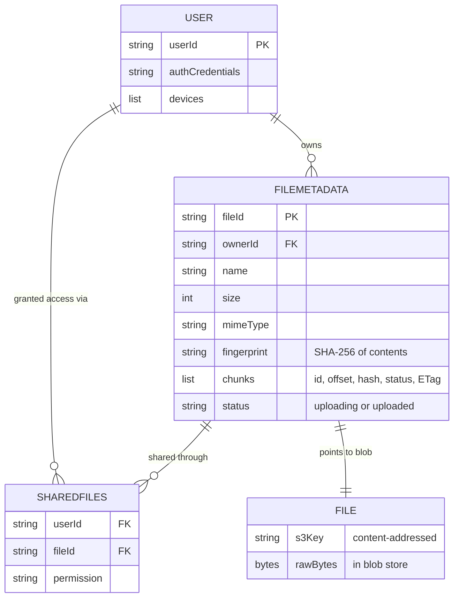
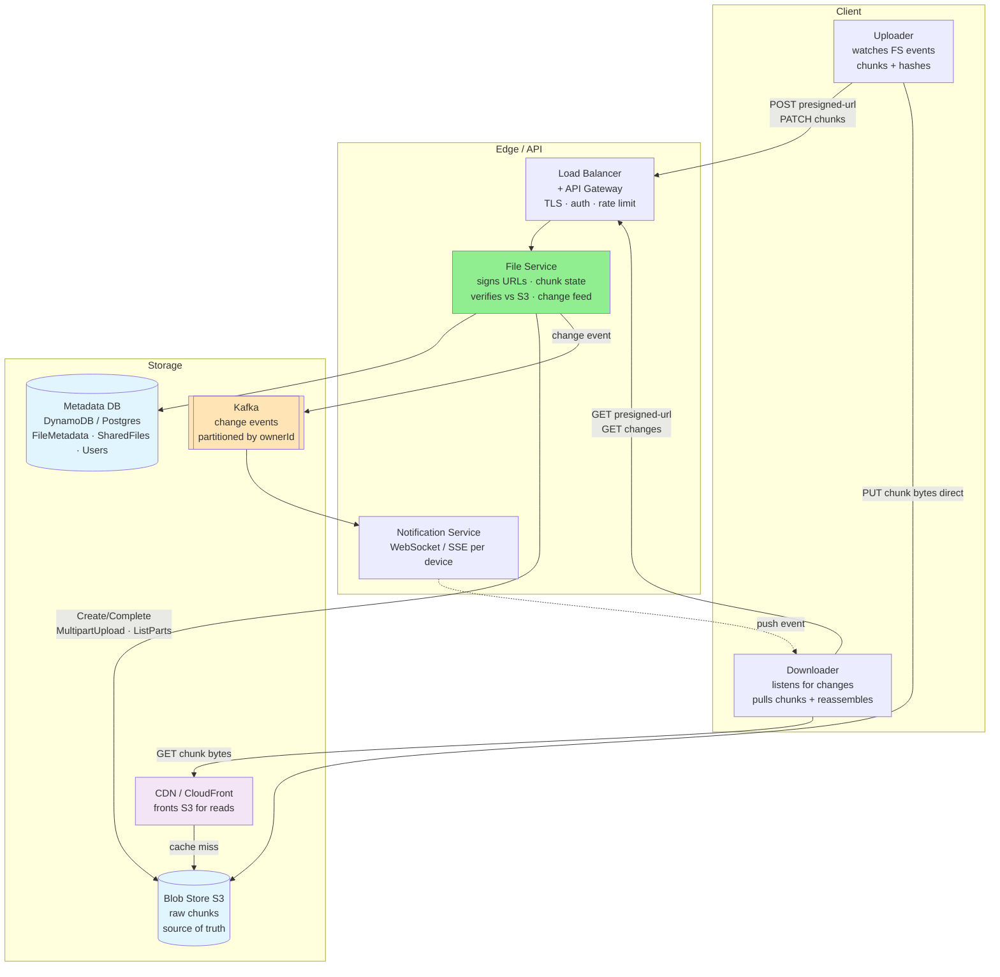
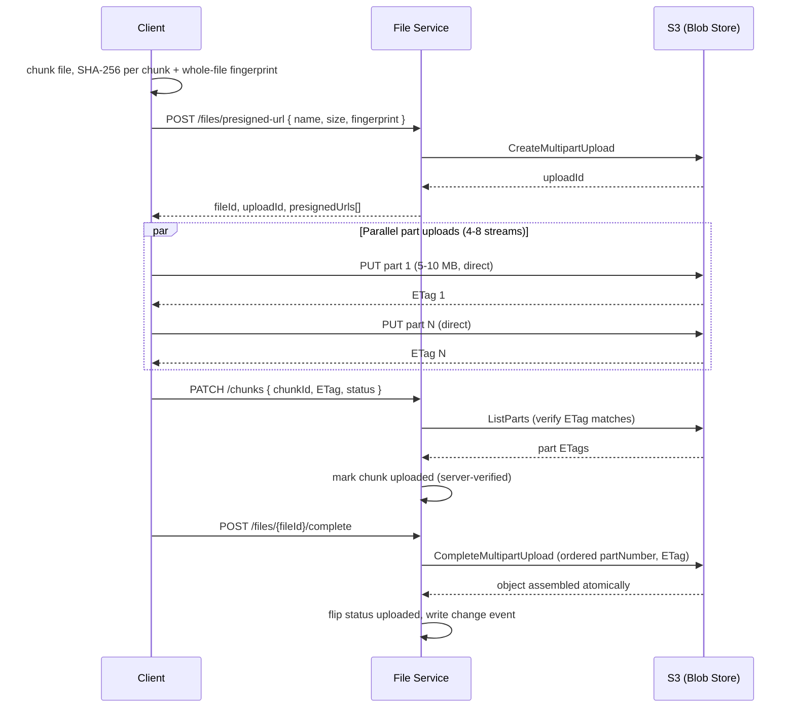
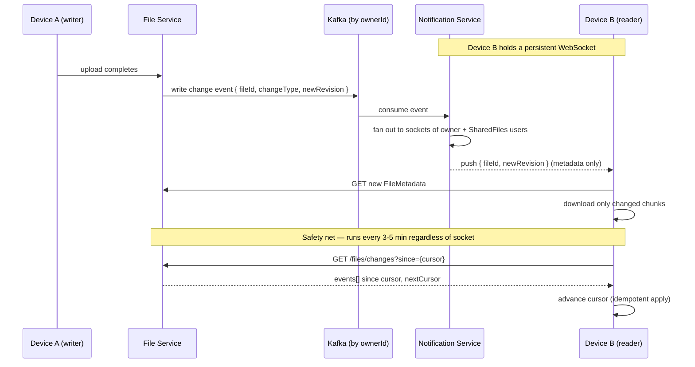
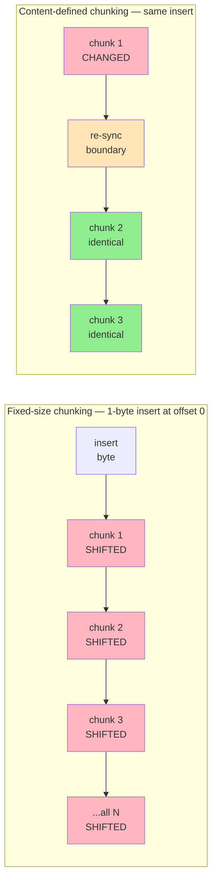
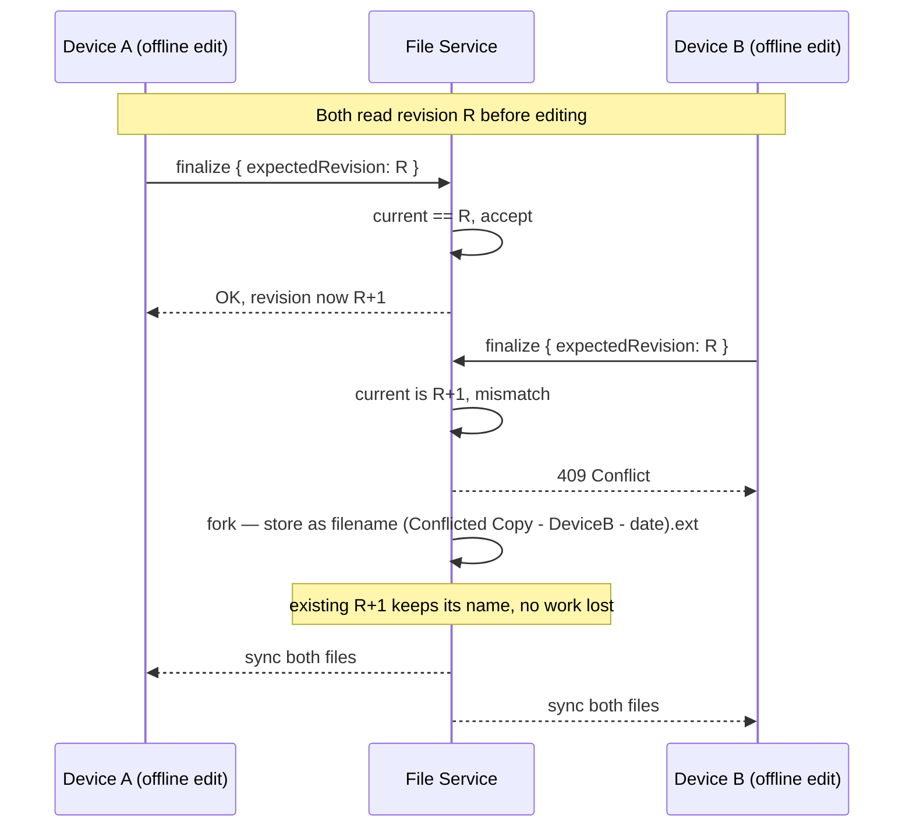
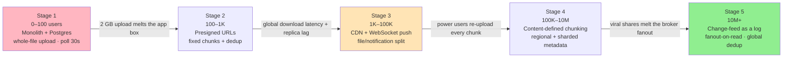

# 📦 Design Dropbox

> **Pattern**: File Storage / Sync
> **Difficulty**: Medium
> **Source**: [hellointerview.com](https://www.hellointerview.com/learn/system-design/problem-breakdowns/dropbox)

> **Summary**: Dropbox is a file hosting and sync service where large blobs (up to 50 GB) must never be lost once acknowledged, and many devices must converge on the same state within seconds without a central editor. The design splits a thin **control plane** (metadata, signed URLs, change feed) from a fat **data plane** where clients transfer bytes directly to S3 via presigned URLs and read back through a CDN — the application tier never touches file bytes. Content-defined chunking makes delta sync cheap, fingerprint-based dedup plus resumable S3 multipart uploads handle scale and flaky networks, a WebSocket-push / cursor-pull hybrid keeps devices in sync, and conflict *forking* (never last-write-wins) guarantees no user edit is silently lost.

## 📋 Table of Contents

- [Understanding the Problem](#understanding-the-problem)
  - [Functional Requirements](#functional-requirements)
  - [Non-Functional Requirements](#non-functional-requirements)
- [Layman's Explanation](#laymans-explanation)
- [Core Entities](#core-entities)
- [API Design](#api-design)
- [High-Level Design](#high-level-design)
- [Deep Dives](#deep-dives)
  - [DD1: Supporting Very Large Files (up to 50 GB)](#dd1-supporting-very-large-files-up-to-50-gb)
  - [DD2: Resumable Uploads and Deduplication](#dd2-resumable-uploads-and-deduplication)
  - [DD3: Fast Downloads via CDN and Range Requests](#dd3-fast-downloads-via-cdn-and-range-requests)
  - [DD4: Cross-Device Sync (Push + Pull Hybrid)](#dd4-cross-device-sync-push--pull-hybrid)
  - [DD5: Delta Sync via Content-Defined Chunking](#dd5-delta-sync-via-content-defined-chunking)
  - [DD6: Conflict Resolution](#dd6-conflict-resolution)
  - [DD7: Security, Signed URLs, and Access Control](#dd7-security-signed-urls-and-access-control)
  - [DD8: Compression and Encryption Ordering](#dd8-compression-and-encryption-ordering)
- [Scaling Journey: 0 to Infinity](#scaling-journey-0-to-infinity)
- [Insider Tips and Tricks](#insider-tips-and-tricks)
- [Expected Depth by Level](#expected-depth-by-level)
- [Related Concepts](#related-concepts)

---

## 🎯 Understanding the Problem

Dropbox is a file hosting and synchronization service. Users upload files from any device, download them from any other device, share them with other users, and expect changes to propagate automatically. The interesting engineering problems live at the intersection of "large blobs that must not be lost" and "many clients that must stay in sync without a central editor."

### Functional Requirements

**Core:**
- A user can upload a file from any device.
- A user can download any of their files from any device.
- A user can share a file with other users, and those users can read it.
- Files automatically sync across all of a user's devices when the file changes.

**Out of scope (below the line):**
- In-place file editing (Google Docs style collaborative editing).
- In-browser preview of content without a full download.
- Explicit multi-version history / time-travel restore.
- Virus or malware scanning.

### Non-Functional Requirements

**Core:**
- Availability is prioritized over strict consistency. Users across regions tolerate a few seconds of delay before a change appears on another device; they do not tolerate a dead service.
- Individual files can be very large, up to 50 GB.
- Durability and recovery: once an upload is acknowledged, the bytes must not be lost.
- Low latency for upload, download, and sync propagation.

**Out of scope:**
- Per-user storage quotas.
- Full versioning semantics.
- Advanced threat scanning.

The availability-over-consistency choice is load-bearing: it is what lets us lean on asynchronous sync, eventual propagation via change feeds, and CDN caches without having to coordinate global writes.

---

## 🧒 Layman's Explanation

Imagine a magic shared closet. You have a closet in your house that's somehow connected to identical closets in your friends' houses. Hang a coat in yours, and within seconds the same coat appears in all of theirs. Take it down, and it disappears from all of them too. That's file sync — the closet (folder) feels local and personal, but it's actually mirrored across every device that's invited in. Dropbox is that closet, scaled to billions of items and millions of people.

Or picture a photocopier with autopilot. Every time you put a paper in your tray, an invisible elf instantly photocopies it to your office, your coworker's office, and your home office. Now here's the clever part: if you update one page in a 1000-page book, the elf doesn't re-photocopy the entire book — it only photocopies the page that changed. That's chunking. Files are split into small pieces, and only the pieces that actually changed are sent over the wire. It's the difference between mailing a single revised page versus shipping the whole encyclopedia every time.

Or think of a shared family fridge magnet board. Anyone can add a note, anyone can remove one, and everyone sees the latest state without having to ask "what's on the board right now?"

**Sync conflicts.** What if you and your friend both grab the same coat at the same instant? Someone has to resolve who keeps it. Dropbox doesn't pick a winner and silently throw the other coat away — it keeps both, and renames the loser's copy to something like "coat (conflicted copy from your friend)." Nothing gets lost; you just have to decide which one to actually wear.

**Large files.** You don't re-photocopy a 1000-page book every time someone underlines one sentence. Only the changed page gets sent. This is why a 5 GB video edit doesn't take all night to sync.

**Bandwidth.** If you and your kid are both syncing photos at the same time, the home WiFi is trying to push everything to "the cloud" at once and slows to a crawl. Smart sync clients prioritize — small metadata changes go first, big bulk uploads happen in the background, and important folders get queue priority.

### When the analogy breaks down

Real Dropbox is far stranger than a magic closet. It encrypts every chunk so even Dropbox employees can't read your files, manages literally trillions of file chunks across global data centers, and uses *content-defined chunking* — a clever rolling-hash trick that catches edits anywhere inside a file (not just at fixed boundaries), so inserting one byte at the start of a 10 GB file still only re-uploads one chunk. And conflict resolution at scale isn't just "name the loser's copy weirdly" — it's a careful dance of revision numbers, version vectors, and three-way merges, all running across millions of devices that drop offline and reappear constantly.

---

## 🔑 Core Entities

Three entities are enough to reason about everything else:

1. **User** - Identity, auth credentials, device list.
2. **File** - The raw bytes living in a blob store. Not stored in a relational DB.
3. **FileMetadata** - Logical record describing a file: `fileId`, `ownerId`, `name`, `size`, `mimeType`, `fingerprint` (hash of contents), `chunks[]` (each with id, offset, hash, status, ETag), overall `status` (uploading / uploaded), timestamps.

A fourth table, **SharedFiles**, maps `(userId, fileId, permission)` and answers "which files can this user see?" It is deliberately separate from `FileMetadata` so that granting access does not require rewriting the file record.



---

## 🔌 API Design

The API is deliberately thin because the heaviest byte transfers happen directly between the client and the blob store via presigned URLs, bypassing the application servers.

```
# Request a presigned URL to upload (single-shot or multipart init)
POST /files/presigned-url
Body: { name, size, mimeType, fingerprint }
Returns: { fileId, uploadId?, presignedUrls[] }

# Client uploads bytes directly to blob storage
PUT {presignedUrl}
Body: <raw chunk bytes>

# Client reports chunk completion (server verifies against S3)
PATCH /files/{fileId}/chunks
Body: { chunkId, eTag, status }

# Finalize multipart upload after all chunks complete
POST /files/{fileId}/complete

# Request a signed CDN URL to download
GET /files/{fileId}/presigned-url
Returns: { url, expiresAt }

# Share a file
POST /files/{fileId}/share
Body: { userIds[], permission }

# Pull changes since a watermark (used for sync)
GET /files/changes?since={cursor}
Returns: { events[], nextCursor }
```

Critical detail: the presigned-URL endpoint does not call S3. Presigning is a local cryptographic operation using the S3 account credentials, so it stays fast and does not create an S3 rate-limit coupling.

---

## 🏗️ High-Level Design

The architecture is a classic "control plane vs data plane" split.



**Client layer:**
- **Uploader** - Watches the local filesystem via OS events (FSEvents on macOS, ReadDirectoryChangesW on Windows, inotify on Linux), chunks changed files, computes hashes, drives uploads.
- **Downloader** - Listens for change notifications, fetches updated metadata, pulls changed chunks from the CDN, reassembles the file locally.

**Edge / API layer:**
- **Load balancer + API gateway** - TLS termination, auth, rate limiting, routing.
- **File service** - Creates FileMetadata, signs URLs, records chunk state, verifies completion against S3, serves the change feed.
- **Notification service** - Maintains a WebSocket (or SSE) connection per device and pushes change events.

**Storage layer:**
- **Metadata DB** - Something like DynamoDB or PostgreSQL. Holds FileMetadata, SharedFiles, Users. Small rows, indexed by `ownerId`, `fileId`, and a per-user change cursor.
- **Blob store (S3)** - Holds raw chunks. Source of truth for bytes.
- **CDN (CloudFront or equivalent)** - Fronts S3 for reads.

**Data flow, upload:**
1. Client hashes the file, splits into chunks, asks the file service for presigned URLs.
2. Client PUTs chunks directly to S3 in parallel.
3. On each chunk's success, client PATCHes the file service with `(chunkId, ETag)`.
4. Server verifies by calling S3 `ListParts`; if ETags match, marks chunk uploaded.
5. When all chunks are in, server calls `CompleteMultipartUpload`, flips file status to `uploaded`, and writes a change event.

**Data flow, download:**
1. Client asks for a signed URL; server checks ACL via SharedFiles and signs.
2. Client hits the CDN; edge either serves cached bytes or pulls from S3 and caches.

**Data flow, sync:**
1. A write on device A produces a change event in the metadata DB.
2. The notification service pushes the event to every live device of every user who can see that file.
3. Each device fetches the new metadata and pulls only the changed chunks.

---

## 🔬 Deep Dives

### DD1: Supporting Very Large Files (up to 50 GB)

**Problem.** A single HTTP PUT cannot survive a 50 GB upload. AWS API Gateway hard-caps payload size at 10 MB; most reverse proxies impose a 60-second idle timeout that a saturated uplink will trip long before 50 GB is transferred. Memory pressure is also a concern: buffering even a 1 GB file in application-tier memory on every upload request would require hundreds of gigabytes of RAM across the fleet. If the upload fails at any point, the entire transfer restarts with no recovery path.

**Solution.** Chunk on the client, upload chunks in parallel directly to S3 via presigned URLs, and use S3 Multipart Upload to atomically assemble the object on completion.

- **Chunk sizing: 5-10 MB.** Small enough that an individual part can be retried cheaply (re-upload ~5 MB on a network hiccup). Large enough that TCP slow-start and window scaling have room to ramp, and the number of S3 API calls per file stays manageable. S3 requires a minimum part size of 5 MB (except the last part), so 5 MB is the practical lower bound.
- **Client-side hashing.** The client computes SHA-256 per chunk and SHA-256 over the whole file. The whole-file hash becomes the `fingerprint` field used for deduplication. Chunk hashes are stored in the metadata DB alongside their ETags so the server can later verify the bytes S3 received match what the client claimed.
- **S3 Multipart Upload lifecycle.** The file service calls `CreateMultipartUpload` (on behalf of the client) and receives a server-side `uploadId`. The client receives one presigned URL per part. Each PUT to S3 returns an `ETag` (MD5 of the part bytes, as computed by S3). After all parts land, the server calls `CompleteMultipartUpload` with the ordered list of `(partNumber, ETag)` pairs; S3 atomically assembles the object and discards the intermediate parts. Until `CompleteMultipartUpload` is called, no partial object is visible via GET.
- **Parallel uploads.** The client can PUT multiple parts concurrently (typically 4-8 connections). On a 100 Mbps uplink with 8 parallel streams and 8 MB parts, a 50 GB file completes in roughly 55 minutes. Sequential uploading of the same file would take the same clock time but wastes all the TCP throughput gained from parallel streams.
- **App tier never touches bytes.** The presigning step is a cryptographic operation on the server using the AWS IAM credentials—it generates a time-limited, HMAC-signed URL without making any S3 API call. The application servers only process small JSON payloads. A single application instance can therefore orchestrate thousands of concurrent 50 GB transfers.



### DD2: Resumable Uploads and Deduplication

**Problem.** On a mobile hotspot or flaky home connection, a 40 GB upload that fails at byte 39.9 GB is catastrophic if it means restarting from zero. Separately, millions of users uploading the same popular files (OS installers, stock footage, commonly shared documents) would waste both network bandwidth and storage if each copy is stored independently.

**Solution.** Fingerprint-based resumability plus content-addressed deduplication.

**Deduplication flow:**
1. Before initiating any upload, the client sends the whole-file SHA-256 fingerprint in the `POST /files/presigned-url` request body.
2. The file service looks up the fingerprint in a global content-addressed index. If a blob with that fingerprint already exists and its status is `uploaded`, the server creates a new `FileMetadata` row pointing to the existing S3 object key and returns `{ alreadyExists: true }`. Zero bytes are transferred. This also applies cross-user: two users uploading the same file both get served from one stored copy.
3. The blob store key is the SHA-256 fingerprint itself (or a hash-derived path like `sha256[0:2]/sha256[2:4]/sha256`). This is content-addressed storage: the key is derived from the content, guaranteeing immutability and enabling deduplication without a separate lookup table.

**Resumability flow:**
1. If no complete blob exists, the server checks for an in-progress multipart upload with the same fingerprint. If found, it returns the per-chunk status map: `[uploaded, uploaded, missing, missing, ...]` along with the `uploadId`.
2. The client maps the status array to its local chunk list and only requests presigned URLs for chunks whose status is `missing` or `uploading`.
3. On reconnect after a full session loss, the client re-sends the fingerprint and receives the same status map—the upload picks up exactly where it left off.

> 💡 **Trust but verify:** The client's `PATCH /chunks` call reports `(chunkId, ETag)` as a hint. The server validates by calling S3 `ListParts` for the `uploadId` and comparing the ETag S3 reports for that part against the ETag the client reported. An attacker who fakes a chunk-complete notification cannot manufacture a valid S3 ETag without actually having uploaded the bytes. This also catches bitflips and silent data corruption in transit.

**Progress tracking.** The completed-chunk-count divided by total-chunk-count, updated as PATCHes land and server-side verification passes, gives an accurate, server-verified progress bar. The client's own upload state is a lower bound; the server's verified count is the authoritative number.

### DD3: Fast Downloads via CDN and Range Requests

**Problem.** Users are globally distributed. An S3 bucket in us-east-1 delivers ~200 ms of latency to a user in Singapore and ~250 ms to one in Frankfurt—acceptable for a one-time GET of a small file, but painful for a sync client that fetches dozens of chunks on startup. S3 egress also costs $0.09/GB out of AWS, which compounds quickly at scale. And large file downloads need to be resumable: a 10 GB download that fails at 9.8 GB should not restart from byte zero.

**Solution.**

**CDN placement.** A CDN (CloudFront or equivalent) sits in front of S3. The download flow becomes: client requests a signed CDN URL from the file service → client GETs the CDN edge → if the edge has a cache hit, it responds directly; if not, it fetches from S3, caches the response, and streams to the client. All subsequent clients in that region get sub-20 ms cache hits. Since chunk keys are content-addressed (derived from hash), they are immutable by definition: a chunk key either resolves to exactly the bytes it always did, or it does not exist. This means `Cache-Control: max-age=31536000, immutable` is safe and correct for chunk responses, maximizing CDN hit rate.

**Short-lived signed URLs.** The file service signs a CDN URL with an expiry of 5-10 minutes. The CDN validates the signature on each request; a cached edge response is only served to a request that carries a valid signature. This means the CDN does not cache the authorization—it caches the bytes but gates access on the client presenting a fresh signed URL for each request. A user whose sharing permission is revoked cannot use a stale URL beyond the expiry window.

**HTTP Range requests.** The client downloads chunks in parallel by issuing HTTP `Range: bytes=X-Y` requests against the signed CDN URL. This enables: (1) parallel multi-stream downloads that saturate available bandwidth, (2) resuming an interrupted download by re-issuing only the Range for the bytes not yet received, (3) displaying assembly progress chunk by chunk rather than waiting for the full file.

**Metadata responses are never cached.** The CDN is configured to forward all requests matching the API path prefix (`/files/*`) directly to the origin without caching. Only blob-path URLs (matching the S3 key pattern) are eligible for edge caching. This distinction is critical: serving a stale `FileMetadata` response from cache after a file is updated or a share is revoked would be a correctness and security bug.

### DD4: Cross-Device Sync (Push + Pull Hybrid)

**Problem.** If device A saves a file, device B should see the change within seconds. Pure polling (clients ask the server every N seconds) wastes battery and server resources—at 100 million active devices polling every 10 seconds, that is 10 million requests per second against the change-feed endpoint with the vast majority returning empty results. Pure push (server pushes all events to all connected clients) is unreliable: WebSocket connections drop, mobile networks switch between cell towers and WiFi, and missed events during disconnection cause permanent desync with no recovery path.

**Solution.** WebSocket push for the happy path, cursor-based periodic pull as the correctness safety net.

**Push path (WebSocket / SSE):**
- Each active device opens one persistent WebSocket connection to the notification service. The notification service is a stateful service: it holds the socket handles and maps each socket to a `(userId, deviceId)` pair.
- When a file upload completes, the file service writes a change event `{fileId, changeType, newRevision, ownerId}` to a message broker (Kafka topic partitioned by `ownerId`).
- The notification service consumes the Kafka topic and fans out to every socket registered for the users who can see that file (owner + all SharedFiles entries). For a file shared with 10 people across 30 devices, the notification service sends 30 WebSocket frames—each of which contains only the metadata event, not the bytes.
- Each device, on receiving the event, fetches the new FileMetadata and downloads only changed chunks. The push event is a lightweight trigger, not a data carrier.

**Pull path (cursor-based polling):**
- Every 3-5 minutes, regardless of WebSocket state, each device calls `GET /files/changes?since={cursor}`. The cursor is a monotonic watermark (a Kafka offset, a Postgres sequence number, or a DynamoDB stream shard iterator) stored both on the client and on the server per `(userId, deviceId)`.
- The server returns all events since the cursor in order, and the client advances its cursor to `nextCursor` in the response.
- If the socket was down for an hour, the next poll catches all missed events. The cursor guarantees at-least-once delivery; the client's local state must be idempotent to duplicate events (easy: "mark chunk X uploaded" applied twice is harmless).



**OS filesystem events.** On the upload side, the desktop client uses OS-level file watch APIs (FSEvents on macOS, `ReadDirectoryChangesW` on Windows, `inotify` on Linux) to detect local changes without a scan loop. A scan loop on a directory with 500,000 files takes tens of seconds and burns CPU; event-driven notification is immediate and cheap.

**The server is the source of truth.** Clients never sync peer-to-peer. There is no distributed consensus problem to solve: every write goes to the server, every read comes from the server, and devices are merely caches of server state.

### DD5: Delta Sync via Content-Defined Chunking

**Problem.** A user edits a 1 GB Word document or appends a row to a large CSV. With fixed-size chunking, a 1-byte insertion at offset 0 shifts every subsequent chunk boundary by 1 byte: all chunk hashes change, all chunks are treated as new, and the client re-uploads the entire 1 GB. This makes sync unusable for large files with frequent small edits—the dominant case for productivity software.

**Solution.** Content-defined chunking (CDC) using a rolling hash (Rabin fingerprinting).

**How Rabin fingerprinting works.** The algorithm slides a fixed-width window (typically 48 bytes) across the byte stream one byte at a time, maintaining a polynomial hash of the window contents. When the hash value matches a target pattern (e.g., the lowest N bits are all zero), a chunk boundary is declared. The boundary position depends on the content of the window, not on any byte offset. Target patterns are tuned to achieve a desired average chunk size (typically 4-8 MB for large files, 512 KB-1 MB for small files).

**Why CDC survives insertions.** Consider a 1-byte insertion at offset 0. The rolling hash window slides forward through the new byte. Within at most one average-chunk-size worth of bytes downstream from the insertion point, the hash will encounter the same content pattern it encountered before the insertion—because the content there is unchanged. From that re-synchronization point onward, every chunk boundary is identical to the pre-edit chunking. Only the chunk spanning the insertion point has a changed hash. That is typically one chunk re-uploaded, not ten thousand.



**Practical boundaries.** CDC sets minimum and maximum chunk sizes (e.g., min 512 KB, max 8 MB) to bound variance. Without a minimum, adversarial or random content could produce many tiny chunks. Without a maximum, content that never hits the boundary pattern would produce one enormous chunk.

**Delta sync protocol.** The client maintains the chunk hash list for each file in its local SQLite DB (see the Insider Tips section). On a file change, the client re-chunks the file, produces a new hash list, diffs it against the stored list, and only requests presigned URLs for chunks whose hashes are new. The server stores the authoritative chunk list and uses it to serve downloads in chunk-granular range requests to other devices.

The cost is O(file size) CPU on the client per edit to re-chunk and re-hash, but client CPU is abundant compared to re-uploading gigabytes over a constrained uplink.

### DD6: Conflict Resolution

**Problem.** Device A edits a file while offline. Device B edits the same file while offline. Both reconnect. The server receives two divergent versions of the same file. Last-write-wins (LWW) silently discards one user's work, which is unacceptable in a file sync product where data loss is a trust-destroying event.

**Solution.** Fork on conflict with user-visible conflicted copies; apply LWW only for clearly non-concurrent edits.

**Conflict detection using revision numbers.** Each `FileMetadata` record carries a server-assigned monotonic `revision` counter, incremented on each write by the server (not the client). When device A begins editing, it reads revision `R`. When it uploads, it sends `expectedRevision: R` in the finalize request. If the server's current revision is still `R`, the write succeeds and revision becomes `R+1`. If another device has already written revision `R+1`, the server returns a 409 Conflict.

> ⚠️ **Why not timestamps.** Client clocks skew—a laptop whose clock drifted 30 seconds forward can make its edit appear "later" even if the other device's edit arrived at the server first. Server-assigned revision numbers are monotonic, centrally authoritative, and immune to client clock drift.



**Conflict fork.** On a 409, the server does not overwrite. Instead: (a) the existing file at revision `R+1` keeps its name, (b) the incoming version is stored as a new file named `filename (Conflicted Copy - DeviceName - 2024-01-15).ext`. Both files appear in all synced devices. No work is lost. The user sees both copies and can manually merge.

**Three-way merge for text files.** For text-format files (plain text, Markdown, source code), a three-way merge is possible: original version (the common ancestor at revision `R`), edit A, and edit B. If the edits touch non-overlapping regions of the file, the merge succeeds automatically and no conflicted copy is shown. If they overlap, the merge is abandoned and a conflicted copy is created. Binary files always fork: there is no meaningful three-way merge for a JPEG or a .docx.

**CRDT / OT are explicitly out of scope.** Operational Transform and CRDTs allow concurrent edits to the same document to be merged without conflicts, but they require the application to be the editor—which is Google Docs, not Dropbox. Dropbox treats files as opaque blobs that applications (Word, Photoshop) own; the sync layer cannot decompose their internal structure.

### DD7: Security, Signed URLs, and Access Control

**Problem.** Presigned URLs are bearer tokens: possession of the URL is sufficient for access—there is no session cookie or JWT to validate at download time. A leaked URL grants access to the file to any party, including those whose permission was revoked after the URL was issued. Also, the authorization check must happen on upload as well: a malicious client should not be able to overwrite another user's file by guessing an S3 key.

**Solution.** Authorization at signing time, short expiry, and upload-path key isolation.

**Download authorization.** The file service checks the `SharedFiles` table at the moment it signs the download URL. If the requesting user does not have read permission on the file, the signing call never happens and no URL is issued. The presigned URL is then valid for 5-10 minutes. If a share is revoked after a URL is issued, the worst-case exposure window is 10 minutes—after which the URL cryptographically expires and S3 rejects it. The signed URL encodes the S3 key, expiry timestamp, and an HMAC computed from the service's AWS secret key; S3 validates the HMAC on every request.

**Upload authorization.** The presigned upload URL issued by the file service is scoped to a specific S3 key path owned by the upload session (e.g., `uploads/{uploadId}/parts/{partNumber}`). Even if a client correctly guesses another user's file key, the presigned URL for their session does not cover that key. The S3 bucket policy rejects any PUT that does not match the exact key the URL was signed for.

**IP binding.** Presigned URLs can include the client IP in the signed payload. S3 then rejects the URL if the request originates from a different IP. This is useful for high-sensitivity environments but is disabled for mobile clients that change IPs between cell towers.

**Encryption at rest.** S3 SSE-KMS encrypts all stored objects with keys managed in AWS KMS. The KMS key is stored outside the bucket; an adversary who gains read access to the S3 bucket gets ciphertext they cannot decrypt without also compromising the KMS key. For Dropbox's enterprise tier, customer-managed keys (CMK) allow the customer to revoke KMS key access, rendering all their stored blobs undecryptable as an emergency data-sovereignty measure.

**TLS everywhere.** All API calls and all presigned URL fetches are HTTPS. The CDN enforces TLS 1.2 minimum with HSTS headers.

### DD8: Compression and Encryption Ordering

**Problem.** Should we compress chunks before or after encrypting them? And should we compress everything, or only some file types? The wrong ordering eliminates compression savings entirely, and compressing already-compressed files wastes CPU for negative gain.

**Solution.** Compress before encrypt, with format-aware skip logic, using Zstandard as the default codec.

**Why order matters: entropy.** Encryption transforms bytes into high-entropy pseudo-random output—the output bits are statistically independent and uniformly distributed. Compression algorithms (LZ77, Huffman, arithmetic coding) exploit statistical redundancy: repeated byte patterns, skewed symbol frequencies, predictable structure. High-entropy data has no exploitable redundancy. Applying a compressor to ciphertext produces output approximately the same size as the input, wasting CPU and adding latency for zero gain. The only correct order is compress → encrypt.

**Format-aware skip logic.** The client inspects the MIME type (or file extension as a fallback) before attempting compression. Already-compressed formats—JPEG, PNG, MP4, H.264/H.265, AVI, ZIP, gzip, bzip2, xz, FLAC, HEIC, PDF (which internally compresses most streams)—are skipped. Attempting to Zstd-compress a 1 GB MP4 will produce a 1.01 GB output and burn 3 seconds of CPU. The client skips compression when `compressedSize >= originalSize * 0.95` after a probe on the first 64 KB.

**Zstandard as the default codec.** Zstd at compression level 3 achieves compression ratios comparable to gzip -9 at 4-6x the throughput. On a modern laptop, Zstd can compress at ~500 MB/s, meaning compression adds roughly 2 seconds of overhead per 1 GB of compressible data—negligible compared to upload time on most connections. Zstd's dictionary feature allows pre-training on common file patterns (source code, CSV schemas) for additional ratio improvement. Brotli is a suitable alternative for text-heavy content where compression ratio is more important than speed.

**Client-side, not server-side.** Compression and encryption both happen on the client before bytes leave the machine. This means (a) the server and blob store never see plaintext for E2E-encrypted files, and (b) the bandwidth savings from compression apply to the upload and download legs, not just to storage—which is where the user actually feels the benefit.

---

## 📈 Scaling Journey: 0 to Infinity

This section is the author's own analysis, tailored to the file-sync shape of the problem: how the storage tier, sync fanout, chunking strategy, and metadata store evolve as load grows.



### Stage 1: 0-100 Users (MVP)

**Goal.** Prove the product: a user can drop a file into a folder on one machine and find it on another. Nothing else matters.

**Architecture.**
- One monolith (Node/Go/Python, whatever the team knows) behind a single load balancer.
- One managed Postgres instance for Users, FileMetadata, SharedFiles.
- S3 as the blob store from day one; do not try to build storage yourself.
- Direct uploads through the monolith (multipart form) - no presigned URLs yet.
- Clients poll `GET /files/changes?since=` every 30 seconds. No WebSockets.
- No CDN. S3 direct reads.

**What you skip.**
- Chunking. Files are uploaded whole, capped at maybe 100 MB so nobody learns a painful lesson.
- Content-defined chunking, delta sync, dedup - all deferred.
- Real-time push. Polling is fine at this scale.
- Multi-region anything.

**Failure mode that pushes to next stage.** Someone uploads a 2 GB video. The request streams through the monolith, eats memory, times out at the load balancer's 60-second limit, and the user loses the upload. The app box is now the bottleneck.

### Stage 2: 100-1,000 Users

**Goal.** Get large blobs off the application servers. Start supporting multi-GB files.

**Architecture.**
- Introduce **presigned URLs**. The monolith no longer touches bytes; it only signs.
- Introduce **fixed-size chunking** (10 MB) with S3 multipart upload.
- Add a chunk-status table; add the `PATCH /chunks` endpoint with server-side ETag verification via `ListParts`.
- Keep Postgres as the single metadata DB. Add read replicas for the change-feed query.
- Still no CDN. S3 direct reads are fine for 1K users.
- Still polling for sync, but reduce interval to 10 seconds because the change feed is cheap.
- Add fingerprint-based dedup: if a file with the same SHA-256 already exists, link to it.

**What you skip.**
- Content-defined chunking (fixed chunks are good enough; most files are written once).
- WebSocket push (polling at 10s is acceptable latency).
- Sharding the metadata DB.
- CDN.

**Failure mode that pushes to next stage.** International users complain about 500ms+ download latency. Also, the poll interval trade-off starts to bite: 10 seconds feels laggy for sync, 1 second hammers the DB. And a single writer Postgres is starting to show replication lag on the change feed.

### Stage 3: 1K-100K Users

**Goal.** Make reads fast globally and make sync feel real-time.

**Architecture.**
- Put a **CDN** (CloudFront or equivalent) in front of S3. Signed URLs now point to the CDN, not S3 directly. First-region-fetch populates the edge; everyone after gets sub-100ms downloads.
- Introduce a dedicated **notification service** with **WebSockets** (or SSE). One persistent connection per active device. The file service publishes a change event to a message broker (Kafka or a managed pub/sub); the notification service fans out to connected sockets.
- Keep periodic polling as a safety net (now every 5 minutes instead of 10 seconds), so a dropped socket does not cause silent desync.
- Split the monolith into **file service** (metadata + signing) and **notification service** (WebSocket fanout). They have very different scaling profiles: file service is CPU-bound request/response, notification service holds many idle long-lived connections.
- Move metadata DB from a single Postgres to Postgres with partitioned tables by `ownerId`, or migrate to DynamoDB if query patterns are truly key-value.

**What you skip.**
- Delta sync / content-defined chunking. Most files are whole-file writes; the complexity cost is not yet justified.
- Multi-region writes. All writes still land in one region.
- Horizontal sharding of the blob store namespace (S3 handles this for you).

**Failure mode that pushes to next stage.** Two things hit at once. First, power users syncing large files that change a lot (video edits, database exports) saturate their uplinks repeatedly because fixed chunking re-uploads every chunk after an insert. Second, the single write region is now 200ms from users in APAC for every metadata write, and the metadata DB is hot on the top 1% of shares.

### Stage 4: 100K-10M Users

**Goal.** Make sync efficient for large, frequently-edited files. Start thinking globally.

**Architecture.**
- Introduce **content-defined chunking** (Rabin fingerprints). Clients only upload chunks whose rolling-hash-identified boundaries changed. Re-uploads on small edits drop by 1-2 orders of magnitude.
- Introduce a **storage tiering policy**: hot chunks (accessed in last 30 days) stay in S3 Standard, cold chunks move to S3 Infrequent Access or Glacier Instant Retrieval. Dedup already paid for itself; now tiering does.
- **Regional metadata DBs** with a primary region per user, replicated read-only to other regions. A user's writes always go home; reads can be served locally. Accept the availability-over-consistency trade-off explicitly here.
- **Shard the metadata DB** by `ownerId`. DynamoDB if not already. The SharedFiles table is sharded by `userId` (the reader), not `fileId`, because the dominant query is "what can this user see?"
- **Regional notification services.** A device connects to its nearest region; cross-region change events flow through the message broker.
- Aggressive **CDN tuning**: pre-warm for popular shared files, bump TTLs on immutable content-addressed chunks (they cannot change by definition).

**What you skip.**
- Global strong consistency on writes. Still last-write-wins.
- Custom blob storage. S3 keeps working.
- Per-user rate limiting beyond basic abuse prevention.

**Failure mode that pushes to next stage.** At this scale, two new classes of problem appear. The message broker fans out change events at O(shares) and starts to melt on viral shared folders (one file shared with 50,000 users produces 50,000 push events per edit). Separately, the metadata DB's change-feed queries become the hottest path in the system and need their own infrastructure.

### Stage 5: 10M+ Users

**Goal.** Survive viral fanout, team folders with tens of thousands of members, and keep per-user cost sane.

**Architecture.**
- **Dedicated change-feed service** built on a log (Kafka, Pulsar) rather than DB polling. Each user has a logical change-log cursor. The notification service consumes the log and pushes to sockets; clients fall back to reading the log directly via the change-feed API if reconnecting.
- **Fanout optimizations.** For shared folders with huge membership, switch from push-per-member to "publish once, each connected client pulls on next poll or next interaction." This is the classic Twitter fanout-on-read trade-off, applied to files.
- **Separation of metadata vs blob store scaling** becomes explicit: metadata tier scales on write QPS and index size; blob tier scales on bytes stored and egress. They are sized and budgeted independently.
- **Chunk-level dedup across all users** with a global content-addressed store. A movie that a million users upload is stored once. Requires careful reference counting and a GC that is safe under concurrent deletion.
- **Adaptive chunk sizing** based on observed network conditions per client: mobile 4G gets 2 MB chunks for retry cheapness, fiber connections get 32 MB chunks for throughput.
- **Regional active-active** for metadata, with conflict resolution via last-write-wins on a hybrid logical clock. Acceptable because file metadata conflicts are rare in practice; the typical case is a single user editing from one device at a time.
- **Tiered storage policy driven by ML**: predict access patterns and pre-promote cold chunks to warm tiers before the user asks for them (e.g., a morning re-open of yesterday's project folder).
- **Dedicated abuse / fraud / quota service** now that spam uploads, credential stuffing, and copyright takedown volume all demand real engineering.

**What you skip (even at this scale).**
- Strong global consistency. Still not worth it for file sync.
- Peer-to-peer client sync. Tempting for bandwidth savings, but the security and ACL story gets miserable.
- Building your own blob storage. S3 or an internal equivalent continues to be the right call; the economics of rolling your own only pencil out past hyperscaler volume.

---

## 💡 Insider Tips and Tricks

### Content-Defined Chunking vs Fixed-Size Chunking

Fixed-size chunking (e.g., 4 MB blocks) is conceptually simple but breaks down under real-world edit patterns. A 1-byte insertion anywhere in the file shifts every subsequent chunk boundary by 1 byte: all downstream chunk hashes change, and the client must re-upload the entire remainder of the file. For a 1 KB edit to a 1 GB file, fixed chunking retransmits 1 GB; content-defined chunking retransmits one 4-8 MB chunk.

Content-defined chunking uses a rolling hash (Rabin fingerprinting) over a sliding byte window. Chunk boundaries are declared wherever the hash matches a target bit pattern (e.g., lowest 12 bits equal zero for an expected chunk size of 4 MB). Because boundaries are determined by content patterns rather than byte offsets, a local insertion only disturbs the chunk containing the edit—downstream boundaries re-synchronize to the same content patterns as before within one average chunk length. Dropbox uses content-defined chunking; it is the mechanism that makes delta sync practical on large files with frequent small edits. In an interview, the distinction between fixed and content-defined chunking, and why it matters, is a reliable signal of production-level depth.

### Deduplication Across Users Is a Privacy and Legal Risk

Content-addressable storage enables cross-user deduplication: if user A and user B upload a file with the same SHA-256 hash, the blob is stored once and both `FileMetadata` rows point to it. At scale, this saves enormous storage—popular files (OS images, stock footage, widely-shared documents) can be stored once regardless of how many users upload them.

The hidden cost is legal and operational. If user A deletes their copy of the file, the blob cannot be deleted because user B still references it—the reference count is nonzero. More critically: if a legal hold (litigation hold, regulatory preservation order) is placed on user A's data, you cannot delete user B's copy of the blob even if user B has no legal obligation. The legal hold on user A's data attachment propagates through the shared blob to user B's data. Enterprise cloud storage products often disable cross-user deduplication entirely to avoid this entanglement, accepting higher storage costs in exchange for clean per-user data isolation. Mentioning this trade-off in an interview demonstrates that you think about the legal and operational constraints of storage design, not just the cost and performance dimensions.

### The Metadata Store and Blob Store Must Be Separate Services

File metadata (name, path, size, owner, version, ACL, chunk list) is mutable: files get renamed, moved, reshared, versioned, and soft-deleted. These are transactional operations that require ACID semantics—a rename must atomically update the path without a partially-written intermediate state visible to other readers. The metadata access pattern is also highly relational: "find all files owned by user X that were modified in the last 7 days and are shared with user Y" requires indexed, queryable structured data.

Blob content, by contrast, is immutable once written. A chunk at key `sha256:abc...` always contains exactly those bytes, forever. Blobs are write-once, read-many, and identified by content hash—there is nothing transactional about them. Mixing transactional metadata semantics into the blob store (or trying to query blob storage for metadata) forces the wrong data model onto the wrong engine. The correct architecture is: metadata in a relational or document database (PostgreSQL, DynamoDB, Firestore) with appropriate indices; blobs in an object store (S3, GCS) optimized for large sequential byte transfers. These services scale independently, fail independently, and are optimized for their respective access patterns.

### Bandwidth Is the Real Bottleneck, Not Storage

Back-of-envelope sanity check: 1 billion files at 10 MB average = 10 petabytes. On S3 Standard, that is approximately $230,000 per month in storage costs—real money, but manageable for a billion-file product. Storage is not the crisis.

Bandwidth is. A user on a 10 Mbps home connection uploading a 1 GB file edit takes 13 minutes. That same user editing a 10 GB video file takes over 2 hours. Even a user on a 100 Mbps fiber line needs 80 seconds for a 1 GB file. Delta sync (uploading only changed chunks rather than the whole file) is therefore not primarily a cost optimization—it is a UX requirement. A sync that takes 13 minutes for a small edit to a large file will cause users to stop using the product. When the interviewer asks why chunking and delta sync matter, the correct first answer is "because bandwidth is the binding constraint on sync latency, not storage cost."

### Sync Conflict Resolution: Last-Writer-Wins Is Almost Always Wrong

Last-write-wins (LWW) is tempting because it is simple: whoever submitted the finalize request last wins, and the other edit is silently overwritten. But in a distributed file sync product, two users can both be editing offline simultaneously. When both reconnect, LWW silently destroys one user's work with no warning and no recovery path. This is a trust-destroying data loss event.

Production systems fork on conflict instead. Dropbox's actual behavior: the first write to the server succeeds normally. The second write, which arrives with an `expectedRevision` that no longer matches the current revision, is stored as a new file named `filename (Conflicted Copy - DeviceName - Date).ext`. Both files sync to all devices. No data is lost. The user sees both versions and decides what to do. For text files, a three-way merge (common ancestor + edit A + edit B) can resolve non-overlapping edits automatically. For binary files, there is no merge—always fork. In an interview, proposing LWW for conflict resolution and not walking it back will cost points at senior level and above; proposing conflict forking with a brief note on three-way merge for text is the expected answer.

### Version Vectors vs Timestamps for Conflict Detection

Client-side timestamps are unreliable for conflict detection: laptop clocks drift, users travel across timezones, NTP synchronization has millisecond jitter, and a single misconfigured device clock can cause every file it touches to appear "newest" or "oldest" depending on which direction the clock drifted. Using client timestamps to determine which edit wins is a correctness bug waiting to surface.

Version vectors (or their scalar equivalent, per-file revision numbers) provide accurate causal ordering without relying on wall-clock time. Each write increments the server-assigned revision counter atomically. When a client submits an edit, it includes the `expectedRevision` it last saw. If the server's current revision matches, the edit is causally consistent and succeeds. If the server's revision is higher, a concurrent edit occurred and a conflict must be forked. If revision A dominates revision B (A is strictly greater), A happened after B—no conflict. If neither dominates (concurrent increments from different devices—detectable with full vector clocks), there is a genuine conflict. Dropbox uses monotonic per-path revision numbers, not timestamps, for exactly this reason. When asked how you detect conflicts in a distributed sync system, timestamps should be rejected explicitly before proposing revision-based detection.

### The Upload URL Must Bypass Your API Server

Routing file bytes through an application server is one of the most common architectural mistakes in file-storage system design interviews. The failure mode is concrete: a 1 Gbps uplink on an application server can serve roughly 100 concurrent 10 Mbps upload streams. Add 1,000 concurrent uploaders and you need 10 application server instances just to absorb bytes—instances that do nothing but copy bytes from one network socket to another, burning CPU on TLS encryption/decryption and memory on buffering.

The correct architecture: the client calls the API server to request a presigned upload URL (a lightweight cryptographic operation taking microseconds). The client then PUTs the file bytes directly to S3 or GCS using that URL, without the bytes ever traversing the application tier. The S3 endpoint has essentially unlimited ingress capacity and is purpose-built for large sequential writes. The API server processes only small metadata JSON payloads—it can handle orders of magnitude more concurrent uploads without additional capacity. This is not an optimization; it is the baseline architecture. Any design that routes file bytes through the application tier should be immediately identified as a scalability bottleneck and corrected.

### Cold Path for Large File Sync: Resumable Uploads

For files in the multi-gigabyte range, a network failure during upload is not an edge case—it is an expected occurrence. A 10 GB file on a 50 Mbps connection takes 27 minutes to upload. In 27 minutes, a mobile device will likely switch networks, a laptop will sleep, or a home router will reboot. Without resumability, the user must start over from byte zero.

The tus protocol (an open standard for resumable uploads) and S3 Multipart Upload (a proprietary equivalent) both address this by committing upload progress in chunk-sized increments. With S3 Multipart, each completed part is durably committed on S3—a network failure after 9.9 GB of a 10 GB upload requires retransmitting only the last incomplete 100 MB part, not the entire 10 GB. The `uploadId` issued at the start of the session is durable on S3 for up to 7 days (configurable). On reconnect, the client retrieves the list of already-committed parts via `ListParts`, determines which parts are missing, and resumes from the first missing part. Resumability for large files is a hard requirement, not a nice-to-have—its absence is an immediate UX failure that will prevent adoption among any user with a large file and a flaky connection.

### Why Desktop Sync Clients Use a Local SQLite Database

A naive sync client implementation re-hashes every file in the watched directory on every startup to determine which files have changed since last run. For a user with 100,000 files averaging 5 MB each (500 GB total), re-hashing the entire directory at startup takes tens of minutes and saturates the disk. This is obviously unacceptable.

The correct implementation stores sync state in a local SQLite database. The DB records: which files are fully uploaded (with their last-known hash and server revision), which chunks of each in-progress upload have been committed, which files have local modifications not yet uploaded, and the per-user change cursor for the polling fallback. SQLite is the right choice for this use case: it is ACID (crash safety is critical—losing sync state on an unexpected shutdown would require a full re-hash), it supports offline operation (the DB is local and requires no network), it survives app restarts with full state intact, and it is fast enough for lookup-by-path queries on millions of rows. On startup, the client checks OS-reported file modification timestamps (cheap) against the DB's last-known state and only re-hashes files whose mtime changed. The full re-hash on a 500 GB directory drops from tens of minutes to seconds. The local SQLite DB is not a database design choice to be mentioned in passing—it is load-bearing infrastructure for correct and performant sync client behavior.

---

## 🎓 Expected Depth by Level

| Dimension | Mid (E4) | Senior (E5) | Staff+ (E6+) |
|---|---|---|---|
| Breadth vs depth | 80 / 20 | 60 / 40 | 40 / 60 |
| API + data model | Must produce a clean one | Must produce one quickly, move on | Sketch and move on; not where time is spent |
| Presigned URLs | OK to not know; reason to it when asked | Expected to propose unprompted | Assumed baseline |
| Chunking + multipart | Discuss if guided | Drive the conversation: chunk size, ETag verification, resumability | Discuss content-defined chunking, rolling hashes, adaptive sizing |
| Sync mechanism | Polling is acceptable | Propose WebSocket + polling fallback | Discuss fanout trade-offs, change-feed as a log, viral-folder fanout-on-read |
| Conflict resolution | "Last write wins" is fine | Discuss conflicted copies, edge cases | Compare against OT/CRDT and justify why it is out of scope here |
| Storage tiering | Not expected | Mention hot/cold awareness | Drive tiering + dedup + GC discussion |
| Proactivity | Interviewer drives | Shared driving | Candidate drives; interviewer only redirects |
| Trade-off articulation | Identify one side | Identify both sides with a reason | Nuanced, often from production experience |

---

## 📚 Related Concepts

- [Data Modelling](../CoreConcepts/DataModelling.md) — why mutable metadata (Postgres/DynamoDB) and immutable blobs (S3) belong in separate stores.
- [Sharding](../CoreConcepts/Sharding.md) — sharding the metadata DB by `ownerId` and SharedFiles by reader `userId`.
- [Caching](../CoreConcepts/Caching.md) — CDN edge caching of immutable content-addressed chunks; never caching metadata responses.
- [Networking](../CoreConcepts/Networking.md) — WebSocket / SSE push for the sync happy path, presigned URLs, and TLS everywhere.
- [Consistent Hashing](../CoreConcepts/ConsistentHashing.md) — distributing content-addressed chunks across storage nodes.
- [Handling Large Blobs](../SystemDesign/Patterns/HandlingLargeBlobs.md) — presigned URLs, S3 multipart upload, and keeping bytes off the app tier.
- [Real-Time Updates](../SystemDesign/Patterns/Real-TimeUpdates.md) — push + cursor-pull hybrid for cross-device sync.
- [Dealing With Contention](../SystemDesign/Patterns/DealingWithContention.md) — revision-number CAS and conflict forking instead of last-write-wins.
- [Scaling Reads](../SystemDesign/Patterns/ScalingReads.md) — CDN and range requests for fast global downloads.
- [Kafka](../SystemDesign/DeepDives/Kafka.md) — the change-event broker partitioned by `ownerId` and the change-feed-as-a-log evolution.
- [DynamoDB](../SystemDesign/DeepDives/Dynamodb.md) — a key-value metadata store option for FileMetadata at scale.
- [Dropbox (HelloInterview breakdown)](../SystemDesign/ProblemBreakdowns/Dropbox.md) — the source breakdown this doc expands on.
