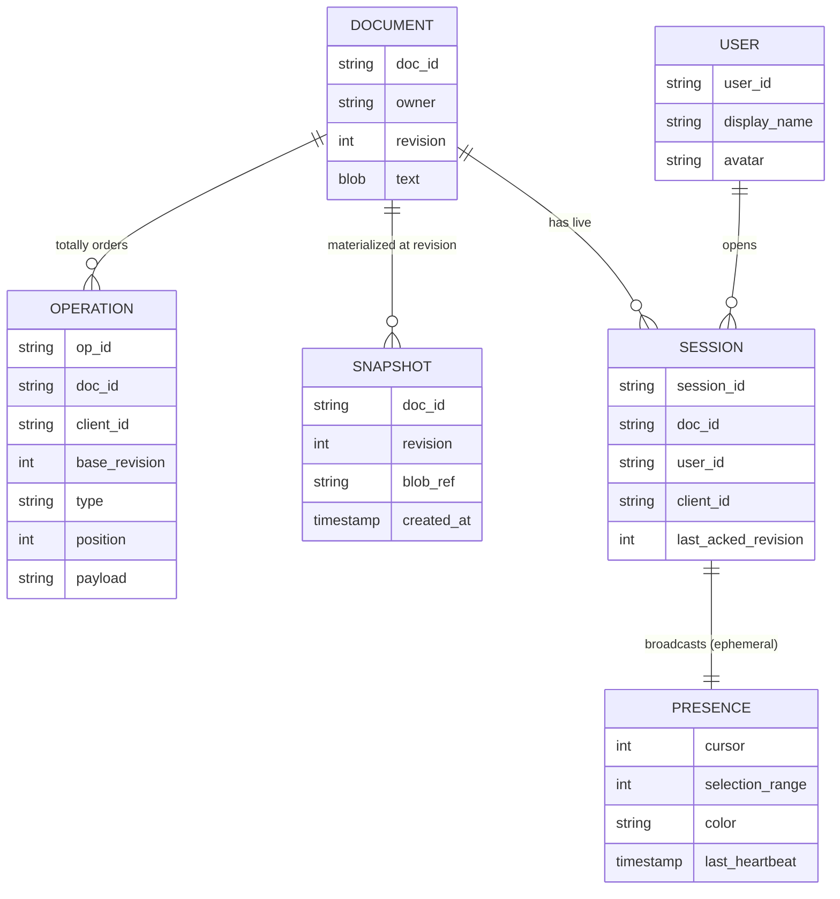
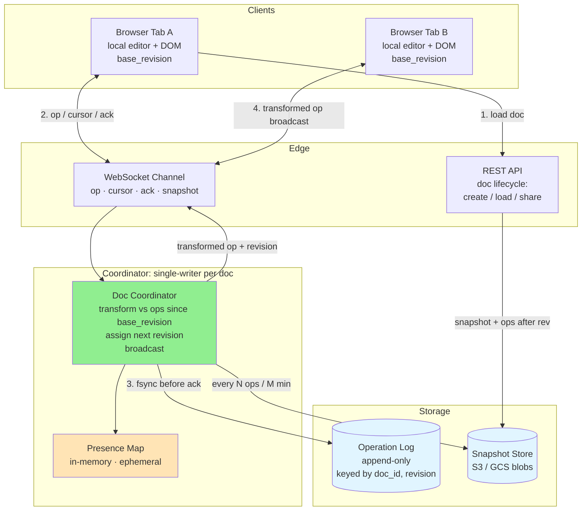
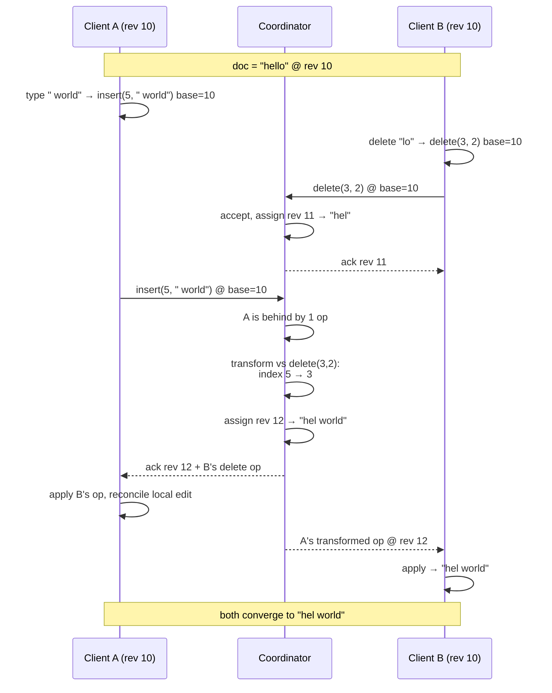
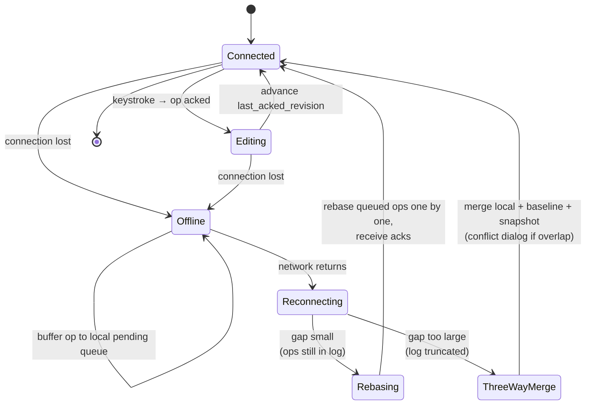
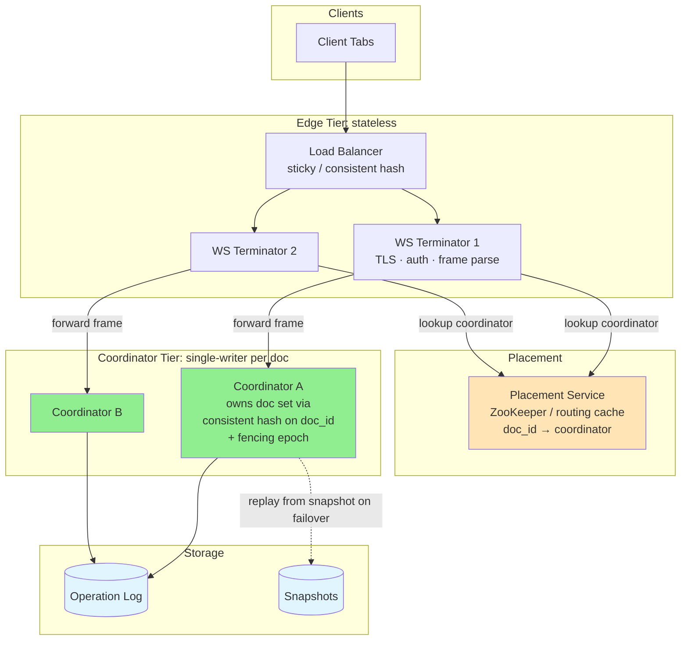
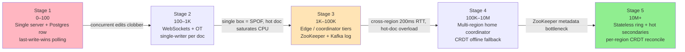

# 📝 Design Google Docs

> **Pattern**: Real-time Collaboration / OT/CRDT
> **Difficulty**: Hard
> **Source**: [hellointerview.com](https://www.hellointerview.com/learn/system-design/problem-breakdowns/google-docs)

> **Summary**: Google Docs is a browser-based collaborative editor where many people type into the same document at once and every view must stay byte-consistent despite dropped packets, sleeping tabs, and edits landing on top of each other. Scoped to plain text for an interview, the design routes every operation through a single-writer coordinator per document that totally orders edits, transforms concurrent operations against each other with **Operational Transformation (OT)**, assigns a monotonic revision, and persists to an append-only operation log with periodic snapshots. Presence (cursors) is ephemeral and never logged; offline edits buffer locally and rebase against the server log on reconnect, falling back to a three-way merge when the log has been truncated.

## 📋 Table of Contents

- [Understanding the Problem](#understanding-the-problem)
  - [Functional Requirements](#functional-requirements)
  - [Non-Functional Requirements](#non-functional-requirements)
- [Layman's Explanation](#laymans-explanation)
- [Core Entities](#core-entities)
- [API Design](#api-design)
- [High-Level Design](#high-level-design)
- [Deep Dives](#deep-dives)
  - [1. Operational Transformation vs CRDT](#1-operational-transformation-vs-crdt)
  - [2. Cursor and Presence](#2-cursor-and-presence)
  - [3. Conflict Resolution Walkthrough](#3-conflict-resolution-walkthrough)
  - [4. Offline Edits and Reconnection](#4-offline-edits-and-reconnection)
  - [5. Scaling WebSocket Connections](#5-scaling-websocket-connections)
  - [6. Storage: Snapshots and the Operation Log](#6-storage-snapshots-and-the-operation-log)
- [Scaling Journey: 0 to Infinity](#scaling-journey-0-to-infinity)
  - [Stage 1: 0 to 100 Users (MVP)](#stage-1-0-to-100-users-mvp)
  - [Stage 2: 100 to 1K Users](#stage-2-100-to-1k-users)
  - [Stage 3: 1K to 100K Users](#stage-3-1k-to-100k-users)
  - [Stage 4: 100K to 10M Users](#stage-4-100k-to-10m-users)
  - [Stage 5: 10M+ Users](#stage-5-10m-users)
- [Insider Tips and Tricks](#insider-tips-and-tricks)
- [Expected Depth by Level](#expected-depth-by-level)
- [Related Concepts](#related-concepts)

---

## 🎯 Understanding the Problem

Google Docs is a browser-based rich-text editor that lets many users edit the same document at the same time. The hard parts are not rendering text; they are keeping everyone's view consistent to the byte while the network drops packets, tabs go to sleep, and users type on top of each other. Two insertions arriving at the server at the same index cannot both "win" naively, or the document diverges forever.

For an interview, scope should be pulled down to a plain-text editor. The collaboration mechanics are the interesting part; menus, formatting, and comments are features that sit on top.

### Functional Requirements

**Core**

1. A user can create a new document and share its link with others.
2. Multiple users can edit the same document concurrently, and each edit is visible to every other collaborator in near real time.
3. The editor shows which collaborators are currently in the doc and where each of their cursors is.
4. A user who briefly loses connectivity can keep typing locally and have their edits merge cleanly on reconnect.

**Below the line**

1. Rich formatting, images, tables, comments, suggestions.
2. Permissions, sharing controls, and access management.
3. Version history and per-character blame.
4. Export to PDF/Word.

### Non-Functional Requirements

**Core**

1. Remote edits visible within roughly 100-200 ms under normal conditions.
2. Strong eventual consistency: every collaborator converges to the same document state once they have seen the same set of operations.
3. Durable edits: no acknowledged keystroke is ever lost, even if the editing server crashes.
4. High availability for the editing path; brief unavailability of snapshot storage is tolerable.
5. Scale to tens of millions of concurrent editors, with hot documents of up to low hundreds of simultaneous cursors.

**Below the line**

1. End-to-end encryption.
2. Fine-grained audit trails and DLP.

---

## 🧒 Layman's Explanation

Imagine a giant chalkboard in a classroom and twenty people are scribbling on it at the same time. Alice is writing a sentence at the left edge. Bob is erasing a word in the middle. Carol is drawing a diagram at the bottom. For everyone to walk away seeing the same chalkboard, somebody has to figure out the order of these scribbles and how each scribble shifts the meaning of the next one. That somebody is the Google Docs server.

Or picture a band jamming together. The drummer doesn't ask permission before hitting a beat — everyone plays simultaneously. The reason it doesn't sound like noise is that they share a rhythm. In Google Docs, the "rhythm" is the document's revision number: every edit is stamped with one, and that's how everybody stays on the same beat.

Or think of a shared notebook where every keystroke is recorded by an arbiter sitting in the middle of the room. If two people cross out the same word at the same instant, the arbiter looks at who got there first and decides which crossing-out actually happened.

The clever trick the arbiter uses is called **Operational Transformation (OT)**. If Alice inserts two characters at position 5, and Bob's edit was meant for position 5 too, the arbiter says "Bob, your edit actually happens at position 7 now, because Alice's insert pushed everything to the right." That rewriting is what keeps the chalkboard consistent.

A few other things the system handles:

- **Single-writer coordinator**: every document has one server in charge of its edit history, so there's never any confusion about what order things happened in.
- **Cursors and presence**: you can see the colored cursors of everyone else editing, but those cursor blips aren't saved forever — they're ephemeral, like the band's hand gestures during a jam, not the recorded song.
- **Offline editing**: if your wifi drops, you keep typing into a local buffer. When you reconnect, the server "rebases" your edits on top of whatever changes happened while you were gone — same idea as `git pull --rebase`.

### When the analogy breaks down

Real Google Docs is far more than a chalkboard. It handles rich text formatting (bold, headings, fonts), embedded comments and suggestions, full version history (so you can roll back to last Tuesday), exports to PDF and Word, granular sharing permissions, and tens of millions of concurrent documents across the planet. The chalkboard analogy gets the *concurrency* right, but it hides the mountain of features built on top.

---

## 🔑 Core Entities

- **Document**: The logical unit being edited. Has a `doc_id`, an owner, a monotonically increasing `revision` number, and a current text blob (materialized from operations).
- **Operation**: The atomic edit. In the OT model this is typically `{op_id, doc_id, client_id, base_revision, type: insert|delete|retain, position, payload}`. Operations are totally ordered per document by the server.
- **Snapshot**: The materialized text at a specific revision, used to bound replay cost. `{doc_id, revision, blob_ref, created_at}`.
- **Session**: A live connection between a single client tab and the editing server. Carries `{session_id, doc_id, user_id, client_id, last_acked_revision}`.
- **Presence**: Ephemeral per-session state broadcast to peers: cursor position, selection range, name color, last heartbeat. Not durable.
- **User**: `{user_id, display_name, avatar}` - used only to render presence chips.



> 📖 **Durable vs ephemeral.** `DOCUMENT`, `OPERATION`, and `SNAPSHOT` are the durable state of record. `SESSION` and `PRESENCE` are live, in-memory, and disappear on disconnect — dashed intent here: presence is broadcast to peers but never written to the operation log.

---

## 🔌 API Design

The editing path is split between REST for document lifecycle and a WebSocket channel for the hot path.

```
POST   /v1/documents                         -> { doc_id }
GET    /v1/documents/{doc_id}                -> { revision, text, collaborators }
POST   /v1/documents/{doc_id}/share          -> { share_link }

WS     /v1/documents/{doc_id}/stream         (upgrade)
  client -> server frames:
    { type: "op",       op_id, base_revision, ops: [...] }
    { type: "cursor",   position, selection_anchor, selection_head }
    { type: "ack",      up_to_revision }
    { type: "ping" }

  server -> client frames:
    { type: "ack",      op_id, assigned_revision }
    { type: "op",       from_client, revision, ops: [...] }
    { type: "presence", sessions: [{ user_id, cursor, color }] }
    { type: "snapshot", revision, text }   // used on join / resync
```

A single WebSocket is multiplexed for edits, presence, and server-initiated catch-up. The `base_revision` sent by the client tells the server which server state the client believed it was editing against; the server uses this to decide whether transformation is needed.

---

## 🏗️ High-Level Design

At the logical level, four flows need to work:

1. **Open the doc.** Client hits the REST load endpoint, gets a snapshot plus any operations after that snapshot revision, reconstructs the current text, then opens a WebSocket to start receiving future operations.
2. **Edit locally.** The editor produces a local operation, applies it optimistically to the DOM, tags it with the client's current `base_revision`, and sends it over the WebSocket.
3. **Server serializes.** A single authoritative writer per document receives the op, transforms it against any operations that committed since `base_revision`, assigns the next revision number, persists it to the operation log, and broadcasts the transformed op to all other sessions.
4. **Peers apply.** Each peer receives the op with its revision number, applies it to its local copy, and advances its `last_acked_revision`.



The critical invariant is that all operations on a given document flow through one place - a single-writer coordinator - because concurrent independent transforms on two servers would diverge. The rest of the system (snapshots, presence fan-out, WebSocket termination) can be horizontally scaled freely.

> 💡 **The single-writer coordinator is the load-bearing assumption.** Every operation for a document flows through exactly one coordinator process — not for performance, but for correctness. If two coordinators independently transformed and committed ops for the same doc, its revision sequence would fork into two incompatible histories. Everything else (edge WebSocket termination, snapshots, presence fan-out) scales horizontally; the coordinator is the one place that must not.

---

## 🔬 Deep Dives

### 1. Operational Transformation vs CRDT

Two approaches dominate real-time collaborative editors.

**Operational Transformation (OT)** - what Google Docs actually uses. Operations are indexed (`insert at position 5`). When two concurrent operations arrive, the server "transforms" one against the other so that its index accounts for the effect of the first. Example: client A inserts "X" at index 3, client B concurrently inserts "Y" at index 3. The server accepts A first, then rewrites B's op to insert "Y" at index 4. OT requires a central, trusted authority to do the transformation; free-for-all peer-to-peer OT is notoriously hard to get right because of the TP2 transformation property.

OT theory defines two transformation properties. TP1 is the basic convergence property: if two operations O1 and O2 are concurrent, then applying `transform(O1, O2)` after O2 produces the same result as applying `transform(O2, O1)` after O1. Almost every OT implementation satisfies TP1. TP2 is a stronger property required only in peer-to-peer (more than two sites) topologies: it guarantees that the order in which you compose transforms does not matter. TP2 is extremely difficult to satisfy correctly — the literature is littered with algorithms that claim TP2 compliance but diverge under specific three-site concurrent edit sequences. Jupiter, the algorithm underlying Google Wave and early Google Docs, sidesteps TP2 entirely by routing all operations through a single server, reducing the problem to a series of two-site transforms.

**CRDTs** (RGA, Yjs, Automerge) - each character gets a unique, globally orderable identifier (usually `(site_id, lamport_clock)`) and operations commute by construction. Two peers that have seen the same set of operations end up with the same document regardless of arrival order. This makes CRDTs friendlier for offline and P2P, but they add per-character metadata overhead. Older CRDT implementations carried 5-10x the raw text size in metadata. Modern run-length encoding in Yjs brings this down to approximately 1.5-2x for typical prose editing workloads, making CRDTs viable for documents up to hundreds of kilobytes of text.

**Trade-off for Google Docs**: OT wins because the product already has a centralized server for auth and sharing, latency is dominated by the round trip (not by conflict resolution cost), and OT produces a clean linear revision history which powers features like version history and suggestions. CRDTs become attractive when offline-first matters more (Apple Notes, Notion offline, Figma for some structures), or when the per-document metadata budget is acceptable.

### 2. Cursor and Presence

Presence is deliberately *not* durable. Treating cursor positions like edits would explode the operation log (every mouse move) and pollute version history. Presence must never be written to the durable operation log — it is kept entirely in-memory on the coordinator and broadcast as ephemeral frames on the WebSocket, never fsynced to disk.

- Cursors ride the same WebSocket but on a separate frame type.
- The coordinator keeps an in-memory map `session_id -> {cursor, selection, last_seen}` and fans out a batched presence message every 100-200 ms (approximately 5 Hz), not on every move. Throttling to ~5 Hz matters at scale: with N active cursors and M operations per second, naive per-move broadcasting creates an N × M fan-out that overwhelms both the coordinator's outbound bandwidth and clients' rendering budgets.
- A cursor position is stored as an index into the *current* server revision. When a new op arrives, each peer transforms its local record of remote cursors the same way it transforms its own cursor after a remote edit, so cursors stay anchored to the right character.
- Heartbeat timeout (30 s) removes stale presences. When the coordinator restarts, all in-memory presence state is lost; clients rebuild it within one heartbeat cycle by sending their next presence frame, so the recovery is invisible to users.

### 3. Conflict Resolution Walkthrough

Consider document `"hello"` at revision 10.

- Client A (at rev 10) types space+"world" -> local op `insert(5, " world")` tagged `base_revision=10`.
- Client B (at rev 10) simultaneously deletes "lo" -> local op `delete(3, 2)` tagged `base_revision=10`.

B's packet arrives first. Server accepts `delete(3, 2)`, advances to revision 11, broadcasts. Document is now `"hel"`.

A's packet `insert(5, " world") @ base=10` arrives. Server sees A is behind by one op. It transforms A against B's delete: positions at or after 3 shift left by 2. Index 5 becomes 3. Transformed op is `insert(3, " world")`, assigned revision 12. Document becomes `"hel world"`.

Broadcast goes out:
- To A: ack with `assigned_revision=12` and also the earlier op from B (which A had not yet seen). A applies B's op first, then reconciles its optimistic local edit to match what the server finalized.
- To B: A's transformed op at revision 12. B applies it.



Both clients converge to `"hel world"`. Note that naive "last write wins" would have deleted part of A's insert or placed it at the wrong index; OT is what makes this correct.

A critical correctness point: the server assigns all revision numbers using its own monotonic counter. The `ts` field that clients include in operation frames cannot be trusted for ordering — client clocks can differ by seconds or minutes, and two concurrent operations from different clients may report timestamps that cross over. Wall-clock timestamps from clients are used only for display purposes (e.g., "last edited 3 minutes ago") and must never influence the transformation pipeline or operation ordering.

> ⚠️ **Client clocks are not a clock.** Order every operation by the coordinator's own monotonic revision counter, never by the client's `ts`. Two concurrent ops from different devices can report crossed-over timestamps, so wall time is display-only ("last edited 3 minutes ago") and must never leak into the transformation pipeline.

### 4. Offline Edits and Reconnection

While disconnected, the client keeps accepting keystrokes, appending them to a local pending queue, and applying them to its local DOM. Each pending op carries the `base_revision` it was created against - always the last revision the client saw from the server.



On reconnect:

1. Client reopens the WebSocket and sends its `last_acked_revision` and its queue of pending ops.
2. Server compares with the current document revision. If the gap is small (say < N thousand ops), it replays the missing ops from the operation log into a transformation pipeline, rebasing the client's queued ops one by one against each intervening server op.
3. Each rebased op is assigned a new revision and broadcast. Client receives acks and reconciles.
4. If the gap is too large — specifically, if the log entries the client needs have been truncated after snapshot compaction — rebase is impossible. The server sends a fresh snapshot and the client must perform a three-way merge: its local (offline-edited) text, the pre-offline baseline the client remembers, and the server's current snapshot. This is structurally identical to `git merge`: find the common ancestor, apply both diverging changesets, and surface conflicts where they overlap. Most production implementations show a conflict dialog at this point. This is where users occasionally see the dreaded "some of your changes could not be saved."

Operation logs are truncated periodically after a snapshot is taken and a retention window expires. A client offline long enough to fall outside that retention window hits this hard limit — it cannot be rebased, and must accept the three-way merge fallback.

CRDTs are more graceful here because every local op is already globally orderable by its `(site_id, lamport_clock)` vector clock and does not need rebasing against a server log. A CRDT client that reconnects after weeks offline simply ships its local op set; the server performs a set-union merge. This is the strongest argument for hybrid designs: OT on the hot path for its clean linear history, CRDT-style vector clocks at the edges for long offline windows where log-based rebase is unavailable.

### 5. Scaling WebSocket Connections

The WebSocket fleet is stateless with respect to documents - any edge node can terminate any client - but routing inside is not.

- **Edge tier (stateless)**: A fleet of WebSocket terminators behind a load balancer that supports sticky sessions or consistent hashing. These nodes do TLS, authentication, and frame parsing only.
- **Coordinator tier (stateful, single-writer per doc)**: Each doc is assigned to exactly one coordinator process via consistent hashing on `doc_id`. All ops for a doc land on its coordinator. Edge nodes look up the coordinator from a placement service (e.g., ZooKeeper or an in-memory routing cache) and forward the frame.
- **Presence fan-out**: The coordinator owns the authoritative session list for its docs; it pushes updates to the edge nodes that currently host those sessions.
- **Failover**: When a coordinator dies, the placement service elects a new one. The new coordinator rebuilds state by replaying the operation log from the latest snapshot. Clients experience a short stall and reconnect. The critical correctness requirement during failover is not just speed of election — it is guaranteeing that the old coordinator has fully stopped processing before the new one starts. A fencing token (a monotonically increasing epoch number, sometimes called a "generation number") enforces this: the new coordinator writes its epoch to a shared store, and any late-arriving write from the old coordinator that carries a stale epoch is rejected. Without a fencing token, a coordinator that is slow to die (e.g., paused by a GC or a network partition) can race with its successor and produce two diverging revision sequences for the same document.



> ⚠️ **Failover correctness is about stopping the old writer, not electing fast.** The dangerous case is a coordinator that is slow to die — paused by a GC or stuck behind a network partition — racing its successor. A fencing token (a monotonically increasing epoch) lets the new coordinator reject any late write carrying a stale epoch, so two coordinators can never both commit to the same document and fork its revision sequence.

To prevent a slow client from stalling op delivery to all other collaborators on the same document, each session on the coordinator maintains an application-level send queue with a maximum depth (typically a few hundred frames). If the queue fills because the client is not draining the socket fast enough, the coordinator switches that session to "catch-up mode": it stops enqueuing incremental ops and waits until the client drains, then sends a single snapshot to resynchronize. This is necessary because TCP's flow control will eventually back-pressure a slow client, but only after hundreds of frames have already accumulated in the kernel socket buffer — by which point the coordinator may be blocked on a socket write, delaying broadcasts to all other sessions.

Capacity back-of-envelope: a modern Linux box with tuned kernel settings can hold ~500K-1M idle WebSockets, but "active editing" workloads cap out much earlier (CPU for op transform, fan-out). Plan ~10-50K active sessions per coordinator process, sharded across a fleet.

### 6. Storage: Snapshots and the Operation Log

The durability story has two halves.

- **Operation log (append-only, hot)**: Every committed op is written to a replicated log keyed by `(doc_id, revision)`. This is the source of truth for ordering and for rebuild after coordinator failover. Implementation choices: a Kafka topic partitioned by doc_id, a sharded MySQL table with strict per-doc ordering, or a specialized log like Bigtable with single-row commits per doc. Fsync before ack, otherwise a crash loses keystrokes.
- **Snapshots (periodic, cold)**: Every N ops or M minutes, the coordinator materializes the text and writes it to blob storage (S3/GCS) as `{doc_id, revision}.blob`. Load path reads the latest snapshot plus operations after that revision; this bounds startup cost even for docs with millions of edits over years. Snapshot frequency is a direct operational SLO lever for failover recovery time: when a coordinator crashes, its replacement replays the operation log from the most recent snapshot. If you snapshot every 1,000 operations and a hot document receives 10,000 operations per hour, a freshly crashed doc requires up to 6 minutes of log replay before it can accept new edits. Most production systems target a snapshot interval of 100–500 operations for interactive documents, trading slightly higher storage write rates for much shorter recovery windows.
- **Operation compression**: Raw character-by-character operations bloat the log significantly. A user typing "hello world" produces 11 separate insert operations. Consecutive inserts at the same cursor position — the dominant pattern during normal typing — can be collapsed into a single `insert(position, "hello world")` operation before the op is persisted. A delete immediately followed by an insert at the same position can often be represented as a single replace. Production OT systems perform this compression either at the coordinator before writing to the log or during snapshot generation. The result is typically a 90%+ reduction in log entry count for normal prose editing workloads, which also dramatically shortens failover replay time.
- **Compaction**: Old log entries behind a snapshot can be archived to cold storage for version history but dropped from the hot log after a configured retention window. Once the retention window passes and the entries are no longer needed for rebase, they move to cold object storage (e.g., Glacier or equivalent) where they are queryable for the version history UI but do not consume hot-tier I/O or storage budget.

---

## 📈 Scaling Journey: 0 to Infinity

This journey is my original framing for how to evolve a Google Docs backend. It is not a verbatim scale-up path from the interview; it is a reasoned trajectory through the specific inflection points of collaborative editing.



### Stage 1: 0 to 100 Users (MVP)

**Goal**: Prove the product. One shared doc, two or three friends editing at once, never more.

**Architecture**: One Node.js / Python server. Documents live in a single Postgres row as a text column. Every edit is a PATCH that overwrites the whole text with last-write-wins. Polling every 2 seconds for "new version". No WebSockets, no OT, no presence. A cron dumps the DB to S3 nightly.

**What you skip**: Real-time anything. Conflict resolution. Cursors. Offline. You are consciously shipping a shared whiteboard that mangles concurrent edits.

**Failure mode into next stage**: The first time two users edit the same sentence and one person's paragraph vanishes, users revolt. You need actual concurrent edit handling.

### Stage 2: 100 to 1K Users

**Goal**: Make concurrent editing on the same document correct, even if crude.

**Architecture**: Introduce WebSockets and a single-writer-per-doc model. Each doc is pinned to one process on one server (in-memory map `doc_id -> document state`). Clients send character-granularity operations (`insert`, `delete`) instead of whole-text patches. The server applies them in arrival order and broadcasts. Add basic OT transformation for the case where a client's op was built against an older revision. Persist every op to Postgres in an `operations` table with `(doc_id, revision)` as a composite PK. Snapshot every 500 ops.

**What you skip**: Multiple coordinator servers, geo-routing, offline edits longer than a few seconds, presence beyond "who is here" (no cursors yet).

**Failure mode into next stage**: Everything lives on one box. It goes down, every doc is offline. Also, a viral doc with 50 editors saturates that server's CPU transforming ops.

### Stage 3: 1K to 100K Users

**Goal**: Horizontal scale and durable failover.

**Architecture**: Split tiers. Stateless WebSocket edge nodes behind an LB. Coordinator tier behind a placement service (ZooKeeper) that assigns each `doc_id` to a specific coordinator via consistent hashing. Add cursor and selection broadcasting as ephemeral presence frames, throttled to ~5 Hz. Move the operation log off Postgres onto Kafka (partitioned by `doc_id`) for higher write throughput and cheap replay. Snapshots go to S3. On coordinator crash, placement service reassigns the doc, new coordinator replays from the last snapshot + Kafka.

**What you skip**: Multi-region. Offline editing that spans hours. Rich formatting. Comments.

**Failure mode into next stage**: A single Kafka cluster and a single region means European users see 200+ ms RTT to the US edge, which feels laggy mid-typing. Hot docs (viral meeting notes with 300 editors) overload one coordinator.

### Stage 4: 100K to 10M Users

**Goal**: Global latency and headroom for hot docs and long offline sessions.

**Architecture**: Multi-region. Coordinators run in each region but a given doc still has exactly one active coordinator globally (the home region), chosen based on first-edit locality or owner's region. Edge nodes in other regions proxy WebSockets to the home region over persistent backend connections. Introduce a CRDT-flavored fallback path for offline: clients that have been disconnected long enough to fall out of the replay window switch to a vector-clock reconciliation protocol where each queued op carries a Lamport-style ID, and the server performs a set-union merge followed by text re-derivation. For hot docs, shard presence fan-out onto a dedicated pub/sub layer (Redis Streams or a custom gossip mesh) so op delivery is not bottlenecked by presence chatter. Operation log moves onto a purpose-built log service (think internal Bigtable or Spanner) with per-doc single-row transactions for the `(doc_id, revision)` commit.

**What you skip**: Full offline-first CRDT for the hot path, cross-region active-active for the same doc, end-to-end encryption.

**Failure mode into next stage**: At 10M+ concurrent sessions, the placement service (ZooKeeper) becomes a metadata bottleneck. A failing region leaves its docs unwritable until failover completes. Global hot docs (viral docs being edited by users in five continents simultaneously) thrash the home-region coordinator.

### Stage 5: 10M+ Users

**Goal**: Always-on editing, planet-scale, with graceful degradation.

**Architecture**: Multi-tier routing. Consistent hashing on `doc_id` is pushed down into the edge fleet with local caches, so only rare lookups hit the placement service. Placement itself is rebuilt on a Raft-backed, shardable metadata store (not a single ZooKeeper ensemble) so it scales with doc count, not just with cluster size. Coordinators run as a stateless ring where state is continuously replicated to two secondaries in the same region; failover is sub-second and does not need a log replay because the secondary already has the live in-memory state. For docs with truly global co-editing, relax strict single-writer: a per-region coordinator accepts ops locally using CRDT semantics (each region is a "site" with a unique ID), and a background reconciler merges region-local logs into a globally ordered OT history asynchronously. Users see instant local feedback; cross-region convergence is visible within a second or two. Snapshots and operation logs tier automatically: hot ops in region-local SSD, warm in regional object storage, cold archived across regions for version history. Admission control and quality-of-service kick in for abusive docs (tens of thousands of tabs on one doc) - new joiners get read-only mode until fan-out capacity is freed.

**What you skip**: Nothing architectural; at this stage you are mostly paying engineers to drive tail latency down and to handle adversarial inputs.

---

## 💡 Insider Tips and Tricks

### OT's TP2 Property Is Why Peer-to-Peer OT Fails in Practice

Operational Transformation has two transformation properties: TP1 (the basic convergence property, which simple OT satisfies) and TP2 (required for peer-to-peer topologies with more than two sites). Very few OT algorithms correctly implement TP2 — Jupiter, the algorithm that underpins Google Wave and early Google Docs, solves convergence by requiring a central server as the single serialization point, which sidesteps TP2 entirely. When engineers try to implement OT without a central authority, they almost always get TP2 wrong and produce systems that diverge silently under concurrent edits from three or more clients.

### The Single-Writer Coordinator Is the Design's Load-Bearing Assumption

Every operation for a given document flows through exactly one coordinator process. This is not a performance choice — it is a correctness requirement. If two coordinators independently transformed and committed operations for the same document, the revision sequences would diverge and the document would split into two incompatible histories. When designing failover, the key question is not "how fast can we elect a new coordinator?" but "how do we guarantee that the old coordinator has fully stopped processing before the new one starts?" Leader election with a fencing token (a monotonically increasing epoch number) is the standard answer.

### Presence Must Never Touch the Operation Log

Cursor position updates can arrive hundreds of times per second per user. If presence were written to the same durable operation log as text edits, the log would grow by orders of magnitude and version history would be polluted with meaningless cursor-move entries. Keep presence entirely in-memory on the coordinator and broadcast it as ephemeral frames on the WebSocket — never fsync'd. When the coordinator restarts, presence state is simply lost and rebuilt from client heartbeats within one cycle.

### Snapshot Frequency Bounds Your Failover Recovery Time

When a coordinator crashes, the replacement replays the operation log from the most recent snapshot. If you snapshot every 1,000 operations and your hot documents receive 10,000 operations per hour, a freshly crashed doc takes up to 6 minutes of log replay before accepting new edits — during which all collaborators see a spinning cursor. Snapshot frequency is therefore an operational SLO lever: snapshot more often to shorten recovery, snapshot less often to reduce storage writes. Most systems target a snapshot interval of 100–500 operations for interactive documents.

### Client Clock Skew Makes Wall Time Unreliable for Operation Ordering

Client devices can have clocks that differ by seconds or even minutes. An operation's `ts` field sent from the client cannot be trusted for ordering — two clients that submit concurrent operations might report timestamps that cross over. The server must assign all ordering, using its own monotonic revision counter. Wall-clock timestamps from clients are useful only for display (e.g., "last edited 3 minutes ago") and must never be used as a tiebreaker in the transformation pipeline.

### Offline Rebase Has a Hard Limit: The Log Truncation Window

When a client reconnects after a long offline period, the server replays missing operations from the operation log and rebases the client's pending edits. But operation logs are truncated periodically (after a snapshot is taken and some retention period). If the client was offline long enough that the log entries it needs have been truncated, rebase is impossible. At that point the server sends a fresh snapshot and the client must perform a three-way merge of its local text, the pre-offline baseline, and the server's current text — the same algorithm used by `git merge`. Most implementations fall back to showing a conflict dialog.

### Operation Compression Reduces Log Volume by 90%+ for Typical Editing

Raw character-by-character operations bloat the log. A user typing "hello world" generates 11 separate insert operations, each individually small but collectively expensive to store and replay. Consecutive inserts at the same cursor position (common during typing) can be collapsed into a single `insert(position, "hello world")` operation. Similarly, a delete followed immediately by an insert at the same position can often be represented as a single replace. Most production OT systems perform this compression either at the coordinator before persisting or during snapshot generation.

### WebSocket Backpressure Must Be Explicit, Not Just TCP's Sliding Window

TCP's flow control will eventually back-pressure a slow client, but by that time you've already queued hundreds of operation frames in the server-side socket buffer. This means the coordinator may be blocked trying to write to a slow client's socket while other clients' operations are waiting to be broadcast. The fix is an application-level send queue per session with a maximum depth. If the queue fills, the coordinator switches that session to "catch-up mode": it stops sending incremental ops and instead sends a snapshot when the client drains. This prevents one slow client from stalling op broadcast to all other collaborators on the same doc.

---

## 🎓 Expected Depth by Level

| Area | Mid-level | Senior | Staff |
| --- | --- | --- | --- |
| Requirements | Lists core FR/NFR accurately | Pushes back on scope, quantifies latency and consistency | Frames the problem as "single-writer coordination + fan-out", names the core trade-off upfront |
| Core entities | Doc, op, user | Adds session, snapshot, presence, revision | Distinguishes durable vs ephemeral state and justifies why presence is not logged |
| API | REST create, WebSocket for edits | Separate frame types for ops, cursor, ack; explains `base_revision` | Discusses idempotency of op replay on reconnect, backpressure, and frame-level flow control |
| Architecture | Client -> server -> DB with WebSocket | Single-writer coordinator per doc, op log, snapshots | Placement service, failover story, regional routing, hot-doc handling |
| OT vs CRDT | Names both, picks one | Walks through a concrete transform example, explains why OT fits a centralized server | Discusses TP2, CRDT metadata overhead, hybrid designs, offline fallback |
| Conflict resolution | Describes "server decides order" | Shows a two-client concurrent edit being transformed | Handles cursor transformation, operation compression, ack reconciliation |
| Offline | Mentions local buffer | Rebase on reconnect against server log | Bounds replay window with snapshots, explains CRDT-style fallback when log is truncated |
| Scaling | Adds replicas and a cache | Sharding by `doc_id`, consistent hashing, stateless edge | Multi-region coordination, metadata plane scaling, QoS for hot docs |
| Storage | One table of documents | Operation log + periodic snapshots | Log retention, cold tiering, compaction, implications for version history |

---

## 📚 Related Concepts

- [Distributed Locking](../CoreConcepts/DistributedLocking.md) — the single-writer coordinator, leader election, and the fencing-token epoch that makes failover safe.
- [Consistent Hashing](../CoreConcepts/ConsistentHashing.md) — mapping each `doc_id` to exactly one coordinator, and pushing that lookup down into the edge fleet.
- [Sharding](../CoreConcepts/Sharding.md) — sharding the operation log and coordinator fleet by `doc_id`, and per-region cell isolation.
- [Networking](../CoreConcepts/Networking.md) — the WebSocket hot path (ops, cursor, ack frames) vs REST for document lifecycle, and application-level backpressure.
- [Redis](../CoreConcepts/Redis.md) — in-memory presence state and the Redis Streams pub/sub layer for presence fan-out on hot docs.
- [Real-Time Updates](../SystemDesign/Patterns/Real-TimeUpdates.md) — pushing server-initiated operation and presence frames to connected clients.
- [Dealing With Contention](../SystemDesign/Patterns/DealingWithContention.md) — concurrent edits at the same index and why serialization through one writer resolves them.
- [Kafka](../SystemDesign/DeepDives/Kafka.md) — the append-only operation log partitioned by `doc_id` for durable ordering and cheap replay.
- [Zookeeper](../SystemDesign/DeepDives/Zookeeper.md) — the placement service that assigns docs to coordinators and elects a new one on failover.
- [Google Docs (HelloInterview breakdown)](../SystemDesign/ProblemBreakdowns/GoogleDocs.md) — the source breakdown this doc expands on.
