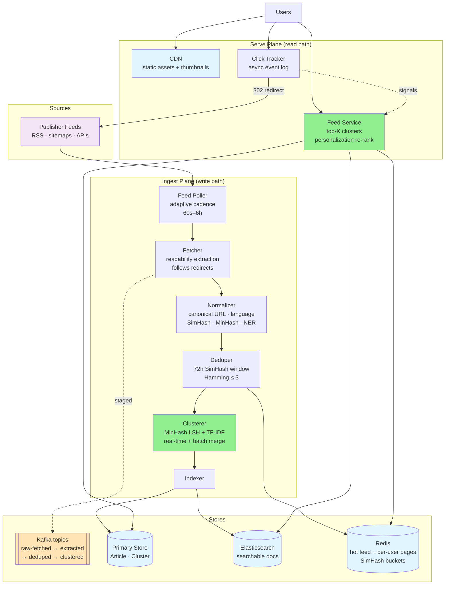
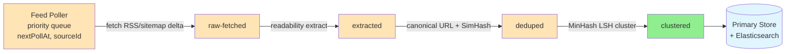
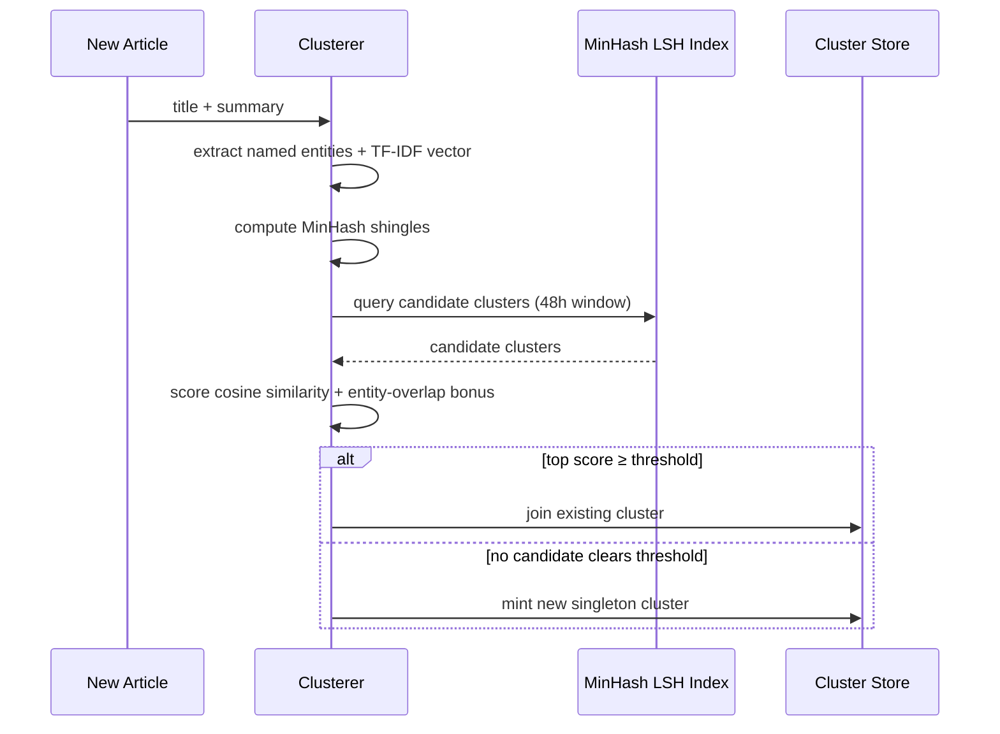
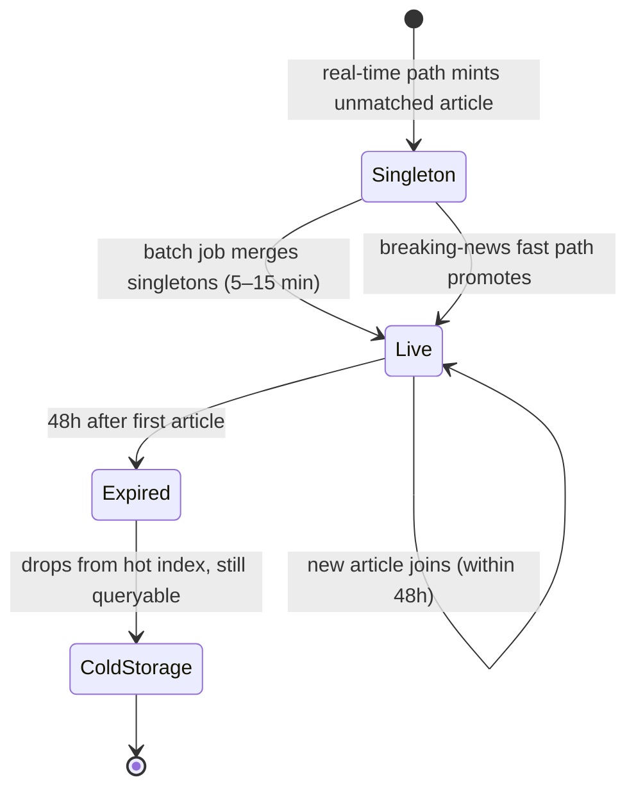
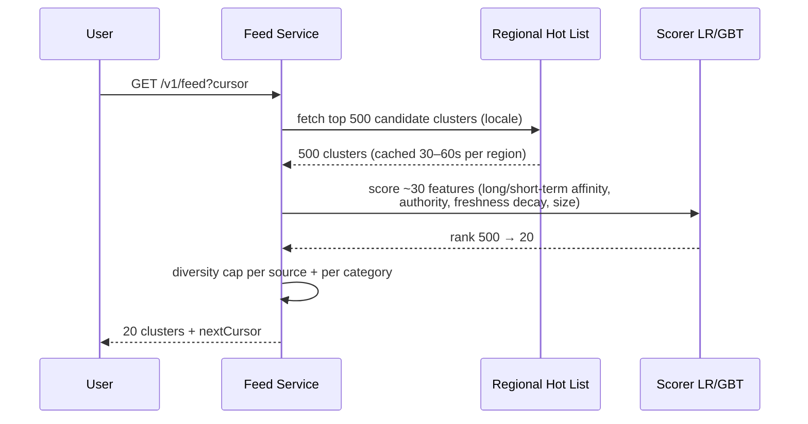
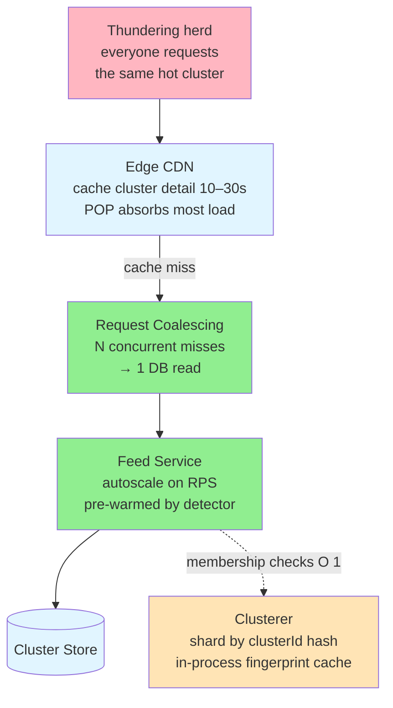

# 📰 Design News Aggregator (Google News)

> **Pattern**: Content Ingestion / Clustering
> **Difficulty**: Medium
> **Source**: [hellointerview.com](https://www.hellointerview.com/learn/system-design/problem-breakdowns/google-news)

> **Summary**: A news aggregator continuously polls thousands of publisher feeds, deduplicates wire-syndicated copies, and clusters independently-written articles about the same event into one browsable card — never hosting the article body, only headline, thumbnail, and a redirect. The hard parts are an adaptive crawl scheduler over 100K+ pull-based sources, near-duplicate detection (SimHash) plus event clustering (MinHash LSH real-time singletons merged by a batch job), a two-vector personalization re-ranker over implicit signals, and holding a read-heavy feed under 200 ms while breaking news multiplies traffic 10–50x. The mature design is a Kafka-staged ingest pipeline feeding a Redis/Elasticsearch serve plane with edge-side personalization.

## 📋 Table of Contents

- [Understanding the Problem](#understanding-the-problem)
  - [Functional Requirements](#functional-requirements)
  - [Non-Functional Requirements](#non-functional-requirements)
- [Layman's Explanation](#laymans-explanation)
- [Core Entities](#core-entities)
- [API Design](#api-design)
- [High-Level Design](#high-level-design)
- [Deep Dives](#deep-dives)
  - [1. Ingest Pipeline](#1-ingest-pipeline)
  - [2. Clustering and Deduplication](#2-clustering-and-deduplication)
  - [3. Personalization](#3-personalization)
  - [4. Freshness and Breaking-News Spikes](#4-freshness-and-breaking-news-spikes)
- [Scaling Journey: 0 → ∞](#scaling-journey-0--)
  - [Stage 1: 0 – 100 Users](#stage-1-0--100-users)
  - [Stage 2: 100 – 1K Users](#stage-2-100--1k-users)
  - [Stage 3: 1K – 100K Users](#stage-3-1k--100k-users)
  - [Stage 4: 100K – 10M Users](#stage-4-100k--10m-users)
  - [Stage 5: 10M+ Users](#stage-5-10m-users)
- [Insider Tips and Tricks](#insider-tips-and-tricks)
- [Expected Depth by Level](#expected-depth-by-level)
- [Related Concepts](#related-concepts)

---

## 🎯 Understanding the Problem

A news aggregator like Google News pulls articles from thousands of publishers worldwide, groups articles that cover the same story, and presents a single browsable feed. Users land on a home page, scroll through an endless list of stories, and click out to the publisher when they want the full text. The aggregator never hosts the article body — it surfaces headline, thumbnail, source, and a redirect link.

### Functional Requirements

**In scope:**
1. Pull articles continuously from thousands of publisher feeds (RSS, sitemaps, partner APIs).
2. Present users with a reverse-chronological or ranked feed that supports infinite scroll.
3. Redirect clicks to the original publisher URL (no content hosting).

**Out of scope:** bookmarking, saved articles, social sharing, comments, and full-text hosting.

### Non-Functional Requirements

1. **Availability over consistency** — users tolerate a slightly stale feed, but the home page must never be down.
2. **Freshness**: a newly published article should appear in the feed within ~30 minutes of its publish time.
3. **Low feed latency**: under 200 ms for the initial feed load and each scroll page.
4. **Spike resilience**: breaking-news events can multiply read traffic 10–50x in minutes.
5. **Read-heavy**: reads dominate writes by several orders of magnitude.

---

## 🧒 Layman's Explanation

Imagine a **clipping service from the 1950s**: a person sits down every morning, reads every newspaper in the city, snips out the articles relevant to your industry, and mails you a tidy envelope of "everything written about your world today." Google News is exactly that, except automated, instant, and global. Or picture **The Week magazine**, which rounds up news from many sources into a single bundle — Google News does it daily and personalized just for you. Best of all, think of an **airport newsstand** where 30 newspapers are laid out side by side: at a glance you can compare how different outlets covered the same event.

Behind the scenes, a small army of robots is doing the clipping. They **scrape thousands of news websites** (and politely consume RSS feeds where publishers offer them) to pull in fresh articles around the clock. The next problem is repetition: when the Associated Press writes a story, 200 newspapers republish it word-for-word. The system has to **deduplicate** so you don't see the same article 200 times. Even when articles are written independently, many will cover the same event — say, a stock market crash — so the system **clusters** them, presenting one card per story with multiple sources stacked underneath, like that airport newsstand.

Then comes **personalization**: if you keep clicking technology and finance stories, those float to the top while celebrity gossip sinks. And because news has a sharp **freshness** decay (a six-hour-old story is already stale, unlike an evergreen blog post), the system aggressively favors recent items and retires older ones from the hot feed.

### When the analogy breaks down

Real news aggregators wrestle with problems the corner clipping-service never faced: detecting **misinformation**, **balancing political bias** across sources so the feed isn't an echo chamber, navigating **paywalls and copyright** (you can show a headline and snippet but never the full article), and ranking stories using **machine learning over engagement signals** like dwell time and click-through rate at massive scale.

---

## 🔑 Core Entities

| Entity | Description |
|---|---|
| **Article** | A single news item ingested from a publisher. Fields: `articleId`, `sourceId`, `url`, `canonicalUrl`, `title`, `summary`, `thumbnailUrl`, `publishedAt`, `language`, `rawText`, `simHash`, `minHashSignature`, `clusterId`, `namedEntities`. |
| **Source (Publisher)** | An outlet the system pulls from (NYT, BBC, local blog). Fields: `sourceId`, `feedUrl`, `type` (RSS/API/sitemap), `trustScore`, `authorityScore`, `lastPolledAt`, `pollInterval`, `publishRate`. |
| **Cluster (Story)** | A group of articles describing the same real-world event. Fields: `clusterId`, `representativeArticleId`, `topic`, `category`, `firstSeenAt`, `hotness`, `articleCount`, `canonicalEntities`. |
| **User** | A feed consumer. Fields: `userId`, `locale`, `region`, `categoryAffinity`, `sourceAffinity`, `shortTermInterestVector`, `longTermInterestVector`, `lastFeedCursor`. |

Clusters are the user-facing unit. A user scrolling the feed sees one card per cluster; tapping a cluster expands into its member articles.

---

## 🔌 API Design

```
GET /v1/feed?cursor={opaque}&limit={n}&category={optional}
  → { clusters: [{ clusterId, headline, summary, thumb, topSources, publishedAt }...],
      nextCursor }

GET /v1/clusters/{clusterId}
  → { clusterId, articles: [{ articleId, url, title, source, publishedAt }...] }

POST /v1/click
  body: { articleId, clusterId }
  → 302 Redirect to publisher URL

GET /v1/categories
  → [{ id, label }]
```

The feed endpoint returns clusters, not raw articles. Cursor is opaque and encodes a `(score, clusterId)` tuple for stable pagination when the ranking shifts slightly between calls.

---

## 🏗️ High-Level Design

The system splits cleanly into an **ingest plane** (write path) and a **serve plane** (read path), connected by a shared article/cluster store.



**Ingest plane:**
1. **Feed Poller** — a scheduler iterates registered sources on their adaptive polling cadence (60s–6h depending on publish rate) and fetches RSS/sitemap deltas.
2. **Fetcher** — downloads the article HTML, runs readability extraction for title, summary, image, and clean text. Follows all redirects to determine the final URL.
3. **Normalizer** — canonicalizes URLs (strips tracking params like `?utm_source=`, `?ref=`; applies per-domain rules), detects language, generates a SimHash fingerprint and MinHash signature, and runs named entity extraction.
4. **Deduper** — checks SimHash fingerprints against a rolling 72-hour window; articles within Hamming distance 3 are near-duplicates collapsed to the highest-authority canonical. Also deduplicates at the canonical URL level before fingerprinting.
5. **Clusterer** — groups new articles with existing live clusters using MinHash LSH for candidate retrieval and TF-IDF cosine + entity overlap for scoring; creates new singleton clusters for unmatched articles. A separate batch job runs every 5–15 minutes to merge singletons into emerging clusters.
6. **Indexer** — writes the cluster and article records to the primary store and pushes searchable documents into Elasticsearch.

**Serve plane:**
1. **Feed Service** — builds a user's page by pulling the top-K fresh clusters filtered by language/region/category, applying source authority as a ranking feature, and running a personalization re-rank.
2. **Cache Layer** — Redis holds a global "hot feed" and per-user personalized pages; CDN fronts static assets and thumbnails.
3. **Click Tracker** — logs the click event asynchronously (dwell time, article clicked, cluster context) and 302s to the publisher. These events feed the personalization pipeline.

Article text is never served — only the headline, summary, and a thumbnail URL.

---

## 🔬 Deep Dives

### 1. Ingest Pipeline

The pipeline is staged through Kafka topics so each stage scales independently and a slow downstream worker never blocks the fetchers:



**Crawl scheduling is the throttle point.** RSS and Atom feeds are pull-based: there is no push; the system must poll each source URL repeatedly to discover new articles. A naive per-minute sweep of 100K sources would hammer publisher servers and burn bandwidth. The correct model is an **adaptive crawl scheduler**: each source tracks its historical publish rate and derives a `pollInterval` from it — a 24/7 breaking-news wire gets polled every 60 s; a weekly blog every 6 h. The scheduler is a priority queue of `(nextPollAt, sourceId)` entries consumed by a pool of fetcher workers. On every successful fetch, the interval is recalculated from the measured inter-article gap, using exponential smoothing so a single burst does not cause over-polling.

**Canonical URL resolution must precede fingerprinting.** The same article frequently lives at multiple URLs: HTTP vs HTTPS, www vs non-www, mobile subdomain vs desktop, trailing slash variants, and query parameters appended by tracking systems (`?utm_source=twitter`, `?ref=homepage`). If this is not resolved before deduplication, the same article is indexed 5+ times as distinct records. The normalizer follows all HTTP redirects to the final destination URL, then applies a stripping ruleset (a maintained list of known tracking parameter names) and per-domain rules compiled from past observations. Only then is the canonical URL stored and fingerprinted.

**Failure isolation is mandatory at this layer.** Fetches fail often — timeouts, 403s, malformed XML, gzip bombs, DNS failures. Each source runs in an independent task; one bad publisher cannot stall the queue. Failures use exponential backoff capped at the source's normal interval; after a configurable threshold of consecutive failures the source is flagged for operator review. The pipeline is pipelined through Kafka topics (`raw-fetched` → `extracted` → `deduped` → `clustered`) so each stage scales independently and a slow clustering worker cannot block the fetchers.

After fetch, extraction runs through a library like Readability or Trafilatura. The extracted text is **not stored long-term** — only the fingerprint, summary, and named entities survive. This keeps storage cost linear in cluster count rather than article count.

> 💡 **Discard the article body early.** Because the aggregator never hosts full text, keeping only the SimHash fingerprint, summary, and named entities makes storage scale with the number of *clusters* (stories), not the number of *articles* ingested — a large multiplier when 200 outlets syndicate one wire story.

### 2. Clustering and Deduplication

These are two distinct problems that are often conflated.

**Deduplication** catches the same article republished at different URLs — wire service syndication being the canonical example. A SimHash over the article's shingles produces a 64-bit signature; articles within Hamming distance ≤ 3 are considered near-duplicates and collapsed to a single canonical article. Exact content hash deduplication alone is insufficient here: even minor editorial changes (a regional outlet adds a byline or appends a local paragraph to an AP wire story) produce a completely different MD5 but a very similar SimHash. Signatures are stored in Redis keyed by a 16-bit prefix bucket so lookup is O(bucket size) rather than O(N). When duplicates are found, the canonical is chosen by highest source authority score, with earliest publish timestamp as a tiebreaker. Non-canonical duplicates are linked to the canonical rather than dropped entirely, preserving the multi-outlet signal.

**Clustering** groups different articles about the same story — different text, same event. This cannot run pairwise on the full corpus (O(n²)), and it cannot happen in real time in the ingestion hot path. The production approach is a hybrid:

1. **Real-time path**: for each incoming article, extract named entities and a TF-IDF vector from title + summary, compute MinHash shingles, and query an LSH index for candidate clusters within a 48-hour window. Score each candidate with cosine similarity plus entity-overlap bonus. If the top score clears a threshold, join that cluster; otherwise mint a new singleton cluster. This completes in milliseconds per article.
2. **Batch path**: every 5–15 minutes, a clustering job uses MinHash LSH to find candidate pairs among recent singleton clusters and applies a finer similarity model to merge them. This is where "200 outlets all published about the stock market crash" gets consolidated — the real-time path creates 200 singletons; the batch job merges them into one cluster.

The real-time assignment path for a single incoming article:



Clusters have a **lifespan**: a cluster stops accepting new members 48 hours after its first article. A story that re-surfaces later is usually a follow-up worth its own cluster. Expired clusters drop out of the hot index but remain queryable in cold storage.



**Breaking news requires a special fast path.** When a major event breaks, the first few articles have no cluster yet and the normal pipeline would wait for the next batch job. A breaking-news detector watches named entity co-occurrence counts using a count-min sketch over a 15-minute sliding window. A sudden spike in articles mentioning the same named entities triggers immediate real-time promotion of the emerging cluster — skipping the wait for the next batch clustering run.

> ⚠️ **Entity normalization is the hardest part of clustering.** "Apple," "Apple Inc," "AAPL," and "the Cupertino company" must all resolve to the same canonical entity for entity-overlap scoring to work. This requires an NLP pipeline (spaCy or a BERT-based NER model) on every ingested article plus a normalization lookup against an entity knowledge base (Wikidata-style). Without normalization, entity overlap scores are systematically underestimated and related articles are split into separate clusters.

Trade-off: tighter thresholds over-split (many small clusters for one story); looser thresholds merge unrelated stories. The system ships with a threshold tuned on a labeled dev set and re-evaluated offline as the entity model improves.

### 3. Personalization

The out-of-the-box feed is a global hot list ranked by hotness × source authority. Personalization is a re-ranker on top, not a separate feed.

**Implicit signals dominate because users do not fill out interest surveys.** The behavioral signals collected are: articles clicked (strong positive signal), articles that appeared in the feed but were scrolled past without clicking (weak negative), dwell time after clicking (how long the user spent on the article before returning — strong positive), topics and sources clicked repeatedly over a long window (long-term interest model), and topics clicked in the last few hours (short-term interest model). These are collected via the click tracker and a scroll-event beacon.

**User representation is a two-vector model.** A long-term interest vector (updated nightly by a batch job) captures stable preferences — a user who consistently reads technology and finance content. A short-term interest vector (updated after every click by a lightweight online job) captures session intent — the same user who just clicked three articles about a specific earnings report. The final ranking blends both, with short-term given higher weight for recent clusters and long-term for background filling.

**Flow at request time:**
1. The feed service fetches the top 500 candidate clusters from the regional hot list for the user's locale.
2. A lightweight scorer (logistic regression or gradient-boosted tree over ~30 features: long-term affinity, short-term affinity, source authority, freshness decay, topic importance, cluster size) ranks those 500 down to the 20 returned per page.
3. Diversity logic enforces a cap per source and per category so one publisher cannot dominate.



Scoring runs in ~5 ms at the feed server because the expensive feature generation is pre-computed. Candidate generation is cached per-region for 30–60 s because the hot list changes slowly relative to request rate.

### 4. Freshness and Breaking-News Spikes

Two opposing forces: articles must appear within 30 min of publish, but the feed must cache aggressively to stay under 200 ms.

**Freshness is a ranking feature, not just a filter.** A 2-hour-old article about a breaking story should rank above a 5-minute-old article about a minor local event. Pure chronological ordering over-rewards recency; pure relevance ranking can surface stale content. Production feeds blend these with an explicit freshness score: exponential decay from publish time with a configurable half-life (typically ~4 hours for general news, shorter for markets or sports). The final rank score is `freshness_score × source_authority × personalization_score × topic_importance`. The decay half-life is a tunable parameter adjusted per category — sports scores decay faster than investigative pieces.

**Cache invalidation is event-driven, not TTL-only.** A "new articles" Kafka topic feeds a side process that invalidates cached feed pages whenever a cluster's hotness changes materially — new members joining the cluster, or a sudden spike in click velocity. The global hot-list cache has a short TTL (30–60 s) as a backstop. Personalized pages use a longer TTL (2–5 min) because a given user's re-rank is stable over that window. Cache keys include a `contentVersion` stamp so a new version is published as a cache-aside write; old keys expire naturally without a blocking delete.

**Breaking news produces a thundering herd** — everyone requests the same trending cluster simultaneously. Defenses in layers:



- Edge CDN caches the cluster detail response for 10–30 s; every POP absorbs the vast majority of load.
- A request-coalescing layer at the feed service dedupes concurrent upstream fetches for the same cluster to a single DB read — N concurrent misses become 1 read.
- Auto-scaling on the feed service is keyed on request rate, not CPU, because the service is largely cache reads. Pre-warmed capacity is triggered by the breaking-news detector before the spike fully materializes.
- The clusterer shards cluster ownership by `clusterId` hash, so a single hot cluster is pinned to one worker whose fingerprint cache stays in process memory, making membership checks O(1) and avoiding distributed locking on the write-hot path.

---

## 📈 Scaling Journey: 0 → ∞

```mermaid
graph LR
    S1["Stage 1<br/>0–100 users<br/>cron + SQLite + Flask<br/>URL-diff dedupe"]
    S2["Stage 2<br/>100–1K<br/>Postgres + Redis<br/>SimHash dedupe + S3/CDN"]
    S3["Stage 3<br/>1K–100K<br/>Kafka + clustering<br/>Elasticsearch + ZSET"]
    S4["Stage 4<br/>100K–10M<br/>ML personalization<br/>multi-region replicas"]
    S5["Stage 5<br/>10M+<br/>edge personalization<br/>multi-region active serve"]

    S1 -->|"duplicates + cron misses window"| S2
    S2 -->|"same story from N outlets"| S3
    S3 -->|"regional latency + personalization ask"| S4
    S4 -->|"write-hot cluster + new-country latency"| S5

    style S1 fill:#FFB6C1
    style S3 fill:#FFE4B5
    style S5 fill:#90EE90
```



### Stage 1: 0 – 100 Users

**Goal:** prove the product — can we pull articles and show a feed?

**Architecture:**
- One box running a Python script triggered by cron every 5 minutes. It walks a hand-curated list of ~50 RSS feeds, parses them with `feedparser`, and writes rows into SQLite.
- A Flask/FastAPI app serves `GET /feed` with `SELECT * FROM articles ORDER BY published_at DESC LIMIT 50`.
- Deduplication is literally `WHERE url NOT IN (existing_urls)`.
- No clustering. Every article is its own card. No personalization.

**What you skip:** Kafka, Elasticsearch, clustering, caching, personalization, multi-region, authentication. You don't even have users yet — the "feed" is public.

**Failure mode → next stage:** two articles about the same story show up side by side from different wires. The homepage looks like a spammy RSS reader. You need deduplication, and the cron job starts missing its window as the source list grows to a few hundred feeds.

---

### Stage 2: 100 – 1K Users

**Goal:** kill visible duplicates and keep the feed fresh as the source list and traffic grow.

**Architecture:**
- Migrate SQLite → Postgres. Add a `sources` table so polling cadence is data-driven.
- Replace the single cron with a small worker pool using a database-backed job queue (e.g., RQ or a `next_poll_at` column polled by workers).
- Introduce Redis. Cache the `/feed` response for 60 seconds. Store a rolling set of URL + SimHash fingerprints for the last 72 hours of articles; the fetcher rejects near-duplicates by looking up the SimHash bucket in Redis.
- Add a thumbnail resizer writing to S3, fronted by CloudFront.
- Basic readability extraction replaces raw RSS summaries so cards look consistent.

**What you skip:** real online clustering (duplicates are killed, but articles about the same story from different outlets still appear as separate cards), search, personalization, ML ranking.

**Failure mode → next stage:** during a big news moment, the feed is dominated by ten near-identical takes on the same event from ten different outlets — dedupe doesn't catch them because the text is substantially different. Users complain the feed is repetitive. Time for clustering.

---

### Stage 3: 1K – 100K Users

**Goal:** cluster articles into stories and make the serve path truly fast.

**Architecture:**
- Introduce Kafka with topics: `raw-fetched`, `extracted`, `deduped`, `clustered`. Each stage is a separate worker fleet scaled independently.
- **Clustering worker**: for each new article, compute MinHash shingles, query an LSH index (stored in Redis or a dedicated service like Elasticsearch with custom similarity) for candidate clusters within a 48-hour window, score candidates with TF-IDF cosine + entity overlap, join or mint. A batch job every 10 minutes merges singleton clusters.
- **Elasticsearch** indexes both articles and clusters. It powers category filters (`category:tech`), text search, and the candidate-retrieval step for ranking.
- Feed service reads the top-N clusters from a Redis sorted set keyed by `(region, category)` with score = hotness. The sorted set is rebuilt every 30 seconds by a background job.
- Per-user state is minimal: a locale and optional category filter. Personalization is still "choose your categories," not ML.
- Infra: services run on an orchestrator (ECS/Kubernetes). Postgres gets a read replica.

**What you skip:** ML personalization, multi-region, edge caching, request coalescing. The system is single-region.

**Failure mode → next stage:** traffic hits 100K DAU with regional spikes. European users suffer 400+ ms from the US-east region, the sorted-set rebuild job becomes a bottleneck, and the product team wants personalized feeds tied to reading history.

---

### Stage 4: 100K – 10M Users

**Goal:** personalize the feed and keep p99 latency sane across regions.

**Architecture:**
- **Precomputed personalized feeds**: for each active user, a nightly batch job (Spark) computes a long-term category/source affinity vector. A streaming job updates the short-term vector after each click. On feed request, the service pulls the top 500 candidate clusters for the user's region from Elasticsearch and re-ranks with a gradient-boosted model incorporating both vectors plus source authority and freshness decay.
- **Cache strategy**: two tiers. L1 is a per-user precomputed page held in Redis for 2–5 minutes. L2 is the regional hot list cached for 30 s. Cache miss for L1 triggers on-demand re-ranking.
- **Click tracking**: Kafka `user-events` topic feeds both the online feature updater (for short-term interest) and an analytics warehouse (BigQuery / Snowflake). Dwell time is captured by a beacon that fires when the user navigates back.
- **Multi-region**: deploy ingest in one primary region (to keep clustering globally consistent) and replicate the cluster/article store to two additional regions. Feed services run regionally and read the local replica.
- **Thumbnail delivery** moves to a global CDN with long cache-control headers.
- **Source tier**: 50K+ publishers, polled by a dedicated poller cluster with a distributed priority queue (Redis ZSET or a custom scheduler) using adaptive intervals per source.

**What you skip:** edge personalization (personalization still happens in a regional data center, not at the POP), ML-driven clustering, cross-region active-active writes.

**Failure mode → next stage:** a breaking global story produces a write-hot cluster receiving thousands of candidate articles, and the clustering worker for that shard stalls. Simultaneously, a launch into a new country puts users 200 ms away from the nearest region and the home page feels sluggish.

---

### Stage 5: 10M+ Users

**Goal:** absorb global breaking news without degradation and cut user-perceived latency to near-zero.

**Architecture:**
- **Edge compute for personalization**: push a light-weight re-ranker to CDN workers (Cloudflare Workers, Lambda@Edge). The origin publishes a regional candidate list (top 1000 clusters) once every 30 s; the edge personalizes it per request using a cookie-borne user vector. Feed responses originate from the POP — p99 under 100 ms globally.
- **Multi-region active serve**: every region has a full read replica of the cluster and article stores and its own Elasticsearch cluster fed from a global change-data-capture stream.
- **Clustering workers shard by clusterId hash**, and the hot-cluster shard keeps its fingerprint table in process memory. Within-shard updates are single-threaded per cluster, avoiding locks.
- **Request coalescing + negative caching** at the feed service stop stampedes: a miss on a popular cluster is filled once and shared across all concurrent waiters.
- **Autoscaling** on feed service keyed on RPS per region with pre-warmed capacity triggered by a "breaking-news detector" watching cluster hotness velocity and named entity spike counts.
- **Storage tiering**: hot clusters (<48h) in Redis + Elasticsearch; warm (<30d) in Postgres/DynamoDB; cold archive in object storage with a batch-served historical API.
- **Cost controls**: reduce poll frequency for low-yield sources automatically using adaptive interval logic; sample click events for analytics at high traffic; compress thumbnails aggressively at the edge.

This is where the system stops being a CRUD app and becomes a pipeline-plus-CDN, with the edge doing real per-user work. The next failure modes are organizational — content policy, source trust scoring, and ML quality — rather than infrastructure.

---

## 💡 Insider Tips and Tricks

### RSS Is Pull-Based — You Need a Crawl Scheduler, Not Just a Parser

RSS/Atom feeds require polling: you must periodically fetch each feed URL to discover new articles. This makes the ingestion tier a web crawler. The crawl frequency must adapt to each source's publish rate — a breaking-news site publishes every 5 minutes; a blog publishes weekly. Adaptive crawl intervals (back off on slow sources, accelerate on fast ones) reduce unnecessary load while minimizing freshness lag.

### Deduplication Requires Near-Duplicate Detection, Not Just Exact Hashing

The same story is published by hundreds of outlets simultaneously (AP wire → regional papers). Exact content hash deduplication misses these near-duplicates. SimHash (locality-sensitive hashing for text) produces fingerprints where similar articles have small Hamming distance. Store all SimHashes in a lookup table; articles within Hamming distance 3-4 are considered duplicates. Only the canonical version (highest-authority source, earliest timestamp) is indexed; the rest are linked to it.

### Clustering Is a Batch Operation, Not a Real-Time One

Grouping articles about the same event ("stock market crash" from 200 outlets) requires comparing all recent articles pairwise — O(n²) in the naive case. This cannot run in the ingestion hot path. Production approach: batch clustering every 5-15 minutes using MinHash LSH (Locality Sensitive Hashing) to find candidate pairs efficiently, then apply a finer similarity model. Real-time ingestion creates "singleton clusters"; the batch job merges them.

### Article Canonicalization Is Harder Than It Looks

The "same article" exists at multiple URLs (HTTP vs HTTPS, www vs non-www, trailing slash, query parameters, mobile vs desktop URL). Canonical URL determination requires: (1) follow all redirects to the final URL; (2) strip known tracking parameters (`?utm_source=`, `?ref=`); (3) apply per-domain rules (some sites always redirect mobile URLs to canonical). Without this, the same article is indexed 5+ times under different URLs.

### Source Authority Ranking Determines Story Prominence

Not all sources are equal. An article from Reuters should rank above one from an unknown blog even if the blog published first. Maintain a source authority score (PageRank-like, updated weekly) based on: number of inbound links from other trusted sources, historical accuracy signals, Alexa/SimilarWeb traffic rank. Source authority is a ranking feature, not a filter — low-authority sources can still appear, just lower in the feed.

### Personalization Requires Implicit Signal Collection, Not Surveys

Users don't fill out interest surveys. Personalization is built from: articles clicked (strong positive), articles scrolled past without clicking (weak negative), time spent reading (dwell time — strong positive), topics clicked repeatedly over time (long-term interest model), topics clicked recently (short-term interest model). A two-tower model (user embedding + article embedding) or collaborative filtering over user-article interaction matrices is the production approach.

### Breaking News Requires a Fast Path That Bypasses Clustering

When a major event breaks, the first article about it has no cluster yet. The normal pipeline would wait for the batch clustering job. Breaking news detection (sudden spike in articles mentioning the same named entities in a short window) must trigger real-time promotion of the story — skipping the wait for cluster formation. Named entity extraction (NER) on incoming articles and a count-min sketch over entity mentions in the last 15 minutes provides the signal.

### Entity Extraction Enables Cross-Article Navigation

Extracting named entities (people, companies, places, events) from each article allows "more articles about [Apple Inc]" navigation. This requires an NLP pipeline (spaCy, BERT-based NER) running on every ingested article. Entity normalization is the hard part: "Apple," "Apple Inc," "AAPL," and "the Cupertino company" must all resolve to the same canonical entity. An entity knowledge base (Wikidata, Freebase-style) is required for normalization at scale.

### Freshness vs Relevance Is a Genuine Tension in Feed Ranking

A 2-hour-old article about a breaking story is more relevant than a 5-minute-old article about a minor local event. Pure chronological ordering favors recency; pure relevance ranking may surface stale content. Production feeds blend: a "freshness score" (exponential decay from publish time, half-life of ~4 hours for news) multiplied by a relevance score (personalization × source authority × topic importance). The decay rate is a tunable parameter that can be adjusted by category.

---

## 🎓 Expected Depth by Level

| Level | Expected Depth |
|---|---|
| **Mid (L4)** | Functional/non-functional requirements laid out cleanly. A working high-level design with ingest, store, serve split. At least one deep dive on deduplication or freshness with concrete mechanisms (SimHash, caching). Acknowledges but does not implement clustering and personalization. |
| **Senior (L5)** | All of the above plus a credible clustering design (LSH / MinHash, threshold tuning, cluster lifespan, real-time singleton + batch merge pattern). Discusses cache hierarchy (L1 per-user, L2 regional) and freshness vs. latency trade-off including exponential decay scoring. Identifies the hot-cluster write problem and proposes shard-by-clusterId. Covers breaking-news spikes, request coalescing, and adaptive crawl scheduling. |
| **Staff (L6+)** | Drives the conversation end-to-end. Proposes edge-side personalization with origin-published candidate lists. Discusses multi-region write topology for the ingest plane versus regional serve replicas. Quantifies trade-offs with rough math (storage per article, fingerprint lookup cost, cache hit-rate targets). Brings up canonical URL resolution, entity normalization at scale, source authority scoring, implicit signal collection for personalization (dwell time, scroll past), the two-vector long-term/short-term user model, breaking-news fast-path via NER + count-min sketch, cold-storage economics, and how clustering quality is measured and retrained offline. |

---

## 📚 Related Concepts

- [Caching](../CoreConcepts/Caching.md) — the hot-feed cache, per-user L1 / regional L2 tiers, and event-driven vs TTL invalidation.
- [Redis](../CoreConcepts/Redis.md) — SimHash lookup buckets, the `(region, category)` hot-list sorted set, and per-user page caching.
- [Sharding](../CoreConcepts/Sharding.md) — sharding the clusterer by `clusterId` hash and per-region/per-city Redis for the geo-partitioned index.
- [Consistent Hashing](../CoreConcepts/ConsistentHashing.md) — distributing fingerprint buckets and cluster ownership across worker nodes.
- [Data Indexing](../CoreConcepts/DataIndexing.md) — indexing articles and clusters for category filters and candidate retrieval.
- [Kafka](../SystemDesign/DeepDives/Kafka.md) — the staged ingest pipeline (`raw-fetched → extracted → deduped → clustered`) and the cache-invalidation event stream.
- [Elasticsearch](../SystemDesign/DeepDives/Elasticsearch.md) — searchable article/cluster documents, category filters, and the LSH candidate-retrieval step.
- [Scaling Reads](../SystemDesign/Patterns/ScalingReads.md) — read-heavy feed serving, caching layers, and request coalescing against thundering herds.
- [Real-Time Updates](../SystemDesign/Patterns/Real-TimeUpdates.md) — keeping the feed fresh within 30 minutes while caching aggressively for sub-200 ms latency.
- [Web Crawler](../SystemDesign/ProblemBreakdowns/WebCrawler.md) — the adaptive polling / crawl-scheduler pattern behind the feed poller.
- [News Aggregator (HelloInterview breakdown)](../SystemDesign/ProblemBreakdowns/NewsAggregator.md) — the source breakdown this doc expands on.
