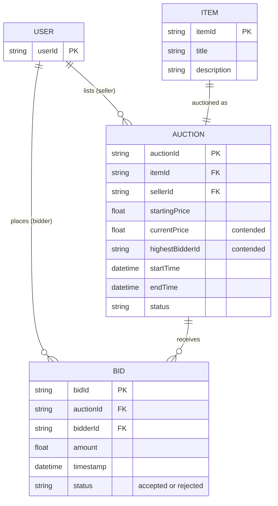
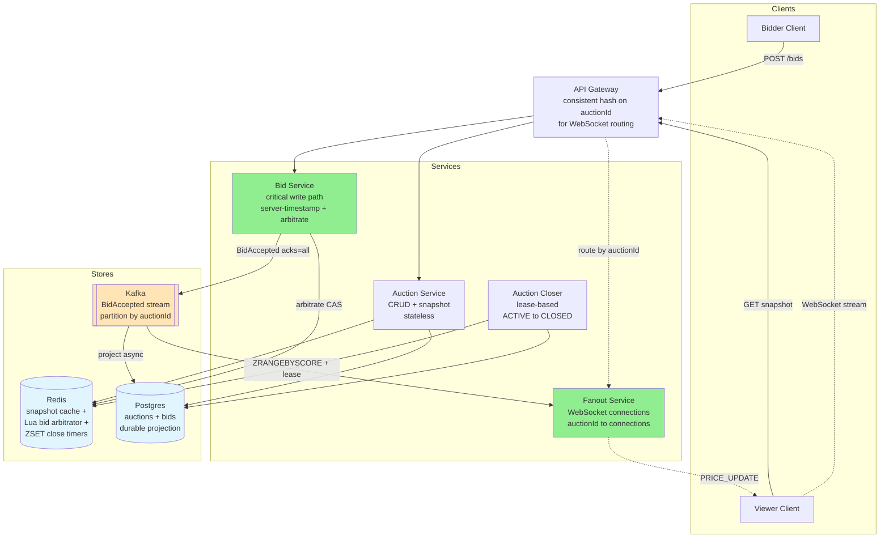
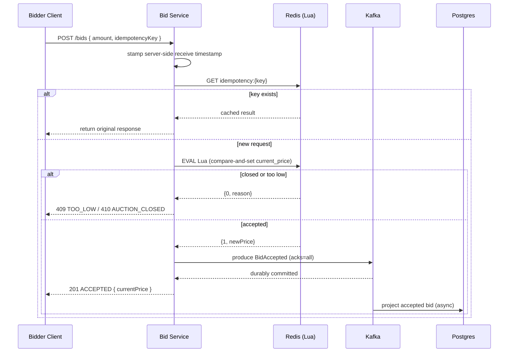
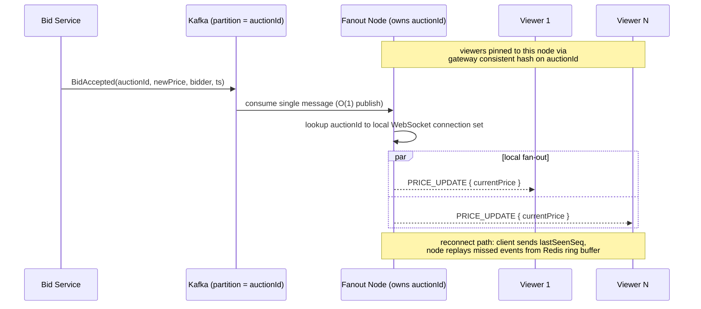
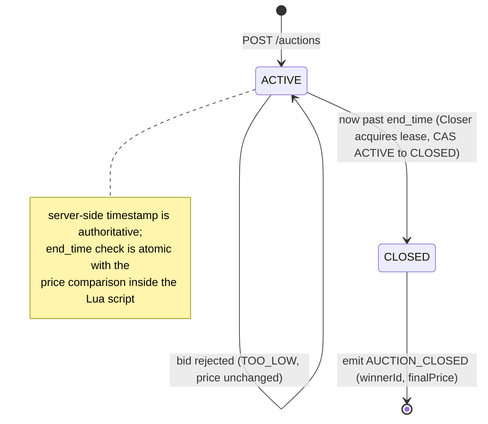
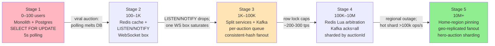

# 🔨 Design Online Auction

> **Pattern**: Ordered Writes / Real-time
> **Difficulty**: Medium
> **Source**: [hellointerview.com](https://www.hellointerview.com/learn/system-design/problem-breakdowns/online-auction)

> **Summary**: An online auction is an eBay-style system where sellers list items and bidders race to place the highest bid before a deadline. The data model is tiny, but the correctness bar is brutal: for any auction, every accepted bid must fold into one totally ordered, monotonically increasing sequence with no lost or tied bids. The mature design serializes each auction through a single writer (Postgres `SELECT FOR UPDATE`, then optimistic concurrency, then an atomic Redis Lua arbitrator), fans price updates out to hundreds of thousands of WebSocket viewers by sharding on `auctionId`, and guarantees durability by writing every accepted bid to Kafka with `acks=all` before ACKing the client — making Kafka the log, Postgres the queryable projection, and Redis just a fast cache.

---

## 📋 Table of Contents

1. [Understanding the Problem](#-understanding-the-problem)
   - [Functional Requirements](#functional-requirements)
   - [Non-Functional Requirements](#non-functional-requirements)
2. [Layman's Explanation](#-laymans-explanation)
3. [Core Entities](#-core-entities)
4. [API Design](#-api-design)
5. [High-Level Design](#-high-level-design)
6. [Deep Dives](#-deep-dives)
   1. [Bid Ordering and Strong Consistency](#1-bid-ordering-and-strong-consistency)
   2. [Fairness Under Burst Traffic](#2-fairness-under-burst-traffic)
   3. [Real-time Price Updates to Viewers](#3-real-time-price-updates-to-viewers)
   4. [Auction-closing Race Conditions](#4-auction-closing-race-conditions)
   5. [Durability and Fault Tolerance of the Bid Log](#5-durability-and-fault-tolerance-of-the-bid-log)
7. [Scaling Journey: 0 to infinity](#-scaling-journey-0-to-infinity)
   - [Stage 1: 0 to 100 Users (MVP)](#stage-1-0-to-100-users-mvp)
   - [Stage 2: 100 to 1,000 Users](#stage-2-100-to-1000-users)
   - [Stage 3: 1K to 100K Users](#stage-3-1k-to-100k-users)
   - [Stage 4: 100K to 10M Users](#stage-4-100k-to-10m-users)
   - [Stage 5: 10M+ Users](#stage-5-10m-users)
8. [Insider Tips and Tricks](#-insider-tips-and-tricks)
9. [Expected Depth by Level](#-expected-depth-by-level)
10. [Related Concepts](#-related-concepts)

---

## 🎯 Understanding the Problem

An online auction is a classic eBay-style problem where sellers list items with a starting price and end time, bidders place monetary bids, and the highest valid bid at the close wins the item. The hard part is not the data model, which is tiny, but the ordered-write semantics of bids. For any given auction, bids must be serialized into one true sequence, because the correctness of the entire system depends on a single question: which bid arrived first? Two bidders separated by a few milliseconds can disagree forever about who bid $51 first, and the system must pick an answer and stick with it.

The second pressure comes from the read side. A popular auction can have thousands or even millions of passive viewers whose screens must update when the price changes, within a second or so, to keep the experience feeling live. That pushes us toward a push-based fanout model rather than polling. Finally, every auction has a cliff-edge at closing time, where bids arriving a millisecond before or after the deadline can flip the outcome; the system has to be unambiguous about what counts.

### Functional Requirements

**In scope:**

- A seller can list an item for auction with a starting price and an end time.
- A bidder can place a bid on an active auction. The bid is accepted only if it is strictly higher than the current highest bid.
- Any user can view an auction page showing the item, the current highest bid, the current bidder (or their handle), and the time remaining. The displayed price updates in near real time as new bids arrive.

**Out of scope:**

- Search, browse, filter, and category pages.
- Payment capture, shipping, and fulfillment after a win.
- Bid retraction, auction cancellation, reserve prices, and proxy bidding (auto-bid up to max).
- User registration, auth, and reputation systems.
- Bid history pagination.

### Non-Functional Requirements

- **Strong consistency on bids**: for any auction, the accepted bids form a single totally ordered sequence, monotonically increasing in price. No two bids may be accepted at the same price; none may be lost.
- **Low write latency**: placing a bid should feel instantaneous, ideally under 200 ms end-to-end, so the last-second flurry works.
- **Real-time read fanout**: price updates reach connected viewers within ~1 second of the accepted bid. A few seconds of staleness is tolerable for users who are merely browsing, but not for active bidders.
- **Durability**: once a bid is acknowledged to the client, it must survive a datacenter failure. Losing the winning bid is unacceptable.
- **Availability and burst tolerance**: a popular auction can go from a handful of viewers to hundreds of thousands in the final minute. The system must absorb bursts without dropping bids.
- **Scale targets**:
  - 10M registered users, 1M active auctions at any moment.
  - ~1k bids/sec average across the system, with a single hot auction producing several hundred bids/sec at the deadline.
  - ~1M concurrent WebSocket viewers aggregated, tens or hundreds of thousands on a single auction.

---

## 🧒 Layman's Explanation

Picture a live auction house: bidders raise paddles, an auctioneer calls out higher and higher numbers, and the gavel drops on whoever shouted the largest figure first. eBay is exactly that, just asynchronous and online — replace the room with a web page, the paddle with a "Place Bid" button, and the auctioneer with a server. It's also like the schoolyard "I'll trade you my baseball card for $10... no, $11... no, $12!" except a referee with a stopwatch enforces the rules. Or a charity silent auction with sealed envelopes, but every envelope is opened in real time and everyone sees the current high bid the instant it changes.

The hard parts all come from the fact that money and time are real:

- **Bid ordering**: two bids arriving at "the same instant" still need a winner. The server's clock decides — client clocks lie all the time (a phone three seconds fast would always win the last second). The first thing the server does is stamp the bid with its own timestamp.
- **Concurrency on one auction**: in the final ten seconds of a hot auction, 500 people may be mashing the bid button. The system has to line them up single-file — usually with a Redis Lua script or a database row lock — so each one sees the previous bid before deciding whether theirs is high enough.
- **Real-time updates**: every viewer's screen needs to update within roughly a second. Polling 100,000 viewers per second is wasteful, so the server pushes updates over WebSockets instead.
- **The closing cliff**: a bid arriving 1 ms before the deadline wins; 1 ms after, it loses. The server's clock is the only one that counts.
- **Soft close**: like real-world auctions, if a bid lands in the last 30 seconds, the deadline gets extended. This kills "sniping" — placing a bid in the final second so nobody has time to respond.
- **Durability**: once the server says "your bid is in," it must never lose that bid. Money is real, and the winning bid pays the bill.

### When the analogy breaks down

A real auction house has one auctioneer and one room. eBay runs millions of concurrent auctions across the planet. It also handles proxy bidding (set your max, the system bids for you up to it), reserve prices (the seller can secretly require a minimum), multiple currencies, fraud detection on bidders and sellers, and cross-border shipping logistics after the gavel drops. None of those exist in the schoolyard.

---

## 🔑 Core Entities

| Entity | Description | Notes |
|---|---|---|
| **User** | A person who can list, view, or bid. Identified by `userId`. | Sellers and bidders are just roles of the same entity. |
| **Item** | The physical or digital good being auctioned. Has `itemId`, title, description, images. | Immutable for the duration of the auction. |
| **Auction** | Wraps an item with auction mechanics: `auctionId`, `itemId`, `sellerId`, `startingPrice`, `currentPrice`, `highestBidderId`, `startTime`, `endTime`, `status`. | `currentPrice` and `highestBidderId` are the contended fields; everything else is effectively read-only. |
| **Bid** | An attempt by a user to offer a price. Has `bidId`, `auctionId`, `bidderId`, `amount`, `timestamp`, `status` (accepted or rejected). | Append-only. The accepted bids for an auction form its price history. |

The surface is small. The tension is that `Auction.currentPrice` is a single contended cell for each auction, while `Bid` is an append-only log keyed by `auctionId`. These two views of the same truth must stay consistent.



---

## 🔌 API Design

```
POST /auctions
Body: { "itemId": "...", "startingPrice": 10.00, "endTime": "2026-05-01T20:00:00Z" }
-> 201 Created { "auctionId": "...", "status": "ACTIVE" }
```

Creates an auction. The `startingPrice` becomes the initial `currentPrice` and there is no highest bidder yet.

```
GET /auctions/{auctionId}
-> 200 OK { "auctionId": "...", "itemId": "...", "currentPrice": 57.00,
            "highestBidderId": "...", "endTime": "...", "status": "ACTIVE" }
```

Returns the current snapshot. This is the REST fallback when a viewer first loads the page, before the WebSocket takes over.

```
POST /auctions/{auctionId}/bids
Body: { "amount": 58.00, "idempotencyKey": "client-uuid-v4" }
-> 201 Created { "bidId": "...", "status": "ACCEPTED", "currentPrice": 58.00 }
-> 409 Conflict { "status": "REJECTED", "reason": "TOO_LOW", "currentPrice": 60.00 }
-> 410 Gone    { "status": "REJECTED", "reason": "AUCTION_CLOSED" }
```

The bid endpoint is the heart of the system. It either linearizes the bid into the auction's sequence and returns the new price, or tells the client why it was rejected. The client learns the current price from the 409 response so it can retry intelligently. The `idempotencyKey` is client-generated and used to deduplicate retries — especially important on flaky mobile networks where the response may not reach the client.

```
GET /auctions/{auctionId}/stream   (WebSocket or SSE upgrade)
-> pushes { "type": "PRICE_UPDATE", "currentPrice": ..., "highestBidderId": ..., "ts": ... }
-> pushes { "type": "AUCTION_CLOSED", "winnerId": ..., "finalPrice": ... }
```

Subscribes a viewer to the auction's event feed. The server pushes price updates and the final close event; clients never poll.

---

## 🏗️ High-Level Design

The architecture has four responsibilities: accept bids in order, persist them durably, broadcast accepted price changes to viewers, and close auctions atomically at `endTime`.



1. **API Gateway** terminates HTTP and WebSocket connections and routes by `auctionId`. For WebSocket traffic, it uses consistent hashing on `auctionId` so all viewers of the same auction end up on the same pool of servers, which keeps fanout local.

2. **Auction Service** handles auction CRUD (list, get snapshot). It reads `Auction` rows from the database, cached in Redis for hot items. It is effectively stateless.

3. **Bid Service** handles `POST /bids`. This is the critical write path. Its job is to take a bid, assign a server-side receive timestamp at the moment of entry (before any queue or lock), decide whether it beats the current price, and if so update both the authoritative record and emit an event. It enforces the total ordering guarantee.

4. **Database (Postgres)** is the system of record. Two tables matter: `auctions` (one row per auction with `current_price`, `highest_bidder_id`, `version`) and `bids` (append-only, one row per bid attempt, accepted or rejected, with server-assigned timestamp and monotonic sequence number per `auctionId`).

5. **Redis** serves two roles. First, it caches the current `Auction` snapshot so viewer page loads skip the database. Second, at higher scale it becomes the atomic bid arbitrator using a Lua script that compares-and-sets `currentPrice` in a single round trip; see the deep dive.

6. **Event Bus (Kafka)** carries a stream per auction (or per-auction partition key). When the Bid Service accepts a bid, it produces a `BidAccepted` event. Fanout Service instances consume these events and push updates to connected WebSocket clients.

7. **Fanout Service** maintains WebSocket connections and subscribes to the event bus. Because gateway routing sends all viewers of a given auction to the same fanout-service shard (keyed by `auctionId`, not `userId`), each accepted bid event needs only one Kafka consumer on that shard to push to all local subscribers. Sharding by `auctionId` is the key design decision: it means a single Kafka message triggers a fan-out to all local connections on those nodes — O(1) Kafka publishes per accepted bid rather than O(viewers).

8. **Auction Closer** is a scheduled component that transitions auctions from ACTIVE to CLOSED at `endTime`. At low scale it is a cron job polling for due auctions; at high scale it is a distributed lease system backed by a Redis sorted set (ZADD with score = `endTime`), where multiple closer instances compete for per-auction leases so there is no single point of failure.

The bid write path is where correctness lives. The read and fanout path is where scale lives. The closer is where the edge case lives.

---

## 🔬 Deep Dives

### 1. Bid Ordering and Strong Consistency

A bid is accepted only if its amount is strictly greater than the current highest. Two bids arriving within a millisecond for the same auction must be evaluated sequentially, and the second one must see the first one's effect. This is a classic read-modify-write.

**Server-side timestamp assignment**: the very first thing the Bid Service does upon receiving a request — before enqueuing, before locking, before any database call — is record the server-side receive timestamp. This timestamp is the bid's canonical "arrived at" time. Client-supplied timestamps must never be used for ordering: a client clock can be seconds ahead or behind, and a bidder with a fast clock gains a systematic advantage in last-second scenarios. The server-assigned timestamp is stored in the `bids` table and is the authoritative record for fairness and audit.

The simplest correct implementation is a single-row pessimistic lock in Postgres:

```sql
BEGIN;
SELECT current_price, version FROM auctions WHERE id = $1 FOR UPDATE;
-- application checks: new_bid > current_price AND now() < end_time
UPDATE auctions SET current_price = $2, highest_bidder_id = $3, version = version + 1
  WHERE id = $1;
INSERT INTO bids (auction_id, bidder_id, amount, status, arrived_at, seq) VALUES (...);
COMMIT;
```

`SELECT FOR UPDATE` serializes all bidders on that auction through the row lock. Correct, simple, and it performs fine at tens of bids per second per auction.

**Optimistic concurrency control** is the right next step before introducing Redis. Rather than holding the row lock across a network round trip, include the version in the UPDATE's WHERE clause and retry on a zero-row update (indicating a concurrent write won the race):

```sql
UPDATE auctions
SET current_price = $2, highest_bidder_id = $3, version = version + 1
WHERE id = $1 AND version = $expected_version AND current_price < $2;
-- if 0 rows updated: re-read and retry
```

This eliminates the lock hold duration and lets Postgres handle more concurrent readers, at the cost of explicit retry logic in the application. It is the right intermediate step before moving to Redis.

At higher contention, the database row lock becomes the bottleneck even with optimistic concurrency. The next step is to move the arbitration into Redis with an atomic Lua script:

```
-- KEYS[1] = auction key, ARGV[1] = new_amount, ARGV[2] = bidder_id, ARGV[3] = server_now_ms
local cur = redis.call('HGET', KEYS[1], 'current_price')
local endTime = redis.call('HGET', KEYS[1], 'end_time')
if tonumber(ARGV[3]) >= tonumber(endTime) then return {0, 'CLOSED'} end
if tonumber(ARGV[1]) <= tonumber(cur) then return {0, cur} end
redis.call('HSET', KEYS[1], 'current_price', ARGV[1], 'highest_bidder_id', ARGV[2])
return {1, ARGV[1]}
```

Redis executes this script single-threaded per key, giving exact linearizability for that auction. The Bid Service, on success, synchronously produces a Kafka event and asynchronously persists the accepted bid to Postgres. Redis becomes the source of truth for "current price right now" and Postgres becomes the durable log, reconciled by replay.



### 2. Fairness Under Burst Traffic

A popular auction's final 30 seconds is a thundering herd. If the system accepts bids from whichever server happens to win the race, fairness (bids are processed roughly in the order the bidders pressed the button) degrades. Several mechanisms work together to ensure fairness.

First, assign a server-side receive timestamp at the Bid Service entry, before any locking or queueing. This timestamp, not wall-clock of the database write, is the bid's logical arrival time. It goes into the `bids` table and is the tiebreaker if two bids have the same amount (which in our model is a rejection, but still useful for audit). Client-supplied timestamps must be discarded entirely for ordering purposes.

Second, funnel all bids for a given auction through a single writer. In the Kafka-based design, use `auctionId` as the partition key so all bids for one auction go to one partition and are processed by one consumer. This makes ordering intrinsic to the transport rather than something the database has to enforce. A single-writer partition at tens of thousands of events per second is well within Kafka's envelope.

Third, smooth the spike with a short in-memory queue at the Bid Service. Rather than letting 500 concurrent Postgres transactions all fight over one row, serialize them through a per-auction queue in the process and process them one at a time. Client-visible latency rises from 20 ms to maybe 200 ms under the worst bursts, but no bid is dropped and processing order matches arrival order.

Fourth, enforce a **minimum bid increment** inside the critical section. The check `new_bid > current_price` is not sufficient: without a minimum increment, bidders can grind the price up by $0.01 indefinitely. The real-world convention is a tiered increment table (e.g., +$1 under $100, +$5 between $100–500, +$50 above $5,000). The check inside the Lua script or the `SELECT FOR UPDATE` block must be `new_bid >= current_price + min_increment(current_price)`. This must be enforced in the same atomic operation as the price comparison — enforcing it only at the application layer before the lock leaves a TOCTOU gap.

Fifth, deduplicate retries using **idempotency keys**. A bidder on a flaky mobile network may receive no response and retry. Without deduplication, a retry after another bid has landed could succeed at a price the user never intentionally submitted. The Bid Service checks a Redis key `idempotency:{key}` with a 30-second TTL at entry; if the key exists, the original result is returned immediately without re-executing the bid logic. The TTL of 30 seconds covers the realistic retry window while bounding memory usage.

Sixth, consider **soft close** as a product-level fairness mechanism. If a bid arrives within N seconds (typically 30–120) of the current `end_time`, the `end_time` is extended by N seconds atomically inside the Lua script using `HINCRBY`. This prevents bid sniping — the practice of placing a bid in the last 3 seconds to deny competitors time to respond. Soft close is a single additional line in the Lua script and costs essentially nothing in latency.

### 3. Real-time Price Updates to Viewers

Viewers want the price to update within a second of a bid landing. Polling does not scale: a hundred thousand viewers refreshing every second is a hundred thousand GETs per second for one auction.

WebSockets (or SSE for one-way streams) invert the model. A viewer opens a persistent connection to a Fanout Service instance. The gateway routes the connection by `auctionId` using consistent hashing, so all viewers of the same auction land on the same fanout shard, say two or three nodes for redundancy. Each fanout node subscribes to the Kafka partition for the auctions it handles.

**Fan-out sharding must be by `auctionId`, not by `userId`.** All viewers of the same auction need to receive the same `BidAccepted` event. If connections were sharded by `userId`, an accepted bid event would need to be broadcast to potentially thousands of different shards — one per viewer. By sharding on `auctionId`, all viewers of a given auction land on a small number of Fanout Service nodes, and a single Kafka message from the Bid Service triggers a fan-out to all local connections on those nodes. This is the difference between O(1) Kafka publishes and O(viewers) Kafka publishes per accepted bid. At 100,000 viewers on a single auction, O(viewers) fan-out via Kafka would create catastrophic write amplification.

When the Bid Service accepts a bid, it emits `BidAccepted(auctionId, newPrice, bidder, ts)`. The fanout node consumes that event and iterates over its local map of `auctionId -> Set<WebSocketConnection>`, writing the update to each. With tens of thousands of local connections per auction and a few-hundred-byte payload, this is a few megabits of outbound traffic per event on that node, which a modern server handles without strain.



For the long tail of viewers on flaky networks, clients reconnect with a `lastSeenSeq` (a monotonic sequence number per auction), and the server replays missed events from a short Redis ring buffer per auction — a Redis list capped at the last N events (e.g., 100 events or 60 seconds of history, whichever is smaller). On reconnect, the Fanout Service reads the ring buffer, filters to events after `lastSeenSeq`, and delivers them before switching to live consumption. This avoids a full database read on every reconnect and keeps the missed-event replay path sub-millisecond. The REST `GET /auctions/{id}` remains available as the cold-start fallback for clients that have no `lastSeenSeq`.

### 4. Auction-closing Race Conditions

Auctions close at `endTime`. A bid submitted at `endTime - 1ms` should win; a bid submitted at `endTime + 1ms` must lose. Both clocks (client's and server's) are suspect, so the server's clock is authoritative and the check happens inside the same critical section as the bid arbitration.



In the Redis Lua script, the `end_time` check is atomic with the price comparison, so there is no window where a bid and a close operation interleave incorrectly:

```
local endTime = redis.call('HGET', KEYS[1], 'end_time')
if tonumber(ARGV[3]) >= tonumber(endTime) then return {0, 'CLOSED'} end
```

This guarantees that the close check and the bid update are atomic with respect to each other. There is no window where one bidder sees "still open" and updates while another sees "closed" and rejects.

**Soft close** is implemented atomically inside the same Lua script. If the bid passes all checks and arrives within the soft-close window (e.g., `end_time - now < 30s`), the script executes `HINCRBY auction_key end_time 30000` (adding 30 seconds in milliseconds) before returning success. Because this runs inside the same single-threaded Lua execution, the `end_time` extension and the price update are atomic — no external observer can see a state where the bid was accepted but `end_time` has not yet been extended. The cost is a single additional Redis command inside the script, essentially zero overhead.

> ⚠️ **The Auction Closer must use a distributed lease, not a simple cron job.** A cron-based closer running on a single machine is a single point of failure: if that machine is down at exactly the scheduled close time, the auction stays open indefinitely.

The production-grade pattern uses a Redis sorted set: all active auctions are stored with `ZADD active_auctions <endTime_epoch_ms> <auctionId>`. Multiple Closer Service instances continuously scan for auctions where `endTime <= now` using `ZRANGEBYSCORE`. The first instance to pick up an auction acquires a per-auction distributed lease: `SET lease:{auctionId} {instanceId} NX PX 30000` (30-second TTL). Only the lease holder proceeds to close the auction. If the lease holder crashes mid-close, another instance picks up the auction after the TTL expires and retries. The atomic CAS in Redis (checking `status = ACTIVE` before setting `status = CLOSED`) makes repeated close attempts fully idempotent.

### 5. Durability and Fault Tolerance of the Bid Log

Accepting a bid in Redis and acknowledging to the client before Postgres has it risks data loss if Redis goes down. Two defenses.

First, use Redis with AOF persistence set to `appendfsync everysec` (or `always` at the cost of throughput) plus a replica in a separate availability zone, so a node failure loses at most a second of accepted bids.

Second, and more importantly, write the accepted bid to Kafka synchronously before ACKing the client. Kafka with `acks=all` and replication factor 3 gives durable storage with low-millisecond latency. The write order is: Redis Lua arbitrates -> Bid Service publishes to Kafka with `acks=all` -> Bid Service ACKs the client. Postgres then consumes the Kafka stream and updates itself asynchronously. Redis can be rebuilt from Kafka at startup, so **Redis is a cache of state derived from Kafka, not the system of record; Kafka is the log, and Postgres is the queryable projection.**

> ⚠️ **A critical subtlety: Redis Lua atomicity does not survive Redis failover.** A bid accepted milliseconds before a primary failover can be invisible to the new primary, meaning the client holds an ACK for a bid the new primary never saw. This is exactly why the synchronous Kafka `acks=all` write must happen before the client ACK.

The Lua script executes atomically on a single Redis primary node — but Redis replication is asynchronous. If the primary fails immediately after executing the Lua script, the replica that takes over as the new primary may not have received the most recent writes due to replication lag. A bid that was accepted milliseconds before the failover might be invisible to the new primary, creating an inconsistency where the client received an ACK for a bid that the new primary does not know about. This is precisely why the Kafka write with `acks=all` must happen synchronously before the client ACK: Kafka's durable log is the source of truth, and on Redis startup or failover recovery, the Bid Service replays the Kafka log (or a recent snapshot plus a tail replay) to reconstruct the current auction state. Redis is a performance layer — a fast cache — not the authoritative store. Losing Redis is a performance degradation, not a data loss event.

---

## 📈 Scaling Journey: 0 to infinity



### Stage 1: 0 to 100 Users (MVP)

**Goal**: prove the product. One small auction house, a few dozen listings a day, at most a handful of bids per minute per auction.

**Architecture**: a single monolithic service on one box. Postgres on the same or a neighboring instance. Bids are handled with `SELECT FOR UPDATE` inside a transaction. No Redis, no Kafka, no WebSocket; the web page polls `GET /auctions/{id}` every 5 seconds.

**What you skip**: caching, event bus, real-time fanout, fancy locking, auction-closer worker (a cron job that runs every 10 seconds is fine).

**Failure mode that forces the next stage**: one auction goes viral and suddenly 500 people are polling every 5 seconds. Database load spikes, and the polling feels laggy. Time to push rather than pull.

### Stage 2: 100 to 1,000 Users

**Goal**: handle a few hundred simultaneous viewers per auction with a live-updating UI, without melting Postgres.

**Architecture**: introduce a Redis cache for `GET /auctions/{id}` so viewer page refreshes do not hit Postgres. Add a WebSocket server process that subscribes to a simple Postgres `LISTEN/NOTIFY` channel the monolith publishes on after each accepted bid. The bid path is still `SELECT FOR UPDATE`; it is correct, just slow under contention.

**What you skip**: Kafka (LISTEN/NOTIFY is enough), sharding, multi-region, gateway-level consistent hashing (one WebSocket box handles all connections).

**Failure mode that forces the next stage**: at 1,000+ concurrent viewers on a single auction, LISTEN/NOTIFY starts dropping messages under load, and the single WebSocket node can no longer hold all the TCP connections. The row lock on hot auctions also becomes visibly slow in the final minute.

### Stage 3: 1K to 100K Users

**Goal**: handle a few hot auctions per day with thousands of concurrent viewers and bursty last-minute bidding.

**Architecture**: split the monolith into Auction Service, Bid Service, and Fanout Service. Introduce Kafka as the event bus with `auctionId` as the partition key so all bids for one auction are ordered by a single partition. The Bid Service still uses Postgres `SELECT FOR UPDATE` for correctness, but introduces a per-auction in-memory serialization queue inside the Bid Service process to keep contention off the database when a hot auction spikes. The Fanout Service runs on multiple nodes; the API gateway uses consistent hashing on `auctionId` to pin all WebSocket viewers of one auction to the same fanout node. Add a delayed-job queue (Redis ZSET keyed on `endTime`) for auction closing.

**What you skip**: Redis-based bid arbitration, sharded auction databases, cross-region replication.

**Failure mode that forces the next stage**: a truly hot auction generates hundreds of bids per second in the closing seconds. Postgres `SELECT FOR UPDATE` on a single row tops out around 200-300 transactions per second with WAL fsync. Bidders start seeing 1+ second latencies, and the system feels broken precisely when it should feel most alive.

### Stage 4: 100K to 10M Users

**Goal**: sustain hundreds of bids per second per auction and millions of concurrent viewers across the platform.

**Architecture**: move bid arbitration into Redis with the atomic Lua script described in deep dive 1. Redis is the hot path; Postgres becomes an asynchronous durable projection consumed from Kafka. Every accepted bid is written synchronously to Kafka with `acks=all` before the client receives an ACK, so durability does not depend on Redis staying up. Shard the auction services by `auctionId`; a consistent-hash ring maps each auction to one Bid Service leader and one Redis shard. Viewers of a given auction still land on one Fanout Service node via gateway routing. The Auction Closer graduates from a polled ZSET into a sharded timer-wheel service, each node responsible for the auctions whose `auctionId` hashes to it, with lease-based failover. Read replicas of Postgres serve `GET /auctions/{id}` when Redis misses.

**What you skip**: cross-region active-active, custom storage engines, CDN-fronted streaming.

**Failure mode that forces the next stage**: at tens of millions of users, a regional outage takes down whole auctions. The hottest Redis shards top out at around 100k ops/sec and one globally famous auction (a celebrity artwork, say) exceeds that. Latency from a bidder across the ocean is too high to feel live.

### Stage 5: 10M+ Users

**Goal**: global scale, multi-region, resilient to single-region failure, hero auctions with hundreds of thousands of concurrent viewers worldwide.

**Architecture**: pin each auction to a "home region" where its Bid Service leader and primary Redis shard live; all bids route there via the API gateway, which adds maybe 100-150 ms of latency for a distant bidder but preserves the single-writer invariant that makes bid ordering tractable. Viewer fanout is regional: regional Fanout Service clusters consume the auction's Kafka stream via geo-replication (MirrorMaker or equivalent) and push to local WebSocket clients, so the read path is low-latency everywhere even though writes are centralized per auction. For hero auctions that exceed a single Redis shard, further shard the single auction itself: split the ordered-bid log into an acceptance tier (many Redis instances each owning a range of bidder IDs, doing a fast local "is this bid even plausible?" reject) with a single coordinator that linearizes the surviving candidates. This is effectively a two-level filter: 99% of low bids are rejected locally without contending on the coordinator. Reconciliation between Redis and Postgres is continuous via Kafka consumers, with a dead-letter queue for any accepted-bid event that fails to project.

---

## 💡 Insider Tips and Tricks

### Server-Assigned Timestamps Beat Client Timestamps Every Time

Client clocks can differ by seconds — enough for a "last second" bidder to legitimately place a bid at t=T-0.5s on their clock, which arrives at the server at t=T+1.5s after network delay. If you use client-supplied timestamps for bid ordering, the bidder who happened to have a fast clock wins a systematic advantage. Always assign the server-side receive timestamp at the first point of entry into your Bid Service, before any queue or lock, and make that timestamp the bid's canonical "arrived at" time for fairness and audit.

### Soft Close Is Essential for Any Serious Auction Product

Pure deadline-based auctions reward bid sniping — waiting until the last 3 seconds to place a bid so competitors have no time to respond. Real auction houses (eBay used to do this, most fine-art auctions do) implement soft close: if a bid arrives within N seconds (typically 30–120) of the current end time, the end time is extended by N seconds. From a systems standpoint, this is just an atomic `HINCRBY` on the `end_time` field inside the same Redis Lua script that validates and accepts the bid, so it costs essentially nothing.

### Minimum Bid Increment Prevents Price Grinding

Without a minimum increment, bidders can place bids $0.01 above the current price indefinitely. In the real world, minimum increments scale with the current price (e.g., +$1 under $100, +$5 between $100–500, +$50 above $5,000). This rule must be enforced inside the critical section that checks `new_bid > current_price` — adding a `new_bid >= current_price + min_increment(current_price)` check. Failing to enforce this makes auctions painful to operate and invites abuse.

### Idempotency Keys Prevent Duplicate Bids on Mobile Retries

A bidder on a flaky mobile network taps "Place Bid," the request reaches your server, gets accepted, but the response never returns. The client retries. Without an idempotency key, the second request places a second bid. The bid amount is already the highest, so it's immediately rejected as "too low" — harmless in this case — but if another bid landed between the two attempts, the retry could win at a higher price the user never intentionally submitted. Give each bid submission a client-generated `idempotencyKey` and deduplicate at the Bid Service using a Redis key with a 30-second TTL.

### Reserve Price Requires Hiding the Current High Bid

Many auctions have a secret reserve price: the item only sells if the winning bid meets it. This changes your API contract significantly: `GET /auctions/{id}` must not expose `currentPrice` as the true high bid if the reserve has not been met — instead it shows "current bid: $X, reserve not met." The `currentPrice` in your database is still accurate; you apply a display-layer transformation. If the reserve is met, the display changes to "reserve met" and shows the actual current price. You need this logic in your read path, not just in your closing logic.

### Fan-out Sharding by Auction ID, Not by User ID

For viewer fanout, shard your WebSocket connections by `auctionId`, not by `userId`. The reason: all viewers of the same auction need to receive the same `BidAccepted` event. If you shard by `userId`, the accepted bid event would need to be broadcast to potentially thousands of different shards — one per viewer. By sharding on `auctionId`, all viewers of a given auction land on a small number of Fanout Service nodes, and a single Kafka message from the Bid Service triggers a fan-out to all local connections on those nodes. This is the difference between O(1) Kafka publishes and O(viewers) Kafka publishes per accepted bid.

### Redis Lua Script Atomicity Does Not Survive Redis Failover

Your Redis Lua bid arbitration script executes atomically on a single Redis node. But if that node fails and the primary role transfers to a replica, there's a brief window where the replica might not have the most recent in-memory state (async replication lag). A bid accepted milliseconds before the failover might not appear in the new primary's state. The solution is to write accepted bids to Kafka with `acks=all` synchronously before ACKing the client, and on Redis startup, replay the Kafka log to reconstruct the current auction state. Redis is then a cache of state derived from Kafka, not the system of record.

### The Auction Closer Must Use a Distributed Lease, Not a Cron Job

A cron-based closer running on a single machine is a single point of failure. If the machine is down at 8:00 PM exactly when an important auction should close, the auction stays open indefinitely. Use a distributed lease: store all active auction end times in a Redis sorted set (ZADD with score = endTime). Multiple closer instances continuously scan for auctions with `endTime <= now`. Whichever instance picks up an auction first acquires a per-auction lease (Redis SET NX with TTL). Only the lease holder performs the close. If the lease holder dies, another instance picks up the auction after the TTL expires and closes it safely — idempotent CAS in Redis makes repeated close attempts safe.

---

## 🎓 Expected Depth by Level

| Level | What the interviewer wants to see |
|---|---|
| **Mid-level** | Clear articulation of the bid ordering problem and a correct single-node solution using `SELECT FOR UPDATE`. Sensible API design. Awareness that polling does not scale and that WebSockets are the right tool, even without designing the fanout layer in detail. Can reason about the closing-time race at a high level. |
| **Senior** | Drives the deep dives unprompted. Designs the Kafka partition-per-auction pattern for ordered writes. Chooses between pessimistic and optimistic concurrency with justification. Designs the WebSocket fanout with consistent-hash routing. Handles the closing race atomically. Understands durability requires synchronous Kafka write before client ACK, not just Redis persistence. |
| **Staff** | Reasons about Redis-based bid arbitration with Lua as a clean upgrade path and understands why Kafka is still required for durability underneath. Discusses soft-close, fairness under burst, and server-assigned timestamps explicitly. Designs multi-region with home-region pinning per auction and explains the latency/consistency trade-off. Can describe two-level filtering for hero auctions that exceed a single shard. Addresses failure recovery: Redis loss rebuilt from Kafka, closer failover via leases, reconciliation between cache and durable projection. |

---

## 📚 Related Concepts

- [Distributed Locking](../CoreConcepts/DistributedLocking.md) — the per-`driverId`-style single-writer pattern here maps to the Redis lease per auction and the `SET NX PX` close lock.
- [Redis](../CoreConcepts/Redis.md) — single-threaded Lua arbitration, the snapshot cache, the ring buffer, and the ZSET of close timers.
- [Caching](../CoreConcepts/Caching.md) — caching the `Auction` snapshot so viewer page loads skip Postgres, and Redis-as-cache-not-source-of-truth.
- [Sharding](../CoreConcepts/Sharding.md) — sharding Bid and Fanout services by `auctionId` to keep ordering and fanout local.
- [Consistent Hashing](../CoreConcepts/ConsistentHashing.md) — gateway routing that pins all viewers of an auction to the same fanout shard.
- [Networking](../CoreConcepts/Networking.md) — WebSockets/SSE push versus polling for real-time price updates.
- [Kafka](../SystemDesign/DeepDives/Kafka.md) — the durable `BidAccepted` log, partition-per-auction ordering, and `acks=all` before client ACK.
- [Postgresql](../SystemDesign/DeepDives/Postgresql.md) — `SELECT FOR UPDATE`, optimistic version-based concurrency, and the durable bid projection.
- [Dealing With Contention](../SystemDesign/Patterns/DealingWithContention.md) — the read-modify-write on the single contended `currentPrice` cell.
- [Real-Time Updates](../SystemDesign/Patterns/Real-TimeUpdates.md) — the WebSocket fanout and reconnect/replay pattern.
- [Scaling Writes](../SystemDesign/Patterns/ScalingWrites.md) — moving the hot bid path from Postgres locks to a Redis arbitrator.
- [Online Auction (HelloInterview breakdown)](../SystemDesign/ProblemBreakdowns/OnlineAuction.md) — the source breakdown this doc expands on.
- [Ticketmaster](../SystemDesign/ProblemBreakdowns/Ticketmaster.md) — a sibling high-contention, deadline-driven reservation problem.
