# Design WhatsApp

> **Pattern**: Real-time Updates  
> **Difficulty**: Medium  
> **Author**: Stefan Mai

---

## Table of Contents

- [Understanding the Problem](#understanding-the-problem)
  - [What is WhatsApp?](#what-is-whatsapp)
  - [Functional Requirements](#functional-requirements)
  - [Non-Functional Requirements](#non-functional-requirements)
- [The Set Up](#the-set-up)
  - [Planning the Approach](#planning-the-approach)
  - [Defining Core Entities](#defining-core-entities)
  - [API or System Interface](#api-or-system-interface)
- [High-Level Design](#high-level-design)
  - [1. Group Chats with Multiple Participants](#1-users-should-be-able-to-start-group-chats-with-multiple-participants-limit-100)
  - [2. Send/Receive Messages](#2-users-should-be-able-to-sendreceive-messages)
  - [3. Offline Message Delivery](#3-users-should-be-able-to-receive-messages-sent-while-they-are-not-online-up-to-30-days)
  - [4. Media Attachments](#4-users-should-be-able-to-sendreceive-media-in-their-messages)
- [Potential Deep Dives](#potential-deep-dives)
  - [1. Handling Billions of Simultaneous Users](#1-how-can-we-handle-billions-of-simultaneous-users)
  - [2. Multiple Clients Per User](#2-what-do-we-do-to-handle-multiple-clients-for-a-given-user)
- [What is Expected at Each Level](#what-is-expected-at-each-level)
- [References](#references)

---

## Understanding the Problem

### What is WhatsApp?

WhatsApp is a messaging service that allows users to send and receive encrypted messages and calls from their phones and computers. WhatsApp was famously originally built on Erlang (no longer!) and renowned for handling high scale with limited engineering and infrastructure outlay.

### Functional Requirements

Apps like WhatsApp and Messenger have tons of features, but your interviewer doesn't want you to cover them all. The most obvious capabilities are almost definitely in-scope but it's good to ask your interviewer if they want you to move beyond.

#### Core Requirements

1. **Users should be able to start group chats with multiple participants** (limit 100)
2. **Users should be able to send/receive messages**
3. **Users should be able to receive messages sent while they are not online** (up to 30 days)
4. **Users should be able to send/receive media in their messages**

> 💡 **Note**: That third requirement isn't obvious to everyone (but it's interesting to design), and if I'm your interviewer I'll probably guide you to it.

#### Below the Line (Out of Scope)

1. Audio/Video calling
2. Interactions with businesses
3. Registration and profile management

### Non-Functional Requirements

#### Core Requirements

1. **Messages should be delivered to available users with low latency** (< 500ms)
2. **We should guarantee deliverability of messages** - they should make their way to users
3. **The system should be able to handle billions of users with high throughput** (we'll estimate later)
4. **Messages should be stored on centralized servers no longer than necessary**
5. **The system should be resilient against failures of individual components**

#### Below the Line (Out of Scope)

1. Exhaustive treatment of security concerns
2. Spam and scraping prevention systems

> ⚠️ **Important**: Adding features that are out of scope is a "nice to have". It shows product thinking and gives your interviewer a chance to help you reprioritize based on what they want to see in the interview. If additional features are not coming to you quickly (or you've already burned some time), don't waste your time and move on.

---

## The Set Up

### Planning the Approach

Before moving on to designing the system, it's important to start by taking a moment to plan your strategy for the session.

**Key Insights:**
- 1:1 messages are simply a special case of larger chats (with 2 participants), so we'll solve for the general case
- Start our design by walking through core requirements and solving them as simply as possible
- This will get us started with a system that is probably slow and not scalable, but a good starting point for optimization
- In deep dives we'll address scaling, optimizations, and any additional features/functionality

### Defining Core Entities

In the core entities section, we'll think through the main "nouns" of our system. The intent here is to give us the right language to reason through the problem and set the stage for our API and data model.

> 💡 **Note**: Interviewers aren't evaluating you on what you list for core entities, they're an intermediate step to help you reason through the problem. Getting the entities wrong is a great way to start building on a broken foundation!

Walking through our functional requirements, we need:

- **Users**
- **Chats** (2-100 users)
- **Messages**
- **Clients** (a user might have multiple devices)

```mermaid
erDiagram
    USER ||--o{ CLIENT : "has multiple"
    USER ||--o{ CHAT_PARTICIPANT : "participates in"
    CHAT ||--o{ CHAT_PARTICIPANT : "contains"
    CHAT ||--o{ MESSAGE : "contains"
    MESSAGE ||--o{ ATTACHMENT : "may have"
    CLIENT ||--o{ INBOX : "receives messages in"
    
    USER {
        string userId PK
        string name
        string phoneNumber
        timestamp lastSeen
    }
    
    CLIENT {
        string clientId PK
        string userId FK
        string deviceType
        timestamp lastActive
    }
    
    CHAT {
        string chatId PK
        string name
        timestamp createdAt
        int participantCount
    }
    
    CHAT_PARTICIPANT {
        string chatId PK
        string userId PK
        timestamp joinedAt
        string role
    }
    
    MESSAGE {
        string messageId PK
        string chatId FK
        string senderId FK
        string content
        timestamp sentAt
    }
    
    ATTACHMENT {
        string attachmentId PK
        string messageId FK
        string s3Key
        string fileType
        int fileSize
    }
    
    INBOX {
        string inboxId PK
        string clientId FK
        string messageId FK
        boolean delivered
        timestamp createdAt
    }
```

### API or System Interface

Next, we'll want to think through the API of our system. Unlike a lot of other products where a REST API is probably appropriate, for a chat app, we're going to have high-frequency updates being both sent and received. This is a perfect use case for a **bi-directional socket connection**!

#### Pattern: Real-time Updates

WebSocket connections and real-time messaging demonstrate the broader real-time updates pattern used across many distributed systems. Whether it's chat messages, live dashboards, collaborative editing, or gaming, the same principles apply: persistent connections for low latency, pub/sub for scaling across servers, and careful state management for reliability.

For this interview, we'll just use **WebSockets** although a simple TLS connection would do. The idea will be that users will open the app and connect to the server, opening this socket which will be used to send and receive commands which represent our API.

#### Commands Exchanged

**Client → Server Commands:**

##### Create Chat
```json
// -> createChat
{
    "participants": [],
    "name": ""
} 
// Response
{
    "chatId": ""
}
```

##### Send Message
```json
// -> sendMessage
{
    "chatId": "",
    "message": "",
    "attachments": []
} 
// Response
"SUCCESS" | "FAILURE"
```

##### Create Attachment
```json
// -> createAttachment
{
    "body": ...,
    "hash": ...
} 
// Response
{
    "attachmentId": ""
}
```

##### Modify Chat Participants
```json
// -> modifyChatParticipants
{
    "chatId": "",
    "userId": "",
    "operation": "ADD" | "REMOVE"
} 
// Response
"SUCCESS" | "FAILURE"
```

**Server → Client Commands:**

> 💡 **Important**: The message receipt acknowledgement is a bit non-obvious but crucial to making sure we don't lose messages. By forcing clients to ack, we can know for certain that the message has been delivered all the way to the client.

##### Chat Update
```json
// <- chatUpdate
{
    "chatId": "",
    "participants": [],
    ...
} 
// Client Response
"RECEIVED"
```

##### New Message
```json
// <- newMessage
{
    "chatId": "",
    "userId": "",
    "message": "",
    "attachments": []
} 
// Client Response
"RECEIVED"
```

> 💡 **Note**: Enumerating all of these APIs can take time! In the actual interview, you might shortcut by only writing the command names and not the full API. It's also usually a good idea to summarize the API initially before you build out the high-level design in case things need to change. "I'll come back to this as I learn more" is completely acceptable!

---

## High-Level Design

### Complete System Architecture

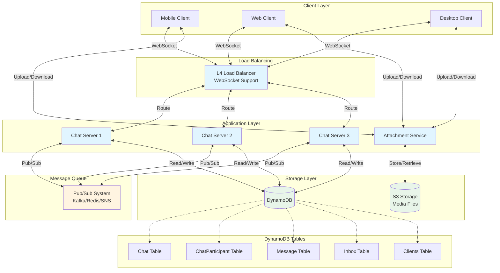

### 1) Users should be able to start group chats with multiple participants (limit 100)

For our first requirement, we need a way for a user to create a chat. We'll start with a simple service behind an **L4 load balancer** (to support WebSockets!) which can write Chat metadata to a database.

Let's use **DynamoDB** for fast key/value performance and scalability here, although we have lots of other options.

#### Create a Chat Flow

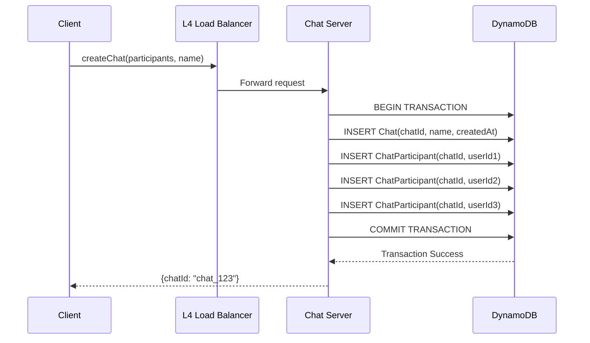

**Steps:**
1. User connects to the service and sends a `createChat` message
2. The service, inside a transaction, creates a Chat record in the database and creates a ChatParticipant record for each user in the chat
3. The service returns the `chatId` to the user

#### Database Schema

**Chat Table:**
- Primary key on the `chatId`
- Used to look up chat details by ID

**ChatParticipant Table:**
- Composite primary key on `chatId` and `participantId`
- Range lookup on `chatId` gives all participants for a given chat
- **Global Secondary Index (GSI)** with `participantId` as partition key and `chatId` as sort key
  - Allows efficient query of all chats for a given user
  - GSI automatically kept in sync with base table by DynamoDB

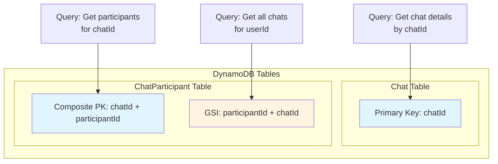

---

### 2) Users should be able to send/receive messages

To allow users to send/receive messages, we're going to need to start taking advantage of the WebSocket connection that we established.

> 💡 **Strategy**: To keep things simple while we get off the ground, let's assume we have a single host for our Chat Server. This is obviously a terrible solution for scale (and you might say so to your interviewer to keep them from itching), but it's a good starting point that will allow us to incrementally solve those problems as we go.

> 💡 **Tip**: For infrastructure-style interviews, I highly recommend reasoning about a solution on a single host first. Oftentimes the path to scale is straightforward from there. On the other hand if you solve scale first without thinking about how the actual mechanics of your solution work underneath, you're likely to back yourself into a corner.

#### Implementation Details

When users make WebSocket connections to our Chat Server, we'll want to keep track of their connection with a simple **hash map** which will map a user id to a websocket connection.

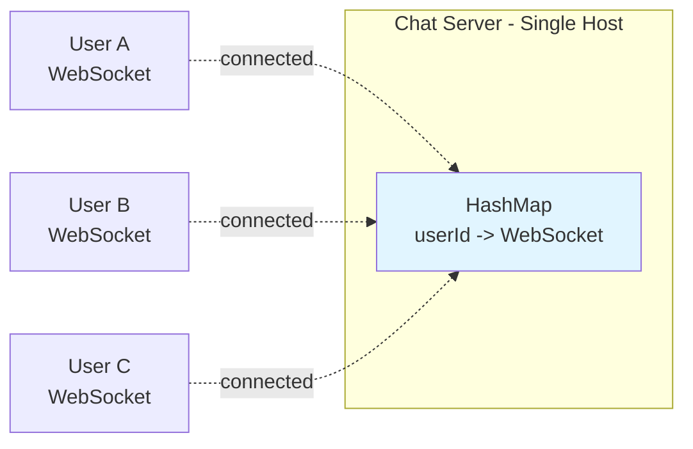

**To send a message:**
1. User sends a `sendMessage` message to the Chat Server
2. The Chat Server looks up all participants in the chat via the ChatParticipant table
3. The Chat Server looks up the websocket connection for each participant in its internal hash table and sends the message via each connection

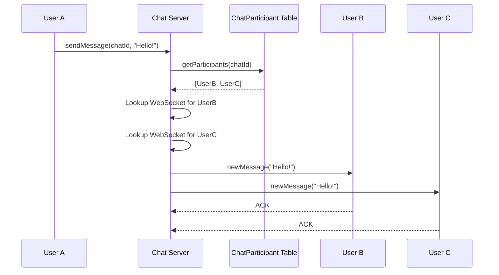

> ⚠️ **Strong Assumptions**: We're assuming all users are online, connected to the same Chat Server, and that we have a websocket connection for each of them. But under those conditions we're moving, so let's keep going.

---

### 3) Users should be able to receive messages sent while they are not online (up to 30 days)

With our next requirement, we're forced to undo some of those assumptions. We're going to need to start storing messages in our database so that we can deliver them to users even when they're offline.

#### Solution: Inbox Pattern

Let's keep an "Inbox" for each user which will contain all undelivered messages. When messages are sent, we'll write them to the inbox of each recipient user. If they're already online, we can go ahead and try to deliver the message immediately. If they're not online, we'll store the message and wait for them to come back later.

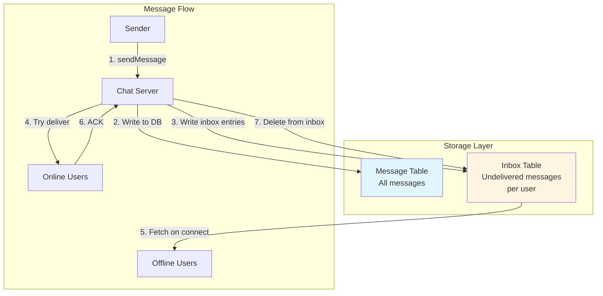

#### Send a Message Flow

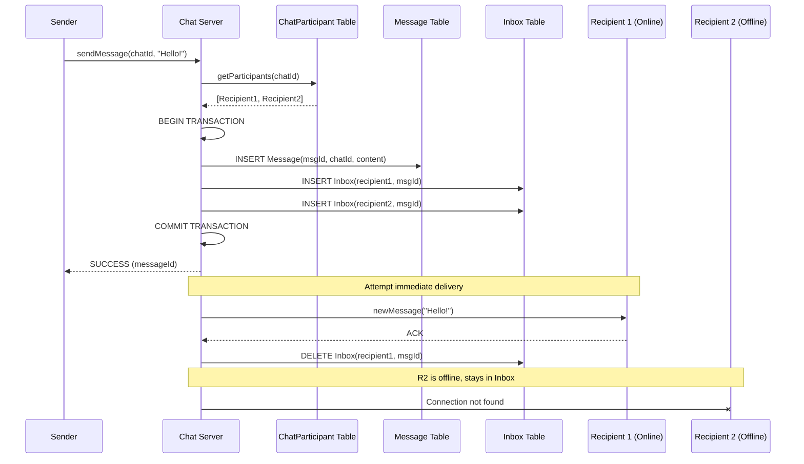

**Steps:**
1. User sends a `sendMessage` message to the Chat Server
2. The Chat Server looks up all participants in the chat via the ChatParticipant table
3. The Chat Server creates a transaction which both:
   - (a) writes the message to our Message table, AND
   - (b) creates an entry in our Inbox table for each recipient
4. The Chat Server returns a SUCCESS or FAILURE to the user with the final message id
5. The Chat Server looks up the websocket connection for each participant and attempts to deliver the message to each of them via `newMessage`
6. **(For connected clients)** Upon receipt, the client will send an ack message to the Chat Server to indicate they've received the message. The Chat Server will then delete the message from the Inbox table

#### Handling Offline Clients

For clients who aren't connected, we'll keep the messages in the Inbox table. Once the client connects to our service later:

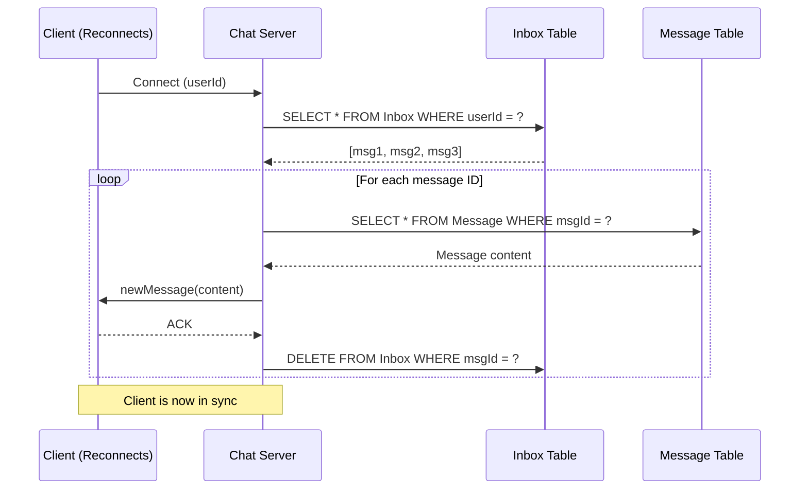

1. Look up the user's Inbox and find any undelivered message IDs
2. For each message ID, look up the message in the Message table
3. Write those messages to the client's connection via the `newMessage` message
4. Upon receipt, the client will send an ack message to the Chat Server to indicate they've received the message
5. The Chat Server will then delete the message from the Inbox table

#### Cleanup

Finally, we'll need to periodically clean up the old messages in the Inbox and messages tables. We can do this with a simple **cron job** which will delete messages older than 30 days.

> ✅ **Progress**: We knocked out some of the durability issues of our initial solution and enabled offline delivery. Our solution still doesn't scale and we've got a lot more work to do, so let's keep moving.

---

### 4) Users should be able to send/receive media in their messages

Our final requirement is that users should be able to send/receive media in their messages.

#### Challenge

Users sending and receiving media is annoying. It's bandwidth- and storage-intensive. While we could potentially do this with our Chat Server and database, it's better to use purpose-built technologies for this.

#### Solutions Evolution

##### ❌ Bad Solution: Keep attachments in DB
- Storing media in the database is inefficient
- Database not optimized for large binary data
- Expensive and slow

##### ⚠️ Good Solution: Send attachments via chat server
- Better than DB storage
- Still puts load on chat server
- Not optimal for scale

##### ✅ Great Solution: Manage attachments separately
- Use a separate HTTP service for attachments
- This is in fact how WhatsApp actually works
- Attachments are uploaded via a separate HTTP service
- Use **S3** or similar object storage
- Chat messages only contain references to attachments
- Decouples media handling from real-time messaging

**Implementation:**
- Client uploads media to S3 via presigned URLs
- S3 returns attachment ID
- Client sends message with attachment ID reference
- Recipients download media from S3 using the attachment ID

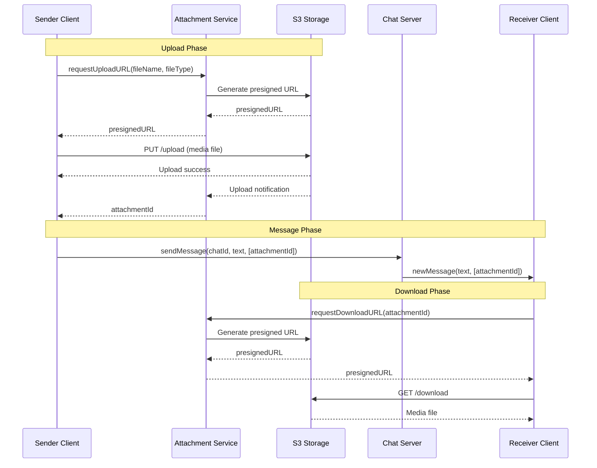

> ✅ **Result**: We have a system which has real-time delivery of messages, persistence to handle offline use-cases, and attachments.

---

## Potential Deep Dives

With the core functional requirements met, it's time to dig into the non-functional requirements via deep dives and solve some of the issues we've earmarked to this point.

> 💡 **Note**: The degree to which a candidate should proactively lead the deep dives is a function of their seniority. All levels should be quick to point out that a single-host solution isn't going to scale. However, in senior and staff+ interviews, the level of agency and ownership expected of the candidate increases.

### 1) How can we handle billions of simultaneous users?

Our single-host system is convenient but unrealistic. Serving billions of users via a single machine isn't possible and it would make deployments and failures a nightmare.

#### Scale Requirements

If we have 1B users, we might expect 200M of them to be connected at any one time. WhatsApp famously served 1-2M users per host, but this will require us to have **hundreds of chat servers**. That's a lot of simultaneous connections!

> 💡 **Tip**: Your interviewer will likely expect back-of-the-envelope calculations here, but you'll get more mileage from your calculations by doing them just-in-time: when you need to figure out a scaling bottleneck.

#### The Routing Problem

Adding more chat servers also introduces some new problems: now the sending and receiving users might be connected to different hosts. If User A is trying to send a message to User B and C, but User B and C are connected to different Chat Servers, we're going to have a problem.

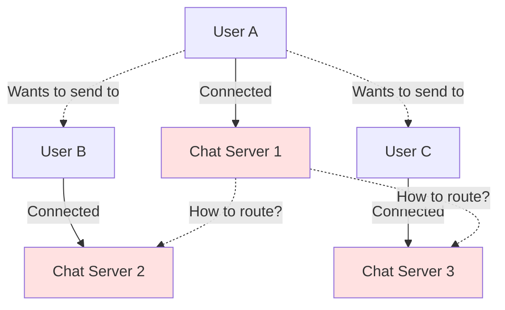

**The issue is one of routing**: we're going to need to route messages to the right Chat Servers in order to deliver them.

#### Solutions Evolution

##### ❌ Bad Solution: Naively horizontally scale
- Just adding more servers doesn't solve routing
- No coordination between servers
- Messages won't reach users on different servers

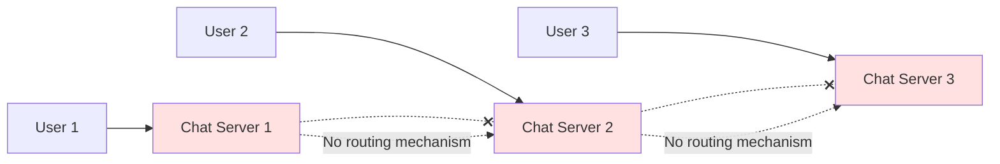

##### ⚠️ Bad Solution: Keep a Kafka topic per user
- Creates massive number of topics
- Kafka not designed for this pattern
- Management overhead too high

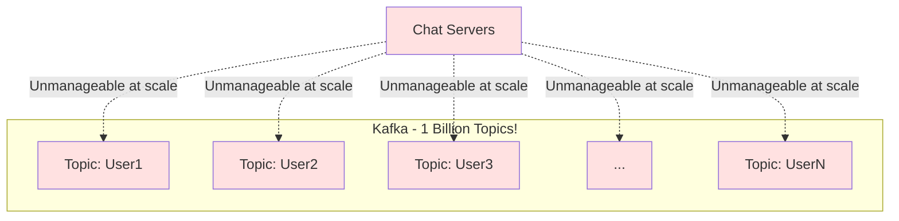

##### ✅ Good Solution: Consistent Hashing of Chat Servers
- Hash user IDs to specific chat servers
- Servers know which other servers host which users
- Need a coordination service (like ZooKeeper)
- Works but requires complex coordination

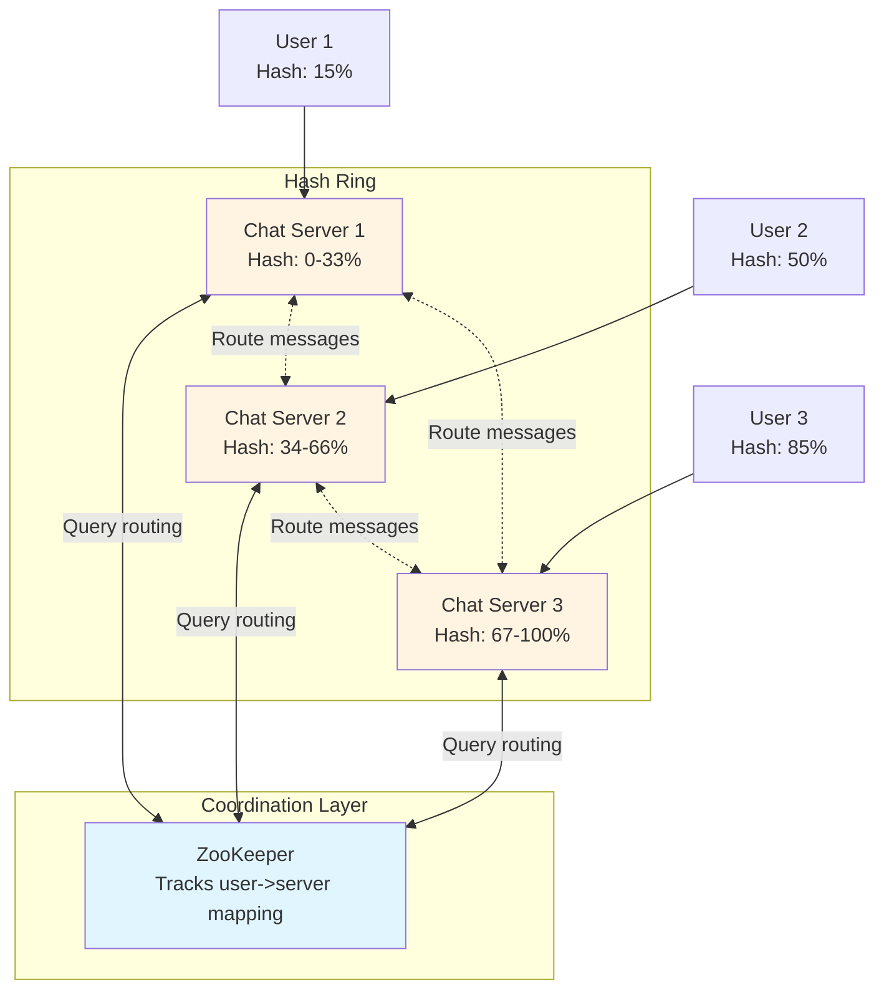

##### 🌟 Great Solution: Offload to Pub/Sub
- Use a **message queue system** (Kafka, AWS SNS/SQS, Redis Pub/Sub)
- Each Chat Server subscribes to topics for their connected users
- When a message needs to be sent:
  1. Chat Server publishes to recipient user topics
  2. Chat Servers with those users subscribed receive the message
  3. Chat Servers deliver to their connected clients
- **Benefits**:
  - Decouples message routing from server coordination
  - Scales horizontally
  - Handles server failures gracefully
  - Simple to implement and maintain

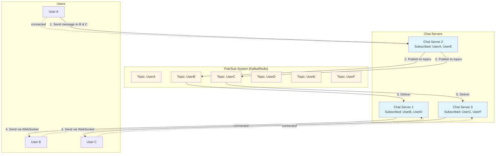

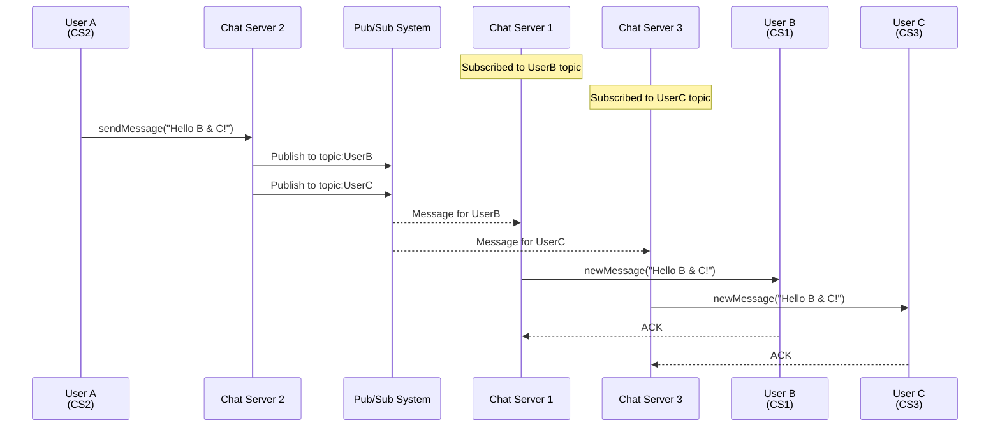

---

### 2) What do we do to handle multiple clients for a given user?

To this point we've assumed a user has a single device, but many users have multiple devices: a phone, a tablet, a desktop or laptop - maybe even a work computer.

#### The Problem

Imagine my phone had received the latest message but my laptop was off. When I wake it up, I want to make sure that all of the latest messages are delivered to my laptop so that it's in sync. We can no longer rely on the user-level "Inbox" table to keep track of delivery!

#### New Requirements

Having multiple clients/devices introduces some new problems:

1. **Client Resolution**: We'll need to add a way for our design to resolve a user to 1 or more clients that may be active at any one time
2. **Client Deactivation**: We need a way to deactivate clients so that we're not unnecessarily storing messages for a client which does not exist any longer
3. **Multi-client Delivery**: We need to update our message delivery system so that it can handle multiple clients

#### Solution

Let's account for this with minimal changes to our design:

**Changes Required:**
- Create a new **Clients table** to keep track of clients by user id
- When we look up participants for a chat, we'll need to look up all of the clients for that user
- Update our **Inbox table to be per-client** rather than per-user
- When we send a message, we'll need to send it to all of the clients for that user
- On the pub/sub side, nothing needs to change. Chat servers will continue to subscribe to a topic with the userId

```mermaid
graph TB
    subgraph "User A's Devices"
        P[Phone<br/>ClientID: A1]
        L[Laptop<br/>ClientID: A2]
        T[Tablet<br/>ClientID: A3]
    end
    
    subgraph "Chat Servers"
        CS1[Chat Server 1]
        CS2[Chat Server 2]
    end
    
    subgraph "Storage"
        CT[Clients Table<br/>userId -> [clientIds]]
        IT[Inbox Table<br/>clientId -> [messages]]
    end
    
    P -.->|connected| CS1
    L -.->|connected| CS2
    T -.->|offline| CS2
    
    CS1 -->|lookup clients| CT
    CS2 -->|lookup clients| CT
    
    CS1 -->|write undelivered| IT
    CS2 -->|write undelivered| IT
    
    IT -.->|A1 inbox: empty| P
    IT -.->|A2 inbox: empty| L
    IT -.->|A3 inbox: [msg1, msg2]| T
    
    style CT fill:#e1f5ff
    style IT fill:#fff4e1
```

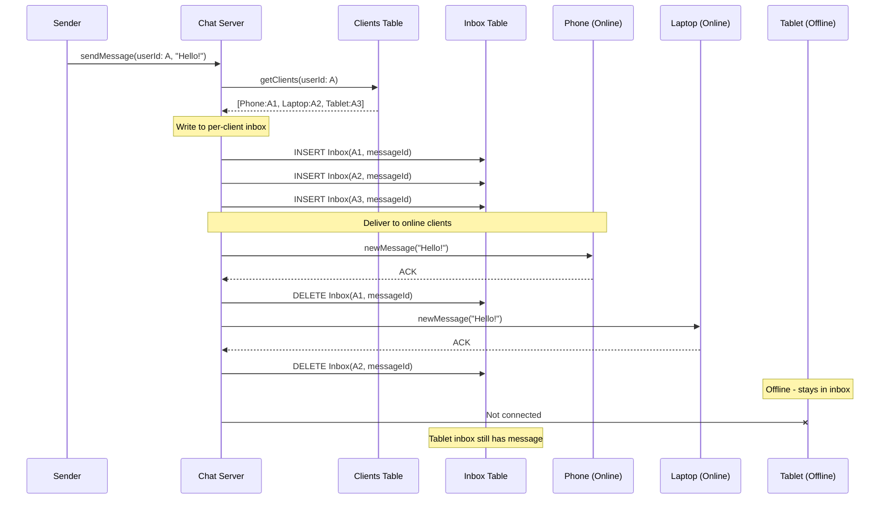

**Best Practice:**
We'll probably want to introduce some limits (3 clients per account) to avoid blowing up our storage and throughput.

---

## What is Expected at Each Level?

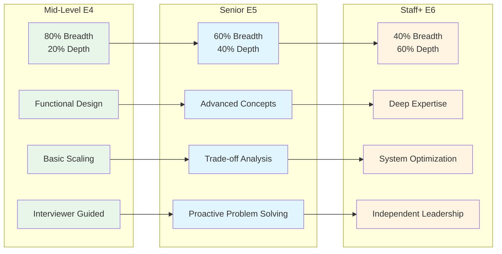

### Mid-level

**Breadth vs. Depth:** 
- Focus mostly on breadth (80% vs 20%)
- Craft a high-level design that meets functional requirements
- Many components will be abstractions with surface-level familiarity

**Probing the Basics:**
- Interviewer will probe to confirm you know what each component does
- Example: If you use WebSockets, expect questions about what they do and how they work
- Interviewer is not taking anything for granted

**Driving the Interview:**
- Drive the early stages in particular
- Interviewer doesn't expect you to proactively recognize problems with high precision
- Reasonable for them to drive later stages while probing your design

**The Bar for WhatsApp:**
- Clearly defined API
- High-level design that is functional and meets requirements
- Scaling solution will have rough edges but knowledge of its flaws

---

### Senior

**Depth of Expertise:**
- About 60% breadth and 40% depth
- Should be able to go into technical details in areas with hands-on experience
- Demonstrate deep understanding of key concepts and technologies

**Advanced System Design:**
- Familiar with advanced principles (e.g., consistent hashing)
- Understand mechanics of long-running sockets
- Navigate advanced topics with confidence and clarity

**Articulating Architectural Decisions:**
- Clearly articulate pros and cons of different choices
- Explain how they impact scalability, performance, and maintainability
- Justify decisions and explain trade-offs

**Problem-Solving and Proactivity:**
- Strong problem-solving skills and proactive approach
- Anticipate potential challenges and suggest improvements
- Adept at identifying and addressing bottlenecks
- Optimize performance and ensure system reliability

**The Bar for WhatsApp:**
- Speed through initial high level design
- Spend time discussing scaling and robustness issues in detail
- Discuss pros and cons of different architectural choices
- Focus on how they impact scalability, performance, and maintainability

---

### Staff+

**Emphasis on Depth:**
- About 40% breadth and 60% depth
- Demonstrate experience solving similar problems in the real world
- Know which technologies to use in practice, not just theory
- Draw from past experiences to explain applications
- Breeze through small stuff to get to what's interesting

**High Degree of Proactivity:**
- Exceptional proactivity expected
- Identify and solve issues independently
- Recognize and address core challenges
- Anticipate problems and implement preemptive solutions
- Interviewer should intervene only to focus, not to steer

**Practical Application of Technology:**
- Well-versed in practical application of various technologies
- Show clear understanding of how tools and systems work in real-world scenarios
- Experience should guide the conversation

**Complex Problem-Solving and Decision-Making:**
- Top-notch problem-solving skills
- Tackle complex technical challenges
- Make informed decisions considering scalability, performance, reliability, and maintenance

**Advanced System Design and Scalability:**
- Advanced approach focusing on scalability and reliability
- Especially under high load conditions
- Thorough understanding of distributed systems
- Load balancing, caching strategies, and other advanced concepts

**The Bar for WhatsApp:**
- High expectations regarding depth and quality of solutions
- Go 2 or 3 levels deep discussing failure modes, bottlenecks, and other issues
- Ample discussion around:
  - Fault tolerance
  - Database optimization
  - Regionalization and cell-based architecture
  - And more

---

## References

### Key Concepts Covered

- **Real-time Updates Pattern**
- **WebSocket Connections**
- **Pub/Sub Architecture**
- **Message Queue Systems**
- **Consistent Hashing**
- **DynamoDB & GSI**
- **Load Balancing (L4)**
- **Object Storage (S3)**
- **Offline Message Handling**
- **Multi-device Synchronization**

### Related Patterns

- Real-time Updates Deep Dive
- Distributed Systems Architecture
- Message Queue Patterns
- Database Indexing Strategies

### Additional Resources

- [What Happens When You Make a Move in Lichess](https://www.davidreis.me/2024/what-happens-when-you-make-a-move-in-lichess)
- WhatsApp Engineering Blog
- System Design Patterns Documentation

---

## Complete Message Flow Diagram

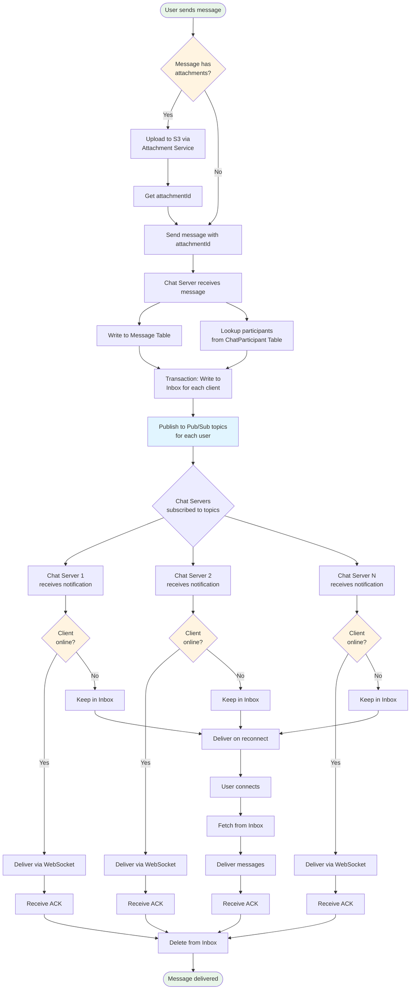

## Summary

This comprehensive WhatsApp system design covers:

1. ✅ **Core Functionality**: Group chats, messaging, offline delivery, media attachments
2. ✅ **Scalability**: Handling billions of users with pub/sub architecture
3. ✅ **Reliability**: Message persistence, acknowledgments, and guaranteed delivery
4. ✅ **Multi-device Support**: Client management and synchronization
5. ✅ **Performance**: Low latency (< 500ms) message delivery
6. ✅ **Architecture Patterns**: WebSockets, pub/sub, consistent hashing, object storage

The design evolves from a simple single-host solution to a distributed system capable of handling billions of users while maintaining low latency and high reliability.

---

*Document created from: [HelloInterview - Design WhatsApp](https://www.hellointerview.com/learn/system-design/problem-breakdowns/whatsapp)*
