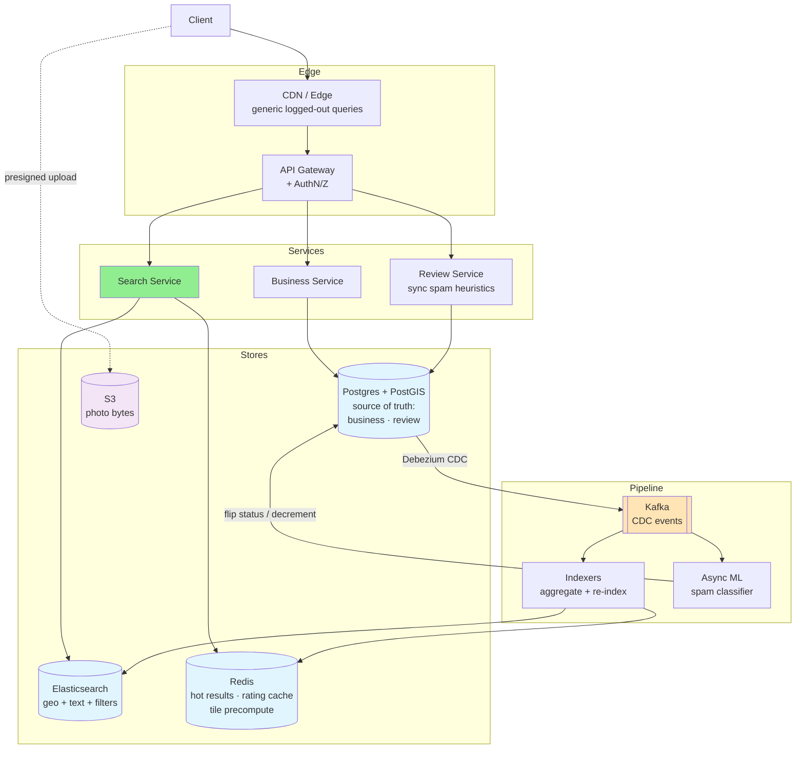
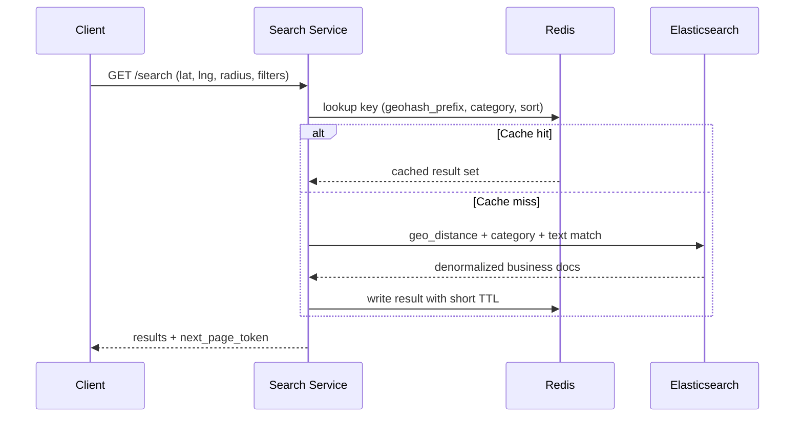
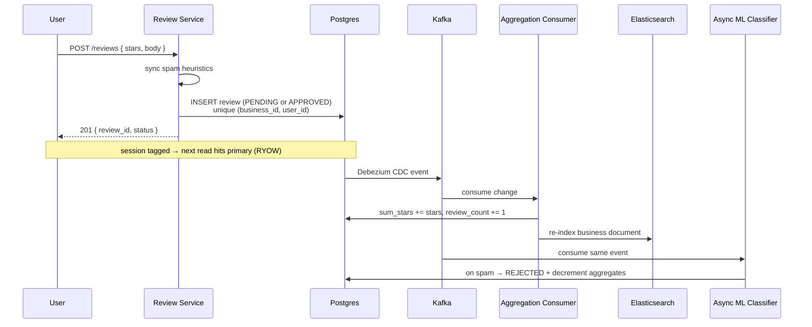
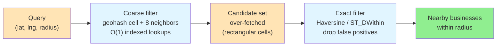
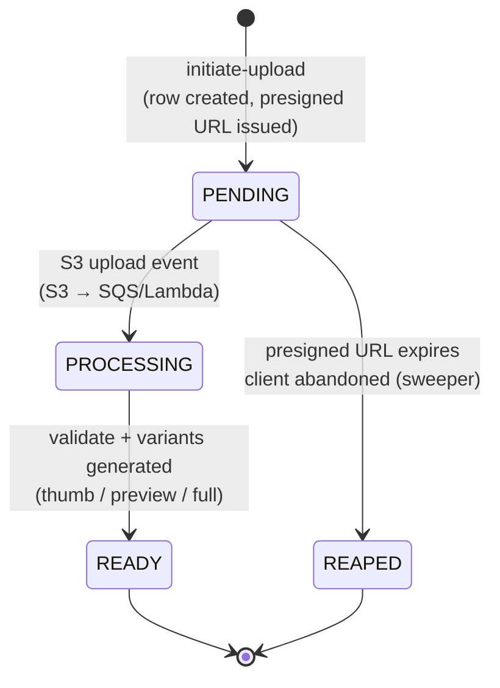
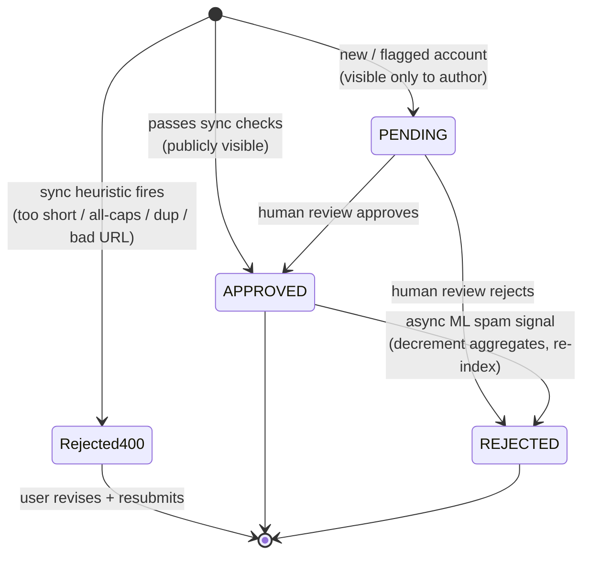

# 📍 Design Yelp

> **Pattern**: Geospatial Search / Reviews
> **Difficulty**: Medium
> **Source**: [hellointerview.com](https://www.hellointerview.com/learn/system-design/problem-breakdowns/yelp)

> **Summary**: Yelp is a local-business discovery platform where the dominant read pattern is a spatial-and-filtered search ("good ramen within half a mile that's open now") and the dominant write pattern is a trickle of reviews. The hard parts are answering radius queries over 10M businesses without a full scan (a two-stage geohash coarse filter plus Haversine exact filter), keeping `avg_rating` honest at scale (incremental `sum_stars`/`review_count` with a Bayesian average against review bombing), and serving hot metros under 500 ms p99 through layered caching and tile precomputation. The mature design pairs Postgres + PostGIS as the source of truth with Elasticsearch for combined geo+text search, a Redis cache/tile layer, S3 presigned photo uploads, and a CDC → Kafka pipeline that keeps aggregates, the search index, and async spam detection eventually consistent.

## 📋 Table of Contents
- [Understanding the Problem](#understanding-the-problem)
- [Layman's Explanation](#laymans-explanation)
- [Core Entities](#core-entities)
- [API Design](#api-design)
- [High-Level Design](#high-level-design)
- [Deep Dives](#deep-dives)
- [Scaling Journey: 0 to Infinity](#scaling-journey-0-to-infinity)
- [Insider Tips and Tricks](#insider-tips-and-tricks)
- [Expected Depth by Level](#expected-depth-by-level)
- [Related Concepts](#related-concepts)

---

## 🎯 Understanding the Problem

Yelp is a local-business discovery platform. A user standing on a street corner in San Francisco wants to answer "what good ramen is within half a mile of me that's open right now?" Under the hood this is a geospatial query joined with reviews, categories, and operating hours, sorted by a relevance signal. The primary read pattern is spatial-and-filtered search; the primary write pattern is a trickle of reviews and a slow cadence of business edits.

### Functional Requirements

**In scope (core):**
1. A user can search for businesses by name, geographic location (lat/long or city), and category.
2. A user can view a business detail page including its metadata, aggregate rating, and reviews.
3. A user can leave a review on a business with a required 1 to 5 star rating and optional text body.

**Out of scope:**
- Business owner/admin tooling for claiming or editing listings.
- An interactive map UI layer (we design the query API, not the map widget).
- Personalized ranking or recommendations.
- Reservations, ordering, or check-ins.

### Non-Functional Requirements

**In scope (core):**
- **Low read latency**: search results in under 500 ms p99.
- **High availability over strong consistency**: a stale review count for a few seconds is acceptable.
- **Scale target**: 100M daily active users and roughly 10M businesses.
- **Read-heavy workload**: reads dominate writes by orders of magnitude, which shapes every caching and indexing decision.

**Out of scope:**
- GDPR / data residency plumbing.
- Detailed disaster recovery and multi-region failover protocols.

---

## 🧒 Layman's Explanation

Picture the **community bulletin board at the corner coffee shop** — the one plastered with handwritten "best plumber in town" notes and curling flyers for the dumpling place two blocks over. Yelp is that bulletin board scaled to every street corner of every city on the planet. Or think of the **Michelin Guide**, except instead of a small army of anonymous inspectors handing down rankings once a year, anyone with an opinion and a phone can review anything, and the rankings reshuffle every single day. Better yet, imagine a friend who has eaten everywhere — the kind who, when you say "I'm at Union Square and I want Thai," instantly answers "walk three blocks to that little place on 16th, skip the one on the corner, the pad see ew is the move."

Several pieces of machinery quietly make that fantasy work. **Geospatial search** is how the system answers "Italian within 1 mile" without scanning ten million businesses — it carves the world into grid tiles using geohashes, R-trees, or H3 cells so a radius query becomes a handful of indexed lookups. **Reviews aggregation** is trickier than it looks: a single 5-star review is suspicious in a way that 500 reviews averaging 4.6 are not, so we use Bayesian averaging that pulls thin samples toward the global mean until enough evidence accumulates. **Photos** are heavy, so users upload directly to S3 and we serve resized variants through a CDN — the API never sees the bytes. **Search ranking** is a weighted blend of distance, ratings, review count, business hours, and recency, because a 4.8-star place ten miles away usually loses to a 4.2-star place half a mile away. And because money attracts mischief, **spam and fake-review detection** has to handle businesses paying for 5-stars, competitors planting 1-stars, and coordinated review-bombing — fast heuristics at write time and ML classifiers running asynchronously catch most of it.

### When the analogy breaks down

The friend-who-knows-everywhere picture skips a lot. Real Yelp runs a serious **content moderation** operation with human reviewers and policy appeals. It runs **sponsored ad auctions** so businesses can pay to appear above organic results, which adds a whole bidding and pacing system. It supports **business owner responses**, public replies that turn reviews into two-sided conversations. It tracks **check-ins**, geofenced presence signals that feed ranking and fraud detection. And it fights an ongoing **fake-review arms race** against review brokers, bot farms, and reputation-laundering services that evolve faster than any single ML model — the real defense is a continuously retrained pipeline plus human investigators, not a clever algorithm shipped once.

---

## 🔑 Core Entities

| Entity | Key Fields | Notes |
| --- | --- | --- |
| **Business** | business_id (PK), name, category_ids, lat, lng, address, phone, hours, hours_utc_offset, avg_rating, review_count, sum_stars | Geospatial row; avg_rating is derived from sum_stars/review_count for exact arithmetic. hours_utc_offset enables correct "open now" filtering. |
| **Review** | review_id (PK), business_id (FK), user_id (FK), stars (1-5), body, created_at, status (pending/approved/rejected) | Unique (business_id, user_id) to prevent duplicate reviews per user. Status field supports spam-hold workflow. |
| **User** | user_id (PK), name, email, created_at, account_age_days, review_count | account_age_days and review_count feed reviewer quality scoring for Bayesian weighting. |
| **Location** | Usually modeled as (lat, lng) on Business, optionally normalized as city_id / neighborhood_id for named-location searches. | A secondary Location table is useful if we want "search in Mission District" style queries. |
| **Photo** (supporting) | photo_id, business_id, user_id, s3_key, status (pending/ready), created_at | Stored as metadata; bytes live in object storage. Multiple resolution variants tracked by separate keys or a variants JSON column. |

---

## 🔌 API Design

A small, REST-style surface is enough. The search endpoint is the hot path.

```
GET /v1/businesses/search
  ?query={string}           # optional name substring
  &lat={float}&lng={float}  # center of the search
  &radius={meters}          # defaults to e.g. 5000
  &category={string}        # optional
  &open_now={bool}          # filter to currently open businesses
  &sort={relevance|rating|distance}
  &page_token={opaque}
-> 200 {
     results: [{ business_id, name, category, distance_m, avg_rating, review_count, thumbnail_url, is_open }],
     next_page_token
   }
```

```
GET /v1/businesses/{business_id}
-> 200 { business_id, name, category, lat, lng, address, hours, hours_utc_offset,
         avg_rating, review_count, photos: [...], top_reviews: [...] }
```

```
POST /v1/businesses/{business_id}/reviews
  Authorization: Bearer <jwt>
  Body: { stars: 1..5, body?: string, photo_ids?: [string] }
-> 201 { review_id, created_at, status }
  409 if the user already has a review for this business
```

```
GET /v1/businesses/{business_id}/reviews
  ?page_token=&sort={newest|highest|lowest|helpful}
-> 200 { reviews: [...], next_page_token }
```

```
POST /v1/photos:initiate-upload
  Body: { business_id }
-> 200 { photo_id, upload_url, upload_fields }   # S3 presigned POST

POST /v1/photos/{photo_id}:finalize
-> 200 { photo_id, url }
```

Notes:
- User identity is pulled from the JWT, never from the request body, so clients cannot impersonate reviewers.
- Pagination is cursor-based; offset pagination falls apart at scale when results shift.
- The `open_now` filter must use the business's local timezone (via `hours_utc_offset`), not the caller's timezone.

---

## 🏗️ High-Level Design



Photos upload directly to S3 via presigned URLs, so the API servers never see the bytes. CDC from Postgres flows through Kafka to indexers that update Elasticsearch and Redis. Spam detection runs synchronously (lightweight heuristics) and asynchronously (ML) before a review becomes publicly trusted.

**Request flow for search:**
1. Client hits `/search` with lat, lng, radius, filters.
2. Search service checks Redis for a cache key derived from (geohash_prefix, category, sort).
3. On miss, it queries Elasticsearch using a `geo_distance` filter plus category and text match, then writes the result into Redis with a short TTL.
4. Business and review data in results come pre-denormalized in the Elasticsearch document so we do not fan out to the DB per hit.



**Request flow for review write:**
1. Review service validates the user, runs lightweight spam heuristics synchronously (reject immediately on obvious spam).
2. New accounts or flagged accounts have the review inserted in `PENDING` status; others go straight to `APPROVED`.
3. Insert into Postgres with a unique `(business_id, user_id)` constraint. The submitting user's session is flagged to route the next read to the primary (read-your-own-write).
4. A CDC stream (Debezium on Postgres WAL) emits the change to Kafka.
5. A consumer updates the business's `sum_stars` and `review_count` incrementally, recomputes `avg_rating`, and re-indexes the Elasticsearch document.
6. An async ML-based spam classifier consumes from the same Kafka topic and may flip the review to `REJECTED` and decrement aggregates.



---

## 🔬 Deep Dives

### 1. Geospatial Search by Radius

The central question: given `(lat, lng, radius)`, return nearby businesses efficiently.

**The two-stage production pattern:**

Naive approaches apply a single `geo_distance` filter directly over all businesses. This works at small scale but degrades as the dataset grows because every candidate must be scored. Production systems split the lookup into two stages:



1. **Coarse filter via geohash cells.** Encode each business's lat/lng as a base-32 geohash string where a shared prefix implies spatial proximity. The geohash is indexed as a string column. To search within radius, compute the geohash cell of the center point at the appropriate precision, then query that cell plus the 8 neighboring cells. This is an O(1) indexed key lookup per cell — 9 total — and eliminates the full-scan portion of the query.

2. **Exact filter via Haversine distance.** The candidate set from step 1 over-fetches: geohash cells are rectangular, and cell edges extend beyond the circular radius. Apply Haversine (or PostGIS `ST_DWithin` with `geography` type) on the candidate set to eliminate false positives. This is cheap because the candidate set is already small.

**Choosing geohash precision:**

Geohash precision level 5 covers roughly 5 km × 5 km. Too coarse for dense city centers (returns thousands of businesses per cell); too fine for suburban areas (adjacent cells may be empty). The correct production behavior is adaptive:

- Start at a target precision (e.g., level 6, about 1.2 km × 0.6 km).
- If the result count after coarse filter is below a minimum threshold, drop one precision level to expand coverage, or query the next ring of neighboring cells.
- Always query all 8 neighbors of the center cell regardless of precision, because a user standing at a cell boundary would otherwise miss businesses 1 meter away in the adjacent cell.

**Comparison of underlying index options:**

| Approach | Pros | Cons |
| --- | --- | --- |
| Bounding box on B-tree lat/lng | Simple, no extension | Poor composite selectivity; still needs Haversine post-filter |
| Geohash string index | Works in any SQL/KV store; doubles as cache key | Rectangular cells; must handle neighbors manually |
| PostGIS GiST (R-tree) | True 2D spatial; handles sphere, poles, antimeridian | Requires PostGIS extension |
| Elasticsearch `geo_point` + `geo_distance` | Combines geo, text, facets in one query | Separate system to keep in sync |

**Recommendation:** Postgres + PostGIS as source of truth for exact distance and correctness (especially near the 180th meridian and poles where geohash neighbor logic breaks). Elasticsearch as the read-optimized search index combining geo with text and category filters. Geohash as the Redis cache key for hot search results.

**Edge cases worth calling out:**
- Use the `geography` type in PostGIS (not `geometry`) to get accurate meter-level distances on a sphere.
- At the 180th meridian and at the poles, geohash neighbor computation breaks. PostGIS handles these natively.
- Radius searches in dense areas like Manhattan return thousands of candidates. Always paginate, cap radius, and impose a maximum result count.

> ⚠️ **Always query the 8 neighboring cells, not just the center cell.** A user standing exactly on a cell boundary would otherwise miss a business 1 meter away in the adjacent cell. And near the 180th meridian and the poles, geohash neighbor computation breaks entirely — lean on PostGIS, which handles these natively.

### 2. Review Aggregation

Each business detail and each search hit shows `avg_rating` and `review_count`. Computing these on the fly is prohibitive at 10M businesses with hundreds of millions of reviews.

**Approach: incremental denormalization with exact arithmetic.**

Store `sum_stars` (integer) and `review_count` (integer) as columns on the Business row. Never store a floating-point running average directly — floating-point drift accumulates with enough updates. Compute `avg_rating = sum_stars / review_count` on read or when re-indexing.

On review insert, update in the same transaction:
```sql
UPDATE business
SET review_count = review_count + 1,
    sum_stars    = sum_stars + :new_stars
WHERE business_id = :id;
```

For edits (star change from old to new):
```sql
UPDATE business SET sum_stars = sum_stars - :old_stars + :new_stars WHERE business_id = :id;
```

For deletes:
```sql
UPDATE business
SET review_count = review_count - 1,
    sum_stars    = sum_stars - :deleted_stars
WHERE business_id = :id;
```

**The Bayesian average problem.**

Displaying a raw average is naive. A business with one 5-star review ranks above a business with 500 reviews averaging 4.8. Apply a Bayesian average to pull ratings toward the global mean when sample size is small:

```
bayesian_avg = (global_mean * C + sum_stars) / (C + review_count)
```

where `C` is a confidence constant (typically 10-50, tuned empirically). Store `sum_stars` and `review_count` and compute this on indexing; do not try to store the Bayesian average directly since `C` and `global_mean` change over time.

**Handling review bombing.**

A competitor can organize hundreds of fake 1-star reviews overnight. Three mitigations:
1. **Velocity detection**: a spike in review count for a business within a short window (e.g., >20 reviews/hour) triggers a hold on those reviews and routes them to a human review queue.
2. **Reviewer quality weighting**: new accounts (low `account_age_days`, zero prior reviews) contribute less to the aggregate. Weight each review's star contribution by the reviewer's quality score rather than counting all reviews equally.
3. **Bayesian average dampening**: the `C` term in the Bayesian average automatically limits the damage from a small burst of low-quality reviews by requiring a large sample size before the mean moves significantly.

**Async aggregation at scale.**

At high write volume, in-transaction aggregate updates create lock contention on heavily-reviewed businesses. Move aggregation off the write path:
- Review service inserts the review row only.
- A Kafka consumer reads the CDC event and updates `sum_stars`/`review_count` on the Business row with an idempotent upsert keyed on `review_id`.
- The same consumer triggers re-indexing in Elasticsearch.
- Lag is typically seconds; acceptable given the eventual-consistency NFR.

### 3. Caching Popular Locations

Most search traffic is not uniform across the globe. A small number of metros (NYC, SF, LA, London, Tokyo) generate the majority of queries.

**Separate cache TTLs by data change rate.**

Business metadata (name, address, phone, hours, categories) changes at most a few times per year. Aggregate ratings change with every new review. Mixing them in one cached object forces the shorter TTL on all attributes. Keep them separate:

- Business profile cache: 24-hour TTL.
- Rating summary cache (avg_rating, review_count): 5-minute TTL.

**Layered cache strategy:**
1. **Edge cache / CDN** for logged-out, generic queries keyed by `(geohash_prefix, category, open_now_bucket)`. TTL in minutes; invalidated on business or review changes in the region.
2. **Redis** in front of Elasticsearch, keyed by the normalized query parameters. For hot cities, precompute and prewarm the top N queries (e.g., "top 50 restaurants near Union Square") nightly.
3. **Application-level memoization** for the business detail page — cache the fully assembled response for a few seconds.

**Tile-based precomputation:**

For each geohash cell at a chosen precision (e.g., 6-char geohashes, about 1.2 km × 0.6 km), precompute the top businesses per category and store in Redis. A radius search becomes "find the covering tiles, union their precomputed top lists, filter by exact distance, re-rank." This turns the hot path into a handful of KV lookups and avoids hitting Elasticsearch for the most common queries.

**Invalidation and thundering herd prevention:**

- Driven by the CDC stream: when a business or review changes, compute its geohash tile and publish an invalidation message. A small fan-out to neighboring tiles keeps radius queries correct.
- Use single-flight (request coalescing) in the search service: if 1,000 concurrent requests all miss the same expired tile, only one request fires the cache fill; the rest wait and reuse the result. Without this, a popular tile expiry triggers a thundering herd on Elasticsearch.

### 4. Photo Uploads

Uploading photo bytes through your API servers is a waste of bandwidth and a scaling anti-pattern. Let clients talk to object storage directly.

**Flow:**
1. Client calls `POST /v1/photos:initiate-upload` with `business_id`.
2. Server creates a `Photo` row in `PENDING` state and returns an **S3 presigned POST URL** with a short expiry (e.g., 15 minutes), a max content-length, and an allowed content-type.
3. Client PUTs the bytes straight to S3.
4. S3 fires an event (S3 -> SQS or S3 -> Lambda) on successful upload.
5. A worker validates the object (size, content-type sniff, EXIF scrub for privacy). It then generates multiple resolution variants — thumbnail (100×100), preview (400×400), full (1200×900) — via an async image processing pipeline using ImageMagick or libvips. All variants are stored under separate S3 keys. The worker moves state to `READY` and writes CloudFront URLs for each variant onto the Photo row.
6. Client either polls `GET /v1/photos/{id}` or receives a push notification before displaying the photo.



**Why never serve raw uploads directly:**
- Raw user photos are typically 5–10 MB each. Serving them directly from S3 at scale crushes CDN egress costs and slows page loads.
- The async pipeline allows NSFW detection and moderation before variants become publicly accessible.
- The original file is retained in a private S3 bucket for reprocessing if variant parameters change.

**Why this matters for the API servers:**
- API servers never see the bytes, so uploads do not cap API throughput.
- S3 handles durability (11 nines) and multipart uploads for large files.
- CloudFront serves the thumbnails globally with edge caching.
- Orphaned `PENDING` rows (client abandoned after getting the presigned URL) are reaped by a sweeper after TTL.

### 5. Search Ranking

Returning nearby businesses is not the same as returning *useful* results. A 4.8-star restaurant 10 miles away is often less useful than a 4.2-star restaurant 0.5 miles away. Search ranking for local businesses is a multi-factor scoring function:

- **Distance**: exponential decay — businesses farther than the radius receive a steeply penalized score rather than a hard cutoff. This prevents a cliff-edge where moving 1 meter past the radius boundary drops a business from the list entirely.
- **Rating quality**: weighted by review count via Bayesian average (see Review Aggregation). Raw average star ratings without volume weighting heavily favor low-review-count outliers.
- **Text relevance**: BM25 match score against business name, category tags, and indexed review text. Elasticsearch's default `_score` is a reasonable starting point.
- **Recency**: recent reviews signal an active business. A business with 200 reviews from 2018 and zero since is treated differently from one with 200 recent reviews.
- **Popularity signals**: click-through rate from search results, check-in count, and direction requests are implicit quality signals that reinforce high-ranking businesses.

The formula roughly:
```
score = α * distance_decay(d)
      + β * bayesian_avg_rating
      + γ * text_relevance_score
      + δ * recency_boost
      + ε * popularity_signal
```

Weights (α, β, γ, δ, ε) are not tuned by intuition — they are determined by A/B testing on user engagement metrics (click rate, "directions" tap, call tap). Getting the weights wrong is a product problem, not just an engineering one.

### 6. Consistency for Review Writes

**Two different consistency requirements coexist.**

When a user submits a review, they expect to see it immediately on the business page — "read your own write" (RYOW) consistency. Other users can tolerate seeing the new review with a 30–60 second delay (replica lag + CDC propagation + cache TTL).

Implementing synchronous replication to satisfy RYOW for all users is expensive and unnecessary. Instead:

- After the review write commits on the primary, tag the submitting user's session (e.g., set a short-lived cookie or in-memory flag) indicating "this user has a pending write."
- Route that user's next business page request to the **primary DB** directly, bypassing read replicas and the Redis cache for the review list. The user sees their review immediately.
- All other users continue reading from replicas and cache. They see the review once the CDC propagation completes and the cache TTLs expire.

This satisfies RYOW for the only user who needs it without requiring synchronous replication everywhere.

**Why this matters in the interview:**

Naive designs either (a) always read from primary (unnecessary load) or (b) accept that the submitting user sees a stale page (bad UX). The session-tagged primary routing is the nuanced answer that demonstrates awareness of both the consistency requirement and its cost.

### 7. Spam and Abuse Detection

**Run lightweight detection synchronously, heavy detection asynchronously.**

If a spam review reaches the public index, users see it during the moderation window (which can be hours or days for async-only pipelines). The correct pipeline is two-tiered:




**Synchronous layer (at write time):**
- Apply fast heuristics: review body too short (< 10 chars), all-caps text, duplicate text already in the system, suspicious URLs, profanity.
- If any heuristic fires, reject with a 400 response immediately. The user can revise and resubmit.
- New accounts (created < 7 days ago, fewer than 2 prior approved reviews) have reviews held in `PENDING` status — visible only to the author — rather than rejected outright.

**Asynchronous layer (post-write):**
- A Kafka consumer sends the review text and reviewer metadata to an ML classifier.
- The classifier evaluates more expensive signals: semantic similarity to known spam templates, reviewer network graph (coordinated campaigns show unusual patterns), review velocity for the target business.
- On a spam signal, transition the review from `APPROVED` to `REJECTED`, decrement the aggregate counts, and re-index Elasticsearch.
- High-confidence spam is auto-rejected; borderline cases route to a human review queue.

**Review velocity detection for bombing:**
A separate consumer tracks a rolling window of review counts per business. If the count exceeds a configurable threshold (e.g., >30 reviews in 1 hour for a business that typically receives 1 per day), it triggers an automatic hold on all new reviews for that business and alerts the trust-and-safety team.

---

## 📈 Scaling Journey: 0 to Infinity

This is the Yelp-specific scaling arc: where do you start, and what breaks next?

```mermaid
graph LR
    S1["Stage 1<br/>0–100 users<br/>Monolith + Postgres<br/>Haversine in SQL"]
    S2["Stage 2<br/>100–1K<br/>PostGIS + GiST<br/>read replica + Redis"]
    S3["Stage 3<br/>1K–100K<br/>Split services<br/>Elasticsearch + CDC/Kafka"]
    S4["Stage 4<br/>100K–10M<br/>Tile precompute<br/>async agg + ML spam"]
    S5["Stage 5<br/>10M+<br/>Regional sharding<br/>cross-region federation"]

    S1 -->|"bounding-box scan too slow"| S2
    S2 -->|"geo+text mix, hot metros saturate"| S3
    S3 -->|"hot-city spikes melt single ES"| S4
    S4 -->|"cross-ocean latency + data residency"| S5

    style S1 fill:#FFB6C1
    style S3 fill:#FFE4B5
    style S5 fill:#90EE90
```



### Stage 1: 0 to 100 Users

**Goal:** ship something end-to-end and get real usage.

**Architecture:**
- Single region, single VM (or one container) running a monolithic API.
- Postgres on the same host, with a `businesses` table that stores `lat`, `lng` as plain numeric columns.
- No cache. No search engine. Distance computed in SQL with Haversine over a bounding-box prefilter.
- Photos uploaded to S3 with presigned URLs from day one (this is cheap and avoids painful migration later).

**What you skip:** PostGIS, Elasticsearch, Redis, CDC, sharding, multi-region, prewarming, fancy pagination, spam ML.

**Failure mode that forces the next stage:** queries beyond a small dataset start to take hundreds of milliseconds because Haversine across a bounding box scans too many rows and the review list on a business page does a full table scan.

### Stage 2: 100 to 1K Users

**Goal:** keep p99 search under 500 ms on a real-but-small dataset.

**Architecture:**
- Enable the **PostGIS** extension. Store location as `geography(Point, 4326)` with a GiST index. Radius queries use `ST_DWithin`.
- Add B-tree indexes on `business.category`, `review.business_id`, and a unique `(business_id, user_id)` on `review`.
- Add `sum_stars` column to replace floating-point running average; compute `avg_rating` on read.
- Add a Postgres read replica; send search reads there.
- Introduce a small Redis for simple response caching on the business detail page (TTL 60 s). Use separate TTLs for business profile vs. rating summary.

**What you skip:** Elasticsearch, full text search beyond ILIKE/pg_trgm, CDC pipelines, tile precomputation, service decomposition, spam ML.

**Failure mode:** as the data set grows and users start typing partial names, search becomes a mix of geo + text + filter. PostGIS is great at geo, weaker at combined relevance ranking, and read replicas saturate on the hot metros.

### Stage 3: 1K to 100K Users

**Goal:** support filtered search (category, name substring, rating, open now) at low latency, and start protecting the write path.

**Architecture:**
- Split the monolith into **Search**, **Business**, **Review**, and **Photo** services behind an API gateway.
- Introduce **Elasticsearch**. Each business document contains a `geo_point`, category tags, denormalized `avg_rating`/`review_count`, hours with UTC offset, and text fields. Queries use `bool { must: match, filter: geo_distance + terms + range }`. The `open_now` filter is applied using the business's `hours_utc_offset`, not the caller's timezone.
- Introduce **Debezium** on the Postgres WAL, publishing to **Kafka**. Consumers project into Elasticsearch and maintain Redis caches.
- Maintain incremental `sum_stars` and `review_count` columns on Business. Aggregation update runs in the same transaction as review insert.
- Implement two-stage geospatial search: geohash coarse filter in Redis, then Haversine exact filter on the candidate set.
- Redis now caches search responses keyed by `(geohash6, category, sort)` with short TTLs. Separate keys for business profile and rating summary.
- Add synchronous lightweight spam heuristics at review submission. New account reviews go to `PENDING` status.

**What you skip:** tile precomputation, regional sharding, cross-region replication, Bayesian rating averaging, ML spam classifier.

**Failure mode:** hot cities (NYC, SF) dominate traffic. A single Elasticsearch cluster sized for average load melts during lunch/dinner rushes in those cities, and cache miss storms after invalidation are painful. Review bombing is a real risk without ML-level detection.

### Stage 4: 100K to 10M Users

**Goal:** absorb hot-city spikes, stabilize write throughput, and ensure a new review shows up within seconds.

**Architecture:**
- **Tile-based precomputation**: a batch job plus a streaming top-up job maintain per-geohash-cell top business lists per category in Redis. Most searches become "cover the radius with tiles, union, filter, done" without hitting Elasticsearch.
- **Adaptive geohash precision**: if a tile returns fewer than the minimum threshold of results, automatically drop one precision level or expand to the next ring of neighbors.
- **Request coalescing** (single-flight) in the search service to prevent thundering herds when a popular tile expires.
- **Async review aggregation**: move from in-transaction aggregate updates to a Kafka consumer that updates `sum_stars`/`review_count` and republishes to Elasticsearch. Removes lock contention on heavily-reviewed businesses.
- **Bayesian average** for star ratings, computed at index time. Prevents low-review-count businesses from distorting search rankings.
- **Review velocity detector** as a Kafka consumer: rolling-window count per business triggers bombing hold.
- **ML spam classifier** consuming from Kafka, capable of flipping review status post-publish.
- **RYOW consistency**: session-tagged primary routing for the submitting user's next read; all others read from replicas.
- **Write-behind indexing** with bounded lag SLOs; clients reading their own write get primary-backed data for a short window.
- **Sharded Postgres** for reviews by `business_id`; businesses themselves stay on a single cluster with read replicas since 10M rows is small.
- **Multi-AZ** for everything; Elasticsearch with replica shards sized for hot-city load.

**What you skip:** full regional sharding, independent stacks per continent.

**Failure mode:** cross-ocean latency becomes the ceiling. A user in Tokyo pays 150 ms of RTT to hit a US-East cluster before any work happens. Regulatory and data-gravity pressure to keep EU data in the EU starts mattering.

### Stage 5: 10M+ Users

**Goal:** global low-latency, regional isolation, and graceful degradation.

**Architecture:**
- **Regional sharding by metro/continent**. Businesses are geographically static, so shard by a coarse geographic key (e.g., continent + country + metro bucket). Each region owns its slice of businesses and reviews end-to-end: Postgres, Elasticsearch, Redis, workers.
- **Geo-DNS / anycast routing** sends users to their nearest region. Cross-region searches (rare: "restaurants near this address I'm about to travel to") are handled by a thin cross-region federation layer that scatter-gathers across regions.
- **Global business directory** (small, slowly changing) is replicated to every region so name-only searches can hit locally. Reviews are regional and not replicated globally.
- **CDN-fronted precomputed tiles** for logged-out, generic queries. A search like "coffee near Times Square" may never reach your origin.
- **Tiered storage for reviews**: hot reviews (recent, most helpful) live in Postgres + Elasticsearch; cold reviews (multi-year-old, low-signal) migrate to a cheaper store and are lazily loaded.
- **Chaos testing** for the failure modes that now matter: region failover, Kafka lag spikes, Elasticsearch shard loss, graceful fallback from Elasticsearch to PostGIS.

**What you skip:** nothing meaningful at this scale; the work becomes operational (SLOs, cost, spam/fraud, ranking quality) rather than architectural.

**Failure mode:** not a stage boundary anymore — the system now degrades gracefully under load (serving slightly stale tiles, falling back to PostGIS when Elasticsearch is unhealthy) rather than collapsing.

---

## 💡 Insider Tips and Tricks

### Geospatial Search Uses a Two-Stage Approach: Coarse Filter Then Rank

A naive "find businesses within 5 miles" query with PostGIS/Elasticsearch `geo_distance` works at small scale but becomes slow at millions of businesses. Production uses two stages: (1) retrieve all business IDs within the geohash cells overlapping the radius — an indexed lookup in O(1); (2) apply exact Haversine distance filtering on the candidate set. The geohash stage is the fast coarse filter; the Haversine stage eliminates false positives from cell-edge overselection.

### Geohash Cell Size Must Balance Precision and Result Set Size

Geohash precision level 5 covers ~5 km × 5 km areas. Too coarse for dense city centers (returns thousands of businesses); too fine for suburban areas (returns zero results if the business is in the adjacent cell). Production systems use adaptive precision: start at a specific precision, if result count < threshold, expand to adjacent cells or drop one precision level. Always query the 8 neighboring cells of the user's cell to handle boundary cases.

### Review Aggregation Must Handle the "Review Bombing" Problem

A competitor can organize hundreds of fake 1-star reviews overnight. Production systems apply: (1) review velocity detection (spike in reviews in short window triggers human review queue); (2) reviewer quality score (new accounts with no other reviews are weighted lower); (3) Bayesian average for star ratings (pulls extreme ratings toward the mean when sample size is small, preventing 1-review businesses from showing as 5.0). Displaying a raw average star rating is naive.

### Business Metadata Changes Slowly — Cache It Aggressively

Business name, address, phone, hours, and categories change at most a few times per year. Review counts and aggregate ratings change more frequently (per new review). These have different caching TTLs: business metadata can be cached for 24 hours; aggregate ratings for 5 minutes. Mixing them in one object forces the shorter TTL on all attributes. Separate the business profile (slow, cacheable) from the rating summary (faster-changing, shorter TTL).

### The "Open Now" Filter Requires Time Zone Awareness

Filtering for businesses "open now" requires knowing the local time at the business location, not the user's timezone. A search for "open now" from New York for a San Francisco business at 8pm EST (5pm PST) must use PST business hours. Store business hours with the UTC offset of the business location, not the user's timezone. This is a common bug in naive implementations.

> 💡 **Store `hours_utc_offset` on the business row, not the caller's timezone.** The `open_now` filter must resolve "now" in the business's local time — a New Yorker searching an 8pm EST for a San Francisco spot is really asking about 5pm PST. Anchoring on the caller's clock is a classic naive bug.

### Photo Storage Requires Multiple Resolution Variants

Users upload raw photos (5–10 MB each). Serving these directly would crush bandwidth and slow page loads. On upload: generate multiple variants (thumbnail 100×100, preview 400×400, full 1200×900) via an async image processing pipeline (ImageMagick/libvips), store all variants in S3, serve via CDN. The original is kept for re-processing. Never serve raw user uploads directly.

### Search Ranking Blends Distance, Rating, Relevance, and Recency

A 4.8-star restaurant 10 miles away is often less useful than a 4.2-star restaurant 0.5 miles away. Search ranking for local businesses is a multi-factor function: distance (exponential decay), rating (weighted by review count via Bayesian average), text relevance (BM25 match against business name, categories, reviews), recency of reviews, and popularity signals (click rate, check-in count). Getting the weights right requires A/B testing on user engagement metrics (clicks, calls, directions).

### Write Your Own Review vs Seeing Others': Two Different Consistency Requirements

When a user submits a review, they expect to see it immediately on the business page ("read your own write" consistency). Other users can tolerate seeing the new review with a 30–60 second delay. Implement read-your-own-writes by routing the submitting user's next business page request to the primary DB (bypassing the replica lag). All other users read from replicas. This avoids requiring synchronous replication everywhere just to satisfy one consistency requirement.

### Spam Review Detection Must Run Before Indexing, Not After

If a spam review reaches the public index, users see it during the moderation window (hours to days). Run lightweight spam detection synchronously on review submission (simple heuristics: too-short, all-caps, duplicate text, suspicious links) and reject at write time. Run heavier ML-based spam detection asynchronously. Hold reviews from new accounts or flagged accounts in a "pending" state visible only to the author until approved.

---

## 🎓 Expected Depth by Level

| Area | Mid-Level | Senior | Staff+ |
| --- | --- | --- | --- |
| **Requirements** | Lists the three core functional requirements and basic NFRs. | Explicitly scopes out admin, map UI, recommendations; justifies eventual consistency. | Negotiates requirements; challenges the 500 ms budget and 100M DAU target with back-of-envelope math and questions the read/write ratio assumptions. |
| **API** | Defines CRUD endpoints with correct verbs and auth. | Uses cursor pagination, presigned S3 uploads, unique review constraint; returns denormalized fields to avoid fan-out. Adds `open_now` filter with timezone awareness. | Discusses idempotency keys for review posts, backward-compatible API evolution, rate limiting and abuse surface, RYOW session tagging. |
| **Data model** | Normalized Business/Review/User; stores lat/lng. | Adds composite unique `(business_id, user_id)`, `sum_stars`/`review_count` (not floating avg), PostGIS `geography` column, `hours_utc_offset`, review `status` field. | Argues about Bayesian average vs. raw mean, cold/hot review tiering, shard keys, reviewer quality score column, CDC contract with downstream consumers. |
| **Geospatial search** | Knows the bounding-box + Haversine approach. | Picks PostGIS with GiST; understands geohash as a cache key; knows why Elasticsearch helps for combined filters; describes two-stage coarse+exact pattern. | Compares geohash vs. quadtree vs. R-tree; handles 180th meridian, pole, and dense-city edge cases; designs tile precomputation with adaptive precision and neighbor expansion. |
| **Caching** | Adds a Redis in front of the DB with a TTL. | Caches by geohash key, uses separate TTLs for profile vs. rating data, invalidates on writes. | Designs multi-tier caching (CDN + Redis + tiles), single-flight for thundering herds, region-aware cache layout, prewarm strategy for hot cities. |
| **Review aggregation** | Computes average on the fly or stores average in the row. | Maintains `sum_stars`/`count` incrementally; avoids floating-point drift; describes Bayesian average for ratings. | Moves aggregation off the write path via Kafka; reasons about ordering, exactly-once via idempotent upserts, reprocessing, review bombing mitigations. |
| **Photos** | Mentions S3. | Uses presigned URLs end-to-end with a two-phase PENDING/READY state machine. Knows multiple resolution variants are required. | Adds event-driven post-processing (variant generation via libvips, NSFW moderation), orphan reaping, signed CDN URLs, EXIF scrub for privacy. |
| **Consistency** | Mentions availability vs. consistency tradeoff. | Knows replica lag is acceptable for most reads. | Designs RYOW via session-tagged primary routing; explains why synchronous replication for all reads is over-engineered; discusses review status state machine for spam holds. |
| **Spam/abuse** | Out of scope or a brief mention. | Describes synchronous lightweight heuristics at write time + PENDING status for new accounts. | Full two-tier pipeline: sync heuristics + async ML classifier; velocity detection for bombing; reviewer quality weighting in Bayesian average; human review queue routing. |
| **Scaling** | Read replicas and a cache. | Splits into services, introduces Elasticsearch and CDC, shards reviews by `business_id`. | Regional sharding by metro, cross-region federation for travel queries, global directory replication, degradation modes (Elasticsearch down -> PostGIS fallback), cost modeling. |
| **Failure modes** | Mentions availability. | Identifies hot-key, cache stampede, DB write contention, and review bombing. | Articulates SLOs per path, designs graceful fallback, plans for chaos/load testing, defines acceptable lag bounds per pipeline stage. |

---

## 📚 Related Concepts

- [Proximity Search](../SystemDesign/DeepDives/ProximitySearch.md) — geohash, quadtree, and R-tree index choices behind the two-stage radius query.
- [Data Indexing](../CoreConcepts/DataIndexing.md) — geohash string index vs. PostGIS GiST (R-tree) and B-tree lat/lng tradeoffs.
- [Caching](../CoreConcepts/Caching.md) — layered CDN + Redis + tile precompute, separate TTLs, and single-flight against thundering herds.
- [Redis](../CoreConcepts/Redis.md) — hot-result cache, rating summary cache, and geohash-keyed tile precomputation.
- [Elasticsearch](../SystemDesign/DeepDives/Elasticsearch.md) — combining `geo_point`, text (BM25), and category facets in one search query.
- [Kafka](../SystemDesign/DeepDives/Kafka.md) — the CDC pipeline that fans review changes to aggregation, re-indexing, and async spam classification.
- [Sharding](../CoreConcepts/Sharding.md) — sharding reviews by `business_id` and regional sharding by metro at global scale.
- [Data Modelling](../CoreConcepts/DataModelling.md) — `sum_stars`/`review_count` denormalization and the review `status` state machine.
- [Handling Large Blobs](../SystemDesign/Patterns/HandlingLargeBlobs.md) — presigned S3 uploads and variant generation for photos.
- [Scaling Reads](../SystemDesign/Patterns/ScalingReads.md) — read replicas, caching, and denormalization for a read-heavy workload.
- [Yelp (HelloInterview breakdown)](../SystemDesign/ProblemBreakdowns/Yelp.md) — the source breakdown this doc expands on.
