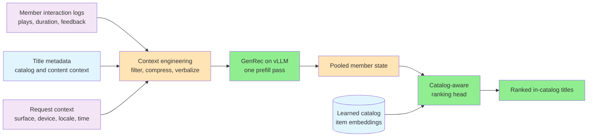
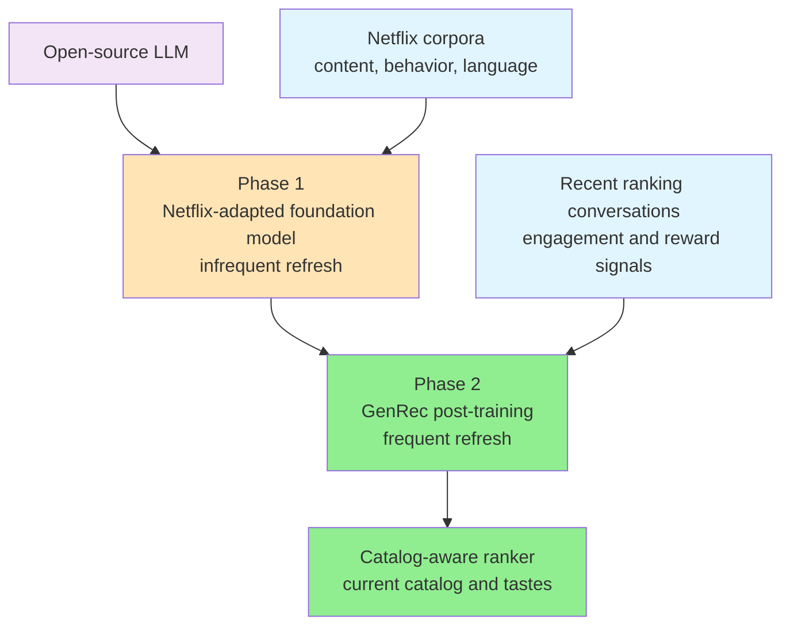
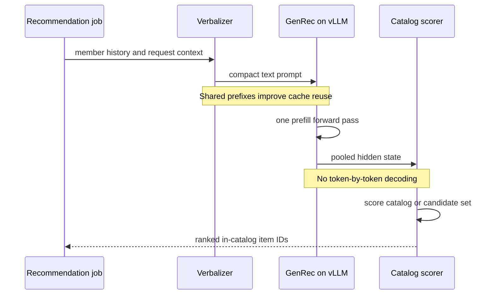
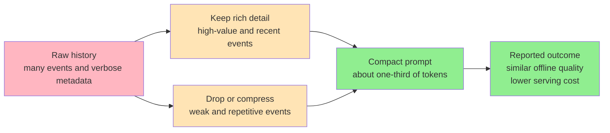

# Netflix GenRec In-the-Wild Note Implementation Plan

> **For agentic workers:** REQUIRED SUB-SKILL: Use superpowers:subagent-driven-development (recommended) or superpowers:executing-plans to implement this plan task-by-task. Steps use checkbox (`- [ ]`) syntax for tracking.

**Goal:** Add an interview-oriented case study explaining Netflix's GenRec architecture, training lifecycle, serving path, cost controls, tradeoffs, and reported results.

**Architecture:** Add one source Markdown document to the existing `LLD/SystemDesign/IntheWild/` collection. The site builder discovers it from its folder, derives `/in-the-wild/how-netflix-built-gen-rec-for-llm-native-recommendation/`, generates the table of contents, and pre-renders four original Mermaid diagrams, so no index or generated `site/` file is edited.

**Tech Stack:** Markdown, Mermaid, Node.js site tooling, Python documentation checker, Git

---

## File Structure

- Create `LLD/SystemDesign/IntheWild/HowNetflixBuiltGenRecForLlmNativeRecommendation.md`: the complete case study and all four inline Mermaid diagrams.
- Do not modify `LLD/SystemDesign/IntheWild/assets/`: the diagrams are original Mermaid blocks rather than copied image assets.
- Do not modify `site/`: it is generated and gitignored.

### Task 1: Author The GenRec Case Study

**Files:**
- Create: `LLD/SystemDesign/IntheWild/HowNetflixBuiltGenRecForLlmNativeRecommendation.md`
- Reference: `LLD/SystemDesign/IntheWild/HowDiscordMovedTrillionsOfMessagesToScylladb.md`
- Reference: `docs/superpowers/specs/2026-08-03-netflix-genrec-in-the-wild-design.md`

- [ ] **Step 1: Confirm the target is not already registered**

Run:

```bash
test ! -e "LLD/SystemDesign/IntheWild/HowNetflixBuiltGenRecForLlmNativeRecommendation.md"
```

Expected: exit code 0 with no output. If the file exists, stop and inspect it rather than overwriting concurrent work.

- [ ] **Step 2: Create the page shell and explanatory prose**

Create the document with this exact heading hierarchy. Do not add a hand-written table of contents because the build creates it from these headings.

```markdown
# 🎬 How Netflix Built GenRec for LLM-Native Recommendation

Originally published by Netflix Technology Blog in July 2026

> **Overview**: Netflix's mature recommendation stack depended on thousands of engineered signals and specialized models, making each new content type or product surface expensive to support. GenRec instead verbalizes member history and request context, processes that text with a Netflix-adapted foundation model, and uses a catalog-aware scoring head to rank only valid titles. The production design combines two-phase post-training, reward-weighted objectives, context compaction, and prefill-only inference to improve ranking quality while controlling GPU cost.

## 🧒 Layman's Explanation

## 🎯 The TLDR

## ⚠️ The Problem

### A mature ranker that was expensive to extend

### Why a generic LLM is not a recommender

### The actual ranking task

## 🛠️ The Solution

### Turn behavior into language

### Treat the context window as a feature budget

### Train in two phases

### Combine ranking, language, and reward objectives

### Score the catalog instead of generating titles

## 🚀 Serving GenRec at Netflix Scale

### One prefill pass, no autoregressive decoding

### Three controls on serving cost

## 📊 What Netflix Reported

### Offline and online results

### What the article does not disclose

## 📝 Conclusion

## 🎓 Key Takeaways

## 📚 Related Concepts
```

Fill those sections with concise original prose that covers all of the following facts and distinctions:

```text
Layman's explanation
- Use a video-store-clerk analogy: old system has thousands of handwritten index cards, GenRec reads a compact viewing story, then scores only titles physically on the shelves.
- Explain that Phase 1 teaches the clerk Netflix's catalog and audience, while Phase 2 refreshes current ranking behavior.
- Explain that one reading pass replaces writing a title word by word.

TLDR
- Raw interaction logs include plays, durations, feedback, adds, and abandons across surfaces.
- A verbalizer converts selected history, metadata, and request context into text.
- A Netflix-adapted decoder-only Transformer produces a pooled representation.
- A catalog-aware head scores learned item embeddings for the full catalog or a supplied candidate set.
- Training combines ranking, language modeling, and reward-weighted alignment.
- Serving uses vLLM in prefill-only mode plus smaller models and context compaction.
- Frame the reusable lesson as shifting feature engineering into context engineering without removing ranking constraints or cost engineering.

Problem
- Existing production models use thousands of handcrafted features and task-specific sequence, interaction, and multi-task components.
- Adding movies, series, games, live programming, podcasts, or a new surface can require coordinated feature, model, infrastructure, and experiment work.
- Generic LLMs may favor globally popular items, hallucinate unavailable titles, under-personalize, and ignore business constraints.
- The task maps member history plus device, surface, locale, and time context to a full-catalog or top-K ranking.
- The optimization target is expected long-term member utility, not clicks or starts alone.

Data and context engineering
- Training examples become single-turn or multi-turn conversations, where the user message contains verbalized context and the assistant message records actual engagement.
- Conversation output is used during training, but inference does not decode an assistant response.
- Retain rich detail for long plays and explicit positive feedback, omit weak events, compress repetitive behavior, elaborate selected cold-start items, and favor recent high-signal history.
- Arrange shared prompt prefixes to improve cache reuse.
- Context length is a quality and compute budget, analogous to a traditional feature budget.
- Attribute the claim that Netflix reduced tokens to about one-third with negligible offline ranking degradation.

Training
- Phase 1 starts from an open-source LLM and adapts it to Netflix content, member behavior, and language understanding.
- Phase 1 refreshes relatively infrequently and serves as a shared foundation.
- Phase 2 post-trains GenRec more frequently on ranking data so it follows catalog additions and changing tastes.
- Ranking loss promotes high-value positive engagements across the catalog or candidate set.
- Language-model loss preserves text understanding and future generation capabilities.
- Reward-weighted ranking loss uses long-term satisfaction proxies and behavior rebalancing signals.
- State that Netflix found RL-style methods promising but used reward weighting as the simpler, cheaper production approach described here.

Architecture and serving
- The decoder-only backbone produces a pooled hidden state representing current preference and context.
- The ranking head combines that state with learned item embeddings using a dot product or small MLP, as examples allowed by the source.
- Joint training updates the backbone, ranking head, and item embeddings.
- Catalog-aware scoring prevents out-of-catalog title generation.
- Full-catalog scoring can be replaced by sampled softmax or a candidate set at larger scale.
- vLLM performs one prefill pass and no token-by-token decode on this ranking path.
- The three cost controls are smaller or distilled models, aggressive context compaction, and prefill-only inference.
- Distinguish this path from a conversational LLM serving path.

Evidence and caveats
- Attribute every experimental number to Netflix.
- In one low-data configuration, GenRec used about 40 times fewer Phase-2 examples and improved offline MRR by about 1.6% over the production ranker.
- The four-week online test covered about 10% of Netflix traffic on batch-compute recommendation surfaces and improved reported short- and long-term metrics significantly.
- Phase 1 improved offline ranking by roughly 10-20% over the off-the-shelf base in reported ablations.
- Phase 2 added roughly 35-50% near the Phase-1 cutoff, growing to about 80% after two weeks as Phase 1 became stale.
- Larger tested backbones and more Phase-2 data improved offline MRR within the tested budgets.
- Netflix did not disclose exact latency, throughput, model dimensions, reward formulas, cache hit rates, failure behavior, or rollout topology.
- Do not imply that GenRec powers all Netflix recommendations.

Conclusion and takeaways
- Explain why this is not merely replacing one neural architecture with a Transformer.
- State that the design moves differentiation toward data, context, objectives, and inference optimization while retaining hard catalog constraints.
- Include at least six Key Takeaways bullets covering context as feature budget, two refresh cadences, constrained scoring, prefill-only inference, reward weighting, and evidence boundaries.
```

- [ ] **Step 3: Add the end-to-end architecture diagram**

Place this diagram after the TLDR:



- [ ] **Step 4: Add the two-phase training lifecycle diagram**

Place this diagram in `### Train in two phases`:



- [ ] **Step 5: Add the prefill-only inference sequence**

Place this diagram in `### One prefill pass, no autoregressive decoding`:



- [ ] **Step 6: Add the context quality-cost diagram**

Place this diagram in `### Treat the context window as a feature budget`:



- [ ] **Step 7: Add verified internal links and source attribution**

Use these exact entries under `## 📚 Related Concepts`:

```markdown
- [Vector Databases](../DeepDives/VectorDatabases.md) — candidate retrieval, learned item embeddings, and the common retrieve-then-rerank alternative to full-catalog scoring.
- [ChatGPT](../ProblemBreakdowns/Chatgpt.md) — GPU inference, vLLM, and autoregressive decoding, which contrasts with GenRec's prefill-only ranking path.
- [Facebook News Feed](../ProblemBreakdowns/FbNewsFeed.md) — multi-stage feed ranking and the broader system around a personalization model.
- [News Aggregator](../ProblemBreakdowns/NewsAggregator.md) — behavioral signals, candidate generation, personalization, and batch-computed feed assembly.
- [Scaling Reads](../Patterns/ScalingReads.md) — caching patterns relevant to GenRec's shared prompt prefixes and repeated batch-compute workloads.

---
*Source: [GenRec: Towards LLM-Native Recommendation at Netflix](https://netflixtechblog.com/genrec-towards-llm-native-recommendation-at-netflix-f20be6f643e3)*
```

- [ ] **Step 8: Check the source note structurally**

Run:

```bash
test "$(rg -c '^```mermaid$' "LLD/SystemDesign/IntheWild/HowNetflixBuiltGenRecForLlmNativeRecommendation.md")" -eq 4
test "$(rg -c '^## 🎓 Key Takeaways$' "LLD/SystemDesign/IntheWild/HowNetflixBuiltGenRecForLlmNativeRecommendation.md")" -eq 1
test "$(rg -c '^## 📚 Related Concepts$' "LLD/SystemDesign/IntheWild/HowNetflixBuiltGenRecForLlmNativeRecommendation.md")" -eq 1
! rg -n '^## .*Table of Contents' "LLD/SystemDesign/IntheWild/HowNetflixBuiltGenRecForLlmNativeRecommendation.md"
```

Expected: all commands exit 0 and print no matches.

- [ ] **Step 9: Render the new Mermaid diagrams**

Run:

```bash
node render-diagrams.mjs
```

Working directory: `tools/`

Expected: exit code 0 and the new document's four Mermaid blocks render without parse errors.

- [ ] **Step 10: Commit the source document promptly**

```bash
git add "LLD/SystemDesign/IntheWild/HowNetflixBuiltGenRecForLlmNativeRecommendation.md"
git commit -m "Add Netflix GenRec system design case study"
```

Expected: one new Markdown file is committed. Do not stage generated `site/` output or unrelated changes.

### Task 2: Validate Accuracy, Links, And Generated Output

**Files:**
- Verify: `LLD/SystemDesign/IntheWild/HowNetflixBuiltGenRecForLlmNativeRecommendation.md`
- Generated, inspect only: `site/in-the-wild/how-netflix-built-gen-rec-for-llm-native-recommendation/index.html`

- [ ] **Step 1: Audit claims against the approved accuracy constraints**

Run:

```bash
rg -n "40|1\.6%|10%|four-week|10-20%|35-50%|80%|one-third|candidate set|prefill|does not disclose" "LLD/SystemDesign/IntheWild/HowNetflixBuiltGenRecForLlmNativeRecommendation.md"
```

Expected: every experimental number appears in a sentence attributed to Netflix, candidate-set scoring is presented as an alternative, prefill is distinguished from decoding, and an explicit limitations paragraph is present.

- [ ] **Step 2: Build the site from source**

Run:

```bash
node build-site.mjs
```

Working directory: `tools/`

Expected: exit code 0 and the build reports the new In-the-Wild page without requiring an index edit.

- [ ] **Step 3: Verify the generated page contains the expected document features**

Run:

```bash
test -f "site/in-the-wild/how-netflix-built-gen-rec-for-llm-native-recommendation/index.html"
rg -n "How Netflix Built GenRec|Key Takeaways|Related Concepts|mermaid" "site/in-the-wild/how-netflix-built-gen-rec-for-llm-native-recommendation/index.html"
```

Working directory: repository root

Expected: the generated page exists and contains the title, takeaways, related concepts, and rendered-diagram markup. Do not edit this file.

- [ ] **Step 4: Run the site integrity checker**

Run:

```bash
node tools/check-site.mjs
```

Expected: exit code 0 with no broken links, missing assets, invalid anchors, or client-side build errors.

- [ ] **Step 5: Fix source-only issues and commit them separately if needed**

If Tasks 2.1-2.4 reveal a source issue, edit only `LLD/SystemDesign/IntheWild/HowNetflixBuiltGenRecForLlmNativeRecommendation.md`, rerun the failed command, then commit:

```bash
git add "LLD/SystemDesign/IntheWild/HowNetflixBuiltGenRecForLlmNativeRecommendation.md"
git commit -m "Fix Netflix GenRec note validation issues"
```

Expected: no commit is created if no fix was necessary. Never amend the Task 1 commit.

### Task 3: Run Every Repository Gate

**Files:**
- Verify only: repository source tree

- [ ] **Step 1: Run the DSA structure and C++ gate**

Run:

```bash
node tools/check-dsa.mjs
```

Expected: exit code 0. The unrelated DSA collection remains valid.

- [ ] **Step 2: Run the Python fence gate**

Run:

```bash
python3 tools/check-python.py
```

Expected: exit code 0. The new note has no untagged or invalid Python fences.

- [ ] **Step 3: Re-render all changed diagrams**

Run:

```bash
node render-diagrams.mjs
```

Working directory: `tools/`

Expected: exit code 0 with all four GenRec diagrams served from a successful render or content-hash cache.

- [ ] **Step 4: Rebuild the complete site**

Run:

```bash
node build-site.mjs
```

Working directory: `tools/`

Expected: exit code 0.

- [ ] **Step 5: Run the final site integrity gate**

Run:

```bash
node tools/check-site.mjs
```

Expected: exit code 0.

- [ ] **Step 6: Confirm the repository is clean**

Run:

```bash
git status --porcelain
```

Expected: no output. If unrelated pre-existing changes appear, report them without modifying or staging them. If the GenRec source remains modified, inspect, verify, and commit only that file before completion.
